# RHCE 8.0 课程：P20：防火墙基础与配置 🔥


在本节课中，我们将要学习 Linux 系统中的防火墙，特别是红帽企业版 Linux 8 中使用的 `firewalld` 服务。防火墙是系统安全的重要组成部分，它通过控制网络端口的访问来保护系统。我们将学习其核心概念、区域模型以及如何通过命令行和图形界面进行配置。

## 防火墙概述与前期准备

上一节我们介绍了课程安排，本节中我们来看看防火墙的基础知识和配置前的准备工作。

防火墙在考试中常见的应用场景是控制服务的访问。例如，允许一部分用户通过 SSH 访问，而拒绝另一部分用户。

除了 `firewalld`，系统还有其他访问控制机制，例如 TCP Wrappers。它通过两个文件进行控制：
*   `/etc/hosts.allow`：白名单。
*   `/etc/hosts.deny`：黑名单。

其规则是“允许优先”。如果 `hosts.allow` 文件中有配置，则只允许该文件中的用户访问；如果该文件未配置，则检查 `hosts.deny` 文件。这部分在 SSH 章节已详细讲解，此处不再演示。

现在，我们主要关注 `firewalld` 服务。首先，我们需要启动并设置它开机自启，这是企业环境中的常见做法。

```bash
# 查看防火墙状态
systemctl status firewalld

# 启动防火墙服务
systemctl start firewalld

# 设置防火墙开机自启
systemctl enable firewalld
```

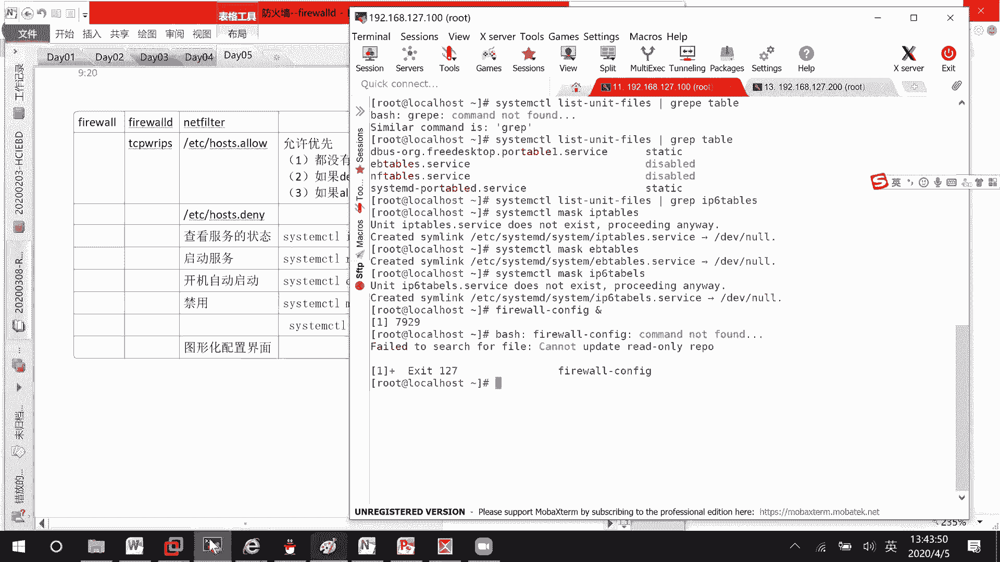

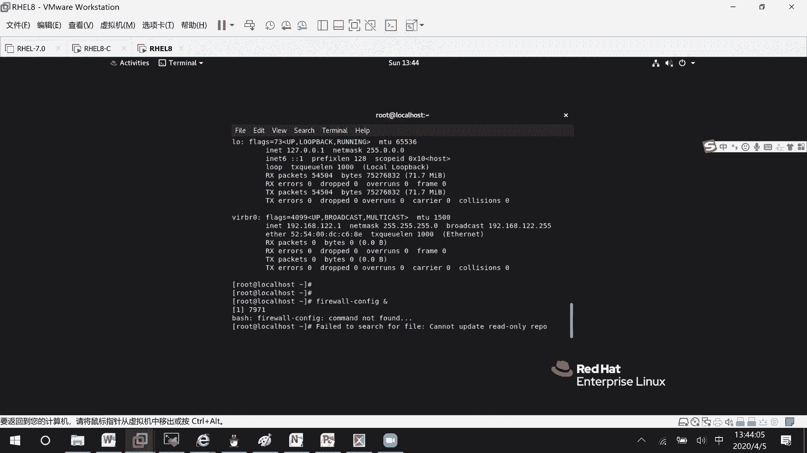

为了避免与其他防火墙工具（如 `iptables`、`ebtables`）冲突，可以将它们禁用。这在考试中不是必须的，但可以避免潜在的干扰。

```bash
# 禁用 iptables 和 ebtables 服务
systemctl mask iptables
systemctl mask ebtables
```

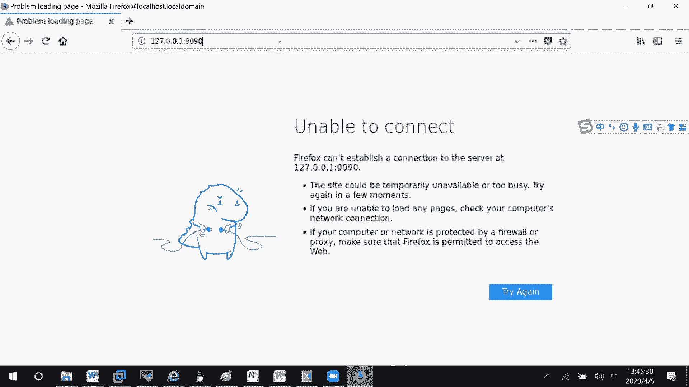

## 图形化配置界面 🖥️

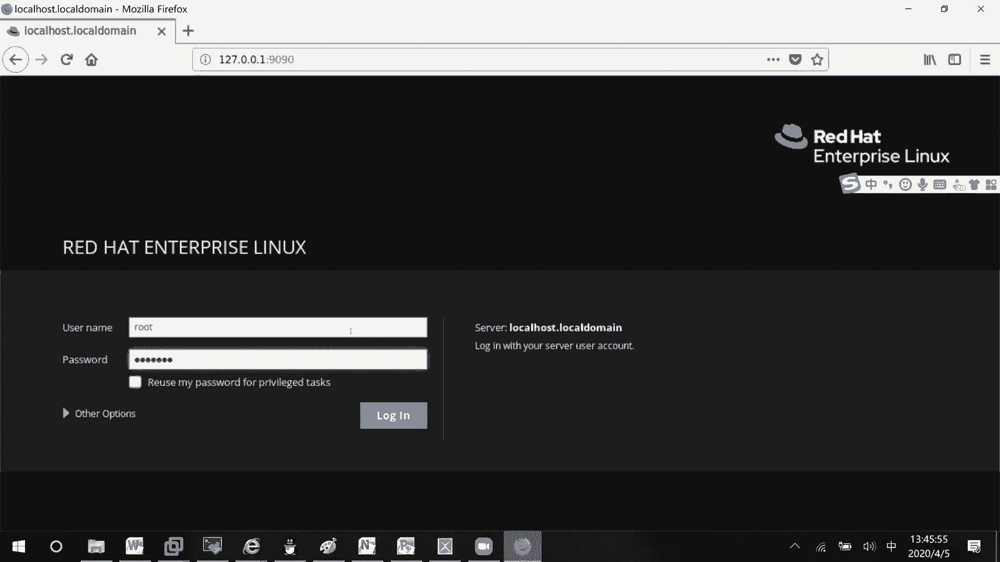

上一节我们完成了命令行下的基本设置，本节中我们来看看如何使用图形化界面配置防火墙。

在 RHEL 8 中，传统的 `firewall-config` 命令可能无法直接使用。系统提供了一个集成的 Web 管理界面：Cockpit。默认情况下，Cockpit 服务是关闭的，需要手动启动。

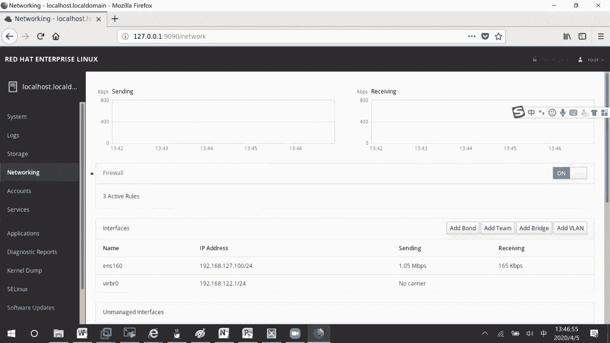

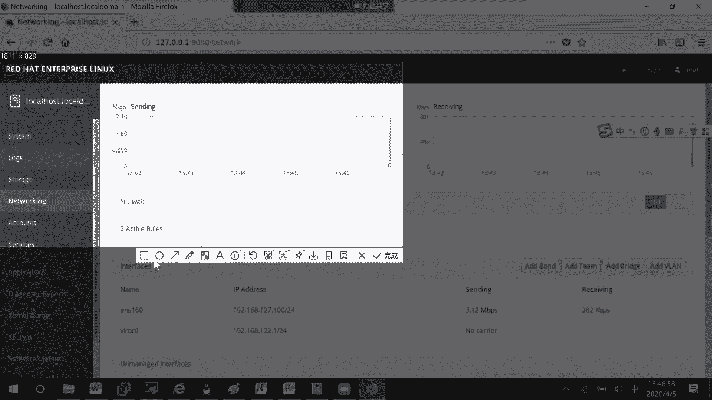

```bash
# 启动 Cockpit 服务
systemctl start cockpit

# 设置 Cockpit 服务开机自启（可选）
systemctl enable cockpit
```

启动后，在浏览器中访问服务器的 `9090` 端口（例如：`https://服务器IP:9090`）。首次访问可能会提示证书不安全，选择“高级”并继续访问即可。

使用系统用户（如 `root`）登录后，即可进入 Cockpit 管理界面。在这里，你可以：
*   查看系统状态、日志和存储信息。
*   管理用户账户。
*   管理各种系统服务（启动、停止、禁用）。
*   在 **Networking** 部分配置防火墙。
*   管理 SELinux 状态。
*   进行系统诊断和软件更新。

这个界面非常直观，例如要开放一个端口，只需在相应区域添加服务或端口号即可。Cockpit 默认已经开放了 `9090` 端口供自身访问，就像 SSH 服务默认开放 `22` 端口一样。

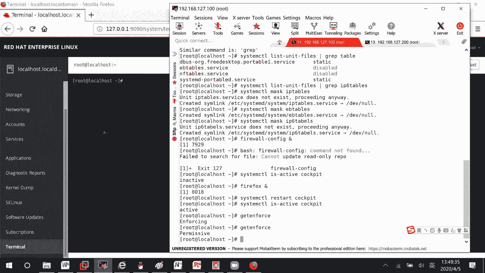

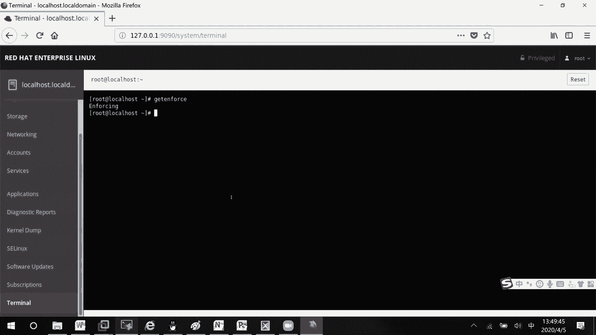

## 防火墙的核心概念：区域 (Zone) 🗺️

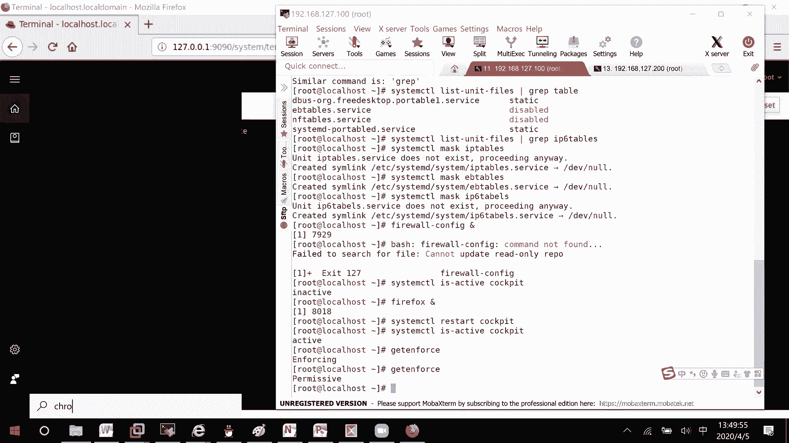


了解了图形界面后，我们需要深入理解防火墙的核心逻辑。本节中我们来学习“区域”的概念。

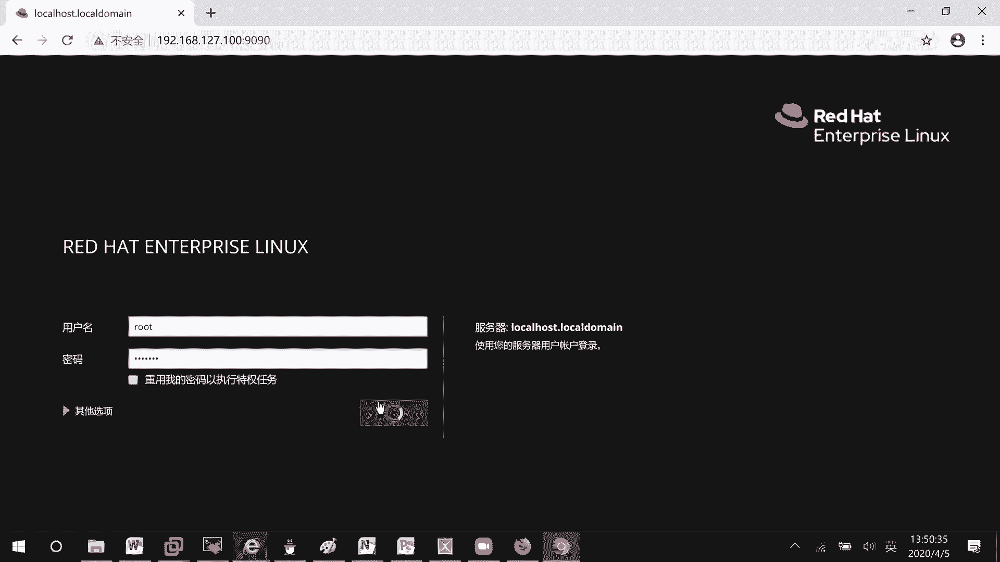

“区域”是 `firewalld` 中一个非常重要的概念。你可以将其理解为一组预定义或自定义的**规则集合**。服务器上可能有多个网络接口（网卡），每个接口可以被分配到一个特定的区域。数据包从某个接口进入时，就会受到该接口所属区域的规则约束。

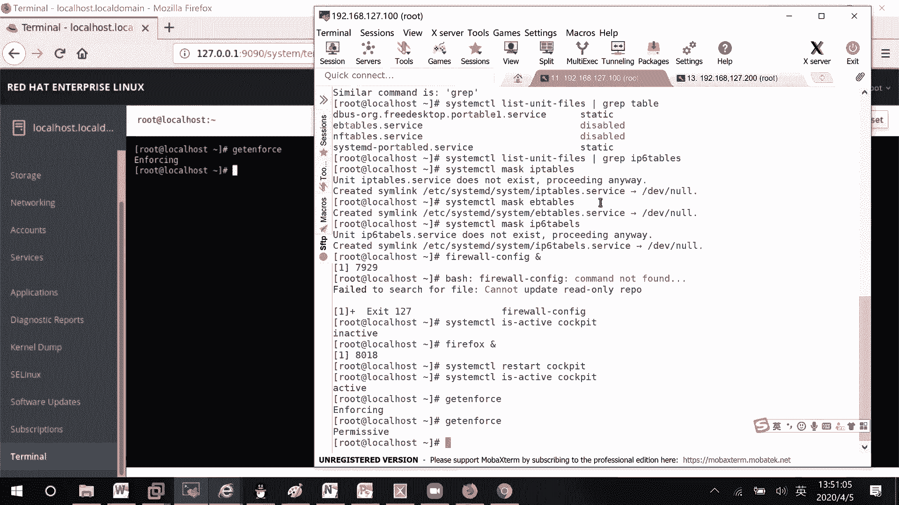

这类似于公司大楼：
*   **接口**：大楼的不同入口（前门、后门、货梯）。
*   **区域**：针对不同入口制定的安全规则集合（例如，前门允许访客进入大厅，货梯只允许授权员工进入仓库区）。
*   **规则**：具体允许或拒绝的行为（例如，允许 TCP 协议的 80 端口流量通过）。

防火墙就像在每个入口处的安检员，根据该入口（区域）的规则检查数据包。如果规则允许（比如开放了 80 端口），数据包就能“穿墙而过”；如果规则拒绝，数据包就会被丢弃。

系统内置了多个区域，每个区域代表了不同的信任级别：

以下是系统内置的主要区域及其用途：
*   **block**：拒绝所有传入连接。
*   **dmz**：非军事区，用于对外公开的服务器，限制内部网络访问。
*   **drop**：丢弃所有传入的数据包，且不回复。
*   **external**：用于外部网络，启用了伪装（NAT）。
*   **home**：用于家庭网络，信任大部分其他计算机。
*   **internal**：用于内部网络，信任大部分其他计算机。
*   **public**：用于公共区域，不信任网络上的其他计算机。**这是新安装系统的默认区域**。
*   **trusted**：信任所有网络连接。
*   **work**：用于工作区，信任网络上的大多数计算机。

## 区域的基本管理命令 ⚙️

上一节我们介绍了区域的概念，本节中我们来看看如何通过命令行管理这些区域。

首先，我们可以查看系统所有可用的区域。

```bash
# 列出所有可用的区域
firewall-cmd --get-zones
```

接着，查看当前的默认区域。因为未指定区域的网络接口会自动归属到默认区域。

```bash
# 查看当前默认区域
firewall-cmd --get-default-zone
```

我们可以修改默认区域。修改后，所有未明确指定区域的接口将自动应用新区域的规则。

```bash
# 将默认区域设置为 home
firewall-cmd --set-default-zone=home

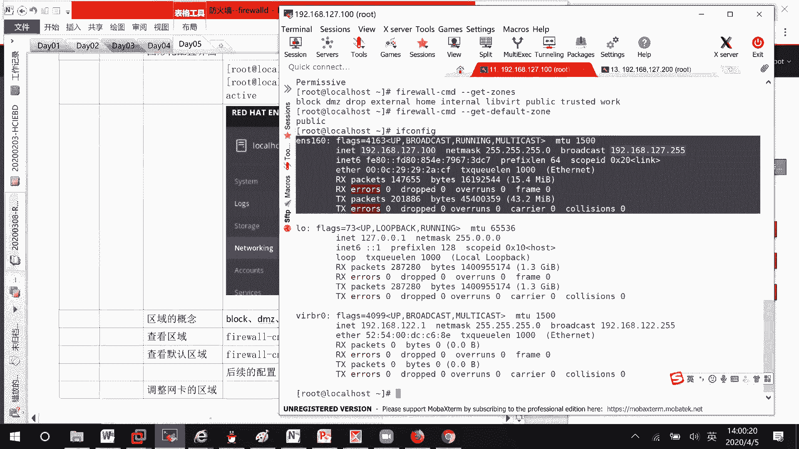

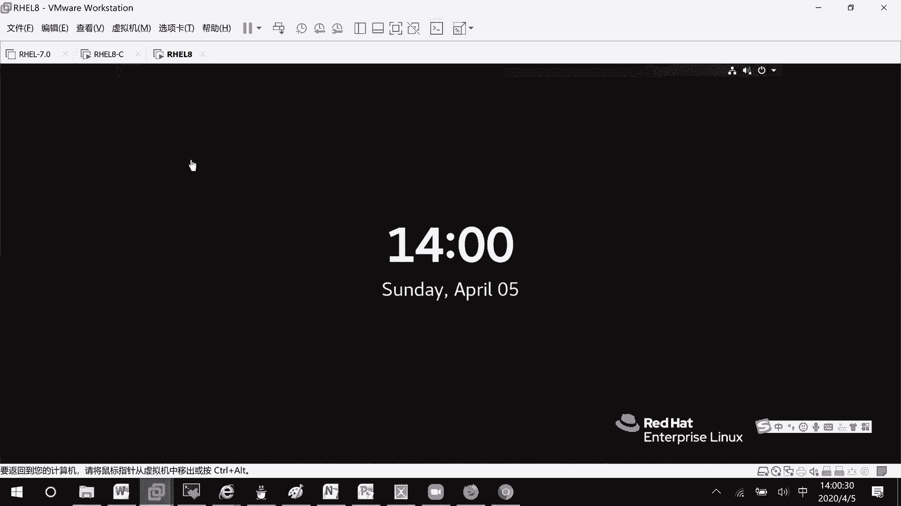

# 重启防火墙服务使更改生效（通常更改默认区域不需要重启，但某些环境可能需要）
systemctl restart firewalld

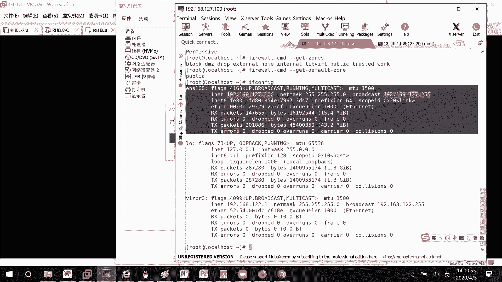

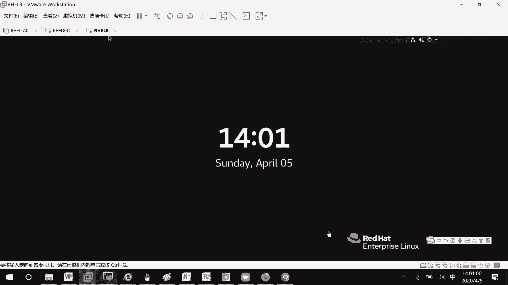

# 再次查看确认
firewall-cmd --get-default-zone
```

**注意**：在物理服务器或生产环境中，随意更改运行中接口的区域可能导致网络连接中断（例如，如果新区域规则不允许 SSH）。在实验环境中，我们可以通过添加虚拟网卡来安全地测试不同区域的配置。

---

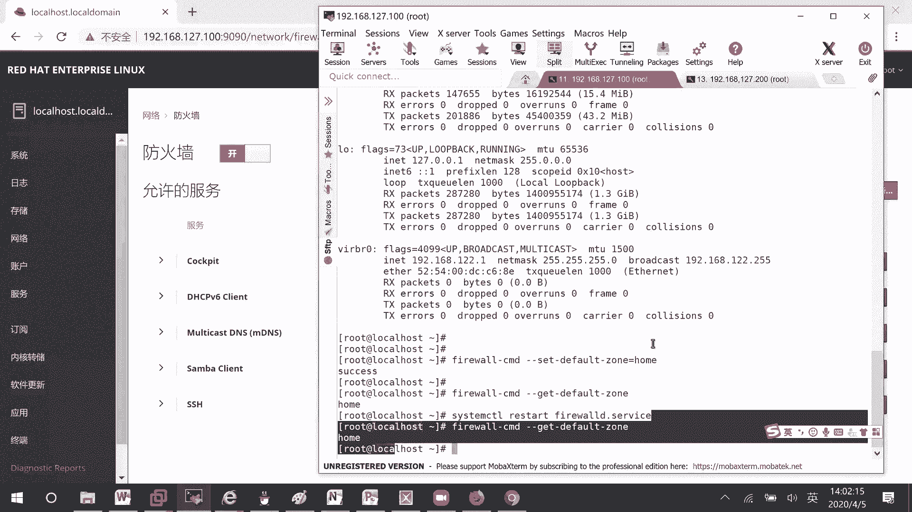


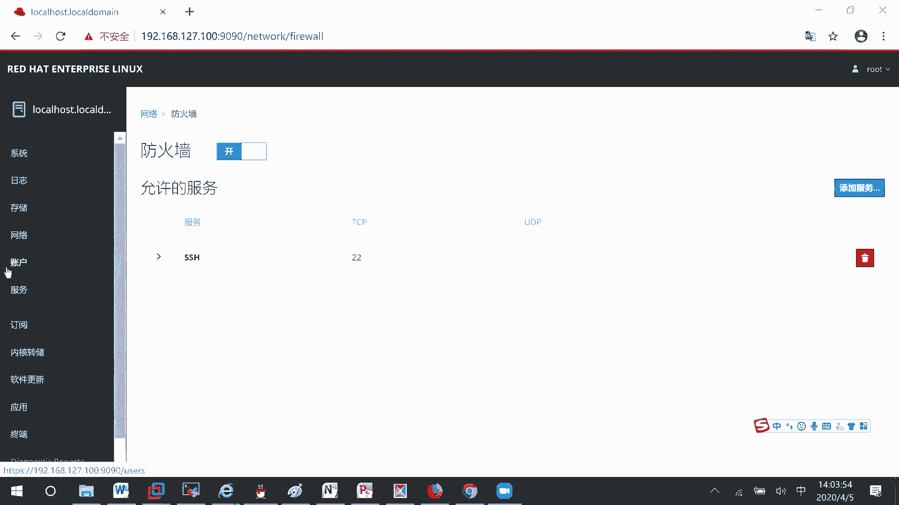

本节课中我们一起学习了 RHEL 8 防火墙的基础。我们了解了 `firewalld` 服务的重要性，掌握了通过 `systemctl` 管理其状态的方法。我们介绍了强大的图形化管理工具 Cockpit 的使用。最重要的是，我们深入理解了防火墙的**区域模型**，这是 `firewalld` 配置的基石，并学会了使用 `firewall-cmd` 命令查看和管理区域。在接下来的课程中，我们将学习如何在区域中添加具体的规则（如开放端口和服务）。