# RHCE 8.0 课程：P23：磁盘管理进阶（格式化、挂载与交换分区）


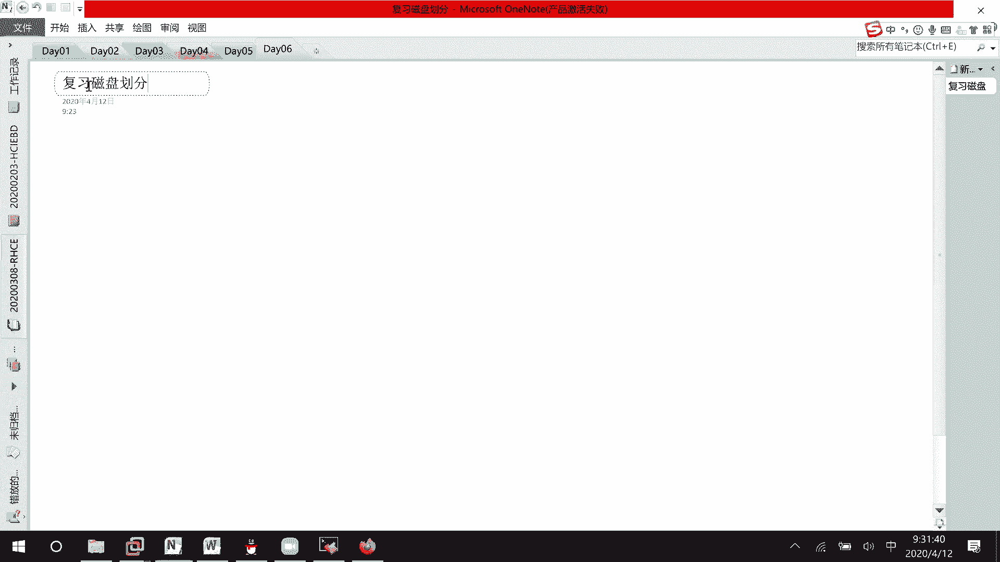

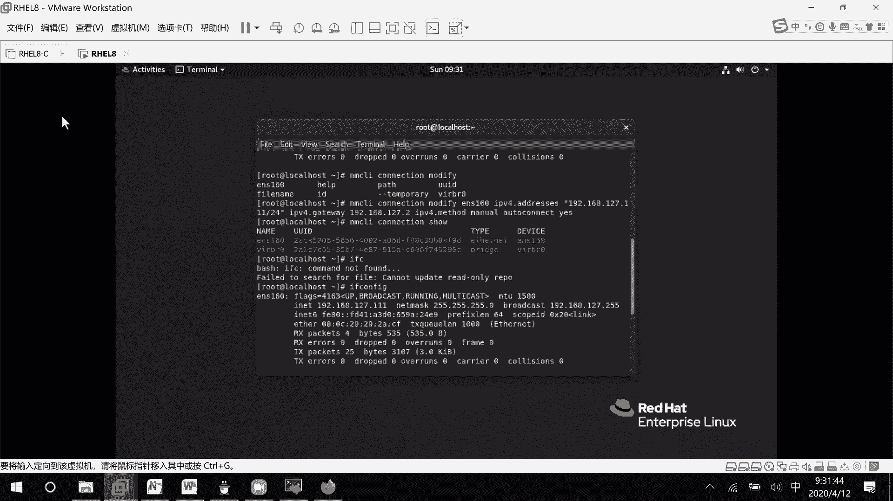

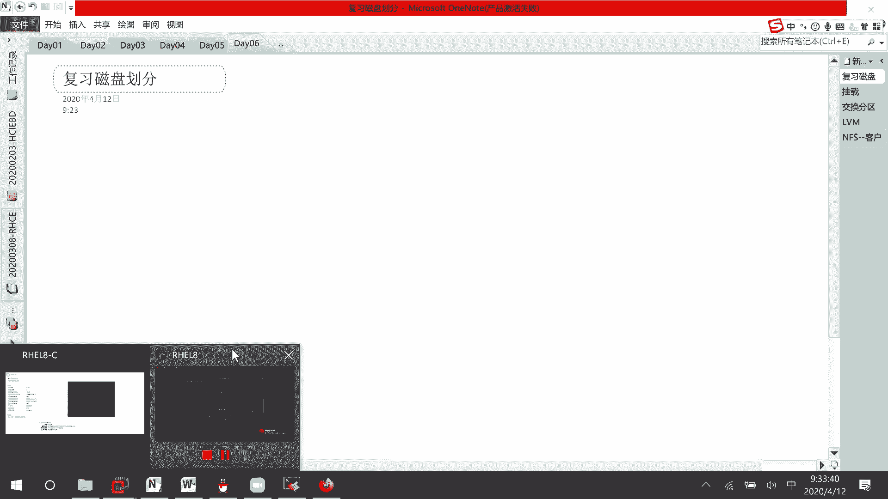

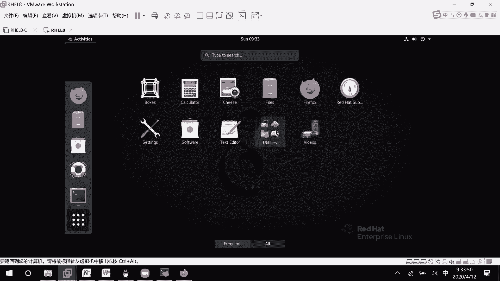

在本节课中，我们将深入学习磁盘管理的进阶操作。我们将复习磁盘划分，并重点讲解如何对分区进行格式化、临时与永久挂载，以及如何创建和管理交换分区。这些是Linux系统管理中的核心技能，对于RHCE认证考试至关重要。

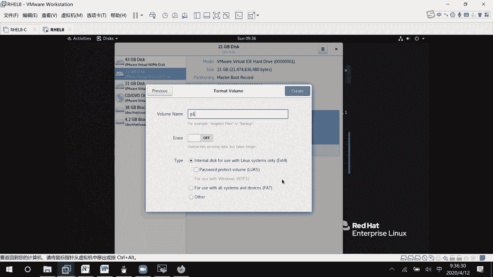

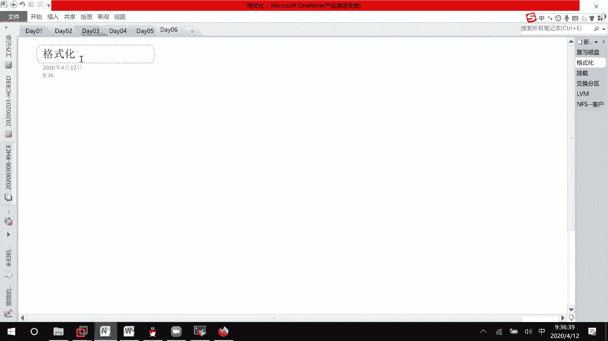

上一节我们介绍了如何使用`fdisk`和`gdisk`命令进行磁盘分区。本节中，我们来看看如何让这些分区真正可用，这涉及到格式化和挂载两个关键步骤。

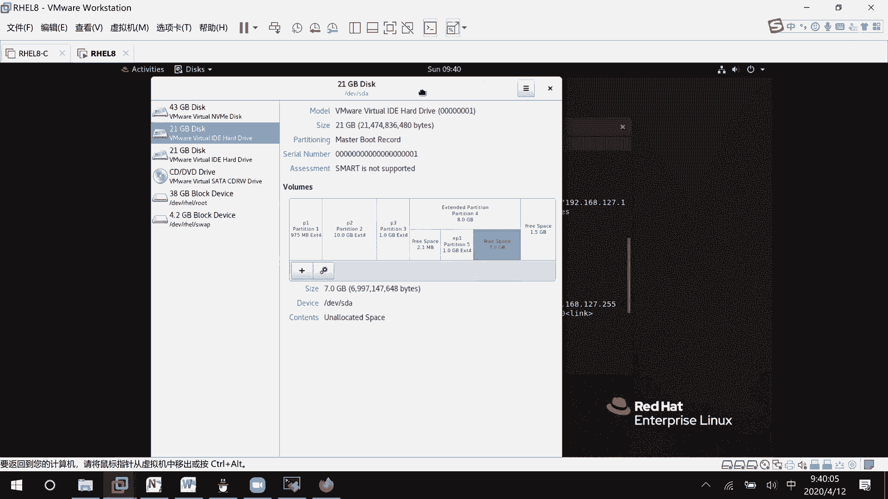

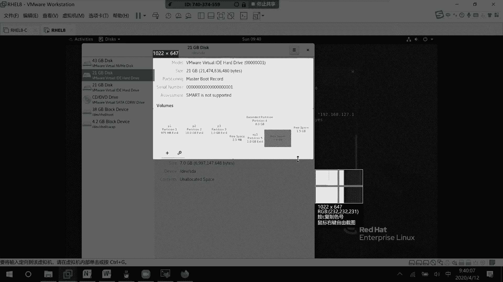

## 格式化分区

格式化相当于为分好的“房间”打上存储格子。不同的文件系统类型（格子组织形式）适用于不同场景。

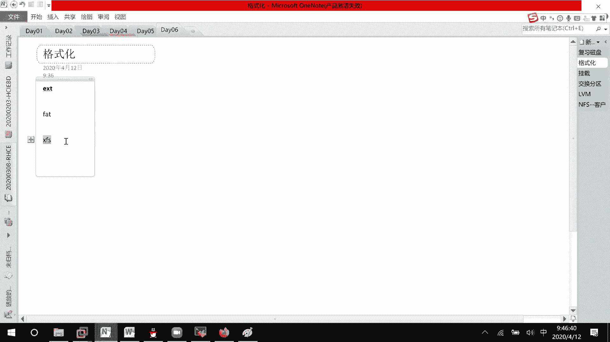

以下是Linux中常见的文件系统类型：
*   **ext4**： Linux系统常用的默认文件系统，稳定可靠。
*   **XFS**： 高性能文件系统，擅长处理大文件，常用于企业级环境。
*   **FAT32 / NTFS**： 通常用于U盘或移动硬盘，以保证在Windows和Linux系统间的兼容性。FAT32兼容性更好，但不支持单个大于4GB的文件。

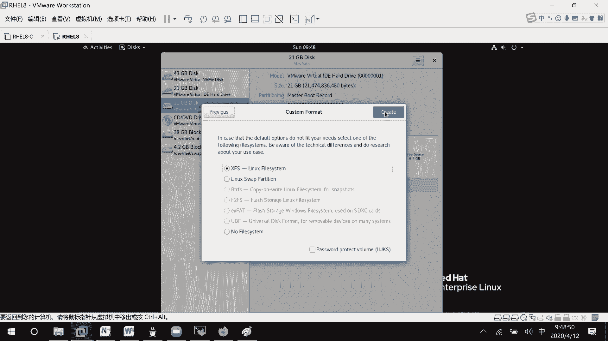

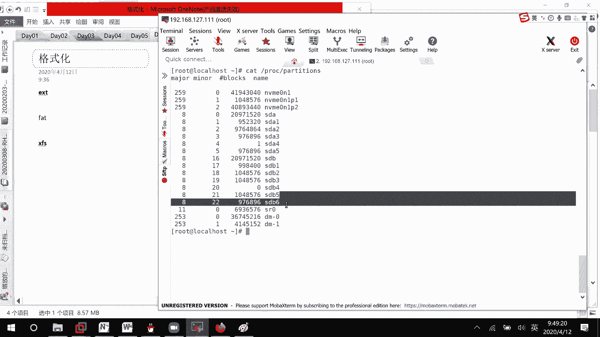

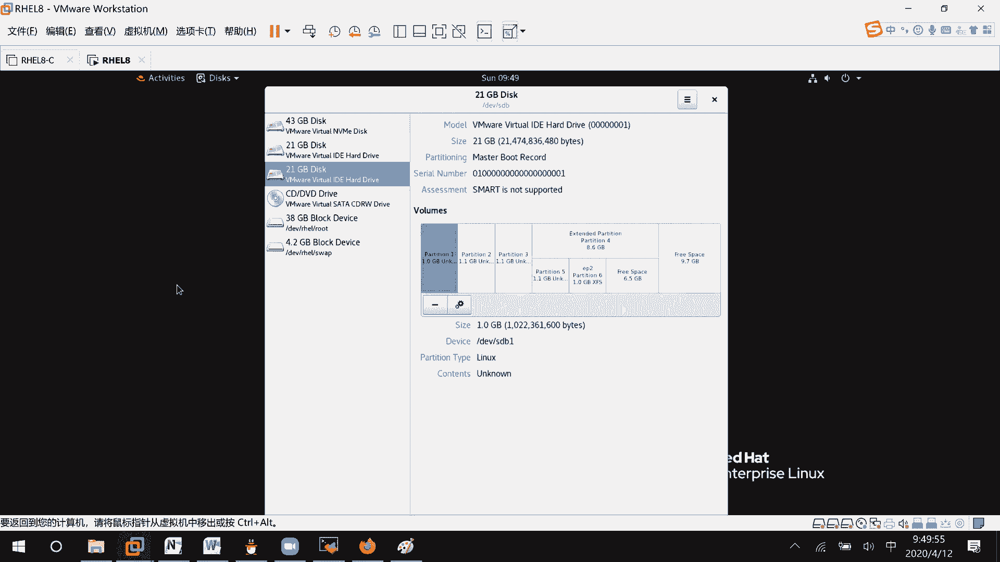

格式化命令的基本格式是 `mkfs`。例如，将 `/dev/sdb1` 格式化为 ext4 格式：
```bash
mkfs -t ext4 /dev/sdb1
```
也可以使用更简洁的命令，如 `mkfs.ext4 /dev/sdb1` 或 `mkfs.xfs /dev/sdb1`。

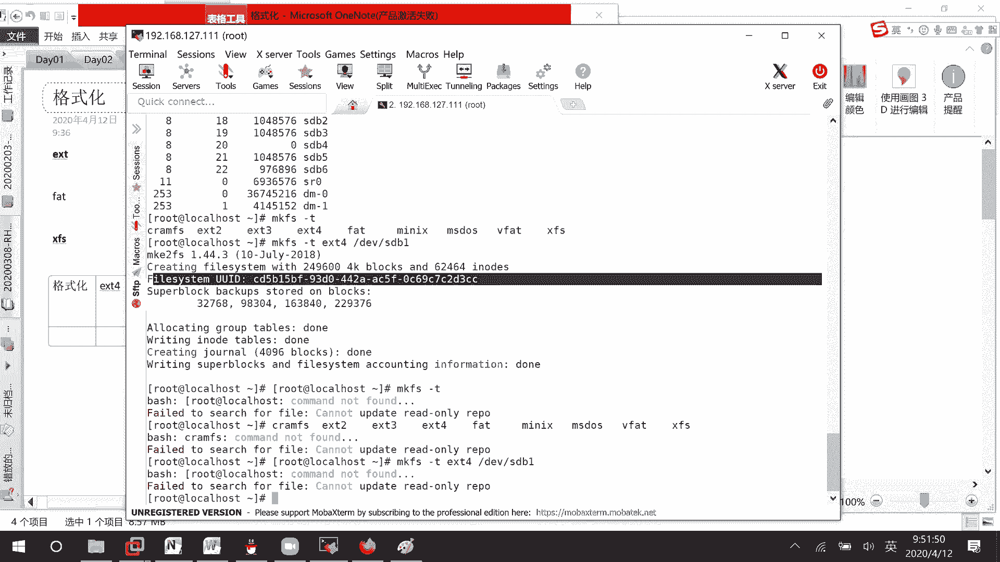

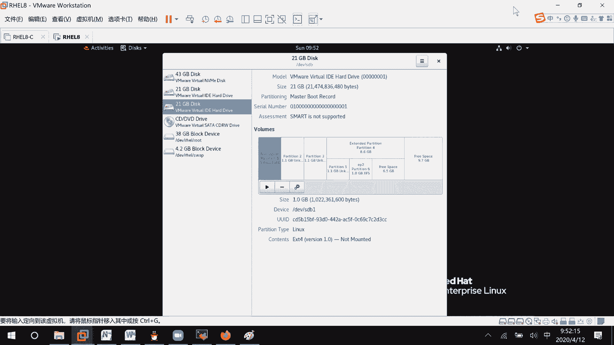

格式化后，分区会获得一个唯一的 **UUID**，系统通过它来识别分区。可以使用 `blkid` 命令查看分区的UUID和文件系统类型。

**指定块大小**： 格式化时可以指定“块大小”（block size），这会影响存储效率。对于大量小文件，较小的块大小（如1K）更节省空间；对于大文件，较大的块大小（如4K）能提升读写性能。指定块大小的示例：
```bash
mkfs -t ext4 -b 1024 /dev/sdb2 # 将块大小设置为1K
```

## 挂载分区

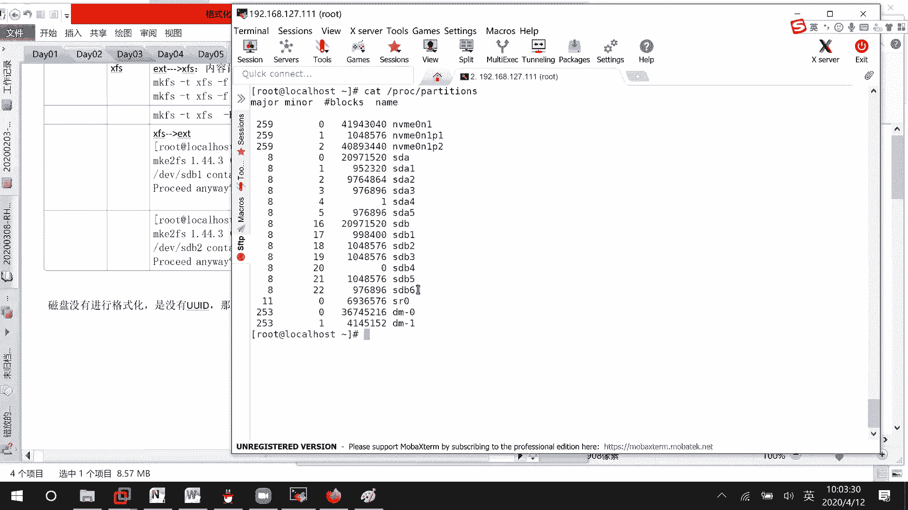

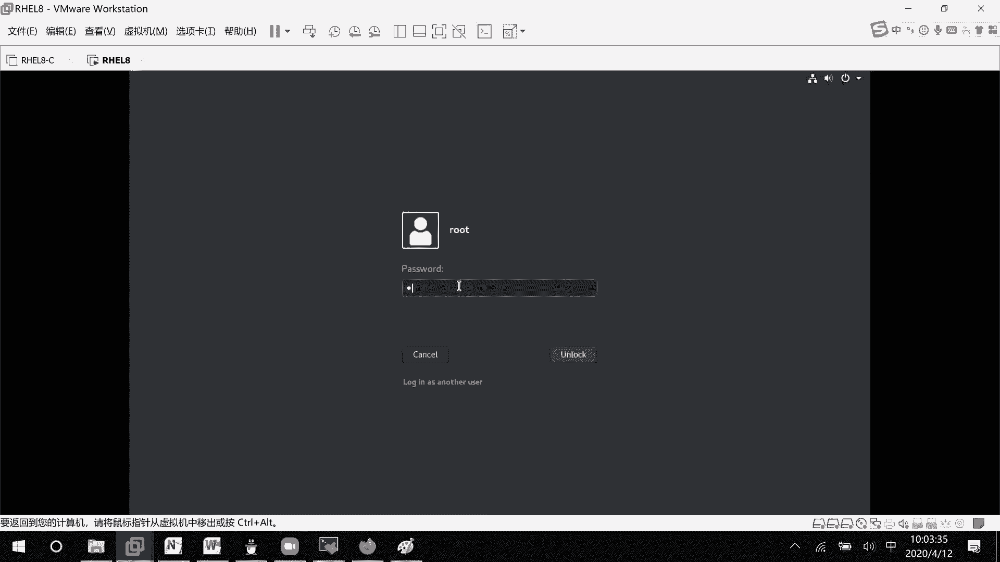

挂载是将一个存储设备（如分区）关联到Linux目录树中的某个目录（挂载点），以便访问其中的数据。

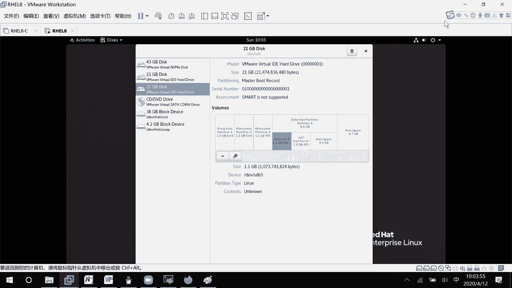

### 临时挂载

临时挂载在重启后会失效。命令格式为 `mount <设备> <挂载点>`。
```bash
mkdir /mnt/data
mount /dev/sdb1 /mnt/data
```
使用 `df -hT` 命令可以查看已挂载的文件系统信息。

卸载设备使用 `umount` 命令，可以指定设备或挂载点：
```bash
umount /dev/sdb1
# 或
umount /mnt/data
```

### 永久挂载

要实现开机自动挂载，需要编辑 `/etc/fstab` 配置文件。该文件中每一行定义一个需要挂载的文件系统。

一个典型的 `/etc/fstab` 条目包含6个字段：
```
<设备标识> <挂载点> <文件系统类型> <挂载选项> <备份标记> <检查顺序>
```
*   **设备标识**： 可以是设备路径（如 `/dev/sdb1`）或更稳定的UUID（推荐使用UUID，避免设备名变化导致挂载失败）。使用 `blkid` 查看UUID。
*   **挂载点**： 一个已存在的目录路径。
*   **文件系统类型**： 如 ext4, xfs, swap 等。
*   **挂载选项**： 通常使用 `defaults`。
*   **备份标记**： `0` 表示不备份。
*   **检查顺序**： `0` 表示不检查。

**示例**：将UUID为 `1234-ABCD` 的ext4分区永久挂载到 `/data`。
```
UUID=1234-ABCD /data ext4 defaults 0 0
```
编辑保存 `/etc/fstab` 后，可以使用 `mount -a` 命令重新加载所有配置，或直接重启系统生效。

## 交换分区（Swap）

交换分区是硬盘上的一块空间，当物理内存（RAM）不足时，系统可以将部分内存数据暂时交换到这里，防止系统因内存耗尽而崩溃。

### 查看交换空间
使用 `cat /proc/swaps` 或 `free -h` 命令查看当前交换空间信息。

### 创建交换分区
有两种方式：使用独立分区或使用文件。

**方法一：使用分区作为Swap**
1.  **创建分区**： 使用 `fdisk` 或 `gdisk` 创建一个新分区。
2.  **修改分区类型**： 将分区类型标识改为 `Linux swap` (代码 `82` 或 `8300`)。
3.  **格式化**： 使用 `mkswap` 命令格式化该分区为交换空间。
    ```bash
    mkswap /dev/sdb5
    ```
4.  **启用**： 使用 `swapon` 命令激活交换分区。
    ```bash
    swapon /dev/sdb5
    ```
5.  **永久生效**： 在 `/etc/fstab` 中添加一行。
    ```
    /dev/sdb5 none swap defaults 0 0
    ```

**方法二：使用文件作为Swap**
1.  **创建大文件**： 使用 `dd` 或 `fallocate` 命令创建一个指定大小的空文件。
    ```bash
    dd if=/dev/zero of=/swapfile bs=1M count=2048 # 创建2GB文件
    ```
2.  **设置权限**： 出于安全考虑，建议将文件权限设置为 `600`。
    ```bash
    chmod 600 /swapfile
    ```
3.  **格式化**： 使用 `mkswap` 格式化该文件。
    ```bash
    mkswap /swapfile
    ```
4.  **启用**： 使用 `swapon` 命令激活。
    ```bash
    swapon /swapfile
    ```
5.  **永久生效**： 在 `/etc/fstab` 中添加一行。
    ```
    /swapfile none swap defaults 0 0
    ```

要停用交换空间，使用 `swapoff` 命令。

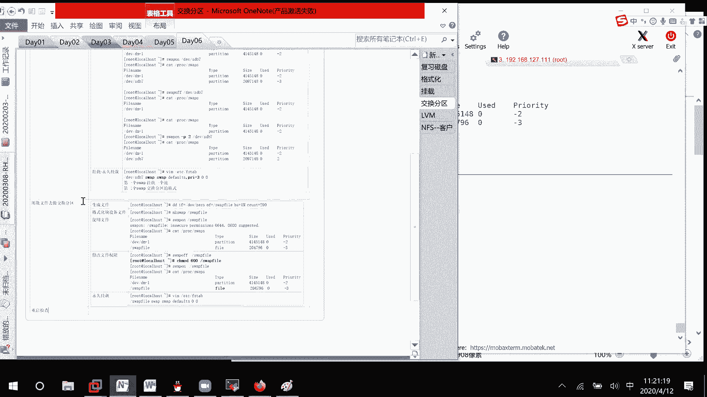

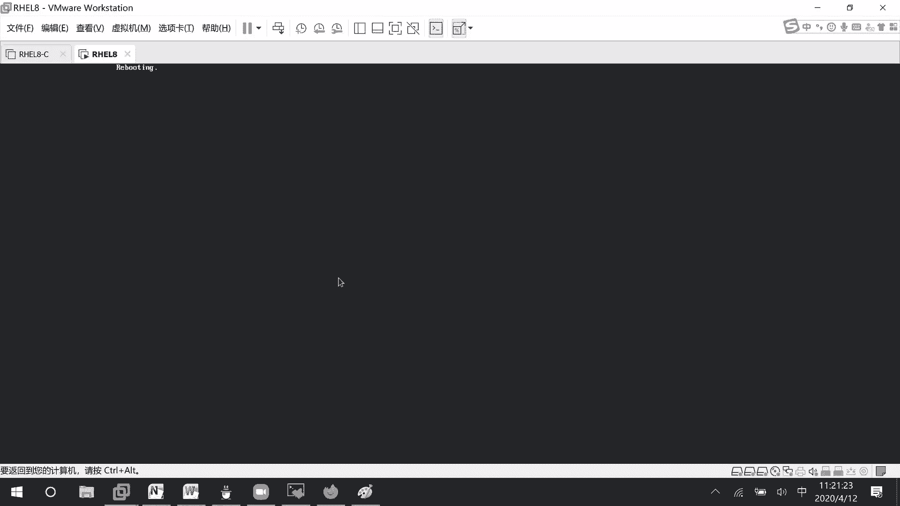

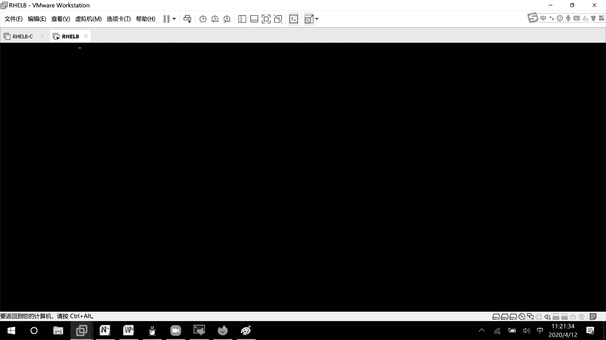

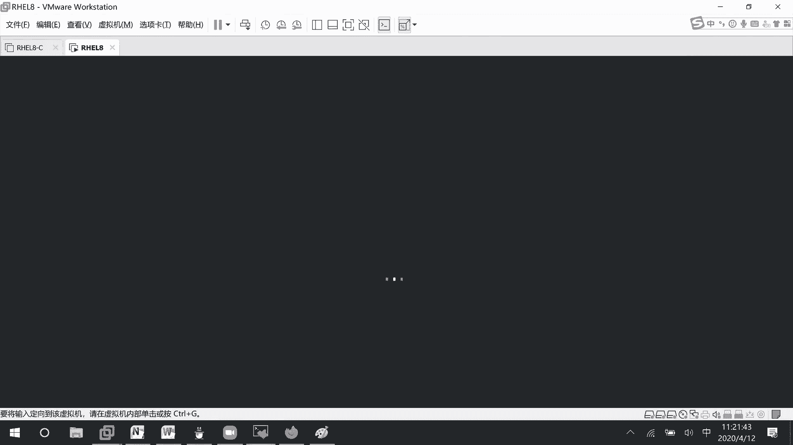

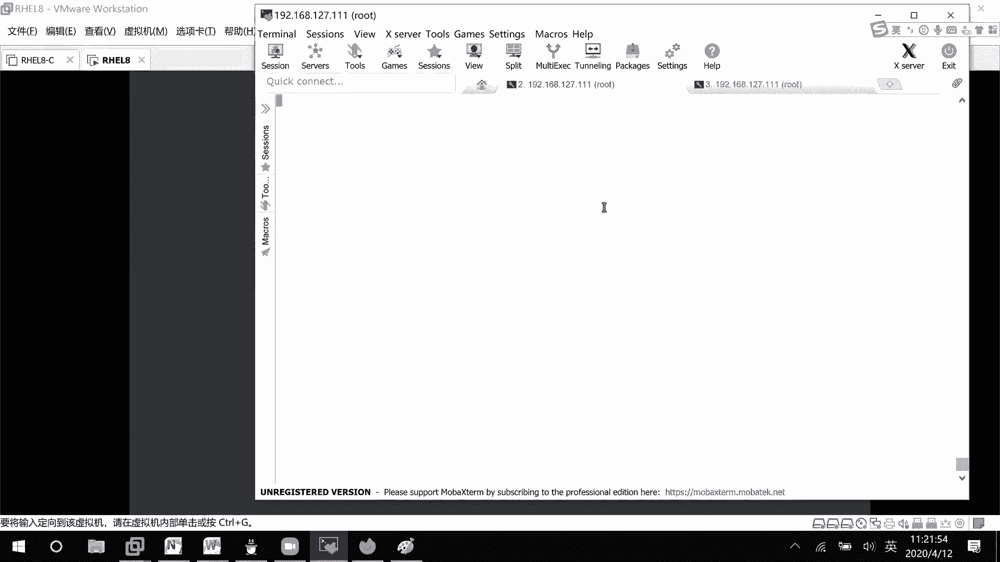

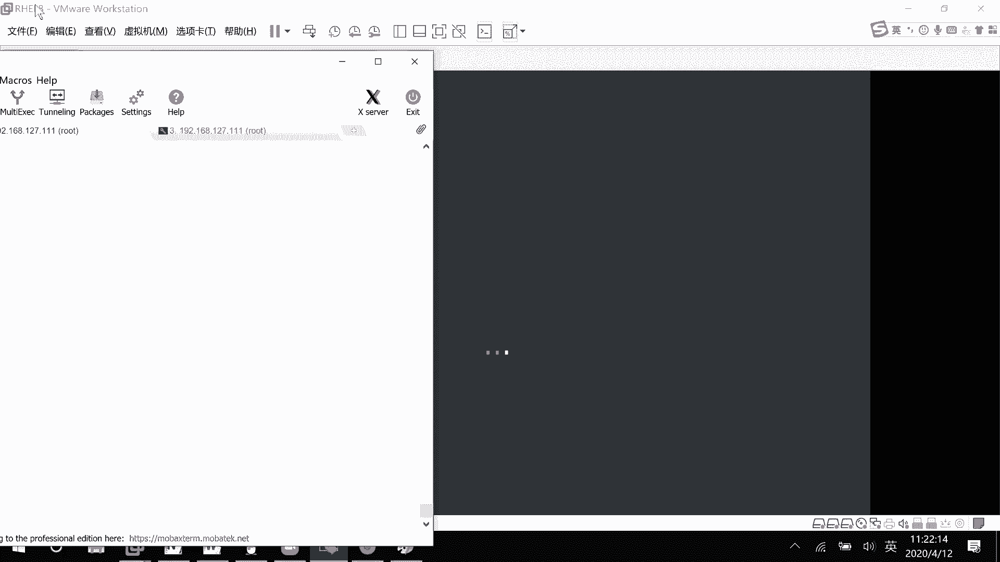

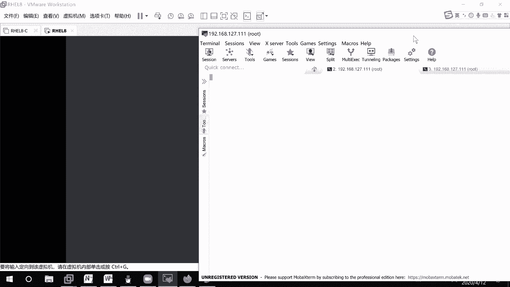

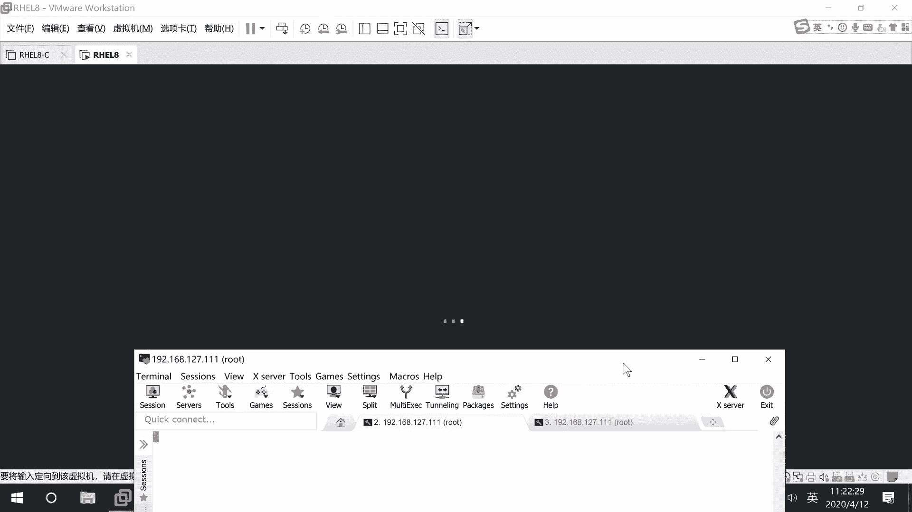

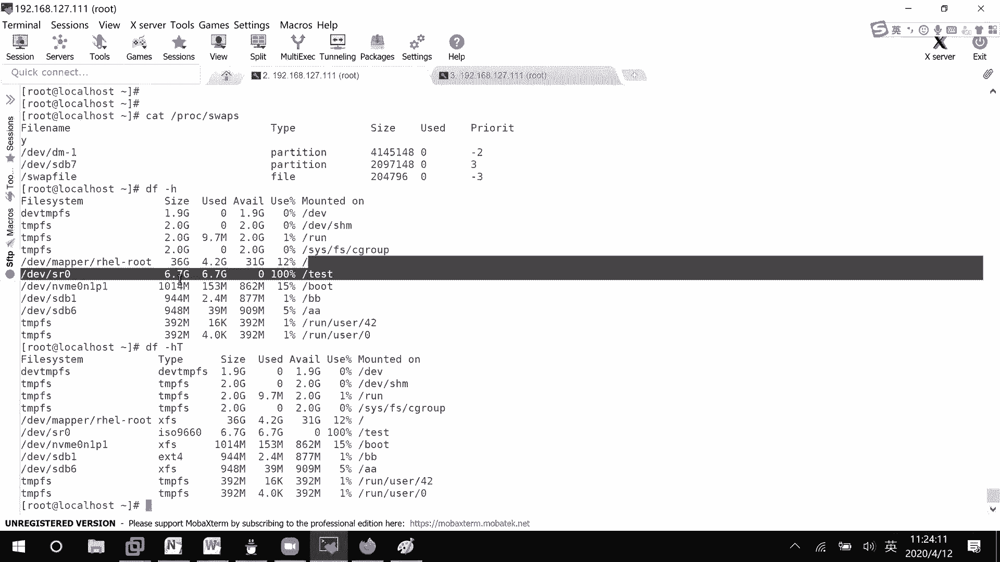

本节课中我们一起学习了磁盘管理的进阶知识。我们掌握了如何通过 `mkfs` 命令格式化分区，理解了临时挂载 (`mount`/`umount`) 与永久挂载 (`/etc/fstab`) 的区别与配置方法，并学会了两种创建交换分区（Swap）的方式。这些是管理Linux服务器存储的基础，请务必通过练习加以巩固。下一节，我们将探讨更灵活的存储管理方案——LVM（逻辑卷管理）。