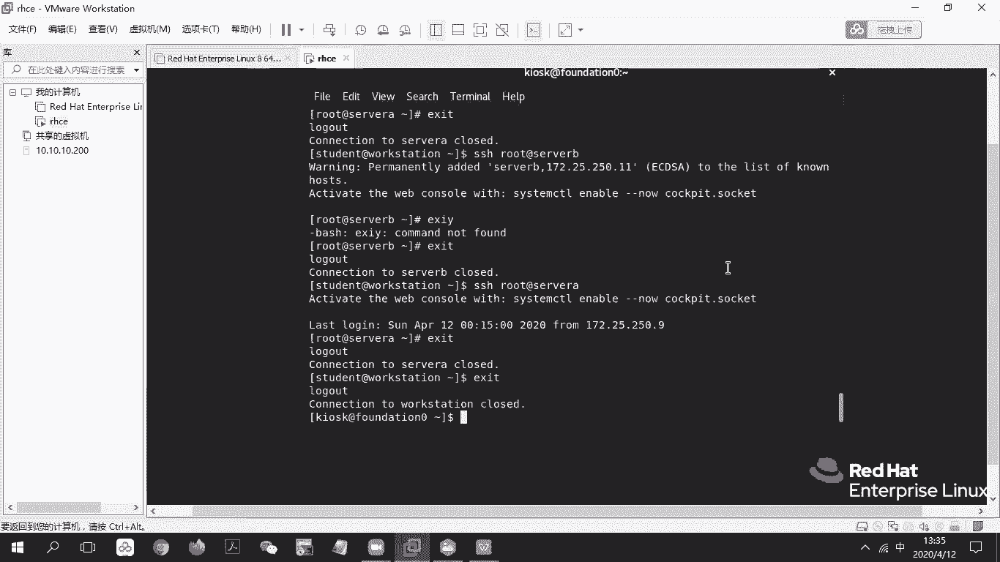
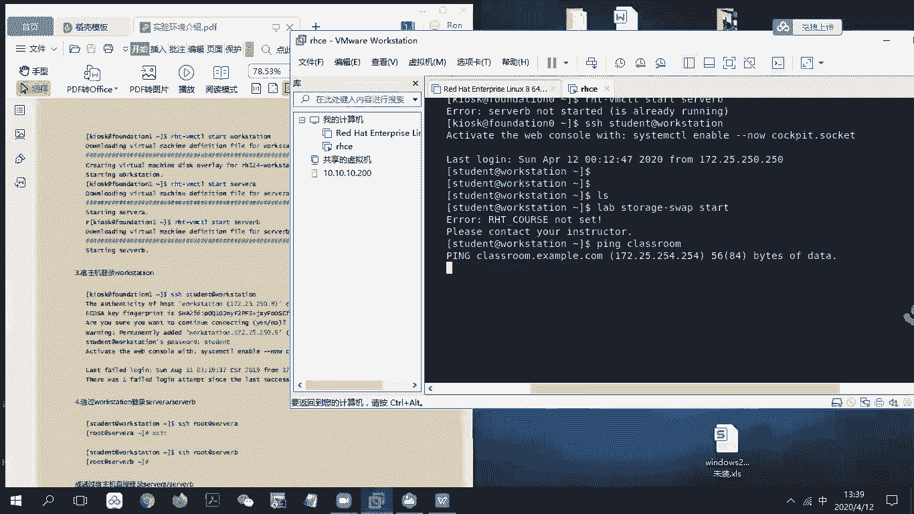
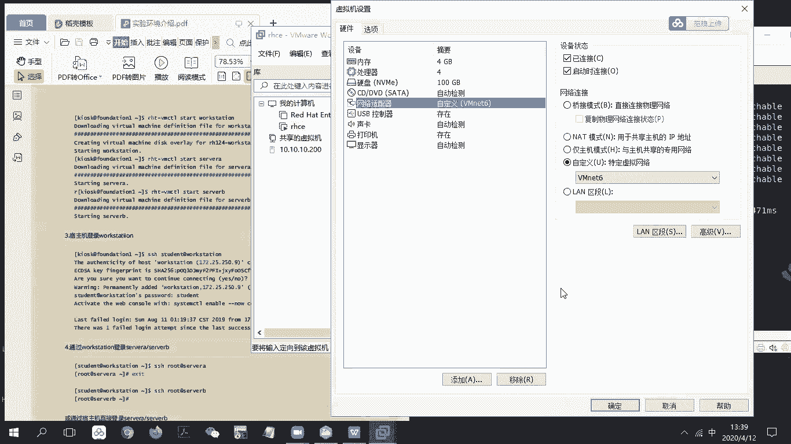
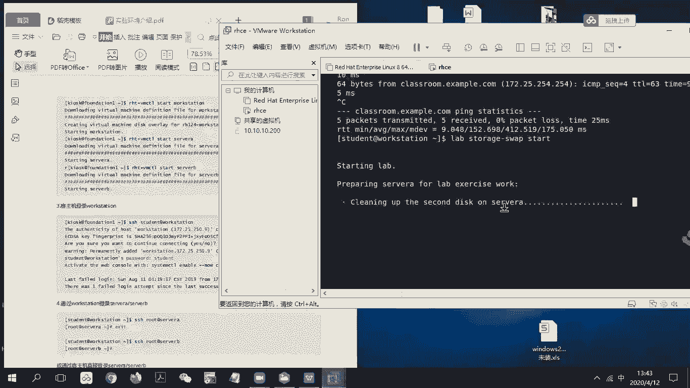

# RHCE 8.0 视频教程：P24：环境配置与初始化


## 概述
在本节课中，我们将学习如何配置和启动RHCE 8.0的练习环境。主要内容包括启动教室虚拟机、配置网络连接以及运行初始化脚本，为后续的实验操作做好准备。

## 环境介绍与启动 🖥️

首先，我们从KIOSK环境进入，这相当于我们的教室环境。你需要打开提供的PDF文档，并定位到“环境介绍”部分。



PDF文档中描述了虚拟机内的环境构成。主要包含以下需要操作的主机：
*   **server a**
*   **server b**
*   **workstation**

此外，`Classroom`主机提供资料和脚本下载。网络方面，环境包含`250`和`252`两个网段，它们相互连接。

现在，我们开始进行环境启动操作。

以下是启动教室环境的步骤：
1.  在虚拟机环境中，输入命令启动教室主机：`rht-vmctl start classroom`。这条命令会部署整个练习环境。
2.  启动学生机（即你的操作环境）：`rht-vmctl start workstation`。
3.  分别启动服务器A和服务器B：`rht-vmctl start servera` 和 `rht-vmctl start serverb`。如果虚拟机已启动，命令会报错，这属于正常情况。

虚拟机启动可能需要一些时间，请耐心等待。

## 网络连通性检查与故障排除 🌐



上一节我们启动了所有虚拟机，本节中我们来看看如何检查网络并排除常见问题。

启动完成后，我们需要远程登录到`workstation`主机进行操作。使用以下命令以`student`用户身份登录：
```bash
ssh student@workstation
```



登录后，根据操作手册，第一步通常是重置实验环境。例如，对于存储管理或交换分区实验，可以运行：
```bash
lab storage-swap start
```

如果运行脚本时出现问题，很可能是网络不通。需要检查`workstation`能否访问`classroom`主机。

以下是网络故障排查步骤：
1.  从`workstation`主机ping教室主机：`ping classroom`。如果无法连通，需要进行下一步检查。
2.  检查虚拟网络设置。打开虚拟机软件的“编辑虚拟网络编辑器”。
3.  查看是否存在`VMnet6`网络。如果没有，点击“添加网络”，选择`VMnet6`并确定。
4.  关键步骤：**取消勾选`VMnet6`的“使用本地DHCP服务”选项**，然后点击“确定”或“应用”。
5.  关闭设置界面，重新尝试ping命令：`ping classroom`。此时通常可以连通。

网络连通后，再次运行初始化脚本（如`lab storage-swap start`）。如果没有报错，说明脚本正在后台配置设备，可以开始后续的实验步骤。



## 总结
本节课中我们一起学习了RHCE练习环境的配置流程。我们首先启动了教室、工作站和服务器虚拟机，然后解决了因虚拟网络DHCP设置导致的网络连通性问题，最后成功运行了实验初始化脚本。这个环境将用于后续所有的实验操作，考试模拟时也会提供类似的脚本来准备和检查实验环境。