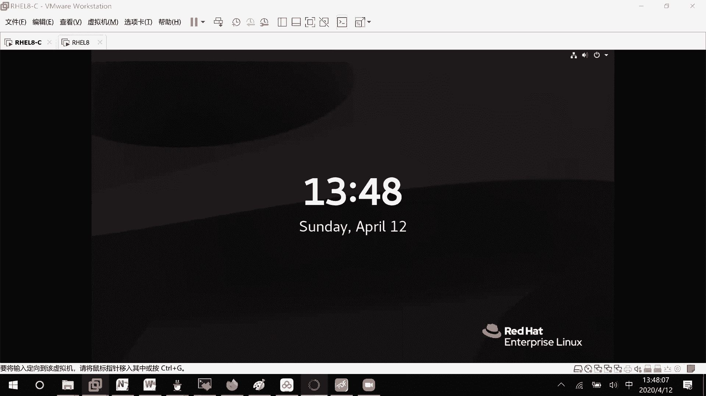
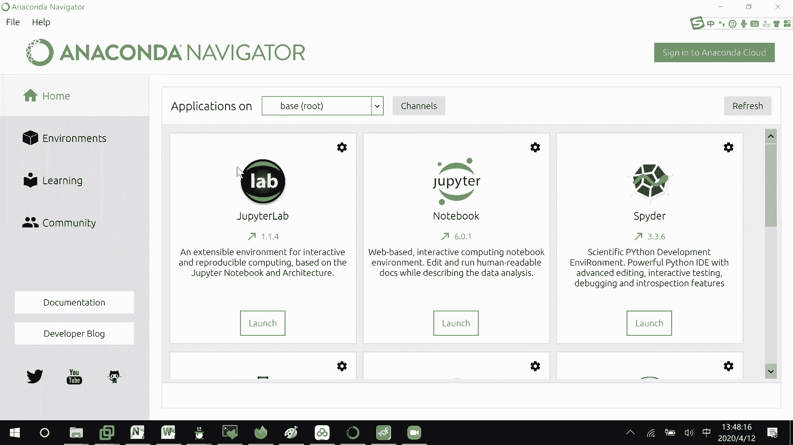
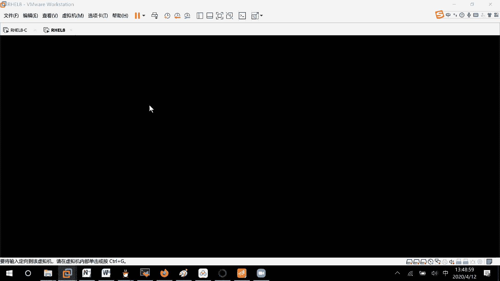
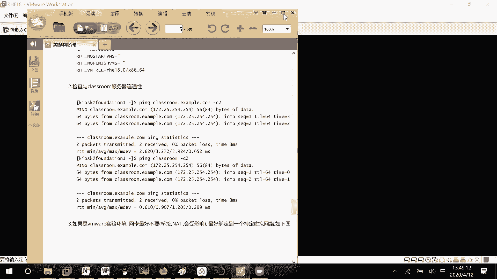
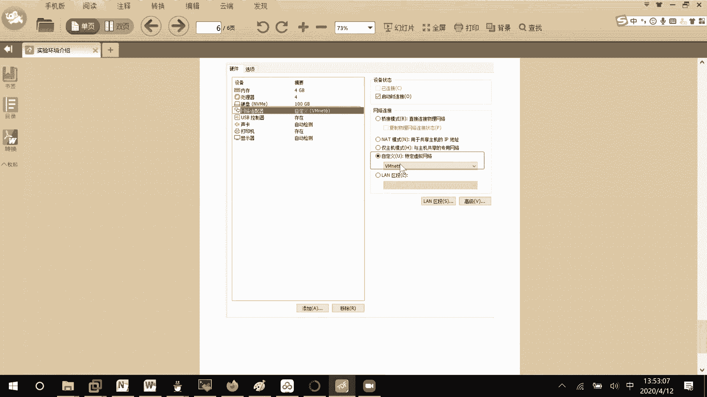
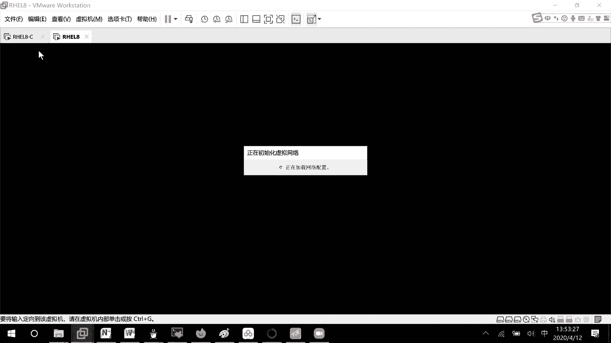
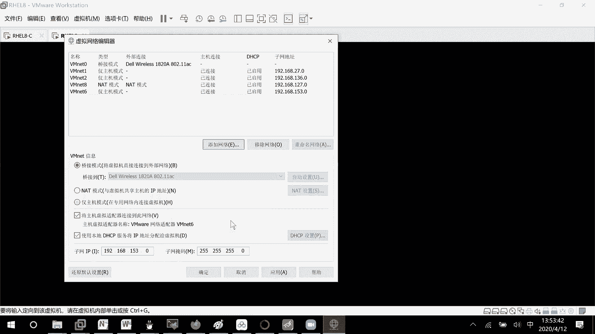
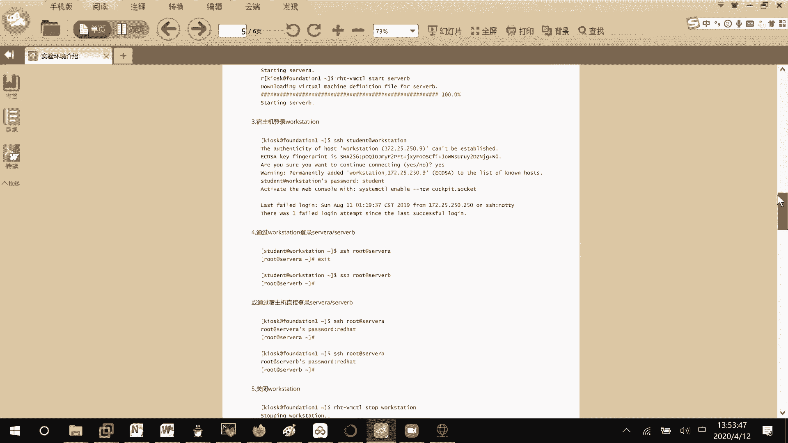
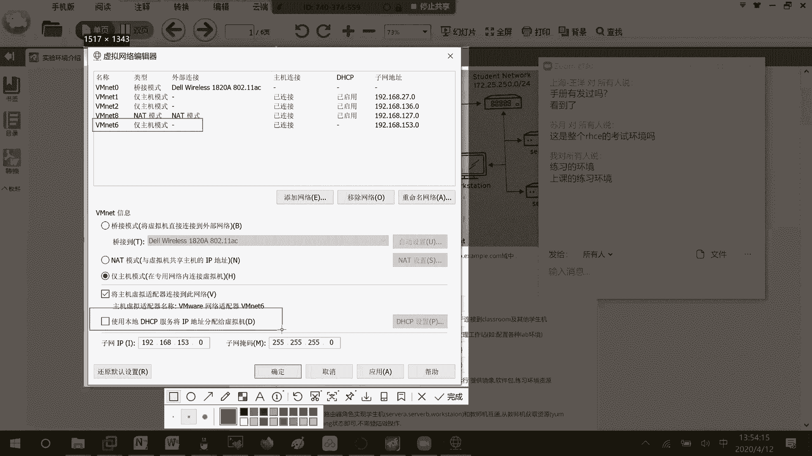
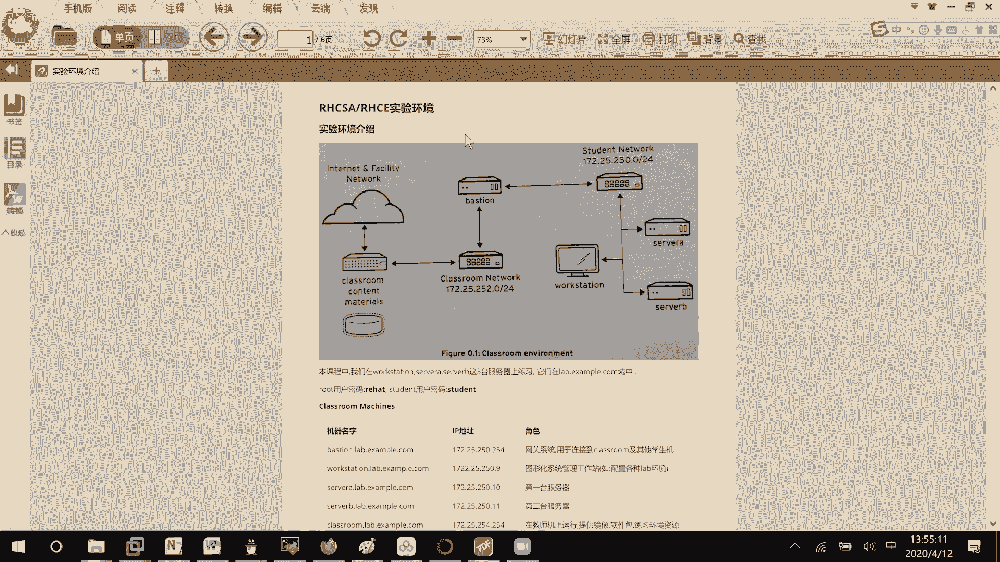

# RHCE8.0视频教程：01：RHCE考试环境搭建与使用指南 🖥️






在本节课中，我们将学习如何搭建和使用RHCE8.0认证考试的练习环境。理解这个环境的构成和启动流程，是后续所有实验和考试准备的基础。





## 环境整体结构介绍

上一节我们介绍了课程背景，本节中我们来看看RHCE考试环境的整体结构。该练习环境模拟了真实的考试网络拓扑。

整个环境包含以下核心组件：
*   **Classroom（考官机）**：这是资源存放服务器，提供考试题目和评分脚本。
*   **Workstation（工作站）**：这是考生主要操作的入口虚拟机。在真实考试中，考生直接登录的就是这台机器。
*   **Server A 与 Server B**：这是需要考生进行配置和管理的两台目标服务器，大部分考试操作在这两台机器上完成。
*   **网络**：一个虚拟网络（网段172.25.252.0/24）将这些设备连接在一起，其中包含一个网关服务器。

对于练习者而言，需要同时管理这四台虚拟机。但在真实考试中，考生仅能直接操作Workstation，并通过它去管理Server A和Server B。

## 环境启动与基本操作流程

理解了环境结构后，我们来看看如何启动和使用它。

以下是启动和进行练习的标准流程：
1.  启动所有虚拟机设备。
2.  通过SSH连接到Workstation虚拟机。
3.  在Workstation上使用命令 `lab <练习名称> start` 来初始化特定的练习环境。
4.  根据题目要求，在Server A或Server B上完成配置任务。
5.  部分练习支持自动评分，可使用 `grade` 命令检查成绩。
6.  练习完成后，若想重置环境重新开始，可使用 `finish` 命令。

各设备的默认登录凭证为：
*   **用户名**：`root`， **密码**：`redhat`
*   **用户名**：`student`， **密码**：`student`

## 关键网络配置（VMnet6）

环境正常运行依赖于正确的网络配置。一个常见的配置问题是虚拟网络VMnet6。



在VMware Workstation中，必须为这个练习环境添加并正确配置一个名为 **VMnet6** 的虚拟网络。许多电脑默认没有此网络，需要手动创建。



配置步骤如下：
1.  打开VMware Workstation，进入 **编辑** -> **虚拟网络编辑器**。
2.  点击 **添加网络**， 选择或创建一个名为 **VMnet6** 的网络。
3.  将VMnet6的模式设置为 **仅主机模式**。
4.  **至关重要**：必须 **关闭** 这个网络的DHCP服务。代码示例如下（在虚拟网络编辑器中取消勾选“使用本地DHCP服务…”）：
    ```
    [确保 VMnet6 的 “DHCP” 选项处于未启用状态]
    ```
    这是因为练习环境内部有自己的DHCP和IP地址分配机制。如果外部VMnet6也开启DHCP，会导致IP地址冲突，从而使整个环境无法正常工作。





## 环境连通性测试

完成所有配置后，需要进行连通性测试以确保环境就绪。



测试方法很简单：从Workstation虚拟机尝试ping通Classroom考官机的IP地址（例如172.25.252.254）。如果能够ping通，则证明Workstation所在的252网段与Classroom的网络通信正常，整个练习环境的基础网络没有问题，可以开始进行实验。

---



本节课中我们一起学习了RHCE8.0考试练习环境的架构、启动流程、关键的网络配置步骤以及如何测试环境连通性。正确搭建这个环境是后续所有实验成功的前提，请务必按照步骤仔细配置。