# 01 RHCE8.0视频教程【45课时】 - P26：20200412-RHCE-04_recv - 六竹书生6682 - BV1m84y1f7ss

那好那下午这边的话呢，我们要来开始讲，六天里面的一个叫做逻辑卷管理了，好吧，逻辑为什么就是说要有逻辑卷管理这个东西呢，像我们干早上的话呢，是不是产生了很多分区啊。

Pet process audition，这里呢SBB1它的大小的话呢，是不是差不多一个G啊，不够用了，我能去把它变成两个G吗。

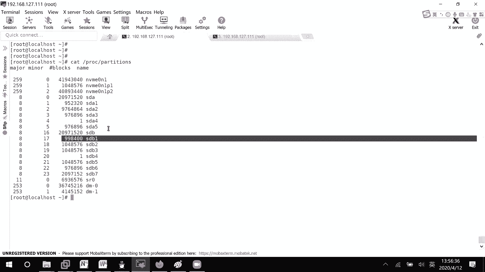

能不能我来看一下，能不能的话呢去试一下就知道了吗，要开始讲逻辑卷，逻辑卷的话是一个比较重要的东西了。

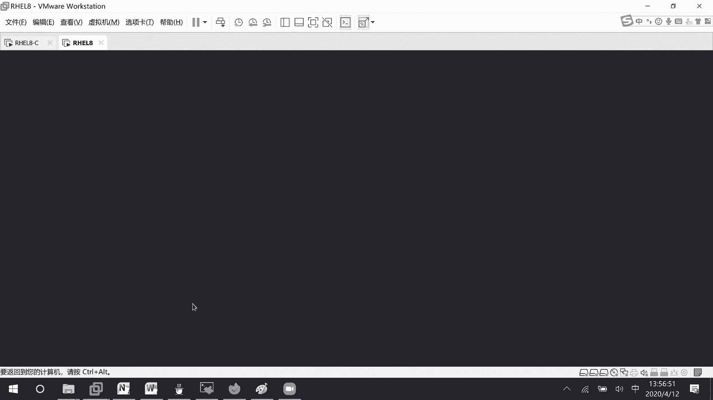

稍等哈。

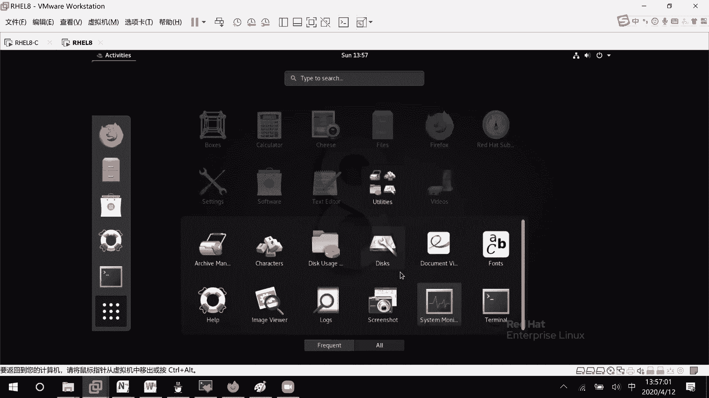

然后你看这里他的话呢不是不够用了吗，这个是干嘛呢，这个按钮就是说去挂载挂载到哪个文件嘛，它自动的给我去挂载到一个地方上面去，你看是挂载到这个叫做ROM mile下面去，我现在不去挂了，等一下。

然后接下去这点呢就把它给删掉吗，不是这个叫做齿轮一样东西呢，格式化编辑分区，我们来看一下是编写他的标签，那好这个也不是，然后这边的话呢resize。

你看resize bar system会产生数据的一个丢失吗，建议你的话呢先进行一个备份，比如说我这边的话呢想要去扩展一下，叫做扩展到十个G吧，十你看它本身的话呢，就是说空弦的话本身就是零了。

你如果想去扩展的话，是没有办法去扩展的，因为你这卷的话呢本身是一个G，我全都拿过去进行一个格式化了，所以呢没有办法去进行一个扩展，那这边的话呢你看你可以去进行减少，是没有问题的，但是就不能去增大了。

好吧。

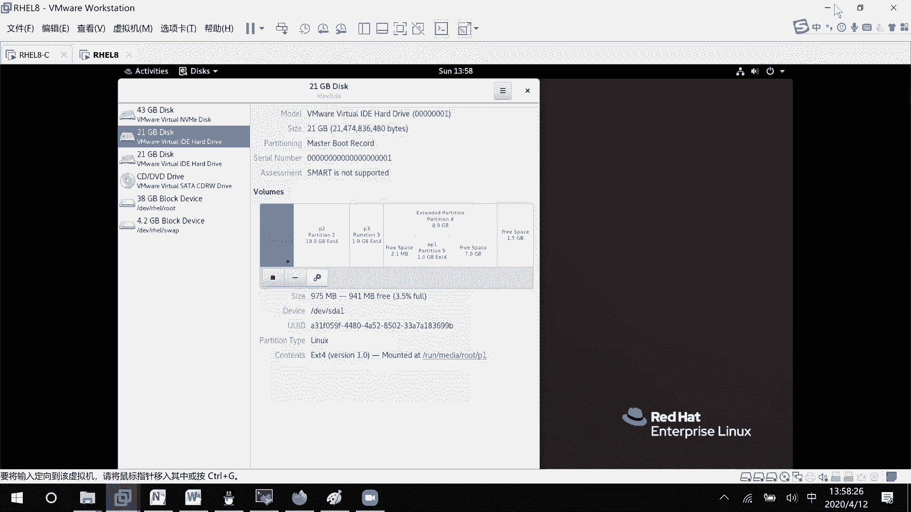

如果说我们想要去扩展呢，像这个叫做普通的分区，是不是就很不方便了，很不方便，我们下午的话呢就要来讲怎么样去进行扩展，我现在的话呢先把这些全部给删掉哈，全部给删掉，避免下一次开机有问题的话。

那我把这些挂载信息全都删了，然后的话呢把这边去给清空一下。

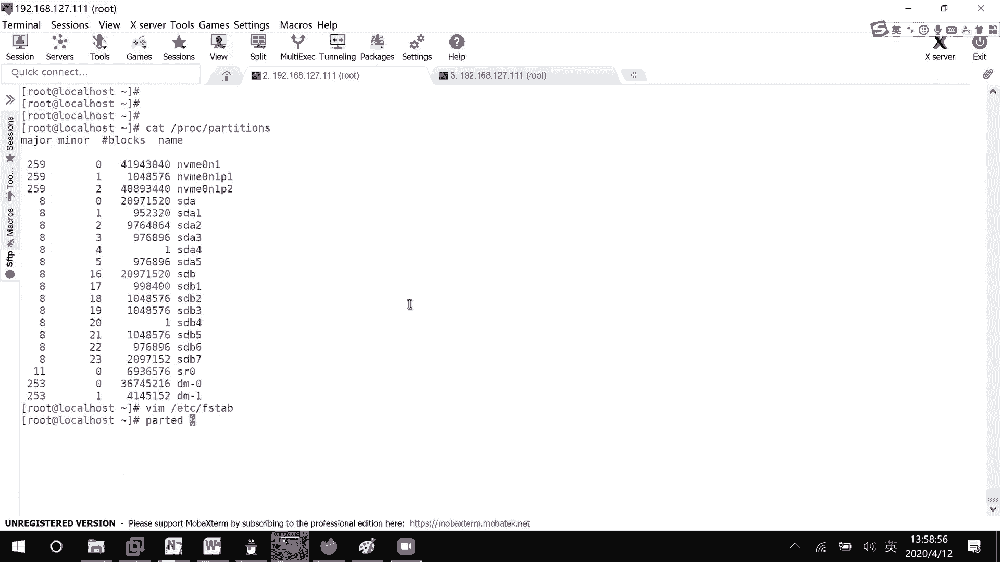

直接这里吧，等一下看一下没什么问题，More light it，这个好像真的被挂在，那好这两块的话呢全都是空的。

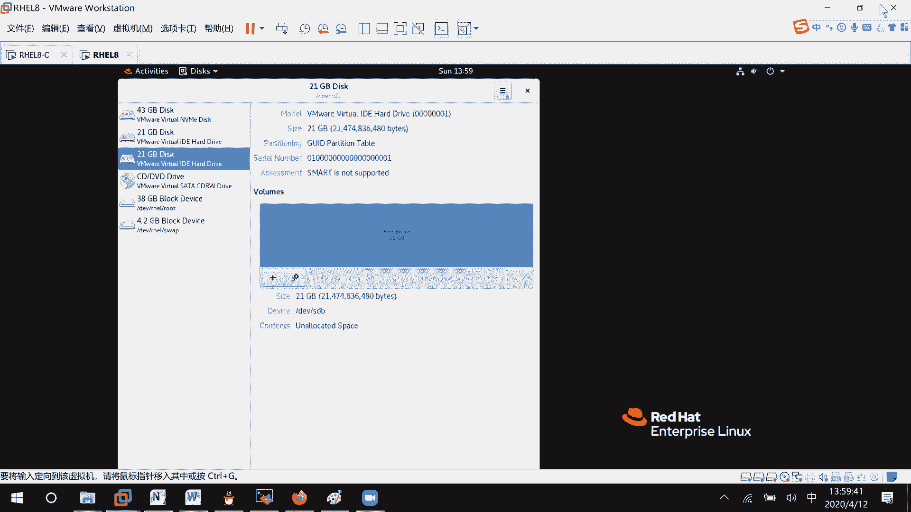

我早上的话呢说了，如果要进行这个逻辑卷管理的话呢，会用到一个分区的知识吗，这边我们先来看一下，它的一个流程是怎么样子的，你的话呢可以是一个磁盘，也可以是两个磁盘，全都没有关系的。

比如说我们县这里的话呢是一个磁盘，那这里要做的事情是什么呢，你可以去创建好几个分区，知道吧，分区的话呢这边他不能直接去用，如果说你想要去加入到我的，逻辑卷单中来的话呢，第一步。

我们要做的事情是创建体力快，就好像说你们公司在招聘的时候呢，是不是很多人来，你也是啊，如果想要去加入你们小组的话呢，是不是要先成为公司的一个员工啊，所以把这些分区先变成pp快，成为PV快之后呢。

接下去第二步你要做的一个事情，你的话呢成为PV快，你就可以去加入到小组当中去，比如说某一些啊团队嘛，比如说教学部啊或者运营部里面去，接下去加入进去之后呢，第三步，比如说有项目来了之后呢。

是不会选人进入到这些项目里面去啊对吧，然后第三步的话呢，我们就是说形成逻辑卷上面，这里的话呢就是说加入到某一个卷轴当中去，建筑这里的话呢就PV快，就是让你们去加入，其实这一步的话呢不做关系不大。

因为就是说你普通的分区的话呢，你如果加入到卷子当中去，自动的会变成pp快，能明白吗，然后这个你看啊，他的话呢，我这个PV快是不是就是从上面这里的话呢，比如说这里有个SDB123，五我可以怎么样呢。

我可以把1245拿过来，三不要的话呢是没有关系的，一五作为PV，这里建筑的话呢，你可以去创建很多很多的小组，没有关系的，我这里卷轴的话呢，一个小组嘛，比如说，是一个小组。

然后这边的话呢还有比如说341个小组，一个PV已经加入到一个小组了，他不能再去加入到另一个小组了，然后这个逻辑卷呢，因为它是逻辑上，我的话呢就不再是从这个物理上去拿的，比如说我想要去创建一个逻辑卷。

每一个这边比如说一个G啊，比如说我想要去创建三个G怎么办呢，我可以这样子从这边去拿一个过来，从这边拿一个过来，然后从这边拿一个过来嘛，如果说我三个G给我来说太大了，那我的话呢是不是就会想办法去删除掉。

比如说把这一块我把它给移除掉，因为我不需要这么多啊，可以把移除掉，然后还有一种情况，如果说我现在的话呢是两个G，两个G不够用了，怎么办呢，我可以把这个叫做第四个再加入进来吗，我们今天要学的就是这个。

怎么样去把这个逻辑卷给创建起来，怎么样去把这个对逻辑卷进行扩展啊，或者收缩的一个操作好吧，行，所以的话呢第一步我们要做的事情，先去搞几个分区，你这个的话呢不一定是从一个磁盘上面去拿。

你也可以去从很多磁盘上面创建分区，然后呢加入到卷子里去，明白吧，不一定是一个硬盘当中哈，好这里第一步创建卷轴，哦不对，创建土方分区，好普通分区的话呢，我们怎么怎么样去创建呢，上午已经说过了。

那就apple dispd v s d a没用过吗，然后这里的话呢用一个加上一个G，我看一下，On create contest，我先打印一下，刚才是没有删掉吗，诶已经被删掉了呀，我先听一下。

诶这是没有东西的呀，来看一下哦，我刚才是用GPT的方式去进行分区的，所以这里GD4K吧，D v s d a，然后呢new第一个，然后呢一个G用嗯回车用第二个一个G，然后用第三个，比如说十个字，诶不对。

我先退出一下，一个分区两个分区稍等哈，把3号给删了，加上十个G吧，然后new，加上一个G，这里现在的话呢已经有四个G了，我再来一个，加上一个G，好现在的话呢是不是就五个分区，12345。

其中的话呢第三个它是有十个G的吗，这就可以了，W保存一下，稍等哈，Cat proceed artist，你看12345这里就有了，这个的话呢，到底是F第四课还是及第四课的话呢，没有什么关系的。

只要你们去进行分区创建就行了，我们早上在做的时候呢，呃发现如果是一个交换分区，我们是不会去给他标签去修改一下，那相同的，咱们现在的话呢希望他做的是一个逻辑卷，所以也可以去把标签呢去改一下，明白吧。

他这标签怎么打的，也是T修改，第一个标签是多少呢，不知道用L去问一下逻辑卷，它的一个标签的话呢是一个叫做LVM8100，所以这就写8E00就可以了，然后呢好等一下8亿，然后接下去再T第二个标签811。

然后呢T第三个标签8亿等于零，所以你每次在在创建卷的时候呢，你看啊在基地时刻的时候，他最终最后一步是有直接去问你标签是多少的，你可以在创建分区的时候呢，就是改标签，或者的话呢后面来改也可以。

你自己的一个喜好哈，我的话呢是比较在比较喜欢，在创建分区的时候呢，就直接把标签给改掉了好吧，L v m，然后这里的话呢就是W退出一下，那好这边的话呢cat process addition有了。

如果有时候的话呢，考试的时候经常他不可不会立刻就出现的，所以呢你们手工自己去同步一下好吧，SDA这样子，然后接下去的话呢我们的第二步是干嘛呢，就是这边说的创建tb，也就是说，后面我希望哪些东西能加入到。

这个卷轴当中来嘛，他的命令的话呢非常简单，Tv correct，把谁变成PV叫做DV啊，S b a1 sda 2s da，三是一直到5万11235，Y1下，你看这里的话呢就practice成功了。

怎么样去查看呢，pv skin稍等哈，他扫描一下，你看这里的话呢就去创建PV，快，这里他的话呢SDAEGBSDBDGSSDA，30G是不是，如果说我不希望他加入到PV，可能等一下的话，你有其他作用吗。

既然创建是correct，不要是不是，这里有个叫做remove，Remove，比如说我把EV等一下稍等，DEVSDA5想移除掉吗，我这里来复制一下，不知道为什么突然间这么慢，我把另一台先关掉先哈。

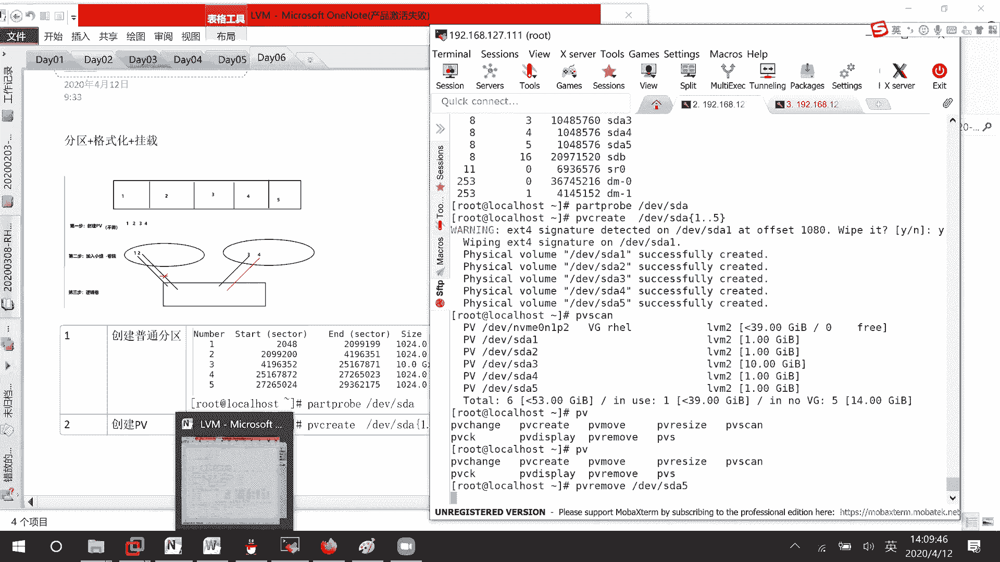

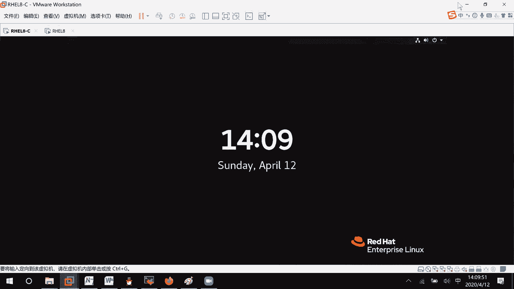

这里创建这个的话呢是一个叫做移除好吧，稍等我去整理一个表格吧，我不整理表格，我难受，放点PV，然后这里的话呢就是说是移除PV，然后接下去的话呢查看PV，他这里移除成功了，我们来查看一下。

他的话呢你会发现其实就少了一个叫做SDBO，S da5，就少了，我很喜欢去说STB，因为之前的话呢，呃红帽当中他的第一个盘就是SDA，不是这个NBME的，好吧，欠可能是一个新版本的虚拟机。

所以是这个那好，除了这个的话呢，它是不是显示出来哪一个分区，贡献了多少大小啊，然后还有一个呢p vs，你看这里不是有一个命令吗，稍等哈，你的话呢可以去查看一些简略的一个信息，查看一个简略的一个信息。

这个信息的话呢会详细一点，你看下面这里的话呢还有一些统计信息吗，对不对，PVS两个命令咱们全都是查看，然后下面这边的话呢咱们再来看一下，就说现在如果说想要把单块加进去呢，就这样子DVSDA5就可以了。

刚才这种的话呢是多块加进去，这看明白了吧，创建PV，也就是说这个PV的话呢是成为LVM以后，能去背逻辑卷使用的一个前提，接下去第三步的话呢，我们就要去创建小组了，这个什么意思呢。

如果说我这个逻辑卷的话呢，从某个小组里面去取嘛，这里虽然是三块信息放在这一个小组里面去，我我的话呢就认为他们这三个的话呢，形成了一体，就不会说我的话呢，比如说一定一次性要拿一个G的大小过来。

我也可以就拿500兆给我这个逻辑卷使用，剩下是不是还有500兆，还可以给另外的一个逻辑卷使用，因为就是说形成小组之后，我就不再区分块和块之间的一个距离了，我大家的话呢就在一个池子当中。

然后需要的时候去按需获取就可以了，能明白吗，按需获取就是说大家形成一个小组之后呢，资源是融合的，它不再是分开来的，好吧，那行这个小组的话呢，我们怎么样去创建呢，他是这个vg correct。

Vg correct，然后这里你给它起一个叫做小组的名字，是什么，然后呢你再把这些成员给放进来嘛，比如说vg corrector v g0，然后呢成员有哪些呢，比如说我我现在这边就创建一个小组啊。

LV等一下卡住了，VSDA叫做1~5全部放进来，可以吧，稍等一下，让他去放吧，创建小组，那好这边的话呢我们来看一下小组创建起来了，我们来看PV有没有发生变化，这里的话和刚才有什么区别。

刚才p vs这边的话呢是不是空了，就表示它不属于任何小组，现在呢是不是就有VG0这个东西啊，就属就说明我这个成员属于哪个小组，都说出来了，看到了吧，这没有问题啊，这里查看小组信息哦，等一下就这里的话呢。

呃可以去看到属于哪个小组，TV大小啊，然后呢分区啊属于的小组啊，是不是都可以看到，然后如果说我单单的想要去看，我们小组的信息呢，BGS稍等哈，他这个信息不知道为什么都这么慢。

你看这里IHEL咱们不管我们这边的话呢，一个V70，我刚才的话呢是不是三是一个实际的大小，1G1G1G1G加起来的话呢，差不多是不是14个G，有一点损失是正常的对吧。

所以这里VGS的话呢去显示一些简单的信息，这里的话呢小组的名字，这里PV有几个，我这边的话呢有没有去形成逻辑卷呢，没有我没有给任何一个逻辑卷去使用，然后呢这边就是它的大小，总共大小。

这边的话呢剩余大小是多少吗，好吧，还有一个叫做飞机sky，稍等啊，vi skin的话就说去扫描一下信息，这里就RHEL的话呢，它的一个原始数据格式是怎么样子的，发现了发现了哪一些小组，发现了一些小组。

这边的话skin是一个简简阅信息，S的话，那才是一个详细信息啊，好这没问题，如果说你想要去看一个更详细的吗，笔记display，这是更详细的，比如说无线的话呢，想要去他这个现tab键不太好用哈。

我现在又被卡住了，你们等一下，比如说我现在想要去看BG0，查看详细信息，更详细的，看这里的话呢就说我危机零格式LVM2，然后呢有几个分区在里面的五个，然后编号是一可读可写大小呢是可以去变的。

然后这里的话呢大小是多少，每个pee的size是多少，这个pee是什么东西呢，Pee，也就是说我后面去创建逻辑卷的时候，最小的分配单元，就说我一次的话呢就会给他四兆的大小，就如果说他创建的是16兆。

那好我给他两个P，如果他说他想要去创建18兆呢，我只能哦16兆的话呢，应该是四个P哈，如果说我想要去创建18兆呢，四个是不是只有16不满足啊，五个五个五个的话呢，它可以达到一个叫做20兆的一个空间嘛。

他的话呢给多不给少，知道吧，如果我们到时候在创建逻辑卷的时候呢，它的大小是多少，除了可以去直接指定大小，你还可以去评定P的个数，也是可以的，知道吧，这里这一信息的话要稍微会看一下。

然后这里的话呢嗯我们看一下怎么样去移除，现在的话呢就不是移除什么危机小组了，我们就说移除PV快，怎么样去移除，添加是vg correct，移除呢，Vg remove，然后呢从哪个卷组里面。

Vg remove，Vg0，稍等哈，他这个线删不了啊，好了，从VJ0里面的话呢，去移除DEVSDA5好吧，去移除回车，我看一下啊啊我这边是拼错了哦，是个cess success。

他的话呢现在就把它给移除掉了吗，我们来看一下BJS，等一下，唉呀我用的是vg remove，对吧，我写错了，这里我写错了，难怪有这个问题，稍等啊，我把这个郡主再创建回来，这个vj remove的话呢。

是把整个整个移除，整个VD，整个小组都把它给移除掉，其实就前面这款命令就可以了，如果说我们现在只想要去移除我们的PV快呢，是vg reduce，稍等好移除，vg reduce叫做从危机零里面把DEVS。

DA5去进行一个移除，等一下好线的话，你看BBS它是不是就不属于我们的一个VG，然后的话我们来看一下BTS它的大小的话，应该会从刚才的14兆变成现啊，14G变变成现在的13G对不对。

这个的话呢就是说这样子可以去进行一个移除，然后的话呢我们再来看一下，如果说我们现在呢想要去把SDA5再加进来，预计extend v g0把谁给加进来呢，e vs v a5这个PV快给加进来。

因为它本身就是一个PV嘛，我把它加入到某个小组当中去嘛，没有毛病吗，皮卡稍稍等哈，这个是上面是移除，下面的话呢叫做新增，用力快，好这个时候呢我们再来看一下PBS，这边的话呢。

是不是就全部把它加入到我们的一个，叫做危机当中去了，这个没什么问题啊，接下去的话呢我们来看一下，我现在的话呢把这个叫做危机给移除掉，remove掉，刚才的话说，这个PE是以最小单位去进行一个分配。

我觉得四兆为最小单位是分配的太大了，我我就说可能太小了，我能不能去指定八兆或者16兆或者其他的，就是说大小的话呢多少都是可以的，但基本上去分配的时候都会48648 16，32这样子去分配好吧。

这边我的话呢就比如说在创建的时候，创建以及指定PE为八兆，这个的话呢你创建起来之后的话，就不太好修改了，就在创建的时候呢，咱们就去说大小是多少，立即correct减S8兆，创建的小组名字叫什么呢。

比如说VG1谁呢，d vs d a1到五加进来就可以了，我们等一下的话呢去查看一下详细的信息好吧，等一下，那好vg display叫做VG1，稍等一下好，你看这边的话呢。

是不是就从刚才的四兆变成现在的八兆啊，那好这没问题，这个就是我们把小组创建一下啊，它就像在你们可以把它想成一个存储池，我把很多资源丢进去，如果需要的话呢，我们的逻辑卷再从存储池里面去拿。

现在这里第四步创建逻辑卷，逻辑卷的话呢，它的一个命令是什么呢，LVM对不对，他是LVLV就够了，S的话呢看一下现在有没有逻辑卷吗，有一个的话呢是我们的根目录，还有一个的话呢是我们的swap，对不对。

这两个本身就有吧，但是没有我们自己去创建的嘛，来创建一下，创建它都是correct解L，比如说我给他100兆，你们来想一下现在的P是不是八兆啊，100÷8等于多少，是不是12。5啊，不可能分配小数的。

所以这边只能是13去乘以八兆，等一下它会获取到104兆，我们来看一下是不是这样子哈啊减n lv correct，减L表示大小是多少，减N呢，你创建的逻辑卷的名字叫什么，我比如说叫做LV1。

从VG1里面去拿，可以吧，你看这边的话呢，咱们是不是把它给创建起来，l vs是不是就多了一个，是不是就多了一个叫做LVD了，这边的话呢创建成功了，这里就稍等哈，好，创建国际卷这样子去创创建，看看到了吧。

然后呢接下去逻辑卷已经创建起来了，然后查看的话呢，我们也可以去查看叫做LVS嘛，查看逻辑卷，然后的话呢我们回过头来和刚才一样，去看一下PV，哦不对，要去看一下，这个叫做VG，看错了，一级，稍等啊。

我这边讲完了之后就会让大家去总结一下，再坚持一下就好了，你看这里的话呢，VG1它是不是属于了一个LV啊，因为我拿去分配了嘛对吧，然后呢现在的话呢分配了之后，我们的一个叫做LVLV1。

他从VG1这个小组里面来拿的大小是多少呢，是不是一个叫做104104啊，我看这条线好像画错了，这边从两个小组里面拿，我有点浮夸了哈，这里吧他们是一个大的一个团体吧，你是没睡醒啊，好吧。

从一个小组里面去拿，那这边的话呢是不是就创建了一个VG一样，那好接下去如果说我这个LV在创建的时候，104兆，我觉得太大了，其实我就是说你只要比90到大一点就行了吗，我想要去少一点怎么办，怎么样去进行。

我这边再来讲一个吧，这个的话呢是不是指定大小的方式，还有一个的话呢，就是说是DP的个数怎么样去做，因为考试的时候呢，他会让你去指定个数，因为他P1已经设定好了嘛，接下去就让你去指定个个数，我们要去做呢。

Lv correct，这里的话呢大写的L后面跟的是具体的大小，小写的L后面跟的是你要几个P，比如说我只要十个P减N叫做LV2，从我们的VG1当中去拿，稍等哈，我点了一没反应。

哈哈这边的话呢我就创建了一个叫做LV1，从我的VG1当中的话呢，去拿过来的大小的话呢有多少呢，你看大小的话是80啊，因为每个是八兆的P，十个的话呢是不是就是80的一个P啊，那行那这没有问题，现在的话呢。

比如说我的话呢，想要去从剩余空间里面去取50%，作为我的一个啊，LV的一个大小呢，从剩余的空间当中取50%创建，就是说指定百分比，百分比的话呢，考试考了这么多次，我还没有见到过，这边的话呢。

先给大家来看一下lv correct减N，这也就是说减L比如说50%的一个大小，从我们的剩余空间里面，等一下我先看一下，我们先来看一下摄影空间吧，AGS等一下，然后呢lv correct减L五十百分号。

free减N比如说叫做LV3，从我们的VG1当中去获取，他这个应该就有很大了吧，差不多有七个G要到了吧，对不对不对不对，13。78，至少有六个6。5G以上嘛，6。56。5，6。4左右，6。4左右。

l vs你看哦七个G要到了，因为这边的话，差不多都已经要达到14个G了嘛对吧，二七十四对，6。5的话呢才13对吧，这个是没有问题的哈，指定百分比，所以基本上我们在创建这个逻辑卷的话呢，有这三种方式。

然后接下去查看也知道的，我们来看一下移除逻辑卷，逻辑卷怎么样去移除呢，L v remove，它就是一个移除VV稍等哈，我就不应该按tab键，但是按习惯了就一直想要去按tab键，像这些删也不好删这个字。

你看比如说我现在的话呢想要去把，因为你看这个叫做LLV3，是不是在我们VG1这个卷轴下面，这个VG1的话呢，是不是又是在我们快设备下面，所以就是VG一下面的LV3这个小组，我想把它给解散掉回车。

这个的话呢就是说等一下我们就看不到LV3，这个小组了，他这里的话呢问你要不要移除Y表示移除，还有一种的话呢直接就是减Y，确定要把它给移除掉，他们就不会再问你了，好吧，这个的话呢没有什么样的一个问题啊。

然后接下去我们的一个叫做LV的话呢，已经创建好了，比如说他现在不够了呢，我可不可以对它进行一个增加呢，l vs我最后一个知识点讲完，就让大家去做一下了哈，你看这大小是104兆，那它的扩展呢有吗。

有然后后面的话呢就是说它要扩展到多大嘛，对不对，Lv extend，等一下我先把这个给删了，比如说你想要让它再加上多少兆，比如说再加上80兆，前面还是指定大小，这个符号加到多少兆，加80兆，对谁呢。

DEVV级一下面的LV1，只要V级一下面有空间，我就可以进行一个扩展了，所以呢这边等一下会变成184兆，这里叫做拓展LV好吧，这种的话呢是还没有格式化之前，可以这样子去扩展，如果格式化之后呢。

怎么样去扩展，我们到时候再去说，你看这边的话呢是不是就是184兆，如果说你觉得这个信息太多了，我又不想要了呢，是不是就是要对它进行一个缩小啊，前面的话呢你们来看一下跟一个减号可不可以。

lv extend减大L，比如说减去80兆EVAGE叫做LVE，这边的话呢叫做invalidsize emelody size，这边的话呢就是说不能这样子去做，不能这样去做好吧。

嗯lv reduce减肥，他的话比如说80兆BVVD1LV一，稍等一下他的话呢，extend只能是扩展，如果说要变小的话，用的是这个叫做减少LV缩小吧，你看lbs等一下这边的话呢是不是就80啊。

这个意思就是说缩小到80到上面，这里的话呢，如果说你想要扩展到200兆，怎么样去做呢，Lv xk200，这个扩展到200兆，不对，这个是扩展80兆到空间，然后像这个的话呢叫做lv extend。

后面直接跟一个数字，就是扩展到哪里去，知道吧，像下面这里的话呢，就是说减少到80兆的空间，我们来试一下它有没有减少多少空间，比如说我这边想要去减少80兆的一个空间，看可不可以等一下，比较慢一点诶。

你看l vs他这边的话呢，是不是卷的大小到120兆，就说明可以减少到啊，不对，就说明这条命令的话呢就是减少少80兆，而不是减少到80兆，好吧，就这样子去操作这个的话呢，呃我们形成这个小组之后。

他的话如果不够的话呢，就可以去从小组里面去拿空间，如果够了的话。

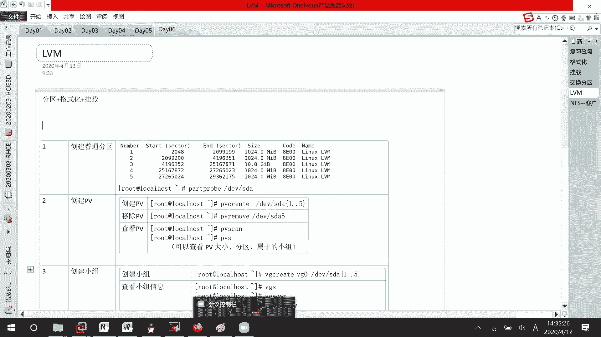

或者太多了的话呢，你可以把信息放回去嘛，可以把信息放回去。

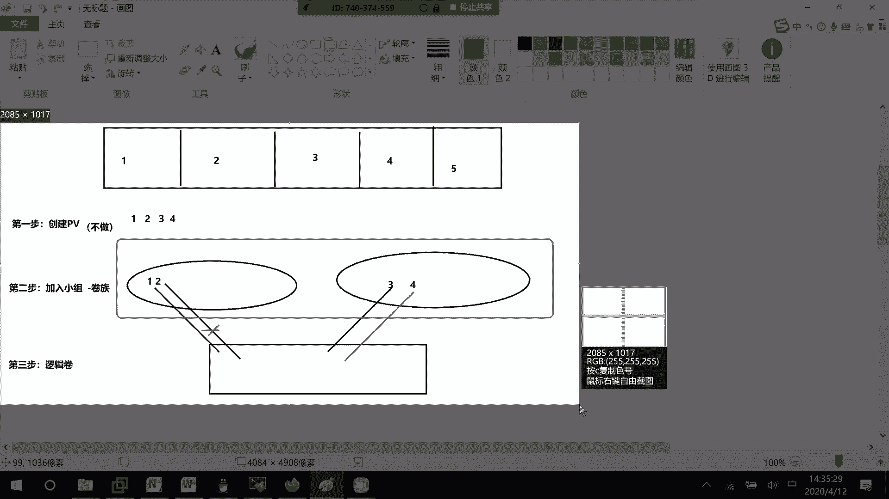

现在我们是还没有格式化的时候，没有格式化就表示现在的系统还不能去用嘛，我们呢等一下去讲一下怎么样去格式化，格式化了之后呢，怎么样再去缩小空间，好不好，讲的内容可能有点多了哈。

那好下面这边的话呢我们继续刚才的话呢，其实我们去做的，比如说逻辑卷的创建或者卷轴的一个创建啊，都是在还没有在使用的时候，我们去进行一个创建，所以的话呢限制条件会很少，像现在这里的话呢。

可能我们是不是已经创建了一个卷轴出来啊，就是说已经创建了一个逻辑卷出来吗，叫做LV1，还剩下，Lvs，稍等一下，你看这里的话呢，是不是就多了一个LV1，如果说我们想要去把它变成像刚才的SDA5啊。

SDA6样去使用的话呢，怎么办呢，第五步，我们现在要去对它进行一个格式化，因为我们做了这么久，产生了一个逻辑卷，就相当于之前我们产生了一个分区而已，就相当于刚才去产生了一个分区，你没有办法去使用的。

你看blog id这里的话呢，有没有那个叫做嗯LVE啊，他根本没有，或者我来grape一下，是不是没有，那就没有办法去使用吗，如果说我们想要去使用的话呢，对它进行格式化，这边格式化的话呢。

我们知道是不是会有两种情况，常用的XFS，还有一个的话呢叫做EXT4的，我先来讲XFS，再去讲ex t4，考试的话呢主要是考这两种好吧，这里格式格式化还记得吧，make fs x f s对谁呢。

对这个叫做DEEVAGE下面的LVE，这里格式化完了之后呢，它的一个快大小啊，就是说对快大小是不是4096，B就是说4K的一个大小吗，然后如果说我们想要去使用它呢，先来看一下DF减H。

这里的话呢是不是都没有人去使用，我这里mod v vg，一下面的LVE挂载到AA下面来DF，你看这里是不是就多了一个叫做稍等，我看一下DVBGELVEAAA怎么没有呢，估计是刚才叫做没有去把它给卸载掉。

嗯DEV诶，这里的话呢全都没有这个信息哈，没有这个信息，我看一下，先AAA我来make一个DR吧，叫做现在去用的叫做LVAAMDVVG，一下面LVE它把它挂载到LVAA下面来。

好这就有刚才那个AA会出错的原因，应该就是说我刚才的话呢，把呃分区给清空的时候呢，没有先把它给卸载掉，就出了这么一个问题吗，好吧那行这边的话呢我去挂载，挂载完了之后的话呢，我去进行一个查看。

查看的时候呢，我看到了这么一个信息，他的话呢是XFS的一个格式，大小的话呢，差不多是一个叫做115兆嘛对吧，然后的话呢啊使用了7%，挂载到了LVA下面去，我发现这个的话呢现在太小了太小了。

等一下的话呢我对它进行一个扩展，就是变大好不好，然后这边的话呢，这样子mt它是不是一个叫做临时挂载，临时挂载，如果说我希望永久挂载呢，这边的话呢就需要去编辑那个文件，Etc f s table，知道吧。

里面的信息的话和刚才是一样的，其中你们可以来看一下，我这边挂载的是不是DVVG一下面的LVE啊，但这边呢它映射到其他的名字，就相当于我们d vs20和d v CD room，它代表的是不是同一个东西啊。

这个的话呢也是代表同一个东西，知道吧，好像如果说像这个逻辑卷要进行挂载的话呢，怎么办呢，PVVGVLVE挂载到哪里呢，LVAA格式呢，XFS选项呢没有零零就行了，就是说它不是什么LVM的。

它就是一个叫做XFS的明白吧，这边我就不再去写了，因为我等一下绘制把它给清空掉嘛，好吧它的永久挂载呢就这样子去写就行了，那好这个时候的话呢它的大小哦，等一下哦，没事没事没事。

它的大小的话呢是一个叫做115兆，我觉得太小了，我想要去对它进行一个扩展，扩展到多少呢，扩展到200兆吧，这个的话呢该怎么样去做呢，首先我这边看到它的size，是不是一个叫做1152。

200-115等于多少呢，是85，我这里每一个块的大小的话呢，是八兆和P大小是八兆，15除以八等于十十点几，那也就是说其实我等一下再扩展的时候呢，是8×11=88，再加上这个115。

就说会在两百零两百零几的一个附近嘛，190几有可能两百零一两百零二，有可能就差这几兆空间呢是没有关系的，明白吧好现在已经格式化完了，就说明我的话呢，C d l v a a。

它这里面的话呢是不是可能会有一些文件存在，如果说诶多了一个点哈，没关系，有一些文件存在，如果我们在扩展的时候呢，能不能把这些文件给消除掉呢，如果消除掉就没有意义了，那你还不如把它给毁坏掉。

然后才重新再去创建我们的一个逻辑卷吗，所以这边的扩展的话呢，希望文件不丢失，知道吧，我这边的话呢去写入一些东西啊，20200412，比如说XFS写入到test里面去吧对吧，有这些文件，你们先来看一下。

我们的话呢扩展要怎么样去扩这张图，扩展和缩小的图呢，大家心里一定要有一个印象，比如说这是整个小组卷轴嘛，其中我这里的话呢，有一个分区叫做叫做有个逻辑卷，叫做DV下面的，VG一下面的LV1好不好。

他现在的话呢是115M，并且的话呢已经被我进行格式化过了，诶等一下，已经格式化过了，那问你现在要做的事情的话呢，是什么样子，要做的事情，我希望它扩展到200兆，也就是说是不是再给他差不多嗯。

88兆的一个空间啊，空间先给它加上去，第一步先添加空间，第二步呢是不是对扩展的这部分呢和这里一样，把格子去打起来啊，所以的话呢总共是是不是这样子，两步走，先扩展空间再去打格子，你不可能把格子打好了。

再去把这个空间划分出来吧，万一这个格子打大了呢，打了200或者打了300兆的一个空间呢，能明白吗，所以在扩展空间的时候，一定要注意先去扩展空间，再去对扩展的部分进行一个格式化，这两步走我列个表格哈。

第一个扩展空间空间的话呢，它扩展怪是空的，第二步的话呢就是说格式化扩展的空间，好这边的话呢我们前面已经学过了，怎么样去进行一个空间扩展的，是不是lv extend扩展到200兆对吧，200兆吗，对谁呢。

DV稍等下五个小心，又按了tab键，VVVG1LV一对吧扩展到200兆，你看这里的话呢就是200兆l vs诶，刚好的话呢是一个200兆哈，200÷8等于多少，我算一下，哦刚好是25个，刚好是25个。

因为他那个115的话，其实这边看到是不是一个120啊，我再增加80兆就够了对吧，那行现在的话呢我空间增长了，那系统识别出来是多大呢，就好像刚才我同学说的，这边能不能直接识别出呢，没有识别出。

因为你还没有格式化，我的系统是识别不到格式化，这就说未格式化这一块的一个空间的，明白吗，所以这里一定要注意叫做空间扩展了，但是文件系统还不能使用，没有不说话，好像我们刚才没有格式化的时候呢。

是不是连UID都没有啊，一定要格式化才能去用，这边的话呢我们去格式化一下扩展的空间，你就不能再使用make fs x f s了，这是对所有整个分区进去进行一个格式化的。

我们现在如果说只想要对扩展的部分呢，有一个命令，叫做x fs gross fs，它扩展的部分的话呢在哪里呢，是不是DVVG1LVP啊，这条命令的话呢，他会自己的去找一下扩展的部分在哪里。

或者的话呢你直接就去使用这个叫做LVAA，也可以，就是说要么对挂载点直接去扩展，要么直接就说对于嗯这个分区进行扩展，随便都可以，我这边的话呢比如说叫做挂载点好吧，我还是使用那个吧，叫做分区的名字吧。

DVVG1V一嗯，嗯我看一下，这哎这就是就这个格式啊，D is not mount，那这边如果在格式化的时候呢，只能这样子的d v map v g1LV一诶，X f s gross fire。

稍等我看一下，他这边只能是一个挂载点吗，LVAA诶，这边就没有报错了，那这里的话呢稍微去注意一下，如果在进行空间进行一个拓展的时候，后面只能跟上挂载点，连分区去跟都不可以，这里诶只能去跟挂载点。

他的话呢连跟上时原先的分区的话都不可以了，这边DFHT是不是就从刚才的差不多，115兆变到现在的200兆附近啊，有一点损失肯定是正常的，对不对，所以然后呢，我们再来看一下它里面的文件存在吗。

是不是还存在cat，它里面的test东西还在吗，是不是还在，所以这个的话呢就是支持在线扩展，而且文件是不丢失的，明白吗，那好检查，稍等一下，这就是刚才有位学员去问的，就是能不能识别到。

能不能识别到的话呢，跟你格式化是有关系的，格式化是有关系的，行这个是我们XFS怎么样去进行一个在线扩展，如果说你想要去进行一个缩小呢，文件的一个缩小，它的一个形式是怎么样子的，我们来看一下现在的话呢。

是不是整个大小是有一个，叫做200兆的一个空间啊，就比如说我想要去回收20兆的空间怎么办，你如果说20兆空间是不是会有这种想法，直接把从这里呢推20兆进来，这种情况的话呢你觉得靠谱吗。

这样子直接推进来的话呢，叫做这个格子是不是就扭曲掉了，就好像我们生活当中是不是就扭曲掉了，这个时候就会有问题吗，就是说直接去回收这块空间的话，这就有问题啊，首先的话呢我们那个操作是怎么样子的呢。

先去回收20兆的空间，等一下这边就是说你是先去缩小空间呢，还是去先去缩小文件系统，我们先去把这个叫做文文件系统的话呢，先去把它给缩小掉，这20兆的话呢先回收回来，回收回来了，这就说20兆的文件系统。

先把它给删了，删了之后呢，再把这个20兆的空间给收回来，听明白我的意思吗，先去把文件系统给缩小，然后的话呢再去回收我们的一个空间，知道吧好吧，他这一个的话呢叫做嗯扩展和缩小的话呢，它是不一样的。

它是不一样的，我这里给你们去写一下哈。

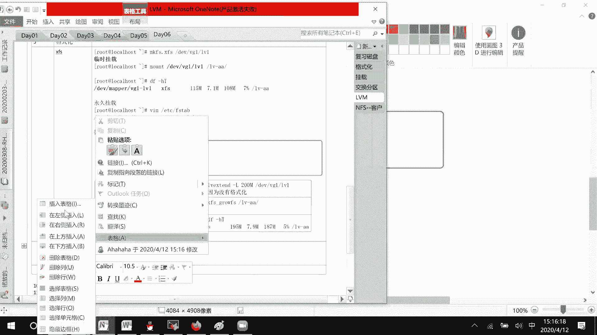

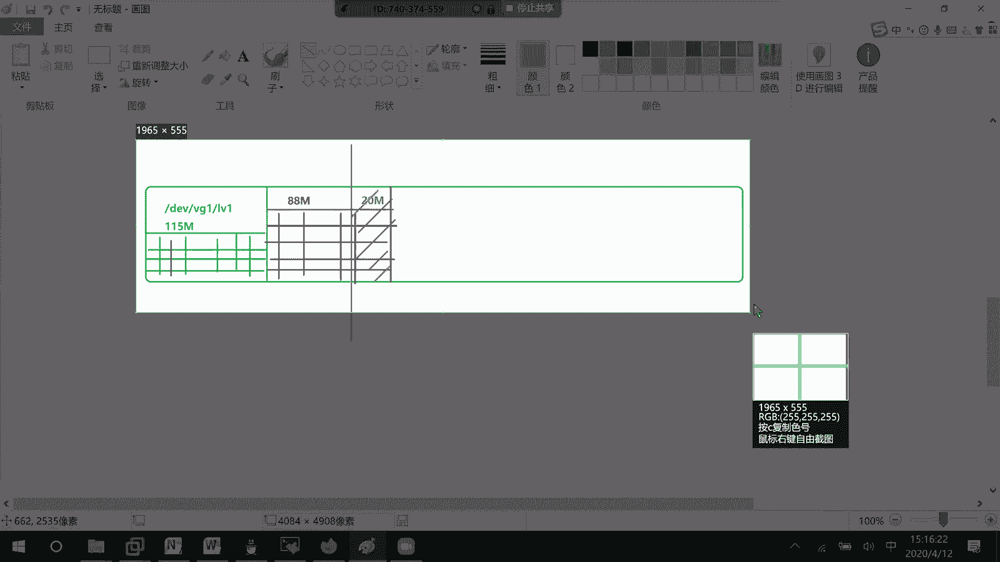

一步先缩小哦，文件系统，就相当于这一步就是说扩大稳定系统，我是先缩小，然后呢再回收空间，知道吧，杠是反着来的，如果先回收空间的话呢，这整个文件系统就崩掉了吗，有问题啊，然后这里的话呢要稍微去注意一下。

XFS的话呢，我们是没有办法去缩小空间的，只能去进行一个扩展的，只能去扩展它的话呢没有办法去进行缩小，所以我们这边如果想要去缩小的话呢，需要这个EXT4嘛，所以这边我呢跟你们去讲一下。

ex t4怎么样去进行一个空间的扩展，怎么样去进行一个空间的缩小好吧，在我们的考试当中，如果说你扩展或者缩小做错了，然后你又不会去改的话呢，可以去找考官，让考官把你的环境重置一下。

也就是说你从第一题呢又要重新开始去做了，明白吧啊这边有些，you want嗯，LVAA稍等啊，C的点点，You must lv aa，为什么会出现这个问题，我刚才就在LVAA就说正在使用这个挂载信息。

我再去进行一个叫做卸载是不可以的，就相当于我们windows叫做U盘被占用吗，知道吧，然后这里的话呢，我们把LV1的话呢去进行一下格式化，XFXEXT4DVVVG一。

下面的LVE格式化成EXT4的一个格式好，这里的话呢就把它给格式化完了，稍等格式化完了，但是他现在的一个空间大小是多少呢，等一下，嗯好慢，空间大小，是不是有一个叫做200兆的一个空间啊，如果说上面一样。

我想要去进行一个增加呢，再增加一个40兆，首先是不是要去扩展它的一个空间啊，Lv extend，这边的话呢，比如说扩展到240兆，直接写一个数字也可以，等一下这边我就按了一个大写。

不小心开播间又按到了DEV，叫做VGELVE，扩展到240兆，然后接下去的话呢，我们在对扩展的空间进行格式化嘛，XFS是一个x f s growth的一个方式，他这边呢resize，叫做2FXFX谁呢。

D v v g e l v e，他这边的话呢哦稍等一下，我这边先去挂载一下，我这边先去挂载一下嗯，稍等mount EV EG e l v e l v a a，他现在的话呢。

是不是差不多有230兆的一个空间啊，230兆的一个空间，那行，现在的话呢比如说我想要把它扩展到400兆吧，那要做的事情是不是先去增加空间，lv extend l400兆的一个空间，BVVGELVE获得。

然后呢，接下来我们再对扩展的部分的话呢，进行一个格式化，稍等一下，慢一点，好扩展的部分格式化，Resize 2f s b v v d e l v e df ht，你看是不是就从300兆的话呢。

差不多变到一个400兆对吧，他这个的话呢就是这样子去做的，扩展命令都是一样的，检查的话呢也也给你们去检查了，直接就空间它大小的话呢也是不会去改变的，然后接下去我们主要来讲缩小这一块，先去缩小文件系统。

但是呢他这个就不能再线去缩小了，等一下你的LSLVAA，因为刚才经过格式化了，所以它里面没有东西是正常的，比如说ECOACH，20200 4125：21分45秒，我把信息的话呢放到LV下面。

叫做test，好吧，现在我们来看一下缩小空间文件会不会丢失，创建一个文件在里面，然后接下去的话呢这里要注意一下缩小空间，它是不能在线缩小的，我们现在要做的一个事情呢，先去卸载，然后你才能去进行一个缩小。

卸载的话呢u ml v a a对不对，然后呢空间怎么去缩小呢，先去缩小空间，在缩小空间之前，你们先来检查一下这个磁盘有没有问题，对文件磁盘进行一个查找，如就是说进行一个体检，如果你不进行体检的话呢。

到时候可能会报错，这个是红帽他自己的一个流程好吧，F s f c f d e v v g e l v e，然后这边的话呢他去检查12345，全都通过了，而且的话呢没有什么错误信息嘛，基本上没有错误信息。

如果有错误信息的话，那你这个盘基本上也不能去用了，先检查稍等哈，检查，然后呢检查完了之后没有错误，接下去我们进行一个缩小缩小的命令，也是resides2FS，对谁说小呢，DVDGELVE缩小剩下多少。

剩余多少空间，比如说我希望他回到120兆的一个空间，你就这样就好了，剩余120兆的一个空间，知道吗，然后现在的话呢我们先不去回收空间，我们先来检查一下文件系统的大小好不好，再等一下。

你看就是mt d v v g e l v b lv aa，你看现在的大小的话，是不是就只有120兆了，说明空间的话是真的已经回收了，然后的话呢我们来看一下它里面的文件现在吗，诶还在对不对，诶，等一下诶。

好叫做cat lv下面的test是不是文件信息都还在，说明咱们的一个文件的话呢是没有丢失的，那行接下来的话呢，因为这里有差不多280兆的空间，是不是被放回来了，被放回来了。

那也就是说l vs你看LV1总共有400兆，但是现在LV1实际在文件系统当中的话呢，是不是只有120兆，说明220兆的，280兆的话呢，现在是没有人使用的，我们现在去把空间回收一下，回收的话呢。

LV什么东西啊，reduce对吧，回收多少reduce，减少280兆对吧，因为我们那个400兆减去这边的话呢，刚才知道的120兆，知道的120兆，说明的话呢就是说有稍等一下，数学不好了，400-120。

是不是280兆，那如果说你回收290兆可不可以呢，可以文件系统就已经被损坏了，你回收270兆可以吗，可以不会损坏，只是说会有一点点空闲留在那里吗，会有一点点，就是说会有一些空间没有回收回来。

所以你们在进行回收的时候呢，一定要注意这个文件系统的大小，他的话呢就是说嗯你要去大于等于哦回收的，空间你的话呢要小于等于，啵你这个叫做文件系统回收的大小，你要小于等于它，如果超过它的话，那就不可以了。

知道吧，比如说我这边的话呢好减少到120兆，可不可以呀，也是可以的呀对吧，也是可以的呀，后面的话呢我们再去跟上DEV诶，稍等哈，我又不小心按了tab键，就这条命令吗，回收到多少，等一下。

VVVG1LV一，你看LSLVAA东西在的，Cat lv aa test，它文件也是在的，如果说我把它就是reduce到100兆，等一下，嗯稍等我看一下命令在这，那好这里的话呢。

我们再来看一下LSLEAA文件，还在的，cat一下，叫做嗯test它是不是也还在用mt一下，哎，you mt l v a a一下，再来M，EVVG1LVE叫做LVAA，你看它这里就会出现错误。

你的话呢等一下在120兆的时候，可以试着先去拥抱一下，再去小于120兆的时候呢，自己再去you want一下，自己去试一下，好不好好吧，然后这边的话呢就是我们逻辑卷怎么样去创建，怎么样去创建。

你们的话呢自己去看一下好吧，就去看一下有没有什么疑问的。

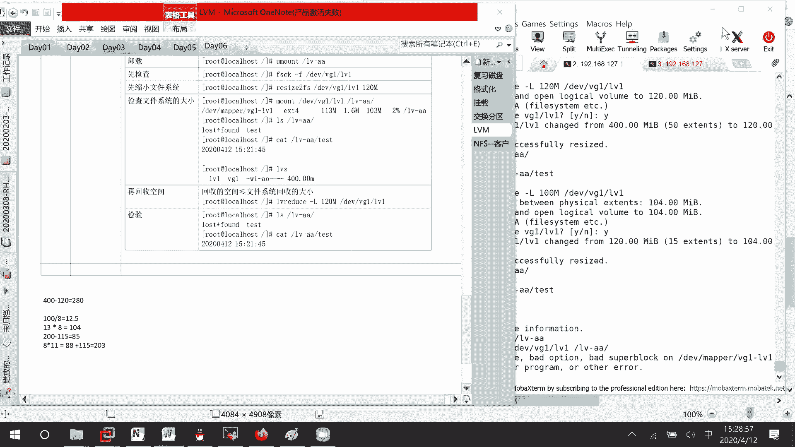