# RHCE8.0课程：04：逻辑卷管理（LVM）详解


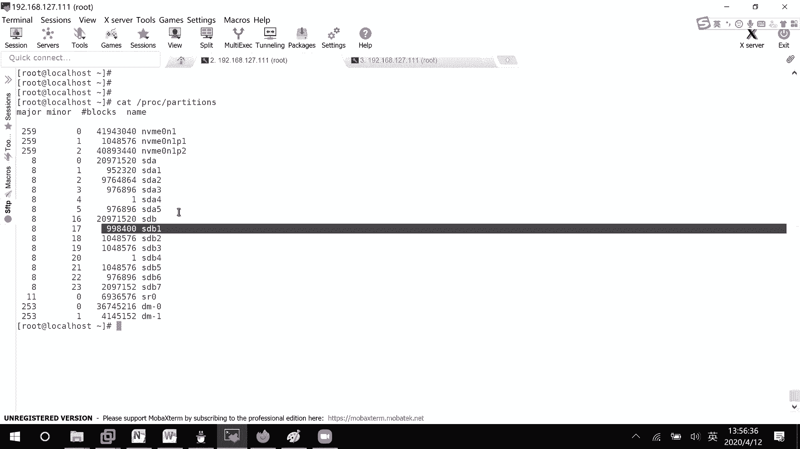

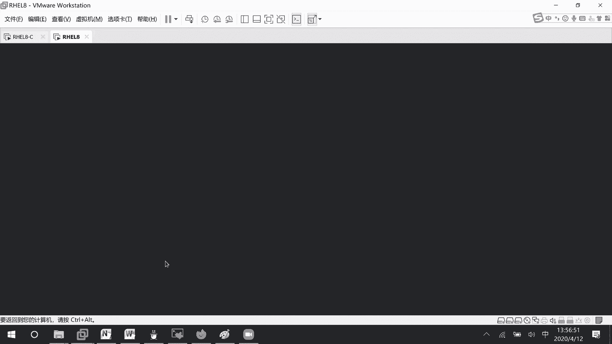

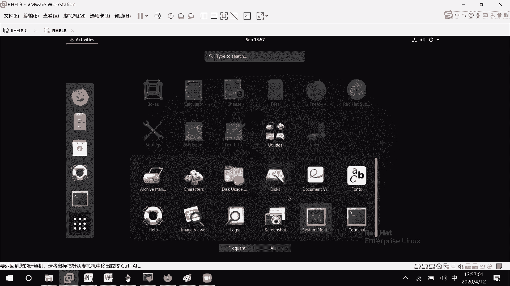

在本节课中，我们将要学习逻辑卷管理（LVM）的核心概念和操作。LVM是一种灵活的磁盘管理方式，它允许我们动态地调整存储空间的大小，解决了传统分区难以扩展或收缩的问题。我们将从基础概念讲起，逐步学习如何创建、扩展和缩小逻辑卷。

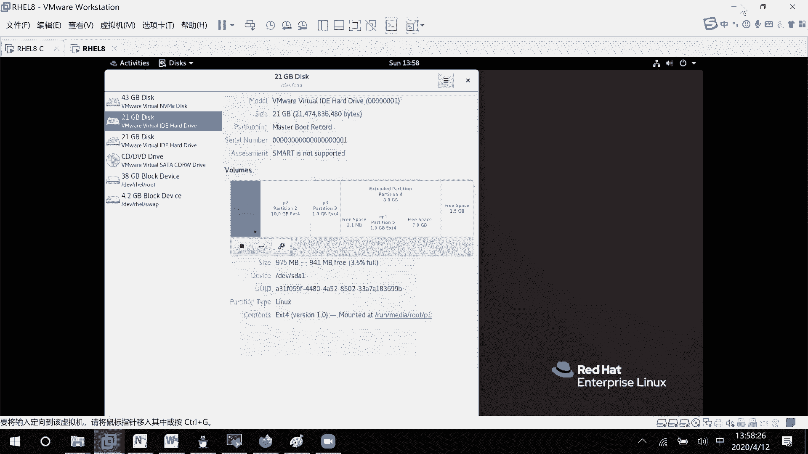

## 为什么需要逻辑卷管理？

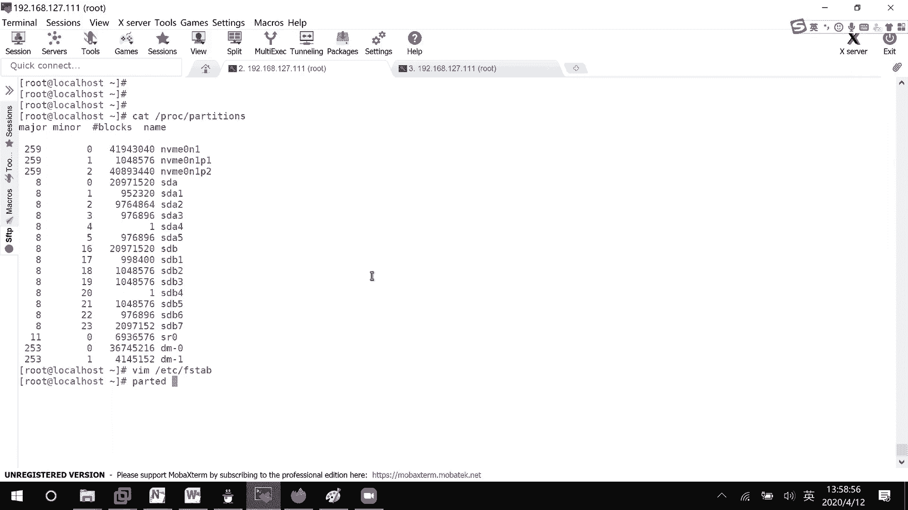

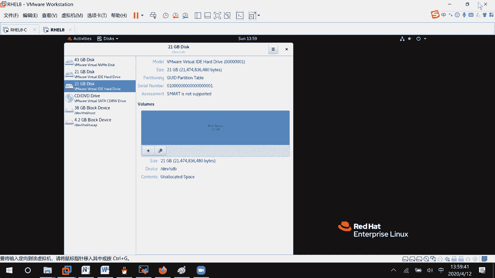

上一节我们介绍了传统的磁盘分区。传统分区一旦创建并格式化后，其大小就很难改变。例如，一个1GB的分区如果空间不足，我们无法直接将其扩展为2GB，这在实际使用中非常不便。

逻辑卷管理（LVM）就是为了解决这个问题而生的。它通过将物理存储资源抽象化，允许我们动态地调整逻辑卷的大小，而无需关心底层物理磁盘的布局。

## LVM核心概念与架构

LVM的架构可以类比为一个公司的组织管理，主要包含以下三个核心层次：

1.  **物理卷（PV， Physical Volume）**：这是LVM的基础构建块。它可以是整个硬盘（如 `/dev/sdb`），也可以是硬盘上的一个分区（如 `/dev/sda1`）。PV就像公司招聘的“员工”。
2.  **卷组（VG， Volume Group）**：一个或多个PV可以加入到一个VG中。VG将多个PV的存储空间汇聚成一个大的“存储池”。VG就像公司里的“部门”（如教学部、运营部），员工（PV）加入后，资源就被统一管理。
3.  **逻辑卷（LV， Logical Volume）**：从VG的存储池中划分出来的逻辑存储单元。LV才是最终被操作系统格式化并挂载使用的部分。LV就像部门里成立的“项目组”，按需从部门资源池中分配资源。

**LVM数据流向公式**：
`物理磁盘/分区（PV）` -> `汇聚成存储池（VG）` -> `划分出逻辑卷（LV）` -> `格式化并挂载使用`

## 实战：创建并使用逻辑卷

接下来，我们通过实际操作来理解LVM的工作流程。我们将使用 `/dev/sda` 磁盘上的分区来演示。

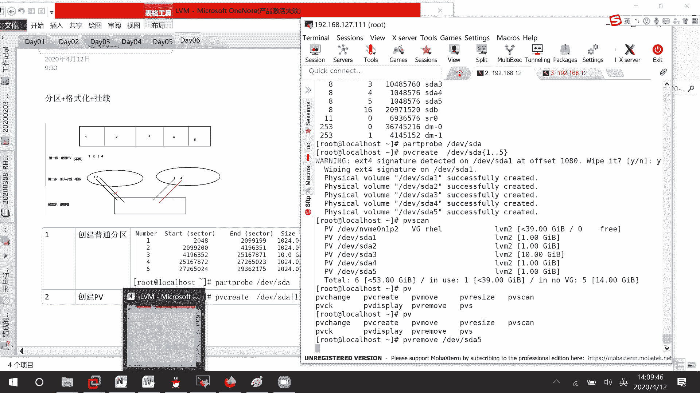

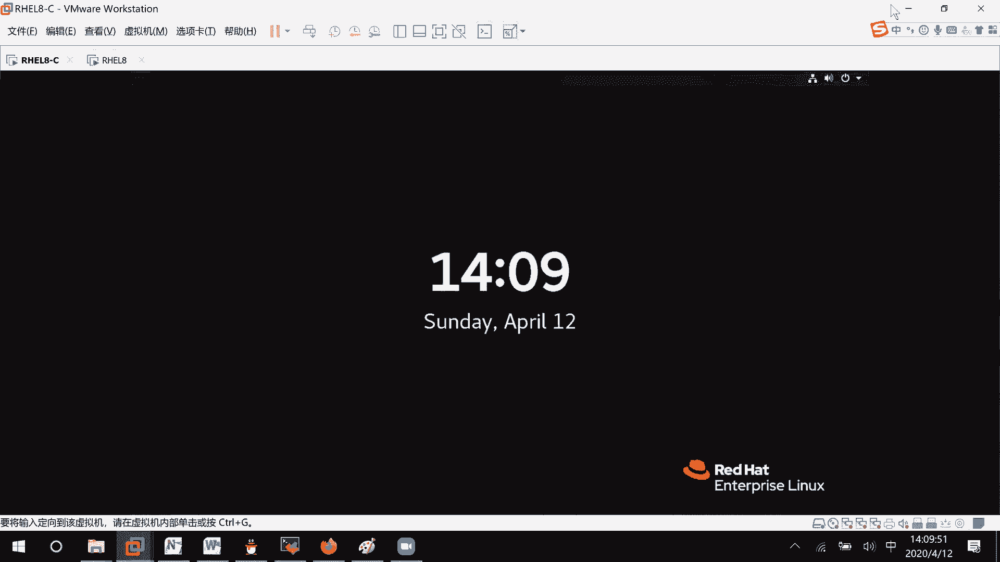

### 第一步：准备物理分区

首先，我们需要在磁盘上创建几个普通分区，作为后续PV的原材料。

```bash
# 使用 fdisk 或 gdisk 工具在 /dev/sda 上创建分区
# 例如，创建 /dev/sda1, /dev/sda2, /dev/sda3, /dev/sda4, /dev/sda5 五个分区
# 创建时或创建后，可以将分区类型标记为 ‘Linux LVM’ (代码 8e00 in fdisk)
fdisk /dev/sda
# 在交互界面中，使用 `t` 命令修改分区类型为 8e00 (LVM)
```

### 第二步：创建物理卷（PV）

将准备好的分区初始化为物理卷。

```bash
# 将指定分区创建为PV
pvcreate /dev/sda1 /dev/sda2 /dev/sda3 /dev/sda4 /dev/sda5

# 查看所有PV的详细信息
pvdisplay

# 查看PV的简略信息
pvs
```

**常用PV命令总结**：
*   `pvcreate [设备名]`：创建物理卷。
*   `pvremove [设备名]`：移除物理卷。
*   `pvdisplay` / `pvs`：查看物理卷信息。

### 第三步：创建卷组（VG）

将多个PV加入到一个卷组中，形成存储池。

```bash
# 创建一个名为 vg0 的卷组，并将 /dev/sda1-5 加入其中
vgcreate vg0 /dev/sda1 /dev/sda2 /dev/sda3 /dev/sda4 /dev/sda5

# 查看卷组信息
vgdisplay vg0
vgs
```

在创建VG时，可以指定**物理扩展块（PE）**的大小。PE是VG中分配空间的最小单位，默认为4MB。

```bash
# 创建VG时指定PE大小为8MB
vgcreate -s 8M vg1 /dev/sda1 /dev/sda2
```

**常用VG命令总结**：
*   `vgcreate [VG名] [PV设备名]`：创建卷组。
*   `vgextend [VG名] [PV设备名]`：向卷组中添加新的PV。
*   `vgreduce [VG名] [PV设备名]`：从卷组中移除PV。
*   `vgremove [VG名]`：删除整个卷组。
*   `vgdisplay` / `vgs`：查看卷组信息。

### 第四步：创建逻辑卷（LV）

从VG的存储池中划分出逻辑卷。创建LV时有多种指定大小的方式。

```bash
# 方式1：直接指定大小（如100M）
lvcreate -L 100M -n lv1 vg1

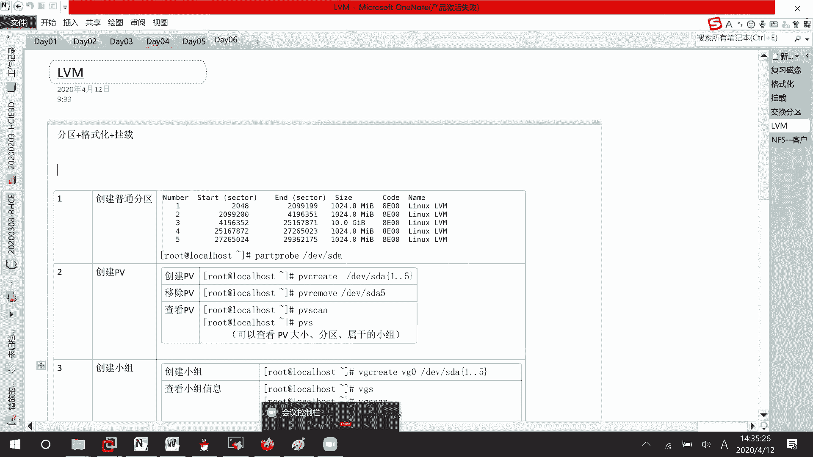

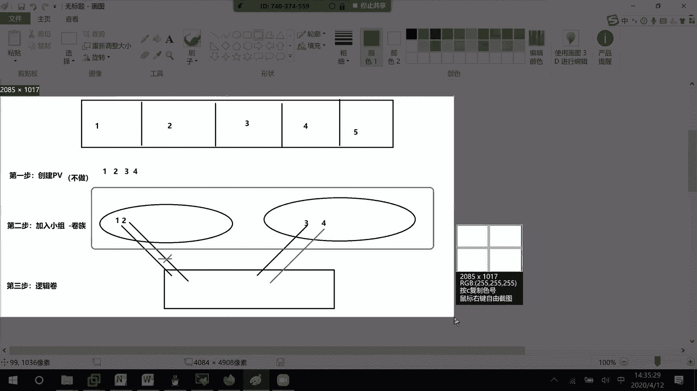

# 方式2：指定PE的个数（如10个PE，若PE=8M，则大小为80M）
lvcreate -l 10 -n lv2 vg1

# 方式3：使用剩余空间的百分比（如50%）
lvcreate -l 50%FREE -n lv3 vg1

# 查看逻辑卷
lvdisplay
lvs
```

**常用LV命令总结（未格式化前）**：
*   `lvcreate -L [大小] -n [LV名] [VG名]`：创建逻辑卷。
*   `lvextend -L [+大小]/[最终大小] [LV设备路径]`：扩展逻辑卷空间。
*   `lvreduce -L [-大小]/[最终大小] [LV设备路径]`：缩小逻辑卷空间。
*   `lvremove [LV设备路径]`：删除逻辑卷。
*   `lvdisplay` / `lvs`：查看逻辑卷信息。

### 第五步：格式化并挂载逻辑卷

创建好的LV就像一块新的“硬盘”，需要格式化并挂载才能使用。

```bash
# 格式化逻辑卷为 xfs 文件系统
mkfs.xfs /dev/vg1/lv1

# 创建挂载点
mkdir /mnt/lv1

# 挂载逻辑卷
mount /dev/vg1/lv1 /mnt/lv1

# 实现开机自动挂载，编辑 /etc/fstab 文件
# 添加一行：/dev/vg1/lv1 /mnt/lv1 xfs defaults 0 0
```

## 高级操作：在线调整逻辑卷大小

LVM最强大的功能之一就是能够在不卸载文件系统（在线）的情况下调整其容量，且保证数据不丢失。但扩展和缩小的操作流程有所不同。

### 扩展逻辑卷（以XFS文件系统为例）

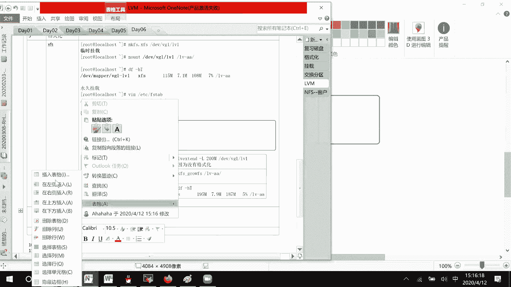

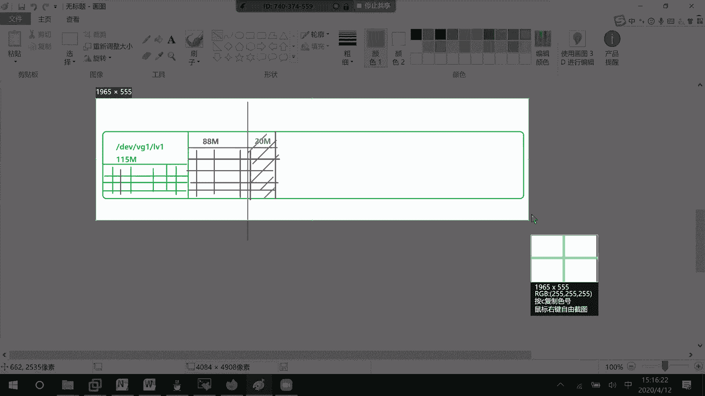

扩展操作分为两步：**先扩展LV的空间，再扩展文件系统**。

1.  **扩展LV的空间**：
    ```bash
    # 将 lv1 扩展到 200M
    lvextend -L 200M /dev/vg1/lv1
    ```
2.  **扩展文件系统（在线操作）**：
    ```bash
    # 对于 xfs 文件系统，使用以下命令扩展
    xfs_growfs /mnt/lv1
    # 或者使用设备路径（但必须已挂载）
    # xfs_growfs /dev/vg1/lv1
    ```
    操作完成后，使用 `df -h` 命令即可看到容量已增加，且原有数据完好无损。

### 缩小逻辑卷（以EXT4文件系统为例）

**注意**：XFS文件系统不支持在线缩小。缩小操作通常用于EXT4文件系统，且流程与扩展相反：**先缩小文件系统，再回收LV的空间**。并且，缩小操作通常需要**先卸载文件系统**。

假设我们要将 `/dev/vg1/lv1`（格式化为ext4）从400M缩小到120M。

1.  **卸载文件系统**：
    ```bash
    umount /mnt/lv1
    ```
2.  **检查文件系统完整性（强制步骤）**：
    ```bash
    e2fsck -f /dev/vg1/lv1
    ```
3.  **缩小文件系统**：
    ```bash
    # 将文件系统缩小到120M
    resize2fs /dev/vg1/lv1 120M
    ```
4.  **挂载并检查数据**：
    ```bash
    mount /dev/vg1/lv1 /mnt/lv1
    df -h /mnt/lv1
    # 确认文件和数据是否完好
    ```
5.  **回收LV的空间**：
    ```bash
    # 计算需要回收的空间：400M - 120M = 280M
    # 将LV的空间缩小280M
    lvreduce -L -280M /dev/vg1/lv1
    # 或者直接缩小到120M
    # lvreduce -L 120M /dev/vg1/lv1
    ```
    **关键**：回收的空间大小（`-L` 参数）必须**小于等于**第3步中文件系统已被缩小后的大小，否则会损坏数据。

## 总结

本节课中我们一起学习了逻辑卷管理（LVM）的完整知识体系。我们从LVM的必要性讲起，理解了其**物理卷（PV）、卷组（VG）、逻辑卷（LV）**的三层核心架构。通过实战，我们逐步演练了从创建分区到最终挂载使用逻辑卷的全过程。

更重要的是，我们掌握了LVM的核心优势：**动态调整存储空间**。我们学习了如何在线扩展XFS逻辑卷，以及如何安全地缩小EXT4逻辑卷。请牢记两者的关键区别：
*   **扩展**：先扩空间 (`lvextend`)，再扩文件系统 (`xfs_growfs`/`resize2fs`)。
*   **缩小（EXT4）**：先卸载，检查文件系统 (`e2fsck`)，缩小文件系统 (`resize2fs`)，最后回收空间 (`lvreduce`)。

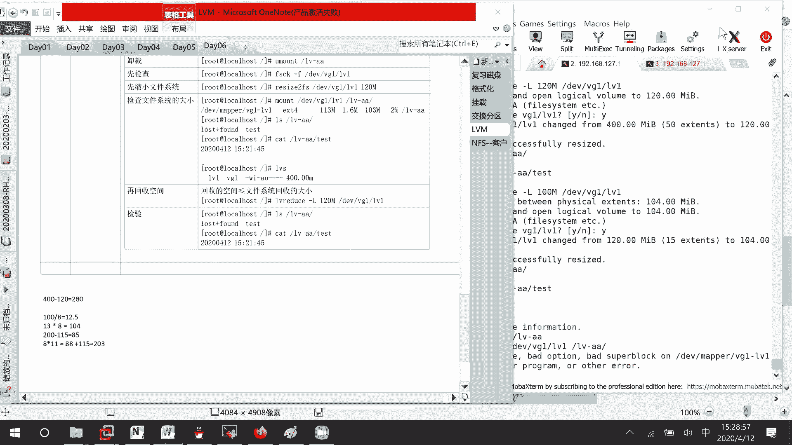

通过LVM，我们可以轻松应对存储需求的变化，实现灵活高效的磁盘管理。