# 01 RHCE8.0视频教程【45课时】 - P27：20200412-RHCE-05_recv - 六竹书生6682 - BV1m84y1f7ss

好，最后的话呢剩半小时时间，我们来看一下。现在的话呢我们要来讲一个东西叫做NFS。这个的话呢是什么东西呢？就好像说我这边有两两台电脑，一台电脑的话呢，IP地址是200。它的话呢是公司的一个服务器。

它有一个目录呢想要去共享出去。让公司当中其他人能来这边去获取资料啊，或者说放一些重要的信息进来嘛。

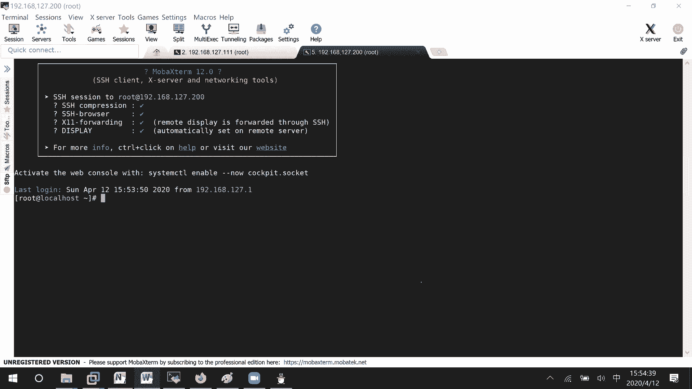

知道吧？这个就是N就是网络F就是文件S就系统。网络文文件系统。这些客户端的话呢，去把这里的目录信息给加载过来，我就可以去进行一个访问了嘛。就这样一个东西，我这边的话呢有两台设备。

这台设备是三个1的IP地址，我作为客户端这边设备的话呢，它是一个叫做200的地址，我作为一个服务器端，好吧，这里啊192。168。127。200，我作为我的服务器端。然后呢，192168127。111。

我作为一个客户端。首先的话呢。我们要配置的就是服务器端，它去共享一个目录出来。然后呢，服务器端去把目录信息给加载过来，然后呢在本地进行挂载啊，临时挂载啊或者永久挂载嘛。🎼这样子的话呢。

我们再去进行一个使用嘛，行吗？那好，这边的话呢，我怎么样去对它进行一个。🎼共享呢共享呢这里第一个服务器端配置。共享一个目录，比如说这里make BIR叫做什么文件呢？嗯，NFS。快死他吧。好。

创建起来了。我希望把这个目录共享出去。服务器端在哪里去说明呢？export这里面去说明。在这里面就说明你要把哪个文件呢给共享出去。有车里面怎么去写呢？哪个目录？🎼稍等哈，估计上滑线不行。下划线等一下。

我把它改改成一个目录，是下划线的吧，上划线不行啊。然后接下去谁能访问哪一个网段的能访问。如果你都写零的话呢，那就所有人能访问。比如说我现在只有127。024倍的网段可以去访问，怎么样去访问呢？

可以读写SYNC同步。也就是说只要有文件写上去啦，或者只要有文件被删除掉了。我这边立刻同步显示嘛。知道吧？好，这边的话呢我把。NFS给删了这个点啊NFS。要做下划线。好吧。这边的话呢。

我们去把我们的NFS毕竟这里是经过配置了嘛，所以呢要去启动我们NSSFS服务。🎼system control restart NFS。呃，我看一下啊。4吧。🎼s这个的话呢，NFS基本上我们在启动的时候。

只有第一次是这样启动的。如果说后续。你对这个配置文件有修改的话呢，我们怎么样去启动呢？叫做export。FS杠R就reloadO。🎼就就是表示所有的条目嘛，就是说重新去读取一下所有的条目。

它的话呢就进行一个加载一下，明白吗？减微的话呢，就是说查看一下你加载到了哪些信息。第一次。🎼你会这样子去做。然后如果是后续呢。🎼那你就这样子去进行一个加载，而且这个是作为服务。

你肯定希望每一次在重启的时候呢，服务自动就起来吧，EnableNFSserv。Obsserver， server。好吧。🎼那好，在服务器端我们这样子配的话呢，其实就已经配好了。这里要做的事情呢。

我们避免就是说防火墙的一个干扰。如果说想要去除防火墙干扰的话呢，之前我们已经学过防火墙了，你就把服务给关闭掉就行了嘛。这边我就sstem control stop我们的firework。然后呢。

顺便我把SAlinux给关掉了哈，你们到时候去根据规则去把这个SAlinux的标签纸啊，或者布尔纸啊自己去开一下，好吧。😊，好，服务器端的话呢，我们就这样配好了。第二步是不是客户端要去进行一个加载啊？

客户端。🎼发现目录对吧？客户端的一个操作。首先第一个客户端的话呢，它是一个懵的状态，它是不是要去网络当中去搜索一下有哪台主机的话呢，可能就是说有哪个目录去共享啊，去搜索。这边的话呢怎么样去看呢？

showmo减E。🎼比如说我知道在公司当中哦，稍等，是这边这里。

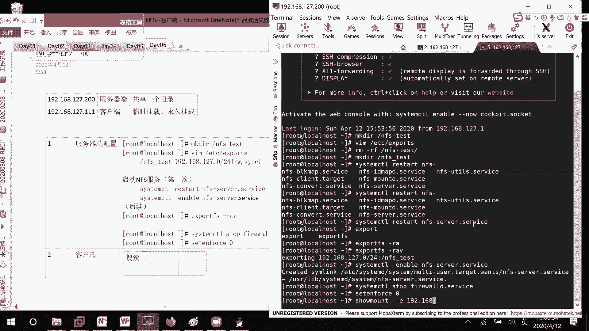

客户端码howmount简易，我去扫描192168127。200。这台设备有没有什么目录是共享出来的？然后呢，这里是不是扫描到了它有1个NFS对127这个目录的话呢，是公开的呀。在这里搜索到了这个信息。

如果说我现在的话呢，想要去用这个东西怎么办呢？也就是说我后续的话呢，想要去从这边去下载文件啊或者写入文件嘛，该怎么办？NFS应该了解吧。就是这边可能是一个服务器嘛。文件服务器吧，你就这样想。

🎼上面有很多资料，或者有很大的目录可以给你去用。你的话呢，作为客户端，是不是就是说要连接到这台服务器上面来啊？你到时候的话呢，才能去比如说写入文件啊，或者呃叫做删除文件或者下载文件嘛，你这是客户端。

🎼去访问远端的某一个目录，它共享出来的一个目录。去提取他的资料，能明白吧？刚才已经把服务器端写好了，现在就要来写我们的客户端了，好吧。发现了这个目录，我怎么样在本地上进行使用呢？

比如说makeDIRNFS。plant吧。等一下。🎼ZLRENT好吧。🎼这里要去挂载。要做的事情。肯定是先去把目录给创建起来。然后呢。挂载到本地，这个从远端挂载到我本地呢，运你程都是一样的。

mountt从192168127。200。它上面的什么目录呢？这边是不是看到了NFStest的一个目录。挂载到哪里呢？我本地的NFSplan。DF。🎼点大T这边是不是就多了这么一个目录啊？对吧就这样子。

那好，稍等哈。亲就发载过来了。🎼有这么一个条目，而且的话呢它这边。🎼在挂挂载过来的时候，格式是什么？NFS4就不再是什么XFSEXT4的一个格式，对不对？这种是临时挂载。

如果说你希望进行一个永久挂载的话，该怎么办呢？是不是一样的VIMETCFStable，然后呢，我们在下面去补充嘛，从192168。🎼127点200上面的NFStest目录。

我要挂载到本地的NFSplan目录。它的一个格式的话呢是NFS4。个耳4。你。零对吧？接下去好评退出。放下减A。F后。🎼是不是就有了，我刚才这边卸载了肯定就就就是没有掉的嘛，对不对？这个不用怀疑啊。

我只是没有给你们去检查一下而已。上面这个叫做临时挂载。🎼以前的话呢，70版本当中，它这个NFS在考试的时候有很大的bug，一下NFS1下NFS4都需要进行测试的。他现在这边的话呢就比较稳定了。

不需要咱们去测试，好吧。因为以前的话呢，就是说字版本，还有一个普通的版本也都存在的，都不知道写哪个版本。现在这个就比较稳定了。啊，你看。这里啊。🎼就可以读取到了吗？那这一是不就行了。那既然读取到了。

我肯定是想要往上面去写东西了吧。CD。😊，NFS client。LS啥也没。

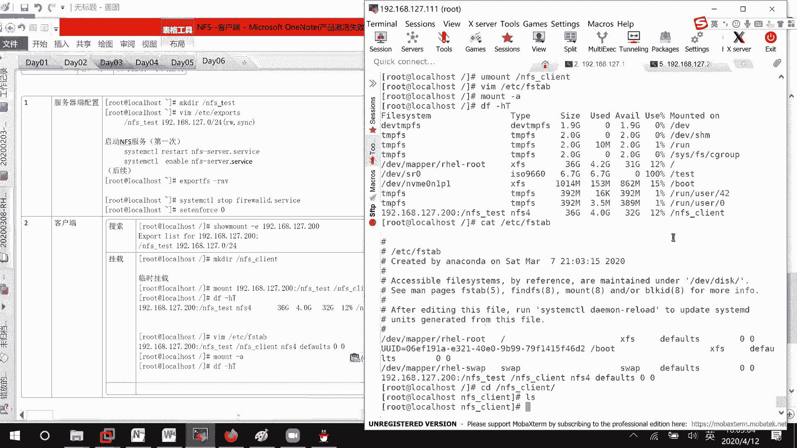

你看我在服，比如说服务器端，我进来。本来也什么都没有嘛，我呢怕去。AA。有东西了吧，客户端呢？

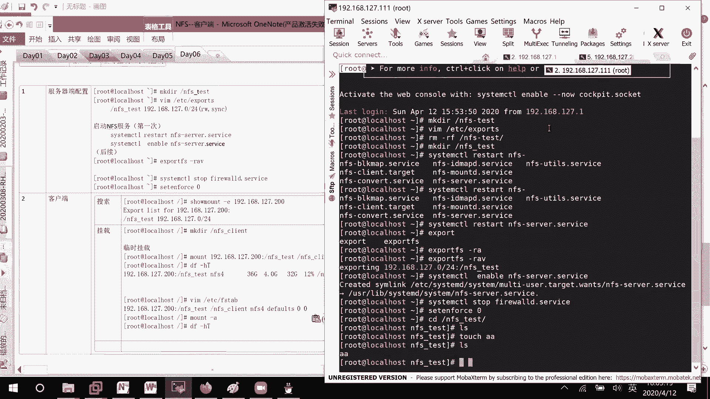

这里也看到东西了，这没有问题。如果说我也想要去写入东西呢。客户端。写入文件。说make点IR也好，touch也好，是不是都是可以的。你先看它cat。

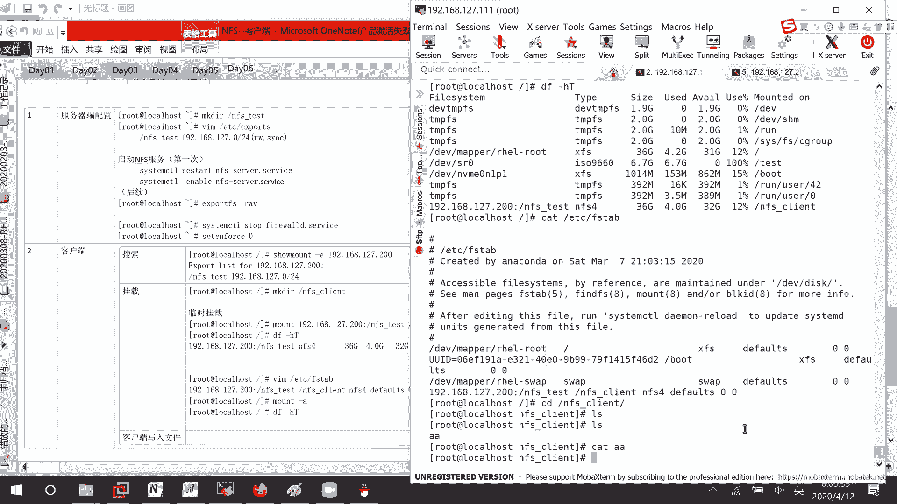

啊，只是说没有显示出东西就靠气。Hello。到我们的滴滴文件吧。

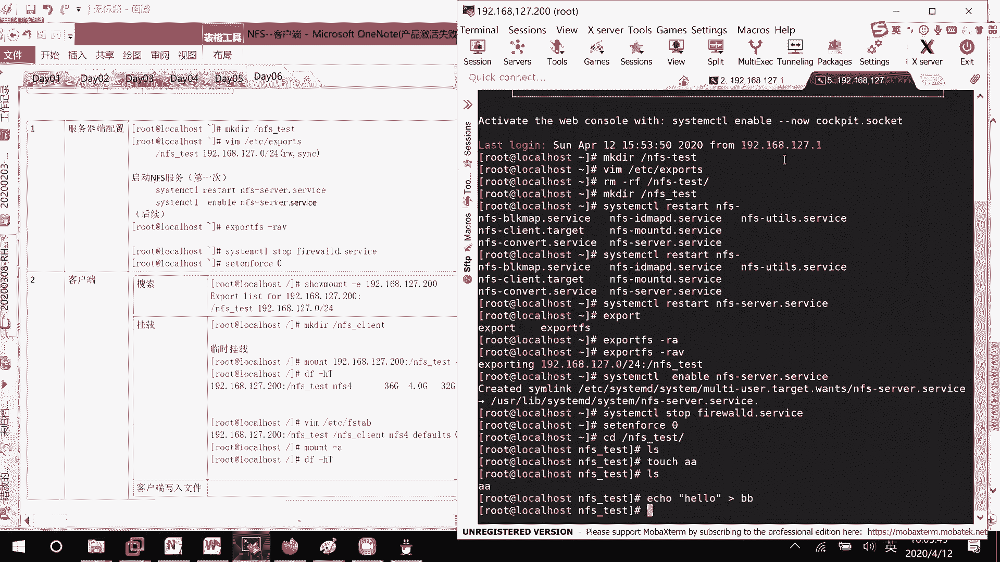

🎼你看这里。Cat。🎼你是不是有hello啊，能查看。如果说我想要也去touch1个CC呢？🎼发现permission denied了为什么会出现这个问题呢？你看啊。

我这边的话呢是以什么样的用户去访问啊root用户。

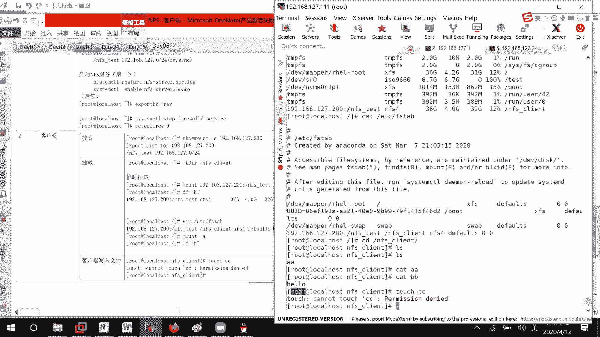

然后这边的话呢，它的一个目录权限是什么呀？root用户是可读可写可执行啊。为什么我还不能去进行一个写入呢？

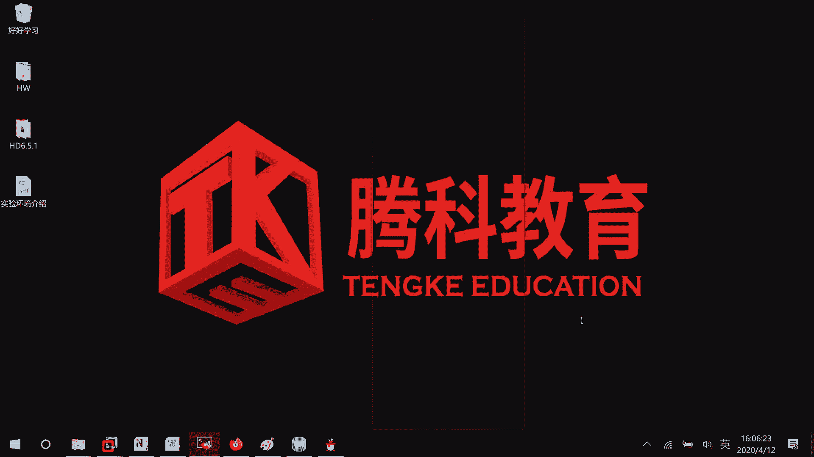

就是说客户端。以ROT用户进行访问的。为什么还是不能写入呢？那我们第一个想法是不是去服务器端？权线。发现这个权限的话呢，root它是有写权限的。对吧。那这边为什么不可以呢？他在这边你稍微注意一下。

我服务我客户端去进行访问的时候呢，实际。现在。😊，是权限被压缩了。就是说虽然这边是一个root用户去访问的时候呢，就相当于呃FTP当中的匿名用户。这边的话呢叫做NFS nobodybody用户。

他的话呢去进行一个访问。那现在这个的话呢，我本地其实用noNFSnobody去访问这个目录。对他来说是不是就用这个其他用户权限啊，很很很明显没有写的权限，对吧？如果说我把写的权限加上去呢，叫做W加。

O加W。🎼我的1个NFS test场。🎼现在是不是有权限了，我再来touch一下。有报错吗？没报错，一扣去。O。异地里面。开错。🎼弟弟是不是也有啊，这边呢。就不也有这些文件。所以的话呢。

这个是因为权限压缩的一个问题。🎼因为就是说之前NFS客户端的话呢，是我们在254当中会去学的一个东西。这边的话呢我们先来看一下，如果说自己真的想要去处理的话呢，咱们该怎么样去进行一个处理，好吧。

在服务器端的话呢，对它进行一个处理。这里啊这是一种方式，我这里呢把它给修改过来，圈之 mode的O减去W叫做NFStest。那现在的话呢，如果他想要去写的话，肯定就不可以了嘛。他uch去滴D报错了。

报错了。那好。😊，🎼这边的话呢来看一下，就在这里共享的时候，你去说一下就行了。BIMVDC export。他这里不是也说了，共享的时候呢，其他人对我是可读可写的，而且的话呢是一个同步，对吧？只是说。

root册的权限被压缩了，我不想让他去压缩呢。no。路上。SQUAH。就是说其实这里的话呢，什么可读可写啊，都是在设置权限了，能明白吗？root switch的话呢，就是说不对它进行一个权限的压缩。

然后这个配置也配了。exportFS杠RAV显示一下过程，好吧。稍等一下。呃，解决办法。嗯。不予。NFS。nobody，也就是说赋予其他用户。目录能操作，对吧？然后的话呢，第二个解决办法。

这个的话呢全都是在服务器端。第二个解决办法。它的话呢是怎么样呢？在共享文件的时候。不对，入成用户权限。自行压缩就可以了。好吧。😊，就这几条命令。然后现在这边的话呢。

你看我再来tauchEE是就没有报错了。所以这两种方法都可以去解决。我建议大家使用下面这种方式，好吧，我建议大家使用下面这种方式。不是。那好。这边的话呢我们来看一下，那到底在进行这个挂载的时候呢。

它有哪一些权限的话呢，可以去进行一个操作嘛，可以进行操作。我们的话呢可以用这场命令来检查一下哈。等一下。叫做嗯。mount子直接就帽子吧。这的。ETC。累吧。NFS。等一下，我看一下。

cat ETC live。白白4。难道没有这个表格吗？🎼ETC哦，我写错了。要做VAR哇。你看这边的话呢，是所有全部的一个权限有多少，你自己的话呢去查看一下。呃，稍等哈。

这边就是说啊共享文件的权限有哪些，这边你可以去看到。

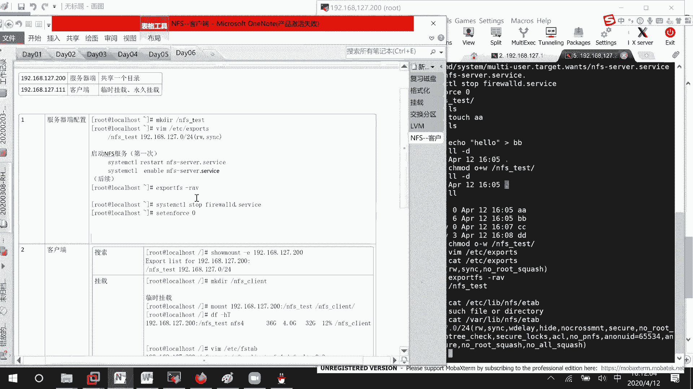

他的话呢呃这个文件去共享出去的时候。🎼可读可写。然后呢，这边默认的话呢是一个root压缩的，现的话呢没有压缩，现呢没有所有的都进行一个压缩，对吧？默认的话呢，匿名用户是65534，你看ID。

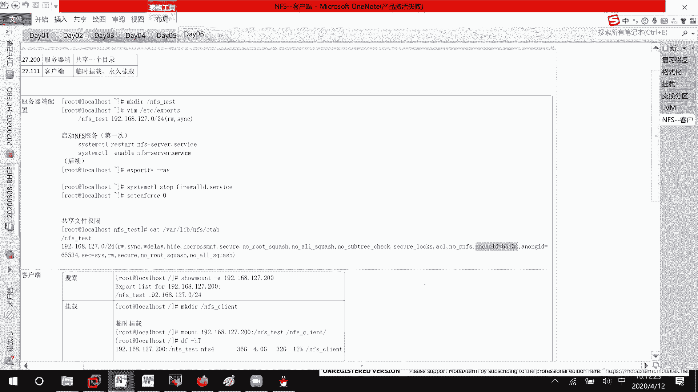

ID65534。

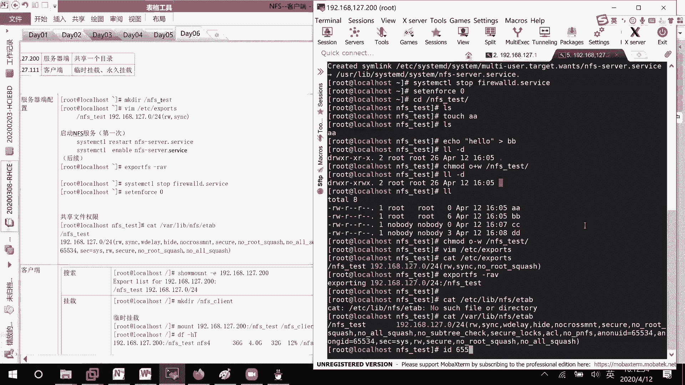

他的话呢是哦它这边直接就是一个nobody，就不再是NFS nobody了，就不再是NFS nobody了哈。好吧。🎼这个听明白了没有？如果说出现权限问题呢，你可以这样子去修改一下。

但这个是服务器端的问题。我们现在红帽7就八版本的话呢，已经不再去关注这个东西了，所以就不用去管它。好。然后下面这里的话呢，我们之前讲了一个自动挂载，对不对？这再补充一个内容，另一个自动挂载。

叫左alto。🎼FS你们有没有接触过？就好像说我现在的话呢，这边。这边有有有有一个目录的话呢，是从我们的客户端那边就是说去进行一个下载的对吧？如果说我我电脑关机了，然后再开机。

我一天都没有去连接服务器的话呢，那这个挂载信息是不没有必要去挂载？如果说我要访问他的时候呢，那好，点击一下它，他帮我去进行直接进行一个挂载嘛。如果编辑那个VIMETCFStable。

就是说开机之后就会挂在。如果说编辑像我们这个auto FS呢需要的时候，那好，你给我去挂载一下。如果说我一天都没有用到到呢，那你就不需要给我去进行挂载了。能明白这个问题吗？哦，能明白我说这个东西吗？

知道吧？按需进行一个挂载。好，像这边的话呢，嗯我就先退到个目录哈，因为想要去给大家去测试一下嘛。叫做U梦的。NFSplan先卸载掉。EIMETCFStable，我把这行信息也给删除掉。🎼没有。

如果说我的话呢，现在我去进入NFS client。🎼他有帮你挂载吗？没有没有挂载吧，因为咱们没有配置嘛，我等我等一下想要实现的操作是什么呢？如果进入NFSplan。

他就帮我把远端的那个条目信息给挂载过来，能听明白我的意思吧？好吧，那这边的话呢实现的一个方式是这个叫做oppo FS，我们来安装一下。我知道了，我样员好像。ETCFS type哦，不对。

ETC亚么是portters。Read hat。MAA。AA点IPO。可。这似URL。W呀。啊，好，写谢写谢SO像。SO下面的比如说叫做AP。然后的话呢，继续据。下课。等于0。

然后还有一个的话呢叫做内臀A。然后这里的话呢，B。然后这边的话呢叫做背扣S。保全退出。那么操。EVCD room到我的SO下面来。YRelist。等一下。好，有了。下面这里的话呢。

我来yinstal FS。第一步哎第一步安装软件。哎，很快哈，他自己安装完了，他自己安装完了，然后呢。😊，我们如果说CD现在NFS。里面呢DFHT。没有看到任何东西。

就是说没有把我们的远端客户端给挂载过来嘛？先就说检查一下。没有挂载。🎼稍等，我把没有用的信这些信息都没有用。然后接下去的话呢，第三步我们要去配置aler FS的服务了。这个是在我们的客户端去配置的。

你谁想去挂载，就在谁那里去配，知道吧？VIMPDCal。叫做有一个叫做master文件。在这里的话呢就可以定义。比如说某个目录，某个目录。它下面的一个配置的话，就是说NFS进入到哪个目录，下面。

要从哪一台设备上去挂载呢？你看。这边。我到时候是不是可以在某一个目录叫做NFS。light下面。因为在公司当中的话呢，NFNFSNFS服务器的话呢，是不是会有很多台啊？我比如说告诉大家，如果你进入一。

那我就连接到公司第一台服务器，进入到三，连接到第三台，进入到4，连接到第四台嘛。那是不是也就是说要对这个NFS client的话呢进行一个说明啊？如果说你把所有的文件都写在这里的话呢。

会导致我们的文件非常的大。所以这边的话呢，在这里你可以就去定一下目录，比如说plant。🎼它的一个配置文件在哪呢？orto点NF这个名字到底叫什么呢？没有关系的，只要你到时候配置文件叫这个名字。

它就会去识别，明白吗？就这个意思啊，首先第一步配置主配置文件。没。暑假。个文件。它的话呢是我们的automaster。啊。等一下。🎼这这个文件咱们去编辑一下，我写的是一个绝对路径。

所以呢你们到时候绕抄就可以了。然后接下去的话呢，我们要做的一个事情，是不是就要去编辑这个叫做oppo FNFS啊，你知道里面的格式是怎么样子的吗？我不知道，但是的话呢这个可不可以作为我们的参考文件。

因为人家已经配置了MIC嘛，对不对？所以呢我就cooffpyETCoppo。点MICSC文件。作为我的配置文件先到时候再去修改嘛？复制。这个文件。然后这里呢去编辑目录的。文件。Yeah。🎼好吧。

VIM这个文件嘛？回车。😊，🎼你看这里的话就格式就告诉你，比如说呃NFS client下面的bo的话呢，到时候挂载的格式是怎么样，从哪里去进行一个挂载呢？就比如说我们这边吧。叫做呃它下面的一个叫做。呃。

色边。我们等一下，比如说s2吧。文件格式呢？FS。太棒。等于NFS4，对不对？从那边下下载过来的话呢，是不是NFS4啊？然后接下去哪台设备呢？192168127。200这台设备哪个目录呢？NFS。

test他这个目录。对吧前面如果不写任何主机的话呢，就表示本地。如果写的话呢，就表示服务器那边知道吗？那好，设计好了之后，咱们保存退出。毕竟的话呢这格式知道吧？

就说到时候访问我的一个叫做NFSclient2 clientient下面的serv2，它自动的会从127。200上面把这个NFStest给挂载过来。好歹它是一个服务。

所以我们这边的话呢是不是要去重启服务啊？如果你们在工作当中去用到的话呢，也要开机自启动。知道吧？两条命密。cl， enable auto。system control restartstar。

我们的auto FS。稍等一下。啊。然后这里的话呢已经启动完毕了，咱们就来试一下嘛。CDNFSplan。下面没有任何东西吧。🎼菲dy我一条路走到黑sver2哎，发现进来了。

发现里面还有1个AABBCCDD对吧？FHT。发现他是不是也是进行了一个挂载啊？对不对？🎼我现如果CD点点，因为它已经挂载上来了，所以这个目录呢就会一直存在在这里，就会一直存在在这里。能听明白吗？

🎼就是说你虽然一开始的时候没有看到，但是你知道公司告诉你呢，你去进入到serv2就行了，你是真的能看到东西的。🎼这个的话呢，它就真的帮你去进行一个自动挂载了吗？然后的话呢，因为挂载上来。

因为你是需要使用这个东西，所以它这个目录的话呢，就会就是说这一次就一直挂着。如果你关机重启了之后呢，这边又没了，知道吧？或者你看啊mounttgra我的小班啊。这里。😊，NFSNFS4挂载过来的。

从客户端哪里，他就说的很详细嘛，很详细吗，看到了吧？如果有时候的话呢嗯我希望到时候的话呢进入到CD。快他。SO。不对。这个就是SO目录下面的话呢，这个叫做RHEL8。我能看到八光盘里面东西可以怎么办呢？

呃，我这里makeDRR就不要是ISO8吧，叫做。还是这个NFS。planient吧，对不对？等一下。2S。NFS client如果我CD到ISO8哦，就是说IHEL8呢能把光盘给挂载过来。

这该怎么办呢？就什么目录都没有关系，我这边只是给你们去举个例子。自动。挂载光盘。这不还是VIMEDC。O跟FS啊以起来哪里没有关系的？🎼现在呢我们要挂载的是不是一个叫做光盘的一个信息啊？光盘的话呢。

之前跟你们去说过了，DVCD room是个咱们的光盘。光盘的话呢，它的格式是不是SO9660啊？你看这边其实它是直接帮我们去挂载到斯丁 room里面去的。

所以我们就是说LS斯丁 room啊就可以去看到了。然后现在呢想要去。🎼哦，等一下，写错了，写反了。这里的话呢应该叫做RHBL8。然后这里的话呢叫做。这个光盘的一个位置嘛，就这样子去写。下面这里的话呢。

咱们再去补一条信息哈。喂。保全退出一下。人家是一个服务，所以呢我们去restar一下photo FS。🎼稍等CDNFS clientient哎，这在没东西，因为重启了，人家就说像叫做配置信息，是不是就。

不就会断开连接啊。你看我现在CDHE18。是不是有东西啦？CD叫做serv2。上CD点点。是吧。🎼也有东西啦，这个东西的话呢叫做自动化载。考试的时候呢也会去考到的，主要是考NFS它怎么样去进行自动化载。

能听明白吗？

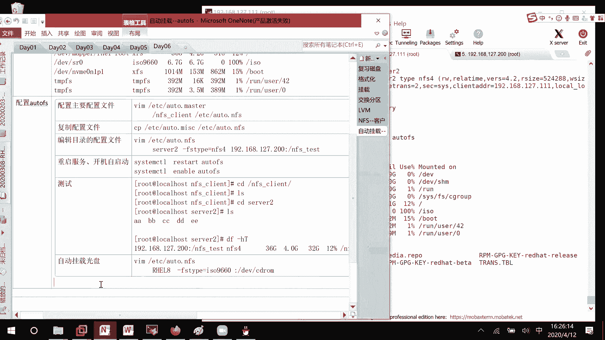