# RHCE 8.0 视频教程：P27：NFS 网络文件系统配置与管理 🖥️


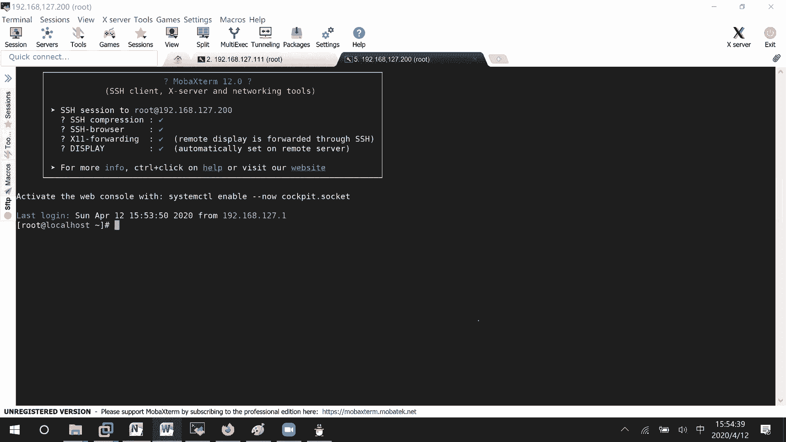

在本节课中，我们将要学习 NFS（Network File System，网络文件系统）的配置与管理。NFS 允许网络中的计算机之间共享目录和文件，就像访问本地文件一样方便。我们将从服务器端配置开始，逐步讲解客户端如何发现、挂载并使用共享目录，最后介绍按需自动挂载的配置方法。

## 服务器端配置 🛠️

上一节我们介绍了 NFS 的基本概念，本节中我们来看看如何配置 NFS 服务器端。服务器端的主要任务是创建共享目录，并定义哪些客户端可以访问它。

首先，在服务器端创建一个用于共享的目录。
```bash
mkdir /nfs_test
```

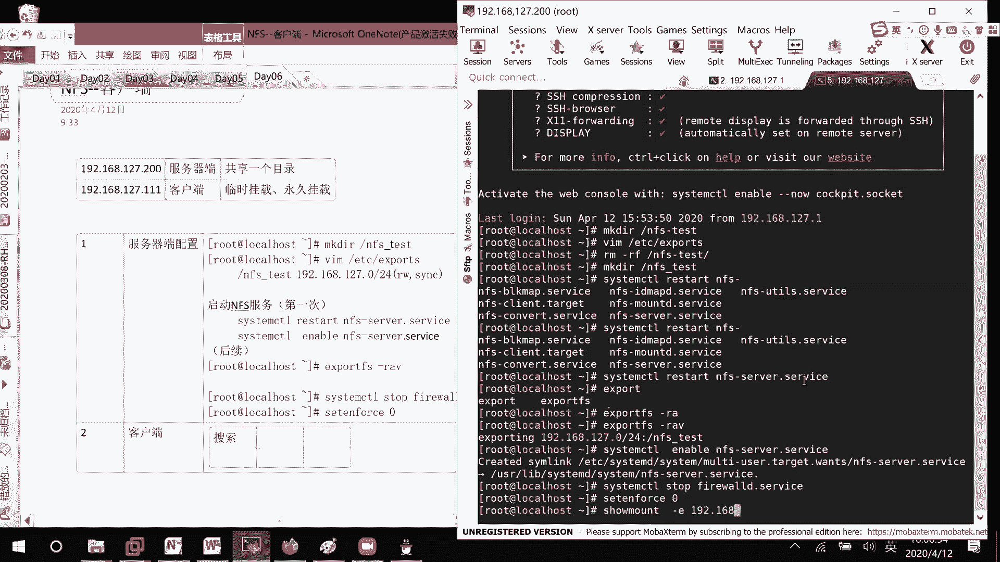

接下来，需要编辑 `/etc/exports` 文件来声明共享目录及其访问权限。
```bash
vim /etc/exports
```
在该文件中，按以下格式添加一行配置：
```
/nfs_test 192.168.127.0/24(rw,sync)
```
这表示将 `/nfs_test` 目录共享给 `192.168.127.0/24` 网段的所有主机，并赋予读写 (`rw`) 和同步 (`sync`) 权限。

配置完成后，需要启动 NFS 服务。
```bash
systemctl restart nfs-server
systemctl enable nfs-server
```
如果是首次启动，使用上述命令。如果后续修改了 `/etc/exports` 文件，则需要重新加载配置。
```bash
exportfs -r
```
为了排除干扰，建议临时关闭防火墙和 SELinux（生产环境请按需配置安全策略）。
```bash
systemctl stop firewalld
setenforce 0
```

## 客户端挂载与使用 🔗

上一节我们配置好了服务器端，本节中我们来看看客户端如何发现并使用共享目录。

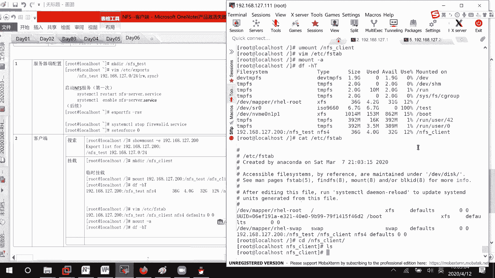

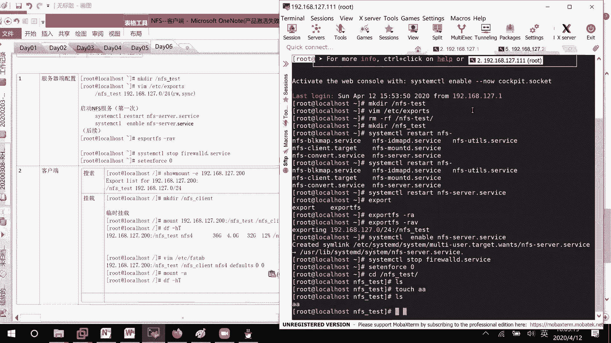

首先，客户端需要查看服务器端共享了哪些目录。
```bash
showmount -e 192.168.127.200
```
此命令会列出指定服务器上所有可用的共享目录。

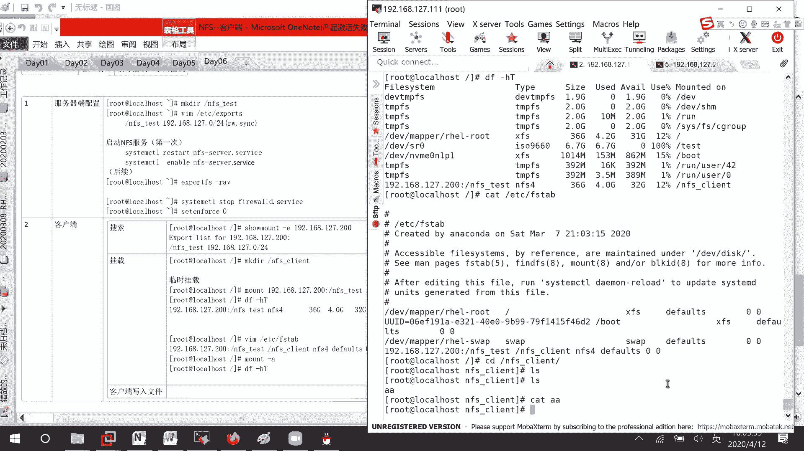

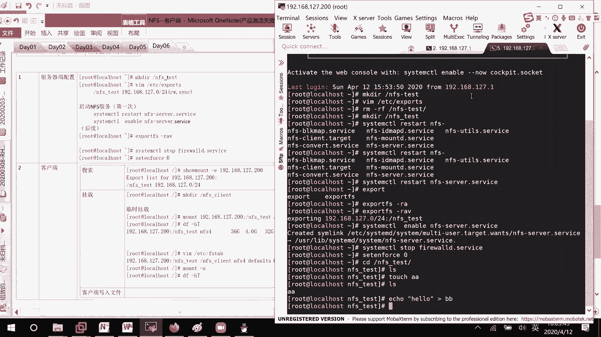

发现共享目录后，客户端需要将其挂载到本地目录才能使用。以下是操作步骤。

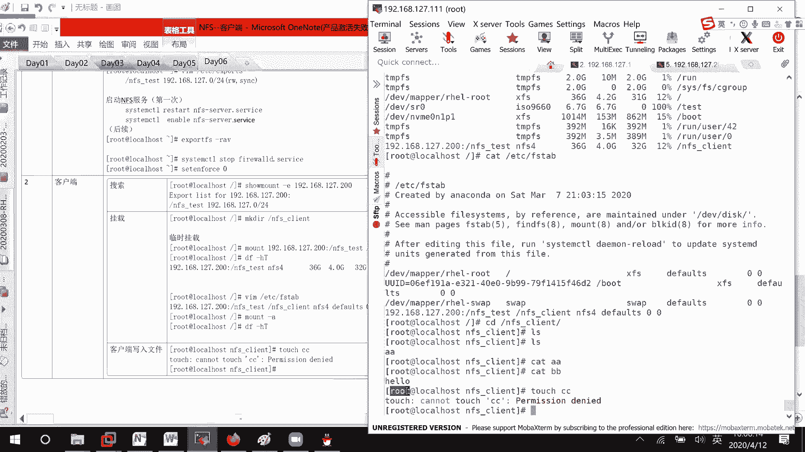


首先，在客户端创建一个本地目录作为挂载点。
```bash
mkdir /nfs_client
```

然后，使用 `mount` 命令将远程共享目录挂载到本地。这是一种临时挂载方式。
```bash
mount -t nfs4 192.168.127.200:/nfs_test /nfs_client
```
使用 `df -hT` 命令可以查看挂载是否成功。

如果希望系统每次启动时自动挂载，需要编辑 `/etc/fstab` 文件。
```bash
vim /etc/fstab
```
在文件末尾添加如下一行：
```
192.168.127.200:/nfs_test /nfs_client nfs4 defaults 0 0
```
保存后，使用 `mount -a` 命令测试配置是否正确。

## 权限问题与解决方案 🔐

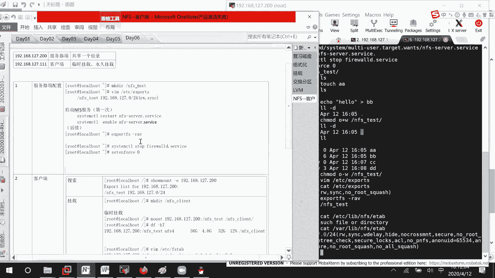

上一节我们完成了基本的挂载，但在实际写入文件时可能会遇到权限问题。本节中我们来看看其原因和两种解决方案。

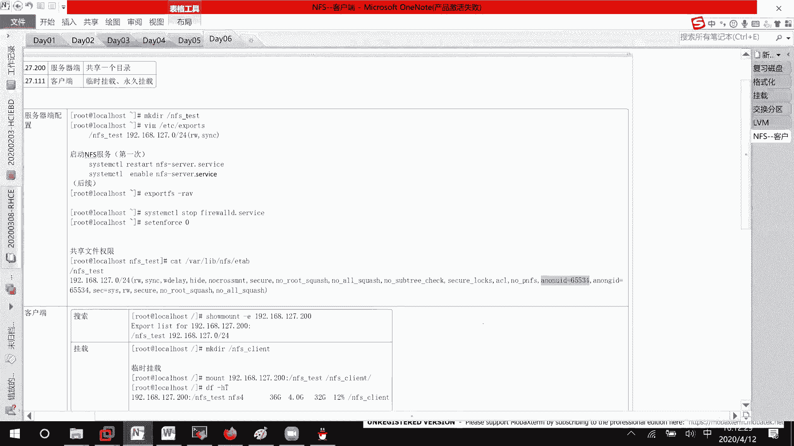

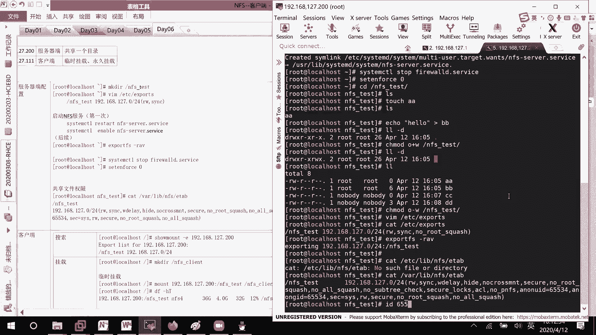

当客户端以 `root` 用户身份尝试在挂载的 NFS 目录中创建文件时，可能会遇到 `Permission denied` 错误。这是因为 NFS 默认会将客户端的 `root` 用户映射为服务器上的 `nfsnobody` 用户，从而受到服务器端目录的“其他用户”权限限制。

以下是两种解决方案。

**方法一：修改服务器端共享目录的权限。**
直接在服务器端为“其他用户”添加写权限。
```bash
chmod o+w /nfs_test
```
此方法简单，但会降低目录的安全性。

**方法二：修改服务器端共享配置，不压缩 `root` 权限。**
编辑 `/etc/exports` 文件，在共享选项中添加 `no_root_squash`。
```
/nfs_test 192.168.127.0/24(rw,sync,no_root_squash)
```
修改后，重新加载配置。
```bash
exportfs -r
```
此方法允许客户端的 `root` 用户在共享目录中保留 `root` 权限，更推荐在生产环境中使用。

## 自动挂载 (autofs) ⚡

上一节我们解决了权限问题，但无论是手动挂载还是通过 `/etc/fstab` 自动挂载，连接都会一直存在。本节中我们介绍 `autofs` 服务，它可以实现按需挂载，即仅在访问目录时才建立连接，节省资源。

首先，在客户端安装 `autofs` 软件包。
```bash
yum install -y autofs
```

安装完成后，需要配置 `autofs`。其主配置文件是 `/etc/auto.master`。
```bash
vim /etc/auto.master
```
在该文件中添加以下一行，定义挂载点的父目录和对应的映射文件。
```
/nfs_client /etc/auto.nfs
```
这表示 `/nfs_client` 目录下的子目录将由 `/etc/auto.nfs` 文件中的规则来管理。

接下来，创建并编辑映射文件 `/etc/auto.nfs`。
```bash
cp /etc/auto.misc /etc/auto.nfs
vim /etc/auto.nfs
```
在文件中添加挂载规则，例如：
```
server2 -fstype=nfs4 192.168.127.200:/nfs_test
```
这条规则表示：当访问 `/nfs_client/server2` 时，自动将 `192.168.127.200:/nfs_test` 以 `nfs4` 格式挂载到该路径。

配置完成后，启动并设置 `autofs` 服务开机自启。
```bash
systemctl enable --now autofs
```
现在，当您首次访问 `/nfs_client/server2` 时，系统会自动完成挂载。一段时间不访问后，连接会自动卸载。

---

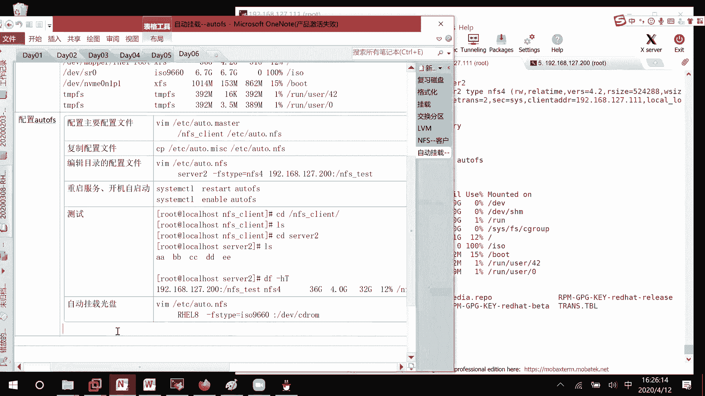

本节课中我们一起学习了 NFS 网络文件系统的核心知识。我们从服务器端的共享目录配置讲起，然后讲解了客户端如何发现并挂载共享目录，接着探讨了常见的 NFS 写入权限问题及其两种解决方案，最后介绍了使用 `autofs` 实现按需自动挂载的高级技巧。掌握这些内容，您将能够在企业网络中有效地部署和管理文件共享服务。