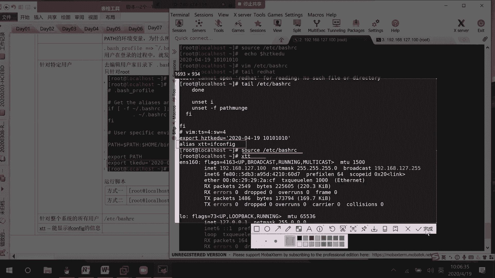
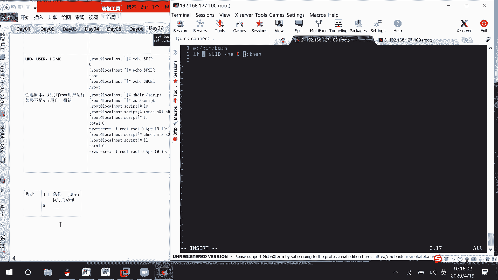

# 01 RHCE8.0视频教程【45课时】 - P28：20200419-RHCE-01_recv - 六竹书生6682 - BV1m84y1f7ss

没有多钱。

那这边的话呢我们就开始进行内容，一个就是脚本，一个good，在之前的考试版本当中的话呢，脚本他的话呢就是说总共的题目，总共的题目是两个，然后真正式的考试当中的话呢，它是一个其实就是二选一的一个过程吧。

脚本的话呢还是比较准的，他不会去换，就说是二选一的一个过程，到时候如果说在考考试练习的时候，如果你们遇到脚本题的话，自己一定要认真去看一下，如果说你已经掌握了流程怎么样去配的话呢。

那你就不需要去死记硬背了，就是说只要把最终的一个结果呢，你给实现到就可以了，明白吗，那好首先这里的话呢在讲脚本的时候，我们就是说其实也就是一个编程过程嘛，那这边的话呢我们先来讲第一个东西变量。

这个东西变量是什么呢，是不是就是可变的值啊，可变的，比如说代号啊，或者什么样的一个东西对吧，可变的值它的话呢不是一个固定的值，就比如说我们这边Y等于X加一，这边的话呢X可以等于123。

那这个X的话呢是不是就不是一个固定的值，它可以是1K12K是三对吧，Y呢Y是不是随着X的变化而变化，其实Y的话呢是不是也可以说是一个变量对吧，这边的话呢变量的类型有很多很多种。

首先我们来看一下第一个本地变量，你们就是说稍微把这个概念的话呢，要有一下本地概念啊，不是本地变量的话呢，它是怎么样去设置的呢，就你一个变量的名字等于值是多少，等于值是多少。

就是说这边前后大家不要为了好看去打空格，等一下的话呢会给你们去看一下，如果说打了空格会怎么样好吧，这里面啊比如说我现在的话呢让AAAAAAA，比如说等于一个一好吧，回车什么东西都没有。

如果说AA等于一二呢，报错了，他这边的话呢，是不是说二没有发现，因为可能就是说认为这个，这是命令的两个部分了嘛对吧，如果说我想要把一二同时赋值给他呢，这边也就是说像这个值单中这里的话呢，如果是一个一。

它就单做一一个变量赋值给他嘛，如果说一和二它组合在一起，是不是一个字符串的一个形式啊对吧，如果说想要两个值同时付给他中间，但是又有空格怎么办呢，你们一定要注意去加一个引号。

就可以解决这个空格的一个问题了，没有出错，像刚才这里的话呢，比如说一等于这样子呢，它这个是不行的，你看对不对，所以的话呢你们一定要注意一下，变量和我们的等号和我们的值之间，是不能有空格的。

这种格式是可以的，这种格式是不可以的，原因是什么呢，可能一和二同时想要付给他，但中间有个空格，我不认下面这种形式呢，就是说变量和等号和值之间存在空格了就不行，知道吧，这一定要注意，就是说变量还有等号。

还有直之间不能有空格，这是第一个，因为在考试的时候，你们在写脚本的时候呢，可能为了好看或者怎么样很喜欢去打空格，然后接下去的话呢，第二点是什么呢，如果值，人在空格，就像有时候你想要去输入啊。

比如说一个用户名啊，或者呃代表一个文件的大小，或者代表一系列的东西，如果要存在空格怎么办呢，需要加引号是吧，加一个单引号啊，他是不是就没有问题了，接下去的话呢，如果我想要去现在本地变量的话呢。

是这样子定义对吧，如果想要去查看变量呢，查看变量其实不仅仅是本地变量，是这样去查看的，所有变量的话都可以这样子去查看，我们来看一下，这边我给大家上学，这个查看变量怎么查，我们刚才不是复制了半天AA嘛。

一扣去在前面加一个dollar符号，表示这个AA不再是它字符本身，而是一个变量，你看我如果不加dollar dollar符号呢，是不是就是AA自己，我第一次复制的是一，第二次赋值成功的是一二。

所以最终保留的是第二次的一个结果，它不会把每一次结果都保留下来的，它只保留最后一次结果，知道吗，这个就说是一个本地变量，本地变量如果说现在这里的话呢，不是有一个，如果我再切换一下呢，我SU到ROP。

你看现在我再来一扣去，AA是不是就没有值了，因为我又重新启动了一个绘画，他的话呢就看不到这个信息啊，等一下，就是说这个本地变量的话呢，只有本绘画是生效的，其他绘画不成，像我们刚才的这种情况的话呢。

是不是这样子的，首先就说大家都在一个绘画当中，这里ROT，然后再延伸出来一个绘画，是不是ROT啊，这个是负，这个是子，对不对，子，RO子绘画子BAS，它是不能继承父BESH的本地变量的，这是第一个。

注意点子，ASHA继承父ash的本地变量，如果说我这里一个bash，然后再新开一个better呢，和我是没有任何关系的，可不可以，就比如说我这边来复制一下，他的话呢是不是也没有直达。

所以其他的better的话呢，也不能就说拥有我本地变量的一个信息好吧，这是我们本地变量，然后行，现在这个AA的话呢，我只是说随便的给他赋一个值，我们这边是不是有一个POSTNAME啊，对不对。

就可以显示出我们的主机里面，有时候在编程的时候呢，他他的话呢就需要去引用一些变量嘛，如果说我想要AA等于host name，可不可以啊，如果说我先把先执行HOSTNAME，把这个信息拿过来。

然后复制粘贴过来，是不是非常的繁琐啊，我能不能直接这样子呢，先来看一下这个得到的结果，稍等前面加一个DOA符号，得到的是不是就是一个horse name的一个名字啊，如果说你这个值的话呢，是一个命令。

我们该怎么办呢，前面去加上一个反引号，不知道你们还记不记得，就ESC下面有个波兰线嘛，你点一下它就是翻译号回车，这个时候你再来一扣，取一下它，是不是就是呃这个命令执行过后的一个值啊，所以这里要注意一下。

如果，命令的话加反引号，好吧，这样子的话呢就可以解决掉，它不能直接去赋值的一个问题了，明白吗，那行，然后接下去的话呢，这边哈有时候的话呢我们在写脚本的时候呢，会想要去引用这个Mac地址。

会会想要去引用这个Mac地址，这个的话该怎么办呢，首先我们是不是要先把Mac地址，就是说通过一系列的方法给找到，找到了之后的话呢，我们再去进行一个复制啊，这边啊就说我给你们来讲一下。

如果想要去引用Mac地址怎么办，我就给你们讲一个例子，到时候的话呢你们自己想要去获取，其就是说一串一串信息当中的某个部分的话呢，可以参考这个流程去做，不一定仅仅是获取Mac地址。

在文就是说在一个文命令当中，或者在哪里想要获取信息的，都是可以这样子的，知道吧，首先if configure，我的话呢是不是想要看的是哪个网卡，E n e n s160。

然后呢我去rap是不是有这个信息啊，其实你放这个信息的话呢也是可以的，这一行当中是一个一些独一无二的信息，就可以了，首先这条命令的话呢，是不是就获取到Mac地址所在行，因为不是所有信息的话呢。

你都可以就是说自己去敲，有些像这个网卡的名字啊，是什么，你肯定要复制一下嘛，对不对，这里第一步获取Mac地址所在行，然后接下来的话呢我们要做的是什么呀，这一行信息我们都已经获取到了。

是不是就从这一行当中去获取一些关键部分，所以接下去第二个获取行中的列，这里的话呢这个是不是第一列，就说这一行当中的第一个位置，第二个位置，第三个位置，第四个位置，第五个位置，对不对，我们现在的话呢。

是不是想要去获取第二个位置的题啊，这边的话呢有一个非常好的就是说打印，就是说获取行中列的一个方式，Awk，这个的话呢虽然我们课程上没讲哈，建议大家好好的去看一下a wk这个工具，这个命令知道吗。

然后呢怎么样呢，单引号花括号，我print第二列的一个信息，就可以去获取到Mac地址了，AWK获取print第二列的信息，如果第三列也可以，或者第几列，第几列的话呢都可以知道吧，那好，这里的话呢。

我们就这样子获取到了一个Mac地址的信息，现在的话如果想要去户付给一个变量，就是说付给AA这个变量的话呢，我们该怎么办该怎么办，那是不是负责付给Mac地址这个变量吗，那是不是就说白引号这个命令呢。

你放上去反引号回车，我们再来1coach dollar Mark就可以了，但这就说在写脚本的时候呢，你也需要有一个命令的基础，如果你命令都不了解的话呢，你这脚本也是没有办法去写的，明白吗。

所以你看这边if configure，显示特定的网卡管道服过滤，然后呢，管道符前面的执行结果，是不是又作为后面的执行结果，他的话呢再进行一个格式化的一个输出，输出第二列的一个信息吗，对不对，第三个混合。

我这里的话呢只是讲了Mac地址，你们的话呢可以去，所以到时候去看一下，他的一个发送包的一个情况啊，或者获取一下他的一些IP地址的一些情况好吧，那谁谁也没问题，现在下面这边的话呢我们来看一下叫做。

稍等一下，这个是一个本地变量，然后接下去的话呢咱们来看一个叫做环境变量，本地变量的话呢，我们就看到这里过，看到这里过，这应该没有什么样的一个问题吧，我这里再跟你们说一个东西啊，比如说这里有时候的话呢。

AA等于回车没有报错吧，后续dollar aa是这样子的，AA等于也没有报错，1coach dollar aa，那我问你这两种情况的话呢，它是一样的吗，这两种情况它是不是一样的。

嗯这边的话呢就是说空值吧，这两种情况一不一样，A等于后面的话呢什么值都没有，这个我们把它算成情况一的一个空值，其实这个就是啥东西都没有嘛，这个呢是情况二的一个空值，这表示什么意思啊。

我就等于一个空的里面什么东西都没有，我去ECOACH的时候呢，他都没有报错，就好像我们编程当中的话呢，它是不是有功能叫做debug的一个功能，就你的话呢运行什么样的一个命令啊，它都会进行一个记录吗。

相同的我们在这边的话，你也有就说去查看它的一个运行过程，如果有错误的话，那就进行记录，Set you，他这个的话呢就是说显示一些执行结果，AA等于1coach ba a这里没有问题。

然后接下去的话呢AA等于coach dollar aa，诶，这怎么没有报错呢，我看一下，啊这两边的话呢，就是说它其实只是说这两个其实都围攻，还有一种情况就是ecoach dollar bb吧。

vb的话呢如果说没有绑定过任何变量的话，这是情况三的一个控制啊，这种情况情况三的一个控制，如果说他没有绑定过任何变量的话呢，你把SU打开，它就会去报错，我这边的话呢，比如说把这个功能给关掉，set加U。

这个时候我再来一扣取BB，他就没有报错吗，上面这上面这两种情况呢，我都是有对我的一个变量去进行过一个，初始化的，但是第三种情况的话呢，它是没有初始化过的，所以呢如果说你没有打开SJU的话呢。

那这样子他是没有报错信息的，如果你打开了的话呢，它是会有报错信息的，知道吗，然后这边的话呢再来说一种情况，我AA的话呢是不是已经对他初始跨跨过了，如果想要对他进行还原呢。

让他就是说真的没有任何信息怎么办，这个outset aa，这个的话呢就把AA绑定的变量给清空掉了，他现在的话那就什么值都没有了，明白吧，这个就是说你复制过变量了，如果说要将它的一些空间。

就是说它的一个变量变量绑定的变量回收的话，那就Upset一下就可以了，好吧叫做呃解放变量，就这样子，然后下面这边的话呢我们再来看一下，就说本地变量，我们就讲到这里过，主要就告诉大家的话呢，怎么样去赋值。

怎么样去执行命令，因为你这个本地变量，不仅仅在这个终端当中可以用，到时候的话呢在脚本里面咱们也可以去用的，知道吧，然后接下去我们来看一下环境变量，环环境变量的话呢是怎么回事呢。

你看我这边去设置设置的方式的话呢，和本地变量不一样，它设置是这样的，EXTRTAAAABC吧，等于一好吧，现在这边的话呢你来看一下EQ，去DOAABC它是没有值的。

如果说我这边SU到root e扣去dollar a a b c，他这里的话呢是不是也没有12，如果我只进行一个简单的要，我先先来看一下我自己special的一个编号吧。

看一下be coach dollar dollar，我这边的话呢是不是一个341523415，Besi，我自己重新再生成一下，ecoach dollar dollar这边的话呢是不是3518。

刚才其实我如果试一下的SA，就是SU一下的话呢，应该是相当于再生成了一个叫做BAL终端，然后像这种BASHER一下的话，那才是生成一个叫做BASHER，好吧。

我们来看一下decoach dollar abc，他这个值的话呢，是不是还存在的这种环境变量的话呢，它是怎么样呢，自special可以继承，不special的环境变量。

但是其他终端的话呢是不能进行继承的，我们的话呢使用这个叫做ecoach dollar，Dollar，可以去查看环境变量的值，就是说查看fashion好吧，然后接下去的话呢还有一个东西。

这个叫做BASHER，是干嘛呢，生成当前绘画的子子special，安全绘画的一个子special就这样子去生成，然后呢可以发现自special的话呢，可以继承我们负BAS的一个环境变量吗。

然后这边的话呢我们回过头来去看一下，这边如果说如果想要从父子special退回去的话，那就是EXIT就可以了，诶后期多了多了，你看就回到3145了嘛，好吧稍等哈，这边的话呢就是说环境变量第一种方式。

我们呢可以这样子去进行复制，第二种方式，他的话呢是可以怎么样去赋值呢，首先你就这样子AA等于hello，比如说hello吧，就hello吧，然后接下去你再x pa a一下就可以了，后续solar aa。

你看啊，Fashi asia，我再来1coach dollar aa，他是不是也是hello啊，所以的话呢这两种形式，第一种形式的话呢，就把这两种命令的话呢合二为一，第二种的话呢就是把他们给分开去写嘛。

分开去写，既然这是一个环境变量，就说明和我们系统当中的话呢，是和我们系统是不是有关系的，我们现在的话呢，系统当中有一个很重要的环境变量，叫做pass的一个环境变量，pass的环境变量。

我们现在的话呢先来查看这个pass的环境变量，好吧，ATH啊，环境变量，这个变量的话不仅仅是在我设备上存，在，在你们自己的设备上的话呢，也是存在的，回车。

我这里的话呢是不是什么user local sb，user local bin这样子的一个东西啊，这个的话呢就是说所有的绘画，所有的用户，然后呢你看我这边比如说s u w r o t e coach。

dollar pp是不是全都存在的，这个的话呢因为存在于某一些文件当中，所以的话呢，所有用户在登录的时候都会去执行那个脚本，导致所有人显示出来的pass都是一样的，都是一样的，这个的话呢。

为什么就是说像这个pass环境变量的话呢，为什么所有人都能生效呢，就是说这个，所有的绘画，然后呢所有的用户，功能成像，这边的话呢之前应该是给你们去提过的，就好像这个pass的话呢，你可以自己去定制。

就说某个用户自己去定制，也可以对整个系统去进行生效，对不对，如果说是针对特定用户的，我们怎么样去做，是不是在每个用户自己的家目录下面，都存在special profile和BRC这两个文件。

这两个文件的话呢，就是我在开机的时候都会去进行一个运行的，知道吗，比如说我系统当中有个red hat，你看是不是也有special profile和special rc文件，这里针对特定用户的。

如果说你想要针对特定用户的话呢，去编辑，用户家目录下这两个文件，如果说想要针对整个系统的所有用户呢，那我们的话呢就可以去编辑这两个文件，etc asharc文件，就说如果想要去针对整个系统去生效的话。

那就来编辑这个etc bash rc，我这边的话呢给你们来演示一下，好吧，比如说现在的话呢只针对，toot用户生效，像red hat用户啊，它不生效，你看这个的话呢，之前rh cs a当中考到了一题。

让你们去设置某一个命令，就让你们去设置某个命令，你看VIM自己的家目录ASHA，比如说RC，然后或者就是说这个BRC的话呢，首先我看第一个文件夹吧好吧，Asia profile。

asia profile文件，你看这个就是说一其实一上来的时候呢，第一步先会去执行我的asure profile文件，所有的用户的话呢全都是一样的，不仅仅是我的一个叫做root用户好吧。

你看执行我的bash profile文件，然后这里有个判断，我们等一下会去学习啊，去问这个文件存在吗，如果存在的话呢，点这个文件表示什么意思呢，你再去执行这个文件，这里就让你去执行加目录下的这个文件。

那他都说执行了，我们就来看一下嘛，ASIRC文件他怎么说呢，他接下去这个脚本里面就判断有没有存在，etc rc文件，如果存在的话呢，你就去执行FASHIRC文件。

然后我们再来看一下BEETCBEARC文件，好吧，他这边的话呢就是一些脚本信息了，比如说我要去设置的一些变量是怎么样的，我的一些权限啊是怎么样子的，是不是全都在这里啊，对不对嗯。

然后像这边你们来看一下promote command，就是我们这个提示符是怎么样设置的，人家在这里也说了嘛，User post name password，对不对，它这里的话呢就是一些系统设置相关的。

设置相关的，所以的话呢前面这两个你认改一个，都是只对本用户去生效，不会对整个系统生效，如果说想要对整个系统生效，那我们得去改这个facial rc好吧，我现在的话呢针对本用不生效，我就随便去改一个吧。

加目录下pleasure profile文件，你看这边不是export export pass了吗，我这边再来export什么呢，pk e d u这个好像没有用过，等于什么东西呢。

比如说等于啊20200419好吧，运行一下哦不对，保存退出一下。

我的话呢就在这个文件下面去新增加了银行，这一行，没有什么样的一个意义，我就是去设一个变量。

让大家去测试一下而已，好吧，那行我现在如果说去ECOACHTKEDU哦，dollar pk AD u啥也没有，为什么，因为这边的话呢刚刚改完了，我用户也没有进行登录，这个脚本是不是没有去执行啊。

所以就相当于没有生效，你知道吗，比如说我现在去登录的IOT用过我再来一口气，Dollar pk e d u，他就有信息了，这个是为什么呢，因为在SU的过程当中，就发生了这三个文件的执执行操作。

动物在登录的过程中就发生了，上述三个文件的执行操作知道吗，然后呢我这个special的话呢，现在还是没有，因为没有执行过嘛，那我们可以手工的让他去运行一下，对不对，第一种方式就说运行脚本。

第一种方式的话呢，你可以试试这个，因为他这些文件里面的话呢，是不是都是点波浪线，然后斜线点，然后呢就prefer这种形式，你看TKEDU的话呢，是不是就有了，所以这个是第一种运行方式，稍等一下。

然后下面这里的话呢，还有一种就是说我们在写脚本的时候呢，就是说在写一些环境变量的时候呢，比较常用的方式是什么，我在下面这边再去改一下啊，比如说这边我再去加个时间，一十冒号003，冒号零零吧，好吧。

这边1coach是不是没有时间的概念啊，我这边可以sauce叫做，波浪线special profile文件，你看再来一下是不是就有信息了，所以这两种方式的话呢，你们这选手好吧，方式二。

那这边的话呢就是说我root用户肯定是有了，我现在这边，如果切换到我系统当中的red hat用户呢，再来一扣血doa pk e d u啥也没有，因为我改的是不是。

这两个文件只能针对本地用户生效的一个文件，如果说希望所有用户分享呢，DMEDCBRC我跑到最后一行，我的话呢去添加一些东西，比如说export，要做杭州TKEDU等于10202004。

1910101010，就这样子吧，奇怪一点的数字好吧，你看啊，这里有了，就是我们说的所有用户都会去执行的吗，我现在来su red hat coach dollar，是不是就这个如果说我SU到root呢。

你扣取是不是也是这个我在本地没有，如果想要生效呢，是不是source etc special r c就可以了对吧，这个的话呢就是我们这三个文件它的一个作用，之前在考试的时候呢啊。

有一个什么样的一个题目呢，就是说希望你们一个叫做比如说有个命令，我只要去执行这个hello，或者就说去执行，TT吧他的话呢就能显示这个if configure的信息，这个你该怎么样去做。

其实是不是就是给这个命命令的话呢，去取一个别名啊，取一个别名，你到时候的话要去看一下，是针对整个系统去生效呢，还是去针对这个别用户去生效呢，如果针对整个系统生效呢。

咱们是不是来编辑这个etc bash rc这个文件，然后呢在下面这里去写别名的一个标志，别名怎么写呢，ALIASXTT等于if config，我们来试一下好吧，保存退出，稍等我给你们来看一下，错了哈。

etc asia r c就说有XDD这个东西，然后呢我们sauce一下，这个时候我们再来XTT一下，是不是就可以了。

所以他这个的话呢，你只要认准是对哪个用户去生效就可以了，如果是整个用户，那你起这个命令就起别名，让XTT这个本来没有任何含义的东西的话呢，变成了某个命令，因为你在这脚本里写，想要让它生效的话呢。

是不是要source运行一下，让系统识别到吗，这边的话呢我就进行了一个简单的测试，知道吗。

就有时候的话呢有些命令你可能经常去执行的，你就可以弄成一个缩写的形式，等于什么吗，对不对，就好像说我们经常经常就是LS，比如说LH或者的话呢，还有其他命令，你们就自己去写，是不是相同的道理啊。

ALICE什么东西等于是整个命令是不是就可以了，这没有问题吧，这个的话呢就是我们的一个环境变量，我们可以这样子去进行一个设置，这没有问题啊，这没问题，然后呢怎么样让他去生效的话呢，也跟你们去说过了。

有时候的话呢我们去编辑一个文件的时候，是不是前面没有显示行号啊，需要我们去set number它才有吗，但每一次都去set的话呢，我觉得太麻烦了，如果说我希望针对整个系统，他的话呢。

希望所有用户打开文件的时候，都可以直接显示行号，这是所有用户，如果个别用户的话呢，你去编辑它的单个文件就可以了，单个文件这里所有用户，那我们这边的话呢就不是再去编辑这个BRC哈。

不是编辑这个有一个文件etc v i m r c回车，这边的话呢，就是和一些vim编辑器相关的一些设置呢，在这里在这如果说你想要去显示行号，那就是这set number。

这里的话呢就是说去显示你的一个行号码，你看啊，WQ现在是立刻就有了这个VIMRC的话呢，它是不需要我们去进行什么soft的，诶，稍等啊，他的话呢，C v i m r c。

它的话呢是不需要我们去进行一个叫做SOS的。

直接就有了。

如果你不想要有这个行号的话呢，到时候把这个给注释掉就可以了，知道吗，这个的话呢是优化方面的一些信息很多，就说很多的一些系统的话呢，它都有优化，基本上的话全都是在我们EPC，就是说EPC文件下面。

或者的话呢就是在我们用户自己的家目录下面，知道吧，这没什么问题啊，然后这个的话呢是我们pass我们讲的一个东西，我这边再讲一点东西，就让你们自己去练一下，你们先稍等一下，除了这个之外还有什么呢。

拍个UID，就像我系统登录上来之后呢，用户是怎么就说我用户登录上来之后呢，系统是怎么样去识别我这个用户的呢，是不是可以根据id来识别1coach dollar uid，因为我现在是一个超级管理员。

所以这边的话呢是不是就是一个零啊，然后呢，有时候这边的话呢是不是还有一些用户名啊，他这边怎么样去识别呢，还有一个叫做USER，是不是root，然后呢还有一些加目录home，是不是都有，这个的话呢。

就是说每次用户在登录的时候呢，这些信息他直接就获取到了，所以你看，这边你们来看一下，B i m e t c asia r c，稍等我看一下，这里啊这里你看为什么这里dollar username的话呢。

就可以直接看到我们的ROT信息呢，然后这里HOSTNAME就是去获取我们的主机名嘛，对不对，然后这里home dollar home，是不是就直接就是用户的一个登录到，用户的一个加目录那上面去啊对吧。

所以这里的话呢，就是说是有一些系统的环境命令，它全都在这，如果你们到时候需要的话呢，自己也是可以去引用一下的，知道吗，这没问题好吧，我们现在的话呢就已经介绍了，比如说啊基本的一些变量嘛。

我们现在先来创建一个简单的脚本来试一下，好不好呃，UID啊，或者一个叫做user啊，还有一个叫做痛吗，是不是都有给你们来复制一个哈，比如说现在的话呢，我们想要去创建一个脚本，只允许ROT用户运行。

其实里面没有什么东西，如果不是root用户报错，随便报一点什么样的一个错误行吗，我们来看一下我们这个脚本的格式的话呢，会是怎么样子的，我就直接在自己的用户，我来make一个吧。

叫做根目录下SCRIPT弟弟，然后呢现里面什么都没有，我来VM第一个文件S零一点SH，后面的话呢没有什么样的含义，只是说我希望的话呢，到时候别人看到我这个文件，知道是一个脚本就可以了吗，而现在的话呢。

这个文件是所有人都没有执行权限，那肯定不能执行啊，所以你们在考试考试的时候呢，一定要注意给用户执行权限，给哪一个类型的用户执行权限，我现在这边不管给所有的用户呢都有执行权限，好吧，这是第一个。

权限首先要有，然后接下去的话呢我们就来编辑这个文件，里面的话呢，咱们去写什么东西呢，第一行虽然是井号开头的，你们觉不要觉得他没有用，这里的话呢就去说明一下我们解释器是谁，另下面的special。

然后接下去我们的话呢想要去判断嘛，啊这边是不是都教你们判断了if空格方括号，空格里面写条件，方括号，对不对，如果对了之后呢，然后做什么事情，接下去是不是结束啊，所以这边的话呢我们来讲脚本里面的一个格式。

第一个格式就判断的一个格式，它怎么样呢，if一定要注意空格中间去写条件，然后键和我们方块前后的话呢也是有空格的，然后接下去要写的就分号then，接下接下去的话呢，就是我们这里面要执行的过程。

就是说执行的动作，我先简单的去讲一个，如果说这个判断好了之后呢，FI表示一个结束，知道吗，所以我们这边的话呢来写，既然FI空格嘛，方括号引号要做什么事情，到时候再说，我们先不做，这边的话呢。

我们是不是就要去进行一个判断了呀，看他是不是root用户，怎么去看第一个，要么username or user是不是等于ROT吗，要么UID是不是等于零吗，如果不是等于零的话呢。

那就不是我的一个叫做超级管理员吧，所以这里啊你看我脚本当中，如果要去引用一个变量怎么办，叫做比如说UID吧，这里等于就是简易横线E表示等于，如果不等于呢横线ne not equal吗，零知道吗。

下面这里的话呢去讲一些比较符号，现在这边的话呢是一个数值嘛，等于的话呢就是很介意，不等于就是横线NB好吧，等一下再去补充哈，那行这边的话呢都已经条件都写好了，如果说它不等于零的话呢，我就一扣去显示吗。

比如说ERROR就是说police use r o t m，接下去我们就退出，可以吧，那这边是不是就结束了，如果是ROT用户呢，那我来意思一下，随便去显示this is roo t好不好。

这个脚本什么意思呢，就如果说你判断出来它不是ROT用户，你给出一个提示好就退出了就结束了，如果说我这个等于零呢，那是不是就不会做里面的事情啊，我我会来做下面这个事情吗，明白吗，好吧嗯，我看一下啊。

啊对这边编辑本加粉。

at这个，然后这边的话呢我们来执行一下线，是ROT用户执行S01是对的，SU到read the hat，然后呢CD在目录下script，这个文件对我IO对于我red hat来说，是不是也是可以执行的。

点S01，他的话呢是不是，就因为我这个red hat用户的话呢，不是root用户，所以他自己去报个错，很正常吧，我上面这里的话呢是一个root用户，所以的话呢我看一下，稍等一下，我看一下先呃。

我root用户在哪哦，在这在这我在运行的时候显示的是this is root，这个没有问题吧，所以呢这边的一个执行结果，我们可以来看一下两种情况，第一种情况，IOT用户去运行的。

显示的是这个如果说是非ROT用户去运行的，是不是就是显示这里，对不对，我们的话呢就说终于引到脚本这上面来了哈，现在的话呢给大家几分钟时间，先去创建这么一个小脚本的信息好吧，然后的话呢去把环境变量啊。

还有这个叫做本地变量，自己稍微去试一下，一个就是说去设置一下别名，一个的话呢就是说去设置一下啊，路径的这些信息，还有的话呢去把这简单的小脚本去写一下，能明白吗，这边的话呢给你们来继续讲。

刚才的话呢我们就说去讲了一个简单的脚本，它怎么样去写的嘛，就是说if什么什么东西，然后呢怎么样去执行的，是不是也给大家去看到了，接下来的话呢我们要看的一个东西是什么呢。

就是说我们有时候在执行一些脚本的时候，后面是不会放入一些参数啊，就比如说在执行的时候啊，Bas s001，比如说0102030405，这里的话呢就放了好几个参数，等到时候脚本里面的话呢。

他对我这些参数进行调用吗，之前考试有一道题是什么呢，就让大家去执行脚本的时候，他给你一个叫做用户的列表，你们的话呢到时候去读取这个user list的一个文件，然后呢。

使用这个脚本去把这个文件里面的用户，给创建出来，所以这边的话呢，是不是要去读取后面的一个参数啊，这里我们来看一下位置变量，就是说传参进去的，我现在就是说开始去讲脚本怎么样去写好吧，比如说S02SH。

首先第一行解释器，你要去说一下井号感冒斜线BB，然后呢如果说我只是想要去显示第一个，第二个，第三个怎么样呢，是扣去，比如说第一个你的一个值是多少，你到时候自己去写到后面嘛，我这边的话呢怎么样去引用呢。

就这里dollar，比如说我等一下，如果说是这样子去运行的，点S02，点SH010203，如果这里一coach一dollar0，这个dollar0表示谁呢，表示是这个位置，0123能明白吗。

零的话呢就是表示我自己脚本的名字，然后接下去我这边一扣取二，比如说DOA1后续三，就说dollar2好吧，我就执行这这三个就好了，冒号WQ诶，冒号哦，我知道了，现在用户权限不对，现在REDHAT上面。

二是，S02点SH，然后呢全区mode a加XS02em，这个文件第一个井号感叹号，in下面的special ecoach，比如说叫做scrap吧，S c r i p t，因为在运行的时候呢。

他在第一个位置嘛，所以这里就dollar0这个位置就行了，以coach比如说FIRST，那它就是dollar1这个位置嘛，以扣去SECONSEC吧，2号刀了，二这个位置吗，我们来看一下，at这个文件。

这个就是说传入的一个参数，下面这边的话呢你们来看一下运行S02，然后接下去第一个参数，比如说我写hello，第二个参数我写by好吧，回车，你看第零个位置是不是就是我脚本名字的位置，名字的位置啊。

first的位置是不是我就是后面的第一个参数啊，第二个的话呢，是不是就是我脚本后面第二个参数啊，所以这个的话呢，就是说到时候在执行脚本的时候，我想要去引用脚本后面的脚本，在执行的时候。

后面携带的一些变量怎么办呢，就是用这个dollar0位置符号，Dollar dollar2，知道吧，他的话呢就会把第一个参数给这里，就是说嗯我看一下啊，这里第零个参数就我脚本的名字，第一个参数。

第二个参数就这样子好吧，那行这边的话呢，其实你们可以看到它在根的时候呢，前面是不是有个路径啊，对不对，如果说我不希望有这个路径呢，不希望有这个路径，你们可以自己去优化一下。

这边你去因为之前的话呢不是说有一个执行嘛，对不对，this name就是去就是去除一个文件，它前面的一个路径ASNET，它是一个命令，你看我这边再来运行一下，是不是就变成一个叫做S02。

而不是斜线S02，就这个可以去除文件前面的一个。

叫做路径的一个名字。

我们这边可以来看一下这个命令的哈，比如说，说好说，那那你们就这里吧，就直接BASNAME，前面跟后面的话呢，如果跟上一个文件的话，etc special r c它就会把你前面的一个路径给去掉。

最终只显示一个文件的名字，知道吗，如果你想要在这里面去执行一个显示IP地址了，那也就是说反应哈if configure就可以了吗，这没问题啊，那好现在这边的话呢我们来看一下，就比如说还有一些信息。

我们的话呢在运行的时候，想要去预定义一些变量，这个的话呢该怎么样去进行一个操作嘛，预先去定义一些变量，大家看啊，ecoach dollar1它不是任何变量，然后接下去一扣取高了九，它也不是任何变量吧。

一扣取到了十，它的话呢有一个零变量在这里，零变量在这里，我们的话呢现在就是说想要去编辑一个文件，Vim，是S03SH，根据mod a加X这个BIMS03里面的话呢，我就去写一句话，一扣去还不带井号井号。

然后B下面的拍摄，我想要知道我到时候在运行的时候呢，后面总共跟了几个变量，它们分别是什么，你给我一下子就显示出来吗，我刚才这种情况呢，是不是就是说取第零个第一个第二个这样子啊。

我现在想要知道后面总共取了几个变量，万一有时候的话呢，我在执行脚本的时候，跟了五个变量或者六个变量不一定，那如果说我这这边就跟了两个变量，你这样子我如果这边就跟了一个变量。

你这样子如果在打印第二个变量的话，是不是就会报错啊，你们来看啊，比如说就这样子，稍等lady supreme吧，这样子就是说最后这里的话，你就没有去显示信息嘛，有些如果说要用这个参数去执行的时候。

但这参数又没指数就会报错啊，所以的话呢一般如果在定义这些，去取一些位置变量的时候呢，会怎么样呢，会先去统计一下总共有几个参数，然后呢你再进行判断吗，这怎么样去做呢，是扣句，这里，四多少。

总共有多少个变量呢，dollar井号他会去帮你去算，后面这里的话呢有多少个变量，知道吗，他会去帮你去算，如果说你想要去得到所有变量的值呢，就是说啊是多少是多少所有的值。

那也就是说dollar星号高的信号，可以去显示出所有变量的值，Value，是什么，好吧，我们就执行这个脚本，他的话呢就想去统计一下后面跟了几个参数，然后呢每个参数是什么了，S03比。

0102030405060708吧，回车这边的话呢就显示总共变量有八个，每个里面的值呢，01020304050708嘛，这个的话呢和我们位置变量也是有关系的，就是说你在进行一个脚本运算的时候呢。

有时候先需要去判断一下到底有多少个，到底有多少个，然后的话呢你再去进行一个执行好吧，然后这边的话呢我们来看一下，有时候就比如说我们想要去写一句话吗，就比如说呃我买了，十个苹果。

是不是会app lee更花了，比如说十美元，嗯叫做花了柚子吧，十美元好吧，那如果说我去直接去执行这句话呢，可不可以，比如说这个apple的话呢，我等一下把它当做一个变量，就可能你你买了十个苹果啊。

或者买了十个橘子啊，是不是都有可能的呀，就是说这里的话呢到底买什么东西，等到时候再说，但是呢我只知道，后面这边到时候一定要用复数的一个信息吗，然后接下去使用了十美十美元的一个钱，对不对，十美十美元的钱。

我们来看信息来看，十十的话呢，这等于零哈，这边我来我来演示一下EQ去，BUYEBBY然后的话呢一十，然后等一下，比如说这个变量稍等啊，AA等于APPLES好不好，不要S啊。

就apple我这边呢1coach引号be one10个，那这边是不是就dollar aa啊，但是的话呢苹果要复数，是不是要加一个S，然后呢use10美元对吧，那也就是说dollar10嘛，回车看一下。

这边已扣取10aa dollar a as，他的话呢就什么东西都没有显示出来，为什么呢，我这边会把dollar哦不对，dollar as的话，那任何一个变量它是空的吗，幼稚明明是十美元，为什么变成零呢。

因为这个dollar10的话呢，现在代表的是不是零啊，如果说我让十等于一个AABC稍等哦，十等于ABC还做不到哈，等于一吧行，那反正这边十的话呢，他现在不是等于零了嘛。

那这里的话呢是不是这样子就会去显示错误啊，那像这种的话呢，有时候有一些特殊的情况的话呢，我们该怎么处理怎么处理，这边也就是说在运行的时候，AA和S是分开的吗，那你就加一个引号呃。

加花括号表示dollar和花括号的话呢，去组成一个变量的引用，然后这里的话呢，这个dollar现在是不是就不再是那个叫做哦，取变量的意思，它只是一个普通符号，那就是说把有一些特殊意义的字符。

变成没有特殊意义的话呢，前面加一个斜线，这个的话呢就是我们的转义字符，转义字符回车，你看买了十个苹果，然后的话呢花了十美元，有时候的话呢比较多人喜欢用单引号，对不对，我来给你们看一下结果有什么区别。

这个双引号的话呢，它的结果是对的，但单引号呢诶这个AA怎么就不翻译了呢，这个到了十的话呢，为什么这个斜线的话呢还在呢，稍微注意一下，如果你是双引号的话，他会去解析这些符号的一些含义的，如果你是单引号。

它是不会去解析这些符号的含义的，你看如果我把这个S给去了，他也是这样子，就是说双引号的话呢，他会去解析符号啊，变量啊，它对应的一个值，如果是单引号的话呢，它是不会去解析的。

所以比较建议大家在写脚本的时候呢，用双引号去写，能明白吗，就到时候到了考前辅导的时候，不要再问我单引号，双引号有什么样的一个区别，好吧，这里我就举举一个例子啊，就这个吧，稍等啊，我把这个也给拿哦。

稍等我把这个也给拿回来吧，声引号，会对字符啊，或者就是说会对一些字符的话呢进行解析，单引号会进行，需要注意，好吧那这个的话那就没什么问题了，然后接下来我们来看一下。

就是说我们刚才的话呢知道了怎么样去使判断，然后的话呢怎么样去输入一些值嘛，就是说在运行脚本的时候呢，怎么样去传输一些参数，那现在我们要来看如何进行返回呢，返回值怎么样去进行一个返回，那像这里。

比如说AA他肯定是什么东西都没有的嘛，如果说EATE这里的话呢，是不是有一个叫做正确的一个结果，我现在的话呢想要就说想要去知道，执行了一个命令，或者执行了一个脚本之后，它的一个正确，就说对还是错。

因为有时候在写脚本的时候呢，会根据上面去判断，上面这个语句能正常执行的话，我下面进入什么样的一个流程，如果不能正常执行的话，我再进入什么样的一个流程吗，所以就返回值要去判断，秘密执行法正确与否。

我们该怎么样去进行一个判断，首先我这里的话呢来看一下，有一个和我们的这个dollar新号啊，dollar井号是类似的，对哦不对对，是dollar dollar问号，他的话呢就是去判断上一个命令。

他的一个执行结果，如果执行结果返回的是零的话，就表示上一条命令执行证券，如果返回的是非零的话。

就表示上一条命令执行错误，知道吗，一扣句dollar问号，如果返回值是零，表示上一条命令，认识正确，否则执行错误，否则执行错误好吧，那好这边的话呢我们来看一下，比如说因为在我们在写脚本的时候。

经常可能会去看某一台主机能不能监测到嘛，那就去拼嘛，比如说这里我就骗我自己吧，192168127。1P一个，我的话呢把结果放到DEEV闹完中去诶，等一下没关系，这就创建一个新的文件已没事哈。

这里的话如果一扣取dollar问号，返回的结果是零，表示什么意思啊，那就ping通了呀，如果再去写一个线不存在的地址啊，300稍等啊，这有点太浮夸了哈，300太浮夸了，200吧，300太浮夸了。

你看200的话呢，这个时候再来一扣，取到了一，它的话呢是个一，我们来看P192168127。1点，C是能通的，如果是200呢，等一下是不是就没通啊，加一个错误嘛，就说明的话呢，这个dollar1的话。

不仅就说你命令如果在物理上面是没有问题的，在逻辑上面有问题的，他也会去报错的，能听明白这句话的意思吗，如果物理上没问题，在逻辑上有问题的话，也会报错的，知道吗，也会去进行一个报错的，接下去的话呢。

因为有时候在写脚本的时候，可能会去查询一些文件对吧，我们来看rap r o t e t c卡死，我的查到了没错，我这边的话呢再随便来查一个ROTTK，E d u，这边的话呢是不是没有查到，他的话呢。

返回的是一二，所以的话呢这充分证明了命令没有错误，如果说逻辑上有错误的话呢，他也会去返回一个错误值，能明白吗，好吧，这这这些东西的话呢，到时候我们在写脚本当中的话呢，多去用的都会去用到下面这边的话呢。

我们就说呃去讲一下脚本里面的一些操作符号，刚才的话呢不是讲了一个叫做简易吗，表示是等于的意思对吧，减NE的话呢，表示的减EQ表示的是等于NE的话呢，表示的是不等于，如果说我要表示大于呢。

大于就这样子direct gr a t e吗，就大于等于呢，这个的话呢就是减g e great equal吗，大于等于吗，如果这里是小于呢，减LT叫做小于LIBB小，然后这里小于等于呢。

那也就是说减LE减LE好吧，这边的话呢就讲这六个数值的比较符号，我们来试一下，这边的话呢在进行比较的时候，你就说形式比较多的是哪一个呢，第一种方括号里面你就去写比较，就是说很像，那就在这里写。

另一种形式呢打了两层方括号，这种的话呢用的是比较少的，那还有一种形式呢，就test后面写上请教这三种形式都是可以的，我这边给你们来看一下，AA等于一吧，vb等于二吧，如果说我要去比较呢。

空格dollar aa，他的话呢是不是等于dollar vb呢，回车没有任何结果，怎么办呢，这样子发现的话呢，它返回的结果是一说明什么呀，执行错误的说明这两个是不相等的对吧。

然后如果说我们这边换成另一种形式来写啊，两个吧，如果说想要去看一下这个AA的话呢，是不是大于等于BB呢，回车是不是也是一样，说明的话呢没有大于等于它，AA没有大于等于BB。

然后接下去的话呢我们再来看一下第三种形式，就test dollar aa，他的话呢是不是小于等于BB稍等我看一下，这边的话呢他就进行了一个报错，这里估计是要写这个朋友吗，哦哦我知道了。

BB忘记加DOL符号了，对吧，这边是不是就零了，就表示我们的BB的话，AA的话呢小于等于BB，你们来看一下这三种形式，第一种形式，第二种形式，第三种形式我们比较常用的呢，我比较常用的是第一种形式。

你们可以根据自己的喜好随便去选择一种好吧，这个是涉及到一个字符的哦，不对数值数值的一些比较，如果说现在有一些字符串想去比较呢，比如说这边有个字符串是TK和一个叫做ab，这两个值谁比较大一点。

我该怎么去比，首先如果是等于两个字符串是一样的，那就减减啊，如果说大于呢就逮着了，如果是谁，这如果是小于呢，那就是小于嘛，然后接下去的话呢，如果是等于呢，那就是这样子，如果说是一个大于等于呢。

就这个不好就大于等于，这个符号不是小于等于呢，那就是这个符号，知道吧，就这几个符号，我这边的话呢来去附一些值哈，随便去附，比如说啊DOTAAA等于，哦哦前面我今天加了一个dollar分了吗。

就AA等于tom，比较形式的话呢都是一样的，只是中间的一个符号嘛，DOAAA等于tom吗，等于的对吧，如果说我这DOTAAA不等于他，嗯我看一下不等于同诶诶这个的话呢不等于胖，为什么还是一个零呢，稍等。

这有点问题，我来看一下先啊，AA等于，我去装了AAAA，这边的话呢好像在进行匹配的时候，它有点问题啊，这个等于是没有问题的，但这边就是说不等于为什么也是显示的是一呢，哦也是显示的是零呢，对吧。

这有点问题啊，这比较符的话呢，我到时候去看一下，然后然后还有一个的话呢，我看一下，等一，对啊，如果说他这个等于蹭一吗，诶这个倒是可以的，为什么那个不等于不行呢，他那不等于好像全都是零啊。

就是说这个等于的时候的话呢，是生效的，不等于好像是没有生效的，难道这不等于符号是这样子，两分要等到像这样子的话呢，它是可以的，对吧，AAA等于，等于应该是等于的，一，零诶他这不等于是感叹号等于号。

就是说大于小于那个方案是不生效的，不生效的好吧，然后的话呢，如果说像这个大于大于等于小于小于等于啊，用的就是那个字典排序法，先排第一个，再排第二个，再排第三个，这样子好吧那行。

然后接下去的话呢嗯这个是数值的一个比较，这个是字符串的一个比较，下面的话呢就是一些文件类型的比较，就比如说我想要去判断一下他适不适应，就是说这个文件是否可读，这样子文件是否可写，文件是否可执行。

然后像这边的话呢，呃我们刚才在看的时候，etc br c不是这个文件，我想一下这个文件家目录下叫做点special啊，C的时候你看这里是不是有个减F啊，这个减F的话呢，就是来判断一下是否为普通文件。

然后呢减D呢就表示目录是不是目录，然后呢比如说减B的话呢，就是说是不是快设备文件，然后如果我的要求低一点，想要去看它是否存在呢，简易是否存在就可以了，我这边的话呢就简单来来判断一下这些符号。

这个语这些语法格式的话呢，等一下全都是可以写到我们脚本当中去的，你看，是不是一个文件啊，如果后面加一个一呢，他是不是就报错了，因为这个文件不存在，所以的话呢就有问题，然后这里减D是不是报错。

因为它就是一个普通文件啊，这边的话呢比如说去写一下home，是不是没有爆出来，因为home本身就是一个目录嘛，然后的话呢我们来看一下某个文件存不存在，他sword存在，password1呢不存在。

有时候如果在写脚本的时候，一个文件不存在的时候，那你就去创建它吗，或者一个目录不存在的时候，那你就去创建它嘛，如果在读写的时候，如果我的一个呃，比如说根据用户文件去创建一个用户，用户文件本身就不存在的。

那你是不是就直接结束到这个程序啊，下面就不再去进行一个执行了吗，能明白吗，那好这边的话呢，咱们去创建一个文件哈啊直接就来touch一个ABC吧，然后呢这边我们来看一下这个文件的话呢，它是否可读啊。

是否可写啊，这些属性好吧，ABC它是否可写，稍等啊，你看零，因为我现在是root用户嘛，对它是不是就是可可写啊，我对他现在是否可执行呢，这边一因为的话呢，我现在对它的权限是不是执行权限是没有的吧。

然后这里比如说S01呢，我现在的话呢是不是可以去执行的，所以他报的数字的话呢是一个零嘛，对不对，那好这个的话呢是一些基本操作，我们这边在进行判断的时候呢，是不是都是单个条件啊。

我下面这边的话呢再来讲一个知识点，让大家到时候去练习一下好吧，这边的话呢，如果说有多个条件要同时进行判断的时候呢，这就是连接符是什么样子的，首先第一个和的时候有就是说判断一，判断二。

然后如果还有pd3的话呢，就依次的写到后面去，然后呢这个表示什么意思呢，两个判断全部为真的时候，整个结果才为真，这里，好吧，接下去的话呢还有个或，那也就是说判断一或判断二嘛，就好像说我中午吃饭或者吃面。

那两个的话呢，只要我吃一个是不是就可以了，就说两个判断，一个为真，则整个条件成立，他这里的话呢呃一个为针，他这个的话呢就是说两个判断全部为真折，整个条件成立，一个是全部，一个是一个就可以了，这就是区别。

然后这边的话呢我们来试一下，比如说这里AA等于一，BB等于二吧，这边第一个条件，AA他的话呢是小于等于我们的BP吗，第一个条件是不是就为真了，好了以后去OK吧，回车你看这个的话呢，什么意思呢。

以前面为真了，我是不会来执行这个后面的呀，对不对，就是说第一个判断A是小于等于BB对，会执行后面的这边如果我来写AA大于BB，你们觉得OK要不要去执行，因为这个已经AA的话呢是一大于二的话。

那是不可能的对吧，这已经是假了，这整个条件是不是都可都会为假了呀，现在OK有没有执行呢，他就没有执行了，他就没有去执行了，他这个是怎么样呢，如果第一个判断为假，得第二个判断无需执行他。

他的话呢就没有去执行了，如果第一个判断为真的话呢，第二个判断还会去进行一个执行，这，里稍微注意一下，如果第一个判断为真，第二个判断还会被执行，知道吗，这就是我们这两个语的一个意思。

有时候的话呢你们应该会见到一个这个东西吧，一个语的，他这边是怎么样的，他是这样子的，我不管你第一个条件是怎么样，我会对两个条件都进行判断的，知道吗，叫做判断一，判断二，如果是这种情况，你看如果是一个。

然后接下去，他这个符号在这边的话呢，我们用起来不太方便哈，他会以为在后台进行了，那这个的话呢就是说像这个一个余的符号，如果第一个判断为真哦，这里就不讲了吧，你们就记住这两个吗，最近这两个。

那这里的话呢就是说如果第一个判断为真，第二个还会被执行，如果第一个判断为假，第二个的话呢无需执行，那我们现在的话呢来看一下这个货，来看一下这个货，他的话呢我们怎么样去做呢。

就是我们的AA它的话呢是等于BB的吗，或第二个条件嘛，因为第二个条件去打印肯定都是正确的，AA等于BB吗，没有，那第二个条件的话呢，是不是会被去执行，如果说我第一个条件是AA小于BB，第一个条件成立了。

是不是已经可以使得整个条件去成立了，所以呢第二个条件就无需去进行一个执行了，这稍微注意一下，就这里下面这里是怎么样呢，如果第一个条件判断为假，第一个条件诶，稍等一下，第一个条件判断为假。

一不可能等于二吗，则第二个判断还会被执行，如果第一个判断已经是真了，则第二个判断不会被执行，因为货的话呢两个只要有一个为真，就会就说就成立了吗，对不对，就这样子，这边的话呢我们休息10分钟吧，好吧。

那你们去尝试一下这些操作，这几个符号的一个操作，然后我们等一下的话呢去进行一些数值计算，然后进行一些表达式的定义，好吧，就这些哈，这边的话呢现在我们就讲了一些比较符哈，线的话呢我们写脚本的时候呢会去记。

会去进行一些加减啊，这些计算对不对，所以的话呢如果说我们直接这样子，AA等于23，你看一下得到的结果是多少呢，到了AA是23，这个字符串在我们白当中的话呢，他会把所有的东西都认为是字符串的。

而不会是认为是一个字符的一个计算，明白吗，这边如果说你要进行数值去进行计算的话呢，有哪几种形式呢，差不多有五种形式吧，我给大家去列一下，第一种形式是这样子的，提示一是这样子dollar。

然后呢括号里面的表达式，我们来看一下，就比如说AA等于dollar括号括号23，括号一，Coach dollar，AA这边的话呢是不是就等于一个五啦，他就是把它当作字符的话呢去进行了一个计算。

如果说我们的话呢想要去2×3呢，那把加号变成乘号不就可以了吗，如果说想去算二的三次方，那乘乘吗，那就把这个的话呢就是我们接触的第一种形式，就是括号括号，然后的话呢dollar符号这种形式，这种形式。

那好这边的话呢我们再来看一下哈，呃如果说我他这里还有个加减减，还没跟你们去加，也成长了，这边的话呢减还是比较正常的，就除的时候呢稍微有点异常，2÷3不应该完全都等于零八。

是不是0。677几啊，在我们12单中进行计算的话呢，它默认是不会去给我们保留这个小数位的，没有给我们去保留小数位啊，我们来看一下，如果是2。02。0，你看这个就不行了，如果是3。0，那肯定也不行吗。

所以这边的话呢，它是没有去给我们去保留一个小数位啊，他是就是说没有去进行保留，没有进行保留，如果这边的话呢，你去一个石头山，他这边的话呢只只保留一个整数位，只保留一个整数位好吧。

这个就是说涂的时候稍微去注一下，这只是一说是这种方法，我们到时候还有其他方法能保留小数的，然后还有个EXPR，这个的话呢就是表达式的一个形式嘛，EXPR23直接就是23好。

然后这边的话呢如果二空格加空格三呢，得到的是不是就五啊，所以这里的话呢要稍微注意一下这种形式，就是符号前后，有空格他的话呢才会把它当做符号来识别，不然的话呢是没有把它当做符号，来进行一个识别的，知道吧。

加减乘除的话呢是类似的，接下来接下来的话呢我们再来看一下，叫做另一种形式，Let l e t，他的话呢是怎么样呢，就很简单，let a a等于23，刚才如果是AA等于23的话呢，发现是不可以的对吧。

那现在呢是不是又可以了，比如说2+5吧，是不是七啊，所以像这种形式的话呢，就普通的赋值前面加一个let就可以了，LET就可以了，好吧，那接下去的话呢另一种形式declare。

这个的话呢就是就相当于去声明的一个意思嘛，对吧，声明一个变量declare减就是int类型，AA等于23诶，稍等AA的话呢，DECLARE这里是小写的牌号，2+31。

coach dollar a a是是不是就是一个五啊，2÷3呢是不是就是一个零二，如果我们把这个变量定成一个大F呢，稍等六字哦，小F诶，我看一下啊，这不是有吗，这个难道不能去定义吗，诶等一下。

这里也是一个叫做这个符号哈，这边的话呢也是这这样的一个符号，但是这边不知道为啥F不能去使用，FAAAA等于23，还是离这种方式的话呢，现在还是不可以去操作哈。

然后呢这边你们declare的话呢就稍微看一下，他的话呢是前面减去一个A，就就是说加上一个I去定义一个变量而已，然后还有一种形式的话呢，和第一种形式的话是差不多的，是这样子叫做，FA双括号。

然后的话呢在中间去写一个表达式就可以了，就是AA等于dollar，方括号2+8，decoach dollar a a等于十嘛，这种形式其实和第一种形式的话呢是蛮像的，第一种是一个叫做双括号。

第二种的话呢就是一个花炮的形式，然后还有一个的话呢，就是我们可以使用DC计算机的形式呢去做，比如说你看DC这边13是不是等于零二，2÷3是不是也等于零啊，它小数都没有去保留SCLE。

比如说保留两位有效数，这是定义定义它保留两位有效数，1÷3是不是就0。3，32÷3是不是就0。66啊，QIT就是说在我们这个内置里面的话呢，是带有BC，就是说这个计算功能的。

那对应到我们一条命令当中的话呢，可以怎么做呢，1coach我们就说把结果显示一下SCRE，这边的话呢比如说保留三位有效数字吧，2÷3，然后呢传递给我们BC去进行一个计算吗，是不是0。66啊对吧。

这边的话呢类似的叫做AA等于，哦稍等一下，嗯不可以，六执行结果等于他一直也有逃课，他这边好像这边那就不去复制了吧，我这边先不去负责啊，就直接这样子，你扣取它等于一个什么值，这边的话呢不能直接去复制给我。

AK就等于他吗，但这边又不让我去进行一个执行，写到脚本里去的话呢，你就直接去写是没有问题的，但是线这边的话呢它是有点问题的，有问题的，那你们这边的话呢就看一下这个BC这个语句。

他这样子的话呢就可以得到一个叫做小数点，后面保留几位的嘛，如果说你这边的话呢想去算，因为我们刚才一直算整数位，是一个叫做零的情况，如果有个一呢，那就53嘛，是不是1。66，它的形式的话，那全都有。

所以这边的话呢再进行计算的时候，123456差不多有这六种形式好吧，然后接下去的话呢我们就来看一下判断语句，在讲判断的时候呢，我们刚之前是不是讲过一个叫做if，就一个条件，如果满足什么，你就去做什么嘛。

如果有多个条件呢，如果今天星期五啊，如果今天星期一到星期五，然后我就去上班，如果今天星期六我就睡懒觉，否则的话呢那我就不起床，如果有这三个条件怎么办，首先这边的话呢，if有没有满足条件一，封号。

然后呢这里面是你要去执行的动作，比如说起床嘛对不对，然后接下去如果就说上面是，如果下面这个是第二个，如果如果条件二，然后接下去呢你要执行的动作啊，上面这个是动作一，下面这个是动作二，然后还有一个是不是。

否则就是说上面所有的条件都没有满足的话，那就去执行动作N吧，可以吗，然后呢最后再结束嘛，我们这边的话呢可以看到，可以只有一个if的一个情况吧，还有呢其实可以只有if else的一个情况哦。

就是说可以有if和else if的一个情况，也可以有if和else的一个情况，能明白吗，他这个的话呢是比较多变的，比较多变的一个情况，就好像我们刚才的话呢已经判断过哦，如果，呃稍等一下。

如果说你的一个UID是等于零的话，那就显示出这是root，如果说你不等于零的话，那就说执行其他的一个条件嘛，对不对，他这个格式组合的话呢非常的灵活，现在的话呢，就比如说刚才不是给你们去讲过。

那个脚本怎么写吗，现在给你们出一个简单的小练习哈，你们在系统当中的话呢，应该都存在一个id是1000的吧，这边如果第一个条件给你们几个条件，如果执行的用户是零，UID等于零，显示40root，如果。

执行用户的UID等于1000的话，你的话呢就显示这是1000，第1000个呃，就是说显示什么呢，显示日期吧好吧，就说现在几月几日嘛，就代表这个命令，然后呢，否则你的话呢显示IP地址。

就是if config的一个信息吗，这边的话呢你们去把这个脚本去写一下，然后发群里我们来看一下好不好，就这个要求，如果那这里的话呢是不是第一个条件啊，如果你等于1000，否则你在显示IP地址嘛。

对不对不错啊，那这边的话呢我们也是差不多有个三魔方，应该写出来了，不然他不知道我多了一个S，这边的话呢我们来看一下，比如说叫做touch s04点s h chang mode a加XS04。

B i m s04，然后接下去的话呢这里井号感叹号ink，下面的special，然后接下去的话呢第一个对朋友也好了对吧，首先if就好像刚才的话呢有一位同学是谁啊，下播下播的话呢用test去判断也可以。

只是说我的话呢，个人喜好是比较喜欢用方括号的，所以我这里还是坚持用自己的方括号，如果说它这里EQ0的话，等于零，而显示什么东西呢，就1coach this is输入就可以了吗。

然后现在的话就是说还没有结束，第二个条件，Else if else if，他这里呢是少了一个S，我经常会出错，就我建议在在写脚本的时候呢，写完了之后要回过去去检查的，这里如果说它等于1000的时候呢。

就是一种方式是不1coach加上这样子反引号对，这样子是一种形式，井号是注释啊，还有一种情况呢，你可以直接这样子叫做BT，他直接去打印，在之前七版本当中，它好像不会直接把我们缩进的。

要我们自己手工的一个一个去缩进了，比较麻烦，现在就方便很多了，最终的话呢就是说啥条件都不满足的话，你给我去显示一个地址吗，就这样子我我把这个给删掉哈，就如果执行命令的话呢，两种都可以，随便你们。

然后最终的话呢结束了，就是FI一下嘛，保存退出，然后这里呢我们来运行一下S04，稍等我看一下，哦我这边是写错了吗，else if e l s e看一下啊，我还是用EQ去吧，第6号我是哪里写错了吗。

哦哦哦上面少了一个then对吧，没看到，那这里的话呢，这种形式应该是没有问题的，好现在就没问题嘛，然后这边的话呢可以去切换去测试一下，Freedom cat，Lady suprep，点S04。

它就显示这个东西嘛，然后如果你有其他账户的话呢，再去进行一个登录就好了，那这个的话呢没什么问题，就是说你出现错误的话呢，能去改就行了，像我刚才这样子不会去改的话，那就不可以了哈。

那行有时候的话呢我们在执行的时候，他不是会进行一些报错信息吗，对不对呃，稍等vi，比如说我这边的话呢，就是这个再把它给去掉，然后呢再来运行的时候，是不是这里的话呢就出现了一个，双引号双引号有区别的。

这边的话呢你看他这里是不是说了，第六行的话是有问题的，所以的话呢cat s04123456，他的话呢但是定位到下面这里来了，所以我一直以为是自己这个else这边有问题，那现在的话呢如果再进行一个。

我想要去判断它到底有没有问题呢，那这边你可以加一个set减X，就类似于开启了一个叫做debug的一个功能，在运行的时候它还是出现是第七行有问题，set减X它还是出现我们的第七行有问题哦。

他可能把这认为一行认为到这里哦，这个前面有问题，但是第六行，那这个SX的话呢在这里没什么用处啊，这个set x的话呢，其实就相当于我们的那个debug一样的功能，如果说他报第六行有错误的话。

那只能在这附近去找一下了哈，好吧那行，那这这就这样子，然后这边的话呢我们再来看一下，再来看一下，有时候的话呢，如果说凭我们这个红帽考试的话呢，七版本它的一个考试规则是怎么样呢。

这边我们再来写一个if else的脚本，如果就是说你们考完试了之后呢，想要让你们去查成绩嘛，如果哦请输入考试成绩，那我的脚本的话呢，怎么样去获取到你这个输入的成绩呢，这里有一个叫做read的功能。

可以去获取到你输入的信息，这边的话呢我们考试的时候0~210分，就说没有包含210分，这个是不通过的，如果说你是一个叫做210分到300分，这个的话呢是通过的，如果说你小于零分或者大于300分。

这是不可能的，因为分数的话呢，我们不会就是说出现这种越界的一个情况吗，这边的话呢我们主要来看一下，我怎么样输入一个成绩之后，到时候能去进行一个判断吗，因为其实我们刚才这个位置符号。

只是说把这个位置的值给取进来，你的话其实是可以进行复制的，都可以，我用另一种方式，先，比如说讲瑞的2GS05，SH全局mod a加XS05，B i m s05，然后呢第一个井号感叹号。

但是然后接下去的话，那里面我弹出一个提示，input your s c r e嘛，那你输入一下你的成绩，那输了之后的话呢，我怎么样去读取进来呢，有个叫做RT a n s，我就会把你输入的信息呢。

放到我这个answer那里去，answer就是一个变量了吗，如果你的成绩大于300分，或者你的，成绩小于零分，我这边要做的事情是什么呢，就是说以后去input，CORRECTFRACTORSCORE吗。

然后呢l else if，如果你这个成绩的话呢，DOANS你是一个叫做小于等于300分，并且你的成绩叫做大于等于210分，然后我这里就给你1coach pass嘛。

然后否则其他的所有成绩我都给你一个FA，就是说不通过，然后这里的话呢是不是就可以结束啊，就是这中间的话呢，刚才我们就只只使用一个条件，如果有多个条件是不是连接符，然后的话呢。

因为这个answer是不是从这边取值取过来的，是不是就是呃这样子去进行判断，还有一种形式呢，如果你想要直接去定义也是可以的，比如说ABC等于T后面如果想要去进行调研，就到了AC就可以了，明白吗。

变量就这样子用的，我们再来运行一下，希望我们要再写错东西了，我输入成绩，比如说考了280失败了，不是写反了，else if它的话呢成绩小于等于300，并且这边是不是应该是大于等于210啊。

大于等于210哈，再来看两280是不是就pass了，你们到时候在考试的时候呢，脚本写好的时候，自己一定要去测一下，看能不能运行，看一下里面的他的话呢都会说如果怎么样，怎么样，如果怎么样显示什么信息。

你的话呢字一定要去核对一遍，能明白吗，就这个好，上午的话呢我们先讲到这里，过下午的话呢我们要去讲一下循环，循环，讲完了之后的话呢，咱们再去讲那个系统引导好吧，判断还有一个叫做case还没讲。

这里下午还要再讲一个case好吧。

