# RHCE 8.0 课程：P28：Shell 脚本基础与变量


在本节课中，我们将要学习 Shell 脚本编程的基础知识，特别是变量的定义、类型和使用方法。这是编写自动化脚本的第一步，对于后续的考试和实际工作都至关重要。

## 变量基础

变量是编程中用于存储可变数据的容器。例如，在公式 `Y = X + 1` 中，`X` 可以取不同的值（如 1, 2, 3），`Y` 的值也随之变化。这里的 `X` 和 `Y` 都是变量。

### 本地变量

本地变量仅在当前 Shell 会话中有效。定义本地变量的基本格式是 `变量名=值`。

以下是定义和使用本地变量的关键点：

*   **格式要求**：变量名、等号和值之间**不能有空格**。
    ```bash
    AA=1        # 正确
    AA = 1      # 错误
    ```
*   **值包含空格**：如果变量的值包含空格，必须使用引号。
    ```bash
    AA="1 2"    # 正确
    ```
*   **查看变量**：使用 `echo $变量名` 来查看变量的值。`$` 符号表示引用变量，而不是字符串本身。
    ```bash
    echo $AA
    ```
*   **作用域**：本地变量只在定义它的 Shell 会话中有效。开启新的 Shell 会话（如使用 `su` 切换用户或启动新的 `bash`）后，之前的本地变量将不可见。
*   **将命令结果赋值给变量**：如果希望变量的值是某个命令的执行结果，需要使用反引号 `` ` ``。
    ```bash
    AA=`hostname`
    echo $AA
    ```
*   **变量清空**：使用 `unset` 命令可以清空一个变量。
    ```bash
    unset AA
    ```

### 环境变量

环境变量可以被当前 Shell 及其子 Shell 继承，常用于配置系统环境。设置环境变量有两种方式：

1.  **直接定义**：使用 `export` 命令。
    ```bash
    export ABC=1
    ```
2.  **先定义后导出**：先定义为本地变量，再用 `export` 导出。
    ```bash
    ABC=1
    export ABC
    ```

环境变量的一个重要例子是 `PATH`，它定义了系统查找命令的路径。所有用户登录时都会加载这个变量。

环境变量的配置文件决定了其生效范围：

*   **针对特定用户**：编辑用户家目录下的 `~/.bash_profile` 或 `~/.bashrc` 文件。
*   **针对所有用户**：编辑系统级的 `/etc/bashrc` 文件。

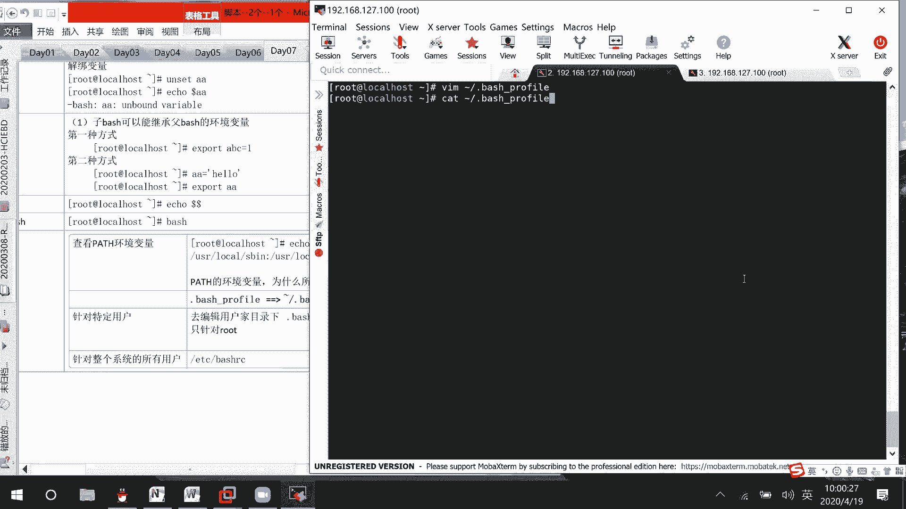

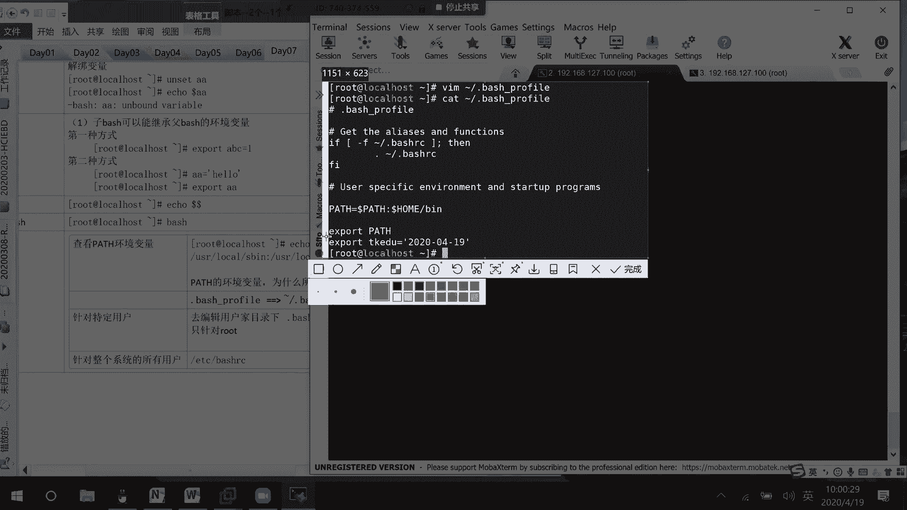

修改配置文件后，需要**重新登录**或使用 `source` 命令使配置立即生效。
```bash
source ~/.bash_profile
```

**应用示例：设置命令别名**
为了方便，可以为常用命令设置别名。例如，将 `ifconfig` 命令别名设置为 `xdd`：
1.  编辑 `/etc/bashrc`（对所有用户生效）或 `~/.bashrc`（对当前用户生效）。
2.  在文件末尾添加：`alias xdd='ifconfig'`
3.  执行 `source` 命令或重新登录。

系统还预定义了一些有用的环境变量，如：
*   `$UID`：当前用户的数字ID（root为0）。
*   `$USER`：当前用户名。
*   `$HOME`：当前用户的家目录路径。

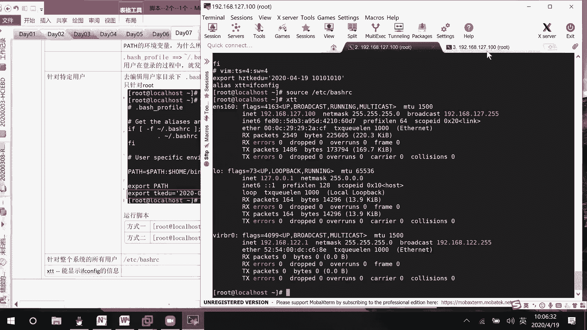

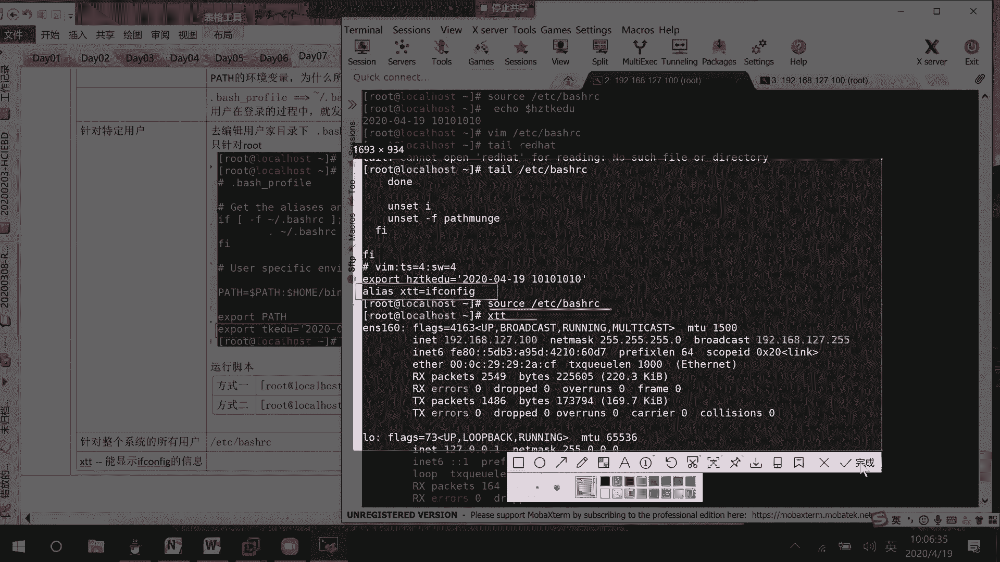

## 编写第一个脚本

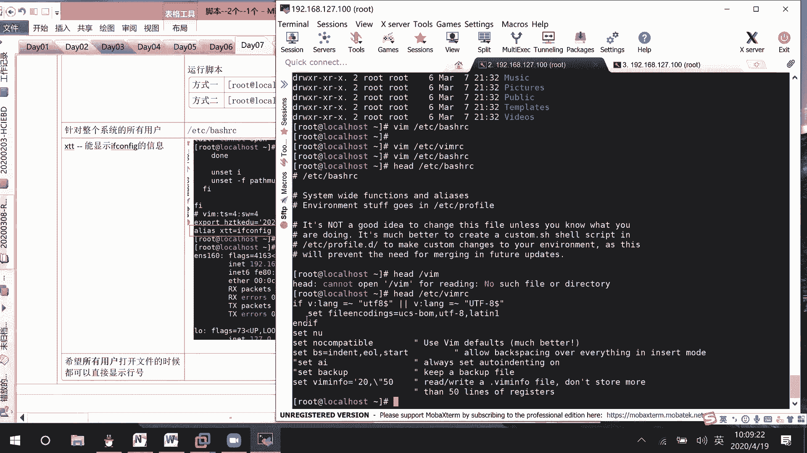

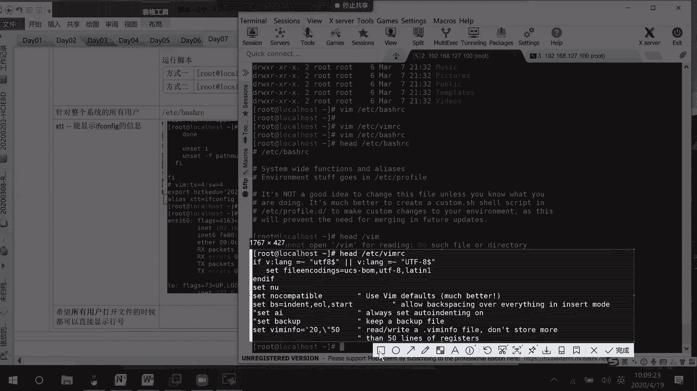

上一节我们介绍了变量的基本概念，本节中我们来看看如何将它们组合起来，编写一个简单的 Shell 脚本。

脚本的第一行通常是指定解释器，例如 `#!/bin/bash`。然后，我们可以使用 `if` 语句进行条件判断。

以下是一个判断执行用户是否为 root 的脚本示例：
```bash
#!/bin/bash
# 判断当前用户是否为root
if [ $UID -ne 0 ]; then
    echo "ERROR: Please run as root user."
    exit 1
else
    echo "This is root user."
fi
```
**脚本说明**：
*   `#!/bin/bash`：指定使用 Bash 解释器。
*   `if [ 条件 ]; then`：如果条件成立，则执行后面的语句。
*   `-ne`：比较运算符，表示“不等于”。
*   `fi`：表示 `if` 语句结束。
*   记得给脚本文件添加执行权限：`chmod a+x 脚本名.sh`

## 位置变量与特殊变量

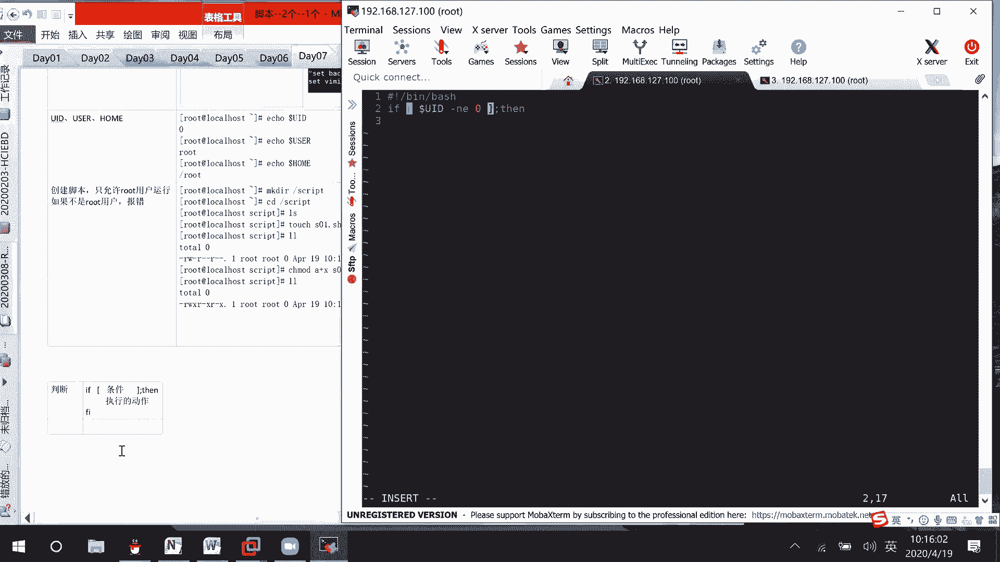

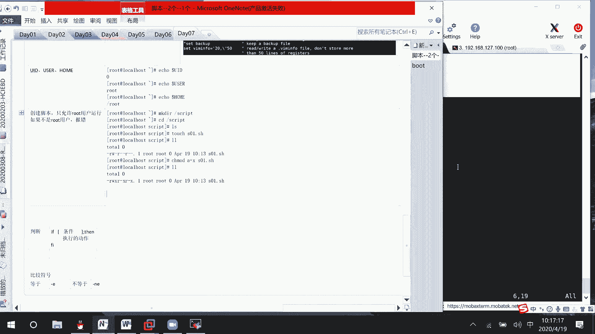

在脚本执行时，可以向其传递参数。脚本内部使用位置变量来引用这些参数。

以下是常用的位置变量和特殊变量：

*   **`$0`**：脚本自身的名称。
*   **`$1`, `$2`, `$3`...**：脚本的第1个、第2个、第3个...参数。
*   **`$#`**：传递给脚本的参数**个数**。
*   **`$*`** 或 **`$@`**：所有参数的**值**。
*   **`$?`**：上一个命令的**退出状态码**。0 表示成功，非0 表示失败。

**示例脚本**：
```bash
#!/bin/bash
echo “脚本名: $0”
echo “第一个参数: $1”
echo “第二个参数: $2”
echo “参数总数: $#”
echo “所有参数: $*”
```
执行 `./script.sh hello world`，输出为：
```
脚本名: ./script.sh
第一个参数: hello
第二个参数: world
参数总数: 2
所有参数: hello world
```

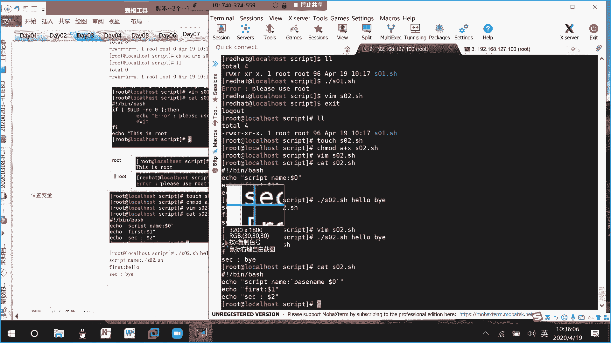

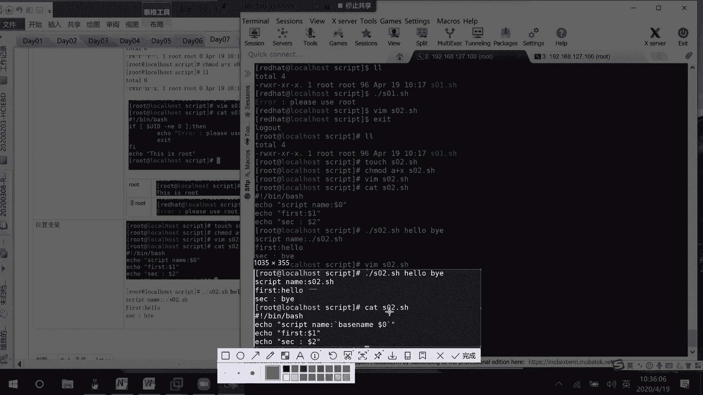

**`$?` 的应用**：常用于判断命令是否执行成功。
```bash
ping -c 1 192.168.1.1 &> /dev/null
if [ $? -eq 0 ]; then
    echo “网络连通”
else
    echo “网络不通”
fi
```

## 变量引用与引号

在引用变量和字符串时，单引号和双引号的行为不同：

*   **双引号 `" "`**：会解析其中的变量（`$var`）和转义字符（`\`）。
*   **单引号 `' '`**：原样输出所有内容，不进行任何解析。

**示例**：
```bash
name=“World”
echo “Hello, $name”   # 输出：Hello, World
echo ‘Hello, $name’   # 输出：Hello, $name
```
**建议**：在脚本中，除非需要原样输出，否则通常使用双引号。

## 条件测试与比较

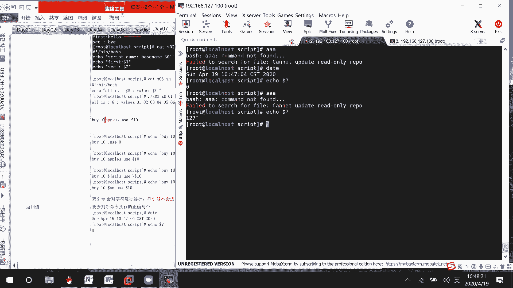

`if` 语句的核心是条件测试。测试条件写在 `[ ]` 中，注意括号内两侧必须有空格。

以下是常用的比较运算符：

**数值比较**：
*   `-eq`：等于
*   `-ne`：不等于
*   `-gt`：大于
*   `-ge`：大于等于
*   `-lt`：小于
*   `-le`：小于等于

**字符串比较**：
*   `=`：等于
*   `!=`：不等于
*   `>`：大于（按ASCII码）
*   `<`：小于（按ASCII码）
*   `-z`：字符串长度为0（空）
*   `-n`：字符串长度非0

**文件测试**：
*   `-e`：文件/目录是否存在
*   `-f`：是否为普通文件
*   `-d`：是否为目录
*   `-r`：是否可读
*   `-w`：是否可写
*   `-x`：是否可执行

**组合条件**：
*   `&&`：逻辑与（AND）。`条件1 && 条件2`，两个条件都成立，整个表达式才为真。
*   `||`：逻辑或（OR）。`条件1 || 条件2`，两个条件有一个成立，整个表达式即为真。

**示例**：
```bash
if [ $age -gt 18 ] && [ $age -lt 60 ]; then
    echo “成年人”
fi

if [ ! -e “/tmp/test.txt” ]; then
    touch /tmp/test.txt
fi
```

## 算术运算

Shell 默认将变量值当作字符串。进行算术运算需要使用特定的语法。

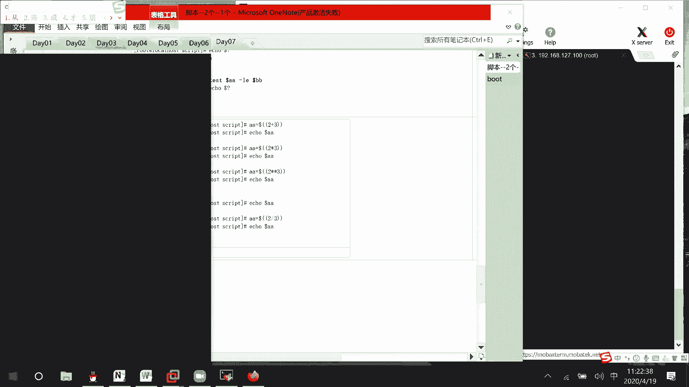

以下是几种常见的算术运算方法：

1.  **`$(( ))`**：最常用、最简洁。
    ```bash
    result=$(( 10 + 5 * 2 ))
    echo $result # 输出 20
    ```
2.  **`let`**：
    ```bash
    let “result=10+5”
    echo $result
    ```
3.  **`expr`**：较老的方法，运算符前后需有空格。
    ```bash
    result=`expr 10 + 5`
    echo $result
    ```
4.  **`bc`**：用于浮点数计算或更复杂的数学运算。
    ```bash
    # 计算 10 / 3，保留2位小数
    result=`echo “scale=2; 10 / 3” | bc`
    echo $result # 输出 3.33
    ```

## 多分支条件判断：if-elif-else 与 case

对于多个条件判断，可以使用 `if-elif-else` 结构。

**示例：成绩评级脚本**
```bash
#!/bin/bash
read -p “请输入您的成绩 (0-100): ” score
if [ $score -ge 90 ]; then
    echo “优秀”
elif [ $score -ge 80 ]; then
    echo “良好”
elif [ $score -ge 60 ]; then
    echo “及格”
else
    echo “不及格”
fi
```
**脚本说明**：
*   `read -p “提示信息” 变量名`：用于从用户输入获取数据。
*   `if-elif-else`：从上到下判断条件，执行第一个满足条件的分支。

另一种多分支选择是 `case` 语句，适用于对同一个变量的不同值进行匹配。

**`case` 语句示例**：
```bash
#!/bin/bash
echo “请选择操作:”
echo “1. 显示日期”
echo “2. 显示当前路径”
echo “3. 列出文件”
read -p “请输入数字 (1-3): ” choice
case $choice in
    1)
        date
        ;;
    2)
        pwd
        ;;
    3)
        ls -l
        ;;
    *)
        echo “输入错误！”
        ;;
esac
```
**脚本说明**：
*   `case $变量 in`：开始匹配。
*   `模式)`：匹配的模式，可以用通配符。
*   `;;`：表示一个模式匹配结束。
*   `*)`：默认匹配项（类似 `else`）。
*   `esac`：`case` 语句结束。

---

本节课中我们一起学习了 Shell 脚本编程的基础，包括：
1.  **变量的定义与类型**：重点区分了本地变量和环境变量的作用域及设置方法。
2.  **脚本的编写与执行**：了解了脚本的基本结构、解释器声明和权限管理。
3.  **参数传递**：学会了使用位置变量（`$1`, `$2`...）和特殊变量（`$#`, `$?`, `$*`）来处理脚本参数和状态。
4.  **条件测试**：掌握了字符串、数值、文件的比较方法以及逻辑运算符的使用。
5.  **算术运算**：熟悉了在 Shell 中进行数学计算的几种方式。
6.  **流程控制**：初步接触了 `if` 条件判断和 `case` 多分支选择语句。

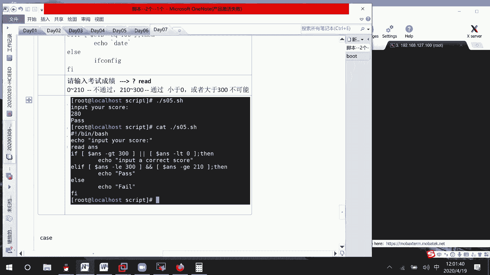

这些是构建更复杂自动化脚本的基石，请务必通过练习加以巩固。下节课我们将深入学习循环语句。