# Shell脚本编程：02：条件判断与循环结构


在本节课中，我们将要学习Shell脚本中两种重要的控制结构：`case`条件判断和多种循环结构（`for`、`while`、`until`）。我们将通过实例来理解它们的语法和应用场景，帮助你编写更灵活、高效的脚本。

## 条件判断：case语句

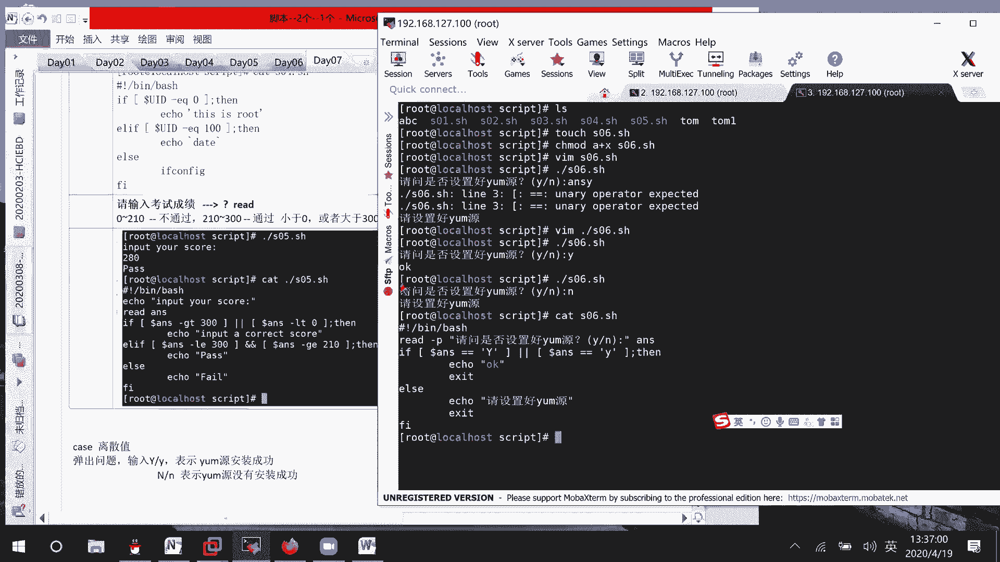

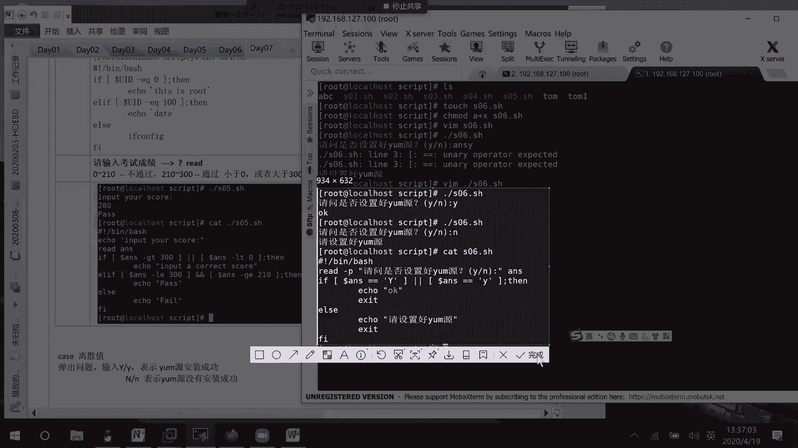

上一节我们介绍了`if-else`判断，它适用于连续或离散的值。本节中我们来看看`case`语句，它更适用于处理离散的、可枚举的值。

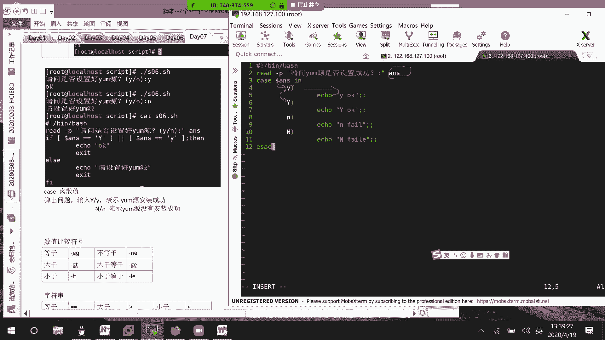

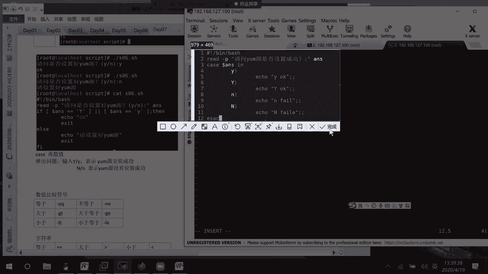

`case`语句的基本结构如下：
```bash
case $变量 in
    值1)
        执行动作1
        ;;
    值2)
        执行动作2
        ;;
    *)
        默认执行动作
        ;;
esac
```
其中，`$变量`是待判断的变量，`值1`、`值2`等是具体的匹配项，`*)`用于匹配所有其他情况（类似于`if-else`中的`else`），`;;`表示一个匹配分支的结束，`esac`表示整个`case`语句的结束。

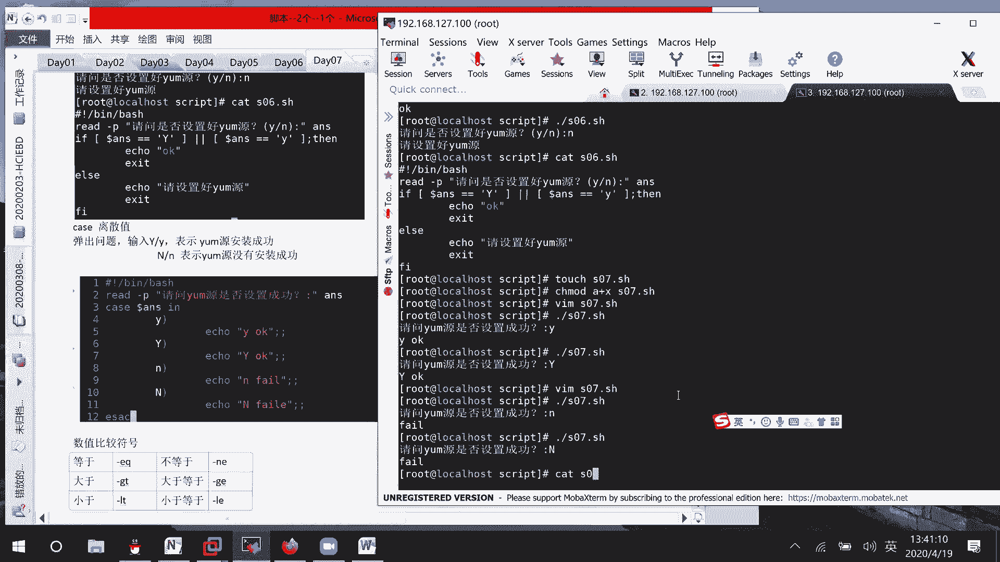

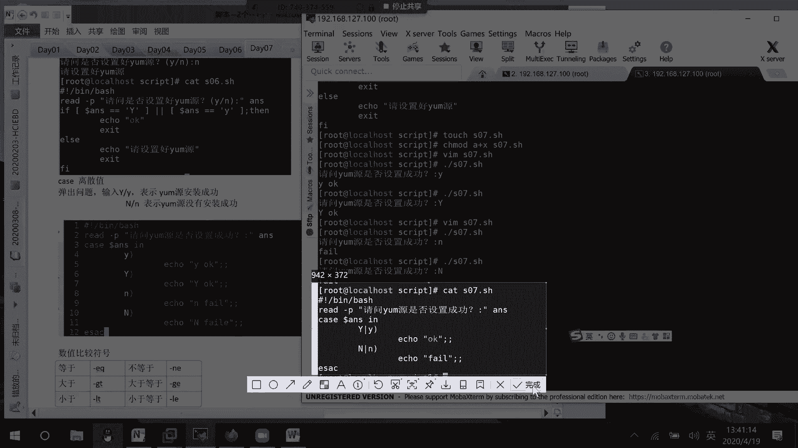

以下是使用`case`语句判断用户输入的示例脚本：
```bash
#!/bin/bash
read -p "请问，YUM源是否设置成功？(Y/N): " ANS
case $ANS in
    Y|y)
        echo "OK"
        ;;
    N|n)
        echo "FAIL"
        ;;
    *)
        echo "请输入Y或N"
        ;;
esac
```
这个脚本会提示用户输入，并根据输入是`Y/y`、`N/n`还是其他字符来输出不同的信息。

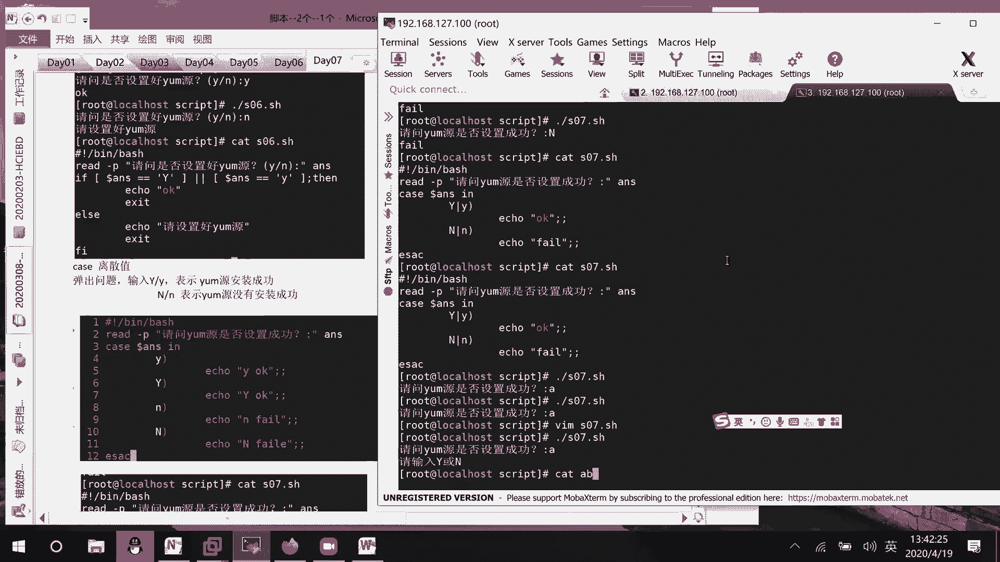

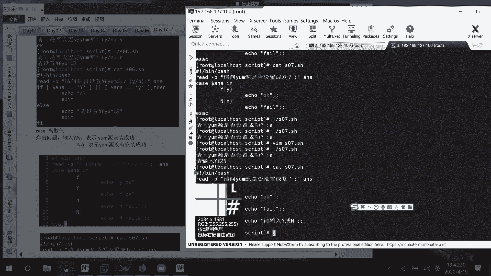

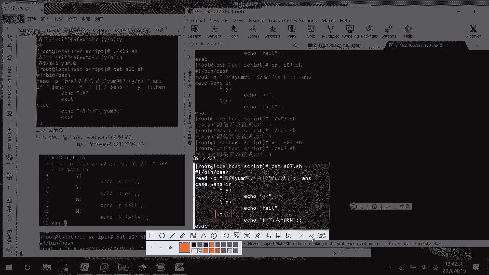

## 循环结构：for循环

循环用于重复执行一系列命令。首先我们学习`for`循环，它适用于已知循环次数或遍历一个列表的情况。

`for`循环的基本格式是：
```bash
for 变量 in 值1 值2 值3 ...
do
    要执行的命令
done
```
循环会依次将`值1`、`值2`等赋值给`变量`，并执行`do`和`done`之间的命令。

以下是一个简单的`for`循环示例，用于打印数字1到10：
```bash
#!/bin/bash
for i in 1 2 3 4 5 6 7 8 9 10
do
    echo $i
done
```
更简洁的写法是使用序列生成命令`seq`：
```bash
#!/bin/bash
for i in $(seq 1 10)
do
    echo "TKEDU0$i"
done
```
这个脚本会输出`TKEDU01`到`TKEDU10`。

### 嵌套循环与格式控制

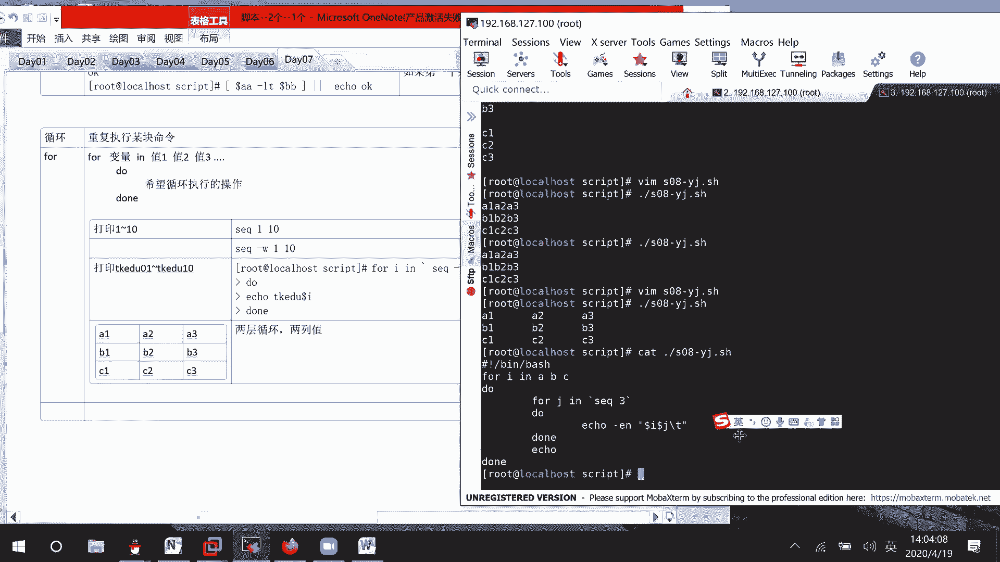

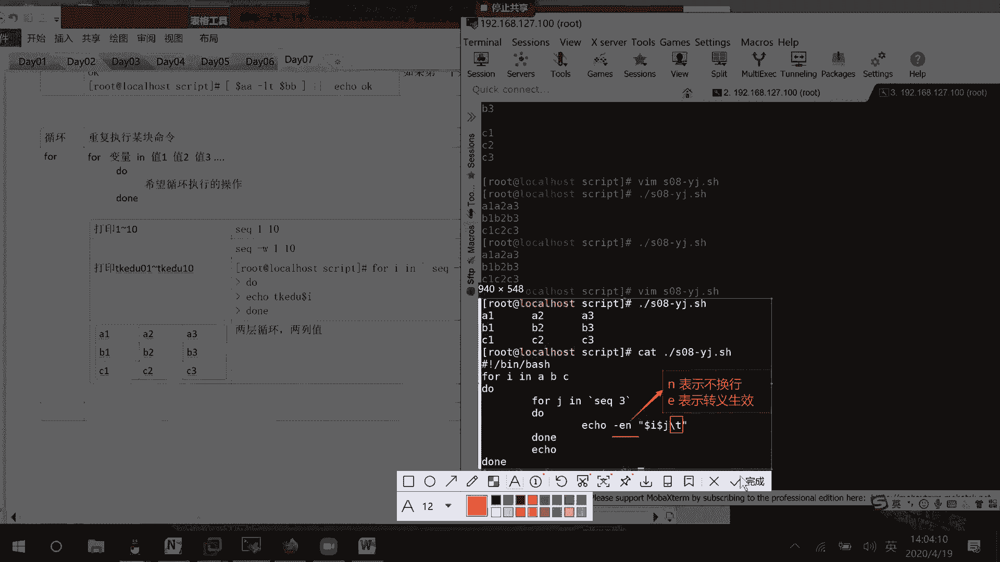

循环可以嵌套。以下是一个打印`A1 A2 A3`、`B1 B2 B3`、`C1 C2 C3`表格的示例：
```bash
#!/bin/bash
for i in A B C
do
    for j in $(seq 1 3)
    do
        echo -ne "$i$j\t"
    done
    echo
done
```
这里用到了两个选项：
*   `-n`：使`echo`命令输出后不换行。
*   `-e`：允许`echo`解释转义字符，例如`\t`代表制表符。

## 循环控制：break与continue

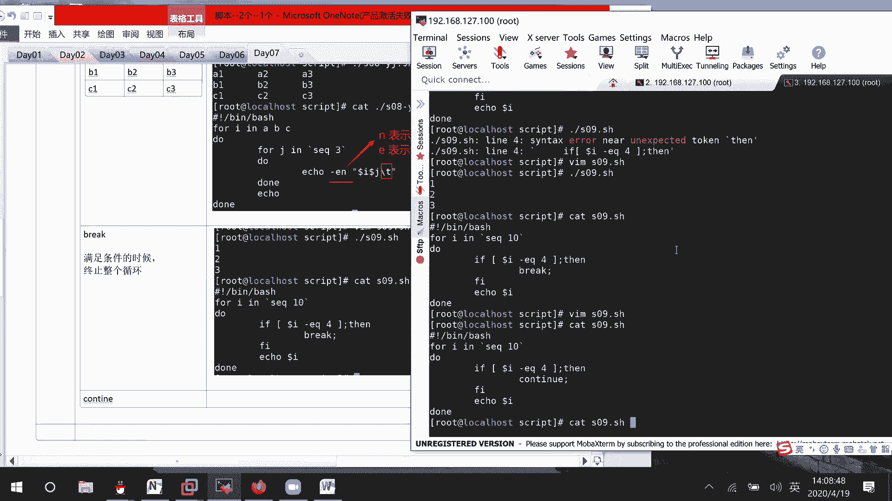

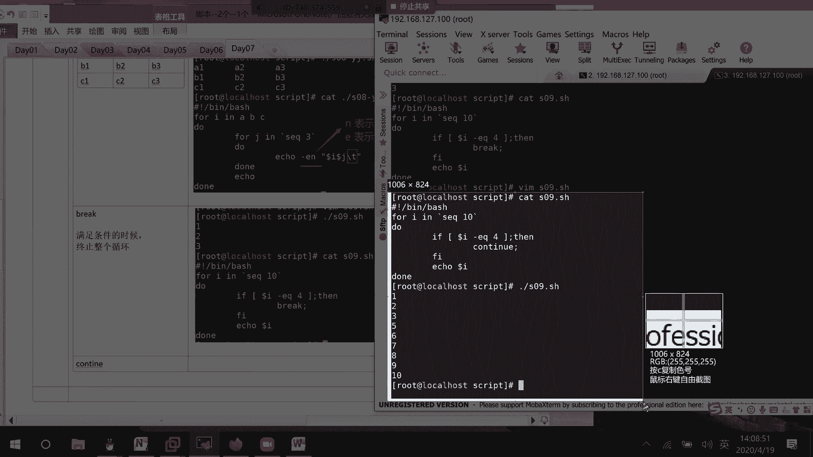

在循环中，有时需要提前终止循环或跳过某次循环，这时可以使用`break`和`continue`。

*   **`break`**：立即终止整个循环。
*   **`continue`**：跳过本次循环中剩余的语句，直接进入下一次循环。

以下是它们的区别示例：
```bash
#!/bin/bash
for i in $(seq 1 10)
do
    if [ $i -eq 4 ]; then
        break  # 遇到4就终止整个循环
    fi
    echo $i
done
# 输出：1 2 3
```
```bash
#!/bin/bash
for i in $(seq 1 10)
do
    if [ $i -eq 4 ]; then
        continue  # 遇到4就跳过本次循环，不执行下面的echo
    fi
    echo $i
done
# 输出：1 2 3 5 6 7 8 9 10
```

## 循环结构：while循环

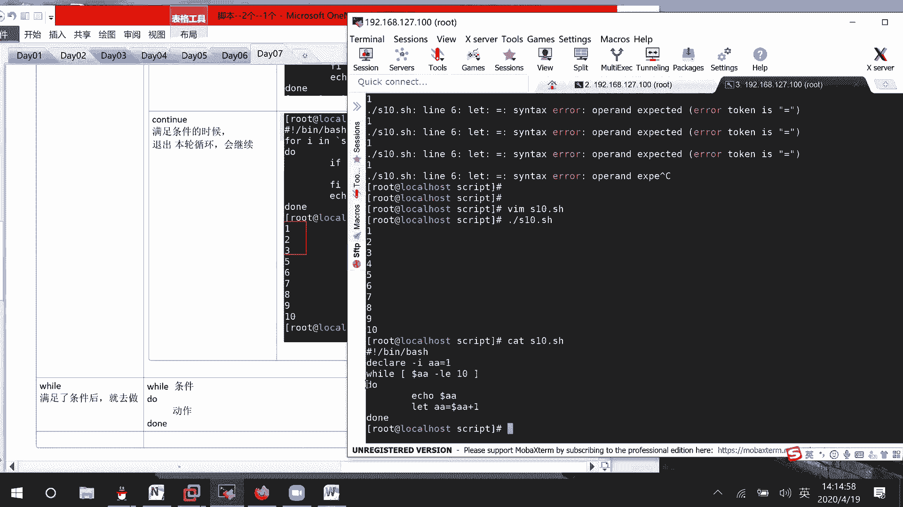

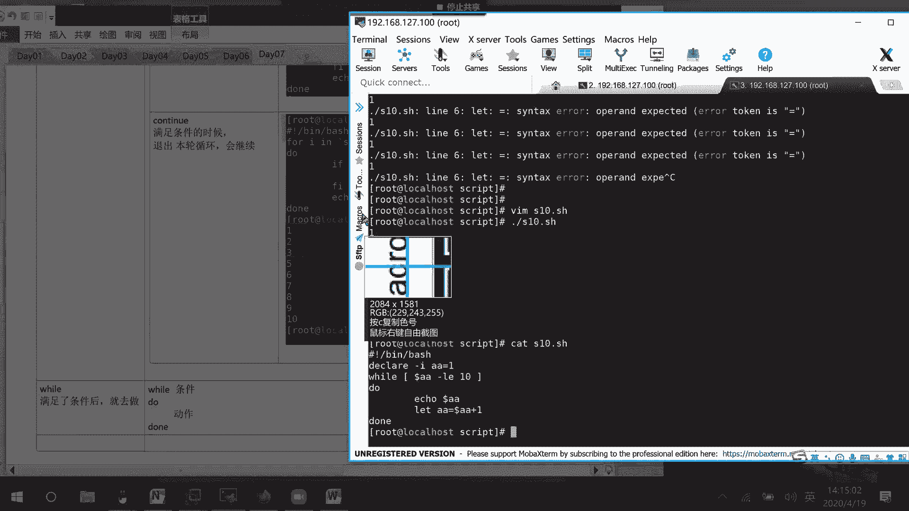

`while`循环在条件为真时重复执行命令块。它的基本格式是：
```bash
while [ 条件 ]
do
    要执行的命令
done
```
以下是一个使用`while`循环打印1到10的脚本：
```bash
#!/bin/bash
AA=1
while [ $AA -le 10 ]
do
    echo $AA
    AA=$((AA+1))
done
```
**注意**：在`while`循环中，必须确保循环条件中的变量能够发生变化，否则可能导致无限循环。

`while`循环的一个典型应用是持续监控。例如，以下脚本每10秒检查一次时间同步服务`chronyd`是否运行，如果未运行则启动它：
```bash
#!/bin/bash
while true
do
    if ! systemctl is-active chronyd &> /dev/null; then
        systemctl restart chronyd
    fi
    sleep 10
done
```

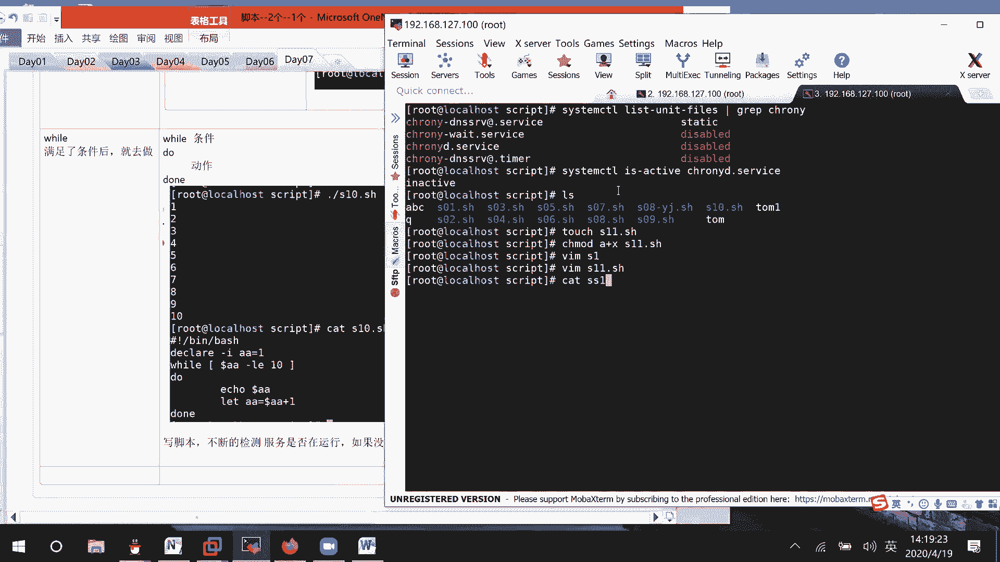

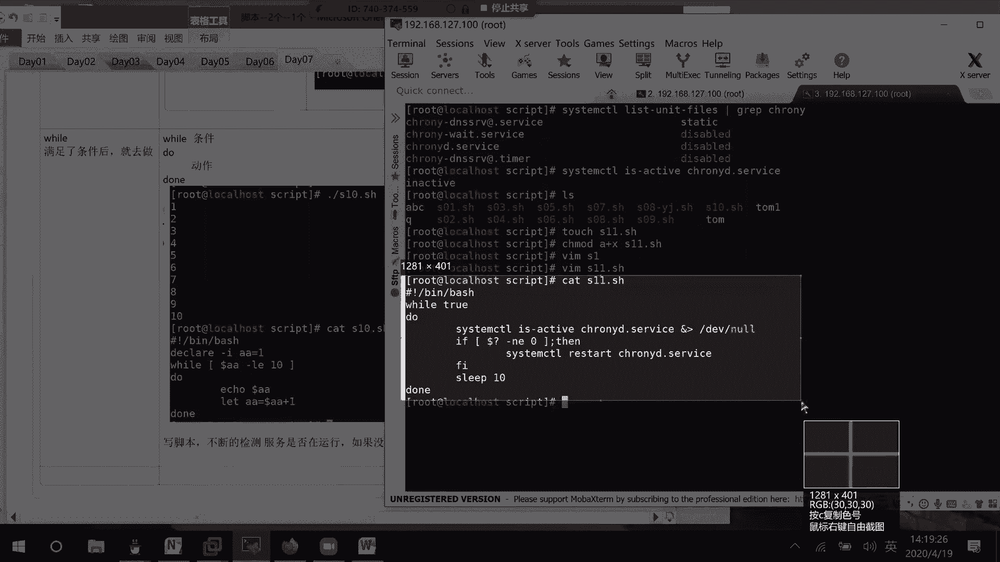

### 使用while循环读取文件

`while`循环常与`read`命令结合，用于逐行读取文件内容。默认情况下，`read`以空格、制表符、换行符作为分隔符。如果要指定其他分隔符（如`/etc/passwd`文件中的冒号`:`），可以修改`IFS`（内部字段分隔符）变量。

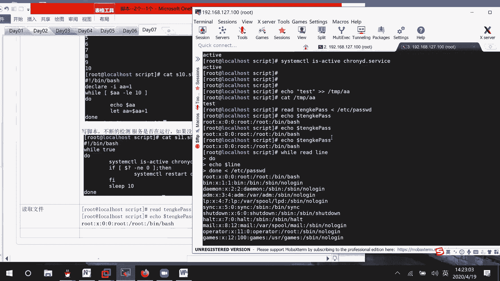

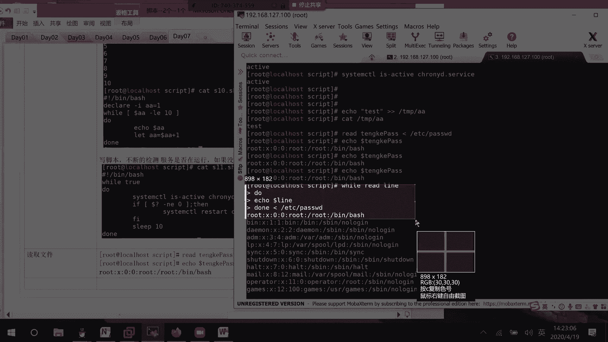

以下脚本读取`/etc/passwd`文件，并输出用户名和用户ID（UID）：
```bash
#!/bin/bash
OLD_IFS=$IFS  # 保存原来的IFS值
IFS=":"       # 将分隔符设置为冒号
while read col1 col2 col3 col4
do
    echo -e "$col1\t$col3"
done < /etc/passwd
IFS=$OLD_IFS  # 恢复原来的IFS值
```
这里将一行内容分割为四列，只取第一列（用户名）和第三列（UID）进行输出。

## 循环结构：until循环

`until`循环与`while`循环逻辑相反，它在条件为**假**时执行循环体，条件为真时停止。基本格式如下：
```bash
until [ 条件 ]
do
    要执行的命令
done
```
以下是一个使用`until`循环打印1到10的脚本：
```bash
#!/bin/bash
AA=1
until [ $AA -gt 10 ]
do
    echo $AA
    AA=$((AA+1))
done
```
当`AA`的值大于10时，条件为真，循环停止。

## 总结

本节课中我们一起学习了Shell脚本中更复杂的控制结构。
*   我们首先学习了`case`语句，它非常适合处理多个离散值的分支判断，语法比多个`if-elif`更清晰。
*   接着，我们深入探讨了三种循环结构：
    *   `for`循环适用于遍历已知的列表或序列。
    *   `while`循环在条件为真时持续执行。
    *   `until`循环则在条件为假时执行，直到条件为真。
*   我们还学习了`break`和`continue`关键字，用于在循环内部进行更精细的控制。
*   最后，我们了解了如何使用`while read`组合来逐行处理文件内容，并通过修改`IFS`变量来指定字段分隔符。

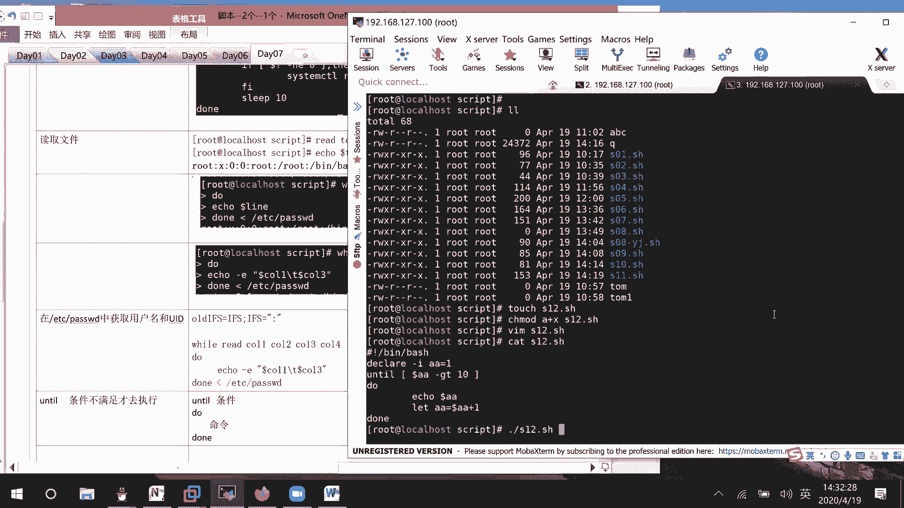

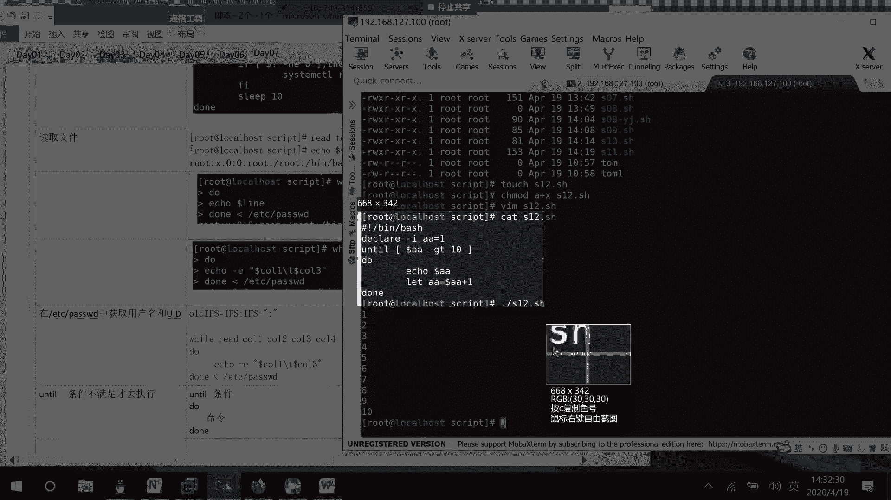

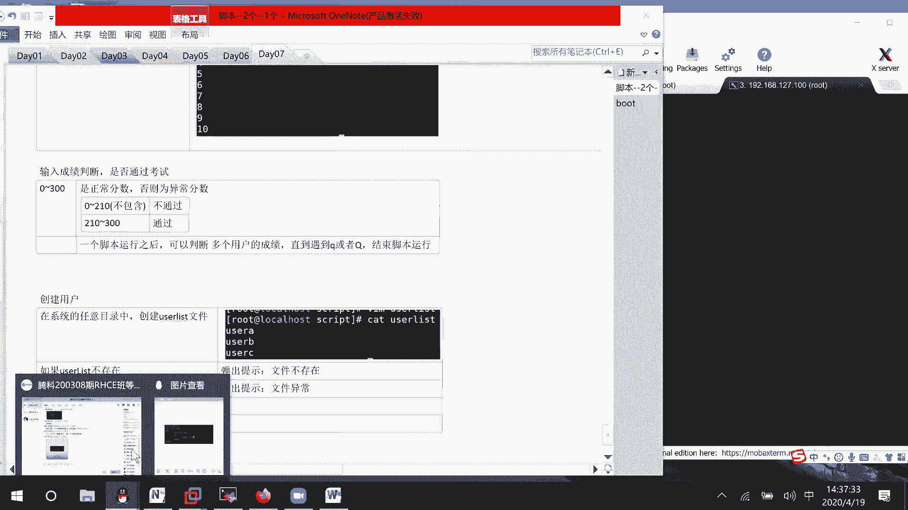

掌握这些条件判断和循环结构，将使你能够编写出功能更强大、逻辑更复杂的Shell脚本。