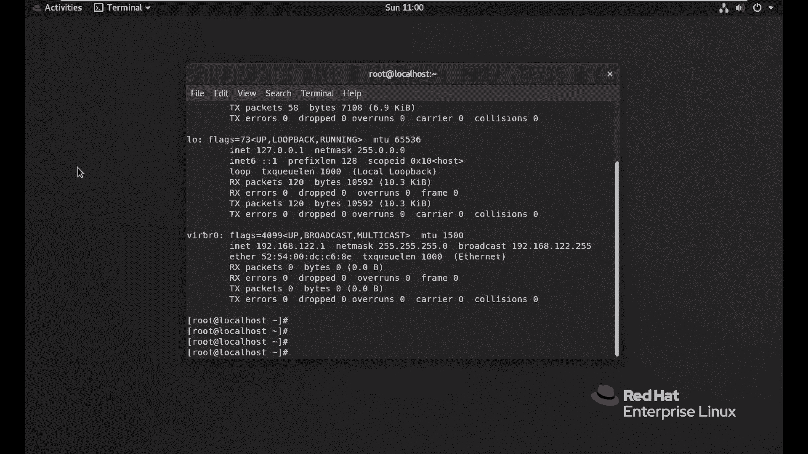
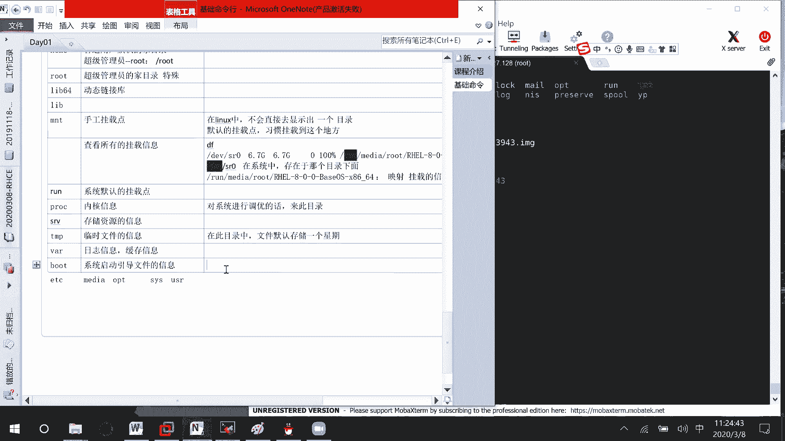
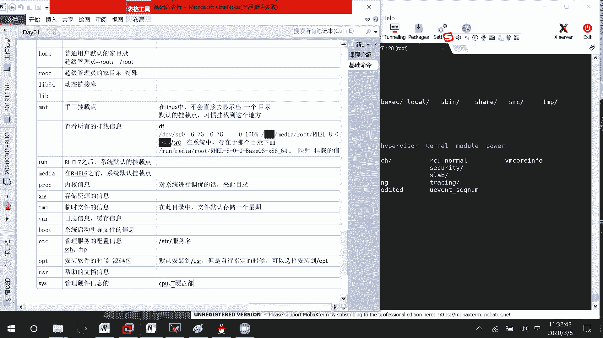

# 01 RHCE8.0视频教程【45课时】 - P2：20200308-RHCE-02 - 六竹书生6682 - BV1m84y1f7ss

这边的话呢咱们继续来说，像刚才的话呢，是不是有个help的选项，可以去查看我们的一个帮助的一个信息啊，那如果说我这边比如说CD减减help，他这边的话呢，是不是有一些帮助信息可以去显示出来。

比如说PWD我想要去看他的一个帮助信息，这里print the name of current working direct，就是说打印当前的一个工作路径是在哪里吗。

就这样子去进行一个显示。

然后接下去的话呢像他除了这个帮助信息，因为这里的话呢信息稍微比较少一点嘛，如果说我们想去查看一个比较全的一个信息呢，有一条命令叫做MN，比如说ELS回车，他这里的话呢信息就很多了。

MAN格式的话呢是这样子的，也就是说MAN命令你想要去寻求哪个帮助吗，他的话呢你看到了这里之后，上面这里这个名字叫什么，怎么样去进行一个使用的，然后呢这个描述是怎么样子的。

下面这里有说你的话呢打印H或者help的话，就是说去进行一个帮助，如果你想要退出呢，按一个Q就行了吗，如果下面这里的话呢，它有很多IP地址怎么办呢，按空格按空格这样子的话呢，就可以把所有的信息都看到了。

像这里的话呢，man他的信息是最全的，像help的话呢，它其实是从我们这边mam把信息给获取，就是截取一部分过去的，我按Q进行一个退出，这里的话呢还有个p info，它也是一个帮助的，这个第二种格式。

就是说p info的一个格式，然后后面这里的话呢跟上一个LS嘛，Key inf，命名对不对，这边的话呢我建议你们把这个三种形式，你至少要记住第二种，因为为什么呢，考试的时候有时候可以使用图形化界面。

有时候不可以使用图形化界面，那如果考试的时候那么多命令，你肯定不会把所有的信息都记住嘛，那你的话呢就需要知道我怎么样去查看，帮助像你们以后在工作当中的话呢，遇到的操作系统。

基本上会是一个命令行的一个形式，所以呢你们在这个课程当中，不要过分的依赖于一个图形化界面，以及后面的考试的时候呢，不要在问嗯，这个的话呢，有没有什么样的一个叫做图形化界面，我可以去用一下，或者怎么样。

我们的话呢以这个命令行为主，知道吧，那好这边的话呢它也是一些帮助信息，按空格，他一页一页的给你去翻，然后Q的话呢就进行一个退出就好了，这个如何查看帮助信息，我就讲这三个，这三个如果你实在看不懂的话呢。

那你只能先借助一下搜索引擎吧，教你怎么样去进行一个使用行吗，那好这边的话呢我们来看几个快捷键哈，诶等一下像刚才说的tab的键补全，你们一定要会去用，不要到最后了，还在一个一个的敲目录的一个名字。

然后的话呢发现自己还是敲不对，很多人都是这样子的，然后还有一个呢像我这边的话呢，history你看这个命令的执行结果是不是很长，把整个屏幕都给占用了，Ctrl，加上一个L加号的话呢，你不用去按了。

直接按一个L就可以了，清除屏幕，或者的话呢嗯你可以去按一个叫做clear，如果你想要打命令的话，也是可以的，CLEAR去就说清楚一下屏幕吗，如果说我想要去使用之前使用的一些命令呢，上下键去进行一个翻动。

就是说寻找之前的命令好吧，像这边的话呢，BRIHISTORY它出现了很多信息吗，比如说我history发现有一条很长的命令，我之前执行过的，现在又想要怎么办呢，比如说第20条，他理我。

是不是我我往上翻的话呢，要翻20次啊，或者就这样子复制粘贴，对不对，讲麻烦，还有什么方式呢，感叹号20，它就直接去进行一个执行，这边呢就是说感叹号编号，诶等一下，这个编号是怎么来的呢。

就是说history，显示出来了，直接去进行一个执行，然后的话呢像你们来看一下，他这边执行的是不是r o t desert top，比如说我现在想要去进入到这个目录，E s c，按一下点。

按一下可以调用上一条命令，最后面的一部分的一个命令，键盘上有一个键叫做ESC的键，键盘上有一个键叫做点，它有什么作用呢，调用上一条命令，尾部的尾部的结构，回车它这样子的话呢就进入了嘛，就会快很多。

如果说我的话呢，之前执行过了很多，什么命令呢，比如说执行过history a l s命令，执行过很多，如果我想去查找怎么办，CTRL加R，比如说LS，你看CTRL加RLS。

他这边的话呢是不是不是我们要的一个信息啊，稍等啊，CTRLRCTRL加R，比如说PWD，他就会把一些相关的信息的话呢给你匹配出来，那个彭宏等一下去看这个问题啊，他这个瑞restore也是可以的。

就还原一下，估计是也有可能windows没有获取到IP地址了嗯，如果连接不上的话呢，等一下去处理，因为你现在处理那个问题的话，可能我现在长了一些所有东西，你可能都没有听到了。

然后后面的话呢又得去进行一个复习好吧，这个CTRL加R的话呢，就是说在history中，寻找历史命令，也就是说去和某些关键字匹配上的话呢，我去把你给找到嘛，那好然后的话呢呃我这边再来这里啊。

如果说我想要去去到命令的一个头部怎么办，是不是左右键或者的话呢，还有一个键CTRL加A，他到了头部，CTRL加D，它就到了一个尾部，好吧，他的话快捷键有很多，我的话呢不一去讲。

就是说比较常用的CTRLA到命令的头部，然后这里CTRLE到命令的尾部，就这样子，行，那好，接下去的话呢我们来看一下，这边就是一些简单的一个快捷键的话呢，怎么样去使用。

然后在这里我们的话像windows电脑的话呢，它是不是也会有很多的一个叫做工作桌面。

这俩稍等一下，因为不常用他这个工作桌面，嗯嗯嗯哦你看这里桌面的话呢，是不是就可以去加上好几个工作桌面对吧，那这边的话呢诶我要切到我自己想要的那个，那这边的话呢像我们LINUX的话呢。

如果说你也想要去打开很多的一个，控制台的一个界面的话呢，该怎么办，这个的话呢因为是需要用命令行去看嘛。

所以这里的话呢我把这东西给你们打开，像这个control alt加上，比如说F2，稍等一下，我这边怎么不生效了呀，嘟嘟，稍等一下。

我这边的话呢现在那个快捷键不生效，其实就这个桌面的话呢，你可以去进行一个添加的。

我快捷键的话呢我去试一下，应该是就是Ctrl alt Ctrl fn，然后的话呢再加上他的第几个控制台，但现在我这边的话呢就是说没有生效哈。

这也没有生效，没有生效的话，那就算了，也就是说在我们的LINUX当中的话呢，你也可以去打开很多个控制台，它的话呢是这个CPILALT。

然后的话呢比如说FERF2啊，这样子去进行一个切换，我再来试一下，不可能不成功算了，真的不成功哈，那这个呢就不管了，确实不成功哈，他这个不成功。

这个的话呢就进行一个切换，然后这里的话呢一个命令很重要的是什么呢，之前在我们红帽期考试的时候，一开始的时候给你们的是一个叫做图形化界面，就是说考试的时候呢，一开始给你们的是字符界面。

也就是说你们进去的时候呢。

看不到这样子的一个桌面，那如果你看不到桌面的话呢，虚拟机，那你是不是也就不能打开去进行一个操作，只能通过远程管理的方式嘛，那这样子的话呢就不太方便了。

如果说我的一台电脑上面的话呢，是安装有图形化界面的，但是默认启动是字符界面，我的话呢，怎么样从字符的界面切换到我的图形化界面，这个你们一定要注意啊，start x就可以了。

就如果有些设备它本身就没有安装，这个叫做图形化界面，你start x start100遍都没有用的，如果说有的话呢，你就是start x，它就可以帮你从字符界面到图形化界面，这个听到了吧。

这个如果不知道的话呢，你考试急死了，然后呢也不知道该怎么做，连题目你都看不到，知道吧，这个一定要注意啊，那行那这里的话呢就基础方面的话呢，我们就讲到这里过了，然后下面这里的话呢，像你们刚才比较关心的。

各个目录有什么样子的一个作用，我来给你们讲一下，首先像这边的话呢，我们看到了第一个VN目录对吧，他这个的话呢是在里面去存储一些命令的脚本，稍等一下，就好像说我们的LSPW啊，这些是命令啊。

他的话呢其实是通过脚本执行，然后得到的一些结果，那现在的话呢就比如说我想去查看一下命令，他的脚本存在哪里，存储信息吧好吧，这边的话呢有一个命令叫什么呢，叫做WICHVH，后面的话呢你跟上命令就可以了。

就比如说which ls s，你看它在哪里呢，user bin下面它有存在的，它有存在的，他这个的话呢，因为有些人说，这个明明存的不是你的一个根目录下面啊，因为在我们的windows当中。

是不是有一些比如说快捷方式一样的，那我这边的话呢也就相当于是一个快捷方式，两边的话呢可能直接就有关联嘛，知道吧，病下面的话呢用存储这些信息，你看全都是一些命令好吧，存储一些命令的一些信息。

然后的话呢我看一下有病，那SB的话，那应该是和他一样的，全都是存储一些命令的一个信息嘛，那好然后接下去的话呢，我们来看一下这个叫做DV，等一下，诶这个DEV的话呢它是干嘛的呢，DEV它的一个缩写。

是不是我们的它是不是device的一个缩写，这个的话呢，就好像我们想要去访问一个硬件设备的时候，他的话呢就是到DEV的一个目录下面，去进行一个访问的，就好像说我们windows电脑想要去访问一个U盘。

那到时候的话呢，是不是要在我的电脑下面去进行访问，比如说去读写数据的话，是不是通过这个我的电脑下面，去进行一个读写的，你总不可能把U盘给拆开，拿一支笔去读写对吧，所以的话呢这个LV的话呢，Device。

就是说管理我们要访问的一个设备，也是这样的，在这里的话呢给你们提到一个东西，一个叫做内核空间，还有一个的话呢叫做用户空间，内核空间是怎么样子呢，我们用户无法直接去访问，需要基于内核进行访问的。

就比如说一个硬盘，我们呢可能要通过我的电脑，然后再去访问到硬盘的信息吧，然后用户空间是什么呢，就是像我这个叫做此电脑下面，我可以直接去访问的一个东西吗，就好像说嗯这边的话呢给你们去画一个图哈。

就比如说你的话呢要去开车，对不对，少点去，那像这里的话呢，就好像你要去开车，发动机是不会在转，你的话呢会不会就说，如果你想知道那个发动机的转速是怎么样的，你会不会爬到车里面。

把那个发看着发动机去数它到底每分钟转几下，不会吧，你是不是可以通过汽车内部的那个叫做仪表盘，去看它的一个转速啊，这个时候的话呢，那个驾驶驾驶室里面，那些叫做仪表的信息的话呢。

是我们用户可以直接读到的内容，所以驾驶室的话呢，称之为我们的一个叫做内核空间啊，就是说用户空间嘛，然后的话呢像我那个仪表盘的话呢，是不是要去连接我们的一个发动机啊。

发动机的话呢就先相就是说发动机和仪表盘连，那这个中间的过程，是不是就相当于是一个内核啊，所以它这个的话呢是这样子，就是说两几层的一个意思，这边给你们画个图哈，就比如说这个是我们的一个叫做磁盘。

然后的话呢就相当于是我们发动机，我的话呢没有办法直接去进行一个查看，但是像我们汽车里面的话呢，它是不是有很多的一个控制器啊，那就相当于我们电脑当中的话呢，是不是有很多啊主板在上面啊，就有主板在那里嘛。

内核空间，我的话呢是不是可以去访问我的一个磁盘呀，把你的一个数据信息的话呢给获取到了，然后呢是不是在此电脑当中去进行一个显示啊，汽车获取到发动机的信息之后，是不是在仪表盘上面去进行一个显示。

所以这里就是说逻辑磁盘，我们现实生活当中可能是一个方块的东西，在这里的话呢，是不是就是一个图标的一个信息啊，内核空间把它映射成一个叫做逻辑的一个磁盘，然后接下去呢那我的一个用户，就是说作为我来说。

是不是在这边的话呢，是不是就可以看到这个信息了，用户空间可以直接查看到的好吧，然后这里的话呢是我们的用户空间，像这个内内核空间的话呢，他是去把我们一些物理的东西的话呢，进行一个逻辑化。

让我们的话呢可以去进行一个查看，能明白吗，所以的话呢在我们的，windows当中可能有此电脑去进行管理，在我们的LINUX当中的话呢，它就是由这个DV来管理这些硬件设备的好吧。

然后下面这里的话呢我们来看一下，这边有个叫做home的一个目录，这个目录是什么呢，用户的家目录，嗯像我们每一个人都有自己的一个家，对不对，在每个人家里面的装修风格是不一样的，那相同的，在LINUX当中。

每个用户都有自己的家目录，里面存储的自己一些个性化的信息，比如说我想使用的字体啊，或者我自己有没有一些特殊的命令啊，都存储在这里，这边我们来看LS，你看这里是不是有red hat。

那这边的话呢我们知道在整个系统当中的话呢，我除了有red hat，是不是应该还有刚才这边的一个IOT，这里的话呢它是存储普通用户的家目录，然后的话呢，系统当中是不是有一个叫做超级管理员。

就是我们平时说的ROT，他的一个加目录在哪呢，它比较特殊，直接就是在ROOT下面，这个的话呢是它的一个加目录，能明白吧，稍等一下这个超级管理员的加目录，特殊其他用户的话呢。

默认全都是在这个叫做home下面，普通用户默认的加目录，每个用户它都会有一个加目录的，那好这个的话呢没有什么样的一个问题，然后接下去的话呢，我们来看一下这边LLIB64，这个是什么呢。

它的话呢是一些动态链接库，因为就好像说嗯有一些程序要执行的话呢，它需要依赖于第三方的一些库的一个文件嘛，就说一些方法对不对，所以的话呢LIB是一个动态链接库，那相同的LIB六十四六十四位的嘛。

LIB它的话呢是一个叫做32位的一个，动态链接库嘛，就不管，然后接下去的话呢，我们来看一下，这边还有一个叫做mount n m t这个东西的话呢，是什么东西呢，它是一个挂载点，什么意思呢。

就好像说嗯我们windows的U盘它直接插上来了之后，在这里是不会显示，比如说H盘或者D盘或者I盘这些信息啊，这个东西的话呢，它是不是一个逻辑上的一个信息啊，windows直接帮我们去做了。

也就是说磁盘的话呢，我直接去映射出，比如说机盘H盘这些信息，让用户可以直接去使用吗，但是在LINUX当中的话呢，它不能直接去进行映射的，他的话呢在LINUX当中，不会直接去显示出一个分区。

其实windows上是一个分区，在LINUX上是不是就是一个目录，就是说表示是比如说是这个光盘的一个信息，他的话是不会去显示的，需要我们手工的人为的去进行一个设置的，明白吗，就好像说这边的话呢。

我们U盘插进来之后，这里是会显示一个U盘的一个信息啊，那我们在LINUX当中，如果想要去查看所有的挂载信息。

怎么去看，这边你们来看一下，有个叫做DFDF可以去查看信息，什么东西呢，这边有个DV目录大小是多少，DVSHM目录大小是多少，这边全都有写，比如说横线H，他这边的话呢。

就是说带单位的形式去进行一个显示嘛，然后呢跟个F呢，诶等一下D啊，DH干DF干，嗯稍等哈，DF横线就H就H这边的话呢，你看是不是有很多信息啊，这边run mile这个是什么呢，你看它存信息存在哪里啊。

Levs20，下面也就是说这个信息我从哪里来的呢，从DEV来的，为什么我所有的信息是受我的DV的一个目录，去进行管理的，明白吗，然后我现在的话呢，如果想要让用户访问的话，怎么办呢。

他把你映射到米root下面去，wrong media root h e l下面去，就说其实这个目录是什么呢，是我们的一个光盘的一个信息光盘，就好像我们装系统的时候，是不是给了你们一个光盘。

这就是光盘的一个信息，然后的话呢我把这条信息单独的拎出来，你们去看一下，首先，前面这里的话呢就是说在系统中，这个什么意思呢，就是说在系统中，呃存在于哪个目录下面，是不是存在于一个叫做DEV。

下面名字的话呢叫做S20，我的话呢是一个叫做快设备，你看，他这边是没有办法去显示你里面东西的，在这边就是说现在在下面，我下面这里呢，你就是一个光盘，是一个整体的东西，我的话如果说U盘拿过来之后。

想要去被别人访问，是不是有一个叫做U盘或者H盘。

我打开是不是才能看到里面的东西啊，那这个时候就需要进行一个映射吗，或者进行一个挂载吗，这个映射，挂载的信息，那这个时候才能去进行一个访问吗，只是说这个光盘的话呢。

它自动的映射到了run middle下面去，如果说在我们普通的工作当中的话呢，会比较多的映射挂载到哪里去呢，NMT当中句哦，MNT当中句，这个的话呢它是一个默认的挂载点。

这样子以后的话呢如果要找找一些挂载信息呢，是不是到MONT下面去就可以了，这个的话呢习惯挂载到这个地方，好吧，然后接下去的话呢我们再来看一下PLC，这个的话呢就是我们内核的一些信息了。

就比如说嗯这边给你们来看一下LSPROC，你看这边是不是有很多数字信息，看不懂看不懂，没事啊，CPU能看懂吗，LSPROCCPU是不是有这么一个文件，稍等一下，你看他这个的话呢，是不是一个普通的文件。

如果说我现在想要去查看一个文件该怎么做呢，这边给你们去补充一条命令，叫做查看文件，查看文件呢命令是一个叫做CAT，后面跟上你想要去查看的文件的名字就行了，比如说prc info，好吧。

他这个的话呢只能去看文本文件，以横线开头的，知道吧，我们来看一下cat process CPU info回车，这边的话呢就是我的一些CPU的一个信息了，稍等一下，我再来给你们看一下。

比如说你还想要去看一下设备信息啊，磁盘的一些状态啊，都可以看，像后期的话呢，比如说我们在进行一些磁盘管理的时候，我想要去看一下我的分区的一些信息嘛，我看一下有个叫做你看这有个partition。

Cat brothy partition，你看我这边有几个分区，123456，其实没有六个分区啊，就是说有六个条目，到时候教你们再去看怎么样去看分区好吧，所以在这里的话呢都是在这个PROC下面。

它存存储一些系统的一些信息，内核的一些信息，就好像说如果你想要去进行一些调优的话呢，基本上也都是来这个PROC目录上面去，进行一个调优，就是说在这个目录下，你对一些配置信息进行修改了之后。

它就会反馈到我们的系统当中去，好吧，那好下面这里的话呢我们再来看一下这个run，诶等一下run这个run的话呢，其实和这个mt的话呢是差不多的，为什么这样子说呢，你看我们刚才这个叫做呃光盘。

它默认挂载到哪里去啊，是不是就挂在这个run下面去，像这个的话呢叫做me m n t的话呢，它是我们挂载点对吧，手工的一个挂载点，手工默认会挂到这里去，你不挂这里也是可以的。

像这个run呢它是系统默认的挂载点，基本上它识别到的一些东西，都给你挂到run当中去了，好吧，那好下面这里的话呢，我们再来看一下这个SRV的话，就是一些资源的一些信息，诶等一下，他现在是空的。

里面什么都都没有，他的话呢你可以去存储一些，比如说信息吧，存储资源的信息，然后像这个TMP的话应该是知道的，temp临时文件的信息，这个的话呢我没有记错的话，在这在此目录中文件默认存储一个星期的。

等你一个星期到了之后呢，有一些临时文件就会被删了，所以你们的话呢，在存一些比较重要的文件的时候，不要放到tap目录下，如果放到太空目录下的话呢，自己直及时去刷新一下它的一个时间，能明白吗。

那好下面这里的话呢，我们再来看一下这个叫做VR，VR的话呢存储的是什么信息呢，像一些日志信息啊，我们的话呢会存储到这里来，有时候的话呢可能一些帮助信息啊，他也会在这里好吧，你看LSVR。

你看catch数据库，还有的话呢FTP它的一些缓存信息，就好像有时候像一些日志信邮件啊，收到啦都会放到这里，日志信息，还有一些嗯一些文件信息吧，啊缓存信息，就相当于我们有时候在收取一些信息的话呢。

默认会存到这个叫做VR下面去好吧，然后像这个boot的话呢是什么东西呢，叫做就好像我们windows当中的一些启动，启动的文件信息放在这里呃，叫做引导文件，真的，文件的信息他都会放在这里，系统引导文件。

我们来看iOS boot，这里的话呢就相当于我们windows当中的一个呃，安装信息，它全都在这里，如果说你把这个文件给删了，系统可能就起不来了，能明白吗。

所以的话呢我建议你们怎么样呢，下午的时候把这个电脑就是说把这个windows先关机，关完机之后，虚拟机快照给他去拍摄一个快照，这里呢随便去起一个名字，那等你到时候系统开不起来了之后呢。

你还可以去还原到这个状态。

就不需要重新去，就不需要重新去安装操作系统了，能明白吗，这里的文件的话呢它非常的一个重要，非常重要哈，信息的话呢基本上全都存储在这里了，那好然后下面的话呢我们再来看一下，有个文件叫做etc的一个文件吗。

这个文件的话呢它的一个作用就管理配置信息，就比如说一些服务的配置，像我们等一下要去学习SSH啊，或者其他的一些比如说FTP啊，它的配置文件基本上都放到这里，你看LSETC很多信息看不懂。

那LSEDCSSH，这个SSH的一个客户端，SHSHD的话呢就是一个服务器端嘛，知道吧，就是说基本上他所有服务管理服务的配置信息，他都放在这个目录下面，然后的话呢基本上它的命名格式都是etc服务名。

这样子的一个格式，就是说基本上不会逃掉这种格式，只是说有一些服务的话呢，它啊比较奇怪一点，目录的名字和你服务的名字的话呢不太一样，好吧，那好，然后接下去的话呢就是middle，哼哼哼哼。

这边的话呢嗯就是它是因为保留下来的哈，他这个mile和上面这个的话呢是蛮像的，这个东西是干嘛呢，就是说在我们在红帽，六之前我们U盘这些信息插入一下，就是说插到系统里面去的话呢，系统。

默认挂载点是middle的，而不是run的，知道吧，像同报期之后的话呢，他的话系统的一个默认挂载点的话呢，就是run目录了，八的话呢它也是一个run目录，我们看到了对吧。

那好然后接下去的话呢还剩下三个文件，很快的哈，像这个叫做OPT的话呢，它是干嘛呢，他的话木耳也是空的，里面现在什么东西都没有对吧，他像我们有时候的话呢，嗯一些软件在安装的时候。

可能直接就是它的一个源码的一个包嘛，这个时候的话呢我们如果不指定目录的时候，不指定目录的时候，它默认会把你安装到一个叫做user下面去，如果你不指定目录，它会安装到USR下面去。

但是的话呢比如说根据我们的一些嗯经验的话，或者就是说习惯性的话呢，如果手工你要去指定的话，就放到这个OP t下面去，知道吧，软件安装的时候，你可以去给它改一下目录，默认安装到SOUSR下面去。

但是自行指定的时候，可以选择安装到，我们的OP t下面去好吧，然后像这个的话呢，user一个就是说默认的安装位置吗，还有一个呢，它的话就相当于我们windows c盘的那个。

windows里面的一个目录，就是说去存放一些帮助文档信息，他的话呢就会放在这里，就好像我们到时候安装了一个服务之后，可能不知道它的一个配置文件是什么呀，或者的话呢。

不知道他有没有什么样的一些案例文件吗，那这个时候的话呢，我们就可以来他的这个目录下面的话呢，去进行一个参考，到user下面去查找我们的帮助文件，知道吧，那好到这里过的话呢，所有的目录我们就全部讲完了。

这边的话呢给你们5分钟时间去看一下好吧，这几个目录，你们看一下有没有什么样的一个问题，如果有问题的话呢，及时提出来哈，你好吧啊，这边的话呢我好像漏了一个叫做SYS目录，对吧，这个目录的话呢它是干嘛呢。

它是管理一些硬件信息的，你看LSSOS回车，像这个快信息总建信息设备信息，他的话呢全都是还有一些内核信息啊，全都是在这里进行管理的，LSSYS比如说叫做内核的一个信息，比如说这边的话呢。

嗯像这边的一些参数，比如说vm call inf，稍等哈，cat一下，这边的话呢这个就是它的一些编号的一个信息，好吧，你们就SOS的话呢，在我们初级初中几单中的话呢，不会用到，因为在高级单中的话呢。

系统调优的时候才会去用到的，管理我们的一些硬件信息，他这里的话呢比如说像CPU硬盘，都在这里。

进行管理好吧，那这边你们去看一下哈，编的话呢我就去点那几个人的名字就好了。

这边的话呢咱们下面接下去来看一下，像基础命令行的话呢，我们就也讲了，比如说CD啊，切换目录这些信息，还有的话呢就是一个点和两个点开头的，对不对，然后现在呢这边我们来看一下，有时候CD回车。

他是不是直接就回到自己的家目录了，然后的话呢，所以我们可以发现这个波浪线的话呢，代表什么呢，目前用户的家目录是在哪里，比如说我CD root的加目录是不是就在根下面，叫做ROT下面嘛。

然后的话呢像我第一刚才的话呢，是不是在这个叫做呃斜线目录下，然后的话呢我本来是这样子啊，本来是在斜线目录下，然后呢我又切换到了斜线ROT下面嘛，哦吕雉是你对吧，然后这边的话呢。

就比如说我们现在的话呢想要去切换，切换到上一次目录怎么办，比如说CD横线，这个的话呢，就是说一个横线它就切换上一次所在的目录，诶，等一下，切换到上一次所在的目录CD，就是说后面跟上这些选项一个点两个点。

然后呢波浪线还有一个叫做横线，好吧，这个的话呢是这样子，然后下面这里的话呢刚才我们去讲查看的命令，讲了一个cat吗，他这边的话呢查看的命，查看文件的命令呢有很多，我们来看一下，第一种叫做cat。

没有问题，我们遇到了第二种的话呢，more如果说你文件cat是怎么样的，一次性把文件全部显示出来，那如果你文件很多的话，这边是不是就要就是说用滚动条去滚一下，如果说你们用过那个字符界面的话呢。

其实可以发现它没有滚动条的，那也就是说只能看到一瓶的东西，上一瓶的东西是就看不到了，就不太合适，像这个more的话呢，它就比较适合于一个叫做大文件，一次性的话呢，就是说显示一屏一屏的一个文件嘛。

它除了more之外呢，还有一个类似LESS，它也是慢慢的去显示，然后还有呢这个ta配的怎么回事呢，比如说我有时候想要去查看文件，因为有些文件的话呢它的名字很相似嘛。

但是我可能通过前几行就能分辨分辨出来了，最head的话呢就是说查看文件的前几行信息，然后这里呢还有一个叫做tell t AI l，它是干嘛呢，是尾巴的意思吗，他的话呢就是说查看文件的尾几行信息。

没几行信息，这边的话呢咱们来试一下哈，这边就说你们不要把它给搞错掉，首先到tap目录下，这边有很多文件，你们不用去管它，你们的话呢去复制一个复制文件，你们会复制吗，它的命令叫做copy。

copy的话呢是怎么样，比如说原文件一，我把它拷贝的与目标文件，先问你如果这样子拷贝的时候，原文件一还存不存在，它这个呢是不是还是存在的呀，因为复制的话呢，只是说把它就是说模板印一份过来嘛。

所以原文件一还是存在的好吧，我这边比如说copy etc password p a s s w d，你们把他给拷贝过来，不要直接在那个目录下操作好吧，嗯然后拷贝到哪里呢。

temp下面比如说叫做password，所以你看这样子的话呢，我们就说拷贝一个文件过来，让我们可以去做实验，其实你不拷贝也没关系，我主要是为了方便，第一步就是说切换到临时目录。

因为这个目录下面你把文件删了呢，其实也没有关系的，然后这个呢是干嘛呢，copy它的一个格式，就是说copy原文件，目标文件，你看如果说我copy原文件是这个目标文件，是这个对吧。

他这个是不是目录下的一个文件的一个名字啊，那这样子的话就是说给他一个名字，如果说你是这样呢，Copy，可以等一下，这边比如说是目标目录，你们来想一下是怎么样的，上面这个就是说啊使用目标文件的名字。

下面这个呢使用原文件的名字，也就是说名字是一模一样的，知道吧，它是不对它进行一个改变的，直接就使用源文件的一个名字，这个的话呢是一个copy命令，应该没有什么样的一个问题。

然后你看这边的话呢是不是就有一个password文件，那好我用cat命令tap下面password回车，你看这里的话呢是不是一个nobody对吧，我滚鼠标往上滚一下，是不是还有一些信息啊。

如果你是一些叫做呃命令行内，就是说字符界面，不是我们这种图形化界面的话呢，你就看不到上面的信息了，因为被滚掉了，那现在的话呢如果说这就是看cut cat的话呢，就这样子去使用cat后面跟上文件的名字。

more呢咱们来看一下MORE叫做temp password回车，你看这边的话呢，第一个是root呀，因为这一瓶只能显示这些信息，他就先显示你按回车的话，它一行一行的给你显示出来，空格的话。

它就一页一页的给你去显示，能明白吧，它的命令呢也是一样的，叫做more，Essw d，然后如果说它一个屏幕显示不完的话，就说先解释一个屏幕的信息，如果说显示不完的话，回车一行一行的加载。

然后还有一个呢叫做空格，一页一页的加载，知道吧，这没什么问题啊，那好现在这里的话呢less叫做temp password，它其实是类似的，你的话你看空格，空格空格是不可以呀，比如说我呢要去看。

比如说你三行三行的加载，你看这里是GONE哈，比如说我按一个三是不是三行，三行三行的一个信息去进行一个加载，所以类似的话呢它的一个使用方法是一样的，等一下，哦好哦，刚才一个同学先。

那个他这个的话呢也是显示一个屏幕的信息，回车的话呢一行一行空格的话呢，一页一页，然后这边他到时候不是有冒号出来吗，你还可以输入一个数字N，也就是说N行N行的加载，好吧是这样子的。

下面的话呢咱们接下来看一下，像因为这个文件它不是很多嘛，还有一个如果你看到已经看到自己想要的信息，不想要呢，Q退出查看，这里也是一样的，Q退出查看，然后的话呢他这个文件很多。

如果我只想去看前面几行的信息呢，Head temp password，默认的话呢123456789十，他这个如果是一个叫做pad的话，默认查看前面的实行信息，等一下十行，十有翘舌对吧，十行信息。

如果说我现在只想要去查看前面的三行信息呢，三回车是不是就三好啊，默认的话呢查看前面三就说这样子呢，就是说查看前面三行的信息，如果说你想去四行五行，这个N自己去改就可以了，明白吗。

那好那相同的这个tell的话呢，是查看尾巴几行的一个信息，如果说你这边的话呢也不跟数字，它是查看尾巴十行的信息，tail尾巴默认查看最后十行的一个信息，然后的话呢，如果说你想要去查看默认后面三行。

四行五行的信息呢，跳杠N嘛，你看12345是不是SSHD开始的呀，就这样子，这个查看，稍等一下，查看后面五行的信息，他的话呢就是这样子去查看的，我就说按照我来说的话呢，平时用什么会多一点吗。

像这个梦可能会多一点，然后的话呢head和tail的话会稍微多一点，这个less的话呢我不经常用，不经常用那行，那这个的话呢没有什么样的一个问题啊，接下去的话呢我们再来看一下，这是查看文件。

然后的话呢有复制在我们的windows当中，是不是还有个东西叫做剪切，对不对，剪切的话呢在我们windows linux当中的话呢，叫做移动move，如果说原文件移动到目标文件二的话。

问你原文件一存不存在，剪切的话是不是就把源文件给剪掉了，所以他这个的话呢就是说是不存在的，对吧，呃一样的，一样的，不存在，其实他这个命令的话呢形式有很多种啊，我这边来跳一下思路哈。

就是说这边我们不是有ls s杠L吗，因为这条命令经常用，所以你们看到LL，它的一个执行效果也都是一样的，所以它的格式有很多种好吧，然后这边的话呢我们来看一下，如果剪切move它的话呢。

就是说原来的文件就会不存在了，比如说MV稍等一下，l s time下面不是有个password吗，我来移动一下，移动到哪里去呢，也也到tap下面叫做什么呢，TKEDU好吧。

你看这个时候再来看一下password存不存在，它是不存在的，因为password被移动掉了，他的名字现在被改成了一个叫做TKEDU了，能明白吧，这个的话呢就是咱们的一个移动。

移动文件它移动了之后的话呢，原文件它就不存在了，它就不存在了，那好这边的话呢，我们来看一下是不是这个TKEDU的话呢，就是我们刚才的一个叫做password好吧。

Cat e t c t k e d u a，等一下哦，写错了，应该是这个TKDU，你看是不是里面的东西都是一样的，都一样的，那现在的话呢它的嗯文件太多了，如果说是我们的word的话。

下面这边是不会显示啊，总共有几行啊，字数有多少，是不会去统计啊，那我在，我有没有办法对这个文件进行一个统计呢，文本文件进行统计，这个的话呢该怎么样去做，有一个命令叫做word count。

它呢就是WC嘛，如果说我要统计etc tk du的一个信息，回车，这边的话呢就出现451032478，表示什么意思呢，总共有45行，103个单词，2478个字符，这个的话呢你们可以自己去看一下。

因为以后如果说你们在做一些嗯，运维开发的时候，可能要去对一些文本进行一个分析嘛，对不对，所以这里的话呢，它这边的一个意思就是行数有几行，然后呢单词数有几个，然后接下去的话呢就是说字符数有几个。

如果说嗯这边的话呢，你只想去，比如说只查看一个函数或者单词数，或者字符数，你们来看一下可以用什么样的一个选项，这里的话呢我就不讲了，等一下的话呢你们自己去做一下，怎么样去看是不是WC减减help。

这边的话呢是不是有很多选项，你自己可以去参考，自己去看一下，横竖的话应该用哪个选项，字符数，单词数，还有字符数，其实你只要把结果拿出来和这个匹配上，是不是就可以了对吧，杠L的话呢是不是横竖。

我们来试一下wc l etc哦不对，不是etc啊，Temp t k e d u，你看四十五四十五是不是就是我们的一个函数，那单词数呢C对吧，我们来看一下减C这边2478。

这个的话呢是不是就应该是一个叫做字符数了，字符数，然后像那个单词数呢，我们来看一下这边是不是有个叫做W，就是单词嘛，我们来试一下哈，你看103是不是刚好匹配啊，所以这个W的话呢是单词数。

C的话呢是我们的一个叫做字符数行吗，上午的话呢我们就讲到这里，过下午的话呢我们会讲一个比较重要的内容，叫做vim编辑器，因为在我们LINUX当中去配置服务的话呢，就不会用鼠标去点点一些配置功能了。

是通过配置文件的方式去进行操作的，那就好像说你的话呢呃要去写配置文件，那肯定就是说配置配置，写配置文件的工具是不是要会懂啊，所以下午会去讲vim编辑器，你们可以先去查一些资料哈，好吧，上午上到这里过。

