# Linux基础入门：01：命令行基础与文件系统概览

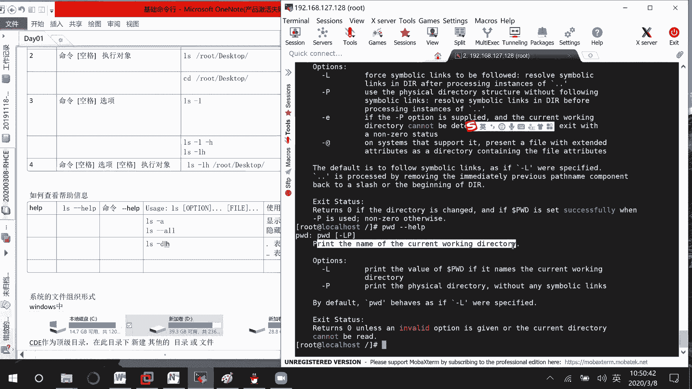

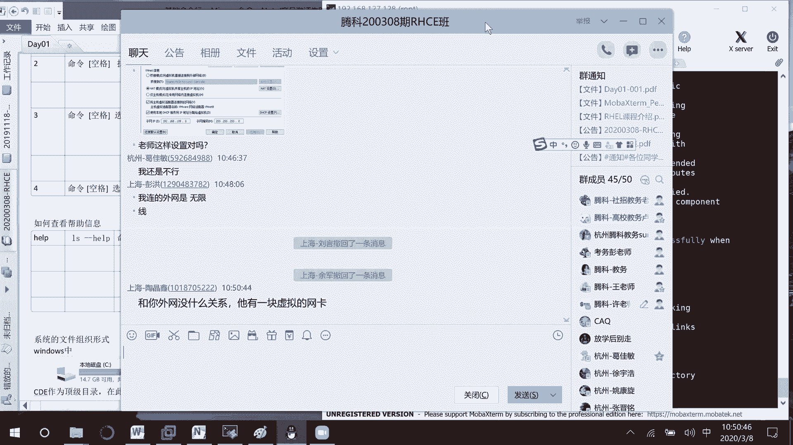

在本节课中，我们将学习Linux命令行环境下的基本操作，包括如何获取命令帮助、使用常用快捷键、理解Linux文件系统目录结构以及掌握基础的文本文件查看与操作命令。

## 获取命令帮助

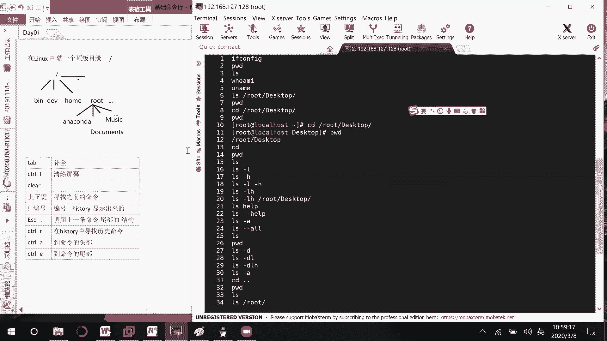

上一节我们介绍了基本的命令行操作，本节中我们来看看如何获取命令的帮助信息。在Linux中，有多种方式可以查看命令的用法和说明。

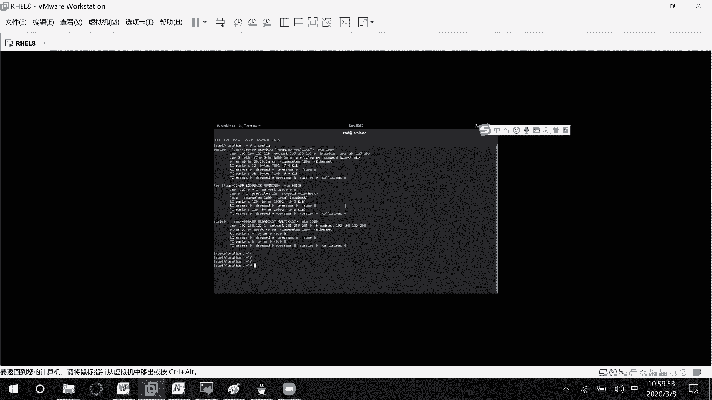

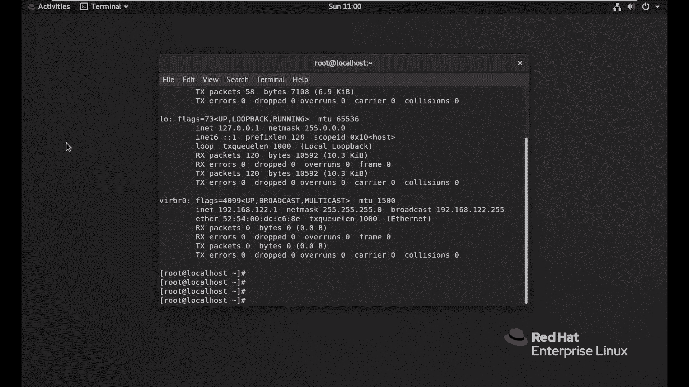

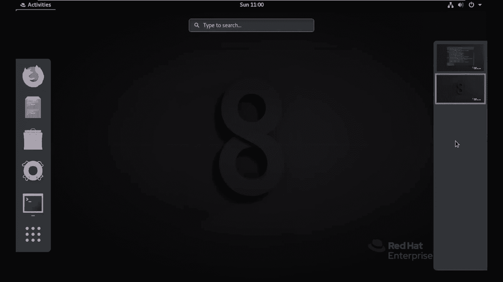

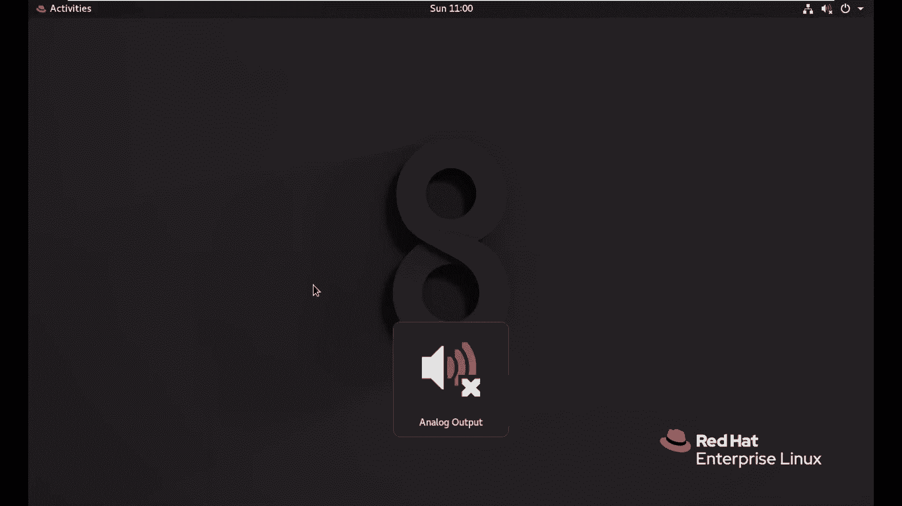

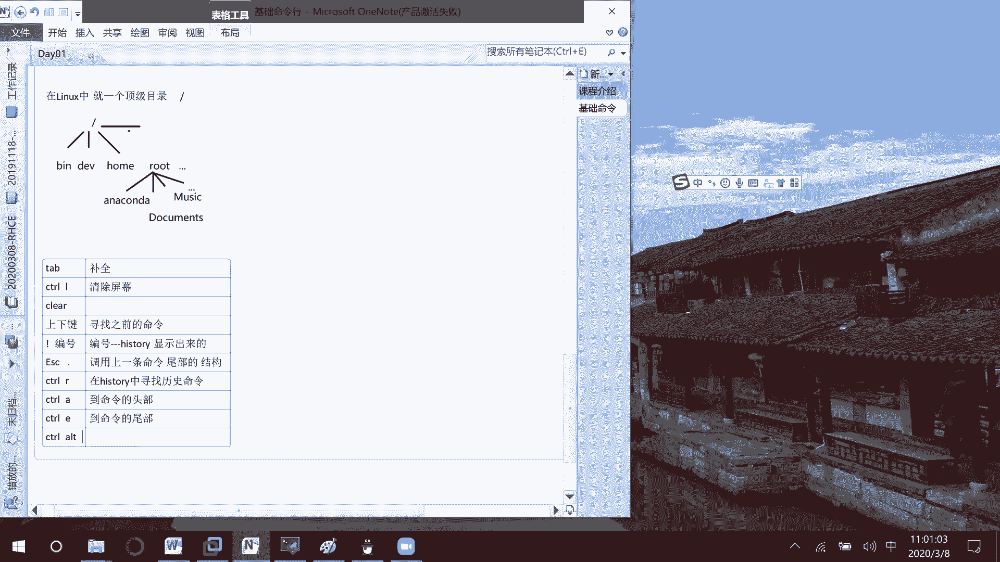

以下是三种主要的帮助查看方式：

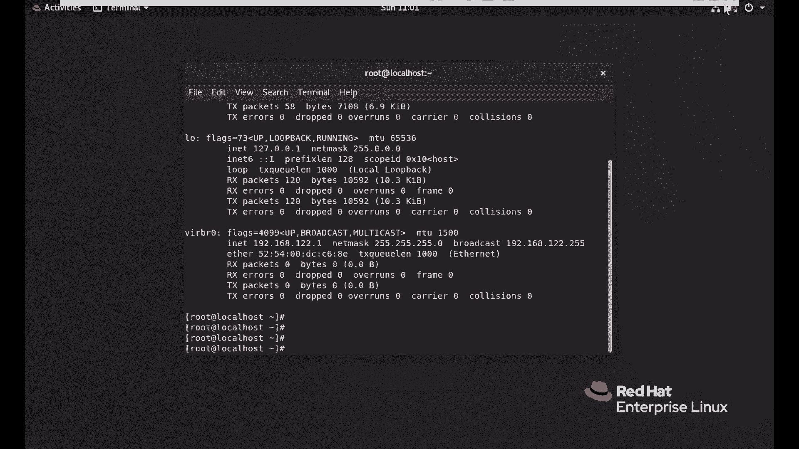

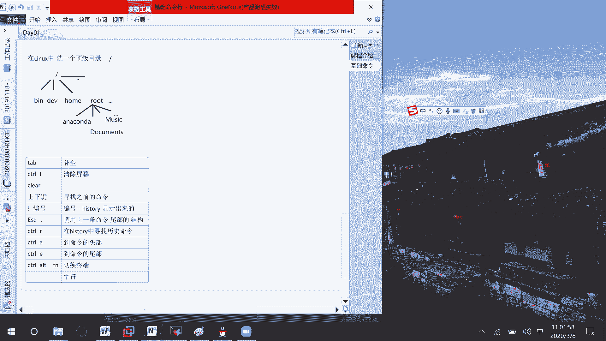

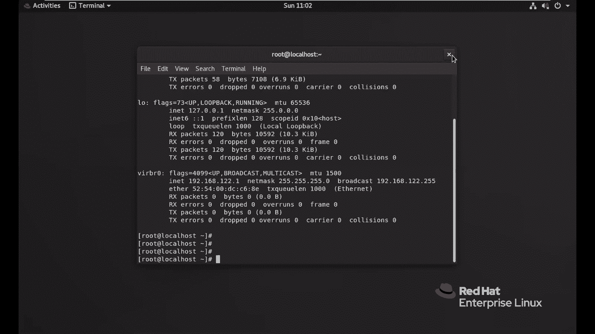

*   **`--help` 选项**：大多数命令都支持此选项，用于显示简短的帮助信息。
    *   示例：`pwd --help`
*   **`man` 命令**：提供最完整、最详细的命令手册。
    *   格式：`man [命令名]`
    *   示例：`man ls`
    *   操作：按 `空格键` 翻页，按 `q` 键退出。
*   **`info` 命令**：另一种帮助文档格式，信息同样详尽。
    *   格式：`info [命令名]`
    *   示例：`info ls`
    *   操作：按 `空格键` 翻页，按 `q` 键退出。

## 常用命令行快捷键

了解了如何获取帮助后，熟练使用快捷键能极大提升命令行操作效率。

以下是几个核心的快捷键：

*   **`Tab` 键**：命令或路径补全。
*   **`Ctrl + l` 或 `clear` 命令**：清空当前终端屏幕。
*   **上下方向键**：翻阅命令历史记录。
*   **`!` + 编号**：执行历史记录中指定编号的命令。
    *   示例：`!20` 执行 `history` 列表中第20条命令。
*   **`Esc + .`**：调用上一条命令的最后一个参数。
*   **`Ctrl + r`**：在历史命令中反向搜索。
*   **`Ctrl + a`**：将光标移动到命令行的开头。
*   **`Ctrl + e`**：将光标移动到命令行的结尾。

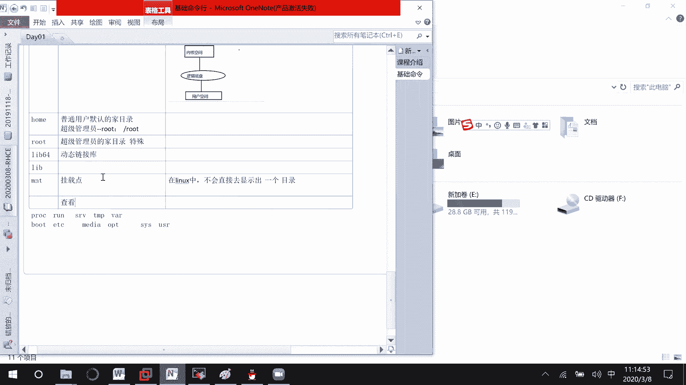

## Linux文件系统目录结构

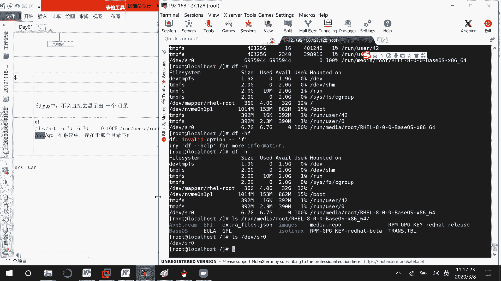

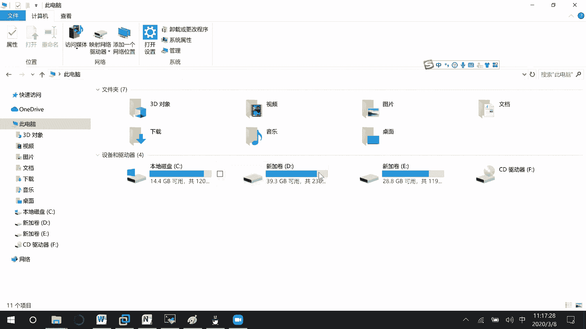

Linux的文件系统采用一种层次化的树状目录结构，所有文件和目录都从根目录 `/` 开始。理解每个目录的用途是进行系统管理和故障排查的基础。

以下是主要目录及其功能的说明：

*   **`/bin` 与 `/sbin`**：存放系统最基本的命令。`/sbin` 下的命令通常需要管理员权限才能执行。
*   **`/dev`**：存放设备文件。在Linux中，硬件设备（如硬盘、U盘）都被抽象为文件，通过此目录进行访问。这体现了Linux **内核空间**（管理物理硬件）与 **用户空间**（提供逻辑接口）的分离思想。
*   **`/home`**：普通用户的**家目录**。每个用户在此目录下拥有一个以自己用户名命名的子目录，用于存放个人文件和配置。
    *   超级管理员 `root` 的家目录比较特殊，位于 `/root`。
*   **`/lib` 与 `/lib64`**：存放系统运行时所需的**共享库文件**（类似Windows的DLL文件）。`/lib64` 专用于64位系统。
*   **`/mnt` 与 `/media`**：**挂载点**目录。用于临时挂载文件系统，如U盘、光盘或网络驱动器。`/media` 是系统自动挂载可移动媒体的默认位置。
    *   使用 `df -h` 命令可以查看所有已挂载的文件系统及其使用情况。
*   **`/proc`**：一个虚拟文件系统，存放当前**内核与进程状态**的映射文件。查看或修改这些文件可以获取系统信息或调整内核参数。
    *   示例：`cat /proc/cpuinfo` 查看CPU信息。
*   **`/run`**：存储系统启动以来的运行时信息，如进程ID文件、锁文件等。也是现代Linux系统自动挂载设备的默认位置之一。
*   **`/tmp`**：**临时文件**目录。所有用户都可读写，系统可能会定期清理此目录下的文件。
*   **`/var`**：存放经常变化的**可变数据**，如日志文件 (`/var/log`)、邮件队列、缓存数据等。
*   **`/boot`**：存放**系统引导文件**，如内核镜像、引导加载程序（GRUB）配置文件。此目录内容至关重要，误删可能导致系统无法启动。
*   **`/etc`**：存放系统和应用程序的**配置文件**。大多数服务的配置都位于此目录下，格式通常为 `/etc/[服务名]`。
    *   示例：`/etc/ssh/sshd_config` 是SSH服务的配置文件。
*   **`/opt`**：用于安装**第三方可选应用程序**。当手动编译安装软件时，常指定安装到此目录。
*   **`/usr`**：存放系统**用户应用程序和文件**，类似于Windows的 `Program Files` 目录。包含二进制文件、库文件、文档等。
*   **`/sys`**：另一个虚拟文件系统，用于暴露**内核设备、驱动和系统特性的信息**，常用于系统高级调优。

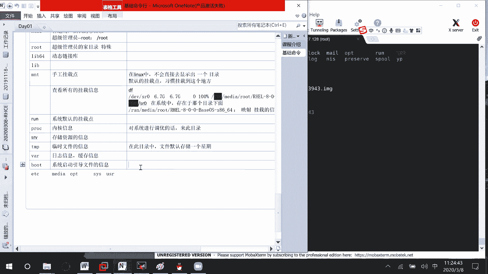

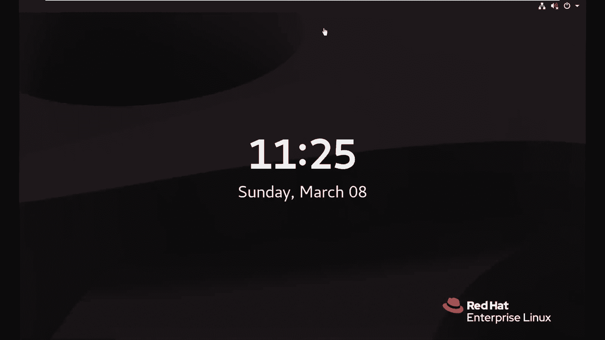

## 文件查看与基本操作

现在我们已经熟悉了文件系统的布局，接下来学习如何查看和操作其中的文件。

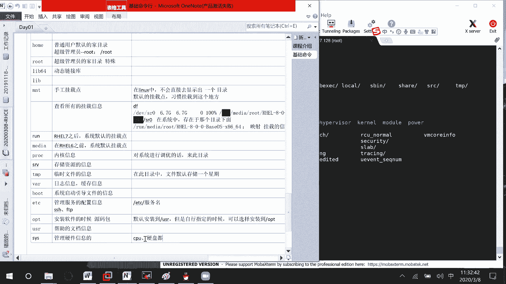

### 查看文件内容

有多种命令可用于查看文件，适用于不同场景。

以下是常用的文件查看命令：

*   **`cat`**：连接文件并打印到标准输出，适合查看**内容较少**的文本文件。
    *   格式：`cat [文件名]`
*   **`more`**：分屏显示文件内容，适合查看**内容较多**的文件。按 `空格键` 向下翻页，按 `回车键` 向下翻行，按 `q` 键退出。
    *   格式：`more [文件名]`
*   **`less`**：功能比 `more` 更强大，支持上下翻页、搜索等。操作同 `more`，是查看大文件的推荐工具。
    *   格式：`less [文件名]`
*   **`head`**：显示文件**开头**的若干行，默认显示10行。
    *   格式：`head -n [行数] [文件名]`
    *   示例：`head -5 /etc/passwd` 查看 `/etc/passwd` 文件的前5行。
*   **`tail`**：显示文件**末尾**的若干行，默认显示10行。常用于实时查看日志（`tail -f [日志文件]`）。
    *   格式：`tail -n [行数] [文件名]`
    *   示例：`tail -3 /var/log/messages` 查看日志文件的最后3行。

### 复制、移动与统计文件

*   **复制文件 (`cp`)**：创建文件的副本。
    *   格式：`cp [源文件] [目标文件或目录]`
    *   示例：`cp /etc/passwd /tmp/` 将文件复制到 `/tmp` 目录，保持原名。
    *   示例：`cp file1.txt file2.txt` 复制 `file1.txt` 并命名为 `file2.txt`。
*   **移动/重命名文件 (`mv`)**：移动文件到新位置，或为文件重命名。**操作后，源文件将不存在于原位置。**
    *   格式：`mv [源文件] [目标文件或目录]`
    *   示例：`mv oldname.txt newname.txt` 将文件重命名。
    *   示例：`mv file.txt /home/user/` 将文件移动到指定目录。
*   **统计文件信息 (`wc`)**：计算文件的行数、单词数和字符数。
    *   格式：`wc [选项] [文件名]`
    *   常用选项：
        *   `-l`：统计行数。
        *   `-w`：统计单词数。
        *   `-c`：统计字符数。
    *   示例：`wc -l /etc/passwd` 统计 `/etc/passwd` 文件的行数。

## 总结

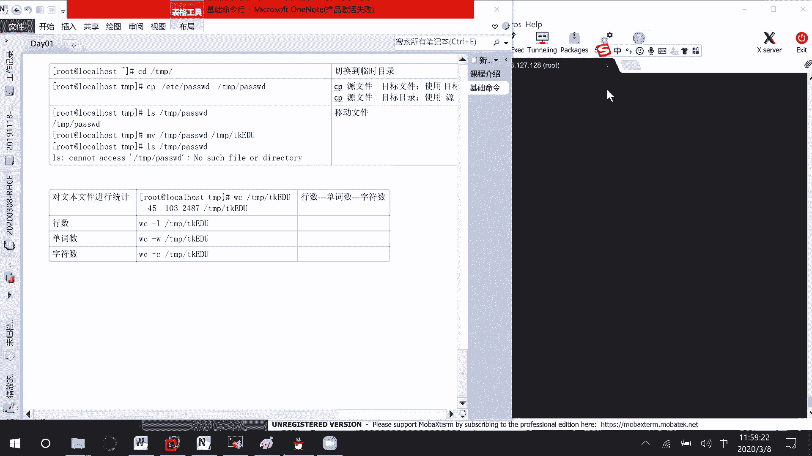

本节课中我们一起学习了Linux命令行的核心基础。我们掌握了如何通过 `--help`、`man` 和 `info` 获取命令帮助，熟悉了提升效率的快捷键，并深入了解了Linux文件系统各主要目录的职责。最后，我们学会了使用 `cat`、`more`、`less`、`head`、`tail` 查看文件，以及使用 `cp`、`mv`、`wc` 进行文件复制、移动和统计。这些是后续所有Linux学习和系统管理工作的基石，请务必熟练掌握。