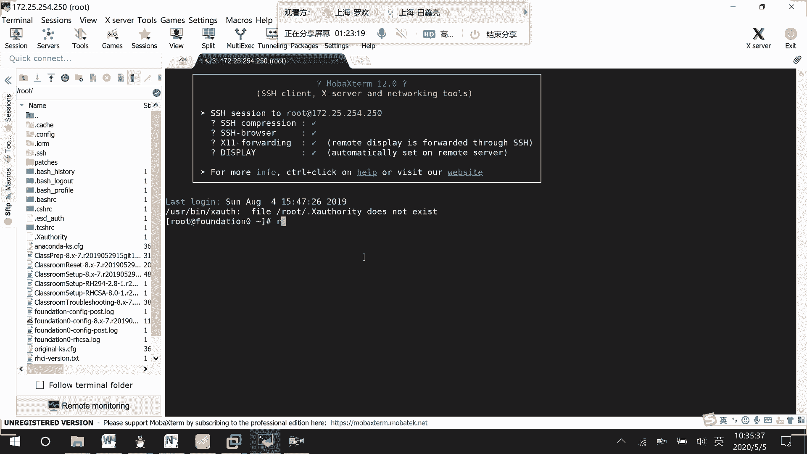
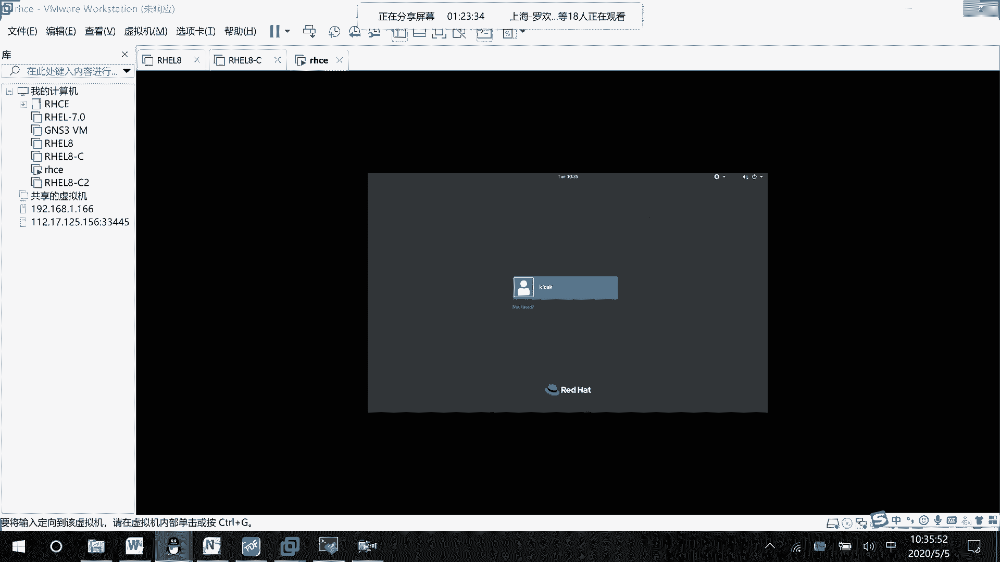
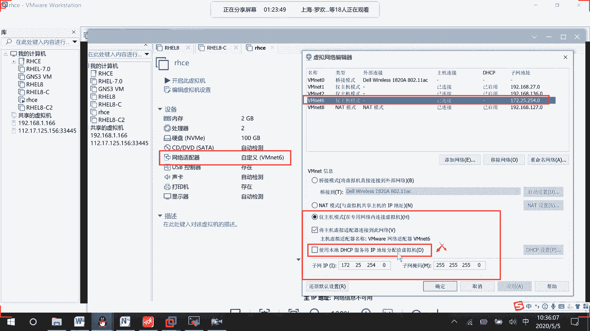
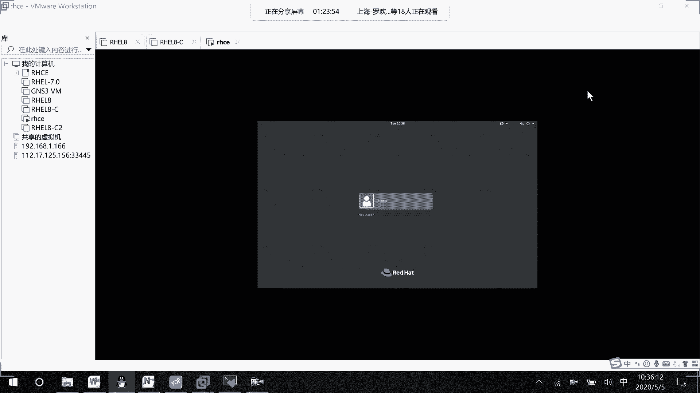
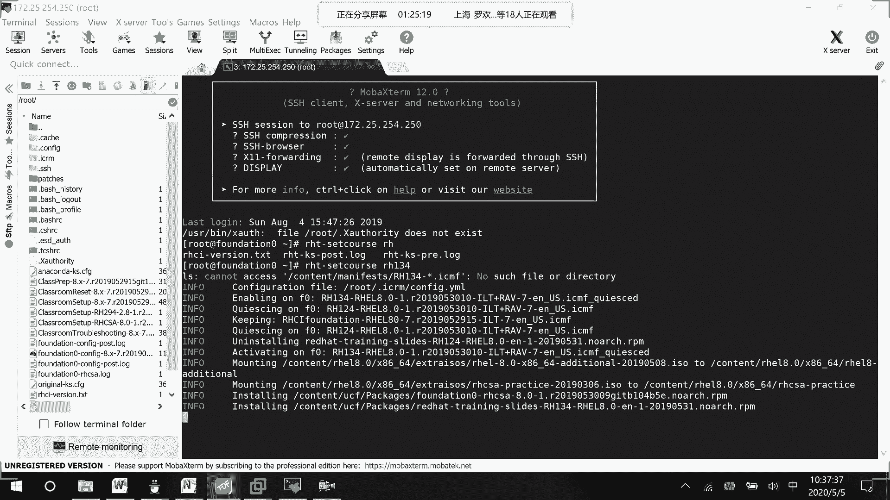
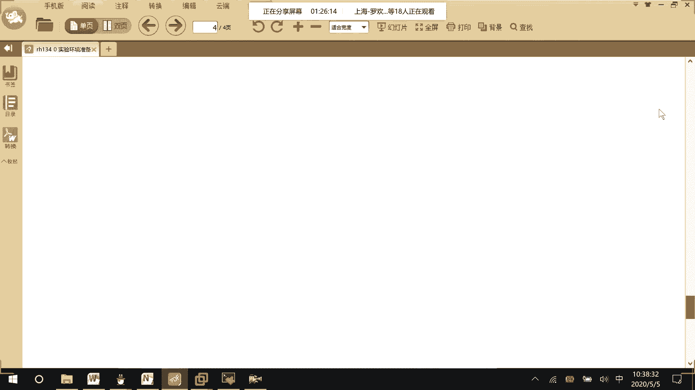
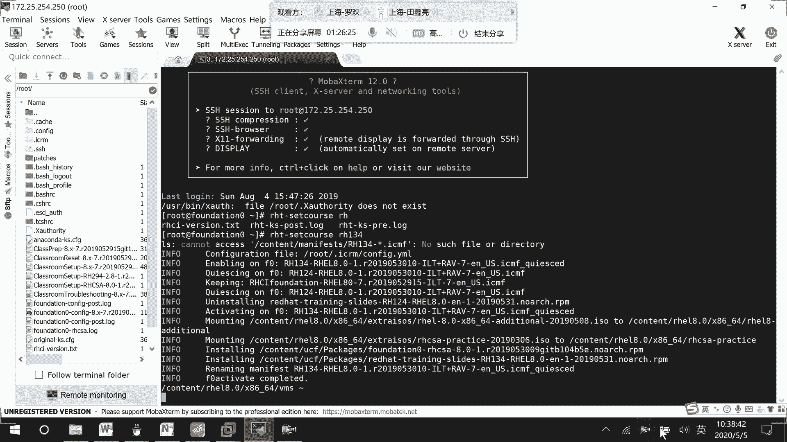
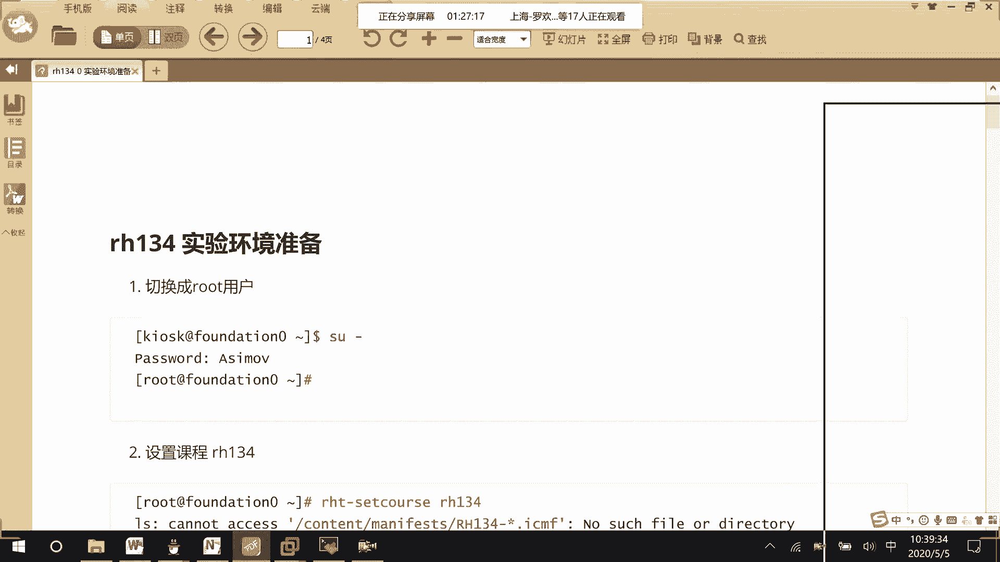
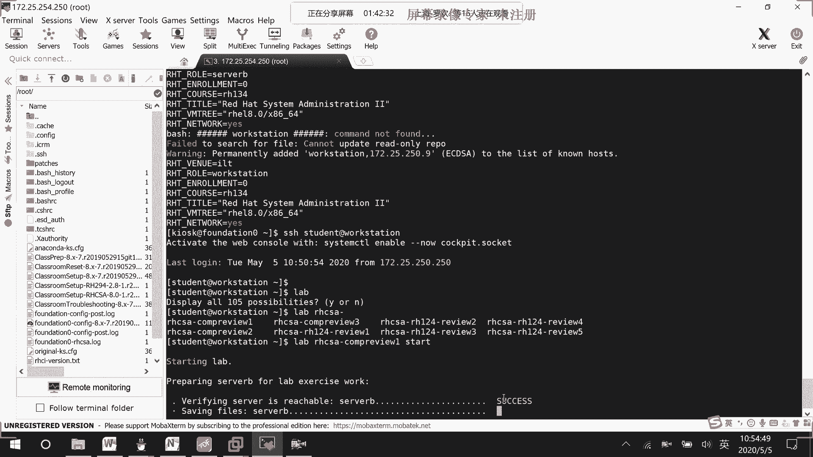

# 01 RHCE8.0视频教程【45课时】 - P32：20200505-RHCE-02_recv - 六竹书生6682 - BV1m84y1f7ss

现在我们要去做134的一个实验，对不对，环境怎么开的话呢，不知道啊。

这边跟大家去说一下嗯，为了方便的话呢，因为我们这个环境是不是让大家设到了，vm net6的一个网络当中去，我这比较慢哈，所以这里的话呢建议大家VMV。

虚拟机的一个配置可以这样子，首先虚拟机是VR net6，你去创建一个VR net6的警主机模式，网段1722254。0DHCP把它给关了。

野马是这个24位的。

接下去远程工具当中的话呢，去对172。2，5。254。250去进行一个连接就可以了，密码的话呢大家都是知道的对吧，ASIMOV嘛，然后这边连接上去了之后呢，我们134的环境怎么去开呢，第一步HT。

我们就说是134嘛，回车，他就去进行一个设置，如果后续我们要去开二九式的，就是呃HT set coh，294就可以了，上面第一个呢cannot access不用去管它，下面这边的话呢。

它就在进行一些环境的一个预设，预设去加载一些配置信息嘛，好吧，加载完了之后的话呢，我们等一下就可以去开启呃，就是说去开启我们的classroom啊，然后的话呢就说先把它给移除掉。

stop掉再remove一下嘛，实验手册里面的话呢，有发给你吗，我，等一下她这边要稍微慢一点。

前面这一步，你们跟着就说要敲那个134的命令，然后接下去的话，其实这边我是一步一步去截的哈，你看如果说把环境开好之后，这边验证可以不用去做的，主要是看一下里面是不是134就行了。

接下来要做的事情是不是就退出root，用KISK的话呢，去关闭classroom，移除classroom，classroom就考关机的一个环境嘛，然后这边的话呢重新开始，他重新去拉134的一个环境的。

然后接下去把其他的所有设备给移除掉，然后重新去拉，把所有的设备拉过来，好了之后的话呢，就可以去做群里面的题目了吗，让大家就说把复习一的环境给他去重置一下，对不对，重置完毕了之后呢。

我们就可以开始去做题了吗，说明里面就说怎么样去做题的一个过程，环境应该没有问题了吧对吧。

然后这边的话呢把这个环境我把它给设置好了。

之后呢，下面一步就是说要去对class room的环境的话，去进行一个操作，这边先把我们的classroom的话呢给移除掉，Ht bm ctrl，这边的话呢stop掉classroom。

然后这边的话呢再去把classroom给remove掉，然后下面这边的话呢再开启它，会去进行一个拉取信息，拉取我们的镜像的一个信息嘛，然后这个时候拉取过来了之后，就进行一个开机，开机完毕了之后呢。

好下面这里我们要去移除其他的所有设备，因为我们的话呢classroom是我们那个考客户，考官机嘛，环境嘛，那下面的话呢是不是要有我们的工作台，还有一个就是管理的一个服务器啊，在这里remove。

把其他的所有都我们的classroom先启动起来，估计现在没有这么快吧，Classroom，拼不通等先聘通先吧，估计还没起到，等他启动了，先，应该还没启动，那些估计他也拉取不了，这是，这卡在这儿诶。

再拉，然后这个时候的话呢在进行拉取的时候，你就等待就好了，他会这个就是我们的网关设备，这边的话呢就是134的网关嘛，BDA第一个硬盘什么的，他把所有的信息给拉取下来就可以了，好吧，这样子环境就启动了。

到时候我们就可以去做练习了，这边的话呢就是说等你的一个设备都开启了，就是说这边的话呢全都start all好了之后呢，你稍微等待一下，等待一下了之后的话呢，你在SSH到workstation就可以了。

接下去的话呢我们要做的一件事情，就是开启我们的，就是说去重置我们的一个环境嘛，那这边的一个重置的话呢，就是说lab h c s a，然后呢叫做compress a com p r e。

V i e w e start，这个诶，我看一下HT costs not set，这边说没有设置，等一下这边的话呢，刚才我在进行一个获取的时候，这边好像就说去报错了对吧，说什么cos的话呢。

就没有去设置，然后这边我就退到了KISOK，这边的话呢去对所有的设备去进行了一个登录，看一下的话这个配置文件有没有，然后这边我怀疑的话呢，是不是有些设备刚才还没有启动成功嘛，启动成，然后好了之后呢。

我这边就再退出到一个呃连接到的workstation当中，以student，然后呢现在要去重置一下我的环境，Lab hcc compress，Start，这个时候的话呢他就去给我们做环境了。

这边做完环境之后呢，我们就可以去进行一个练习了。

能明白吧。