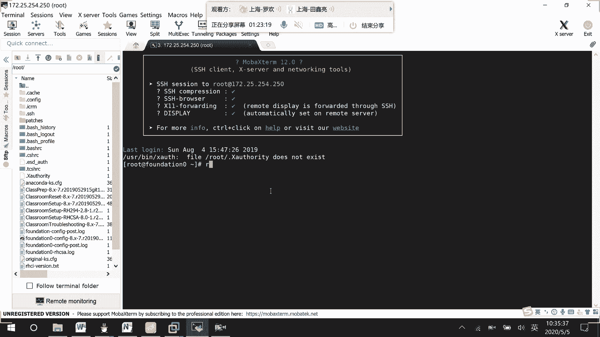
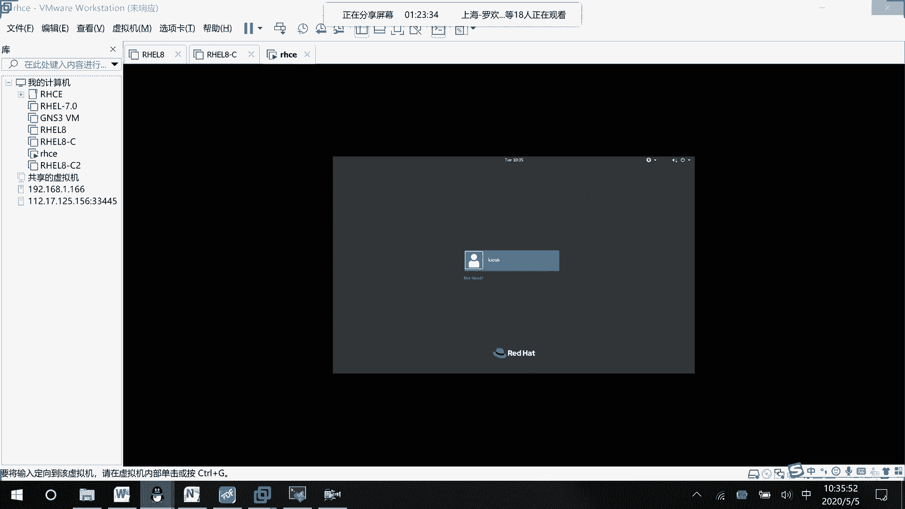
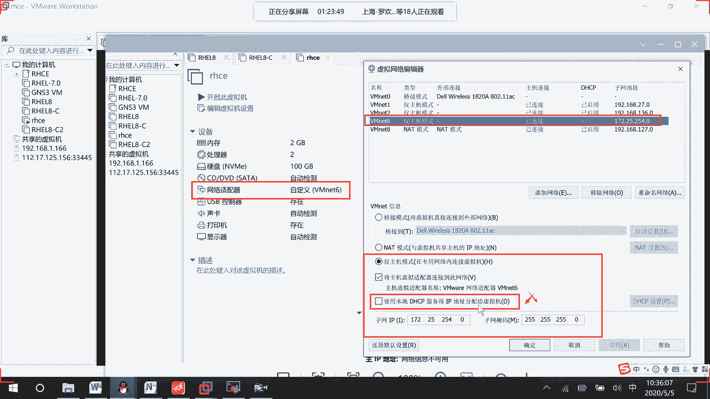
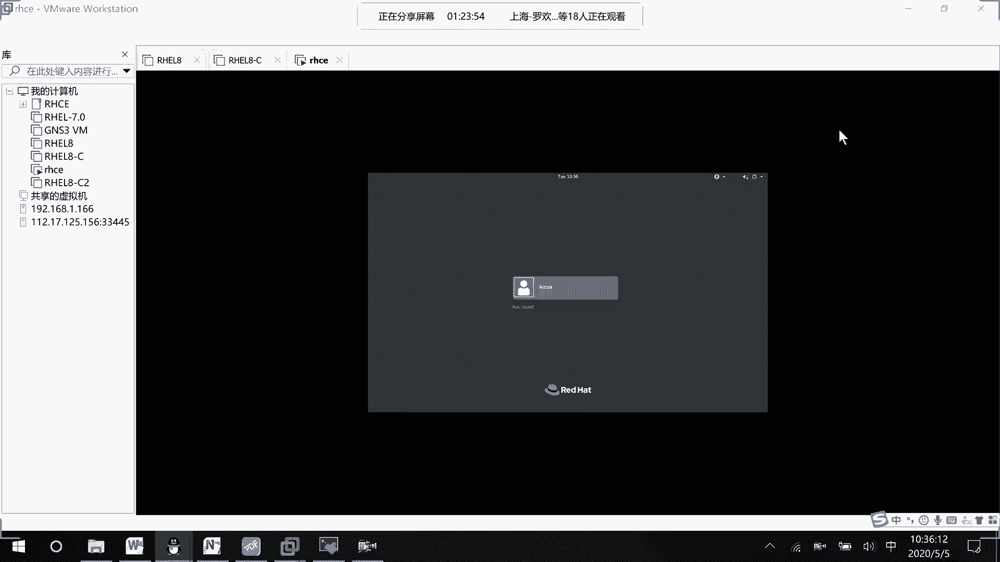
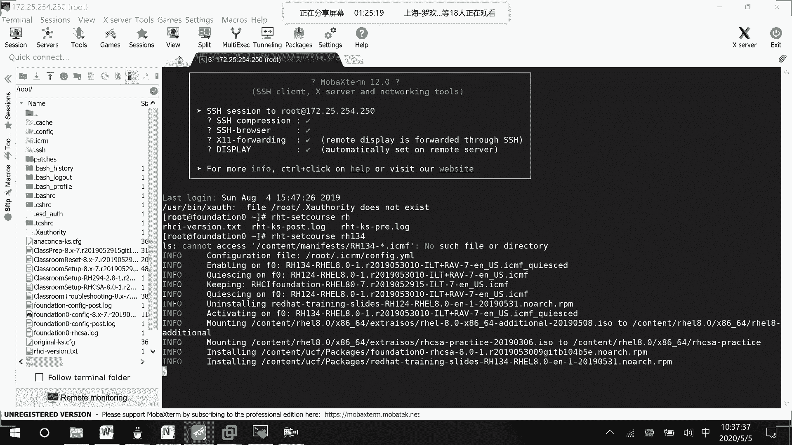
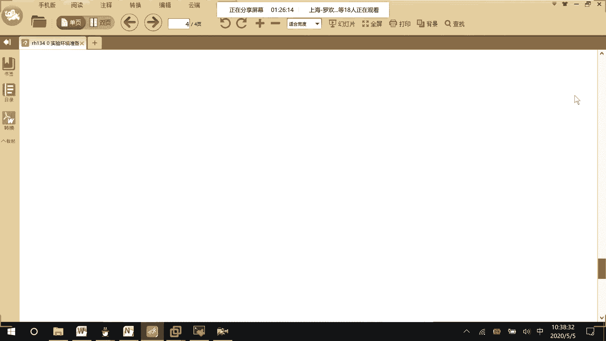
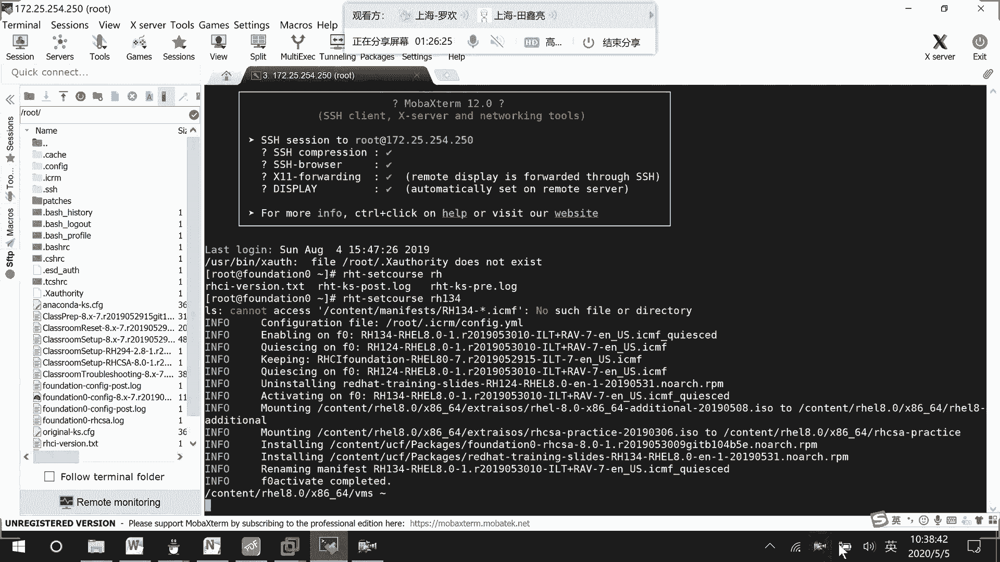
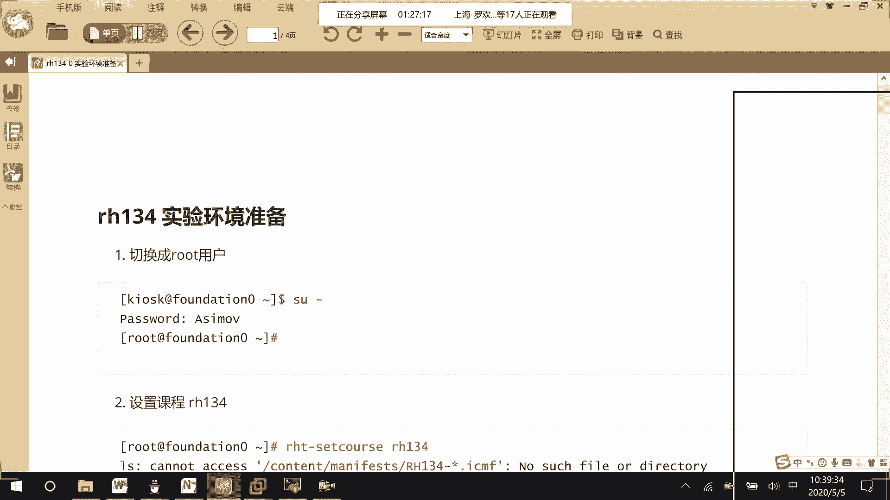
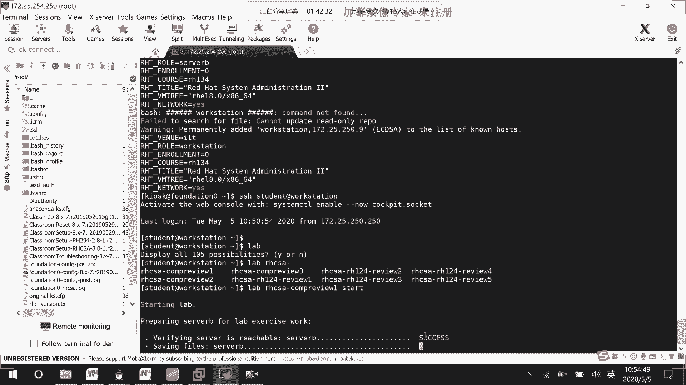

# RHCE 8.0 实验环境配置教程：01：实验环境初始化与重置 🛠️





在本节课中，我们将学习如何为RHCE 8.0的实验配置和初始化一个特定的实验环境（134号实验）。这个过程包括设置虚拟机网络、启动实验平台、重置环境等关键步骤。



## 环境网络配置



上一节我们介绍了课程背景，本节中我们来看看如何配置基础网络环境。为了方便实验，我们需要将虚拟机配置在VMnet6网络中。

以下是具体的网络配置步骤：
*   创建一个名为VMnet6的仅主机模式虚拟网络。
*   设置网段为 `172.25.254.0`。
*   将子网掩码设置为24位（`255.255.255.0`）。
*   关闭该网络的DHCP服务。

配置完成后，使用远程连接工具（如SSH）连接到地址 `172.25.254.250`，密码为 `ASIMOV`。



## 启动指定实验环境

网络连接成功后，下一步是启动特定的实验环境。我们将以启动134号实验环境为例。

在远程终端中，输入命令 `lab reset 134` 并回车。系统将开始加载134号实验的预设配置信息。此过程可能会提示“cannot access”，这属于正常现象，无需处理。加载完成后，环境即准备就绪。



## 重置与准备实验平台





环境加载后，我们需要对实验平台（classroom）进行操作，以确保环境干净并符合实验要求。

首先，我们需要停止并移除当前的classroom环境。在终端中执行以下命令：
```bash
lab stop classroom
lab remove classroom
```

接着，重新启动classroom环境以拉取134实验所需的镜像和配置信息：
```bash
lab start classroom
```

等待classroom完全启动并可以ping通后，移除所有其他实验设备，然后一次性启动所有设备：
```bash
lab remove all
lab start all
```

## 执行环境重置脚本

所有设备启动后，稍作等待，然后以 `student` 用户身份SSH登录到 `workstation` 主机。

登录后，执行环境重置脚本，为开始实验题目做准备。运行以下命令：
```bash
lab hcsa compress start
```

该命令将自动完成实验环境的最终设置。如果遇到“cost not set”等报错，通常是因为某些设备尚未完全启动，请等待片刻后重试。脚本执行成功后，实验环境即配置完毕，可以开始进行练习。

## 总结



本节课中我们一起学习了RHCE 8.0实验环境的完整初始化流程。我们首先配置了VMnet6虚拟网络，然后通过特定命令启动了134号实验环境，接着对classroom平台进行了重置和重启，最后通过执行 `lab hcsa compress start` 脚本完成了环境的最终准备。掌握这个流程是顺利进行后续所有实验的基础。