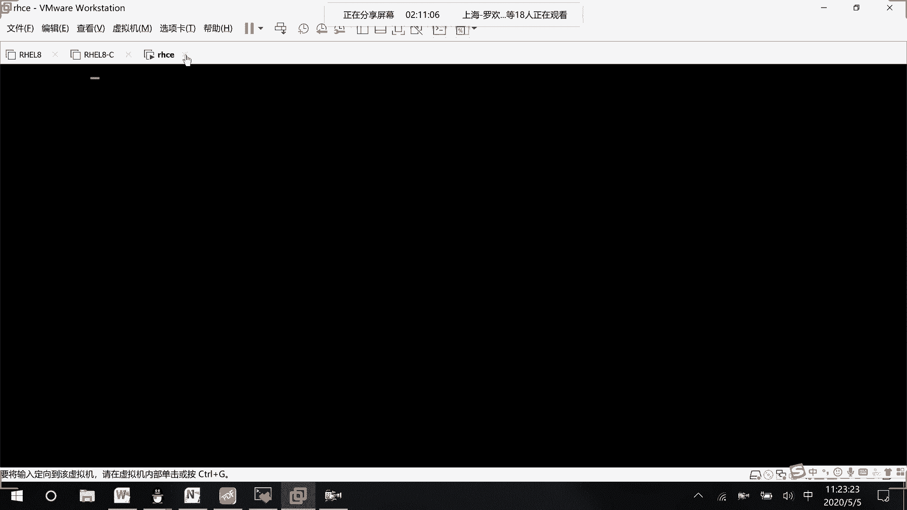
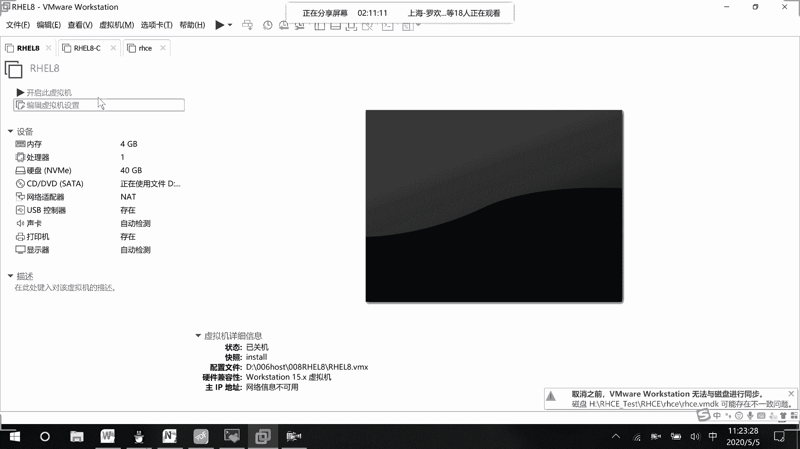
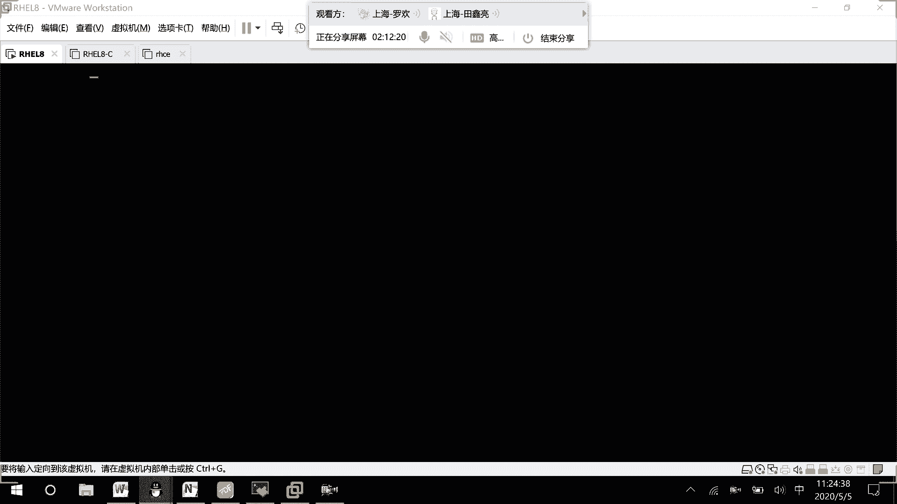
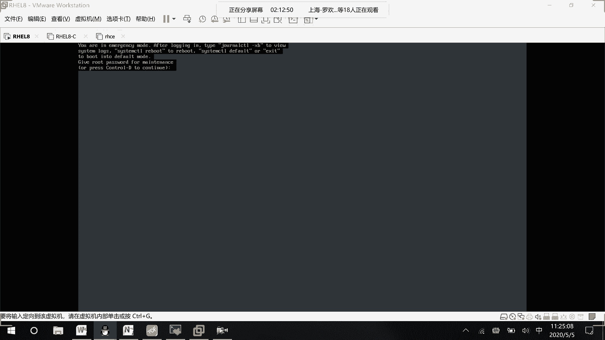
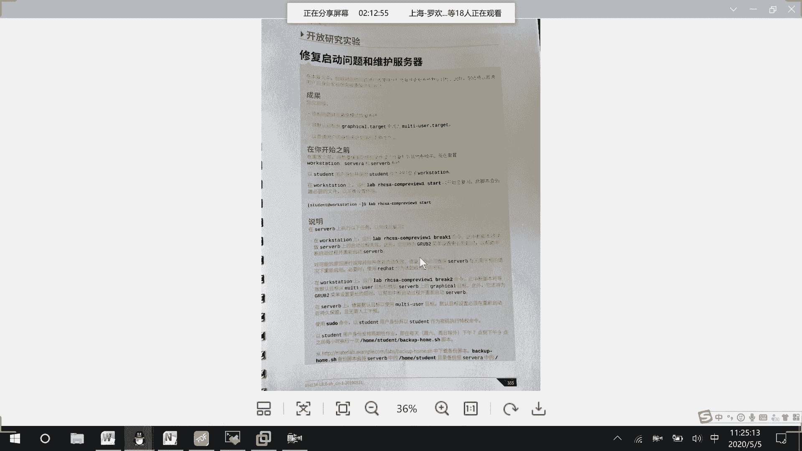
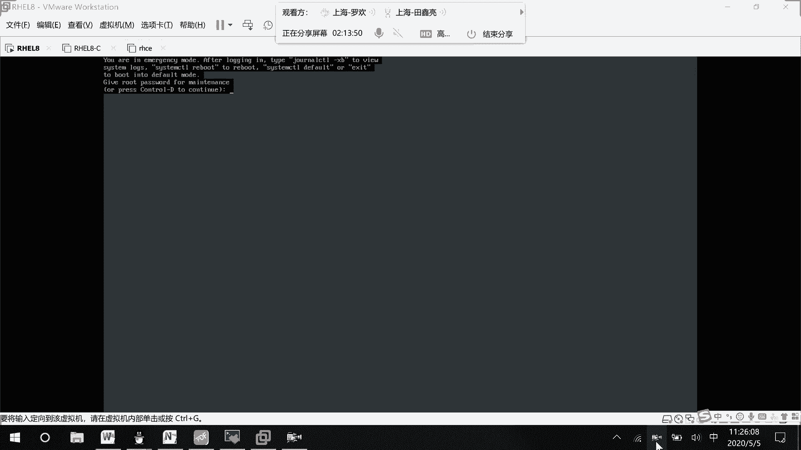

# RHCE8.0视频教程：P33：系统故障排除与恢复



在本节课中，我们将学习如何在虚拟机环境下处理系统启动故障，特别是当无法从光盘启动时，如何通过修改内核启动参数进入紧急救援模式，并解决常见的系统配置问题。



上一节我们介绍了系统启动的基本流程，本节中我们来看看当系统启动遇到问题时，如何进行手动干预和故障排除。

## 进入紧急救援模式

在虚拟机环境中，若无法从光盘启动，可通过修改内核启动参数临时进入紧急救援模式。以下是具体操作步骤：

1.  在系统启动的GRUB菜单界面，选中需要启动的内核条目。
2.  按下键盘上的 `E` 键进入编辑模式。
3.  找到以 `linux` 开头的那一行，在该行末尾添加以下参数：
    ```
    system.unit=emergency
    ```
4.  按下 `Ctrl + X` 组合键，使用修改后的参数启动系统。



系统随后将进入紧急救援模式。在此模式下，你可以使用 `root` 用户名和密码登录，开始进行系统恢复操作。

## 常见故障与解决方案



进入救援模式后，你可能会遇到多种系统配置错误。以下是几个典型的故障场景及其解决方法：



**故障一：文件系统挂载错误**
此故障通常由 `/etc/fstab` 文件配置错误引起。系统会中断启动过程并提示你检查问题。你需要编辑 `/etc/fstab` 文件，将出错的行注释掉或修正。

**故障二：默认运行级别设置**
系统可能默认进入非图形化的多用户登录模式。若需要切换到图形界面，你需要修改系统的默认运行级别或目标。

**故障三：sudo权限配置**
你可能会遇到普通用户无法使用 `sudo` 命令执行管理员操作的问题。这需要检查并正确配置 `/etc/sudoers` 文件中的用户权限。

**故障四：计划任务配置**
系统可能因错误的计划任务（cron job）配置而导致问题。你需要检查 `/etc/crontab` 文件或用户个人的cron任务，并修正其中的错误命令或时间设置。



本节课中我们一起学习了在RHCE环境下应对系统启动故障的方法。我们掌握了通过修改内核参数进入紧急救援模式的关键步骤，并了解了处理文件系统挂载错误、运行级别设置、sudo权限以及计划任务配置等常见问题的基本思路。这些技能是系统管理员进行故障诊断和恢复的重要基础。