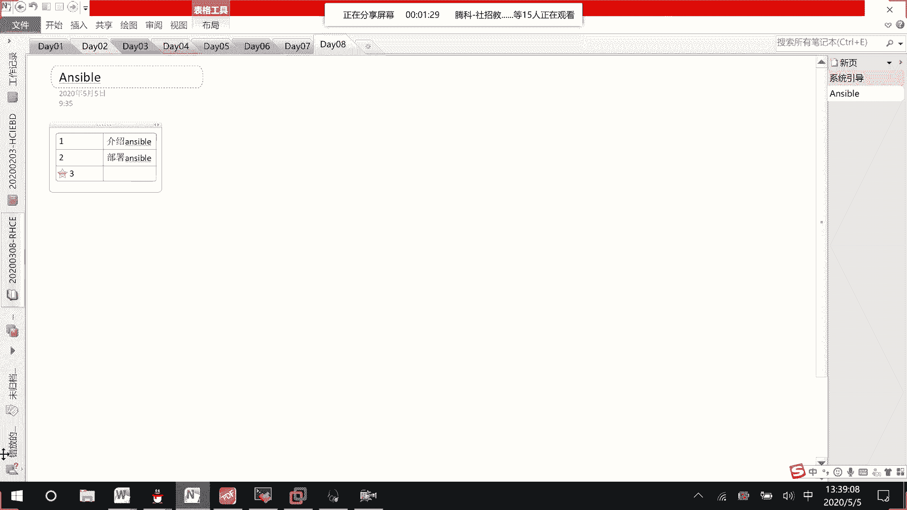
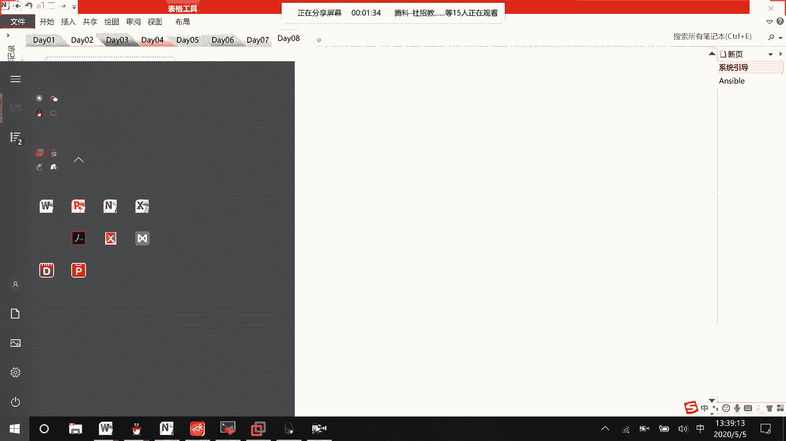
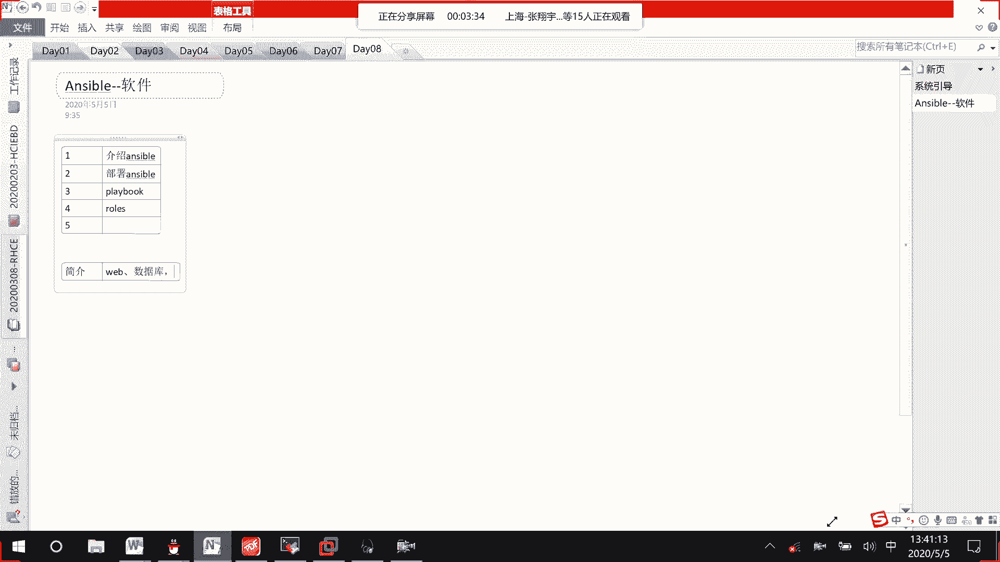

# RHCE8.0 视频教程：01：Ansible 简介与课程概述 🚀

在本节课中，我们将要学习 Ansible 自动化运维工具的基础知识，了解它在 RHCE 8.0 课程中的重要性，并预览整个课程的学习路径。

## 课程概述

Ansible 是 RHCE 8.0 版本中新增的核心内容，与之前的 RHEL 7 版本有显著区别。它原本是 RHCA 认证中的一门课程，现已独立成为一门编号为 294 的课程，并纳入 RHCE 的考核范围。

## 课程内容简介



以下是本课程将要学习的核心内容：



1.  **Ansible 简介**：介绍 Ansible 的作用及其管理其他主机的方式。
2.  **部署 Ansible**：学习如何安装和配置 Ansible 软件。
3.  **编写 Playbook**：学习编写自动化脚本（Playbook），类似于之前学习的 Shell 脚本，用于批量执行任务，避免重复输入命令。
4.  **变量与 Fact**：学习如何在 Ansible 中使用变量和收集系统信息（Facts）。
5.  **高级任务管理**：学习任务控制、文件管理、大型项目管理以及角色（Roles）的编写。角色用于将多个 Playbook 按逻辑组合起来。
6.  **故障排除**：学习如何诊断和解决 Ansible 运行中出现的故障，这与 RHCE 课程最后的故障排除环节类似。

## Ansible 简介

上一节我们介绍了课程大纲，本节中我们来看看 Ansible 到底是什么。

Ansible 是一款自动化运维软件。它采用控制器（Controller）管理节点（Node）的架构。通过 Ansible，我们可以高效地管理 Web 应用、数据库以及各类自研软件。

例如，当需要在数十甚至上百台设备上对某个软件进行定期升级时，手动操作会非常繁琐。Ansible 的 Playbook 功能可以将这些操作编写成可重复执行的自动化脚本，极大地提升了运维效率。


其核心架构可以概括为：一个 **Ansible 控制器** 管理多个 **被控节点**。


虽然可以通过逐条发送命令来控制节点，但这种方式无法复用。如果需要执行大量命令，复制粘贴或重复输入会非常麻烦。因此，我们需要编写 **Playbook**。

一个简单的 Playbook 示例结构如下：
```yaml
---
- name: 确保软件包已安装
  hosts: all
  tasks:
    - name: 安装 nginx
      yum:
        name: nginx
        state: present
```

## 总结



本节课中我们一起学习了 Ansible 在 RHCE 8.0 中的定位、完整的课程学习路径以及 Ansible 的基本概念和作用。我们了解到 Ansible 通过编写 Playbook 来实现自动化运维，能够有效管理大量服务器，是现代化运维中不可或缺的工具。