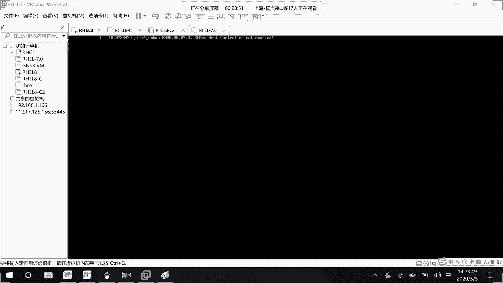
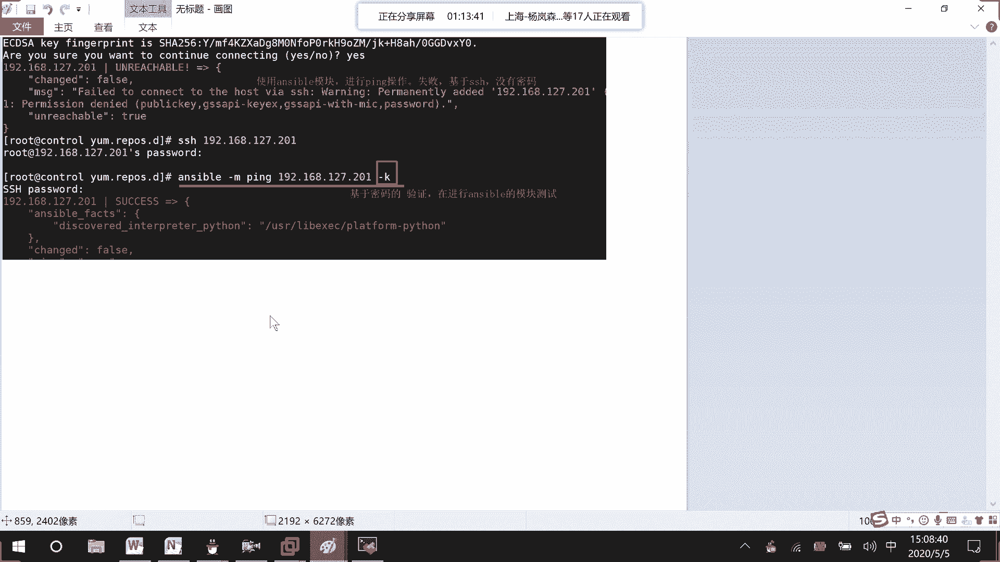
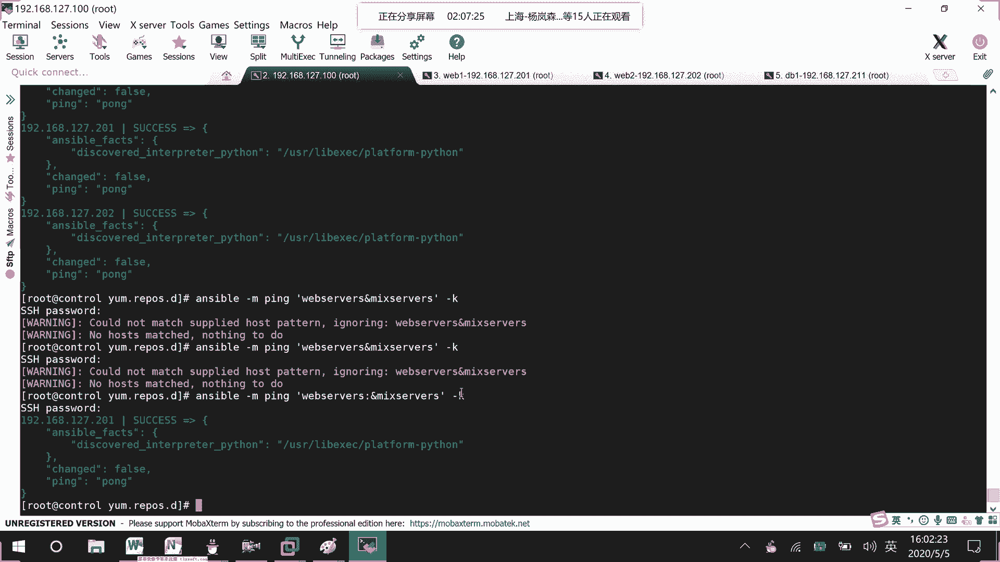
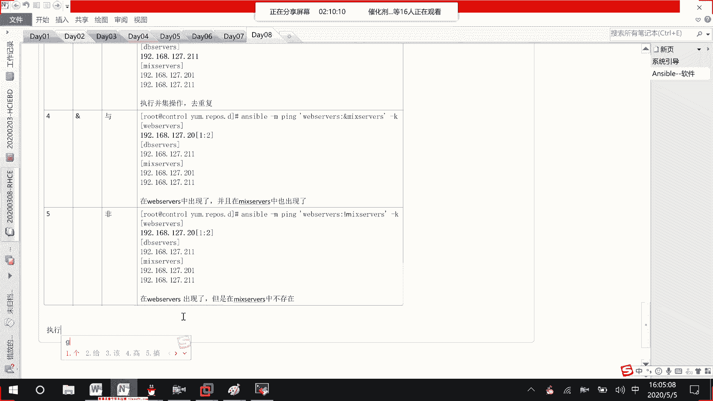
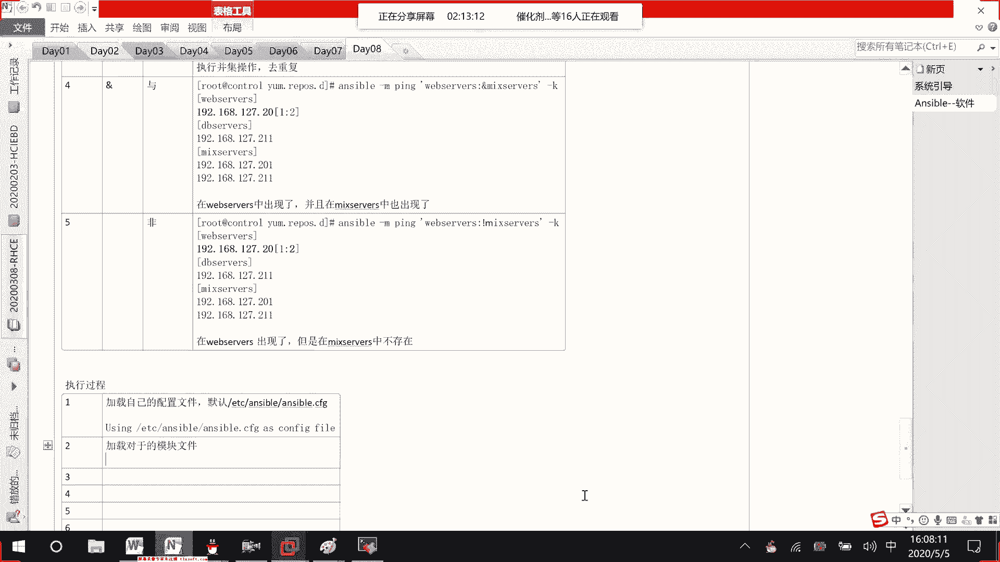
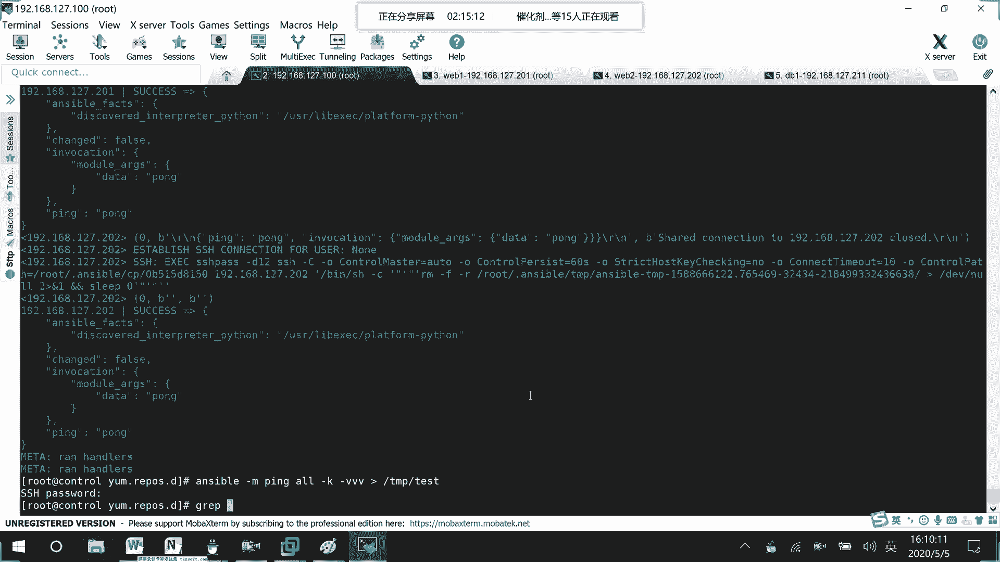

# 01 RHCE8.0视频教程【45课时】 - P35：20200505-RHCE-05_recv - 六竹书生6682 - BV1m84y1f7ss

然后这边就是说我们要来讲这个ible的一个简介。它的话呢就是说是可以去对web啊数据库啊去进行一个管理嘛。如果说只有一台设备的话呢，那你就是说登录到那台设备去进行更新就可以了。

如果说在有一个10台或者100台的一个设备，你去一台一台去进行更新的话呢，是不是就不太合理啊，那我们就需要借助一些呃运维的一个产品嘛，这边的话呢，我们接触到的就是一个ible。看掉。像这种。

这个aner的话呢，它是2012年3月9号吧，有一个第一个版本，后面的话呢就是说被红帽收购嘛，他这最最终被确认收购是2015年10月17号是被红帽收购的。这款工具我没记错的话呢。

好像是红贸的一个内部员工，他自己去开发的。后后面的话呢，就是说又又卖给了红帽公司嘛。它这个的话呢anible它这个是基于python的开发的一个工具。在我们国内的话呢，用的还是比较多的。

因为我们国内的人对python还是比较了解的嘛，可以对这个ansible的话呢进行一个二次开发，更加符合公司的一些业务嘛。然后像这个的话呢，ansible它有什么样的特点呢？它是。

这里的话呢很多人应该都知道这个叫做engent list是什么意思？它的话呢是不需要配置代理的。这好像以前的一些网管工具的话呢，他会怎么样呢？はい。就比如说这边的话呢是我们的一个控制节点。

它肯定要安装erible吧。然后这它不是这些noode节点的话呢，要被去控制嘛。在这些noode节点上面，我们不需要事先去安装软件，不需要事间去安装。

所以这个的话呢是一个不需要代理的像其他的一些比如说网网管工具，它的话呢需要代理像那个。它的话呢，你在控制端这也要装在这里的话呢需要去安装一些代代理软件嘛，去进一个管理。那没有代理的话呢。

其实它实现的功能会相对于代理来说会少一点嘛。但是像如果不需要代理的话呢，它就比较轻量嘛，比较适合于我们一些中小型的一个企业当中去，好吧。这里。那为什么这？标准。你如果是个塑料材子，跟你是个。

然后接下去的话呢，这边我们来看一下，所以在讲这个anserible的时候呢，我们不会去讲什么CS什么客户端cl，就是说不需要去讲客户端 client，我们会去讲控制节点。

控制节点和一个node普通的一个节点就行了。所以在这个anserible的一个架构当中，会去讲这个。呃，就说这个ansible。安小宝。在它的整个架构里面呢，它会怎么样呢？是一个主机。

也就是说一台服务器控制多台设备。直有信号，哎，挺好，还节了APP直接成本了。啊，然后呢然后这边的话呢，就是说没有关。这边就是说一台主机控制多台设备，就是说在进行描述的时候呢，一个叫做控主控端。可以。

还有一个的话呢，叫做被控端嘛。一个就是说我主动的去控制别人其他的多台设备的话呢，它是一个多个备控端。然后这边的话呢，我们去讲一下被控端怎么样去进行一个管理。就是回到刚才这个需不需要代理的一个问题了。

第一种情况的话呢，就是说需要代理。你要事先去安装一些呃软件嘛，它相对来说的话呢，功能会更加强大。但是有一个什么样的问题呢？如果说我要控制100台或者1000台设备，是不是要一台一台先去安装一下？

前期的话呢，如果你规划好的话，就比如说再去安装这100台或11千台服务器的时候，你们可能会使用这个kick start嘛，就是说自动化安装，把软件就是说直接把软件附在上面，直接去进行安装。

就是说在安装系统的时候就把软件给装上了。然后接下去的话呢，第二种就是说无代理程序。他这边就是说呃不需要代理的话呢，他是怎么样呢？我们是可以基于SSH进行访问的。像之前我们在讲SSH大家应该了解吧。

就是说我一台设备远程登录到另一台设备上去进行一个执行嘛。只是说在这边的话呢，同时登录到多台设备上去进行一个执行而已。这边的话呢，基于SSH访问的话呢，会有两种情况。

就好像我们平时去登录SH的H一个就是说基于密码的访问。还有一个叫做基于K的一个访问嘛。到时候都会去讲哈。然后除了我们安ible的一个软件的话呢，我们再来讲一个st stack。

就有有些人本身就是说运维的，或者就是说去关注了一些运维的工作岗位的话呢，像运维里面会去有ansible啊或者st static啊全都会讲到嘛。然后像这个st static的话呢。

它也是基于paon去进行一个开发的。他这个的话呢是需要去部署代理，需要部署代理节点的。他相对来说因为他有个代理，所以的话呢执行效率会更高，而且的话呢能兼容的一些功能会更多。

它的话呢是比较适合一些就是说大一点的环境，比安波的话呢，它适合一些大大型的环境嘛，还有这里y。这款的话呢就是说国内懂的人会比较少一点，它是基于rai这个语言去进行一个开发的。

因为像基于python开发的话呢，如果我们想要去做二次开发，是不会更加便捷一点。因为python语言好了解吗。像这个ray语言的话呢，我们在国内懂的人会比较少一点。如by语言，懂的人会少一点。

如果想要去进行一个二次开发的话呢，就会比较难。但是这个的话呢，它的功能比较大，配置的话呢也比较复杂。软件的话呢比较重量的，它是比较适用于一个叫做大型的网络环境。好吧。

然后其他其他的一些你们自己可以去了解一下，他还是比较多的。下面这边ansible的话呢，我们继续来讲anible就是说你要去控制被控端控制方式。那我这一这里。第一种方式是什么呢？

就说我们去执行一条一条的linux命令嘛，用单条的命令去解决问题。然后接下去的话呢，第二个就是说一条一条命令，它不是很麻烦嘛。我们就说把它整合成类似于之前在讲be脚本的时候。

playbook的一个形式去进行一个执行。然后playbook的话呢，可能只能执行单一的一个功能。有时候就是说比较复杂。用单一的playbook book没有办法去进行一个执行的话，我们就用录。

他是干嘛呢？逻辑上。对，playbook。去进行整合。就是说这个肉其实你可以就是一个关系，把playbook的话呢去进行一个关联起来。好吧，这明什么样的一个问题啊？然后接下去的话呢。

我们再来介绍anible它的一些特性。1要0。交万记有。他有什么样的一个特性呢？他就是说呃模块化第一个特性。就说模块化。就说我们安斯伯在去执行的时候呢，他都是去调用特定的模块去完成任务的。可不可以？

就好像我们等一下要去做的两台，就说我这个主控端要去看一下被控端有没有进行一个工作的话呢，他可以去使用聘命密码。但是这个P的话呢，它不是我们之前说的ICMP当中的一个P，它是一个模块化的一个东西。

后面会讲，好吧。然后这个模块化的话呢，不是安伯特有的。在很多运维工具当中的话呢，它全都有大部分的软件。都支持通过。模块化的操作。但是这边的话呢，要看一下。他这个就是说这整个模块这整个模块的话呢。

它就是一个框架。就你的话呢可以不断的去进行一个完善。还有的话呢，像这边模块大家可以认为是我们linux当中的一条一条的命令命令当中的话呢，它是不是会有很多的一个参数啊，所以在这边比如说有一个聘命令。

你可以对它进行二次开发。比如说去设置某一些参数啊。就说想要去显示自己特定的一个信息嘛，或者的话呢，你可以自己去开发一个新的一个模块都可以的。所以这边的话呢，是一个框架，还是不断的去进行一个完善的。

然后接下去的话呢，就是说他使用模板语言。我都忘记了。因为就是说像我们后面的话呢，他这里不是要去写剧本啊，或者要写ro嘛，对不对？他这边的话呢呃语言有很多种。

一个是PARA这个这个语言这个的话呢是基于SSH做开发的，实现的是一个叫做远程管理嘛。这种语言的话呢，我们在这个课上不讲，他还有一个叫做PY。亚马这个的话呢可以去实现我们的anible的一个剧本。

但这个就是说可以去实现剧本的一个功能，也不是我们ible特有的其他的啊平台当中也可以去进行一个实现。然后这边的话呢，还有一个叫做尖加2，它的话呢也是一种语言，在我们的在我们的ible当中的话呢。

可以去进行一个调用嘛。在课程当中的话呢，他介绍了这个增加二，他怎么样去写，到时候去注一下，然后接下去的话呢，我们来看一下他的一个部署简单已经讲过很多遍了，就不说了。还有它的一个安全性。为什么说它安全呢？

因为它是基于我们的SSH去发送一些指令了。发送一些指令的。所以相对来说的话，因为SSH在进行信息传输的时候，它是不是经过加密啊，所以它是一个安全的。因为。基于SSH进行远程管理。做一。

然后下面这边的话呢呃还有一个叫做密等性，这个特性非常重要。me等系这个是什么样的一个意思呢？就是说你一个任务去执行一遍，或者去执行M变的话呢，它的效果是一样的。看听到了。那这问你想一下考虑一下啊。

和执行N变效果是一样的。我这边的话呢，因为等一下，反正要去开虚拟机嘛，这边先给大家来开一台虚拟机啊。

我们是不是按照严格意义上来讲，就是说像我们平时去执行一条命令的时候，比如说去make1个DIR在可不可以呀？可不可以，看没？不可以为什么不可以这边的话呢，你看在我们的t目录下去make1个AA执行一遍。

这边第一次执行的时候。如果目录不存在。是不是会给你创建？但是现在如果是第二次执行的时候，A还是AA目录。这个的话呢，如果目录存在呢。不是说了吗？他是不是就是说不就会报错啊。呀他。对不对？

但是如果说在我们的ansible当中，你使用使用ansible的一个命令啊或者剧本啊去进行一个控制的时候呢，你第一次在执行的时候，他会给你创建。第二次他发现在进行执行的时候，目录已经存在了。

他就不会再去执行了。这个呢是一个叫做普通的命令。下面这里的话呢是一个叫做anserible命令。他是这样子的。4万给你创建。第二次目录存在的话呢，他是不会去执行的。这样子的话呢。

就不需要去进行一个报错了嘛，好吧。我姐就3。然后接下去的话呢呃我们来看一下它这整个架构是怎么样子的。我们边画的话呢，边去了解一下，好吧，哎，不用去画，我好像本身就有的。这里就节省一下时间哈。

这么小的环境，你觉得用这个大VP是不是很浪费？对不对？但是没有办法。环境比较弱观点。所以呢。他这里的话呢，就是这么一张图。我这里的话呢也写的稍微比较详细一点。首先的话呢，我们先来看这一块呃。

中中间这一块就是说整个的这一块嘛，看到了吧。就是说这是整个主控端，然后他去控制边上的这些主机，主机你可以有N台，这些的话呢叫做被控端，这是第一个概念。主控端被控端它的一个概念。然后接下去的话呢。

我们来看一下主控端的设备是已经存在了我们接下去的话呢，是不是就是说用户去对anible去进行管理啊。所以这里第三个在这个系统当中还存在了一个用户。

去对我们的ansible通过ansible的话呢去控制我们的一个ho嘛。这里没有问题。我的话呢他怎么样去控制我们的host呢？大家来看一下，首先这里有一个叫做ho清单。如这边的话呢，他有N台设备。

你要管理哪些设备，就把它的IP地址。或者它的一个主机名字。如果你要使用主机名字的话呢，就要使用它的一个解析呀。像DNS啊或者主机解析的一个，就是说最终能解析到IP地址能访问到这台设备。

在主机清单当中一定要记录了，你才能去管理别人。如果没有记录的话呢，你是不可以去管理别人的，能明白吗？然后他的一个目录到时候在哪里呢？在ETC下面answable host目录里面。然后接下去的话呢。

第五个操作，你主机里面就是说主机清单里面已经有主机的IP地址解析信息的话呢，接下来我就可以去调用它的一个模块嘛。所以我们等一下要去学习它的一些模块的使用。

比如说一条一条的命令可以去发送给我们的叫做被控端嘛，好吧。他这边的话呢还是可以去支持一些插件信息，就是说去对我们的cost去进行一个管理嘛。然后下面这边的话呢。

这些模块就是说这些模块功能我可以把它整合成剧本的形式，到时候再去控制我的一个主机嘛。好吧，然后你看我把像命令啊，还有一个剧本都写好了，是不是要发送给主驾，中间这里网络一定要连通。

它是基于我们的SSH去进行一个访问的这也就是说内部直接去去进行访问。你其实还可以通过一些叫做。叫做公有云啊，还有私有云的一个方式去进行一个实现。但是这一块课程的话呢，我们现在不去讲。

我们就讲一个本地的一个环境，是这样子的一个环境，能听明白吧？他的一个体系架构是这样子的，用户去控制自己的ansible。ansible呢，其实这ansible中间的话呢，就是说具备了一些核心的命令嘛。

然后主机清单。具办。然后呢，他去调用一些内核模块去追主机去进行一个访问。好吧，这应该没什么问题啊。然后下面这边的话呢，我们来看一下这个叫做sible的一个工作原理。就刚才那张图，它这也是进行了一个简化。

然后它在管理的时候呢，不仅仅只能管理主机的，它还可以去管理系统环境当中的网络设备，就好像说linux不对，就好像说路由器啊交换机啊，都可以去进行一个管理。像这边hos的话呢。

它可以去管理我们的windows啊也可以去管理我们的linux，但是像windows这边的话呢，它只能作为一个备控端sible的话呢，目前没有windows的一个版本。

相对来说windows如果你要去控制的话呢，还是使用windows自自带的一些软件支持性能会更高一点。就不要去使用我们这个sible嘛。然后你看这边的话呢。

它还有一个叫做CMDB这个就是说配置管理数据库嘛，C就配置M的话，就管理BB就数据库嘛。像我这个unsible的话呢，它。可以去调用。这个CMDB里面的一些配置信息的话呢。

去实现对我们host的一个管理，知道吧？所以有时候呢在一些架构图当中看到CMDB它就是一些配置项的一个信息。这个应该没有什么样的一个问题啊。无线视频呢。呃，他的一个简单情况我就给大家介绍到这里过。

也不去介绍什么市场份额啊这些东西了。下面这边的话呢，我来。跟大家去讲一下如何去安装，是为管。怎么样去安装？他这边的话呢，呃你们如果是在虹帽的环境当中的话呢，它的一个软件本身好像就已经有了。

如果说像我们平时的一个工作当中，就是说我现在就是一个纯虚拟主机，怎么样去进行安装，给大家看一下，好吧。

虽然在。

好，这边的话因为就是说其实主要是一个软件这边怎么样去装嘛？我们这边的话呢是一个叫做红猫吧的环境，我先去登录到我的一个系统当中去。然后这边的话呢，它有一个叫做样源的一个配置，你们到时候的话呢。

可以直接去官网上去进行一个下载的。我这边就把八的直接给你们。你们到时候在工作当中的话呢，根据自己的一个需求去进行，就是说去进行一个选择，好吧。拿东西，这样的话。稍等。这些东西。这些东西是。是会更一些呢？

是惊喜。那我们做项目之前也是一样的，不知道大家有没有可能会。好了，这边的话呢，我们系统开起来了。然后这里的话呢，因为就是说要通过远程去进行一个控制嘛，先把基础的IP地址啊，还有一个网络啊，先把它给配通。

好吧。

然后其他的满足，因为我这边去进行一个重启了，可能地址的话呢去发生过了一个改变。我们后面课程还要用。所以前期的话呢，大家就把这些，比如说IP地址参数给固定了，就不要再去变了。158。

NM C I connection show， N M C I connection Mo。ENS16IPV4点me menuuIPV4点。家族Adress。192168127。

比如说点100也满24位的IPV4get way。192168127。2IPV4点DNS比如说8。8。8。8。到时候的话呢，让他去进行一个自动开机。然后这边的话呢，因为我希望去对它进行一个重启嘛。

到时候的话呢呃环境是怎么样子呢？给大家去看一下，我这边就去模拟。

这台设备的话呢，我要去作为一个控制端。然后还有一些节点，比如说一台web服务器啊，还有一台的话呢叫做DB数据库，好不好？所以这边。

是一台克隆的机器。给他的话呢，比如说等一下给他一个名字，这边的话呢叫做C2，我也是克隆的一台设备。这台比如说是一个web1点XTT点com。这台的话呢，比如说叫做DBEXTT点com这台的话呢。

比如说是一个叫做。web2XTT点com好吧，红帽七的呢，我也去给他搞一台。没什么样的一个大区别啊。我把图的话呢给大家去说一下，你们的话呢，心里有这么一个架构。因为在他的那个练习环境当中做的话呢。

能做的事情比较有限，就不能这么灵活嘛。如果对着书里面去做的话呢，有点就是说跟着书里面去敲命令，跟大家去讲去效果不是非常的大。所以在上课的时候呢，不太喜欢用他本书当中的一个环境。

首先这里有一个叫做conl。哎，多了一个L没关系啊，算了哈。然后这里的话呢，三台主机设备怎么弄？这三台主机设备的话呢，比如说它的一个定位这边不太一样，好吧，第一台设备比如说叫做web一。

点XTT点com你们这边的话呢，就去写一下自己的名字，作为它的一个域名吧，没有关系。我这边改一个名字的话呢，主要是为了方便去进行一个区分而已。好吧，B1。这样子三台一个设备。だてつま。つ。好吧。

首先呃这边的话呢，第一步我这里的话呢去配置了一个叫做控制端。我做了一个事情，就是说先修改IP地址。IP地址配的是192168127。100嘛，然后相同的这里我给他去记录一下，1921681。100。

24位的哪个设备这样。然后等一下在配置的时候呢，下面这里这台192168127。201，这台192168127。202。这里192168127点。叫做211，好吧。接上去了。就这三台设备。行，但是呃。

现在的话呢，IP地址已经修改好了。接下去的话呢，我要做的事情就是说把它主机名去改一下嘛。主机名的话呢，ho name。

Control set， how's the name。比如说它的名字叫做control点XTT点comM。这边的话呢，去给他去进行一个重启。那这样子的话呢，配置的主机名才能进行一个生效嘛。

修改。IP地址。

然后其他几台客户端的话呢，我先不去安装，因为就是说修改名字啊什么的，等到时候你们去做其他事情的时候呢，我再去进行一个修改，好吧。

然后conrl这边嗯等一下重启完了之后呢，因为我给你们发了一个叫做EPEL嘛，你们去进行一个安装，它就可以去生成一个亚目源的配置文件。然后安装安哎。安装完了之后的话呢，接下来我们要做的一个事情就是说。

呃，这个是安装我们的一个样母源。接下去的话呢，我们就是要去安装我们的安sible了。他配置完了之后呢，我们也没有什么东西，也没有什么样的一个配置文件是需要修改的。他很多配置信息的话呢，是已经默认好了的。

好吧，先要做的是这几步。等一下。然后去跟前进性沟通，他当然可以。那你做。像我。

稍等一下。

这条线还没开起来。然后他们聊之后呢，好了，这边的话呢，我已经把系统去进行了一个开启，对不对？然后的话呢，我到时候给你们的一个软件的话呢，你们随便放在哪个地方，到时候的话呢，把它传上来就可以了。

比如说我这里就把它传到跟目录下面来。

传桌面哪个文件呢？这叫做EPEL嘛。

CD登目录 LSLSETC。

y么点reports里面是不没东西，我现来安装一下IRPMIVH我们的EPEL。推车。LSECTETCm点reports，你看里面是不是就有文件了，这里面的话呢，就是一些比如说我到时候要去查找一些软件。

去哪里去进行一些下载。明白吧。那个去把软件先传上去。接下去的话呢去进行一个安装。安装好了之后呢，你看这就有个信息嘛。是。做过网线，然后接下去我们就是说y么report list，并且他们什么都不买。

网上我然下我买。そのなどうなじない。然后这里的话呢，他就说会去加载一些信息，稍等。设备这块有安装。こでスさ。因为这块会受损。回事。比如说下一个。对不对？风太大了。他要好，这边的话呢有5000多个嘛。

接下来的话呢，我们要做的一个事情就是去进行一个安装了。亚么instoreible港外嘛。你说这个原。

那我这可，稍等啊。我想要到他们钱。那这我。然后呢啊我就只得我了很多话。

最后呢，我们测试。し。嗯，我看一下哦，我这边听错了。安sible。

再说。通广这个项目可以说是我负责所有的项目。

验呃，然后这边的话呢，他好像有一些问题，就是说像python软件，他这边也需要嘛。然后的话呢，在这个样目源单不存在。但这个像这些python软件的话呢，在我们本身的镜像文件当中是存在的。

所以这边稍微注意一下，在安装这个样目源的时候呢，我们再去添加本地的样m源。

做那个本地镜像的亚目源的话呢，我们也把它给添加进去CDETCres VIM比如说AA点report，随便去写一个名字。

A name。Base URLL。等于比如说到时候我放到SOSO下面。这里的话呢叫做base。OS可以吧。GPG。check等于0。然后接下来的话呢，这些信息我再复制一下嘛，4YY，然后这里去P一下。

可以吧？里面的人就说名字叫做B。B，然后还有一个的话呢，是不是一个叫做APP string啊，我直接就放进去就好了嘛。WQ然后这里的话呢，就是说make DIRSOmountDV。

Ctting room到我们的SO。知道。这边catAA你来看一下啊。一个的话呢，就这个叫做APP stream嘛，一个就baseOS嘛，对不对？就这样子就可以了。好吧，然后去进行一个添加。

然后接下去我们要去进行一个安装了吗？确认。稍等啊。哎，我看一下。Nothing need buy answerable。young reporters list是我哪里写错了吗？诶。

AAIPO cat AAIPO。哦，我知道了，我bURL给拼错了，有没有看到？多打了一个A。人办理。全都都打了一A。我再来看一下y report list。AA读取到了B也读取到了好慢。守ペロだ。好。

现在这边的话呢，我们要做的一个事情的话呢，就去安装了，现应该没什么问题了。

那这个呢就是这边我多打了一个A。

就买的。最下然后这里的话呢，他就会去进行一个安装。安装完了之后呢，咱们再去进行一个使用。好吧，这里的话呢给大家15分钟时间，你们去安装一下，可以吗？这边户？好吧。

好了，这边的话呢，咱们来看一下，就是说这边我们的control线就这样子安装好了嘛。接下去第二步的话呢，我们就要去安装node，每一个node呢要做什么事情呢？修改IP地址。和主机民。好不考。稍等一下。

我这个软件线有点卡住了。好了，我们这边来看一下。第一个的话呢，就是说修改它的1个IP地址，还有个主机密嘛。然后这边IP地址的话呢，呃就是说主机名的话呢，第一个web1XTT点com。

这后面你们不一定要XTT啊。我这边的话呢，就用自己的名字缩写去做嘛。然后接下去的话呢，还有一个叫做DBE，我去搞三台设备，就是说方便去进行一个操作。web一的话呢，它的一个地址是192168127。

201192168。127。202192168127。211这三台设备好吧，那行，这样子的话呢，咱们安装完了之后就要去进行一些操作了。首先第一个我们的话呢，要去查看。安装的信息，也就是说安装的版本呢。

它是怎么样子的，以及它的一些配置文件啊，或者它的一些模块啊，或者它的一个python版本信息呢是怎么样子的，好吧，ansible version。

稍等一下，这边安装完了之后，可以发现我们这边安装的是一个叫做2。9。7的一个版本。然后的话呢，它的一个配置文件在ETC下面有个叫做an con的一个文件。然后的话呢，因为我们说了。

他到时候是不会去调用一些模块，模块的话呢，第一个在root下面可以去查找。第二个的话呢，在user share下下面去进行查找。然后这边的话呢，还有一个叫做python的一个模块，它对应的一个路径。

还有一个呢，就是说我们到时候再进行一个执行的时候呢，前面都会带一个ansibleansible命的位置在哪里？下面这里的话呢，就是说因为它是基于python进行的一个二次开发嘛？

它的一个版本信息是怎么样子的？这边的话呢什么时候去编译进行一个产生的。好吧，是红帽的一个版本。这里的信息大家去看一下。

这里呢实际要呢也是一样的，这个呢其实是过程档，什么叫过程？你做完之后，你要给到客户这边一个回馈。スカートか。然后下面这边的话呢，第二个我们来查看配置文件。

配置文件的话呢，怎么样去进行一个查看呢？是不是就是那个ansable的一个信息啊？比如说VIMETCansableansable的一个config。对不对？啊测个环境就参考我们这个。

那目的呢主是验证一下。里面的话呢，配置信息有哪些呢？回车这里就是一些默认的配置嘛。你们可以发现这里面的很多信息它全都是一个被注释掉的，就是说没有生效，都是一些默认信息嘛。然后接下去的话呢，在下面这边。

他有很多个模块的一个配置，上面就是一个dfor。然后下面这里还有一个就是哦哦哦。刚才的那个脚本的连接啊。对不对？SSH的一个连接啊。

它的话呢全都有这些就是说不同的位置是针对不同的一个方面去进行一个配置的。我们首先来看一下这里第一个这个的话呢，就是一个库文件信息嘛，也就是说到时候的话呢，我要去查找控制主机，对不对？

下的拷包括外网这个就说主机清单的位置在哪里？默认情况下的话呢，就是这个文件里面就写哪些设备可以被管理。定义。哪些设备？被管理。知道吧？等一下会去进行一个编辑。然后下面这边的话呢，我们来看一下。

这里还有一些叫做嗯模块的一些信息嘛。

然后下面这里的话呢，就是说remoote temp，还有一个叫做local temp。这个东西的话呢有什么样的一个作用呢？就是说让大家去进行一个了解就可以了。

这边的话呢就是说remoote就是说远程他临时去存放python的一个脚本。对。下面这个叫做logo的话呢，就是说本地临时执行命令的一个目录。好，上我这个文件。等一下的话呢。

给大家去演示一下为什么要这样子呢？因为像我们这个conl啊，去给我们的就是。去给我们的一个叫做no。做的费用。去发送一个命令的时候呢，他是就说去发送呃一些比如说模块信息，或者就是说执行一个命令的时候嘛。

首先。这个或者。对大部分。那我们我们的control我们要会在local。t本下面。去生成pass文件就是说你要找。这边的话呢，就说像比这边的话呢，他这个python文件生成好了之后呢。

接下去下一步是什么呢？他把生成的一个文件。他会把它复制到node上面去。到时候这个node的话呢，再去进行一个执行就可以了，能明白吗？他这边的话呢就定义了，到时候的话会放在哪里。

会放到用户加目录下会有个隐藏的ible文件里面就tt下面的话呢，它是一个脚本信息，明白吧？这边我不会全都给你们去讲这边的话呢，fo也就是说并发一下子的话呢，就是说如果你有要控制20台设备。

一次先控制舞台再去控制舞台再去控制舞台这样子去进行一个控制，而不是一台一台去进行控制。

然后下面这边的话呢，它的一个时间就是说返回结果的时间。然后这边的话呢，S you do如果我要去获取提升权限的话呢，默认是一个root用户。

然后这里的话呢需不需要去询问我S就是说我想要去使用这个我我可能就是说目前是一个普通用户嘛？想要去获取一个叫做root用户去执行的话呢，在提升权限的时候需不需要密码。这个t的话呢，表示是需要密码的。

然后这边的话呢叫做ask pass，也就是说在进行登录的时候，我们再进行登录的时候，需不需要你去询问密码。然后这边的话呢，remote port22。也就是说我默认的话呢，是使用使用22号端口。

对那些node节点的话呢去进行一个访问控制。好吧，然后下面这边的话呢，还有很多信息啊，我们就不一一去看了。像这种都是一些注释信息。像这种的话呢，它才是一个配置信息嘛。其中这边的话呢，我来跟大家去讲几个。

Pota。K。这边的话呢叫做。post key checking什么意思呢？它这个嗯叫做之前我们如果SSH第一次在进行登录的时候，它如果说发现我们不存在的时候，让我们去添加。以后的话呢，就是说存在了。

是不就不会去进行一个检查？但是这边的话呢。如果说你是一个firs，就表示后续的话呢，我就是说不会再去检查你的一个指纹密钥信息了，直接就去进行一个连接，直接去去进行一个连接哈。等一下再去进行一个演示。

然后下面这边的话呢，还有一个叫做log log pass是干嘛呢？我们是会使用ansible去进行一个执行命令啊。这个log pass的话呢，就是说把执行的一个结果在这个log文件当中去进行一个保留。

进行一个保存。它前面加一个井号的话呢，就说明我的执行结果是不会去进行一个保留的。你把井号打开，它就会去进行一个保留。现在的话呢嗯为了一个。也是起见吧。我这边的话呢，先把主机进行一个管理。

再去讲里面的配置文件，好吧。

操作这里对主机进行管理，稍等啊。我也没对no的。进行管理。观才是。他的一个管理的话呢，就在清单里面去写，分成了两种形式。一个的话呢，就是说对单台主机。进行管理。但有时候的话呢。

我们在工作环境当中是不是有很多服务器，它的一个工作性能是一样的。我希望对他进行一个统一管理，可不可以呢？所以第二种形形式的话呢，就是说基于组的管理。然后接下去的话呢，还有第三种是怎么样的？

他这个第一小组，比如说是web的，第二小组可能是一个滴滴的对吧？如果说我现在想要对有时候经常在开机的时候，或者什么时候呢，想要对所有的服务器进行一个拼测试呢？他这边的话呢。

这个组普我们还可以就是说对普通的组进行管理。他这边其实也就是说嵌套组嘛。这边的话呢，就单台主机管理，一台一台的主机变成一个小组嵌套组呢，就是说我对一个一个小组去进行管理。

一次性可以去管理多个小组里面的一个主机嘛。这三种方式。我们这边的话呢，先来看一下第一种方式，它怎么样去进行一个管理。

看个太子。刚才这边看到了是不是我们的一个主机清单在这ETC host对不对？在这里VIMETC。

Ansible。t在控制节点上。

扣。

然后接下去进行一个回车。他这里的话呢，就是一些案例文件嘛，你可以去写单台主机的一个名字。然后下面呢单台主机的IP地址，或者的话呢，这这边就是一个小组的定义。小组的名字用方括号把它给括起来嘛。

接下来这里的话呢就是一台一台的主机嘛。有时候的话像我们web的话是web一web2这样子方括号里面的话呢，它就是一个通配符可以去进行一个匹配的。好吧。这边也是一样的。

这边就有一个通配服一个范围去进行匹配嘛。如果说我现在就对单台单台主机去进行管理，管理哪一台呢？要哎。去管理192168127。201，就这样就好了。就单台设备单台设备去进行一个管理。然后这里WQ。

Tale。杠N比如说最后两行吧。希望大家能够。

说这里。然后现在的话呢，我想去看一下他我有没有对这个127这台设备控制成功呢？我们是不是可以使用就是说单台单条命令去进行控制嘛？比如说P命令测试node是否存活。我刚才跟大家去讲过，这个聘的话呢。

不是那个ICMP的一个聘。它的话呢是基于SSH的一个聘模块。如果说这个pin是正常的，他会给你返回一个碰 pin碰嘛。如果不正常的话呢，他就会去返回一个叫做错误的响应。

我们这边来试一下。现在的话呢就不再是这样子听。192168127。201了。现在要做的事情是这样子，你看unsable，然后接下去空格，我用什么模块呢？聘模块去聘谁呢？192168127。201嘛。

等一下，因为这个的话呢，它是基于一个叫做SSH的对吧？第一次他会说指纹密钥没有会去进行一个询问。yes。然后这里的话呢，我明明他是可以去进行一个访问。我刚才都已经聘成功了。

为什么这边还说unrecharable呢？unreachcharable因为你看。这边它是基于SHH我如果SSH192168127。201的时候要干嘛，是不是要先输密码？如果说我直接这样子对他进行访问。

不要输密码的话呢，是不是比较危险。所以这里因为我们现在没有基于SSH的一个key认证，是基于一个密码认证嘛，后面就加上一个key表示等一下我要去验证我的一个密码。然后这里你看就输入密码ROT123。

好像是ROT123，你看这边的话呢，它是不是就给我回了一个碰啊，乒碰。所以像基本上在进行响应的时候，绿色是一个正常的。像这种其他的一个颜色的话，像红色基本上是不正常的。黄色呢有时候也是正常的。

这里第一个操作听明白了吗？给你们去备注一下。

这里。なしだて。这边的话呢，就是说我先进行普通的拼测试。正常对吧？然后再接下来这里的话呢，我是不是使用这个叫做answable的一个拼呀？在这。对不对？使用。anserable模块。进行拼操作。

我再走了。还是。然后接下去的话呢，我们就说使用aner就是说anaible的话呢去进行一个拼操作嘛，发现失败了。这边的话呢，为什么失败呢？因为它是不是基于SSH啊？😊，这边的话呢没有密码吗？

不是说你一个控制端想要控制，我加到你的清单当中去，我就直接可以可以给你去控制嘛。你还还需要就是说了解我的一个认证信息吗。接下去这边的话呢，可以发现我们再去进行了一次unsable模块的一个使用。

这边的话呢，是不是有个叫做K。所以这里的话呢，我们就说使用。呃，就是说基于密码的。验证。杠K这样子的话呢再进行answerable的。模块测试。所以的话呢，发现出现这种绿色的，就说明是一个正常的。

如果不是一个。如果就是说你能看到这个叫做胖回应的话呢，它是一个正常的。没有看到那个胖回应的话呢，它就是一个就说没有没有进行一个正常交货，这个应该能听明白吧。

好吧。

然后这里的话呢，是基于单个，就是说一台一台主机管理，这样子其实它的效率也没有提升。如果说我想要去基于小组进行一个管理呢，还是这个BIMETC。Ansible。Host。然后下面这边的话呢，我们来看一下。

比如说这边我一个web service里面的话呢有哪些机器呢？192168127。201好吧，192168127。202好吧，就这两台设备嘛。cat不对，直接就是tail吧。杠N补行信息。

哎，稍等一下，我想一下啊，在这就说基于小组的一个管理嘛，那那相同的，如果说我们这边的话呢，要去进行一个叫做模块的操作，就这样子。

只是说后面这边的话呢，我们不要再去跟单台的主机了，而是去跟上我们小组的名字。还要K去用问一下密码。然后你看这边的话呢，201之前在访问的是不是还能访问成功啊，然后这边呢。

就说using aSSHK password instead of key is not possible possible，为什么？就好像你看cat。这边比较绕眼SSH。no host。

他是不是只有1个201的指纹密钥信息，没有202的一个信息啊。他这边的话呢，就是说会在小组里面随机的去询问一个。如果说发现某一台设备已经有了的话呢，他就不会再询问第二个了。我这边如果说把这个文件给删了。

再来访问一次。怎么了？又断了。吓死我了。なんか、二まのつ。最好。然后他这边的话呢，就是说没有去进行一个更新嘛，这里的话呢可以怎么样去进行一个修改呢？就ETC我们的unsible。

answible confi里面这边的话呢，就去问一个key。Checking。这里。把井浩给去掉。就说不用去进行一个验证了吗？ROOT123回车。稍等一下。你看是成功的是成功了，这里有没有看明白。

大家有没有看明白。

我还是给大家去截一张图。

这边的话呢，就是说。

还是对小组哎，稍等一下。好。这边的话呢，还是对小组去进行的一个访问。其中这边的话呢要强调的一个是什么呢？发现这这里面的话呢，有两台主机，一个是201。一个的话呢，是不是一个叫做202的一个设备啊？

201的话呢，因为之前第一次单独在进行访问的话呢，指纹密钥已经加进去了，所以他能访问成功，但是202没有加进去。他这边就报错了，和刚才的一个错误的话呢，是不是稍微有点不太一样啊？对吧然后呢。

我们想办法是不是这个叫做呃。SSH当中的话呢，没有这个文件呢，我们发现去把那个文件删了的话呢，也没有用，对吧？接下来的话呢，我们把配置文件里面有一个信息叫做key checking，把它给改掉，改成。

不需要去进行一个验证嘛，他默认就是说force之前默认是个to的，这边就是一个force，就不需要去验证，他就不会去查看里面有没有一个信息了。你看cat。

ETC cat dollar SH， no host。这这边的话呢，有1个202啊，他自己去加进来，就没有去问ys和 no了。稍等一下。

哎，你看哎他这边的话呢，就自己去加进来，不需要对你去进行一个询问，不需要去对你进行询问。你看这两个的话呢，是不是就全部访问成功了？

而且的话呢，你们看到一个什么样的一个问题？我像对这个配置文件进行修改了。有去进行重启操作吗？就好像之前我们在做SSH服务器端配置的时候，它进行了任何操作。我是不是都告诉你们要去restar一下之后。

它才能成功啊。那为什么这边就不需要呢？因为我们目前的这个叫做ansible。和以前学习的服务呢是不一样的。他这个叫做anible服务的话呢，他不需要一直的去进行一个服务。他就说没有常驻内存的。

像之前的一些服务的话呢，常驻内存嘛，现在ansible呢我需要管理的时候去连接一下主机，需要管理的时候去连接连接一下主机。那在需要管理的时候呢，我再去读取一下内存呃，就是说配置文件信息不就行了吗？

所以呢他是就是说需要的时候。去。对主机节点进行连接。没有需要的话呢，它是进行一个就是说没有进行一个运行的一个状态，明白吧？所以这边的话呢，咱们就不需要去进行一个重启了。

这里的话呢。我们接下来再来看一下，我们这边的话呢，讲了一个小组，在小组里面的话呢，是不是还跟大家说有一个叫做嵌套小组啊？VIMDTCunsable。叫做host。我再去定一个小组。

比如说这边叫做DBservice。192168127。211。好吧，这是两个普通的小组。如果说我想要去对其他小组去进行一个管理呢，比如说这里叫做all service后面这边我们去加一个关键字。

叫做charCHILDER。稍等一下。CHILDREN。就这样子。就这样子去进行一个管理。然后好了之后呢，这边我们就说进行一个冒号WQ嘛啊，不不不。里面的话呢。

我们就要去写我们现在的话呢要管理的一个叫做小组的名字有哪些？第一个的话呢是一个叫做web serverserv，还有一个叫做DBserv。对吧这两个嘛。没有。杠N10。

就这里的一个信息。哎，等一下，我刚才的截图哈，这里好了之后呢，你看我再来访问这个叫做all service。你看一下访问的结果是怎么样子的。

然后这边在访问的时候呢，要稍微注意一下，如果统一这样子，就是说基于密钥访问的话呢，这些主机的密码一定要一样。如果不一样的话呢，他就是说你输入了之后，就随机的只有哪哪一个设备，它是访问成功了，就访问成功。

其他设备呢可能就不成功了，明白吗？因为只让大家去输入一次密码。这边不是因为我的所有主机，它只有一个密码，所以只设一次。你即使有你三台主机有三个密码，它也只让你输入一次的。你看这边我们在访问的时候。

是不是211？201202依次去访问成功了。所以下面这种的话呢，就是一个嵌套组的形式去进行的一个访问，看明白了吗？

好啦，这边的话呢，你们去克隆两台虚拟机吧，然后去进行一下这样子乒碰的一个测试先，可以吗？我怕我一开始就讲很多的话呢，你们接受不了。

这边的话呢，我们来看一下，这个就是配置文件这一块。配置文件这一块的话呢，前面这边我们不是一条一条去进行一个写操作嘛，就是说unsable不是这里啊。然后这里的话呢。

unser下面不是有hoss的一个文件吗？接下来下面这边的话呢，我们来看一下。这边不是两台设备，我们这样子去做嘛？其实还有一种方法的话呢，干是不是说了一个。烘背服啊前面都是一样的。

1到2这样子1一种写法嘛，就是说这样子两台设备，你看我这边再去进行一个拼操作，叫做web server。密码的话呢还是ROT123，就是说你想要被控制的一个设备嗯节点它的1个IP地址是多少哦，不对。

它的一个密码是多少，你去进行一个输入就可以了。好吧。然后这这边的话呢就没什么问题了。我们上面这边的话呢，就是说去定义了单台主机啊，单台主机我们就很容易去看到嘛。

如果说像我这边去pinwebserv这台是，就是说这个小组，那我想要去查看一下小组当中的成员呢，查看小组中的成员。

这边的话呢，我们怎么样去进行一个查看呢？unsible。然后叫做web。serv备SERSVRS。然后这里的话呢叫做list。稍等啊，postss。他就可以把里面的小组成员给列出来。还有的话呢。

像我们刚才是不是定义了一个嵌套组，叫做all service service service。就这边的话呢，就把这三台设备的话呢全都给列出来。好吧，其实这个anserible的话呢。

它就是一个嗯就相当于我们是一个anerible系统当中，我去比如说去显示一些信息嘛，你们就这样子去看。

然后接下去这里。查看信息。就这样子去做就可以了，对不对？然后下面这一边的话呢，我们再来去看一下。叫做配置文件。因为刚就是说刚才配置文件这边没有看完嘛，没有看完。我们来看啊。

刚才说这边会在本地去生成一个叫做temp文件，远端的话呢也会去生成一个temp文件。我们现在虽然说看不到它的一个临时文件。因为我们现在任务都比较小嘛，我们来看一下他这个目录的话呢。

有没有去进行一个产生呢？

你看目露是不是实际上去产生了？然后像这个呃被控端。叫做LS加目录下unsible是不是也有去进行一个产生啊？其实他的话呢就是说脚本有这样子去进行一个复制操作。然后刚才像那边的一个firs的话呢呃。

稍等一下，在这。

叫做gra，我们的一个叫做key checking。叫做ETC。Ansible。

Answible confi。把这个建议大家去就是说去把它进行一个打开嘛。这边的话呢，就不需要每次去对你进行一个询问。进行一个询问。然后下面这边的话呢，我们再来看一下，就是日志的一个信息。

叫做log pass。

这边。你看我现在的话呢来查看一下这个VAR log answer，哎等一下。Answable。点log它是空的，连这个目录都不存在。因为前面的话呢，把它注释掉了，就说明我是不会去进行。

任何配就是说我是不会去进行一些unswable他执行的一个配置的。这边我们来查看一下log。里面这边的话呢，我们就把这个井号给去掉。那到时候的话呢，就会把你的一些执行信息保留在这个日志里面去。

刚才我们连cat都是看不到的。现在的话呢把信息给注释掉了。这个时候我们再来执行一下这个answable的一个模块命令。哎，这个估计不行哈。哦。

有这个也有answable的一些执行信息全都有哪个用户去进行一个执行的。就说这里呢执行结果是怎么样的。然后像我们这边，比如说要去进行一个P模块嘛。稍等啊。哎。嗯。

202unreachable web service备是192168f two。Permission。我是执行了什么操作吗？应该密码写错了。应该是输入其他的一个东西吧。其实应该是密码输错了，嗯。

现在就成功了嘛。现在的话呢，咱们再来看一下他的日志文件。哦。你们这边的话呢，是不是就可以看到刚才记录的一个信息啊，以及执行错误的一个信息啊，以及执行成功的一个信息，对吧？所以的话呢，像这个日职信息嗯。

因为你在管理的时候呢，就会产生很多日职信息。你们看自己的情况，如果需要的话呢，就把日志信息去进行一个去除嘛。

好吧。

就这行一个信息。就说会去记录。操作过程。全都去进行记录。然后其他的一些配置信息的话呢，我们不常用，因为它基本上都已经内置好了。主要是这个for信息的话呢，给你们去看一下。好吧。接下来下面这边的话呢。

还有一点时间。我们前面的话呢，就直接去用了一个unswable命令嘛。那这unsable命令的话呢，有哪一些选项选项呢？以及在这个unsable的一个体系当中，它怎么样去进行一个查看帮助呢？

这里啊我就不跟你们去绕弯子了，就是说unsible命令。这里第一个的话呢，就是说查看班助信息。

就这样子吗？Answourable。DOC它就相当于是我们的一个man的一个命令。然后后面这边的话呢，你看啊。里面就写像版本啊什么样的一个信息，playbook的一个信息啊。然后像我们。

还有像什么F啊、M啊、H啊、jason格式的或者T啊。是不是这全都有啊？这边的话呢，就比如说我们这边。看看到了一个选项叫做没看到。没看到这T有一个选项可能没有看到哈ansable DOOC。嗯。

这也没有看到A信息的话呢，也没有看到。稍等一下啊。A信息这里的话呢没有去查看到。首先它这边的话呢，就比如说我们这边的一个叫做unswerable，它的一个叫做DOC我们的一个unswerable。

看一下能不能去查看。不行，not found。比如说我后面随便去跟一个吧，模块叫做pin吧。P模块信息，你看这里的话呢就表表示pin什么样时候时时候是成功的呢？如果你收到一个碰。

它就是一个成功的对的就是说你要发什么样的一个信息过去嘛。然后下面这边的话呢，就是他的一个用法是怎么样子的，好吧。然后这边比如说减A。我只有中于的减A，他是不行的。这边不行，反正就说直接就聘的话呢。

它是去显示一个详细的信息嘛。我们这边的话呢，就比如说去一个SS的话呢，就可以去查看一些简略的帮助信息嘛。你看上面的话呢，直接就是模块。

后面的话呢去跟上就是说直接就有unsible DOOC一个模块命令的话呢，它是非常详细的。减S的话呢，它就是一个简略的一个信息。好吧，这就它的一个帮助，怎么样去进行一个使用。

上面这里嘛unsible这里嘛，好吧。然后接下去的话呢，就比如说我们要来看我们这个哎，等一下。比如说我们要来看answerible，刚才第一个命令叫做versionion。查看他的一个版本。还有的话呢。

就说我们这边是不是有个叫减M啊？M的话呢，就是我们到时候可以去指定的它的一个模块信息。模块信息的话呢，它有很多啊，我看一下这边有没有去列出来。这哦这里有唉，不对呃，对。

这里有这里有一个叫做model names嘛。但是的话呢没有详细去说它的模块的话呢有很多。我这节课的话呢，不打算跟大家去讲啊，它的话呢就是说像有一个叫做P模块啊，还有的话呢像呃文件，稍等一下。

一个叫文件模块啊，还有软件安装模块系统模块啊，还有网络工具模块全都是它的信息的话呢就特别的多。然后这边。让。然后这边的话呢，我们继续再来看一下M就是说指定模块，我们要去做不同的事情。

要使用不同的模块去进行一个操作。然后有时候我们在进行一个执行的时候呢，它可能没有显示非常详细的信息。那这边的话呢，你就可以去加上一个叫做。我看这里有没写。减V好像没有去写，减V的话呢。

就是说去查看比你没有减V的话呢，它是详细。如果说你觉得还不够详细的话呢，就讲减VV。如果说还不够显详细的话呢，减三个V，就是说不要再写4个V了，只有三个V哈。

在这里。呃，我好像没有去记录了，这边的话呢，简简verson。他的一个版本信息。然后然后接下来的话呢，就是M一个叫做模块信息嘛。然后下面这里的话呢，再来再来一个叫做减V。他的话呢显示详细信息。

他的话呢还要减VV，还要减VVV这三个V，对不对？然后呢，是前面的话呢，比如说我们想要去查看一个主机的信息，list host。是不是就可以去进行一个显示啊？然后还有的话呢，我们之前在用的时候。

是不是还有一个叫做减K啊？K的话呢，就是说去询问密码嘛。对不对？然后接下去的话呢呃有时候可能你现在是一个普通用户，如果到想要使用超管用户呢，讲减大K，让你去输入SU do的一个密码是什么？

然后还有的话呢，减T，就是说命令执行的一个超时时间，如果10秒钟还没有，你自己可以去指定一下。如果是比如说我去默认是一个10秒嘛，你可以默认是20秒或者默认是30秒也可以。然后接下去的话呢。

还有一个叫做简忧，像我这样子。

去进行执行的时候，没有写上任何的用户。那他的话呢，就是说以什么样的一个用户在这台上面。去进行一个执行。在这台在这台进行一个执行呢，就是以入册用户去进行一个执行的。如果说我想要去使用一个普通用户呢。

我看一下。这边有个red hat一扣去。Hello。123吧。pass word。standing简减。给这个read hat。然后接下去呢，第二台设备，我看一下有没有read hat哈，有。

然后你扣去hello123。去。叫做password。简简standing给我们的red hat。然后接下去的话呢，这边看一下有没re hat。呃，有这边的话呢。

就一刻去hello123给我这边就是说password简简standing给我的一个read hat，好吧。现在的话，我如果说我不希望是使用一个root用户去进行执行，是使用普通用户去进行一个连接呢。

你就可以减U。去设置用户是谁readd hat嘛。那现在的话呢，就是说在这些设备上面，readd hat的密码是不是一个hello123，所以这边呢我就去输入一个hello123就可以了。

他使用哈就是说read hat的一个用户的话呢，在上面去进行一个测试。使用readd hat的一个用户去进行一个测试的，明白吗？叫做cat。哇。Log。ansiblelog哎，稍等一下。呃，这边的话呢。

心碰。这因为我是使用这个叫做root去进行一个执行的嘛，所以这里的话呢，没他没有把那条命令给执行，就是说记录下来。就是说我们没有办法去看到以哪个用户在远远端主机上去进行一个执行。那好，下面这边的话呢嗯。

赵海像说。这个是一些常用的命令，咱们是这样子去进行一个使用的。像vision啊M啊VRlist，还有一个叫做UR都给你们去用过了。有时候在进行一个访问的时候，可能我就去定了单台主机。

一个小组当中有10台，我不是说每一台都要去进行访问。就比如说我现在想要对1921682开头的，但中间的就是说192168127网段的所有设备去进行一个访问。

他在外面这里的话呢，也可以去使用，就是说主机访问的一个通配服务。

这里第一个就二所有主机吗？我们就可以这样子叫做。Ansible。减MP2，对不对？哦哦表示叫做。在我们里面的所有设备是多少？呃，就是说所有的设备在文件。

就是说在那个answerable host当中的所有设备，就是说。所有记录的设备小组里面的或者单个定义的，或者嵌套组里面去进行一个定义的，全都要去进行一个。访问的。

然后这里就说在host。清单中。记录的所有设备。然后接下去的话呢，第二个比如说我们想要去访问某一个网段嘛，那这里就可以去使用一个叫做星号。

比如说网断或者其他的一些通配符的地方，你看。就聘192168127点后面第四位的话呢，比如说是一个任意的嘛。等一下。他就会对主机清单当中所有所有以127开头的去进行一个访问。然后这边的话呢。

接下去这里就说所有以20开头的设备去进行一个访问吗？或者的话呢，中间这里是任意的。这边好像写一。这边的话呢，就是说中间这位任意的，但是后面这位的话呢要星号嘛，他可以去匹配，好吧。下面这一边的话呢。

就比如说。

还有一个病级。

你看。我们这里。Cat ETC。Answible。然后呢，ho这边我们是不是有几个小组啊，一个是web server，还有一个叫做呢呃DB server，还有一个叫做奥码。

我这边的话呢去使用一个叫做冒号呃，我这边再去定一个小组吧。比如说。叫做mix。s备是。192168127。2011192168。比如说127。211好吧。

我就说把这个nb server和我们的1个DDserv的话呢去进行一个整合。然后呢，这边我在进行一个测试的时候，PP模块测试的时候。这边我在引号的时候，比如说我去跟上一个。DB server。哎。

等一下。冒哈。我们的一个叫做web server。其实这边呃不是迪B色吧，是一个叫做。mix哎，我没有保存吗？好像没有去查看到哈。叫做佩尔。ETC。Answerible。Host。然后这里的话呢。

你看我在进行一个访问的时候，这样子。一个对这个叫做web server，它是一和2嘛。mix server它的话呢是一个叫做10，叫做201和一个叫做211，对不对？我说这样子去进行一个访问呢？

你们猜一下现在能被访问中的设备有几台。你们自己心里先看一下，他现在访问中的是211201202，也就是说。这边是一个货的关系。其实也就是说是一个并级，会把两个小组当中，其实你也可以去并多个。

把多个小组当中的话呢，所有的主机进行一个合并。然后的话呢。把不冲突的一个。如果说有。这边的话你看就是说web server一和2是不是出现过了，在mix server当中，它的一又出现了一次。

它会去重复的去进行一个合并的。

能听明白我的意思吗？去重复的去进行一个合并。所以这里冒号。定。

如果说我使用的是这条命令。

然后你们可以看到，像这个201被访问了一次，112是被访问访问了一次。这个冒号的一个操作服的话呢，就是说是因为我们到时候去写playbook的时候呢，肯定会涉及到调用嘛，对不对？

所以这里的话呢执行并级操作。去重复。知道吧？然后下面这边的话呢，我们再来看一下第4个他的话呢，还有一个叫做罗基宇，就这个符号吗？宇。雨的一个意思是什么呢？

就是说你去第一个小组和第二个小组去进行一个与操作的话，就是说在第一个小组和第二个小组当中同时都出现的，我才去执行一个叫做。

相应的执执行相应的一个操作。如果没有出现。那我这边的话呢，就不会去进行一个执行。稍等一下，我好像密码写错了吗？哦。我少了一个符号。他前面这里要加一个冒号。去以上。你看web设备当中是不是有12啊。

然后mix当中是不是有一和11呀，只有一的话呢，大家是重复的，所以这边的话呢只会执行去访问201这台设备。

呃，这边的话呢，就没有都去访问了，就1个201去进行一个去进行了一个访问，对不对？好吧。这个罗继宇的话呢，没有什么问题。接下去呢，第五个我们再来讲一个非。非操作的话呢是怎么样呢？

比如说我使用我使用这种方式的话呢，去命令去进行一个操作嘛。这里这个语操作的话呢，就改成一个叫做感叹号，这什么意思呢？在我们的web server当中出现过了，但是在mix server当中没有出现过的。

我才会对它去进行一个执行操作。知道吗？这里。呃，我把上面这一里的话呢给你们去记录一下，就是说在。外b。设不是中。出现了。并且。在。mixix。设ver时钟。也出现了。

这样子的话就是说同时出现财务去进行一个访问。这个非的话呢，就是说在。Lb。service出现了。但是。在mix。service中。不存在。

不存在，我们才会去进行这么样一个操作。这边的话呢，我们来改一下这边感叹号吧。

可以发现这个的话呢，只有202会被访问，对不对？验证了这个结果吗？好吧。这个的话呢呃就是说主机访问。然后下面这边的话呢，就比如说我们再来看一个东西。今天内容的话呢，就先讲到这个，因为再讲的话呢。

东西就非常的多了哈。比如说我们现在的话呢，在进行执行的时候。我知道他去执行了一个拼一个碰。如果说我想要去查看一下我们的执行过程是怎么样子的。

他是怎么样去进行一个分布操作的，就很简单嘛。我这边的话呢去拼一下哦。剪开。他就给我执行成功了。我之前的话呢，不是说过里面呃会进行一个配置文件读取啊，python文件编译啊，python文件传输啊。

然后再执行再删除吗？对吧？现在这边我们来看一下，他执行过程的话呢，主主要有6步。

3。是。我。6、然后这边的话呢，第一步他这个answerible它的一个控制端要去访问我们的节点的时候呢，首先第一个要去加载自己的配置文件。就说像默认配置文件单当中的一个叫做ETC。Ansable。

Answerible。

他的1个CFG的一个文件吗？好吧。你们来看一下，就之前怎么样去查看过程呢？我我是说了一个叫做减V啊。稍等一下。ROOT123。你看在我输入这个密码之前，它这边的话呢。

是不是就执行了一个叫做using answer的一个配置的一个文件。所以这边的话呢，你们要知道这边第一步，他你们你们干嘛去啊？那我呢？还我一下。好啦，这边的话就是说第一步可以发现这边的话呢。

他是不是去进行了一个配置文件，我再来一个V。你看这边的话呢，他下面一步的话是干嘛，是不是去加载自己对应的一个模块文件？

好吧。第二步。加载。我把步骤的话呢给你们去说一下，加载对应的模块文件。

然后这边的话呢，你看他就说去什么样的一个路径下去进行一个加载。这边的话呢，他的一个模块是怎么样子的。然后呢，这里的话去进行一个执行，对不对？稍等一下，然后这里第三步它生成了一些原数据的一个信息。

然后这里呢就去执行操作了嘛，然后还不是非常详细，我再来一个V。然后好这里信息的话呢就非常多了。就非常多了，等一下，你们来看一下。我往上拉一下。等一下哎哎，一拉拉快了，我现在控制不住了。ちこた。好啦。

这里的话你看啊。在这。像这里的话，就是说他host。fi very far去校验一些文件，我们不管它。然后这边的话呢，他去读取一个清单，然后这里呢是不是先去建立我们SSH的一个廉价，这边也不管它。

下面这边的话呢，你看der杠C这里。他这里的话呢，是不是就去进行了一个文件的编译啊，但是PY的信息我没有看到啊。哦，在这儿你看在这儿。呃，是不是这个文件，我找一下先啊。我把他的这个信息的话呢。

放到放到文件当中去，我们到时候去进行一个匹配吧。叫做pa泡。叫做过呃tta。等一下啊。然后这里我们来gra一个第一个叫做PY的一个信息，在temp test当中去嘛。它这里的话呢信息就非常多。

其中的话呢这里。

这里有一个信息，我找一下。他应该有个哦点PY结尾的。哦，这是他的一个命令，不是这个pin也不是no，也不是这里诶answable啊，对。就这里嘛，在ansible temp temp下面的话呢。

是不是去生成了一个文件啊？这个的话呢，是在哪里去进行一个生成呢？201就远端了嘛。然后这里的话呢，我在本地10百区进行生成的，这边好像没有去进行一个记录哈。没有去进行一个记录。好，所以这边的话呢。

第三步就是说身在本地。生成。PY文件，然后生成完了之后呢，他是不是要去传递到远端去啊？那这边的话呢，在进行传递的时候，它有一个命密叫做put，可以发现这个put就本地的这个临时文件去传递到远端。

在本地的话呢，它叫的不是一个叫做python文件，就是一个临时文件。然后呢，传递到远端去，有看到吗？所以这里第四就是说算是第三步。然后呢，将本地生成的。PY临时文件。传递到。远端服务器上去。怎么了？

然后接下去的话呢，就是说第四步我们来看一下他还做了一个操作，是什么呢？修改权限的一个操作。他其中有一步的话呢，就是说会你把这个文件，我会把权限的话呢去修改一下，改成一个叫做X的一个权限。

这边不就是这个文件嘛，对吧？传递过去的时候，他会去对权限进行修改。对临时脚本文件。修改权限。有X权限，那这样子的话呢，才能去进行一个执行嘛。接下来的话呢，他要做的一个事情，就是说哦返回我们的一个结果嘛。

最后这里是不是这边的东西就返回结果，那返回完毕了之后呢，最后它有一个叫做删除的一个操作RM减RF把你的一个脚本文件给删除掉。sep零的话呢就进行了一个退出嘛。

好吧，然后第五步的话呢，就是说返回执行结果。然后第六步的话呢，就是说删除。临时的PY文件。然后这里的话呢，就是说sleep零进行退出。这就是它的一个执行过程。大家的话呢去看一下下次课的话呢。

我们去讲它里面的几个模块怎么样去使用的。进度快的话呢，我们就要去讲playbook了。好吧，希望大家下一次课的话呢，不要去缺课哈。你们这边有什么样的一个问题的话呢，现在可以去提问一下，好吧。有没有问题？

今天这个课程在安装的时候，以及这个简单的基础操作应该都能跟上吧。如果没有跟上的话呢，课后回去多去看看啊。因为比较重要。如果第一节课没有跟上的话呢，后面四五节课咱就没法去听了。好吧，没什么问题的话呢。

可以先退出哈。有问题的话呢，可以留在会议里面再去讨论一下。我把文件发给你们。录屏的话呢，我现在就会发上去。

今天因为那个叫做环境问题，所以就耽误了比较多的时间。因为等一下我们得开会了。

所以今天比较惨。我把这个录屏传一下就过去了，三点过去吧。等一下，我们两个又被认为是小团体了。走哪都要带着。徐么，你今天晚上回去还是明天回去啊，给我心里有个数。今天你走我也不太放心，你被偷走了怎么办？

我不知。说。在哪上か。

一定要带。