# 01 RHCE8.0视频教程【45课时】 - P37：20200510-RHCE-02_recv - 六竹书生6682 - BV1m84y1f7ss

再讲一点东西啊，shell这边的话呢我也讲完了，有时候的话呢，我们是不是希望有一些脚本能传到远端的主机，上去进行一个执行啊，这边比如说想要在远端上去执行一个脚本，我们正常情况下去想的话呢，会有两种方式。

第一种方式是什么呢，本地先写好文件，就说脚本文件，脚本文件写好了之后呢，第二步是不是把脚本文件的话呢，发送给远端主机，将脚本文件，啧啧，发送给远端主机，然后发送好了之后呢，第三步在执行是不是就可以啊。

就是啊shell，然后呢减A，然后把那个脚本文件跟在后面就可以了，对不对，然后的话呢他再把结果给返回回来吗，返回回来，然后这边的话呢，还有第二个就是说我们在本地写好脚本文件。

你的话呢就不需要先发送给远端主机的，就第二部直接的话呢就在本地进一个，就说在本地使用scrub的一个模块去执行脚本，啧啧啧，相对来说的话呢，比第一个就少了一个叫做推送的一个过程嘛，对吧。

那好这边的话呢我们来做一下，按照这种形式，第一个随便的去编写一个脚本吧，我在temp目录下去编啊，到时候想要删的话能更加快一点，比如说vm host或者叫做dead点SH吧，到时候的话呢。

让他简单的去显示一下时间就好了好吧，里面的话呢，井号感叹号并BAS，你可以跟也可以不跟没有什么样的一个大关系，比如说我这边就一个命令是一个DE，Wq，然而现在的话呢，想要让他在web一上去进行一个运行。

怎么办呢，unable web1模块，Subscript，然后呢减A想要让他去执行哪一个脚本呢，是不是我tab下面的DEH啊，就这样子就好了，然后的话呢你看一下这里就说他的话呢。

stand out就说输出的一个结果是什么吗，这边的话呢输出的结果对不对啊，对如果说有多个条目的话呢，像这种这样子的一个模块单元的话呢，它有多个去进行一个显示好吧，然后刚才说的。

我们可以先把本地的脚本发送到远端上面去，然后再去进行一个执行嘛，那这边发送的一个命令是什么呢，之前是不是说过一个copy，干嘛将本地文件发送给远端主机。

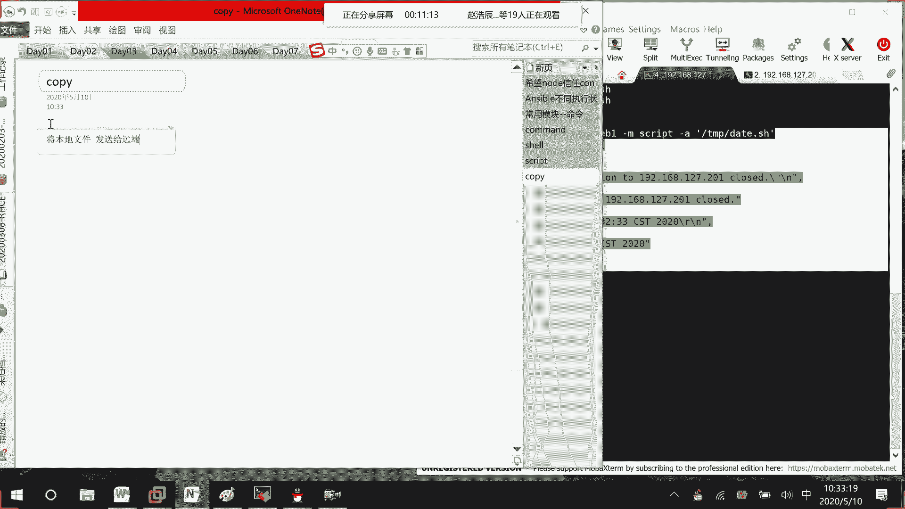

我们先来看一下帮助信息啊，Unable c o p y，你们到时候在这个就相当于是LINUX当中，它的一个help，需要的时候呢，到时候去看一下嘛，呃呃写错了，你看可以备份，可以计算校验和目标。

也就是说远端主机，你要发到哪一个目标地址上面去，这边重要的参数的话呢，我给大家去写几个，远端主机存放文件的位置，那接下去的话呢，那我们肯定要关心的，就是我们当前它的一个目录在哪里吗，诶怎么没写啊。

你看这个就sauce src，这边的话呢就是说呃本地文件的位置嘛，对不对，那好其他的就没有了，其他就没有了，然后我们刚才这边的话呢，可以看到有一个叫做remove source。

Remove source，他这边的话呢应该就是说source，它这边表示的是一个本地，remove source的话呢，就是说远端的哪一个文件，拷贝到本地的哪一个文件上面。

来远端的哪个考不到本地的哪个，但是remove source我没有试哈，这边的话呢我们就使用这两个，就使用这两个，然后的话呢刚才不是创建了一个脚本吗，我们的话呢将temp下面的DT点SH发送过去。

那发送的话呢就是answerable对谁呢，web1使用copy命令里面的参数是怎么样呢，本地的哪个文件呢，temp目录下面的离at s h发送去哪里呢，比如说发送给远端的temp目录，等一下。

你看在远端这里的话呢，它是不是就有一个DE，也可以在这边去进行一个查看，因为我现在电脑执行比较慢了，所以就去远端那边去进行一个执行嘛，那这边的话呢传送过去成功了，我们是不是就要去进行一个执行啊。

temp d a t e吗，诶我好像权限没有修改，不知道能不能执行，稍等一下哦，哦哦哦名字写错了，权限不对啊，权限不对，那权限的话呢，等一下再教你们去修改，这边的话呢，我先来修改一下755。

或者你这边的话呢，可以修改完权限之后再发送过去吗，这里我给你们去补一补啊，编写好文件，然后的话呢修改文件权限就说有，主要就是说有执行权限吗，然后你看这样子的话呢，是不是对远端执行成功的。

他就返回一个结果好吧，就这样子去进行一个执行就可以了，啵啵啵啵啵，那好，这边的话呢，就说我们执行给让远端去执行一条命令的话呢，而去执行一个脚本的话呢，两种方式我们都讲了。

下面这边的话呢我们还有比较常用的是什么呢，有时候我们是不是希望对嗯，S1LINUX去进行一个关闭，对吧，我们先来看一下它远端SALINUX，LINUX的一个信息是怎么样的，Get in force。

比如说回车，这边的话呢它是一个开启状态，如果说我们想要去关闭的话呢，方法第一个是不是先可以把它设置成叫做嗯，临时关闭，是不是就是这个set in force0就可以了，如果说想要去永久关闭呢。

所有的主机我都想要去永久关闭，那这边的话呢，是不是就要去把我们的SALINUX的配置文件信息，去进行一个发送啊，去进行一个发送啊对吧，那这边的话呢第一步我给你们去写一下。

虽然这个过程你们可能觉得会比较简单一点，还是给你们去写一下，这里，首先第一步，我们是不是要去编辑我们的SELINUX文件，编辑好了之后呢，发送给远端主机吧，发送过去之后呢。

我们可以去检查一下是不是真的在远端了，对不对，是不是真的在远端了，然后下面这边的话呢，我们还可以就是说嗯去给设备呢进行一个重启，进行一个检验嘛，这边重启的话，那我就不去进行一个重启了，那这边就这样子吗。

copy文件的话呢，是不是在一个etc，试试configure sa linux，比如说拷贝的temp目录，下面来，我们的话呢去编辑TESALINUX这个文件，它里面的话呢信息很多。

是不是只要把这个叫做disabled给改掉，啧啧啧啧啧，改完了之后呢，我们去保存退出，对不对，然后接下去的话呢就去发送了嘛，Unable，他这边的话呢，你看格式SRC，我本地是什么文件呢。

SLINUX文件发送到远端的哪里去呢，是不是要去发送到远端的这个etc se linux下面去啊，SALINUX下不去，如果说我直接这样子去发送过去的话，会有什么样的一个问题。

你们想一下或者什么样的一个问题，LSLL减l etc，This is config sa linux，这个的话呢是不是一个叫做5月3号，5月3号可能去进行的一个编辑嘛，如果说我直接这样子发送过去的话呢。

是不是会把原来的一个文件去进行一个覆盖，我们的话呢刚才在看的时候，是不是还有个参数叫做back up，这个的话呢叫做对远端文件进行备份，我们等一下去看一下，效果好吧，这边我先写，先跟上这个yes。

稍等一下，我先把这个效果给大家去截图一下，等一下，他如果不在一行的话，我就会特别难受，所以有时候喜欢把这个格子拉的大一点，然后你看我这边的话呢发送过去了，发送过去了，然后这边我们再来看一下SLINUX。

然后呢信号所有和SALINUX相关的，这里的话呢，哎我这时间是不是不准啊，诶5月10号对的呀，哦估计是这个文件，它的一个日期是怎么样子的，诶5月10号呀，他这边日期有问题吗，5月10号呀。

这边好像在发送过来的时候，显示的信息稍微有点问题啊，他这边是怎么样呢，其实一开始的时候是没有这个文件的，没有这个叫做什么1293这个信息的，或者我现在这边的话呢，先把它给删掉，temp哦不对。

etc c config sa linux123几吗，然后这边的话呢我再来给你们看一下，现在就一个这个文件后面加个新号哈。

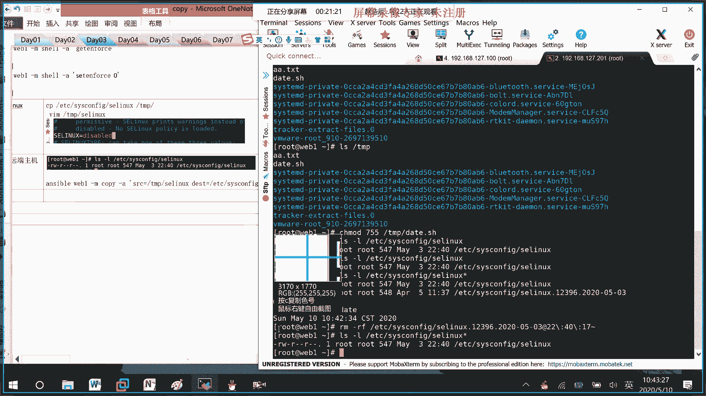

这个文件呢你看它是一个disable，其实也就是说会把之前的一个文件的话呢，去进行一个备份，这边我直接去给你们洗啊。

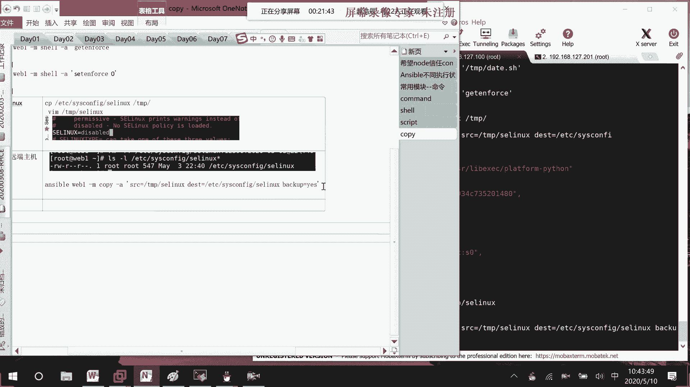

刚才没有很好的，确实是这个步骤，哦原来的文件它就这样子不见了，因为他可能没有变化，因为他一个等密性已经执行过了，就不会再去执行了嘛，等一下我再来试一下，有修改了，你看这边的话呢是不是就有了呀。

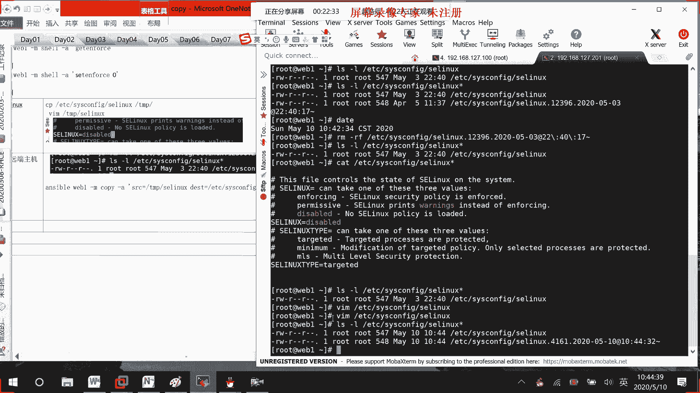

这个的话呢是怎么回事呢，我稍微给大家去看一下里面的信息哈。

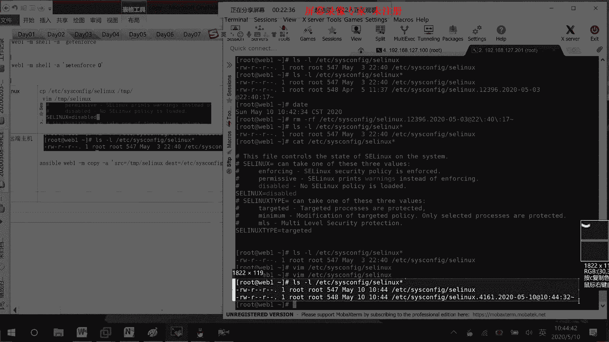

就说GRAP哦，不要就cat etc cs configure sa linux，这个的话呢它是不是一个enforcing的一个状态，这边的话呢back up是这样子的。

有别ck up表示对源文件进行备份，然后备份了之后的话呢，他这个名字就是5月10号10点几分，这样子去生成了一个文件吗，好吧，然后的话呢它的一个叫做新文件也是在的，我现在的话呢。

比如说这个把copy etc six config sa linux嗯，我看一下点去改一下名字，你看，override copy这个，稍等一下哦，哦我少了一个L参数，所以看过去信息有点少。

你看这里的话呢，我去把下面这条信息给删了，Cat，这个SALINUX的信息，他现在是不是一个叫做enforcing的一个状态，而且的话呢在我们的一个叫做SALINUX下面，是不是也就一个文件。

我这边在发送的时候，back up不要，等一下稍等一下，你看这里他有没有多一个备份文件，啧他的话呢就没有多备份文件，所以像这个back up的话呢，主要就是说对我们远端的一个源文件，去进行一个备份。

你看这里它就有说bake up生成的文件，名字是什么，然后这里back up是不是就没有这个信息了呀，因为你没有让我去对它进行一个备份嘛，那我就没有必要去对他进行一个备份了吗，然后的话呢。

如果你想要去修改它的一个上下文的值，其实也可以直接去修改的，就类似于我们刚才的bake up嘛，就se context等于什么东西，owner等于什么东西，mod等于什么东西。

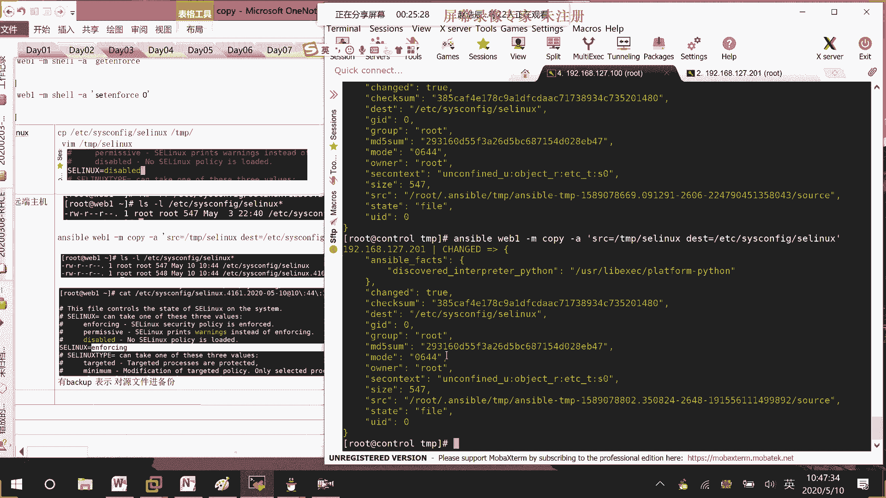

明白吗，这边的一个叫做copy，稍等一下，copy这里的话呢就还可以去写很多信息吗，比如说这个GD所在组是什么东西，你可以自己去改变的，我这边给你们再去演示一个吧。

就是说现在这里的话呢是一个AA点test好吧，DET它的话呢比如说到temp下面叫做BB点test，看一下这边能不能多一个宾语，减l temp，下面我看一下哎还没好，嗯这边好像不行，不能写一个目录。

就直接temp吧，稍等一下，现在是空的，copy m s r c a a点哦，我本地的A文件应该是没了，已扣去，Hello，本地的文件没了，啧等一下还没，你看这边的话呢，他去复制过来的时候。

是不是可以去改个名字啊，如果说你后面不去跟上名字的话呢，不去跟名字，就说这边dust当中，如果说只写目录，他的话呢文件名字和原文件一致，如果说你写了名字名字，写了文件的名字。

那这样子他的话呢是不是使用新的名字啊，然后你们来看一下这边ls s减L，我没看错的话，哦我知道了，我忘记跟上目录了，你看这里的话呢，它是不是一个叫做root呀，如果说我希望改过来的时候。

第一它的一个group是哪个组呢，red hat组，稍等啊，是不是多了一个B1小组的一个名字，就去进行一个修改了，所以这边的一些信息呢大家都可以去改，比如说还有一个叫做mod权限吗。

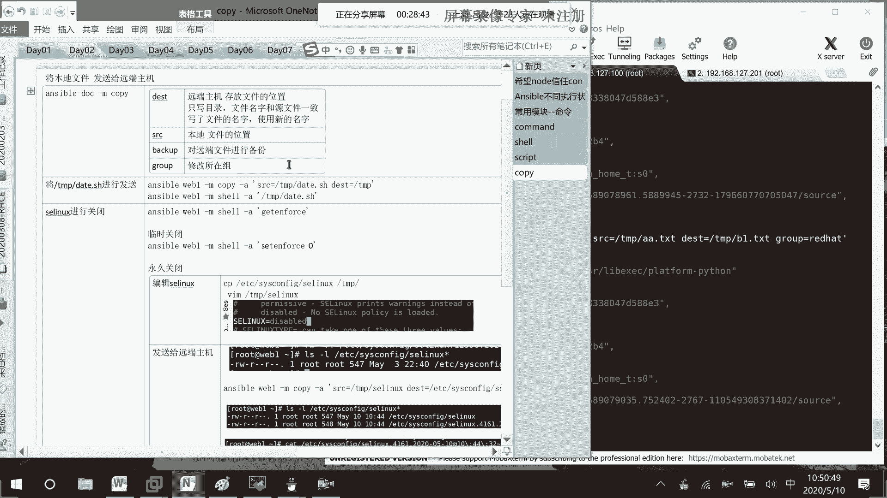

在拷贝过去的时候就可以去改，比如说改成777，你多个选项的话呢可以写在一起的，我现在就是一个测试就去进行一个删除嘛，然后所在组的话呢是一个叫做group，你也可以去修改一下它的一个所有者owner。

修改所有者好吧，修改完了之后的话呢，se context这边的话呢我就不说了哈。

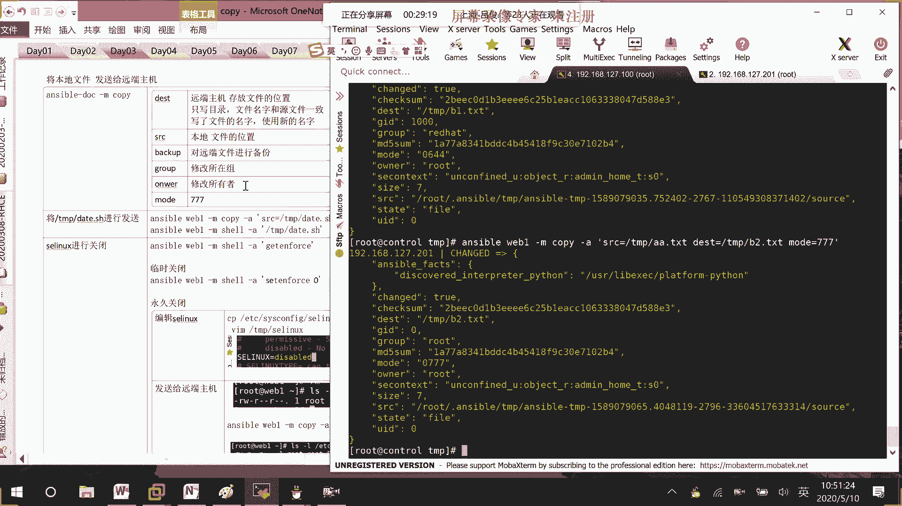

修改SELINUX的值好吧，就什么东西等于什么，什么东西等于什么就可以了，你看这是不是就有个B2权限的话，是一个叫做777的一个情况好吧，那行那这里的话呢没有什么样的一个问题啊。

基本上全都已经去进行了一个修改，进行了一个修改，那好然后下面这边的话呢，这个它不仅仅的话呢可以去进行一个叫做啊。

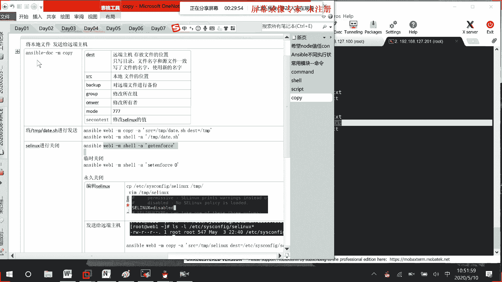

文件信息文件的一个拷贝，它这个功它还有一个功能哈，我们来看一下，啵啵啵等于A怎么那么喜欢写M，你看这边的话呢，还有一个叫做content use in in src，他的话呢是干嘛呢。

就说把你content的东西，直接的去写到目标的文件当中去，C o n t n t，它的话呢是替代我们的SRC表示，比如说一个字符串或者一段话，表示将内容直接写入到目标，等一下写入到目标中。

我们现在这边的话呢，cat temp下面的me文件是不是只有一个，hello啊，我希望在里面的话呢，比如说再加一个by的一个信息，unstable web1m copy a也是这样子的。

然后这边只是说是一个content，我里面的话想要写什么东西呢，拜拜写完了之后的话呢，或者你可以去换行吗，白N表示换了一行，然后呢20200510，Hello，你也可以去换一行，也可以不换，好吧。

我们就这样子就写两行，然后接下去的话呢就说目标的哪个主机呢，目标temp下面的叫做B点test这个文件，然后下面这边你去回车就可以了，叫做，最远端文件写入字符串，啧啧啧，然后你看这边的话呢。

他好像没有那个content的一个信息没有写，我们这边再来cat一下诶，cat一下嘛，你看就二零啊，by诶，他直接去进行写入，把原来的信息的话呢去进行了一个覆盖，原来的信息去进行了一个覆盖，好吧嗯。

因为我后面那边没有去进行一个换行哈，他的信诶没有进行一个换行，所以这边的话呢显示起来就稍微有点奇怪一点，好这里的话呢就是一个copy他的一个考背啊，它的一个写入啊，怎么样去做的，下面这边的话呢。

咱们再来看一个，就说从远端设备上面，这个，从远端主机提取文件，这边的话呢，如果就好像你如果是一个目录的话呢，可以对它进行一个打包，就可以也可以进行一个归档吗，可以进行一个归档。

把信息的话呢把它给拿过来对吧，这边answerable，哦我写错地方了，应该在这unstable docs feature，啧啧，里面的话呢就是说目标的哪一个文件嘛，拷贝到本地的哪个目录当中去嘛。

没了就没了，所以他这个参数的话呢非常的简单，我们来看一下我们这里的话呢，比如说把文件信息给清空吧，差点直接就行好了，然后的话呢比如说把远端的B文件给拷贝过来，W e b e m f e t c h。

对不对，减A然后呢DEST远端的哪个文件呢，远端temp目录下，bin文件拷贝到本地的什么目录当中来呢，比如说就叫做temp，叫做BB1，顺序的话呢没有关系，你只要把哦哦哦not found哦，写错了。

远端的哪个文件拷贝到本地的哪个位置，容易忘，这边的话呢DTDT现在表示本地的目录，然后的话呢刚才说了一个叫做SRC对吧，表示远端的目录，这个要稍微去区分一下，然后这边的话呢我们再来看一下嘛。

是不是就有一个叫做BB1的一个文件，就这样子去进行一个拷贝，然后下面这边的话呢，嗯其他的就没有什么东西了，其他就没什么东西了，我想一下他这边的话呢，有一个东西是什么呢，是这样子的，就比如说我这里的话呢。

DT是不是temp b b e r b b e的话呢，它是一个目录目录，这个目录下面这里的话呢，因为我的web server叫做web1，只有这个主当中是不是只有一个，只有一个用，只有一台主机啊。

然后的话呢是不是把temp b b1给拷贝过来，所以它的一个结构就是远程远端的哪个目录，下面的哪一个文件，远端哪个目录下的哪个文件，如果现在这边的话呢，还有一个叫做第二个设备呢，它在这里会有一个。

比如说202下面的话呢，这个节点下面temp目录有一个B文件。

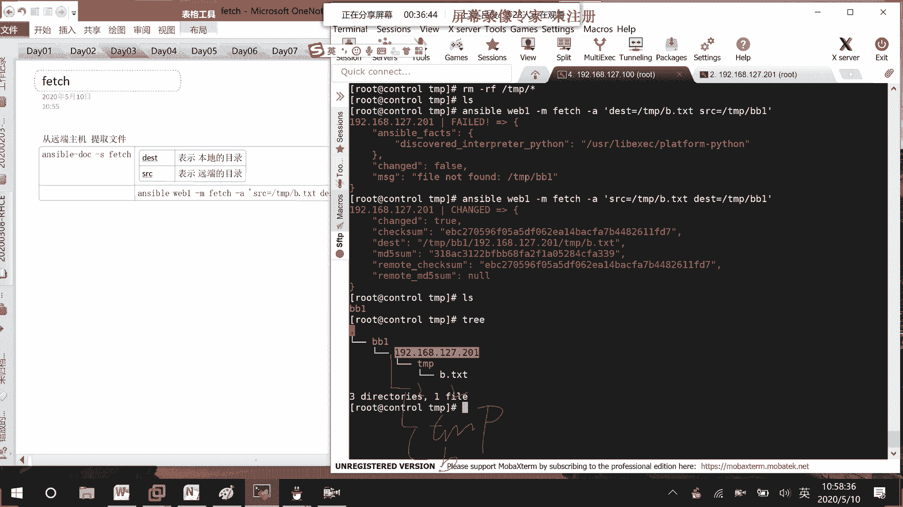

它是这样子的，每个节点的话呢它都会有个目录，然后目录下面的话呢再去写上什么文件。

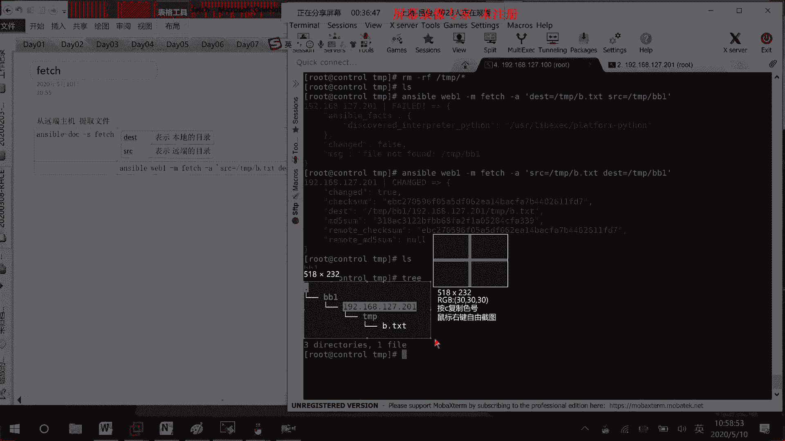

去拷贝过来，明白吗，这个稍微比较特殊一点，会为每一个节点的话呢都去创建一个文件，要创建一个目录，然后的话呢去存放信息，去存放信息好吧，叫做这个远程提取的话呢。

就讲这个我这边的话呢再来讲一个叫做fire fire，这边的话呢我们常用的就设置文件的属性嘛，其实我们的话呢可以发现。

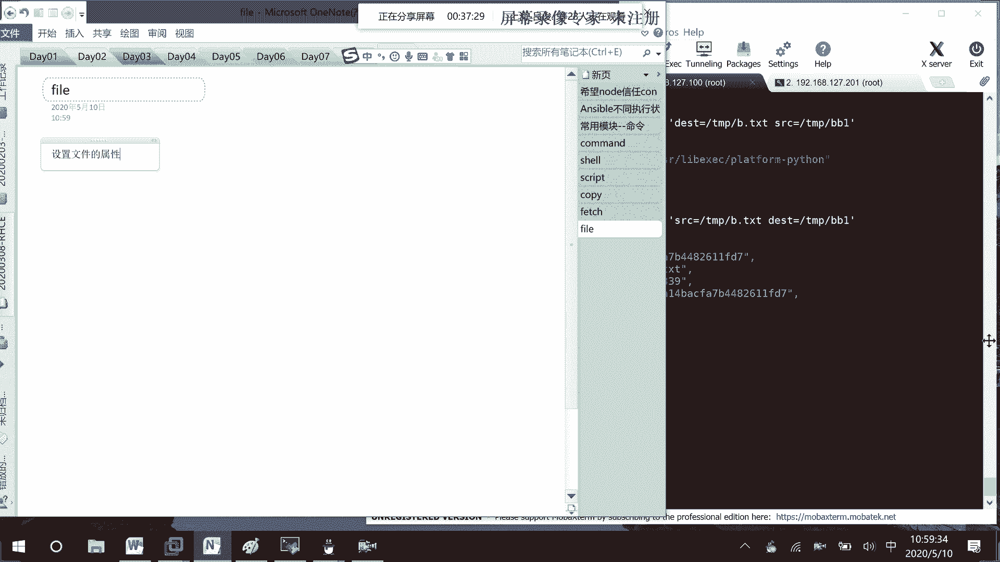

如果想要去设置这边的，文件属性的话呢，在拷贝的时候可以去设置，比如说拷贝完了之后呢，那我们是不是可以这样子，Unable m shell，干嘛呢，全剧mode7777对谁呢，temp下面的V1吗。

等一下我看一下啊，对比文件，给我少了一个D，等等一下稍微有点慢，你看这边说修改成功了，你看这里确实有修改成功了，对不对，上面这里的话呢就是一个warning而已，你的话呢可以使用file模块。

而不是使用change mode这个命令直接去进行修改，所以的话呢都没有关系的好吧，比如说我们现在按照它的一个规定，使用我们的叫做FM模块的话呢，去进行一个操作，Unstable，老规矩嘛。

docs我想要去看一下file模块，稍等哈，多了一个d enerable doc，去查看一下file模块的帮助信息啧。

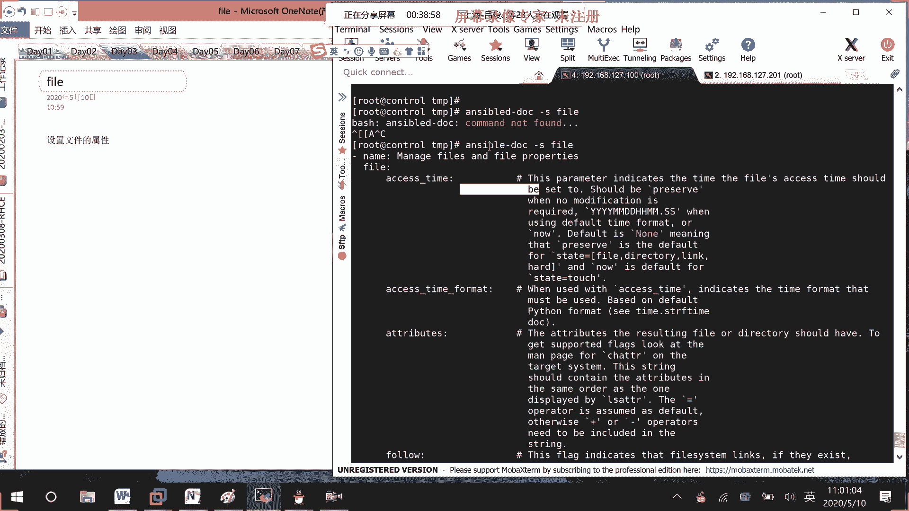

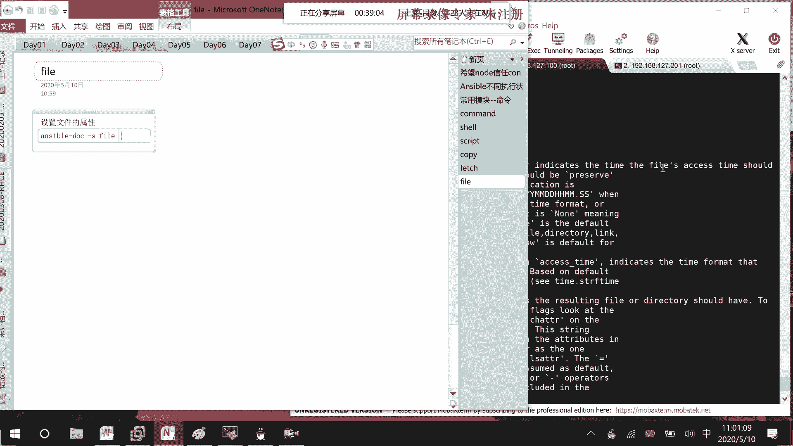

他这里面的话呢选项就比较多哈，这边的话呢上面这些不常用的。

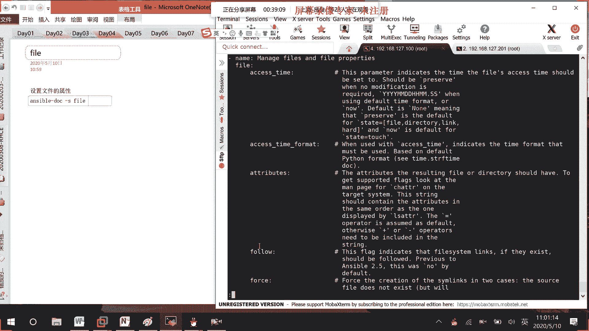

我们不看group用户吧，哦不对，小组，所属组，然后接下去的话呢，它的一个下面就是一个owner嘛，所在主哦不对，所所有者，然后下面这边的话呢它有一个mod对吧，就是我们劝句啊。

Change mod777，他这边的话直接就写一个mod就行了，权限是多少，权限是多少，然后下面这边的话呢，呃owner写了pass，就对哪个文件去进行一个修改吗，P a t h。

就说文件路径你要对谁修改，是不是要去说一下，然后呢其他的就没有什么样的一个东西啊，这个是最精彩的一个东西了，St，state的话呢，我们在后面也会去看到，如果说这边你是跟上一个叫做absent。

表示state等，absent就表示这个文件或者这个目录的话呢，我想要把它给删除掉，她的状态很多个，删除文件或者目录，删除文件或者目录，然后下面这边的话呢，我们再来看一下这个DFF的话呢。

就是说去看他们之间的一个差别，我看一下还有什么ent file，file的话呢，这是干嘛呢，fire是这样子的，如果文件不存在，他的话呢，就不进行一个创建诶，我想一下F如果文件这个等一下去测试一下。

我有点给忘了，Fire to fear，If a will not cof five to four，If the past does not exist，就这fire的话好像就是说像文件不存在的话。

我不对他进行一个创建，这就比较奇怪了，到时候再看吧，然后pass讲了这个direct的话呢，他是干嘛呢，他是这样子的，就是说，如果说你我们在进行一个创建目录的时候嘛，如果目录不存在我的话呢，就去创建。

其实也就是说去创建目录，上面这个应该是创建文件，如果我没记错的话，然后还有一个的话呢就是far without any other option。

This was mostly at state will returned the current state past，这个其实这个fire就验证一下，我的一个目录存不存在。

所以的话呢它不存在的话呢，我就不会去进行一个创建，创建，那有时候的话呢我真的想要去创建文件了，怎么办呢，他这边应该有一个选项叫做，touch touch touch的话呢是干嘛呢。

也就是说如果文件不存在，它其实这个的话呢也就是说创建文件，文件不存在的时候呢，对你的一个文件去进行一个创建嘛，然后后面这边的话呢，你们可以看到还有一个叫做link对吧，这边的话呢就创建软链接。

然后还有一个叫做hard link，它的话呢harder这边的话呢就说去创建硬链接嘛，然后接下去的话呢哦我们来看一下删除，这里应该也就没了哈，没了，就这些选项，就这些选项你们去记一下。

这边的话呢我去给大家来演示一下，第一个创建目录，我们之前的话呢，全都是去创建了一个文件的一个信息嘛，现在来创建unable w e d e m fire a，我想要去写错了，嗯第一种方式吧。

我先使用shell的一个形式吧，A make dir，tap目录下面叫做dead，一给大家来看一下，你看带的一的话呢是不是创建起来了，这种方式是一个嗯，然后接下去的话呢。

我们在使用我们的叫做file的一个模块，那他这里的话呢是不是就应该跟上的，是一个叫做fire的一个信息，然后后面呢这边就要去跟上路径，我的话呢希望在tap目录下，比如说创建一个dead2。

然后后面的话呢就这个state，你要去跟上directory d i r e c t o r y，稍等一下哈，你看是不是就多了一个dead2，所以像这种方式的话呢，他也可以去进行一个创建的。

而且在创建的时候呢，你还可以去设置所有者啊，所在组啊，对不对，然后像这边的话呢，你想去进行一个吉连创建也行的，点21。22，就说这个目录存在的时候呢，他会先去创建一个DIR2，再去给你创建一个DIR1。

你看直接就给大家去创建起来了吧，那好这没什么问题，然后下面这边的话呢，就比如说我想去创建文件。

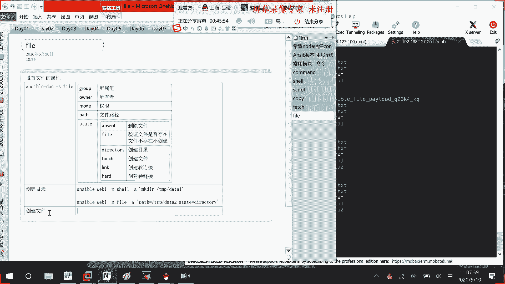

像是比如说刚才说的那个fire，我们看一下能不能来，能不能来进行一个创建吗，他这是不能创建的，比如说就在temp目录下面，我比如说发一文件，等一下你看这里的话呢，他就说first pass的话呢。

这个file1它就说不存在吗，所以这里的话呢就没有多任何file1的一个信息，我把后面去改一下，改成我们的touch，好这里就有一些信息了，然后的话呢，你再来看。

是不是就多了一个叫做file1的一个信息啊，我再来执行，刚才后面带fire的时候，他的一个情况，你看这边的话呢，是不是就发现有这个文件存在，它是不是就显示一个叫做success。

如果说我后面这里跟上DTA带的，因为它是一个目录，然后这里的话呢它是一个f fr，因为他的话呢就不是一个普通的文本文件嘛，他的话呢是一个目录的一个信息，它是一个目录的一个信息。

他只有是一个普通文件的时候，才会返回一个success的，叫做情况，叫做如果这边如果文件普通文件存在，返回success信息，这里的话呢如果存在的是目录，那这样子的话呢它其实会返回我们一个。

诶我们一个叫做fir的一个信息嘛，但是的话呢像message里面会提示他是一个目录，没有办法去进行一个继续吗，对吧，这个的话呢就可以去进行一些判断，文件存不存在，文件存不存在，那好。

那好下面这边的话呢我们再来看一下，文件也创建了，然后的话呢目录也创建了，接下去的话呢我们来看一下删除文件，删除目录吧，目录的删除的话呢就比较简单了，如果说我们只想要删除这个叫做D2。

Absent a b s e n t，因为我这里写到了这个目录嘛，他的话呢就对我单个目录去进行一个删除。

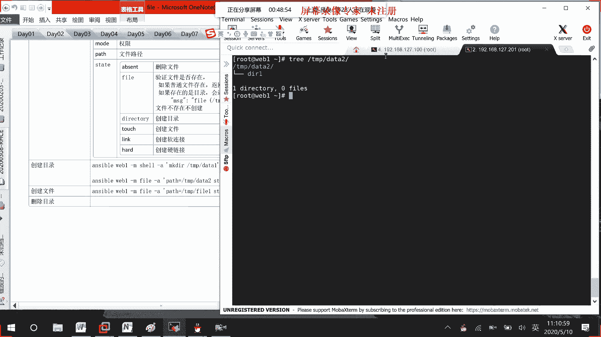

你看是不是就删除了一个叫做DR2啊，然后这边的话呢，如果说你想要去把DR2DR1都给删掉呢，那这里就写一个data2就行了，稍等啊，你看这个带二的话呢，它就不存在了吗，这个的话呢就是说怎么样去删除目录。

它的话呢会进行一个叫做吉连删除的，及连删除的，这边如果说你想要去删除文件呢，目录都可以去删除了文件，为什么不可以去删除呢，比如说以B开头的所有文件，也是一个absent，诶都没有删除成功。

这边的话呢可以发现，就是说在进行一个删除的时候呢，是不是明明应该能删除成功的，但是它实际上是没有删除掉的，没有删除掉的，如果说你想要去删除一个目录当中的，所有文件的话呢，这种是不可取的。

我们的话呢还是使用那个叫做shell命令，去进行一下删除啊，就这样子，unstable web m shell a这边的话呢，Rm rf temp，下面所有以B开头的文件是进行一个删除吗。

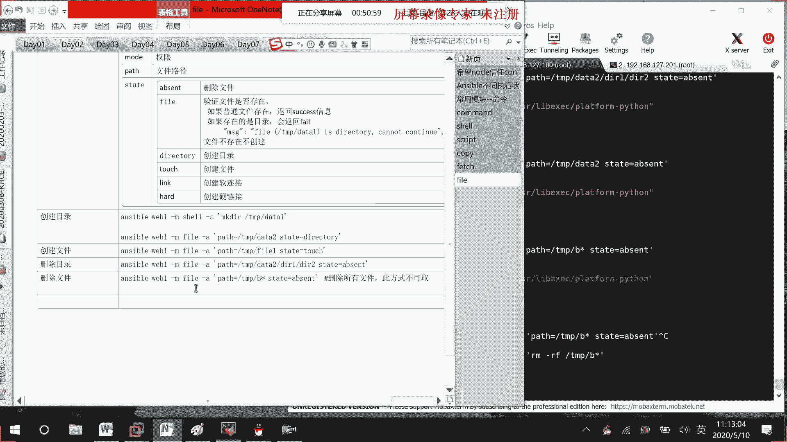

嗯我看一下他这个using fire，我看一下，难道是可以删除，这里确实是删除了，我这边再来touch几个吧，叫做fire b1到五，诶哦哦，我看一下这边的话呢去加上一个双引号行不行，我。

还是没删除掉嗯，等一下，没有执行成功，应该是什么转移制服吧嗯，这个符号的话呢删肯定是应该能删的，但是我现在这个符号的话呢，我想不起来了哈，新号，那这个符号的话呢，我到时候再去给你们看一下。

它这里的话呢应该用是能用的，只是说我这个符号写错了。

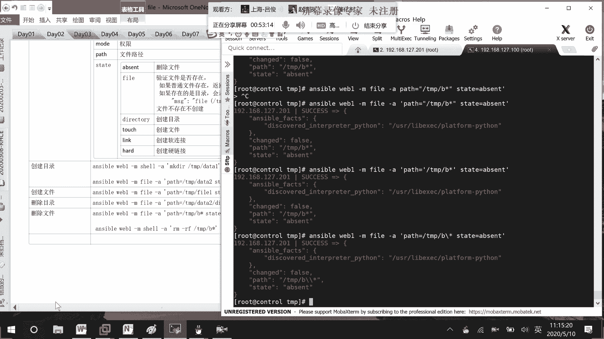

咳咳咳。

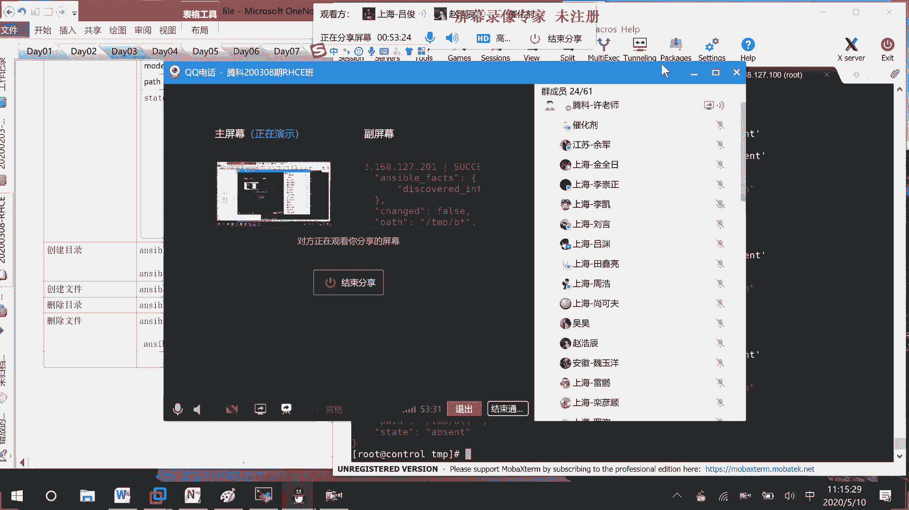

你们自己的话呢把声音关一下哈，好然后下面这边的话呢删啊，删除文件这种方式的话呢，就是说直接这样子写的话，那肯定是不可取的，它的应该符号的话呢是加什么，我给忘记掉了，到时候的话呢我再去看一下。

但是这样子的话呢，我们是不是可以去把它给删除掉，可以把它给删除掉吗，所以其他的一些权限的话呢，大家可以自己去设置一下，设置一下，我最终的话呢再去讲最后一个命令，讲完了之后呢，让大家去练习一下好吧。

留个半个小时左右，还有一个叫做host的一个命令，因为现在的话呢，我可能希望对这个主机去进行一个改名吧，不同设备的话呢，希望它有不一样的一个名字，这里的话呢可以怎么样去改呢，我们现在就是说嗯比较简单。

就一台设备可以这样子，unstable web1减m host name模块，专门是用来改名字的，减A引号name等于什么，就好像说我现在这台设备的一个名字的话，叫做web e x t t嘛。

比如说我这线就叫做3W，这里hostile呢我就讲一个，如果说这个web当中有多台主机，你用这条命令去改呢，所有的节点都会被换成相同的名字，都被换成相同的名字啊，所以后面的话呢。

我们会说怎么样去进行一个取变量，知道吧，所以它这个模块是比较多的，我把它去改回来哈，因为它叫做web1XTT点com。

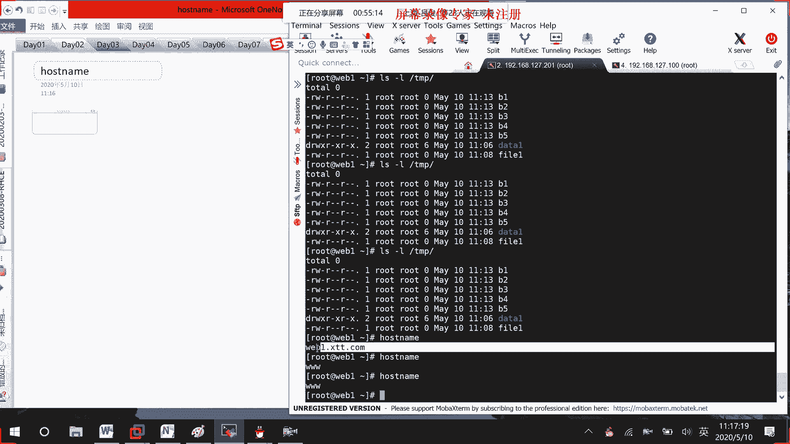

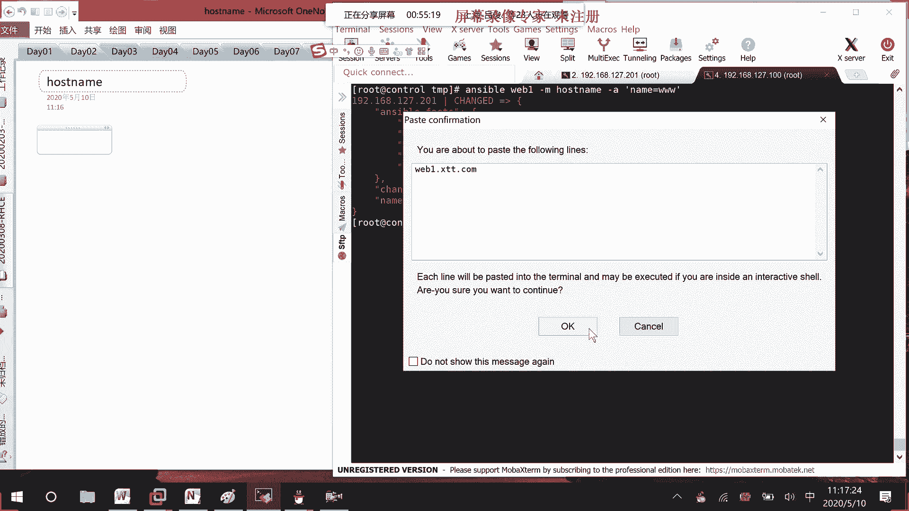

啊这里修改自己的名字，格式的话呢就这样子，而且大家可以看到改了之后的话呢，是不是就进行了一个生效，我们这边的话呢，因为他这个比较简单哈，它的一个帮助信息的话呢，我们就来简单的来看一下吧。

就直接这样子name就可以了，有没有看到，所以解释信息的话呢也比较简单，那好现在这边的话呢，给你们自己时间去操作一下吧，对上午的内容去进行一个操作好吧，有问题的话呢可以去问一下。

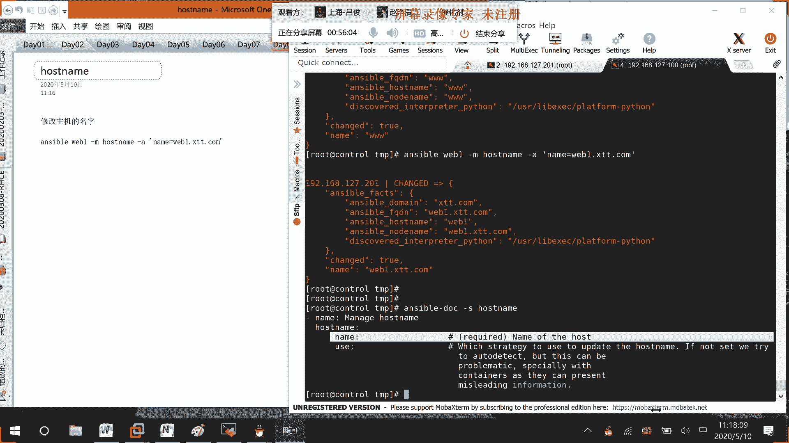

因为上午一直在讲哈，行，我们刚才的话呢讲到了一个HOSTNAME，接下去的话呢我们经常会做的一个事情，是不是就是计划任务，计划任务，他这个计划任务的话呢，可以实现怎么样的一个控制呢。

Unstable docs，它就是一个row，它的一个模块，这个模块，里面的话呢它有一些参数，我们先来看一些和时间相关的参数，等一下你看这里的话呢，back up就是说备份之前的一个文件。

然后呢day它这里能实实现的一个叫做管理级别，这就是我们之前说的CORTABLE，一个天，然后还有小时，还有minute，还有month，诶，还有星期几，它这边的话呢这几个级别都可以去实现控制的。

就好像我们之前在写那个计划任务的时候，一开始的时候是不是一个叫做minute，然后接下去的话呢就是一个小时，然后接下去的话呢就是一个星期几嘛，对吧啊，不是星期几啊，就说几号对吧，是几号。

不是我现在有点忘了哈，然后接下去的话呢就是一个月份，前面应该是先对先月份先几号，然后再月份，然后的话呢再一个weekend，然后后面的话呢是不是就是一个命令啊，它这边的话呢可以这样子去进行一个管理。

然后接下去的话呢，像我们在写计划任务的时候呢，是不是还要有个命令啊，the command就说job吧，job的话呢就说你的一个执行命令是什么，啧啧啧，然后我们的话呢，因为是远程去对它进行一个管理的。

那有时候的话那些计划任务，我想要把它给删掉或者禁用掉，是不是要能找到这个计划任务啊，所以这边的话呢可以给计划任务去起一个名字，去起一个名字，默认如果说没有name的话呢。

好像是对一个default去进行操作，对计划任务命名，然后下面这边的话呢，再来看一下其他的一些选项，还有这个disable，就是说把某一个计划任务的话呢给禁用掉嘛，就是说这里有个state，稍等啊。

我看啊这里dead state的话呢，就是说可以对我们的一个计划任务，去进行一个当前状态，不要这个第三部disable，如果是等于true的话，表示禁用相应的计划任务，如果说等于一个first的话呢。

那如果本身是禁用的，那现在的话呢我们去把它进行一个启用嘛，就这样子，然后还有一个的话呢，比如说你想要去删除我们的一个计划任务，这里有个叫做state state。

当中的话呢prevent就是说目前是在的嘛，absent的话呢就是说把它给删除掉，默认情况下就是一个。

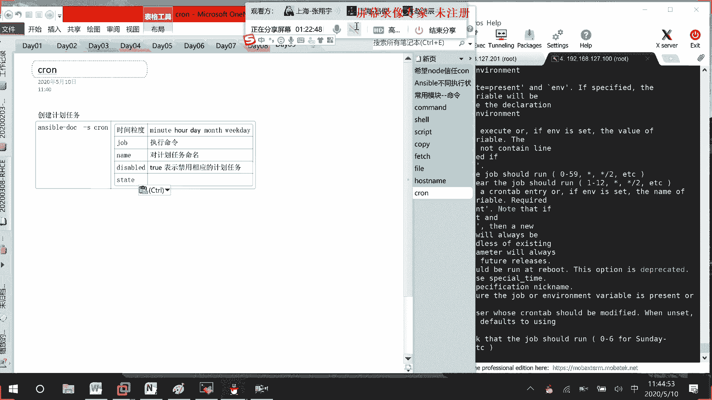

哦好，超市两个超市两个全在超市，我先取消全员静音，然后的话我再全员静音，那不至于吧。

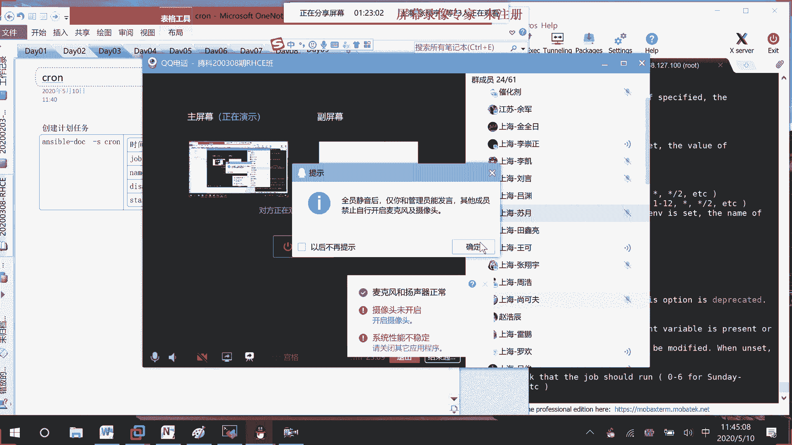

现在应该就没声音了吧好吧，然后这边的话呢state，state的话呢就是说去进行一个删除嘛，默认情况下的话呢，它是一个present，Present，它这个的话呢，其实就是进行一个添加的一个意思。

如果说你想要去删除，就是absent就删除，在很多地方我们如果用到删除的话呢，都这个ab set这个信息行吧，然后这边的话呢我们先来看一下，比如说在这台设备上，它有没有一个计划任务的信息嘛。

crown table啊，我把这个计划任务先给删掉哈，你也可以去指定一下哪个用户去做计划任务的，就这里有个选项叫做user嘛，去设置特定的用户去做计划任务，对不对，设置创建计划任务的用户。

然后这边默认是我们的user用户，那现在这边的话呢，我们先来简单的创建一个计划任务，他线上面这也是空的哈，啥也没有，那在创建的时候呢，就是answerable m模块。

chrome a就说想要去创建任务，这边的话呢，如果说我们想要去创建一个任务，每一分钟都去进行一个执行，那就是说minute等于新号码或者minute，你直接不写也可以，就每分job的话呢是干嘛呢。

比如说想要去打印一下时间好不好，user时间的一个命令的话呢，我们看一下在哪里啊，which d a t e啊，这个usr bin dead下面，然后呢因为为了方便管理，给他写一个名字嘛。

比如说show time，就这样子，minute时间job name，这边的话呢就说创建了一个job，是一个叫做showtime吗，你看每分钟我都会去进行一次执行。

但是因为我们这边的话呢是一个红帽八的环境，它的啊啊邮邮邮箱的话呢，没有去把它给开启起来，所以的话呢我们现在应该是收不到，收不到时间信息的，如果是七的话，那直接可以收到，那好这里的话呢。

既然说现在有一个这个是哦哦哦稍等一下，有这么一个计划任务了，如果说我现在的话呢，想要去指定不同的用户去创建呢，这里再来一个USER，它上面不是有有一个red hat，red hat用户吗，那指定用户吗。

前面那边你去跟一个REDHAT就可以了，好吧，这边的话呢我们再来看一下啊，这里呢默认看的是一个我们root的嘛，这边的话呢read heat用户，他的一个计划任务是这样子的。

现在下面这边计划任务创建好了，我可能就说想要去禁用计划任务，或者说我想去修改计划任务。

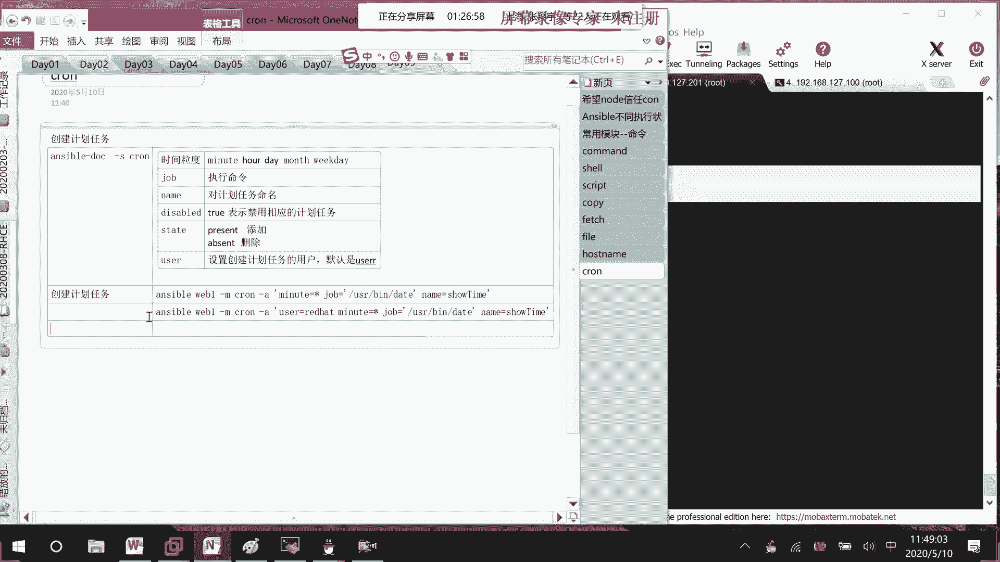

他这边不是每分钟都在执行吗，我觉得太麻烦了，能不能改成每5分钟执行呢，这后面跟上哪一个job，然后呢在哪一个名字模块下面就可以了，你看回车，稍等哈，这边你再来看一下诶，不要read h。

你看是不是就说每5分钟去执行一次啊，这个修改修改某一个job，如果在这个name模块下面的话呢，再去创建一个计划任务，可不可以呢，它也是可以的，你看这边我比如说就不要说这个了。

就1coach hello吧，诶一个去hello，就在这个show time下面，比如说每10分钟去执行一个，我看一下啊，这里应该加一个双引号。

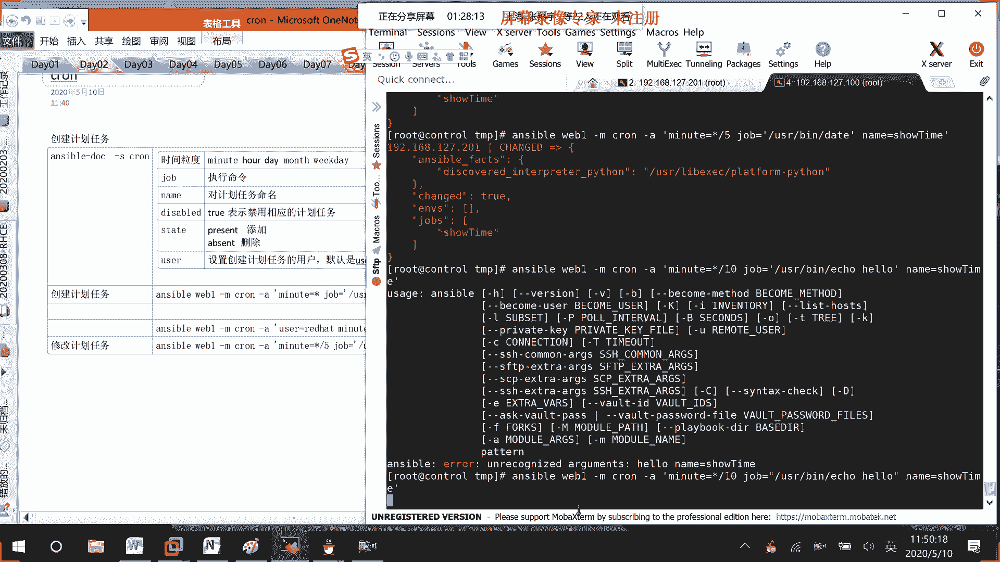

好这里，你看这边的话呢我又生成了一个哦，他这边的话呢只能有一个任务，只能有一个job任务，他的话呢直接就对他的一个job，都去进行了一个修改，如果说还想要去添加一个新的，那这边就是去改嘛。

比如说是一个hello吧，一个name下面的话呢它好像只能有一个job job信息，你看现在这边的话呢就有一个show hello，Show time，就两个两个名字，那好接下去的话呢。

就比如说我觉得这个的话呢，明明是一个显示hello的信息，但我把他的名字叫成了一个show time，我觉得不想要了，我想要去禁用计划任务，禁用某一个计划任务的话呢，这边怎么样去进行一个操作呢。

就这样子把你的一个叫做name吗，job给找到前面后面的话呢全都没有关系，disable等于two就可以了，稍等一下，你看在这里前面是不是就加上了一个井号，表示把相应的计划任务的话呢，去进行了一个禁用。

如果说这边你在写的时候没有去跟上name，你直接写一个job的话呢，好像也是可以的，你看这边，他就直接去创建它，帮你去创建了一个叫做计划任务，名字的话，那是没有的，名字的话是没有的。

然后的话呢默认就是一个禁用的一个状态，所以这条命令稍微比较特殊一点啊，就说创建，啧啧，没有name的计划任务，然后的话呢默认是禁用的，好吧，然后现在这边的话呢，我们不是已经把它给禁用掉了吗。

比如说现在我们再来一次吧，就比如说没有没有那个叫做job的，可不可以呢，比如说这里show hello吗，嗯这里就报错了，他的话呢就是说你必须要去匹配某一个job，或者的话呢去创建一个新的job嘛。

这种形式的话呢它是不可以的，所以在进行一个计划任务的时候呢，你的一个name它不是必须的，但是job是必须的，好吧，那这边的话呢禁用解禁用。

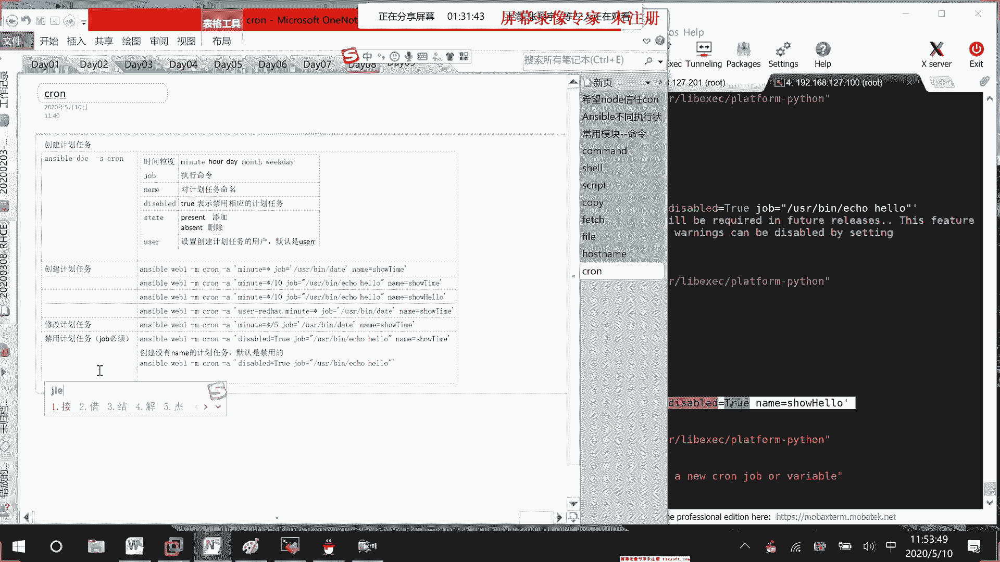

我们来看一下，既然的话呢这条命令可以去把它给禁用掉，那解禁用的话呢，是不是前面去跟一个first就可以了，卧槽稍等一下，你看因为没有跟上name嘛，默认的话呢就对now这条的话去解禁用。

如果说想要去对特定的呃，job name去进行一个解解禁用的话呢，把前面这里改成一个first就可以了吗。

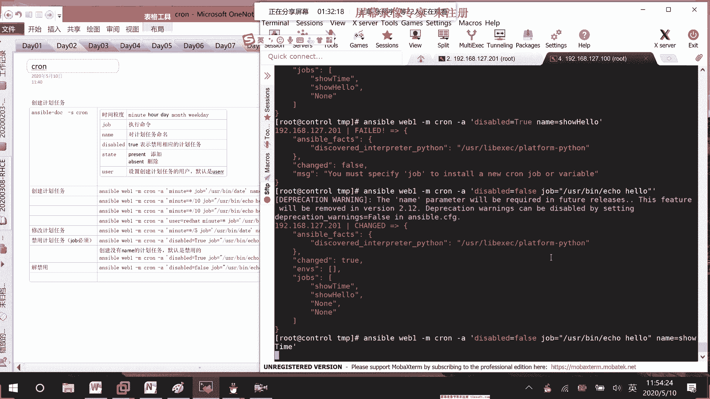

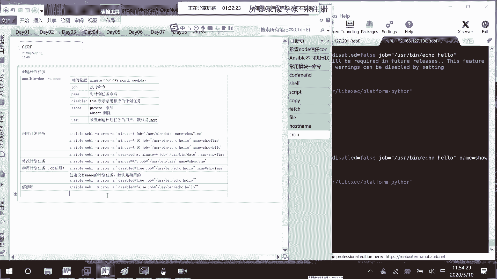

好吧，嗯我看一下先哈，我刚写的哪条命令啊，a job showtime show time啊，好这边的话呢确实是解禁用了，确实是解禁用了，那行这边解禁用也解禁用了。

现在的话呢如果说我想要去删除计划任务呢，就比如说把这个计划任务给删除掉，那在进行删除的时候，他就这样子state，等于abs t把它给删除掉，状态的话呢去改一下就可以了，写在前面还是写在后面。

关系不大的哈，诶，嗯我看一下showtime，我这边的话呢showtime信息太多了，1234有四个showtime，Unstable，Ma cent job，Hello，jobs这边的话呢好像有四个。

但是的话呢呃没有一个没有一个被删除掉了，所以这边在进行一个删除的时候呢，你单独去跟上一个job的话呢，是没有什么样的一个作用的，你的话呢这边需要跟上一个具体的name，比如说是这个和now相关的。

等于now，我看一下行不行啊，First，我再把job给跟上吧，噗噗噗噗噗，这个比较麻烦，没删掉哦，我知道了，我name写错了，我干嘛给他大写呢，前面这个name没有大写，嗯好现在成功了哈。

你看我刚才删的时候呢，那个关键字它大小写是敏感的，所以的话呢我去跟上一个大写，他就一直报错嘛，然后这边的话呢它是怎么样呢，就是说去进行删除的时候，把我们某一个name给删除掉，就是说像这边job的话呢。

比如说像这个job，是不是匹配中很多个他没有给你去删除的，后面如果在删除的时候呢，你这边一定要跟上一个叫做name的一个模块，能明白吗，然后我们还有不是像showtime，还有个哈罗吗，也都把它给删掉。

show time吗，还有一个叫做hello哇，好现在就没有了吗对吧，所以计划任务这边的话呢主要是这样子，怎么样去创建，怎么样修改，怎么禁用，怎么解禁用好吧，然后我们上午的话呢讲到这里。

过下午的话呢01：25左右，我会把会议开起来哈，呃下午的话呢再去把YM的一个安装管理，然后还有一个服务管理啊，用户组管理啊，讲一下，讲完了之后呢，我们去讲一些play book的一个基础。

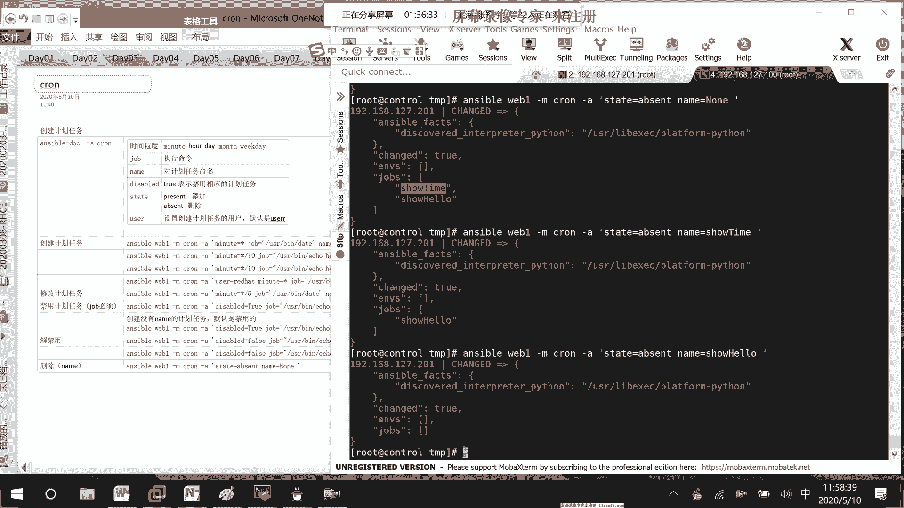