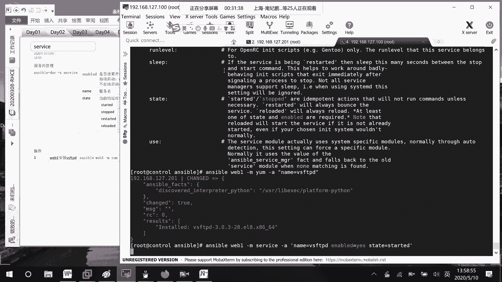
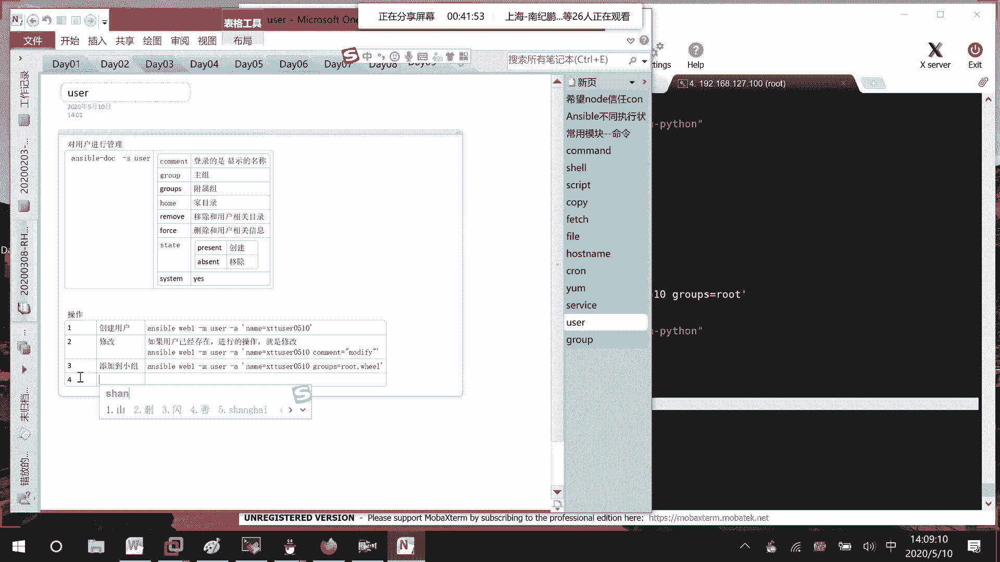
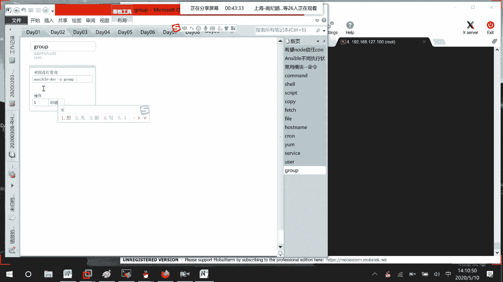

# 01 RHCE8.0视频教程【45课时】 - P38：20200510-RHCE-03_recv - 六竹书生6682 - BV1m84y1f7ss

这样子啊下午的话呢我们再讲两个模块，然后开始的话呢进行playbook的一个编写，好吧，就开始编写脚本嘛，这边的话呢我们来讲一个亚目，亚目的话呢，大家都知道他的话呢，是不是去进行一个包管理啊，对吧。

那一种方式，也就是说在一开始的时候，你可能在装系统的时候呢，就把他的一个亚目源给安装上去了嘛，就比如说kick start的时候啊。

或者什么样的一个方式，如果说就好像我这里的话呢，管理了一台主机，他上面的话呢就是说，光盘没有挂载，在他的一个叫做亚目录当中的话呢，任何的一个叫做YM文件也没有。

这个时候的话呢，我怎么样对它进行一个包管理呢，你们来想一下这个的话呢，也算是对前面的一些嗯模块的话呢，去进行一个整合哈，第一个我们先想一下这个流程。

然后再来看这个样模模块，第一个我们要做的事情。

就是说，让我们想要去进行项目管理的这些设备啊，首先光盘，要挂载吧，在进行光盘挂载的时候需要两步，第一步创建目录，第二步挂载，然后接下去第三部你可以去验证一下吗，验证好了之后，第二个是一个YM文件。

项目文件的话呢，第一种我就在本地先配置好，要么文件，然后再传递给对方嘛，第二个在本地创建YM文件，创建好了之后呢，是copy到远端主机，然后接下去的话呢，第三个开始使用我们的一个YM吗，对吧。

像上面这些的话呢，我们可以直都使用那个叫做shell的一些命令，这边的话呢使用一个copy的一个模块就可以了吗。

好这边咱们先来看一下，第一个来复习answerable，接下来模块就说对web1码模块，share命令是要make dir，比如说叫做iso answerable，就这样子吧，如果要验证的话。

那你我看一下啊，Can not correct answerable，这边哦这边好像已经有这个目录了，所以这里的话呢，比如说我给他去换一个名字吧，叫做，SOS好吧。

好现在的话呢目录创建成功了。

LSSONS嘛，然后接下去的话要进行挂载，那是不是也就是说后面这里命令去修改一下mt，div city room到我们的so answer，对不对，挂载吗，其实前面的话呢和之前比。

就多了一个shell或者什么东西，然后接下去我们想要去验证DF减GRAP，因为的话呢光盘是SR0嘛，我们去看一下有没有这个条目就可以了，一台设备这样子，两台设备呢是不是也这样子啊，你看挂载上去了。

接下去，因为我等一下的话呢，要把嗯要把一个叫做什么呀，样样园那个文件给到对方吗，那我先在本地区进行一个编辑，v i m unstable它的一个IPO，我就在本地进行一个编辑，里面的话呢要写什么东西呢。

就两个样圆嘛，我们把它把它给写上，等一下的话可以去用一下base url，等一下的话呢，他们都去自己的一个本地叫做ISANS，一个base os下面去下载，对吧，还有一个。

还有一个的话呢app string，就这样子就好了，把这个文件我们去创建起来，创建完完了之后的话呢，不是要去进行一个拷贝，拷贝的话呢，之前是不是说过copy模块，首先第一个本地的什么文件SRC。

我刚才在创建的时候没有带目录，就说明是在当前目录下面吗，然后呢DST拷贝到远端主机的etc，要么reporters点D目录下，名字的话也可以不用去改嘛，等一下我看一下E哦，应该是etc，我写成了E4T。

你看这边的话呢，他就把文件给传递过去了。

既然现在的话呢，文件已经传递过去了，我们要做的事情是不是就稍等啊。

因为这里出了点问题，既然文件的话呢都已经传递过去了，接下去的话呢我们是不是就可以去看一下，我们的亚目原先存在了吗，对吧，然后的话呢可不可以去安装软件呢，都去试一下嘛，等一下，咳咳咳咳咳。

好看，Etc，好吧，现在的话呢都已经安装完了，我们可以来多一步，就说检验一下线检验一下，如果说没有做对了的话。

那应该是上面哪一步写错了吗，检验的话呢和之前也是一样的，就这样子，就是ym reporter list，其实在share这边的话呢，都可以正常去进行一个执行的，稍等一下，来运行一下。

你看这边的话呢就说有去一个比显示到了。

有一个A也显示到了，但这边的话呢他说忽略去进行一个同步，field去同步这些信息，是不是，嗯我为了快点，我来这边看一下，Dc，要么reporters answer base ui。

我知道了这个fire这里的话呢我少了一个横线，没看到，我就不在那边，就说再进行一个传输了，直接这边去改掉了。

你们等一下再写的时候呢，稍微注意一下就可以了，就这边三个斜线吗。

我写成了两个，再来检查一下。

一定要确保后面这里的话呢。

它的软件数目不是零就可以了，不是零就可以了，那好现在下面这边的话呢，我们该做的准备都已经做好了。

接下去呢可以使用这个YM的模块了，我们的话先来看一下它的一个帮助信息，回车，他这边帮助信息的话呢，就好像disable1些插件，这个不管它这个的话呢就是说井下载嘛。

list的话呢就是说去显示出所有已安装的。

然后下面这边的话呢，names就是说你要安装的一个名字是什么呀。

然后下面这边的话呢，你还可以去更新一下它的缓存啊，然后主要的话呢是这边哈，嗯诶这边我看不到有一个s t a t e state哦，在这state state的话呢，就表示你现在要去安装。

还是说你要去进行一个移除这几种情况来看。

它里面的参数有很多，其中的话有两个是比较重要的，就是说state里面我们有两种，一个表示安装的时候，还有一个的话呢就说是表示我们移除的时候，安装的时候的话呢，它又有很多的一个方式。

第一种方式present，就是说默认的一个方式是这样子的，就是安装，然后呢in store它也是进行一个安装，然后这里有一个叫做lasted，这个的话呢是一个更新，就是说最新的一个版本嘛。

然后接下去如果表示移除的话呢，它有两种ABSENT，还有一个的话呢就是remove，这两个全都是表示我们的一个移除，然后的话呢刚才还讲了，要指定报名的话呢，就是一个name包的一个名字。

如果说要显示所有已经安装的话，那就list你可以去进行一个查看，这边的话呢就这些常用的一些命令哈，就这里一些常用的命令，那好现在这边的话呢，就比如说我们先来看一下一个叫做嗯，操作了哈。

我们要来看一下VSFTPD安装了没有。

啧啧啧，Unstable，我们就使用这个命令去看好了，这边的话呢就是说ym list v，Vs ftp d，诶我看一下啊，哦主机忘记去写了，等一下他这边的话呢表示available。

就表示可用的还没有去安装吗，所以下面这边的话呢，第二步我们就说使用YM模块，进行安装。

他的话呢怎么样去安装呢，就这样子，YM减web1吧，哦不对，web1就说使用那个shell怎么去JD就不说了哈，减M亚姆模块A后面要跟参数，我想要安装的软件叫什么名字呢。

叫这个名字，默认情况下状态就是这个present。

就是说去进行一个安装吗，这个时候我来回车一下啊。

等一下，好线的话呢，他这样子就已经安装成功了吗，installed对吧，说明这种方式的话呢去进行安装是没有问题的，然后接下去的话呢，我们再来看一下这款软件已经装起来了，我怎么样把它给删掉呢，删掉的话呢。

就这个state，比如说，ab sent嘛，把它去进行一个移除就可以了。

所以这里第三个，使用模块进行卸载，啧啧他这边参数的话呢，就这样子，什么name吗，然后的话呢状态啊你去写一下就可以了，知道吧，格式要稍微去注意一下。

格式要稍微去注意一下，那好你看啊，我这边再来检验一下，是不是就是一个available，然后现在的话呢，这边我们来看一下，有一个叫做tree软件，我这边的话呢是安装，比如说我把它给卸载了。

啵啵之前的话呢，是不是直接就是在我们的一个样源当中，存在着的呀，如果说一个软件在我们的项目源当中不存在，不存在，也就是说像这个tree的话，在我control当中的某一个目录当中。

我这边的话呢又该怎么样去对它进行一个安装。

这边哈，第四个一个rpm包，在我的一个本地，我这边的话呢就说在node上，或者就是说在我们的control上，我们怎么样去对它进行一个安装，这边的话呢安装步骤是这样子的，首先你本地的一个软件，本地的。

文件我们的话呢就说copy到远端嗯，copy到远端，然后这边的话呢你把它拷贝过去之后呢，接下去干嘛呢，第二步，那我们要做的事情呢就是一个安装软件嘛，就这样子我们来试一下。

比如说我们要我们等一下的话呢，要给201这边去安装一个tree插件，REE的话呢就说是available就没有了吗，那好copy呃，叫做so，他的话应该是在app下面package，那就不是了。

在base os下面，这个的话呢就考到我当前的一个目录下面来，好吧，这边你看是不是就多了一个叫做rpm的，一个软件，那行既然这边软件的话呢，呃我现在就相当于是获取到了，接下去的话。

那就unable web1m copy哪个文件呢，文件这边的话呢是不是写本地的一个文件，SRC等于这个文件，比如说考到远端的什么目录下呢，比如说就考到temp目录下面去。

啊，拷贝完了之后的话呢，咱们可以来检查一下是不是真的拷贝成功了。

我这个的话呢就不在本地去执行unstable命令了，直接来这边去执行，稍微快一点啊，你看是不是就有这款软件啊，接下去的话呢它怎么样去装呢，它是这样子的，和前面的命令是一样的，Web e m e m a。

只是说现在这边呢，name就不再是单独的写某一个软件的名字了，而是某个目录下面这个软件的一个名字，就回车就可以了，去指定远端服务器上面的某个软件包。

你的话呢再对它去进行一个安装，那安装完了之后呢，到时候我们去检验一下吗，是不是真的配置成功了。

啧啧啧，这里的话呢就是有一个change的嘛，也就是说已经改变了，我们来看啊，在我们的web一上面。

是不是确实从这个available的状态呢，变成了一个叫做install的一个状态，这就说明我们已经安装成功了好吧，然后有时候的话呢，我们像在安装这个亚目源软件的时候，可能它的一个软件比较大。

或者中途出现异常了，导致故障了吗，导致我们的话呢，就是说去安装软件的时候一直报错，如果我们想要去清除缓存怎么办，一种方式就是用shell命令去进行一个清除。

如果说要使用我们的样本模块去进行一个清除。

怎么办呢，两种方式，一种方式的话呢就是使用我们的摄影模块，啧啧啧。

使用下模块的话，能命令就这样子吗，M shell a yam clean on。

去进行一个清除，还有一种方式的话呢，就是去使用我们的YM模块。

这个好了哈，还有一种YM模块，那也就是说这边的话呢就不是shell了，是我们的，然后呢A里面就有参数，这边update我们该看过的catch等于yes，他的话呢。

就会对我们的一个缓存去进行一个更新，去进行一个清空。

等一下哈，你看他这里的话呢就进行了一个清空嘛。

到这里过的话呢，我们亚姆模块的一个使用就说这些了，应该没什么问题吧，主要就是说像名字啊，是啊你会用就行了，会安装，会卸载就可以了吗，对不对，主要是后面这里的参数怎么样去写。

我们主要是到时候要去用到里面的一个参数，明白吧啊那行，这边的话呢我再来去讲一个管理模块，和我们的服务管理相关的，因为我们经常的话呢给远端去安装了一个软件，安装了一个服务之后，是不是要去重启服务。

有时候的话呢还希望设置成开机自动启动，对不对，这边就是service，service对它去进行一个服务的管理。

相同的，这里的话呢我们也来看一下enable dog doc，叫做S我们的service，平时我们在进行一个服务管理的时候呢。

用的全都是一个叫做system control。

对不对，这边稍微特殊一点，他用的就是我们的service，然后的话呢它是对包进行管理的，这里第一个enabled就表示你到时候的话呢。

是开机自动启动的，还是说开机不自动启动了，是否设置开机自动启动，这边在设置的时候呢，如果说你想要去自动启动，你可以是enable的，等于yes，或者的话呢等于to都可以的，如果说不自动启动呢。

你就等于NO或者去等于一个first都是可以的。

这边的话呢他在写一些布尔值的时候，yes啊，NO啊，first啊，全都是等同的。

然后接下去后面的话呢跟一个name，就表示我们服务的名字吗，我们比如说我们的FTHTTP的话呢。

就是HT TP d vs FTP呢就是VSFTPD嘛，好吧，然后下面这边的话呢就是sleep，这个不管这个state state的话呢。

就表示我们运行的状态是怎么样子的，就是说当前你是进行一个运行，就说当前的运行状态，他的话呢有很多种，就像我们平时常说的，给他去进行一个启动嘛，start对吧，那这里的话呢它是这样子的，started的。

如果说去进行一个停止呢，STPPD停止，如果说想要去进行一个重启动呢，平时是不是一个叫做restart线，也要加一个异地重启，这边的话呢有时候可能要去重新加载，我们的一个配置文件嘛。

它也是reloaded，这个的话呢就是重新读取配置文件，好吧，叫做嗯服务管理呢主要掌握这几个就可以了，下面这边的话呢我们来进行一个操作。

第一个，比如说我们呢想要去对vs f t t，去进行一个管理，我看一下这边vs FTP我们在装着哈，稍等一下，这里的话呢没有装着，我先把VFTP的话呢给装起来。

Unstable m ym name vs f t vs f t p d，就这样子远端的一个软件就装起来了对吧。

第一步，web1安装VSFTPD。

稍等一下，我把这个讲完了之后呢，会给大家一点时间去进行一个练习好吧，啧啧啧，等一下哈，它这个线直行的稍微有点点慢，哎这里现在是一个install的一个状态了吗。

我们来看一下system control is active vs FTP d，system control is enable vs FTP地，这边的话呢我们来看一下这两个的执行状态，好吧。

Inactive disabled，就说明这两个的话呢，现在根本就没有开启，开机的话呢也没有自自启动，如果说我用unstable对它去进行一个管理的话呢，怎么样去管呢，m service命令。

首先的话呢你是不是可以去写一下对哪个服啊，vs FTP d这个服务，然后希望它开机自动启动，希望他当前服务的话呢是一个启动的状态，对不对。

咕咕咕咕咕嗯嗯。

然后这边的话呢就是说使用service，进行管理吗。

那使用service进行管理的话呢，就我刚才说的这个命令太多了，就这个模块对吧，然后这管理好了之后呢，咱们再来进行一次验证，你看这边的话呢，是不是就是一个active的一个状态，就显示了一个啊。

我把它分开来吧，System control is enable vs ftp d，它也是一个叫做enable的一个状态吗。

印证，那如果说你想要去把它进行一个禁用的话呢。

是不是就这边的啊，started变成stop stop就可以了，enable改成一个叫做first，是不是就可以了，就这样子没有其他的一些东西了哈，然后的话呢我再来给你们。

他这也可以单一的去进行一个管理啊，S t o p p，我比如说这个开机自启动的，我不去调整它，可能慢一点，等他这边执行好了先吧，稍微慢一点好好了，你看这是不是就是一个inactive的一个状态。

然后呢is enable呢是不是依旧是enable的一个状态，你不一定所有的都要放在一起去进行一个调整。

可以分开去进行一个调整的，知道吗，service呢我就讲这么多，下面这边的话呢还有两个就只剩下两个了，一个是user，还有一个叫做group，group的话呢，基本上都没有东西的。

主要是user里面的参数呢给大家去看一下，和我们平时在创建用户的时候。

它的参数基本上也是一样的，来看一下这个就说对用户进行管理。

呃这边answer，Docs，我们的user。

下午的电脑雪上加霜，不知道为啥这么慢，上午还能反映一下，你看这里的话呢，就是让他去加入到多个主附属组当中去嘛，之前是不是用过commit comment。

这个的话呢是干嘛，这个就是说我们在进行一个登录的时候。

它显示的一个主机名，就说那个全名别名是什么嘛。

对不对，登录的时候显示的名称对吧。

然后这里创建我们的家目录，因为有时候的话呢你要去调整的时候，是不是可以去啊，correct home啊，我们之前学过用户的一个管理的，这个我就不说，然后这个呢密码超期的一个时间。

这边的话呢也就是说在进行用户删除的时候，他这个的话呢，也就是说只有和ab cent合起来去用的时候呢，它才生效的吗，ABC的话也就是说是在进行移除的时候，移除用户的时候嘛，这个跟上first的话呢。

就是说把用户相关的所有信息都删掉，group它的一个主组。

你可以去设置，不设置的话呢，就是和我们的一个用户名是一样的对吧。

附属组，groups负数组。

然后下面这边的话呢，Home，你自己可以去修改自己的一个。

叫做加目录的一个信息，然后下面这边的话呢，就是说是本地的一个创建嘛，到时候信息会进入到我们etc password当中去的好吧，然后的话呢这边remove的话呢。

就是一个移除去移除掉和用户相关的一些目录。

移除和用户相关的目录，刚才的话呢看到了一个叫做force嘛，他也是删除和用户相关的信息好吧。

然后这边的话呢我来看一下，我还是想要去找那个state，没有找到，OPQRS哦，在这，state里面的话呢默认情况下它就是一个创建创建，然后的话呢，如果说你想要去把它进行一个移除的话呢。

就是ab sent那个英文单词来，所以这里第一个print这个的话呢就创建，然后这里ab sent就是移除用户。

就这样子，然后接下去的话呢。

system有时候的话呢，就是说你想要去创建了一个用户，它是属于系统用户的话呢，你可以带上这个关键字，就说yes，system等于yes，表示它是一个系统，就说系统用户如果不带的话呢。

它就是一个普通的用户嘛，其他的东西就没有了哈。

接下去的话呢我们来进行一个操作，比如说最简单的创建用户，什么东西都不带。

什么东西都不带，就去进行一个创建unable web1M，这个的话呢user a随便创建叫做XTTUSA0510，我看一下哦，那我这个也太随便了。

连name都没跟对，创建一个用户。

只有一个用户名，那等他创建好了之后呢，我们可以来这边去获取一下，你看是不是一个叫做10041004home bash，然后这边的话呢，就比如说我们想要让他在登录的时候，有一个名字显示的。

那接下去你这边比如说去写，对已有的用户去写的话呢，它就是一个叫做修改修改，如果说这个用户本身是不存在的话呢，它是一个创建，如果是已经存在了的话，那就是一个修改，明白吗，修改的参数的话呢。

和创建参数是一样的一样的。

第二个修改，如果用户，已经存在进行的操作就是修改，如果不存在的话呢。

它会给你去进行一个创建的，那这边的话呢他比如说想要去加入到一些哦，附属组完成去吗，groups比如说等于rot啊，他应该还有一个什么小组没有，groups是叫做WELL，我看一下啊。

I graph w h e，啧啧有有这个，所以这边的话呢，比如说给它加入到这两个小组当中去嘛，就这样子，多个小组的话呢，你用逗号去进行一个分隔就可以了好吧。

所以这里第三个添加小组。

他这里的话呢叫做group，就属于这两个了吗，如果说你想要去把它从某一个小组里面，移出来呢，那就这样子吧，回车它就属于某一个小组了，好吧，其他的话呢那我就不去进行一个讲解了。

添加到小组，因为和我们之前去创建用户呢其实都是一样的，只是说这里一些参数我也给大家去解释过了嘛，然后接下去第四个。

比如说删除用户，删除用户的话呢，该说过了，是不是这样子啊，state等于ABBYS，然后接下去的话呢，如果说想要把和他相关的信息全部给删除掉，还有的话呢就是remove等于yes。

把这两个参数给设上就行了。

First remove，那这样子和这个用户相关的所有信息。

就从这个系统当中消失掉了，消失掉了，然后你看这里，我们再来查一下这个用户是不是就没有了。

干干净净，一干二净，啥也没有，创建用户修改删除，就这样子，接下去的话呢还有一个group，就是说对主进行管理吗。

这个对组件管理的话呢，它的参数就更少了，Unstable，叫做group，你看这几个参数，第一个本地的，第二个系统的第三个，它的一个名字，第四个状态是怎么样子的，状态的话呢。

无非就是present和我们的一个叫做AABC嘛，就这几个，对不对，我这边写都不写了哈，我们来看一下第一个操作。

创建小组。

创建小组的话呢，Unable gap1 m，就是说想要去使用的一个模块是group模块A，这边的话呢创建一个小组叫做group001，比如说GD的话呢去设一下叫做2048吧。

你看是不是就有这个这个小组了呀，只是说里面线的话呢没有任何一个成员嘛。

如果说你想要去进行一个修改呢，和前面是一样的，如果你在修改。

你在进行操作的时候，这个小组本身是有的，那么就是进行一个修改，如果说是没有的话呢，他是去进行一个添加好吧，这边的话呢就进行一个修改。

然后接下去的话呢，就比如说我们想要去删除小组。

删除小组的话呢，那这个也是简单的呀，后面去跟上一个选项嘛，abs t等于哦不对，State，等于abs e n t嘛就好了呀，嗯小组在删除的时候呢。

它也没有那么多的一个选项。

没有那么多选项，你看这个时候再来看是不是就没有信息了。

小组的信息就全部没有了，那好到这里过的话呢，我们把常用的一些模块都已经讲啦，然后后续的话呢如果有新的模块有需要，我们再去进行一个补充，这个就说service里面不是就有用到了吗，然后你那边的话呢。

是不是要去进行一个东西的一个下载啊。

那你如果说你都已经知道了这几个模块，你直接这样子去翻一下不就可以了吗啊，啧啧啧，这边的话呢就比如说去获取一些证书啊，然后的话呢去站点URL上面去下载一些东西嘛，就这样子你去放一下就行了呀。

那差这个模块有1000多个呢，都去讲吗对吧。

就是说现在这边的话呢我们就先看这些，就先看这些配置吧，等后面的话呢再讲一些服务啊，如果有需要的话呢，我们再去补充吧，好吧，因为太多了太多了。

就像你刚才说的那个叫做six control，那这边也是自己去看一下嘛，他的话嗯参数都是一样的，像一些name，还有的话呢，state这边不是也也可以去进行一个reload吗。

和那个和那个叫做service其实是一样的，好吧，那行这边的话呢大家去看一下。

