# 01 RHCE8.0视频教程【45课时】 - P39：20200510-RHCE-04_recv - 六竹书生6682 - BV1m84y1f7ss

好这边的话呢我们先接下去看之前的，就是说之前的话呢我们是不是一直是在讲啊，ENERABLE啊，unstable doc啊，他怎么样去用的，然后还有一些常用的命令的话呢。

我们先来去看一下，像这个answerable，它还有一个叫做console，我们会去看一下，还有的话呢这个是一个加密的一个信息，这里的话呢play book的一些信息。

还有这个的话呢叫做配置的一些信息嘛。

我们先来看第一个啊，后面这个的话呢，unable这个三星的不是有个手机吗，是不是这个银河系列的这条命令，这是干嘛呢，我们之前是不是一直说过绝色的这个概念，角色的话是不是就对很多playbook的话呢。

去进行一个整合啊，这个就是一个站点，它上面的话呢就是说有很多已经已经做好的。

就是说像在项目当中，工作当中经常用到的一些解决解决方案的话呢，有些人就会把它传到站点上面去，我们的话呢可以对它去进行一个下载，然后就可以去进行一个使用嘛，叫做GAGALA，X y unstable。

就这个哎，等一下后面可能多了一个东西了。

就这样子就好了。

啧啧啧，然后这边的话呢你们可以看到，这里就是说有很多，比如说和系统相关的，然后包相关的网络相关的，还有的话呢数据库相关的网页相关的安全，相关的云服务相关的，他就有很多就是说角色会在这这边的话呢。

就比如说我们去选一个database，可能打开时候去慢一点，然后这边的话呢我们就可以去选，因为我们想要去选角色嘛，然后这边的话呢他就选择很多，比如说我们想要去使用MYSQL的。

这里的话呢我去把MYSQL都给筛选出来嗯，你看这里的话呢，我们如果想去用怎么办呢，点击它稍等一下，然后这里的话呢就有告诉我们，怎么样去安装这个角色，所以这个的话呢就对角色进行管理。

因为我们去把这个角色下载下来之后呢，啊，可以直接去使用它的，或者自己有需要的话呢，再去修改它里面的一些叫做剧本文件嘛，或者的话呢就是说我就使用它的一个框架，然后里面的所有东西我自己去做也是可以的。

所以这里就说去进行的一个免费提供，我们现在的话呢先显示系统上所有的glass，就说角色信息吗。

目前的话呢在我们的这个控制节点上的话呢，有哪些，我们来看一下glass list4，等一下这边的话呢，我现在有两个，一个是，还有一个的话呢是XTT多少，这东西的话我一个拷贝的。

就这种方式可以去显示出所有的肉，在系统上面去存在的，然后现在的话呢，就比如说我们想要去把某个信息给下载下来。

因为这个的话呢我已经下载过了，我就怕下载失败，所以的话呢提前去下载了一遍哈，等一下我再来点击。

啊我去下载一个其他人的，在这边的话呢。

如果说你要去的话，需要确保设备能上网。

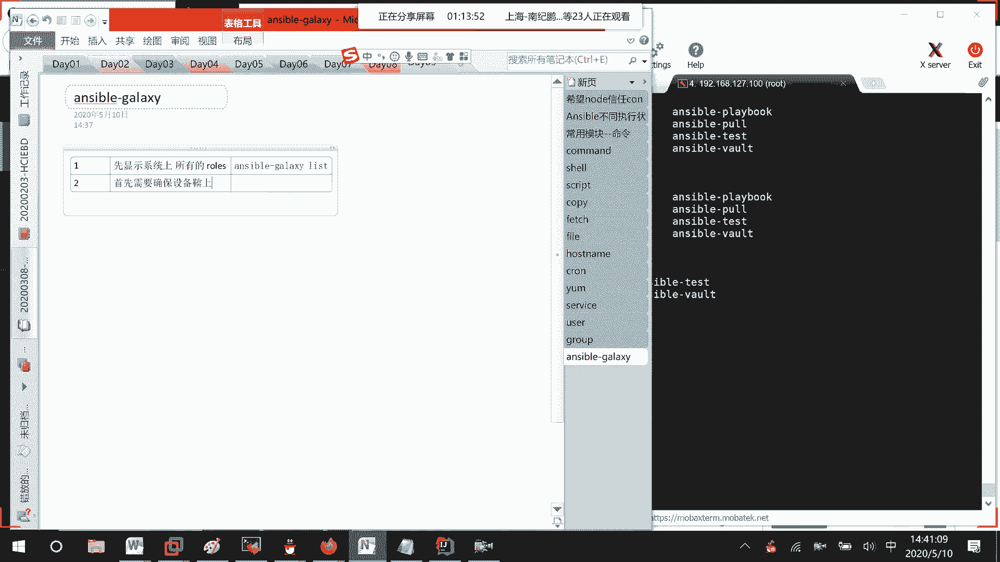

如果说你不能上网的话呢，那这样子你肯定是没有办法去进行一个下载的，知道吗，嗯我现在不能上网吗。

哦可以啊，就说稍微慢了一点而已。

能上网了之后的话呢，我们再去下载，安装，哈哈哎选择错了。

这边比如说我们就去下载这个，下载另一个人的MYSQLREDIS，下这个人的mysql robot，就就这条命令嘛，Answerable glassy in store。

然后呢就那个人的名字点MYSQL就可以了。

但是显示的话可能需要点时间。

我这边就直接来敲，我敲了。

那是这样子吗，回车等一下的话。

在我们的系统当中就会多一个角色。

这可能在安装的时候需要一定的时间哈，我这边的话呢，因为之前已经安装过了，这边我们比如说想要去查找一下，特定的角色的话呢，有没有存在吗，那也就是说enerable glassy list x tt。

我多了一个横线XTT，稍等哈，我这名字取得太复杂了，XTT点MYSQL存不存在，哦我知道了少了一个外，然后这边的话呢他是不是就显示出来，你有一个XTTMYSQL的一个角色角色好吧。

查看特定的话呢，就是说list后面跟上特定的一个名字就可以了。

然后接下去的话呢，因为我们都说他这可能时间超时了哈，所以没成功没关系啊，我们都说角色的话呢，它是对我们剧本的一个调用嘛，那他这是怎么样去进行一个调用的呢，它其实十在下载下来的时候的话呢，就这样子。

你看这都说了，存在于哪里，对不对，他的话呢存在于我们的root unstable，rose下面对于我们这个XTT来说的话呢，Defence handers。

然后呢task template就是说它的一个模板变量，这些信息都是一些YMYM的一个文件，如果说我们需要修改的话呢，就去修改相应的一个目录就可以了吗。

知道吧，其实它就是一把一个目录的结构给下载下来，这里查看rose的结构，就是把一个目录呢给下载下来。

那到时候的话呢，如果说你想要去进行一个修改吗，比如说这里哈more，Rose，这边的话呢，比如说XTT它里面的话呢不是有task吗，task里面的话呢，这边就定义了哪个用户能进行一个登录吗。

这边的话呢就显示在进行一个登录的时候呢，哦是默认是从当前主机去进行登录的，然后呢输入一个用户名和密码，去获取一下它的一个权限是怎么样嘛，然后的话呢去进行一个登录，对不对。

my circle user去进行一个登录吗，对吧。

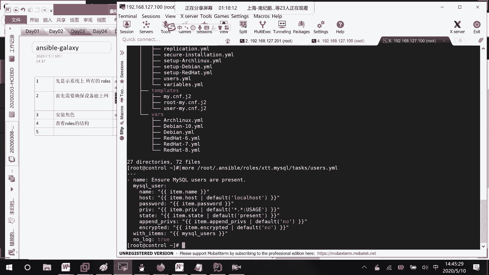

这个的话呢，就是说和我们用户管理相关的一个文件，你到时候的话呢，自己可以对这边去进行一些修改吗，好吧，我们下午的话呢要不要学一下这个剧本文件。

怎么样去进行一个写，进行一个写K发现的话呢，这个剧本文件，首先它这里面呢你可以去写很多个任务，然后的话呢，任何任务之间用这三个横线去进行一个分隔，但现在的话呢，你也可以不用这三个文件去进行一个分隔。

就是说这个三三条线的话呢，不是不是必须的，然后的话呢这里每一个任务横线，name横线和name之间是有空格的，冒号冒号空格再去写这个任务的一个名字，所以它这里的话呢对格式是要求非常严格的。

横线空格内冒号空格这样子，而且的话呢就好像我们之前在写脚本的时候，是不是用花括号去把一个语句段给括起来，他这边就完全看的是缩进在我们八版本当中，还好哈，有时候在换行的时候呢，它会自动的给我们缩进一下。

在七版本当中，完全要你自己去用tab键或者空格啊，去进行一个排布的，八版本当中的话呢，嗯它稍微智能一点点，稍微智能一点点好吧，那好这里的话呢。

现在我们可以看到不是有两个角色在这。

角色在这里吗，现在这里第六个，如果说我想要去根据已有的角色。

去生成新的角色呢。

创建新的角色，那很简单，你把他的一个目录去进行一个拷贝不就得了吗，叫做最下面的，比如说gr e e，Oh my sql，他的话呢我去对它进行一个拷贝，拷贝成什么呢。

比如说也放到root unstable rules下面，叫做HC一点MYSQL，然后因为它这是一个目录，所以就是RP就是说啊强制的连父目录的话呢，都去进行一个拷贝嘛，线，这边。

我们再来看一下他的角色情况是怎么样子的，你看是不是就多了一个我们的HC啊，刚才这个MYSQL的话呢，他也下载成功了，对不对，等一下，这边你就可以这样子。

直接去进行目录的一个复制它的一个新角，新角色的话呢就创建起来了，那好现在角色的话已经有了，如果说我想要去进行一个删除删除的话呢，它有两种方式，方式一，既然你创建可以通过复制目录的方式闹删除。

是不是可以去删除目录的一个方式啊，然后这里方式二，就说用一个常规的删删除角色的一个命令。

他这边的话呢角色管理就这样子，减减help，你看呃，这边好像没去写，写的信息不多，诶稍等一下，这里信息就稍微可能多一点了哈，我连remove都看不到，连remove都看不到，这边看到的信息不是很多哈。

那我这边就直接跟你们去讲吧，第一个删除。

比如说我把HC的给删除掉，Rm rf root，因为在unstable下面rose hc e，然后这个时候的话呢，Answerable glassy list，你看这个的话呢，HC是不是就没有了。

然后接下去的话呢，还有一种就直接使用角色删删除的一个方式嘛。

Answerable glassy remove，比如说我想要把这个角色给删了，回车，你看他这个的话呢，是不是就说成功的去进行一个移除了，再来list一下，是不是就只剩下这两个角色了呀。

这个的话呢就是说怎么样去进行一个删除，然后还有的话呢，我们下面来看一下，叫做，这个啊先来看那个吧，我想一下啊，先来看这个unable console。

因为我们之前的话呢。

在写一个enable的命令的时候呢，是不是整条写完了之后去提交。

去进行一个运行啊，这个的话呢unstable console的话呢，它就是一个交互式的一个方式，交互式的一个方式，你在这里面的话呢就可以去用table键啊，去帮你进行一个补全嘛。

我们之前的话呢在写单条命令的时候，Enerable web m，比如说shell a这边make dir，你按tab是没有用的，但在这里enable console里面稍等哈。

你看这里就说make a mi，DIR他这些的话呢就说可以去使用tab键，只是有时候的话可能不是特别的灵敏吗。

好吧，这里支持tab功能，然后下面这边的话呢我们来看一下，这里我们已经启动了之后。

进来的时候的话，默认他是不是出现了一个提示符的一个信息啊。

咱们来看一下这个提示符啊，首先这边提示符的话呢，第一个root表示到时候的话呢，以什么样的一个用户在远端进行一个执行，执行用户的信息or表示对哪些NO的进行执行，也就是说像我们那个主机清单表单中嘛。

all的话呢就表示所有所有，然后接下去的话呢这边是不是有一个三啊，表示从我们的主机清单表单中的话能解析出来，总共有三台主机，然后接下去的话呢，这里F10表示什么，不是F12F5，F5表示什么意思呢。

就是说同时并发数，也就是说一次性我先执行舞台整顿整，等这舞台执行好了之后呢，我再去执行下午台的一个信息嘛。

这边的话呢就好像说哦，因为我现在如果执行二的话，那所有的信息是不是，所有的主机是不是都要去执行啊，比如说我要我想要去切换主，怎么样去切换呢。

Web1，你看是不是就从二变成了一个叫做web1的，一个形式啊，接下去的话呢，如果说你想要去设置一下并发数呢。

对吧，有时候我可能觉得嗯五的话，那太慢了，我设备性能也比较好嘛，那这边focus10，你看是不是就从舞台变成了一个十台。

然后的话呢我想要去看一下当前，执行祖宗。

主机明细有哪些，我们之前在查看的时候，是不是用list去查看，像他现在也是一样。

可以用list的方式去进行一个查看好吧。

然后的话呢如果说你不知道怎么用，打个问号去问嘛，他的话呢，就会把所有的命令呢都给你们去罗列出来，只是说稍微慢一点而已。

稍微慢一点而已啊，然后下面这边的话呢，我们再来看一下它的一些执行命令嘛，就比如说我现在的话呢，想要去显示YM元项目源。

在显示的时候呢，我们是不是可以使用那个叫做command的一个模块，要么reporter list，对不对，或者的话使用shell的一个模块去看一下吗。

我看。

你看是不是有或者的话呢，这边是，就直接这样子就好了，就不需要什么M哎呀。

还有的话呢每次都要去写主机啊，就不用这样子去写了，知道吧，如果说想要去显示时间呢，那是不是就这样子啊，share dt就可以了，我就不去执行了，如果说想要去停止vs FTP低档服务呢。

那这边模块的话呢，之前我们学过了，是不是service name谁呢，Vs f t p d，然后接下去我们要做的事情叫做state，等于STOPPED，进行一个stop呢。

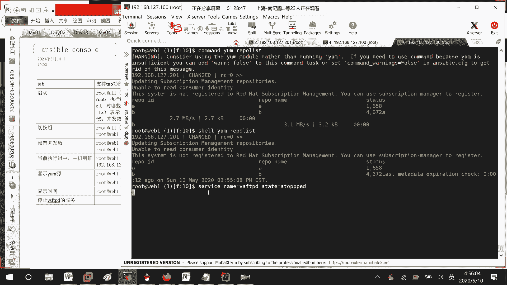

进行一个stop嘛，对不对。

然后呢等一下去检验一下就可以了，看这个服务的话呢有没有去进行停止吗，啧啧啧，你看是不是就是一个inactive的一个状态哦，多了一个P，我这边给他study一下吧，因为她哎呀少了一个T，等他执行完，先。

是不是就可以了，就类似这样子的一个信息。

然后接下去的话呢如果说你都已经执行好了。

就想要去退出这个交互式的一个结构嘛，ex i t就退出来了，好吧。

这个的话呢就是我们之前模块怎么用，在这边的话呢去使用一下就可以了，然后接下去的话呢，我们来编写一个最最简单的YM文件，这边的话呢先跟大家来介绍一下YM吧，好吧啊，这个的话呢。

要么其实你可以把它想成是一个叫做标记语言，因为他参考了很多种语言，它其实你们在官网上，就是说它的一个站点上去看的时候呢，说它不是一个标记语言，最开始的时候，但后面的话呢在定义的时候，又说是一种标记语言。

标记语言，他这个的话呢不是我们unstable特有的，很多软件都可以去使用，只是说unstable的话呢，可以去使用这个YM的一个结构。

然后它有什么样的一个特点呢，可读性非常的好，比如说我这边的话呢，之前去写了一个，就这个我的话呢想要对哪台主机执行，用哪个用户去执行任务是什么呢，这里给它一个名字，然后下面这边的话呢就说，要对是的。

所以这个的话呢不是它特有的，然后这边的话呢就是YM的话呢，呃使用YM模块对哪个服务去进行一个安装，所以的话呢可读性非常的强，然后他也非常的好实现它这个执行的话，那就从上到下这样子去进行一个直行吗。

这边的话呢简单的去介绍一下，它的一个语法格式是怎么样子的，这边刚才说了，一开始的时候在在一个答案的，就是说在一个压码文件当中，如果说有多个信息的话呢，用三个横线去把它去进行一个分隔，然后接下去的话呢。

这里就是一个一个play的一个信息嘛。

一个一个的play，一个一个的剧本对吧。

然后的话呢你看一个剧本当中去写，他这边的话呢，因为post remote host，他们是是不是一个叫做评级的一个状态，所以这边缩进是一样的，这里多一个回车的话呢，没有关系，主要是为了好看。

各个模块之间去进行一个区分嘛，如果没有空回车的话，那也没关系，然后你看task，我有很多个任务，第一个任务一个列表，第二个任务一个列表，第三个任务一个列表，每一个任务之间的话呢。

呃任务前面的话呢用一个横线来进行一个标注，进行一个标注，他这个程序的话呢，主要是通过缩进去进行一个理解的，所以呢你们缩进一定要注意，这边的话呢还有一个什么东西呢，它它这个脚本和我们的LINUX一样。

对大小写的话呢是严格区分的，所以的话呢你不要觉得这边start我能不能都写，写成一个大写，某一个字大写好看一点嘛是不行的，他对大小写是敏感的，然后接下去的话呢在一个代码模块当中，完整代码当中。

这个name还有的这个task是必须要有的，task host task一定要有，缺少的的话呢就是不能去进行一个执行，然后还有的话呢是什么东西呢，我想一下，还有一个就是说我们平时在写这个。

压码文件的时候呢，后面结尾基本上要就说y ml或者y ml。

就说便于去进行一个区分嘛，好吧，其实我讲了这么多的话呢，一个非常重要的注意缩进，第二个注意空格横线空格host冒号空格再写。

直remote user。

冒号空格再写值对吧，然后接下去的话呢，第三个就是说区分大小写，然后接下去的话呢，第四个建议在写压码文件的时候呢，结尾要么就是说y ml，要么就是YAML吗，好吧，就这几种形式那行，我们这里的话呢。

因为还有比如说playbook的一个模块，没有去进行一个测试嘛，我们就简单的去写一个playbook好吧。

啊我想一下CD forcible，比如说midi20510，啧啧啧啧啧，然后这里的话呢，我来创建一下VIM最简单的一个hello，点雅马文件随便去写。

诶等一下。

然后呢里面去写什么呢，说一开始是不是三个横线开头啊，你不写也没事的，接下来host是空格表示在哪里进行执行，这边如果你要注释的话呢，他也是用井号去进行注释的，知道吗，对谁进行执行好吧。

然后接下去的话呢remote它的一个user，比如说以什么样的一个用户去进行一个执行，稍等一下。

我先写好吧，后面的话呢你是可以去进行一个注释的。

注释的话呢，人家是不会去进行一个执行的，然后接下去的话呢，那这边好了，我是不是要去写任务啊，就比如说我这边的话呢有个最简单的任务name，去print hello，好吧，就是说在对方上去进行一个显示。

可以显示出一个hello，我们的话呢这边是不是有很多模块command share啊。

是不是都可以啊。

比如说我现在要去用command的一个模块冒号空格，运行user bean下面的一刻去打印出我们的一个hello，所以这边的话呢你们去看一下它的一个结构。

是这样子的，模块冒号空格，内容参数，诶。

看清楚了吧，上面这里的话呢就是一个任务的名称。

上面这里就是一个任务的名称。

好了之后的话呢就很简单，保存退出，保存退出，如果说你想要在远程上面去。

进行一个直行的话呢，诶远程上面去进行一个执行的话。

那怎么办呢，那也就是说unstable我们的playbook，它有很多参数可以去选，我们的话呢就讲几个平时比较常用的，就一个check。

也就是说是一个空运行，我先去检验检验我的样文件有没有问题，空运行，先跑一遍嘛，如果没有问题的话。

那我再去进行一个执行吗，可以吧，这边answerable playbook大C，后面这边的话呢，就跟上你这个叫做亚马的一个文件嘛，叫做hello嗯。

我看一下，然后这里的话呢他是不是就报错了呀。

这里就比较头疼了，嗯line2，But maybe else，估计是难道是web1，应该后面不能注视吗，我把注释信息给去掉吧，Hotsks，我写错了哦，哦哦对对对对，是的，我这边少了一个S。

他这报错的位置也太不准确了。

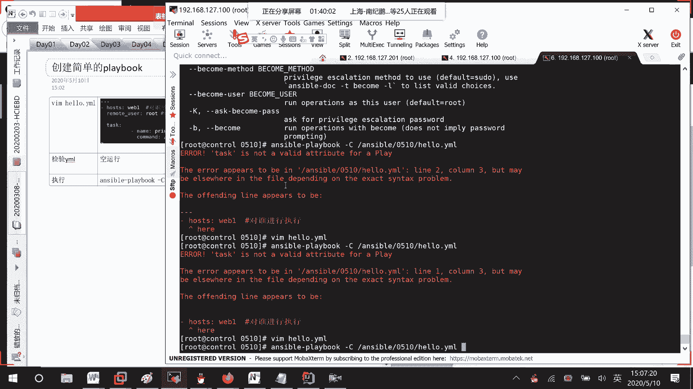

等一下我先去截个图，再截个图。

Hosters tasks。

等一下我找一下在哪，Unstable playbook，大CENERABLE，然后的话呢hello，哎现在运行了，他这里的话呢就说play task，然后呢去收集一下变量。

然后这就说OK然后这里的话呢就说略过，然后这边的话呢去进行一个运行，OK成功了一个有没有改变呢，没有任何改变，然后这里的话呢去进行了一个略过对吧，因为我们没有修改嘛。

回车这样子的话呢才是进行一个执行。

我好像GC没有去掉哈，哦去掉了对。

然后你看但这个的话呢确实在运行的时候呢，结果我们是看不到的，但确实是运行了，确实是运行了，好吧，那好有时候的话呢你们想一下，像我这个压码文件在进行用户登录的时候，如果说我这边去写了一个密码。

他的话呢是不是直接让别人去看，直接让别人去看我们的一个java文件的话，我们这边去对我们的playbook去进行一个加密，叫做VAULT，对他的话呢就说对playbook，进行加密啊，解密啊。

这些操作，首先的话呢我们来看一下它的一个帮助信息，Unstable，啧啧。

但这个用的也不是很多哈。

首先这里第一个就说。

直接就创建一个加密的文件，也就是说有些的话呢你可以是先创建了，创建完了之后再加密码，还有一个的话呢就直接是创建加密文件。

这个的话呢是解密，然后接下去这里的话呢就说去编辑。

加密文件。

还有的话呢VREW查看加密文件，然后这里的话呢还有一个叫做解密呃。

加密，还有一个的话呢，rick key就相当于我们去修改密码哈。

好吧，有这几个，现在这边的话呢，你看啊，Cat enable，0501，Hello，直接能看到，如果说我想要去进行一个加密呢，Answerable，然后后面的话呢去跟上，你想要去加密的一个文件。

Answerable，这里的话呢加密加密的选项还没有写啊，啧啧啧，你看这里的话呢，就让我们去输入密码，比如说我输入ROT123。

他让我去确认一遍就成功了，然后现在这边的话呢，就比如说我再去查看一下嘛。

cat是不是就是一个乱码的一个信息。

就不再是我们正常的一个文件了吗，好吧，然后下面这边的话呢就比如说现在看不到了，我现在的话呢想要去对它进行一个编辑。

怎么办呢，就这样子unstable，然后这里edit，后面的话呢去跟上这个文件名就可以了，然后呢他会要求你去输入我们的一个密码，我的密码ROOT123嘛，回车就可以去进行一个修改了，知道吧。

然后行这边的话呢，就比如说我就想要去进行一个查看呢，把这里改一下嘛，V i e w，然后呢也会让你去输入密码。

你看是不是就看到里面的东西了，但你用cat的话呢是看不到的。

然后接下去的话呢我们要做的一个事情，比如说对它去进行一个解密嘛，R o o t123，你看就解密成功了，这个时候的话呢我们去进行一下cut，是不是就可以看到里面的东西了。

好。

然后接下去的话呢，就比如说我在进行创建文件的时候。

就直接对它进行一个加密，那就是说这里，correct吗，然后呢里面的信息是这些好吧，先让你去输密码，还要去确认一遍，然后比如说，我的话呢把信息复制进来就好了，现在你看再来cut。

是看不到里面的东西啊，就这样子，如果说在创建的时候呢，就这样子，这个时候的话呢，我可能觉得这个ROOT的密码的话呢。

我用的太多了，我想要去修改密码呢，Rekey，先让你输入一下原来的密码，然后的话呢输入新的密码就可以了，好吧。

这边的话呢是去进行一个加密的一个操作，然后在这里的话呢。

基本上我们的一些命令全部讲完了，然后的话呢呃在刚才的话呢，也讲了一个基础的playbook，对不对。

Playbook，然后现在的话呢我们来看一下，就好像说我们这个playbook做起来了之后，它的一个流程是怎么样子的，我就不不再给你们去画，你们就来看一下就好了，这边的话呢是我们的一个用户嘛。

用户的话呢去编写play book里面的话呢。

就有很多个play快驾校，稍等一下，就像这里的话呢一个play嘛，然后下面你在横线，比如说host web2是不是另一个play啊。

对不对，这边的话用户就会把play play book，因为它放到了我们unstable上面，对不对，ENSABLE节点上面提交上去，unstable的话呢就去调用里面的一个一个play信息。

然后呢分解成一个一个任务，这个task不就是里面的一个一个任务嘛，对不对。

然后呢去调用相应的模块，这边的话呢调用的就是一个command的一个模块嘛。

有时候的话呢比如说去调用YM的模块，share的模块啊，或者调用一些插件，根据我们的主机清单信息，远程登录到主机去进行一个执行，是不是就这样子啊，就这么一个流程非常的简单，那好这边的话呢呃我们来看一下。

我们现在的话呢，来学习一下它这里面的一个结构是怎么样子的。

结构是怎么样子的哦，雅马，首先的话呢，它这里的话就说结构是用空格来进行一，个展示的，第一个它的一个组成结构，structure空格展示，还有的话呢它的一个序列序列的话呢，嗯sequence。

他这里的话呢就是这样子嘛。

一个像一个像一个像平级的时候。

对不对，这里的话呢用横线来表示各个线下，然后呢映射也就是说map，他这里的话使用一个叫做键，对的一个形式就是说用冒号去进行一个分隔嘛。

比如说name，它的name是它的一个属性值是多少，command具体的一个命令是多少，它是使用这样子键值，对的形式去进行一个表示的。

然后这边的话呢你看这个序列，他这边用横线去进行一个开头嘛，所有的元素我们这边的话呢都用横线去开头。

稍等啊，你看就比如说我们刚才这边的话呢，他就一个任务，如果说还有任务可不可以呢，可以呀，比如说show哦对吧，那这边command，冒号这边就是我看一下，忘记了。

user being dead也是一样的，就这样子就可以了，他的话呢如果有多个条目，你看第一个任务，第二个任务是不是用这个横线来进行分割啊。

这种的话呢就是列表的一个形式，列表的一个形式。

就像这里呢一个play，接下去的话呢如果还有另一个play。

你再去打横线，然后横线host是谁嘛，去进行一个执行好吧，然后这边的话呢键值对他的话呢，有时候我们也把它称之为一个叫做字典的，一个形式嘛。

字典的形式的话呢，这边嗯在写的时候嗯比较简单哈，首先的话呢，就比如说我们最简单的一种字典形式，我想一下，Command，你可以这样子就是说一行一行的来写，然后还有一种形式的话呢，你可以去打一个花括号。

比如说这边name等于a name，冒号RHCSA，然后呢，然后接下去的话呢就是说第二个键词对逗号，command冒号，他的话呢比如说叫做user beecoach o，就这样子也是可以的。

就这几种形式全都是可以的哈，我来试一下哈，unstable playbook减大C，11号could not found的，应该是这里格式的话呢，有点小问题有点小，我又写错了吗。

等一下我看一下这种格式的话有点问题啊，那就不要这样子去写就行了，像上面那边的话呢，就是嗯name show command，你就这样子去进行一个显示就行了，好吧啊，那行这个的话呢是他最最基本的一个结构。

是怎么样子的，我们看到了，接下去的话呢我们来看一下我们这个叫做playbook，它的一些核心元素，首先刚才的话呢一再强调，是不是有个东西叫做HOSTERS啊，这个的话呢就表示执行的远程主机嘛。

因为我们play book当中他的每一个play每一个动作，因为play book就剧本，剧本当中的每一个剧，他是不是就想要去让某一个主机啊，或者某一些主机，然后呢以指定的用户去进行一个执行啊。

所以呢像这些主机，事先要在清单当中去进行了一个定义，这个清单的话呢，就是我们之前看到的answerable hostas，这里面已经有定义，好的好吧。

然后这里的话呢也是一样的，在写主机的时候，第一种方式就是这样子表示的话呢，是单一的一个小组吗，上市之前的课呢，我们来回顾一下单一的主，然后接下去的话呢，如果是一个单台主机呢，你也可以这样子，就这里。

比如说192168127。201嘛，然后下下面的话呢，如果是针对一个网段呢，你也可以这样子，127新号码，但是呢需要事先在host里面去定义了，然后接下去的话呢，如果是两个小组的定级。

也就是说group1group里面有的group1group2里面有的，我呢全人都要去进行一个执行，是不是就可以了，然后这里的话呢接下去小组的交集，也就是说我两个小组当中同时都有存在的。

我再去进行一个执行，然后呢还有一个就是去，叫这是什么呢，distinct吧，也不是排除吧，就说group1存在，但是在group2中嗯，就说是怎么样呢，group1中去除，和group2重合的主机。

比如说group1里面有123，group2里面如果说有二和三的话，那好等一下的话呢，只有第一台设备会去执行这么一个操作，好吧，他的话呢就是前面去把这个符号，改成一个感叹号就可以了，去进行一个排除嘛。

所以这主机的话呢能写的形式非常的多，非常的多，这边的话呢我们来看一下，就很简单，如果说我们要在远端的主机上面，去创建一个文件该怎么办，对对就host现在这边有了吗，稍等我等下再去写吧，然后接下去的话呢。

是不是还需要有一个东西叫做task，任务嘛你要去做什么样的一个操作，对不对，做什么样的一个操作，然后的话呢在这个task当中，playbook当中它的主体部分就是我们的一个task考。

如果说你有多个task的话呢，它是从上往下逐一去进行执行的，一个一个去进行一个执行的格式的话呢，就是一个name，还有它的一个模块信息，就这样子name模块信息。

name模块信息就是说它的一个书写格式的话呢，有两种，格式一的话呢就这个model model，然后呢冒号里面的话呢就是一些参数argument，然后还有一种的话呢叫做action，然后的话呢孟浩。

然后接下去什么样的一个模块，什么样的一个参数，模块和参数之间的话呢，不要去使用冒号去进行分割了，就说直接使用一个空格去进行一个分割，就说有这两种形式可以去进行一个操作好吧。

我们现在这边的话呢简单的来看一下，我们就去做一个创建一个任务。

创建一个任务是干嘛呢，重新写一个VM，比如说test1吧，test点YMYMYML，然后的话呢我要做的事情是什么呢，在远端去创建一个文件，在远端去创建一个用户。

再把并且把远端的一个叫做vs f t t的话呢。

给移除掉，就这几个动作，就这几个任务啊，任务一，而在远端创建文件任务二，就说在远端，创建用户任务三移除远端。

上的哪个用户呢，我看一下，它的一个这个用户好吧。

我把它给移除掉啊，那你们看上面那些就好像说host什么的，很简单，那也就是说task怎么去写嘛，第一个任务name冒号空格，然后接下去的话呢，是不是就要去写你的一个任务的一个名字啊。

最简单的比如说correct file，接下来的话呢因为要创建文件，是不是可以调用我们的一个file模块是怎么样的，name等于在哪一个目录下面，我们的话呢创建什么样的一个文件。

因为要创建文件state的话呢，是不是应该等于fire啊，哦不对，等于touch啊，然后接下去创建用户啊，移除远端上的user，0511用户。

这个的话呢先让你们自己去写一下，看你们的话呢有没有理解好吧。

你们的话呢，把这整个就是类似于这样子的文件写出来，然后截图发群里，这边的话呢给大家15分钟时间加休息，去做一下，做完了之后的话呢，我来讲哈，你们在这边的话呢是都没有人做出来，是都没有人在做啊。

那我不管你们了。

我就管自己去写了，你看这边比如说vim写错地方了，V i m unstable，然后这边的话呢比如说叫做practice，点YM文件，首先的话呢这边进来第一个三个横线，可有可无，说过的posters4。

就比如说针对于web1来执行嘛，remote user root去执行对吧，然后接下去的话呢task，第一个任务名字，比如说就叫做correct fire，然后呢他的话correct创建文件的话。

我们是不是可以使用file的一个模块，name等于在哪里创建呢，在temp下创建，比如说这叫就叫做fire0510，然后呢stayed，因为我们创建的是一个文件，所以跟TARCH对不对。

接下去的话呢第二个，要做的一个事情的话呢，就correct user了吗，那我们这边用一个user模块可以吧，name的话呢，嗯没说没说的话呢，就随便去创建一个吧，Test user0510。

然后接下去，我们这边的话呢比如说是一个删除用户，这边还是一个用户的一个模块吧，这边name什么用户呢，user0510这个用户，然后state等于ab set，就这样就好了。

就这样就好了，对不对，后面的话呢有哪些主机啊什么的，后面怎么说进我现在才看到哈，哪里后面，叫做哦，你这是我的文件吗，这是我的吗，不需要说这样，你说这一块吗，这就是一个用户的名字。

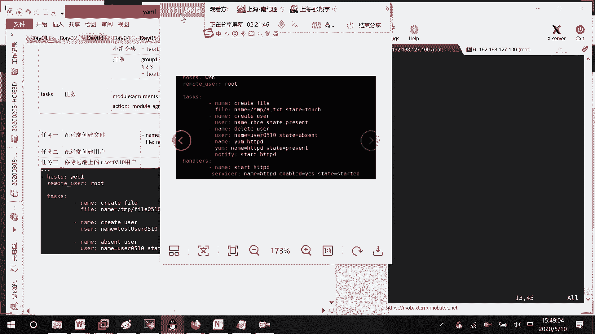

就是用户的名字，就这样子就好了，然后现在这边的话呢我们来检验一下，ls temp目录下fire只有一个file1，我比如说把这边的文件先都删掉，Rm rf temp。

现在的话呢它下面是不是就是一个空的呀，然后这里的话呢我们来看一下，叫做get我们的user0510存在的，那这个的话呢叫做test user，啧啧0510它的话呢是不存在的对吧。

我们来执行一下这个压码文件，Answerable playbook，你的话呢不放心，先对它进行一遍空运行吗，等一下，Ok ok，改变，然后呢这里就说删除用户可以的，就是说它会有两个修改嘛，都成功的那行。

那我现在把这个给去掉嘛啊，去完了之后的话呢，咱们再来去看一下嘛，好然后你看K3个修改，因为创建了文件，创建了用户，移除了用户嘛，来看首先0501有了吧，这个用户是不是没有了，time下面文件是不是有了。

说明我们这个压码文件的话，那是没有问题的，没有问题的，然后这边的话呢我们来改，有时候的话呢，就比如说我们想要去安装一个软件吧，GN冒号这边的话呢想去install vs FTP地。

然后呢是不是要使用这个YM的一个模块名字，Vs ftpd，有时候我敲的快了，就敲了两个D，对不对，然后这里的话呢下面我去创建一个0501，这样子去创建一个新文件，就我这边的话呢。

我想我想要去表达的一个意思是什么呢，如果上面这里执行错了，下面这一边会不会去进行一个执行呢，因为不是一直说。

他是按照顺序去进行一个执行的吗，如果他这个task的一个执行，从上往下依次执行，这有个问题，如果上面哪个任务出错了，啧啧啧。

下面的还会去执行吗，你看这里，首先这里的话呢去安装vs FTP是不是就出错了，然后好就一个就出错了，我们来看啊，刚才的话呢这个文件当中我去做了什么事情。

这个可以发现我们去看一下这个叫做0510。

这个有没有去执行吗，ls s pp文件是没有创建，他这个的话呢是这样子的，遇到哪一个task出问题了，后面的就不执行了，后面的就不执行了，如果说我这边来调整一下顺序，在前面这边的话呢，我再来一个。

Gun name，Correct or，why啊，比如说fire这边的话呢，就name等于temp，下面fire new0510好吧，State touch，我们来看一下new的话呢。

等一下能不能去被创建，也就是说这个new能不能创建，然后如果new创建了的话，下面这个能不能创建啊，稍等，你看收集变量创建新的文件，创建了，你看你又是否创建了好就没了就结束了。

因为第二个任务出错了嘛，如果说他是一次执行的上面哪个任务出错了，后续的所有task不执行，那这个的话呢是不是代价就比较高了，所以在这边的话呢，有时候就是说嗯有问题的时候呢。

我们希望他的话呢能去执行怎么办，如果task是有错误的，如何预防它，这边的话呢有两种方式，第一种方式其实也就是说，让这个脚本执行完了之后，退出的代码为零，是不是就可以了，因为就是说执行错误的时候。

他的话呢退出的代码。

不为零，所以的话呢在这边就会爆出这样一个错误嘛。

我只要让他退出代码为零是就可以了，然后接下去第二个方式，也就是说遇到错误的时候呢，我去忽略它，忽略错误不就可以了吗。

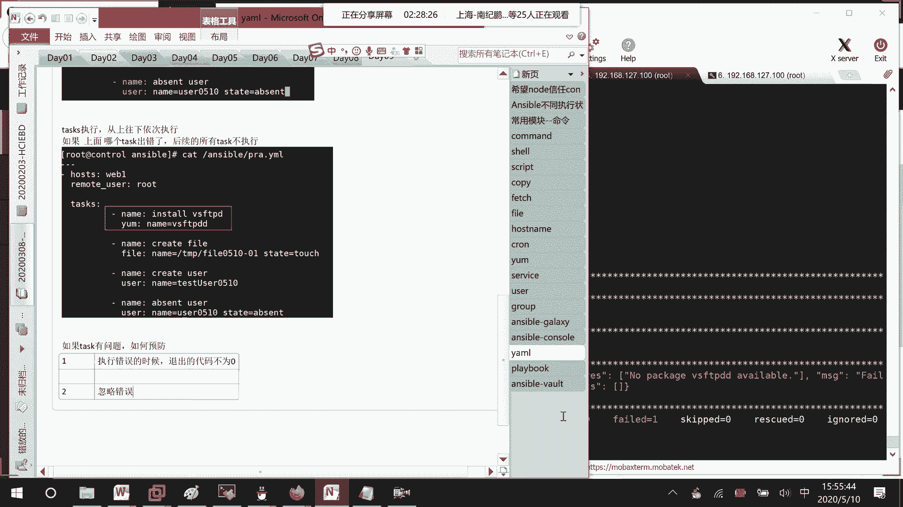

我先来给你们看一下第一种情况，第一种情况的话呢就这样子，因为像这个的话呢是在进行安装，我觉得很有可能出错，或我就说让他最终不管怎么样，全都是对的，这样子一种修改方法。

修改完了之后的话呢，我们看一下这个叫做零一。

它能不能去被创建，因为上面这个叫做new发new的话呢，它已经被创建了，因为我们的压码文件是不是有个密等性啊，被执行过一次了之后呢，就不会再被去，就不会再被执行吗，稍等一下诶，我看一下嗯。

等一下等一下我看一下哪里写错了，叫做呃雅马name，这个东西是这个大小写吗，诶等一下我看一下呀，哦哦哦写错了，前面的话呢就不要使用这样，直接使用这个shell就可以了，模块写错了哈，好在运行了，等一下。

我们主要来看一下这个文件没生成吗。

零一这个文件，好慢，稍等一下啊，你看线的话呢，这个叫做VSFTP，它是不是就没有报错了，你看铃音文件的话呢，是不是也生成了，说明这种情况是可以的，然后还有的话呢我们再来看一下，就是说第二种改法。

比如说线下面这边的话呢，让他去生成一个零二的一个文件嘛，不是这样子去改，就是说忽略忽略的话呢，怎么样去做呢，In the ni n g o r e，下划线ERRORS冒号TRU，所以有错我就忽略他嘛。

我们的话呢等一下去看一下，零二这个文件的话呢，能不能被创建起来。

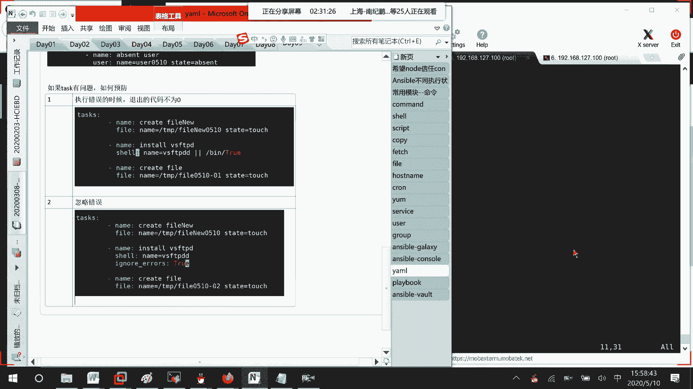

好我们这边来看一下啊，你看零二是不是被创建了，然后这边的话呢他是不是也没有报错。

对不对，所以这两种情况的话呢，可以去解决我们task当中有问题，然后导致后面的话呢不能做的一个问题行吗，然后接下去的话呢我们来看一下，我们来看一下嗯，我想一下看什么情况呢。

我们刚才是不是说到叫做unstable的话呢，它有一个叫做幂等性的一个问题吗，也就是说执行过一遍了之后，后面相同的命令再过来的话呢，它是不是就不会再去进行一个执行了，不会再去进行一个执行。

那这边的话呢我们来想一下，如果说现在在我们的服务器上面。

它本身的话呢我给你们画个图清晰一点，不然的话可能讲着讲着就乱了，比如说这里啊这台node节点上面，它去运行了一个叫做HTTPD的一个服务，然后现在的话呢嗯我刚刚去把它给安装起来。

目前的话呢读取到的一个配置文件，在第一个场景下，它读取到的HTTPD里面的话，配置开启的是一个八零端口，那好现在这个时候刚刚安装好，我给他去启动服务了，接下去呢后面有一个修改，修改是什么呢。

第二个我这里的话呢对HTTPD的一个文件，它的端口的话呢改成了8080，然后的话呢，我那个叫做YAMA的文件是怎么样去写的呢，我们来看一下，首先第一个，稍等啊，这边的话呢就是说。

首先他的第一个操作是什么呢，去安装我们的HTTP的一个文件，第一个安装HTTP，然后接下去第二个我们的control这边，HPDPD可能已经编写好了吗，传递给，我们的node节点，这个时候的话呢。

他这个CONFIG文件里面呢端口是一个80端口，它是一个80，然后接下去第三步我们做的事情的话呢，就是对服务进行启动，也就是说一个压码文件当中，他就这样子把文件传递给node，然后的话呢去启动一个服务。

然后接下去的话呢我们看啊，这边就是刚才说的两种情况，第一次它是80，那我们的话呢到时候去弄的节点上看，使用那个net stat去看的话呢，可以看到监听的端口是多少，是不是看的就80啊。

然后接下去的话呢他这边端口不是去改了吗，对吧，文件把它给复制过去了，这个时候的话呢，如果说你对它进行一个启动呢，因为我的服务是本身就已经启动着的呀，所以的话呢它就不会再对我进行一个启动。

它现在读取到的信息还是一个八零的信息，因为这个启动，我本身就是就是说，我本身状态就是已经是启动的，我们这个answerable的话呢，它有个密等性，所以的话呢就不会重新去启动。

那也就是说现在的看到看到的一个信息的话呢，是一个八零的信息，是不是有错误的，对不对，那如果说像这种情况，就是说有时候配置文件改了，这边的话呢，又对服务想要去进行一个重一起的话。

我们需要做什么样的一个操作呢，需要做什么样的一个操作，像这种场景，我们需要有一个叫做handle，就这里我加到这里来哈，HANDLERS这个HANDON的话呢，你可以把它想成一个叫做触发器的一个形式。

就好像说到时候的话呢，我们做某一个任务的，就说做某一个task的时候，如果说配置文件它不是发生了一个修改对吧，配置文件不是发生了一个修改，那好这边的话呢就说要做的一个事情。

在这里就加上一个handle h a n d l e r，后面的话呢就跟上，到时候的话呢要执行的那个触发器的一个名字，或者就是说提示的一个名字是谁，是谁，知道吧，嗯我看一下HD4name就说跟上。

如果说某一个文件发生变化了，到时候的话呢又需要你去进行一个响应的话呢，你就在这里写，就比如说我们现在这一个场景的话呢。

这样子是不是就应该就是说啊再把这个文件，如果说有新文件传递过去的时候呢，是不是要去跟上一个HD，那到时候的话呢，就知道你这边有一个新文件传递过去，那我就会去更新它里面的一个信息嘛，有些人在想。

我这文件已经传递过去了，为什么现在的话呢还可以去进行传递呢，如果你文件发生了修改，就好像大小啊，或者它的校验值是不是都发生变化了，所以人家可以再去传递过去，明白吗，我们现在的话呢把这个案例去做一下好吧。

接下去这个HANDERS，然后下面这边的话呢，嗯我们来看一下这里流程去写一下，首先第一步我们的话呢node安装我们的HTTP服务。

你的话呢可以在这台control上去进行一个安装，或者的话呢，或者的话呢也可以直接在这个叫做node上面，去进行一个安装，ym install httpd嘛。

因为之前亚目原我们不是已经做好了吗。

所以的话呢还是比较建议在这边直接去做诶，诶诶错了。

然后这边的话呢安装好了之后，第二个我们的话呢，等一下，是不是希望我们的controller去给我们的node传递文件，那好这个文件的话呢怎么样去传递。

首先CTRL上面的话呢是不是需要有这个文件，那你就可以这样子嘛，在你的一个controller上面的话呢，也去把这个服务区进行一个安装。

因为这个软件安装呢需要一点时间，我事先的话呢先把它给装起来了。

那好，因为我主要是想去获取到。

它的一个配置文件的信息吗，我看一下，啧，好，这里的话呢，就是说你把它安装起来了之后的话呢，是不是就可以获取到copy etc HTTP configure HTTP。

然后的话呢比如说就拷贝到answer able，下面叫做HTTP，就叫源文件的一个名字吗，Answerable，你看是不是就多了一个HTTP点configure的一个文件。

好吧。

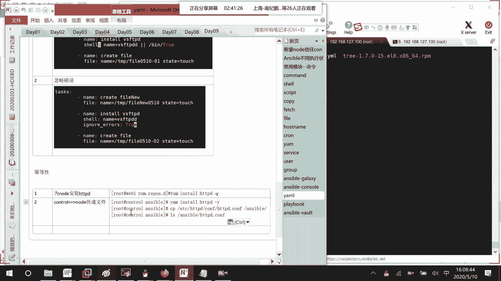

那好线的话呢，我们来看一下它这边的一个监听端口是多少，VM这个文件把它的一个叫做监听端口。

他这边默认就是80嘛，我们先不去改好吧，就80，接下去的话呢第三步我们去编写雅马文件。

压码文件的话呢，刚已经说过了，主要的步骤的话呢，就那三步，一个就说是嗯安装软件软件，我们事先装了，等一下脚本就快了吗，第二个的话呢传递配置文件，第三个的话呢重启服务嘛，那好vim test HTTP。

点雅马文件。

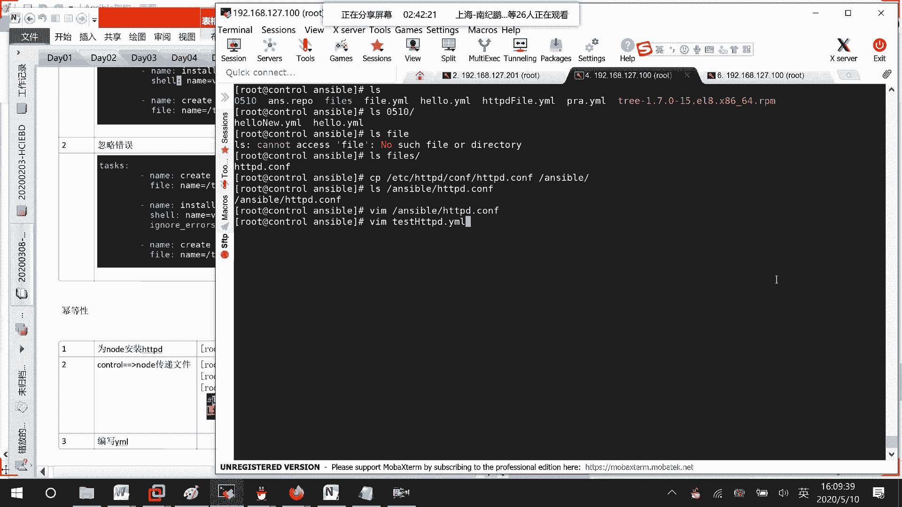

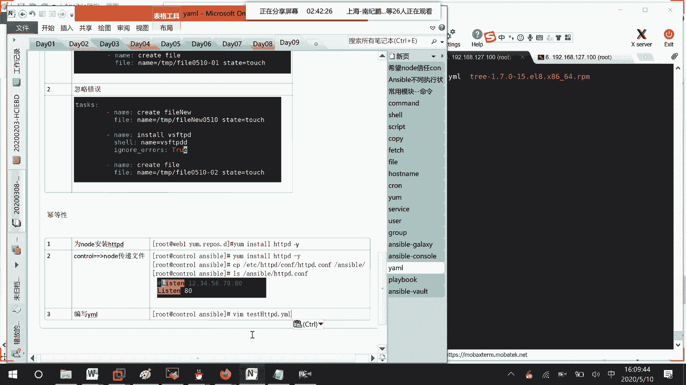

里面的话呢我们来写第一个host针对于哪台主机，第二个使用哪个用户去进行执行，然后接下去我们的第三个任务有哪些，第一个任务，比如说in store HTTP d，那它的一个叫做是不是使用YM的一个模块。

name的话呢，等于HTTPD嘛，接下来第二个任务就说copy config fire吗，那这边使用file的一个命令，然后呢，本地的一个路径是不是就在我们的unstable下面。

叫做HTTPD点CNF啊，然后接下去的话呢是不是要拷贝到远程主机，DT等于etc HTTP lecnf上面去啊，然后接下来的话呢我们要做的事情name，比如说start service。

然后这里用的是不是一个service的一个模块，然后的话呢name谁啊，HTTP低吧，干嘛啊，我的话呢是不是要给他started的一下，或者restart啊，叫做，就STARTTY的吧。

就这样子started就说让他去进行一个启动吧。

就这么几个操作。

好吧，好这里的话呢保存一下，然后接下去的话呢我们去运行一下嘛，Unstable playbook。

运行完了之后呢，第四步我们去node上查看端口。

HTTP的端口到底是不是我们的一个叫做八零端口，查看命令的话呢，可以用这条命令net stn t u l p，去grape一下和HTTP相关的信息吗，等一下哈，啊，等一下等一下，Rm rf etc。

Httpd config，再来一次，因为我之前做了一下测试，啧啧啧啧啧。

因为你们一开始的话呢不会有这么多个问题。

你们直接看到的话呢，应该就会出现的是一个八零端口，等它运行完了好吧，Copy，我看一下啊，Cat test l s etc httpd config，这没有问题啊。

LSENERABLEHTTPD康菲哥诶，这个也没有问题啊，我看一下copy fr哦，我写错了模块怎么写成fire了，应该写的是copy啊，写错模块了。

写错模块了哈，应该写copy模块，而不应该写film模块。

运行一下，运行完了之后的话呢，再去查看一下端口，啊。

然后这边等一下端口查看到的是一个八零。

然后接下去的话呢我们在control上修改配置文件，然后发现修改了之后的话呢。

人家是没有任何反应的，没有任何反应的。

你看现在是不是一个八零啊，终于出现结果了哈。

虽然是一个IPV6的关系哈。

那好接下去的话呢我们在这边去修改文件，vim enerable叫做HTTP点CONFIG，把它改一下嘛，改成8080。

改完了之后呢，干嘛呢，把压压码文件再去执行一遍吗。

执行完了之后呢，去看一下我们node上面它的一个运行端口吗，第六部，node上查看端口。

发现的话呢没有改变，还是我们的一个八零端口，还是我们八零端口，这就说明的话呢什么东西呢，虽然你文件改了，但是他这个服务的话呢，没有重新去进行一个读取，没有用没有用，啧啧啧啧啧。

那如果说我们希望它能进行一个，重新读取的话呢，怎么办呢，第七部叫handle，就说触发，如果你有改变，那就去执行我为你去设置的某一些操作嘛。

好吧，你看这边执行完了，这里还是没有改变，你看这边GRAP8080etc HTTP configure HTTP。

是8080啊，是8080，但是的话呢就是没有改变实际的端。

监听端口的话呢，就是没有改变。

那我们现在要做的事情给他去添加一个触发器，就handers vim enerable test雅马，然后下面这边的话呢怎么样去进行一个定义呢，你们来看一下pandas，这边的话呢和task它是对齐的。

然后接下来的话呢这边N比如说restart httpd，那用的是不是我们的一个叫做service的一个模块，SERVICE嘛，做什么事情呢，对HTTPD干嘛呢，叫做restart，对不对。

那这边的话呢我只是定义起来，怎么样去和这个叫做copy去关联，就是说有文件变更了之后，为什么我就要去进行一个重启呢，就在这里你去写一个NTNNOTIFY，就说有改变的话，你就要去执行。

hinders里面的respect HTTP的一个信息，你也可以执行多个，有多个的话呢。

就用逗号去进行一个分割就可以了，明白吗，下面这边的话呢你可以想成定义它的一个功能。

上面这里的话呢下面有这么多个功能，你可以不断的去进行一个调用嘛，只要有文件修改，到时候的话呢，就是说就可以去执行我这个操作了好吧，我这边的话呢对于我们的HTTP文件的话，再去进行一个修改。

比如说改成808099好吧，如果不修改的话呢，它是不会再拷贝过去的。

这边修改完了之后呢，那我们要做的事情就去执行我们的YM文件。

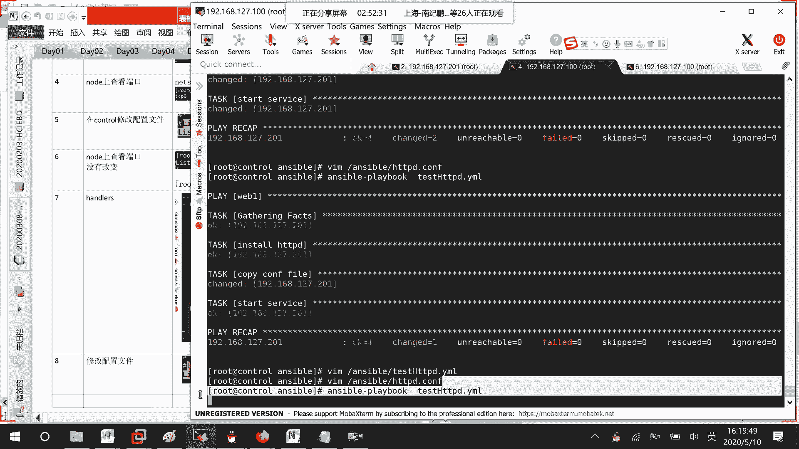

执行完了之后呢，第十步在node上检查我们监听的端口。

可以发现会改成8099的，如果不改的话呢，就是我们哪里做错了，文件还没拷贝过来，8080就没有了吗，要查找8099对吧，然后呢监听的端口呢是不是也是巴黎九九啊，所以这个的话呢。

就是说你某个文件在发生变化的时候。

跟随着你还要去做什么动作，就可以在这个HANDERS里面去进行一个定义，然后进行一个调用，能听明白吗，今天的话呢我们就讲了一个最最基础的，就是说单个playbook，它怎么样去写它里面的一些关键因素。

比如说host怎么去写task，怎么去写task的话呢，顺序去执行对吧，如果有，如果说某一个模块进行变化了，我怎么样去触发其他的一个操作好吧，今天的话呢主要内容讲到这里，过下次课的话呢继续去讲剧本。

然后的话呢再去讲我们的变量管理啊。

