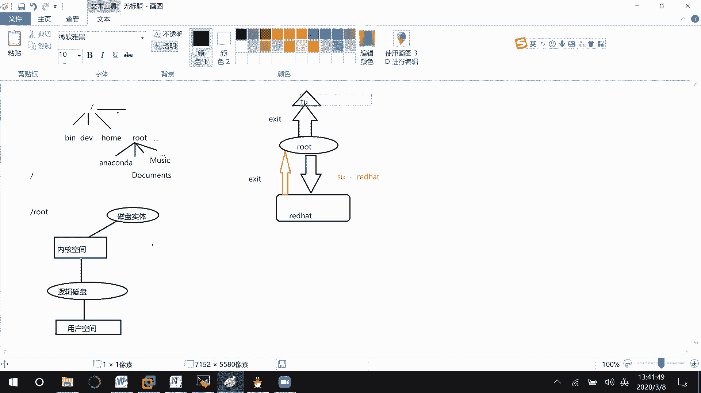
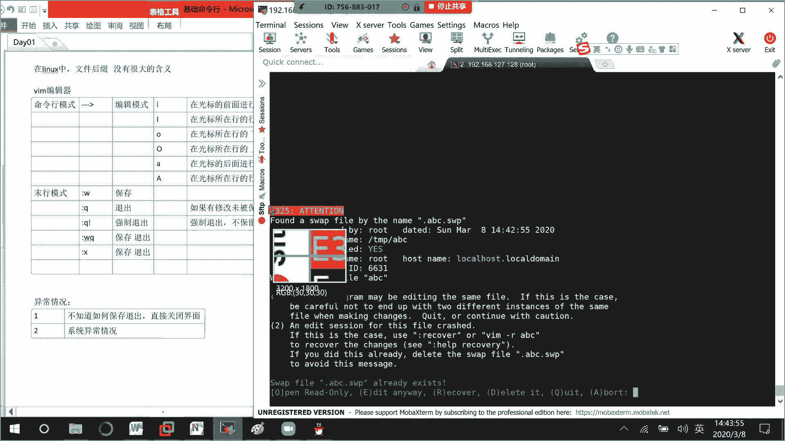
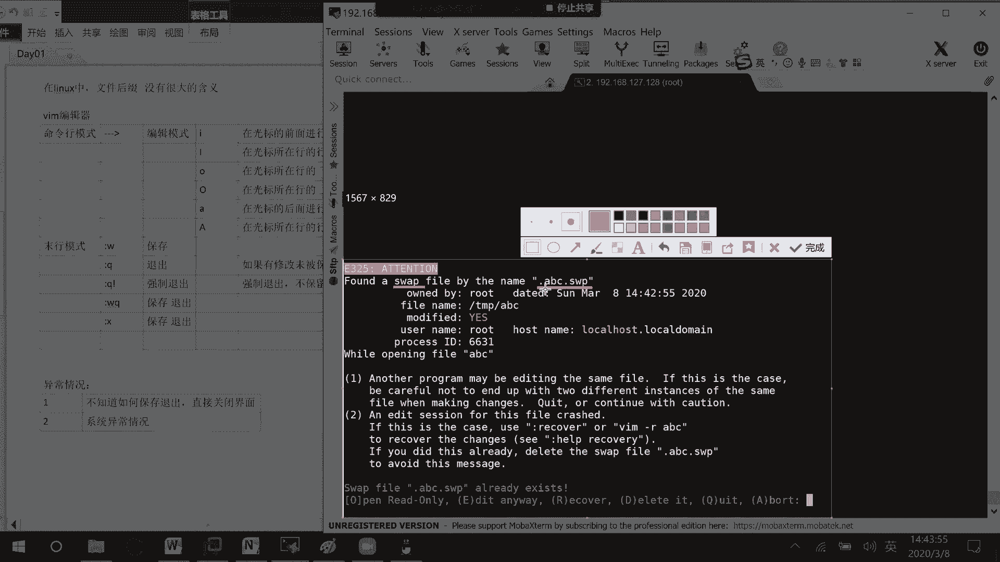
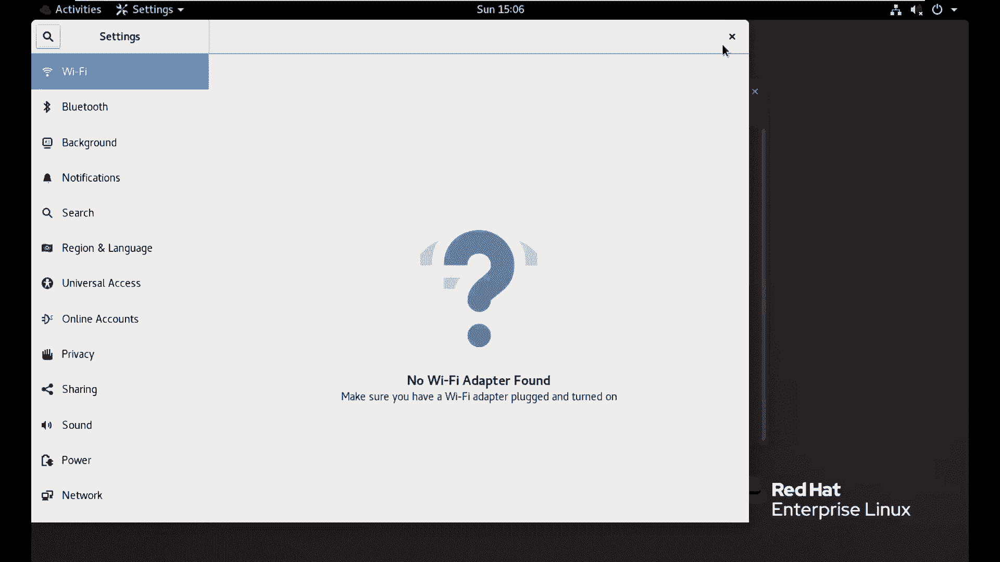

# 01 RHCE8.0视频教程【45课时】 - P3：20200308-RHCE-03 - 六竹书生6682 - BV1m84y1f7ss

上午的话呢我们就讲完了，这个叫做基础命令行，对不对，然后下午的话呢有一个比较重要的内容，叫做VRM编辑器，像这边的话呢在讲vim之前，我们先来讲一个东西，就是文件的创建。

就是说普通的文件怎么去创建目录的话呢，怎么样去创建，还有的话呢怎么样去进行一个文件的删除。

好吧，首先的话呢，就比如说前期你们在开进行操作的时候，建议大家都在这个temp目录下去进行一个操作，如果这里进来了之后，你看tap目录这边的话呢，LS杠L是不是可以看到很多类型的一个文件。

其实这边就两种类型，一个是普通的文件横线开头的，还有一个就是引力开头的目录，对不对，这边我们先来操作文件，对文件的操作，先来删除一下，删除一个文件的话呢，怎么去删呢，RM后面跟上文件的名字就可以了。

回车他这边的话呢会问你要不要删除，看到了吧，就是如这边的话呢会问你要不要删除，你输一个Y，他的话呢就会把它给删除掉了，你看LS杠LA开头的是不是就没有了，这个的话呢只有是管理员的时候会去询问的。

如果你是一个普通用户的话呢，去下删除的时候呢，他倒不会询问，为什么呢，因为管理员他权限比较大，他就是怕你把一些文件的话呢，进行了一个错误的删除，明白吗，那这个的话呢，为什么同一条命令。

不同用户使用方法不一样呢，这里的话呢我先给你们提一下，这个就和用户自身配置有关系了，就说嗯你们的话呢应该都知道，环境变量这个东西，就比如说我要去执行LS，我是不是肯定在哪里设置过了。

就说在什么目录当中去设置过了，告诉他去哪里找LS，他就能找到，这个也是一样的，就是说有配置，像我们root的话呢，我自身的配置在哪里呀，是不是应该是在嗯自己的加目录就root下面。

然后root下面的话呢有很多文件，其中我们来看一下这个buprofile special的一个定义，这边的话呢嗯这边还没有看到啊，稍等一下，这边只有这些信息啊，不是special，我看一下RC诶。

稍等你看在这，因为就是说在root下面的话呢，有很多对用户进行配置的一个文件，这个的话呢我们后面会去说，现在的话呢你们就来看一下用户自身的配置，我们来看一下root的配置，它配置文件有很多个。

我们现在呢就看其中的一个配置，叫做因为墨的话看配置吗，root r c在这里的话呢，你看ALICE表示什么意思呢，就命名的意思，RM等于2M杠II，这个就就相当于就是说我root用户执行RM的命令。

相当于执行了RM杠I就等价的一个关系，能明白吗，就说起别名a l i a as起别名，就给一个命令的话呢，去起一个别名，那这样子的话呢，你看像这边就我执行RM r o t。

执行RM相当于执行RM杠I能明白吧，我们来看这个叫做杠什么意思呢，稍等哈，这里I就说这边的话呢，嗯你每一次在移除的时候，我都要去得到一个授权，所以的话也就相当于是一个询问的意思嘛，然后现在我们来看一下。

如果说我切换到我的普通用户去看一下，切换普通用户，我这边命令的话呢会滚起来去讲，你们来看一下我这边怎么样去切换普通用户呢，S u，你们是不是都创建了一个red hat的一个用户。

SU空格横线等一下也会详细跟你们去说的，你们来看一下回车，你看我来看我自己家目录下面的东西，Home red hat，连BRC你看叫做有没有这个什么ALICE什么，就是有没有这个命令啊。

ALICE2M杠I的一个命令，他是不是没有啊，他直接只有这些信息，那我现在如果CD到temp下面，你看我RM package回车诶，稍等一下，这里的话呢是为什么呢，因为就是说这个文件它的一个所有者。

是一个叫做这个文件是root创建出来的，你看这个文件的所有者是不是一个root用户啊，所以我read heat没删嘛，那现在的话呢，比如说touch123回车，这个是一个创建命令，创建文件。

就相当于我们的话呢在桌面上右击，新建一个文本，123，就相当于是这个动作好吧，那你看现在的话呢，是不是就有一个123的文件，是我自己来创建的，比如说我这边rm123回车，他有没有去队友进行询问。

他就没有进行询问，他就没有询问，因为的话呢只有管理员的时候，他起了一个别名，像我普通用户的话呢，是没有起别名的，这个的话呢能听明白吗，这能能不能听明白，就是说呃因为有文。

因为就是说在我们家目录下面的话呢，会有对用户进行的一个配置，我这个root用户，为什么在删文件的时候需要去确认呢，因为在它的配置文件当中的话呢，给这个RM进行了一个取别名，就相当于如果我执行RM的话呢。

是RM跟I，那如果是一个普通用户呢，我们去看它的配置文件的时候，发现RM没有别名，那也就是说就是一个删除，就不需要去进行一个确认吗，这个能不能听明白，能听明白的话，在群里回一下一，如果不能听明白的话呢。

跟我说一下好吧，起别名就相当于是起一个别名，稍等一下好，那没有问题的话呢，我这边就是继续了哈，基本上有一两个人回我就可以了，那好那接下去的话呢，我刚才SU的话呢。

是不是切换到一个red hat普通用户啊，这个时候的话呢，如果是超级管理员切换到普通用户，我们的话呢不需要输入密码的，不需要输入的，那现在的话呢，因为我们从root到了一个red hat，那现在的话呢。

回到我们那个root用户，你看这是一个red hat用户吗，怎么退呢，EXIT就退出来了，你看这边的话呢就到了一个叫做root的一个用户，好吧，EXIT退出上一层级，如果说你前面没有SU。

如果你按EXIT呢，我就退出了这个终端了，能明白吗，我再给你们退一下，回车是不是就没有了，所以这边的话呢呃给你们去画一个图。

稍等一下，就是说嗯首先的话呢，这边比如说我们是一个，一开始在登录进来的时候呢，就是一个ROT用户没有问题，那我的话呢怎么样去切换到一个普通用户呢，比如说这个REDHAT，我们这边的话呢用了一条命令叫做。

Su，空格横线read cat，我是不需要去输入任何的一个呃密码的，然后现在的话呢如果说我不想要再red hat，如果说我想要退出呢，那就是说往上走，那这里的话呢用的一个命令就是一个EXIT。

如果说现在在root这个层级，你再去输入了一个EXIT怎么办，我就说断开了和这个终端的一个连接，这边的话呢就是说退出的一个状态。

这个就是一个退出的一个状态，所以的话呢就是说用户怎么样去进入。

用户怎么样去退出，你们这个呢需要知道一下，好吧，这先跟你们去讲一下，那好那现在的话呢嗯好，然后现在的话呢我们来看一下，刚才就说桌面上右，就是说touch这个命令，就相当于是桌面上右击去改了一下。

他的去创建了一下它的一个文件了嘛，好吧，Cd tp，那好文件怎么去删除呢，我们知道接下来我们来删一个目录IM，比如说删除这个吧，VM这个吧，VV926的这个回车，这边的话呢我们现在是一个root用户。

他在删的时候就说不能去移除它，因为它是一个目录，所以说我们如果现在是对目录要进行删除的话，用RM的话呢就不太合适了，RM命令的话呢适合于，它的话呢适合于我们的一个叫做普通文本，如果说想要去啊普通的文件。

如果说现在我们想要去移除目录怎么办，remove b i r remove目录嘛，你看这个目录回车，它就把它给删了，LS杠LLS就好了，你看这VM的话呢是不是就只有一个了。

所以这个呢RM dr它的话呢适合于三，适合于就是说目录是这样子的，如果说我现在的话呢，能不能用IMDIR来移除我的一个文本，比如说这个叫做DEBUS，Debus，发现的话呢不能移除，为什么呀。

DEBUS的话呢，它不是一个DEBUS点log不能移除，为什么呢，它不是一个目录，所以这个RMDIR的话呢只适合移除目录，那行，接下去的话呢咱们再来看一下嗯，我先把这条命令给你们复制一下。

接下去我们再来看一下，那像这个呢我作为一个管理员，每一次去删除文件的时候，他都来问我的话呢，特别的麻烦，那我有没有办法，就是说在删除的时候，我就是不需要他对我进行询问了，你看RM help这边的话呢。

是不是有个选项叫做F忽略文件，它就是说不需要授权了，也就是说我强力强确定要把它给删了，你不要再问我删不删了，知道吧，你看比如说RM，因为它选项是F吗，比如说要把这个DEBUS删了，回车有没有问线。

是是不是就不问了呀，那这就行了，所以这里RM横线F后面的话呢，去跟上我们一个文件的名字，DEBUS点log那行，这个的话呢删除文件强制删除，强制删除文件，不需要询问对吧。

然后现在下面这里呢我们看到这个RM的话呢，它是不是有很多选项，这个杠I呢是徐温就算了，这个杠二呢等一下去看这个杠DD是干嘛，Remove empty directors，什么意思，移除空的目录。

那也就是说如果说有个空有一个目录，它里面没有文件的话，那我们是不是可以用2M横线D，来进行一个移除啊，这边我们来看一下怎么样去进行一个创建目录，创建目录的话呢，它的名字是这样子的。

make m a k e d i r只是缩写就可以了，我比如说创建一个文件叫做第一，你看这边是不是就有个D5rm横线DD1，他这边因为是一个管理员，所以他会问我要不要移出，我要移出。

我这边再来创建一个叫做D2，如果说我在删除的时候，不希望他去询问呢，是不是跟一个F就可以了，诶，等一下应该是移除，第二你看是不是就可以了，就直接去删除掉嘛，所以在这边的话呢，你是一个目录的话。

可以用这个嗯减D选项可以删除空的目录，那你看就像这些文件这些目录的话呢，它可能里面本身就有东西了嘛，L s van bell，诶，这个刚好是空的，我看一下能不能找一个有有东西的system啊。

稍等a blue b l u，你看像这个文件的话呢，它里面有东西，也就是说目录当中有东西，我2M减DF可以删吗，他如果说目录里面有东西，你用这条命令就行不通了，因为里面有东西你不能删，为什么呢。

你们来想一下，如果说我这个目录里面的话呢，这个目录里面有文件，123，我把这个文件给删了，那目录里面的东西怎么办，是不是就没有办法去存放了，所以如果一个目录是不为空的话呢。

我们是不是要先删除目录里面的东西，再来删除目录本身啊，如果目录里面有信息，我们要做的事情，我们正常人的想法，删除目录里面的内容，再删除目录本身那行，那这个的话呢，怎么样先去删除目录里面的东西呢。

我们来看一下选项嘛，好吧，这里有个叫做井R什么意思啊，移除目录和它里面的一个条目，这个减二的话呢就是说是递归删除，也就是说先删除目录里面的东西，再删除我目录的本身，知道吧，你看RM减二这个目录回车。

他这边的话呢是不是就说问你要不要去删除啊，Y吗Y嘛，也就是说它里面有几个文件的话呢，就会问你几次能明白吧，如果说你是强制想要去删除呢，嗯稍等一下，如果说你确定你一定要去删除的话，这边你跟这个选项RM解。

首先D要删除目录对吧，是不是要把里面东西给全部删除掉，F也就是说把所有的信息的话呢，这个杠2F就2M减2F，就说删除目录里面东西，减F呢确定一定要去删除吗，杠a color的，知道吧。

那这样子的话呢他就不会去询问了，这边RM减RF后面的话呢，跟上目录的名字就可以了，就是说你这个D的话呢可以都不用去跟，比如说我这边再来跟一个RM r f d system a，比如说叫bot回车。

它是不是也也一样的，都是删除啊，只是说你现在在删的时候呢，这个D选项都不都可以不用去跟了，这样子确定删除，其实的话呢你们来看一下我这条命令的话呢，能不能去删除一个普通的文件呢。

比如说这个package j RM rf回车是不是也能删除掉，也就是说像这条RM杠RF的话呢，它不仅仅适用于目录，他的话呢连我们的普通文件的话呢，它也是适用的，但是因为这条。

特别是管理员在执行这条命令的时候，威力是不是太强大了，如果你一不小心IM杠IF斜线，这个就是删库到跑路，这个比删库还严重，把所有的信息全部给删掉了，所以这条命令因为就是说嗯太危险了。

所以呢你们在执行删除的时候呢，稍微小心一点啊，之前有个实习生的话呢，他就把用户把home给删除掉了，所有的配置文件都没了，这个家目录删除掉的关系还不是很大，大不了，到时候自己再去配置一下嘛。

但是如果你是这个斜线的话，那就大了，就相当于把整个C盘，D盘E盘全部给删除掉了，知道吧，这个文件的话呢，嗯自己注意一下，第一好吧，这个的话呢就是说普通的创建文件，这个的话呢就普通的一个创建目录。

那这边的话呢我们来看一下，有时候我在写目录的时候，是不是从这个斜线开始写，有时候的话，那为什么要直接就写这个目录的名字，就可以了呢，这边我们涉及到目录的两种描述描述，方法这个的话呢有些人可能是知道的。

第一种叫做绝对路径，第二种的话呢叫做相对路径，绝对路径什么意思呢，也就是说我从根目录开始找，一直找到底层，这个从根目录，开始找一直找到文件，就从头到尾，那这个相对路径呢。

他就是说相对于我当前的附近去进行查找吗，就比如说哈我想要去找temp目录下的if config log，如果用绝对路径怎么去找，是不是要这样子l s temp if configure log。

如果是相对路径，我现在本来就已经在tap目录下了，我是不是直接就if configure log就行了，这个的话呢就是说绝对路径是从头到尾，相对路径的话呢是相对于当前的一个位置。

你再去进进行一个操作就可以了，明白吧，这种几种形式，那好现在的话呢我们来看一下这里哈，前面这个提示符，因为我们刚才的话切换用户也给你们去看过了，他这个提示符的话呢，分成了几个结构呢。

首先前面这个root表示什么意思啊，当前登录的用户是谁，这个local host呢，我的一个主机的名字叫什么，就相当于我们这个windows电脑，右击属性这边的一个名字，知道吧，给它起了一个名字是什么。

然后接下去这个temp呢当前所在的路径，它就是说最后的一个部分，为什么呢，像我这个temp它的全路径是不是TMP啊，那这TMP的话呢，是不是根目录下的叫做第二级目录啊，我就保留最后一集的目录。

然后这个井号是什么呢，超级管理员登录的提示符，他的话呢是一个井号，我刚才教你们一个切换用户叫做red hat，对不对，你看red hat是不是就是一个当前登录的用户啊。

这里local host名字是不是还是local host，然后这里波浪线一个叫做方括号呢，我我当前在的目录是不是root red hat，的一个家目录啊，我们来看一下。

你看是不是home red hat，然后这里呢dollar符号，dollar符号的话呢，就是我们普通用户登录的提示符，然后的话呢如果是井号的话呢，是我们的一个超级管理员嘛，那好这边的话呢切换用户。

刚才就是说讲了第一种SU横线red hat，那还有什么样的一个其他方式呢，比如说su repeat，你来看一下这两个在进行切换的时候呢，有什么样的一个区别，这边这边切换完成之后呢。

它是不是会跑到我们的一个叫做用户的加入，下面去啊，这里切换到用户的家目录，如果说我们直接就这样子，su red hat呢，我的目录是没有进行切换的，目录没有进行切换，这里啊稍等一下，目录没有切换。

它的话呢就切换了一个用户，我这边的话呢再来touch一个123rm123回车，这边的话呢也是可以删掉的，所以这里的话呢你们一定要注意一下，有横线和没横线的一个区别，有横线它的话呢切换用户和目录。

好用户家目录，然后的话呢这种方式的话呢就切换用户，他的话呢没有切换目录，注意一下，那好，下面的话呢我们来看一下，现在是不是一个red hat，因为我们只有一个用户啊，你们再来看一下。

我自己是不是还可以再去登录啊，因为red hat这边的话呢是不是还可以往下登录，没有办法，只有一个用户，比如说我这边还是登录到我的一个red hat下面，来好吧，这没有关系，进行多个层级的登录的话呢。

没有关系的，那好你看ASU到read，他这边的话呢是不是就让我去输入密码了呀，密码输入进去的时候呢，他是看不到的，知道吧，Su read hat，我这边的话呢加了横线也加吧。

这边的话呢它就会让你去输入密码了，这里就是red hat用户到我的read heat用户，他的话呢需要输入密码，这个不是说自己用户登录自己的时候呢，要进行输入，也就是说普通用户切换到任何用户。

都需要输入密码，但是超级管理员切换到任何用户，都不需要去输入密码，超级管理员切换到任意用户都不需要输入，这两点的话呢，你们自己要去看一下哈，那好这个用户切换的话呢，我就讲到这里过了哈。

这应该没有什么问题，那然后的话呢我们来看一下这边的话呢，它文件不是有很多吗，我们如果说一个一个的去删除文件，是不是非常的麻烦呀，我们可以发现这个命令可以删除文件，然后的话呢。

这个命令它是不是也可以去删除，我们的一个目录啊，那也就是说可以用诶，等一下错了，也就是说这个这个命令的话呢，也可以删除目录，如果说我想要去清空目录里面的信息，怎么做，清空，目录里面的信息可以怎么样呢。

RM rf是不是一定是这样子的，后面打一个新号，也就是说shift按着，然后再按一个八，新号的话呢，它是一个通配符，表示所有的信息回车，这个时候你看里面的内容是不是就空了呀，所以有多个文件要删除呢。

你们就RM rf就可以了，RM rf就行了，那好因为我们的话呢使用这个叫做BASHER的话，终端的话是不是，主要就是说想要去快一点的去进行一个操作，现在的话呢如果希望你们去创建文件，因为批量创建文件。

因为就是说像我们公司的员工，如果说给每一个人的话呢，去创建一个文本，让我们去写东西，可能前面的话呢都会以一个叫做pk e d u开头，然后横线后面的话呢，比如说一号员工，然后接下去TKEDU2号。

3号四号五号六号，那比如说我现在的话呢想要去创建100个命令，是不是要出100次特别的麻烦呀，那有没有什么命令可以去批量创建呢，它其实前面这个是一样的，touch tk e d u自己去定义的。

然后接下去横线，我这边的话呢是不是前面这些信息都是一样的，只是说后面123456不一样，那这边你就可以花括号就直接是连着的，比如说12345好吧，回车你看TK1TK2TK3TK4TK五，是不是就创建起。

像如果说我要创建十个呢，六到比如说6~15怎么办，是不是要6789十十一十二十四十五啊，特别麻烦，有没有什么快点的方式呢，六中间两个点15，我这边去加一个新的单词，比如说叫做new回车。

你看这边叫做new66789十，反正就说是不是就直接到了一个15呀，看到了没有，所以这个的话呢你可以用枚举的形式，把后面要跟的信息一个一个加上去，或者说你可以去循环，那你就用两个点嘛，比如说A到Z。

你看是不是就去创建了呀，这个的话呢就是批量创建的两种形式，我们文件的话呢可以这样子批量去进行创建嗯，目录的话呢是不是也相同的这批量创建吗，这个我就不说了。

只是说把前面的TCH改成make dir就行了嘛，我现在的话呢把里面的信息全部给删了，就没了嗯，我不应该删它，不应该删他，我这边的话呢再去创建几个吧，这边的话呢是不是就把这个呃批量的文件。

创建了几个文件对吧，那现在的话呢，你看这边的时间是一个叫做3月8号2：03分，可能这个工作的话，我应该就是说创建这个文件，我昨天就应该做了，我如果昨天忘记做了，现在再去做的话呢。

时间是不是今天的就不太好嘛，我能不能把这个文件的时间去改一下呢，修改修改文件，修改目录都是一样的啊，修改时间为什么要跟你们去讲这个呢，有时候你可能就是说把文件存在了，我的temp目录下面。

但是的话呢tap目录早上是不是说了，比如七天会把文件全部给移除掉吧，那我用什么办法呢，是不是把我这个时间更新一下，更新到今天，就是说把所有的文件时间更新一下，那这样子它的文件是不是就不会被删除了呀。

就不会被删除了吗，啊我们来看一下嗯，他的就这样子touch信号，这样子的话呢，就可以更新所有文件的一个时间诶，等一下你看刚才这边的话呢，是不是一个叫做2。3分啊，这个就是我们的02：04分了，2。4分。

这个的话呢就是说更新所有文件的时间，到当前的一个时间嘛，然后或者的话呢，你比如说想要去在创建文件的时候，touch减减help法好吧，你看这边的话呢有一个选项叫做T干嘛呢。

使用一个指定的时间替代你当前的时间吗，就比如说这个文件应该昨天让你创建的，你忘记创建了，那怎么办呢，touch t时间的话呢，昨天是不是2020，然后的话呢0307啊，他这个就是说每位都两个3月份的话。

那就零三，如果是12月份就12嘛，然后如果说是7号的话，就零七不要写个七，他的话呢会认不出来的，知道吧，然后昨天什么时候创建呢，比如说九点钟创建的，创建什么文件呢，创建一个AABC文件回车。

你看这个ABC的话呢，是不是就3月7号啊，叫做九点钟去创建的，这个就是说创建文件的时候指定日期，指定创建文件的日期，这没有什么问题吧，好吧，那好这边的话呢我们就知道这些信息。

这里的话呢再给你们来补充一个，因为目录的话呢批量的去创建它是好创建的嘛，如果说我现在希望怎么样呢，在temp目录下面，我希望你的话呢给我去创建一个目录，然后的话呢在A目录下面的话呢。

你给我去创建一个叫做B目录，然后下面的话呢再创建一个C目录，你用一条命令的话呢，怎样去完成，就a tap下面有A目录，A目录下面有一个B目录，两个层级的，怎么去创建，那你看正常情况下是不是就TEB呀。

也就是说创建一个A目录，temp目录啊，不对，temp因为已经存在了tap下，创建一个AA下面创建一个B嘛，回车他这边的话呢就不行，没有这个文件或目录，为什么呢，我们是不是在tap下面的话呢。

根本就没有A目录，也就是说我现在想要去创建一个B目录，发现A目录找不到，那我这个的话呢就创建失败了，那现在这种想法的话呢，是不是应该这样子啊，首先把temp目录创建起来，创建好了之后创建A目录。

是不是再去创建一个B目录，就说先把我的父节点给创建起来，创建完了之后呢，再创建子节点嘛，那这里创建目录的时候呢，它有一个选项，你们一定要多去看帮助啊，前期有一个叫做p parents。

就是说啊创建我的一个父目录，就是说在需要的时候去创建一个父目录，也就是说这边比如说tap目录A目录，B目录对吗，如果A目录不存在的话，我把A目录给创建起来，如果说A目录存在呢，那我就不用去创建了。

直接去使用它就可以了，我们来看这个点，temp a b他说跟一个选项叫做减T嘛，那我就跟嘛回车，你看现在是不是就没有报错了，而且的话呢A目录也存在了，LS杠R稍等一下，LS这个大写的R你可以跟上。

什么意思呢，我等一下再说哈，我先把这个给你们复制一下，这个的话呢就是说啊递归创建，把你的父目录，也就是说先创建TMP目录，如果存在，不需要创建，再创建目录，如果存在，不需要创建，然后呢再创建，B目录。

如果存在不需要创建，就是这样子，那这里的话呢有一个叫做LS减大R，什么意思呢，减大R，就说把你目录下面的所有信息给我显示出来，LS减小R呢，你看如果啥都不跟的时候，他是不是这样子，按照字典去进行排序啊。

a a abc network a b CD e f g是不是这样子，如果说跟一个小写的R呢，把一些字典排序比较大的放在了前面，比较小的放在了后面，大写的R呢，他的话呢是怎么样把目录里面的信息显示出来。

如果说目录里面还有目录的话呢，那你就一层一层的给我剖析开来，去进行一个显示嘛，所以这边在讲LS的时候呢，给你们多带两个信息，稍等哈，我就放在这里吧，一个LS请R将结果反向排序，进行输出。

然后接下面这边的话呢，还有一个叫做LS减大R，他的话呢就是说呃将，所有的目录展开进行显示，把所有的信息都给你显示出来，好吧，这个的话呢嗯没有什么样的一个大问题了哈，然后的话呢我们这里的话休息10分钟。

等一下的话呢就直接去讲vim编辑器了，好不好，这样子吧，我还是直接讲吧，讲完了之后咱们再学习吧，好这边的话呢我们要来讲这个vim编辑器，这个东西的话呢比较重要，使用起来的话呢也比较简单一点。

首先第一个我这边来画一个图哈，他的话呢就相当于什么呢，相当于我们这样子not the pet打开，然后里面这里要去写东西了，他就是这样子一个记事本的一个形式，只是说他有很多的一个模式能明白吧。

那你看我先把所有信息给删了哈，V i m，比如说我要创建一个文件，20200308点TXT，在我们LINUX这里的话呢，不管你是点TXT也好，点ex e也好，它是没有任何含义的。

就是说文件的后缀的话呢没有含义，只是到时候有一些服务在识别的时候呢，需要去识别特定的一些啊名字格式而已，所以这里要注意一点，在LINUX中，文件后缀，没有很大的含义，有时候的话可能就是说为了我自己方便。

去了解这个文件类型，我去给它加一个后缀，那行这边的话呢我就叫20200308点TXT，进来了之后呢，如果我先我想要输入一个叫做V，稍等一下，我再来一次，如果说我想要去输入一个B发现的话呢。

是在这个界面上没有任何的一个显示啊，所以这里第一个乘积VM，比如说叫做20200308点TXT，我输入进去之后，他没有任何的提示，这个时候的话呢，咱们是进入到一个什么样的模式呢。

我们称这种模式的话呢叫做命令行模式，这个模式下等待你去对我输入一些控制的命令，命令模式好吧，如果说我现在想要去进行一个输入呢，因为我这个文本文件打开的话，肯定是想要进行一些内容的一个插入吧。

如果说我想要去进入一个编辑模式，我怎么样去进入，有很多命令可以帮我进入编辑模式，我们来看我点击键盘上小写的I，我就去点击一下，下面这边是不是就变成insert了呀，这个时候我再去输入B。

它是不是就可以进行输入了，这边的话呢有很多符号，小A大A小A大A小O大O，全都是可以进行插入的，那好现在我可能插入完毕了，想要退回到我的一个命令行模式的话呢，该怎么样去进行一个退出。

退出的话键盘上有个键叫做ESC的键，你去按一下就好了，你看ESC按一下，我现在如果想输B是不是又输不了了，我这边的话呢如果输入一个小，点击键盘上小写的O，你看是不是光标从上面一行跳到下面一行了。

所以这个O的话呢，就是说在光标的下一行进行插入，如果说我再按下ESC，点击大写键盘打开，我点击一下O，他的话呢是怎么样，在光标的上一行进行一个插入吧，我按一下ESC，然后我现在的话呢按一下小写。

我把这个光标放在五这里哈，按一下小写的A，你可以发现是怎么样在光标的后面进行插入吧，我按下ESC，按下大写的A，你看一下怎么样，是不是在光标所在行的行为进行了一个插入啊，好我再按一下ESC。

如果说我把这个光标移到六这里，按小写的I，它怎么样在光标的前面进行了一个插入，按下ESC按下大I在哪里，在光标所在行的行首进行插入马，所以这六个字符的话呢，它对于插入的位置是不一样的。

我这边给你们来记录一下，叫做命令行模式，我现在的话呢想要去进入到我的一个编辑模式，还有很多第一个小写的I大写的I，小写的O大写的O小写的A大写的A好吧，首先我们来看一下这个小写O是怎么样在。

光标所在行的，下一行进行插入，然后下面呢这个在光标所在行的上一行，进行插入，这个小写的I呢，光标的前面，进行插入这个大写的I呢，在光标所在行的行首进行插入，这个小写的A呢在光标的后面进行插入。

下面这个叫做大写的A呢，在光标所在行的行为进行插入，是不是有这六个字符啊，所以每次你想要去测试的话，就点击一下I，测完了之后ESC回来再测下一个嘛，明白吗，那好我现在的话呢可能就已经编辑好了。

我想退出怎么办，像我我像我text做好了之后呢，是不是要先保存才能退出啊，那好这边的话呢，如果说你想要去执行退出这些操作的话呢，需要进入一个新的模式，什么模式呢，叫做稍等一下，叫做末行模式。

末行模式它有什么样的一个特点呢，也就是说在命令行模式下，我输一个冒号，后面的话呢再跟上一些关键字就可以了，你看我现在的话呢是不是insert e s c，按一下是不是就进入到一个命令行模式啊。

比如说我想保存呢，先按一下冒号W1下它保存了，但是这个界面是不是没有退出去啊，我可以冒号Q退出去，你看这个时候再进来是不是就有东西了，我比如说再插入一些东西，ESC冒号Q他就不让我退出，为什么呢。

你已经修改了，所以他就不让我退出去，如果说我要保存退出呢，那就是冒号WQ嘛，一次性保存加退出，如果说我现在加了这些东西，我发现我输入很多东西输入错了，我不想要保存，直接退出呢，感叹号退出就可以了。

你看内行O就没有了，知道吧，所以在这里的话呢，嗯末行模式，我这边的话呢就讲了一个冒号保存，他的话呢是一个小写的冒号，退出他是怎么样呢，如果因为我如果保存完了之后，是不是就相当于修改已经被保存过了。

是不是可以退出啊，如果有修改，未被保存，不能退出，除非你保存了，如果说我的话呢，希望强制退出，不保存，不保留被修改的信息该怎么办，是不是冒号Q感叹号强制退出，不保留任何的信息。

那有时候的话呢我希望保存退出呢，那也就是说是不是这个叫做冒号保存退出嘛，你一定要冒号WQ，而不要QW没有退出再保存的，只有先保存再退出，能明白吗，因为这个冒号W的话呢经常用，所以呢冒号会进行一些缩写。

冒号X的话呢，它也是保存退出，知道吧，这里的话呢就是一些简单的，VIM的一个编辑器，它的话呢还有很多命令行的一个模式啊，比如说查找啊，替换啊，显示信息啊这些的。

我们等一下再说，现在的话呢给你们一点时间去，把这些先继续去讲哈。

刚才我们在这末行模式当中就是讲的这些命令，他这个命令的话是等价的，等价的，然后接下去还有我这边的话呢，等一下想要去进行一些文件的查找替换啊，这些信息如果说靠自己编的这个文件，是不是就不太合适了。

你看就说你们经常会遇到的一个问题是什么呢，你们来看一下。

我这边结合这里来做一下ROT123。

可能这边的话呢，我这里打开一个终端。

稍等一下CD temp里面去等一下哈。

嗯好有在录屏。

然后CD到temp里面去，我这边来创建一个文件，vim abc插入一些信息，好插完了之后，诶，我现在的话呢刚开始操作不知道该怎么退出去，或者的话呢呃由于异常原因，这个终端被关闭掉了，那好现在的话呢。

比如说我再打开终端或者其他人的话呢。

想要来编辑一下VIMABC对吧，刚才是不是就会出现这个问题啊，现在我来跟你们去讲一个异常情况，这个的话呢你们经常会遇到，就是一开始自己不知道怎么保存，退出的时候，第一个不知道如何保存退出，直接关闭界面。

然后的话呢到时候下一次再进入的时候，会出现这个问题，或者也就是说一些异常的情况，导致你的文件没有保存好，它就直接被退出了。

那你再次去编辑的时候呢，它就会出现这样子的一个提示信息，你干什么呀，发现一个swap什么意思啊，交换的一个文件吗，名字叫什么，点ABC点SWP，也就是说这个就相当于我们windows当中的一个。

叫做嗯临时文件，他的话呢就一些副本的一些信息存在这里吗，你的划线已经写入到内存当中去了，可能还没有写到我的磁盘当中去吗，所以在进行重新进行一个嗯编辑这个文件呢，它会有问题，这个的话呢该怎么样去解决呢。

他这里告诉你，第一个我们是不是应该先退出啊，退出了之后呢，你可以这样子recover就说重新去编辑它，或者的话呢你就把这个文件给删了，把这个文件比如说像R，你看是不是继续去编辑啊，解决办法。

第一步就在刚才的一个界面的话呢，点击一下啊，然后呢回车继续编辑，然后还有一种情况呢，我再来退出一下，稍等，嗯我这边的话呢继续来CD cap，你看VIMABC，还有一种呢。

你的话就是说可以按一个叫做D大写的D，把它给删了，案例删除，也就是说把原来的信息给删除，清空原来的信息，知道吧，这里的话呢主要会有这两种方式推进一个操作，这种异常情况经常会遇到。

因为有些人的话呢可能英语不太好，可能比我都差，这些东西的话呢看不懂吗，那你就要记住怎么样去处理就好了，这边他要教你吗，要么recover啊，或者要么delete掉啊，对不对，那好那行，那你看这边的话呢。

2020是不是太少了，里面的信息，如果说我想去查找的话呢，嗯素材太少了，我把早上那个文件给copy过来password，然后的话呢到我现在temp的目录，我比如说叫做test点text。

你看是不是就多了一个test的一个文件，你们的话呢不要直接去操作，先去复制一个文件过来先好吧，那好接下去vim test text，这里面的话呢有很多很多的信息，这里面总共有几行呢，45行，2487个。

是不是字符啊，他这就不是单词了，是字符，如果说我想要去显示行号呢，比如说我现在这个光标在第几行，我怎么样去看这里可以set number，你看是不是就有了啊，好，Set number，那有时候的话呢。

其实发现，如果你的一个字符把它设置起来的话呢，我这样子想要复制粘贴的时候就比较麻烦了，是不会把行号给复制过来，如果说我不想要了冒号，Set no number，你不需要按ESC。

直接就是在冒号一下就行了，Set，NO number不显示行号，知道吧，那行现在这里的话呢，如果说嗯我把行号给显示出来，如果说我现在的光标是不是在第11行啊，我想要回到第一行怎么办。

你看我是不是一下子就回到了第一行，这里的话呢就不再属于我们的一个末行模式了，就不再属于我们的末行模式，可以算是我们的一个命令行模式，我在这边的话呢进行一个插入GG，就这样子就说切换到旁首，就第一行。

第一行，如果说我想要去到最后一行呢，大写的记切换到行尾，如果说我现在想要去切换到第20行呢，二零几几就可以了，就是说20GG其实的话前面不输数字的话，那就相当于前面跟了一个一嘛。

20几G他这个呢切换到第一行啊，不对，切换到第20行，好吧，这样子的话对你进行一个切换，那好下面这里的话呢我们再来看一下哈，如果说我现在的话想要去查找关键字怎么办，比如说我想去查找和这个BN相关的信息。

冒号VN回车，等一下斜线VN不是冒号比亚N啊，他这里的话呢也不属于我们的一个末行模式，它的话呢就是我们命令模式下面的一种啊，我直接在下面这里再去写一下，比如说查找就直接斜线BIN。

那它的一个格式是不是不是这样子，斜线关键字啊，他的话呢在文中搜索关键字，你看我现在的光标的话呢，是不是在哪一行的关键字上面，应该是在啊B这一行吧，第20行的关键字上面吧，如果说我要去查找下一个关键字呢。

你按键盘上的N，他就会给你不断的去定位到下一行的关键字，下一个关键字有看到吗，这个，如果说你点击键盘上的N，他这个是查找下一个关键字，如果说你大写的N呢，查找上一个关键字。

然后的话呢我这边因为我们知道I的话，是不是进入插入模式，我把这个小写的B改成大写的B，你看小写的B改成大写的B，他现在是不是就查找不出来了呀，所以像这个直接斜线，BN是在全文中搜索关键字。

它是大小写严格匹配的，如果有一个大小写不一样，那都不行，如果说我想要去在全文中搜索关键字，忽略大小写呢，这该怎么办，斜线bin反斜线一个C，反斜线一个C，那这样子的话呢就可以忽略我们的大小写了。

反斜线C知道吧，所以这个就是关键字反斜线C，你们这个的话你要注意一下，因为到时候在考试的时候呢会去修改一些配置，相对来说修改的配置比较固定一点，那你们如果会查找的话，是不是就可以配置的更快一点。

而不需要一行一行的去看嘛，听得明白吗，自己的话呢学会去查找，那好，然后接下来的话呢，我们来看一下这个BN是查找到了，他的话呢也是这样子，下一个关键字大N上一个关键字，那好接下去的话呢。

如果说我们想要去进行一个替换呢，诶等一下，比如说我现在光标在第二行哈，我想要把这个bin替换成TKDU，怎么办，这怎么办，替换的命令的话呢，是这样子的，冒号S斜线，什么单词呢，VN这个单词替换成什么呢。

TKEDU的单词，你可以发现我刚才光标是不是在第二行啊，那我用这条命令它它的效果是怎么样子，这个稍等，我先把格式给你们写出来，这里关键字替换对吧，像这种格式是怎么样子啊，只替换光标所在行的关键字。

如果说这一行当中的话呢，没有关键字母怎么办，他就不会替换嘛，如果说这一行有多个关键字呢，只替换，第一个关键字，如果你有多个，我不会每一个都对你进行替换的，我只替换第一个能听明白吗，那好我现在替换好了。

我现在如果说想要去撤销这个操作怎么办，撤销撤销上一步操作这边有个符号的话呢，叫做U，这是不是就是undo啊，就相当于我们windows当中的CTRLZ撤销一步，那就是说用一下他是不是回来了，按一下呢。

稍等我看一下，诶哦哦不小心把中文给开起来了，这里就这个U1下，U1下的话呢，就说撤回到上一步，你就说可以不断的去进行一个撤回哈，那行这边我们再来看一下，如果说想要把这整行的关键字都给替换掉呢。

想替换光标所在行的整行的关键字，那替换的方法的话呢和这是一样的，只是说后面再跟上一个选项叫做G，你看我现在光标在第二行冒号并替换成什么呢，pk e d u对不对，斜线G诶，稍等哈哦。

冒号S叫做DKEDU斜线GA没问题啊，哦我刚才估计是不是前面少了一个S啊，对不对，所以这个的话呢并替换成一个叫做TKEDU，如果说你想要把整行的都替替换掉，就跟这么一个G就可以了。

如果说我想要去把全文的关键字都替换掉呢，想替换全文的关键字，怎么样去进行一个替换，那就这样子冒号百分号SBTKEDU就可以了，后面跟一个G，如果说后面不跟进呢，他是把每一行的第一个关键字给替换掉。

如果说直接就这样子，他的话呢就是说替换全文每行的第一个关键字，如果说你是冒号，FA冒号百分号SBTKEDUG，他的话呢把我的一个T并替换成TKEDU，它是怎么样的，替换全文所有的关键字。

所以像这个的话呢，这个G主要是控制一行当中有多个该怎么办，前面这个百分号呢，你到底是对一行进行替换呢，还是对全文进行替换呢，你看这样子是不是全都替换掉了，好吧，这个的话呢就是我们讲的一个替换。

接下去的话呢我们来看一下，如果说我们想要去进行一个复制粘贴呢，比如说我想要复制第15行到第20行的信息，放到第29行的后面，该怎么样操作，这里复制第几行，15~20，然后呢放到第29行后面该怎么样操作。

首先第一步的话呢，是不是要定位，我这边插入一个表格吧，稍等一下，首先这里第一步是不是要去定位到第15行啊，然后接下去的第二步，是不是复制15~20行的信息啊，然后接下去第三步是不是定位到第29行啊。

然后接下去第四步，是不是就是说粘贴一下就可以了，在后面粘贴嘛，对不对，我们来试一下，首先第一步定位到第15行，是不是15GG复制呢，十五十六十七十八十九二十，总共几行信息，123456是不是六行信息啊。

6YYYY表示复制，然后接下去因为要粘贴到第29行，所以定位到第29行，如果是后面就是小写的P，如果说在前面进行粘贴呢，那就是大写的P了，如果是在后面就是一个小写这边的话呢，咱们来试一下。

首先15GG诶，等一下15GG，你看然后接下去6YY19GG，哦不对，29GG对吧，你看他本来下面是一个叫做S对吧，我P1下是变成XY了，就把信息的话呢粘贴到后面来了。

如果说我想要粘贴到前面大写键盘打开，你看这边是不是就有了，就把你给放进去了，就把就把信息给放进去了，对不对，这个的话呢就是说我们复制粘贴，因为有时候配置文件呢，你可能比如说要去配置一个目录的权限。

或者配置一个用户的信息，和前面其他的配置是一模一样的，那我怎么样去进行一个引用吗，怎么样去复制粘贴嘛，就这样子进行复制粘贴好吧，像VIM编辑器的话呢，掌握到这里过的话呢就差不多了，就差不多了好吧。

然后这个呢你们等一下去练习啊，这边我们来看一下，如然后我把这个文件给关掉了哈，Q我就不保存了，那好我有时候的话呢就比如说执行if config，显示了IP地址对吧，执行日期啊，是不是显示了一个时间啊。

我如果说想要对这些结果进行保存的话，该怎么办，所以现在要跟你们去讲重定向，重定向，也其实也就是说把信息的话呢，怎么样去进行一个保存或者两个文件的话呢，怎么样去进行一个合并的一个问题，知道吧。

这边的话呢有两个符号，一个符号是尖括号的，一个符号是这样子叫做尖括号的，然后的话呢第二个符号是两个尖括号的，这有什么区别的话呢，我们等一下来看一下，就比如说现在我想要对日期的数据进行保留。

你不要再写出来了，你把它放到answer这个文件当中，我如果想要看的话，我再去打开answer是不是就可以了呀，所以就这样子把结果的信息放入到文件当中，对EATE正确的执行结果进行保存。

然后的话呢查看是不是cat就行了，刚才的话呢是一个叫做3。2分，现在如果我去显示的话，应该是03：03分吧，我再来保存一次诶，你这边的话呢是不是就可以发现我执行了两次，应该有两条信息啊，对不对。

为什么现在只有一条信息呢，这个尖括号它是怎么样去对文件进行操作的呢，先对文件的内容进行清空，再输入新的信息，知道吧，如果说我把一个尖括号改成两个呢，回车，Cat answer，你看啊，03：

03分他是在的，3。3。3分44秒是不是也在的，所以像这个就是说嗯两个尖括号的话呢，它是怎么样的文本的，后面进行追加的，这个的话呢你们一定要记住这两个符号，为什么呢，在考试的时候。

他有时候会让你去查找一个文件，把信息的就说或者查找多个文件，把查找到的内容的话呢放到某一个文件里面去，我等一下给你们去练习一下，所以这里的话呢稍等一下老师修改时间呢，我的时间不对啊，稍等一下啊。

进行追加保存。

你们这时间不对的话，没有关系啊，后面会讲，如果说你们真的想修改的话呢。

给你们来看一下，那我讲了很多了，你们应该累了，稍等一下诶，我密码错了吗，沙子如果说你们时间错了，右击设置稍等哈。

前期可以图形化界面，点点，我想一下，我现在脑子卡壳了，不是这里WIFIBRITES啊，Region，呃有没有个time的，Refresh rate，还有这个，等一下我找一下，先，啊你就说这样子啊。

就是这边setting不是打开了吗，T i m e，然后这里不就是有了嘛，对不对，然后上面这个自动时间呢不用去改，然后这里的话呢你自己可以去点击改一下时区，去改一下好吧，右击设置，张翔宇，听到了不。

就是桌面右击好。

那知道就好了，因为到时候的话呢会有个时间同步，我们会用命令的方式去改。

那行，这里的话呢我们继续来看哈，刚才的话呢是讲到了一个，一个尖括号和两个尖括号的区别，一个的话呢是清空内容，一个的话呢它是不清空内容，好吧，那现在的话呢，刚才这里它是对一个叫做正确的结果，进行追加。

如果说现在我的命令是错误的呢，就比如说我这个有时候打快了，别ta了，这个命令是不是就找不到了，我比如说要把它写入到我的answer当中去，发现我的终端这边是不是有进行一个显示。

那再来看一下我的answer诶，又变空了，为什么会出现这种情况呢，他的话是怎么样，尖括号，先对文件的内容进行清空再写入，但是现在的执行结果，诶等一下执行结果是错误的，是不是就没有办法写入啊。

所以呢清空完毕之后没有办法写入，那是不是就可以就会导致我这个文件是空的呀，会出现这个问题吗，那好现在的话呢我们想解决的就是说，如果说我这个命令是错的，那执行结果怎么样去保留呢，它默认情况下的话呢。

其实在这边前面都是跟了一个叫做一的，一表示正确的一个结果吗，那如果说想要对错误的结果进行保留呢，那这里就写一个二回车，你看线性稀释就没有进行显示了，他这里就把错误的信息进行一个保留吗。

那相同的这里的话呢对，错误的执行结果进行保留，如果说你现在的话呢是两个符号，那也就是说去把多次错误的执行结果，进行一个保留吗，那现在的话呢另一个问题是什么呢，如果说我发现我这个带子写错了，那我要去改吗。

DTE对不对，回车发现它这个结果的话呢，在终端显示了，在answer里面的话呢，是不是没有办法进行写入，所以像这样子这个一的话呢，其实是可以省略的哈，我给你们去加粗一下，这个一可以省略。

我们可以发现一个什么样的一个问题呢，如果是一它只能去写入正确的内容，如果这边是二只能写入错误的结果，那我能不能就说，我肯定我也不知道我这命令是对的还是错的，如果我希望对不管是对的还是错的。

都进行写入的话，该怎么办，有个符号叫做语的符号，它的话呢写入正确或者错误的结果都可以的，我们来试一下，比如说这边加一个铝的符号，是不是就有时间了，如果说dead是不是就有一个错误的一个信息啦。

所以呢在这里正确and错误，我们就用这个语的符号，其实这与的话呢，它是不是就是一个and的意思啊，在这里里面信息的话呢全都有一个监控，他是这样执行的哦，两个肩炮它是这样执行的，就是说一个监控的话呢。

他也是这样子去进行一个执行的，好吧，这个的话呢没有什么样的一个问题哈，然后接下去我们来看一下，就比如说现在的话呢，我们这个，好test当中是不是有很多信息啊，Cat test。

特别是以这个叫做比如说这个吧，嗯IOT的一个信息，嗯temp test，这里的话呢，第一行是不是有一个叫做ROT的一个信息啊，对吧，或者如果我想要找这个呢，QUQEMU的一个信息呢。

我是不是要一行一行找下来特别麻烦，或者的话呢是不是需要打开vim编辑器，然后去进行查找，是不是很麻烦，其实这边的话呢还有一个对文本进行搜索啊，命令叫什么呢，匹配GRAP，匹配它的使用方法是什么呢。

rap比如说你要抢QEMU在哪里去查找呢，tap下test，你看是不是就可以把这一行的信息，给你去找出来了呀，它的格式就这样子啊，rap就关键字文件就这样子进行一个查找好吧。

那这里的话就比如说我想要去看GRAP这个信息，以及它下面的三行信息怎么办，因为有时候找到这个信息，后面三行信息是对我来说比较重要的嘛，这里跟一个选项叫做横线N，这里的话呢减三，嗯稍等哈。

这里的话你看这里我直接减三，减三的话呢，是不是就说上面的三行和下面的三行，都去显示出来，这里上面的四三行，下面的三三行，上面的三行和下面的三行信息都会去显示，就这个符号，如果说我只想要去看上面的呢。

简大写的一个A哦，只想要看下面的话呢，大写的A你看123对吧，如果说我只想要看上面的呢，当大写的B123有看到吧，所以这边的话呢就是说上面的三行，下面的三行，等一下下啊，上面啊三行信息。

那好这边的话呢如果说我们查找到了，是不是想要对结果的话去进行一个保留啊，如果说现在我想要把这个结果放到我的一个，叫做ANS当中，怎么样怎么办，写入那这里的话是不是就一个尖括号，ANS就可以了。

你看cat a n s是不是，就是我们刚才显示出来的一些信息啊，这个N的话呢就是说去显示一下行号，如果说你不要这个N，是不是就行号就不要了，这个N就显示一个行号的一个作用。

就是说不要去跟上这个N就可以了，好吧对，结果进行保存，那就是说前面的话呢，反正你就管自己输命令，然后后面一个编号就可以对结果进行保存了吗，这个的话呢应该没有什么样的一个问题哈。

然后下面的话呢这边我们来看一下，就比如说嗯我的话呢我想一下嗯，因为我现在想要跟你们讲一个东西叫做管道服，比如说，我现在是不是已经搜索到这几行的一个信息了，如果说我想要对搜索搜索到的信息的话呢。

再去查找一个叫做病的一个关键字该怎么办，就是说我想要再对这个结果呢再进行一次操作，他这边可以加一个竖线，就是按住shift加上回车键上面的一个信息，我再去找病吗，你看就这条命令管道符叫做管道符的话呢。

就是这么一个符号，他这边的话呢你可以去嵌套很多层的一个操作，它是怎么回事呢，前面是不是命令一，然后竖线命令二，对不对，它是这样子的，命令一的执行结果，你看命令一的执行结果。

是不是就是这些信息作为我命令二的执行参数，你看我这个是不是，就是在它的基础上去进行一个查找，命令一的执行结果作为命令二的执行参数，知道吧，就这样子就这样子，然后现在的话呢我给你们去出一个小练习。

什么小练习呢，如果说让你们去查找啊，你们去复制一个文件过来，就在tap下面有个叫做password，好吧，自己去复制一下，你们的话呢使用cat或者什么符号，还有一个叫做head，还有一个叫做tell。

还有管道符去显示十行到第20行的信息，就是说第十行到第20行的信息，你们来看一下该如何进行一个显示，或者第11行到第20行的信息吧，简单一点，没事没事，就第十行吧，这个你们自己去操作一下。

我们继续去讲哈，你们写的还是可以的哈，首先的话呢基本上两种解法，第一种是什么呢，呃像刚才我看了验天水的话呢，cat没用没用的话，那就没用就好了，我来看你怎么去写的，我觉得他这个也是不错的。

比如说head杠N20，先把这个叫做temp下面的，因为我没有那个password，就test先把前面20行的信息是不是123，一直到20给显示出来，然后我要尾巴的10~20，是不是总共11行信息啊。

那就是这样子嘛，太杠N11行吗，你看这样子的话呢，是不是就把中间的一个叫做第几行嗯，D那个11行到第20行的信息，给你显示出来了，对不对，然后这是一种方法，然后还有人的话呢，用这种方法。

就是刚才我说的这几条命令，它都用上去了啊，cat temp这个文件，然后在这里的话呢，它加了一个横线N把行号给显示出来，然后管道符是graph graph不对，管道符的话呢是不是一个叫做head。

把前面20行信息给提取出来，然后接下去的话呢，因为我要第11行和第十行到第20行，是不是11行的信息啊，tale11是不是就可以了，你看稍等一下，那这里的话是不是就第10~20啊。

我刚才看到有个同学的话呢，好像前面先用了一个tell，后面再用个head，这个逻辑的话呢，可能稍微有点小问题啊，稍等一下我执行一下，看就是呃我刚看的是这样子，head前面十行，你在tail后面20行。

这个的话呢，因为我前面的执行结果作为你后面的执行参数，你是不是只把前面十行给选出来了，如果说你还要想想选择这里面的20行信息，能选择吗，不能因为我总共也就十行啊，所以的话呢前面的范围是比较大的一个范围。

后面的话呢要越来越精细，你不能10~20，不能这样写，要先选出前面20行信息，再从20行信息里面去进行一个选择，所以它的命令顺序是，第一个作为第二个的执行结果，第二个作为第三个的执行结果，知道吧。

这顺序稍微注意一下就可以了，那好这个的话呢就没有什么样的一个问题了哈，然后接下去我们来学习第一个叫做用户管理啊，前面的一些基础命令，我们学了我们的话呢就说打什么东西，然后这边的话呢我们来看一下。

就早上我们就学了基础的命令行，然后的话呢文件管理对吧，然后接下去的话呢帮助信息对吧，怎么样去，比如说help啊men啊，对不对，然后呢vim编辑器对不对，然后下午这边的话呢，我们再来学一个知识点。

叫做用户管理，之前的话呢在七版本当中，用户管理它的一个题目蛮多的，就是说如何去创建一个文，那如何去创建一个用户，然后给用户设密码这些信息，那这边的话呢，我们来看一下用户有什么样的一个作用。

这个用户有什么作用呢，作用很多，第一个作用我们在登录系统的时候，是不需要有用户，然后第二个像我们这些程序在运行的时候，比如说火狐浏览器啊，还有的话呢像这个文档啊，或者像这个虚拟机啊。

它是不是都会去属于某一个用户啊，稍等一下，你看这个进程，这里如果说我显示信息再显示一下的话，可以发现你看我这个admin是不是运行这些程序啊，对不对，所以这里第一个作用美系统中每个进程都做。

都需要一个特定用户去进行运行的，在我们windows当中，任务管理器，在LINUX当中呢PS就显示进程，但是呢只显示我这个绘画框的一个进程，如果说我想要去看所有的进程呢，你就AU就好了。

All user，你看这后面的话呢可能是进城，前面的话就是说属于谁的嘛，进程属于谁的，对不对，这里查看进程，PSAU后面会详细的介绍带你们去看的，然后接下去呢这是第一个。

第二个呢文件权限就是说呃权限控制，这好像上午的时候有一个文件，它是root用户所有的，我普通用户是不是就不能把它删掉，我可能设置了一个权限，可能就是说其他用户呢不能对我进行一个操作，对吧，可以来看一下。

就LS点L查看详细信息，tap下面的，你看这里是不是就是权限，它主要的话呢就是说是有这几方面的一个功能，然后这边我们来看一下，那。

这边的话呢可能啊，我把这个截图放在那里面先哈，稍等一下，可能现在的话呢，我前面摆了一台LINUX或者windows的一个电脑，你们现在来想一下，为什么我就能登上去呢，有些人说啊，你这个界面的话呢。

它出来了一个叫做让你输入用户名啊，还有的话呢输入密码的信息啊，你输入成功了就能登录啊，为什么登录呢，你看我这边用户名和密码是不是输入进去了，我的电脑会去和文档当中的某一个文件，去进行比对了。

看一下有没有这个用户，有没有这个密码，如果说匹配成功了，那你就能登录了，如果说没有匹配成功了，那就不能登录吗，这是一个本地认证，后面的话呢会跟你就是说后面我看一下啊，会讲一个叫做。

然后代码就是说服务器认证，我把信息发给远端的服务器，如果说远端服务器能查找到我这个用户，能查找到我这个密码，就让我去进行登录吗，知道吧，所以的话呢那现在我们是本地登录。

在我本地电脑上的话呢，肯定有一个文件去管理用户名和密码的吧，LINUX的话呢他为了安全起见，把用户名用户信息去存一个文件，用户密码，他的话存在另外一个文件当中，用户信息的话呢是哪个文件呢。

就是这个etc password文件，就是我的一个用户信息，然后密码呢这个shadow这个文件的话呢，就是我的一个密码文件，我们现在的话呢，就比如说先来看一下用户的信息文件好吧。

比如说cat etc password这边信息非常的多，我这边的话呢就随便去选择一个，给你们解释一下，首先这边我们可以看到他的话呢，就是说在这个文件当中，各个属性使用冒号进行分割的吧。

有时候其他的有一些文件可能使用逗号啊，或者使用回车键啊，或者使用tab键都有可能的，在这个文件当中是使用冒号进行分隔的，然后的话呢我这边给你们去打一些位置，再跟你们说一下什么样的一个含义，好吧。

你们来看，首先前面这个root表示什么意思呢，用户的名字诶，这里我好像多打了一个那个了，用户的名字，然后下面这里这个X表示什么意思啊，密码只是说密码不保留在这里。

它设置加密保留在这个叫做etc shadow文件当中好吧，然后接下去这个零表是什么意思呢，每一个人，我们每个人是不是都有一个身份证编号，用户也是一样的，这个是用户的id，然后这里这个零点是什么意思呢。

我们每个人在公司当中或者在学校当中，是不是会属于一个团体啊，或者多个团体吗，这个的话呢我属于团体的ID是多少，后面这个呢我的登录名，因为这个是我真实的名字，我是不是可以去使用艺名啊。

这个什么时候用到呢，你看你设置什么，你设置什么。

这边的话呢就显示什么信息，他的话呢是在这里进行的一个显示，所以这个地方的话呢我们也称之为叫做别名，别名在这里显示的，你设置什么，在这里就显示什么，然后接下来我们来看一下。

这里有一个叫做root表示什么意思啊，我的家目录在哪里，然后这个呢解释器的名字，因为就是说我的话命令为什么能被识别呢，也就是说我可能设置了这个解释器，它可以帮我去进行一个解释吗，帮我进行一个解释啊。

这边的话呢，因为我们不是有个red hat吗，我们来看一下它内行的一个信息，好吧，我这边red hat名字密码加密一千一千数的id，U i d g d，我登录的名字，我的家目录，还有我的一个解释器。

对不对，就这些信息，然后这边的话呢，我们来注意一下他这个id的话范围是怎么样的，如果是零的话，是给超级管理员用的嗯，就是root用户嘛，一到200它是怎么样呢，系统用户。

就是说我们静态的分配给一些红帽的系统进程，我这边写到下面去吧，就不写在上面了哈，一个是零超级管理员，一个的话呢是一到200，等一下哈，一到200，它的话呢就是说静态的分配给我们的一个嗯。

系统进程去使用嘛，这里的话呢还有一个就是200到999，他这个的话呢就是说像有一些文件，是不是系统去生成的，那这边的话呢他这个也是系统用户，这边的话呢是文件系统中没有自己的一个。

没有自己的一个所有者的话呢，他可能会分配给200到999的一些用户，知道吧，这边的话呢是系统用户户，主要是设置文件的所有者的，这样子的话呢它其实就方便方便，就是说一些系统用户的话呢来访问我这个文件。

你就知道的话呢，有这两类用户，一个是给进程的，一个是给文件的就行了，然后接下去从1000开始给普通用户使用，给普通用户使用，就比如说像我们现在的red hat啊，是不是就有就有一个id是1000。

那现在的话呢，如果说我想要去查看用户的id怎么办呢，比如说我想查看这个dd m g d m怎么查呢，GDM你看这边我就UID是多少，我属于哪个id，然后呢我属于哪个小组。

其实所有的信息的话都显示出来了对吧，这边ID你的话呢也可以去看，使用D的话呢去查看一下某个用户有没有存在，比如说id tk e d u它是不是就不存在，不存在，就显示出这个信息，然后这个GD的话呢。

因为一个用户它可以属于多个小组的，就好像你们在学校当中，是否会加入到很多社团当中去啊，可能在某一个社团当中，你们担的是社长，那这个社团的话是我啊，比较拿得出手的，那就作为作为我的一个主社团。

在这边的话呢，就相当于是作为用户的一个叫做组组数组，id它的话呢还有一些附属组的，副属组的话就不显示了，就显示一个组组的id就可以了好吧，然后下面这里的话呢呃登录名。

然后这里的话呢加目录这些全都给你们说过了，这边就不说了，下面这里的话呢我们再来看一下叫做密码文件，Cat etc shadow，他这边信息就比较乱了哈，我还是以root为例来进行一个查看，你们来看一下。

等一下哈，诶为什么看不到聊天窗口呢，组组只显示一个有多个它不显示的，不显示的，它只显示一个主要的主，有多个它不会去显示的，如果说你想要去查看，就是说在group里面会把所有的小组给显示出来，知道吧，好。

然后这边的话呢我们来看一下，这个叫做密码文件，它中间这里很长的一串信息，是使用密码加密过的，一个字符串的信息存储在这的，我现在为了表格好看呢，我就去去掉一些东西好吧，首先前面第一个部分表示什么意思呢。

用户的名字是谁，然后这里的话呢就是说加密的密码，加密的一些密码，然后像有些这边是不是感叹号感叹号啊，这表示什么意思呢，密码中存在就说以感叹号开头，表示这个用户已经锁定了，那你可能就是说没有办法。

直接去进行一个登录吗，然后这这他这边的话呢，其实你们可以看到呃，这边密码了之后，是不是这个就冒号空格，然后再冒号啊，对不对，这这个部分的话呢表示什么意思呢，就是说你最近一次什么时候去修改密码的。

我这边的话呢，因为没有修改密码，所以这边就是空的嘛，或者我来看一下我的red hat，你看这边我没有修改密码，是不是就空了，所以接下去这个位置啊，最近一次修改密码的时间，因为我没有修改，所以就空了。

然后接下去呢这里的零是什么意思呢，有时候的话呢，就是嗯一些系统是不会让你改密码，改完了之后的话呢，你最少就是说最少要多少天后，才能再次修改密码，可能我今天改了一次密码，如果说在三天之内呢。

你是不能改密码的，那也就是说你要第三天或者第四天才能去改吗，为什么会有这个设置呢，比如说我的密码本来是123456，他要我改密码，我改了56789，我可能觉得太难记了，我又改回去嘛，那这样子的话呢。

如果你改完了之后再改回去，是不是相当于没有改骗了一次系统吗，如果说我这边设置一个，就是说啊可以更改啊，可以更改，密码最少使用天数，那是不是就说会迫使你去啊，就不要去换回一个新的密码，这样子的话呢。

是不是可以增强我们系统的一个安全性，知道吧，就是说你不能又改到那个密码去好吧，然后接下去这99999什么意思呢，也就是说多少天你要去改一个密码，密码有效期，比如说你密码使用一周必须换一次。

一周必须换一次吗，好吧，然后接下去这边的话呢，嗯这部分表示什么意思呢，也就是说密码到期前几天我对你进行一个提示，也就是说这边的话呢密码还有七天就要到期了，那我就提示你吗，你的话呢可能要去改密码了。

如果说这个七是七天，如果说你不想要提示的话，那零表示不提示，直接直接的话呢就是说你要到期就到期了，好了好吧，然后接下去的话呢，这边七表示什么意思呢，第七个位置哎，我看一下是不是少了一个位置哦，冒号七。

我看一下三个七，后面的话呢冒号哦，这边一位这边一位，其实这边后面的话呢，还有一个只是说我这边没有去写出来，为什么呢，你来看一下七后面七这里是不是一个参数啊，它后面这里是不是一个两个嗯，我这边画的不好。

你看这边是七，后面这边是不是应该有一个两个，这边是还有一个应该是不是还有三个，所以呢123好吧，最后这位呢虽然说没有什么样的作用，是保留位，就是说以后你如果想要设置呢，可以在这个地方去写而已。

但是呢他还是要保留出来了好吧，然后七后面这里的话呢，这个冒号里面写的信息是什么呢，虽然这里是空的，他写的是什么呢，你密码到期后，我给你保留的一个叫做活跃天数，就比如说我的话呢。

今天3月8号应该去改密码了，我可能在外面出差，或者这个系统我都没登，今天不是周日吗，那如果说今天过期了，我明天9号去上班，那是不是系统登不进去怎么办，只能找管理员吧，特别的麻烦，在这里的话呢。

我们可以去设置一个叫做饱和时间，比如说保护三天，在密码过期后三天，比如说九十十一可以登录，登录进来之后，第一件要做的事情就是去修改密码，修改完了之后呢，你还能去登录系统，这个时间这个应该能明白吧。

这个的话呢叫做保国时间，有时间在这个时间呢，你就说登录进去，第一件事就修改密码，你其他事情不能做的，就是说先输入老密码，登录系统，登录完了之后，第一件要做的事情就是修改密码，修改完了之后。

你才可以去做其他的事情，然后接下去最后一个冒号是什么呢，账户有效期，等一下，稍等一下，我重新打一下账，账户有小七，这个的话呢什么意思呢，就好像你们公司和其他公司在对接业务的时候，可能和他合作的话呢。

合作一个月左右或者一个星期左右，把系统给开发完了吗，那你就可以把这个账户的话呢设置成一个月，等一个月之后呢，我自动就把它给失效掉了，他如果想登录的话，就不能再登录了，因为可能就是说到了项目收尾。

最后的一个阶段呢，你可能就是说会遗忘掉很多东西，你说前期把这些安全性的东西考虑到，后期是不是就没有这么麻烦了，所以这个的话呢就是账户它的一个有效期，就像我们那个百度云盘嘛或者QQ嘛。

你比如说年会员对不对，有效期什么时候他给你设置起来，如果你不充钱的话呢，那到时候我就不给你再用了吗，就这意思好吧，这边的话呢它有这么多位，你们去了解一下就可以了，那好接下去的话呢我们来看一下嗯，叫做。

稍等一下，这边这边的话呢，它是使用什么样的一个方式进行加密呢，它应该是使用这个SHA，512的一个方式进行加密，它这个的话呢是一个加密算法的方式，对你进行一个加密的好吧，就，他这个的话呢有什么作用呢。

就是说嗯你第一次，比如说你的密码本来是一个叫做ROT，123的，第一次加密出来的字符串，和第二次你得到的一个字符串的话呢，它会是一样的，它会是一样的，就是说不会去变不会去变，他这个的话呢就是说嗯。

最近修改密码的一个时间，它是这样子的，叫做距离，我们在1970年1月1日的时间，天数，就是说距离这个，1970年1月1号的一个天数，他的话呢像这个它是距离天数，对不对，像这个我的一个账户预留到什么时候。

你算日期的话呢，也是而不是治疗有效期的话呢，也是到时候他在存储的时候，也是就是说距离1970年1月11日，它是几天，你告诉他几天的话呢，它就可以算出你的一个叫做时间嘛，对不对，几月几号嘛，好吧。

那行那接下去的话呢我们来看一下，其实这个叫做嗯用户，它有什么样的一个作用，你们应该是知道的对吧，小组呢小组小组其实和我们的用户是差不多的，只是说我们把一些用户组成一个小组之后，对这个小组赋予权限。

那这个小组当中的所有用户，是不是都有这个权限了，其实也就是说便于管理，在这边我们小组的话呢分成两种，第一种就是刚才说的组组，还有一个的话呢，附属组或者有时候的话呢也会称之为普，叫做补充组。

这个关系这个没有什么关系，每个用户O需要属于一个组组，你附属组的话呢可以没有，也可以有多个知道吧，那像这个祖祖的话呢，就是说祖祖和附属组，他有没有哪一个小组的级别更高一点呢，他们的等级是一样的。

等级一样，不是说你把某一个小组设为主组的话呢，就是我那个属于的小组显示你而已，他们等级是一样的，知道吧，没有什么样的区别，只是说随便也不是随便，你自己的话去设置一个他的祖祖是谁好吧。

然后接下来的话呢我们去创建一下用户，使用命令行的方式去创建一下用户好吧，首先创建用户的话呢，有两个命令，一个叫做user ADD，还有一个叫做ADD user，他们两个命令是一样的。

就是嗯命令的名字不一样，User add，你看help他这边的话呢，是不是有一些选项BCD对不对，Add user，你看这里是不是也是BCD啊，他们是一样的，就是说命令的名字不一样而已，我这边的话呢。

比如说以这种方式，user ADD的方式去做，首先第一个我去创建用户，啥东西都不设置，它能设置什么东西呢，这里所有的属性其实你都能去设置的，只是说无线都不设置，你看一下user user ADD。

我创建一个用户，后面的你去跟上一个用户名就行了，比如说TKDU，好吧，稍等这样子，我刚才的话呢是不是IDTKEDU它不存在，现在的id它是不是就存在了，Uid 1001g id，1001group。

它是不是也属于1001，这边的话呢我们来看一下有什么样的一个特点，就是说创建用户的时候，默认会创建一个和用户名相铜的小组，你看我是不是创建了一个TKEDU，这边这边的话。

你看小组是不是多了一个叫做TKEDU，的一个小组对吧，它默认会自动的给你去创建起来的，然后并且用户默认的组组是该小组，默认它的一个组组的话呢，就是这一个小组，那好像这些默认的属性是从哪里读取到的呢。

因为你看像这个TKEDU的话，rap a k e d u从我的etc password里面，他的ID1001加目录，是不是TKEDU的一个目录啊，为什么默认就会在TKEDU下面去创建呢。

那肯定是有一些啊，我预先设置好的一些默认属性啊，配置的话在这etc有一个叫做log诶，Deforce，这个文件里面就记录了所有的默认配置信息，我们来看一下，然后这里的话呢叫做给你每个人去创建一个。

邮箱的收件地址，你的一个呃最多可以使用多少天，最少要使用几天，密码长度最短要几个，然后呢七天超期提醒嘛，然后嗯稍等，然后这边UID最小是多少，最大是多少，系统的UID最小最大是多少，对不对。

这边全都给你设置好了，知道吧，你看密码加密的方式是什么呢，SHA512的一个方式，然后呢要不要给你去创建家目录呢，要去创建，看到了吧，就是说你如果说自己想去修改它的一些信息。

可以试着来修改一下这个位置的一个信息，比如说把他的一个什么呢，叫做，你你你到时候的话呢去修改一下这个correct，比如说改成NO，那可以发现，我来给你们改一下，VIM这个比如说这里改成NO，诶稍等啊。

这里改成NO，保存退出，我现在的话呢再来创建一个用户，比如说叫做user1好吧，创建好了id，user11002存在吧，Rap user 1etc password，你看诶他现在这里有给我创建钱呀。

嗯我看一下，我稍等，他这边我有给我创建钱，Correct，If user add should correct for usboro i，User add command line。

哦他这个好像是user ADD当中去使用的，我这边的话呢去改一个东西哈，比如说把这个嗯这个时间给改一下吧，他这个提醒不是一个叫做七天吗，我试一下，比如说改成17天，20天三行不行好吧，user啊不对。

user2cat叫做grape，User，二到etc shadow文件，你看这边是不是就20了，说明的话呢去改这个文件的话呢，对我是有影响的，那个目录的话呢，我到时候再去看一下是怎么回事，好吧。

我先把它改回来哈，好然后这里的话呢用户创建起来了。

发现他的一些加目录的信息啊，是不是都有啊，稍等一下哦，但是现在这边的话呢，他好像还没有更新出来。

没有更新出来，就是说到时候如果你比如说去重启系统，或者怎么样，这边就会多一个叫做user1，R或者user2的一个信息吗，然后的话呢嗯这边你来看一下，那这边的话呢全称它的位置是不是空的呀，那默认情况下。

这个全称就会和我的一个用户名是一样的，我现在如果说想要去修改用户属性的话，该怎么办呢，有一个命令叫做user mode，User mod，你看这里有很多选项，这个减C改的就是这个地方，稍等一下。

这个叫做减C就是表示这个登录名的一个属性，减D就表示你想要加目录设置的地方是什么，E的话呢就是说啊你这个用户什么时候过期吗，然后呢这个F的话呢，就是说密码让把它设置为不可用，让他就说啊禁用的一个状态。

杠机呢，他的话呢选择强制的去使用哪个用户，作为我的一个组组，这样子的话呢就不会使用默认创建的用户，作为你的一个足足了，然后接下去更低呢，这边就是说把它加入到哪一个附属组当中去，然后这个杠A的话呢。

我们先不看哈，杠A去看一下吧，这个杠G的话呢，他的话让用户属于两个小组，就是说最多属于两个小组，如果说你想要去让用户加到两个小组以上呢，就要杠A级，让用户属于两个以上的小组，就AG就可以了。

然后接下去H是help就不看了，这个呢L就是说他登录的一个新的名字，这个我们不设置杠L呢，大L呢把用户给锁定了，然后这切换加目录呢，我们等一下去看一下哈，稍等，然后接下去这里就没有什么样的一个选项。

这里还有一个叫做s s shell，默认的话呢我们你们只需要了解一个SB啊，B并下面的better，就是说可以对用户登录到系统当中来，他的话呢还有一个权限是，还有一个用户是什么呢。

还有一个是NO logan s being NO login的一个是诶，等一下，稍等哈，这个shell有什么样的一个作用呢，不允许该用户登录系统，就比如说某个用户他设置的，就比如说这个吧。

SUTCPDP它的话呢就不能登录的，什么时候用户会设置成这种呢，有时候你们在访问一些FTP站点的时候，是会去创建一些用户或者一些匿名用户，你可以去访问这个应用，但是你不能访问我这个系统。

其实主要是为了安全性起见，不允许用户进行登录，但是可以访问就是服务，就是说可以对服务的话呢进行一个登录认证，用这个用户吗，你的话呢就是不能去访问我这个，我这个叫做系统，你可以登录到我这个站点。

但是你不能用这个用户，登录到我这台主机上面来，知道吧，好吧，它的选项的话呢有这么多，这边的话呢我们来试一下，试一下，叫做我来试一下，这个叫做user1吧，Rap user1，Etc password。

现在的话呢，就比如说我去改一下他的一个加目录，稍等一下，这里修改加目录，加目录的选项呢，刚才我们看到是不是减D啊，我现在先切换到user一下面来好吧，你看这边叫做PWD，嗯等一下我先看一下l s on。

下面user，我来看一下哦，我知道了，我们刚才的话呢，是不是把这个下面的那个correct home改成了NO，是不是去创建了一个叫做user1用户，虽然，在配置文件中。

他的话呢就是说虽然在配置文件这个叫做etc，password中写了用户的家目录，但是实际上这个目录有没有创建起来啊，他的话呢是没有创建起来的，所以他这个的话呢，这个选项就是说我不去创建我的一个家目录。

不给你去创建，知道吧，所以现在的话呢我的一个叫做user e r，他就没有加目录，没有加目录，然后我们刚才不是有一个叫做user2嘛，对不对，回车，你看现在这个user2的话呢，是不是有加目录。

是在这个叫做home user下面，我现在如果说想要去切换加目录，怎么切换呢，user mode横线D，比如说把它改到根目录下，将user2好不好，对user2进行一个修改。

改完了user2etc password，你看这边是不是也写了一个user2，我们先来看一下能不能进行一个正常的登录，SUU的2K发现这边什么没有这个目录，对不对，你看LSUSER2不存在。

那ls home user2呢是不是存在，并且这个目录下面呢有它的一些配置信息嘛，beal history就是说我我运行的一些历史命令，我登录出去的一个消息，我自己的一些配置文件的一个信息是不是都有。

然后发现的话单单的使用这个D的话呢，它是怎么，它有什么样的一个作用呢，就修改了加目录，然后的话呢没有创建目录，没有将原文件的信息，就说没有，就创建了目录，他的话呢没有将原来的信息进行迁移，对不对。

啥事也没做，那如果说我们希望修改加目录，他怎么样呢，创帮我去创建一个目录，并且将原来的信息进行一个迁移，该怎么办呢，我先退出来，然后的话呢把这个目录的话呢先改回来，改到这个home user2下面。

你看SUU的二是不是就没有报错了，如果说希望做这两个操作的话呢，你看，这个B肯定是要的，这是第一个第二个move home什么意思啊，我这边move contains of home director。

就说移动我家目录下的文件到新的一个文件，Use only with gd，什么意思啊，我只能和简D1起去使用自己一个人，我是用不了的，所以你看这个时候user mode md什么意思呢。

我把你移到user2下面，user2用户稍等哈，这个时候我再切画有没有报错，是不是就没有报错了，LS点a user2，是不是里面信息也有了，所以像这种情况的话呢，就是说如果，嗯等一下。

如果说你这个嗯希望在切换加目录的时候呢，也切把把加目录里面的信息进行一个移动，那就使用这个知道吧，MDDM都是一样的，知道吧，然后下面这里的话呢，像你看我这个user1，它是本身没有加目录的。

我的话呢如何去为他配置加目录，现不属于属性修改这一块，就是说如何，配置用户加目录，有时候你可能把用户家目录给修改掉了啊，就是说删除掉了，那就要想办法把它就是说给创建回去吗，那首先第一步。

我们是不是要来看一下user1的加目录啊，所以这里第一步查看user1的目录，我们来看啊，查看user1的原来加目录cat etc password，或者这样管道服，就说把前面的信息显示出来。

我再去匹配，应该也没有关系吧，你看这里看到呢，他的家目录是不是一个叫做home user1，稍等一下，这里可以看到用户的家目录是一个叫做home user1，那现在我们要做的事情是什么呢，查看。

user1是否存在，这里叫l s home，游者一嘛，发现不存在怎么办，不存在的话呢，那也就是说把这个呃，去进行一个叫做创建该目录创建，user1到目录对不对，怎么创建，上午不是学过midi好吗。

如果说怕父目录不存在的话，自己自己去跟一个杠P吗，user1创建好了之后，你看LS一下线是不是就存在了，接下去主要的一个内容，是不是里面这边比如说BASHER。

special log out这些信息对吧，那也就是说配置，用户家目录的文件，这些文件的话呢，在系统当中其实本身就已经存在的，在哪里呢，L s etc s a s k l，你看1234是不是都存在。

这个为什么没有呢，你运行了之后，我就会帮你去创建吗，因为现在没有运行，所以的话呢肯定就没有，对不对，我们这边的话呢文件现在是看到了，那现在要做的一个事情，是不是复制案例文件过来。

早上说过复制是不是copy点，就是说copy e t c s k l点special logout文件，点EDC，还有一个叫做还有点special profile文件，还有呢很多文件啊。

我一个一个来复制吧，复制到我们的tm user一下面，然后接下去还有第二个文件，Special profile，还有一个BRC，还有一个是不是这个mo开头的，但是你可以发现他这个的话呢，因为是一个目录。

这个其实是一个目录，因为我们基本上蓝色的是一个目录嘛，那如果你想要复制的话，怎么办呢，横线R把目录里面的东西也一起复制过去，就可以了，知道吧，所以这边的话呢，普通的文件你一一去复制就可以了。

如果说你是一个目录的信息呢，去跟一个杠R的一个选项好吧，稍等哈，那好现在这样子的话呢，我们就把所有的文件给复制过去了，接下去回到home user1的目录，对吧你看这是不是就有很多文件了。

但是这边的话呢，你们先自己去做一个事情什么的，嗯稍等哈，做个什么事情呢，叫做权限的一个修改，因为就是说这个文件的话呢，是我我的一个加目录，那所有者啊属于哪个小组啊，是不是应该是属于我自己的，下节课呢。

我们就会去讲怎么去修改这节课呢，你们先去看一下修改文件的所有者和所在组，不然的话呢，我我可能等一下，就没有办法正常去进行一个使用吗，所以这里你们就使用这条命令，全剧mod叫做哦不对。

change Oner改成我的user1user1嘛，所有者是我所在组也是我干啥，也就是说所有的文件home user一下面所有的文件，L s down la，把所有信息你再查看一遍。

是不是就变成我的一个读者一了呀，这样子的话呢，等一下就不会有一些权限的问题了，这个时候我再去登录到user1，是不是就没有报错了呀，这个的话呢，就是说如何去修改我的一加目录的信息，我这边就说这么一个。

然后现在的话我再讲一个知识点，我们就下课了，就修改了，我下次课再讲哈，接下去第三个删除用户信息，比如说我现在想要去删除我的一个user1，怎么办呢，命令是这样的，User delete。

比如说user1删了，你看home user1是不是还存在，像这种命令的话呢，他就把一个用户的信息给删除掉而已，不会去删除和这个用户相关联的信息，这个就删除用户信息，不删除与之相关联的信息，知道吧。

你看我把它删了之后，这边这个用户因为因为不存在了嘛，所以就不能显示user1显示什么东西啊，显示用户的之前的一个编号，知道吧，因为其实我在系统当中去识别用户，是根据编号去识别的。

而不是根据用户的名字去识别的好吧，如果说我现在的话呢，想要去删除用户信息，并且删除与之相关的信息，这该怎么办呢，吉连删除吉连减二，比如说user2回车，这个时候你再看用户的加目录之前。

是不是在user2下面是不是就没了，因为你看我刚才LSLAU的二，现在呢是不是就没了，所以这个user delete杠二的话呢，他会把他的所有信息给删掉，就比如说加目录啊，邮箱的信息啊，全都会删掉的。

能明白吗。

这里的话呢我们今天先学一些基础的一个东西，等到下次课的话呢，我这边来说一下下次课的内容，那我去找一下pp，就说PDF它的一个纸质版的材料，但纸质版呢是一个全英文的，我怕你们看不懂。

然后的话或者我去看一下有没有一个翻译哈，然后下次课的一个内容是什么呢，第一个用户管理我们还没有讲好，第二个主管理，我的用户怎么样去加入到这个小组当中来，第三个什么呢，文件权限的管理。

就比如说怎么样让某个用户能去使用这个文件，或者不能能查看或者不能查看这些吗，然后接下去第四个的话呢，我们去讲一个叫做呃呃服务管理，也就是说我这边的话呢怎么样去启动某个服务，停止某个服务。

还有的话呢叫做嗯重启某个服务，还有开机自启动这些吗，第五个呢我们去讲一个SSH免密登录，你们后续在工作当中像用到一些集群，是很多的设备和设备之间，怎么样不使用密码直接去登录呢，我们在SH当中会去讲。

如果说到时候时间有多的话呢，去讲一个比较重要的内容叫做网络管理，也就是说我怎么样使用命令行的方式，给我的主机配置IP地址呢，能听明白吧，然后这节课的话呢给你们去留一个作业。

把今天上课的命令自己去整理一下，我这边是整理了，你们自己那边的话呢，也去把这些操作去做一下，然后把命令的话复制粘贴到word里面，到时候发群里去好吧。

