# RHCE 8.0 课程：03：文件操作、Vim 编辑器与用户管理基础


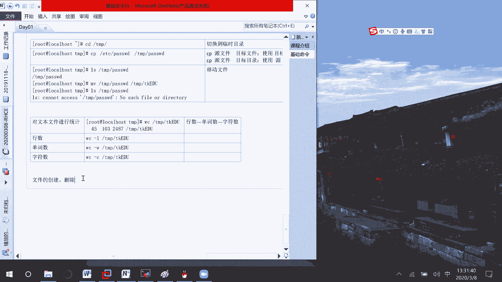

在本节课中，我们将学习 Linux 系统中的文件基础操作、强大的 Vim 文本编辑器以及用户管理的基本概念。这些是系统管理员日常工作中最核心的技能。

## 概述

上午我们学习了基础命令行操作。下午我们将重点学习 Vim 编辑器。在讲解 Vim 之前，我们先来了解文件的创建、删除等基本操作。

## 文件与目录的基本操作

首先，建议大家在 `/tmp` 目录下进行操作。进入该目录后，使用 `ls -l` 命令可以看到多种类型的文件，主要分为普通文件（以 `-` 开头）和目录（以 `d` 开头）。

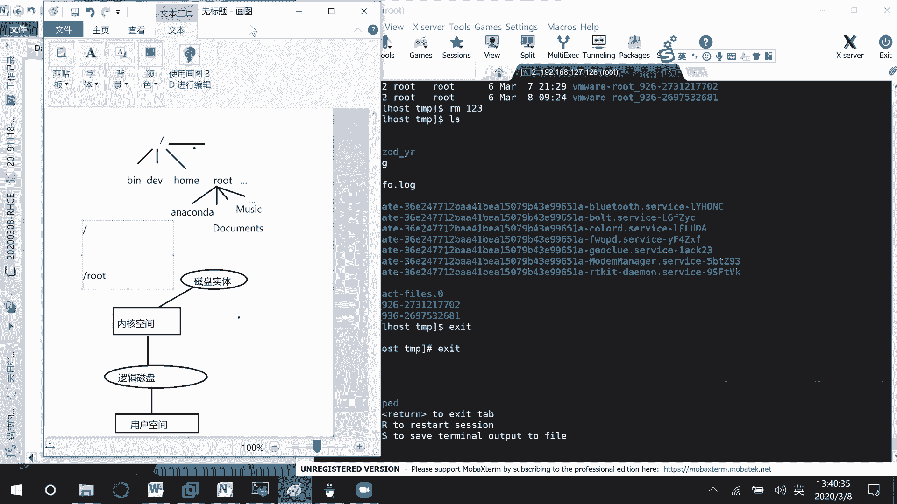

### 文件的删除

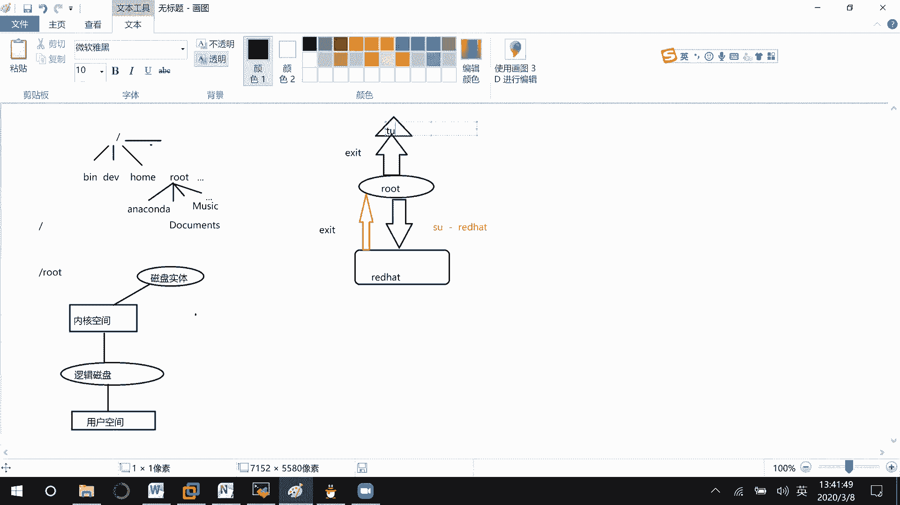

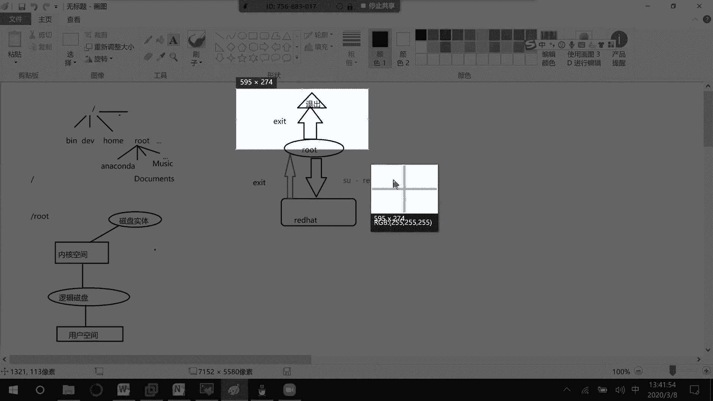

删除文件使用 `rm` 命令，后跟文件名即可。

```
rm 文件名
```

执行后，系统可能会询问是否确认删除。输入 `y` 确认删除，输入 `n` 取消。这种询问机制是 root 管理员用户的默认行为，目的是防止误删重要文件。普通用户执行 `rm` 命令时通常不会询问。

为什么同一条命令在不同用户下行为不同？这与用户的自身配置有关。例如，root 用户在配置文件（如 `~/.bashrc`）中为 `rm` 命令设置了别名 `alias rm='rm -i'`，其中 `-i` 选项表示交互式删除，需要确认。而普通用户默认没有这个别名。

### 用户的切换与退出

在 Linux 中，可以使用 `su` 命令切换用户。

*   **切换到普通用户（并切换到家目录）**：`su - 用户名`
*   **仅切换用户身份，不切换目录**：`su 用户名`
*   **退出当前用户，返回上一层**：`exit`

需要注意的是，从 root 用户切换到任何用户都不需要密码。但从普通用户切换到任何用户（包括自身）都需要输入密码。

### 目录的删除

删除目录不能直接使用 `rm`，而需要使用 `rmdir` 命令，但它只能删除**空目录**。

```
rmdir 目录名
```

若要删除非空目录，需要使用 `rm -r` 命令，`-r` 选项表示递归删除，即先删除目录内的所有内容，再删除目录本身。

```
rm -r 目录名
```

### 强制删除

对于管理员用户，每次删除都询问很麻烦。可以使用 `-f` 选项进行强制删除，无需确认。

```
rm -f 文件名
```

结合 `-r` 和 `-f` 选项，可以强制递归删除目录及其所有内容，这是一条需要**极其谨慎**使用的命令。

```
rm -rf 目录名
```

**警告**：`rm -rf /` 命令会删除根目录下的所有文件，导致系统崩溃，切勿尝试。

### 文件的创建

创建普通文件使用 `touch` 命令，相当于在图形界面中“新建文本文档”。

```
touch 文件名
```

### 目录的创建

创建目录使用 `mkdir` 命令。

```
mkdir 目录名
```

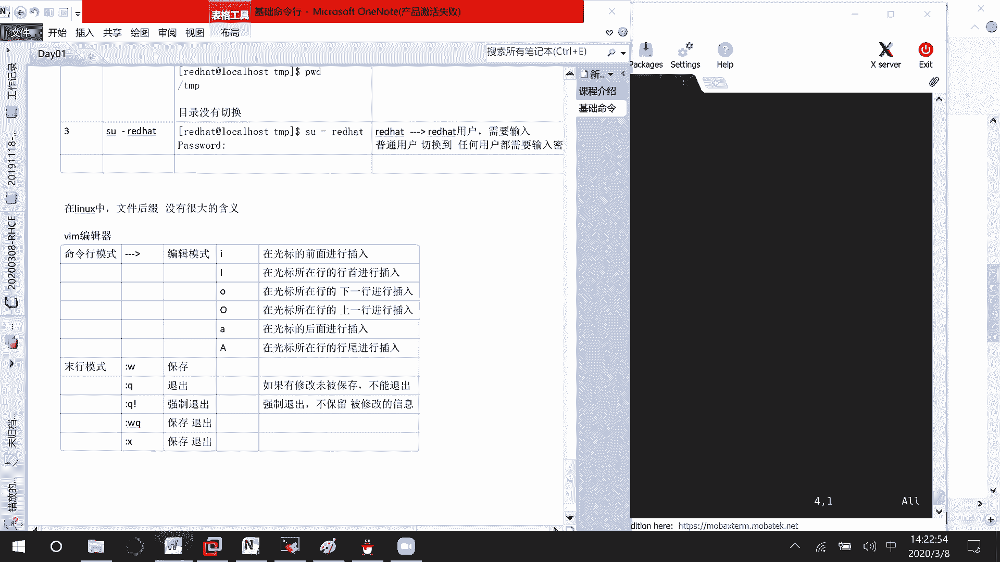


若要创建多级嵌套目录（例如 `/tmp/a/b/c`），需要使用 `-p` 选项，它会自动创建尚不存在的父目录。

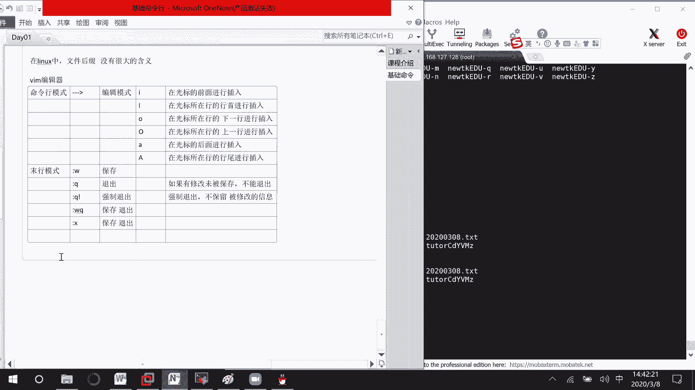

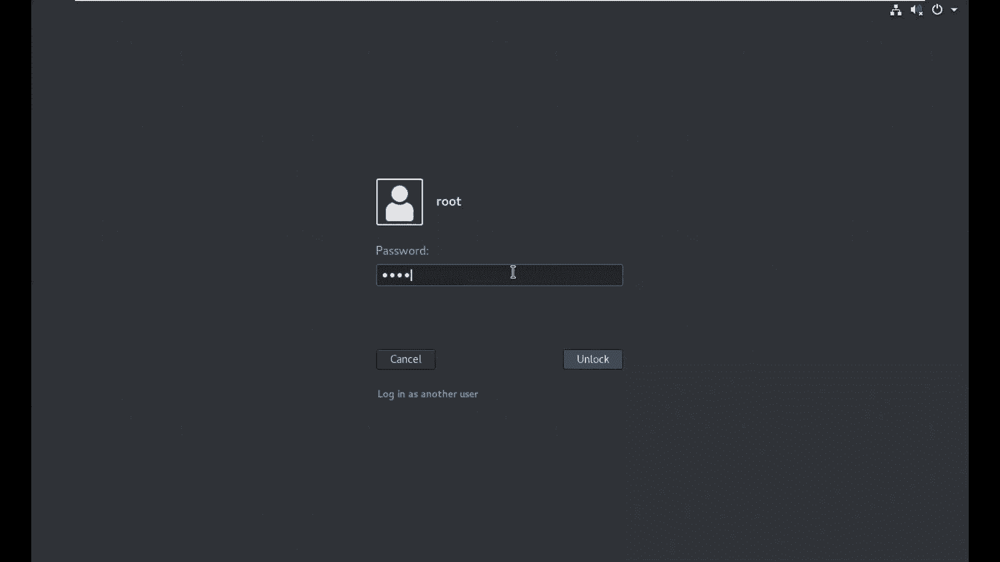

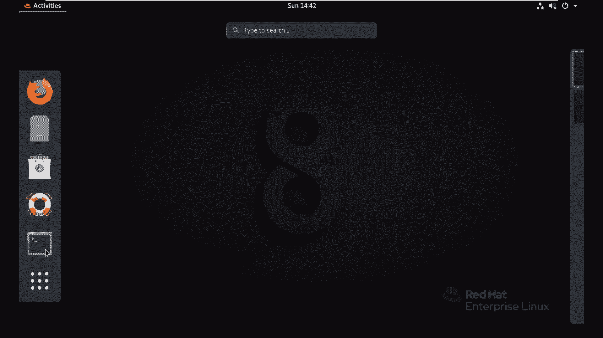

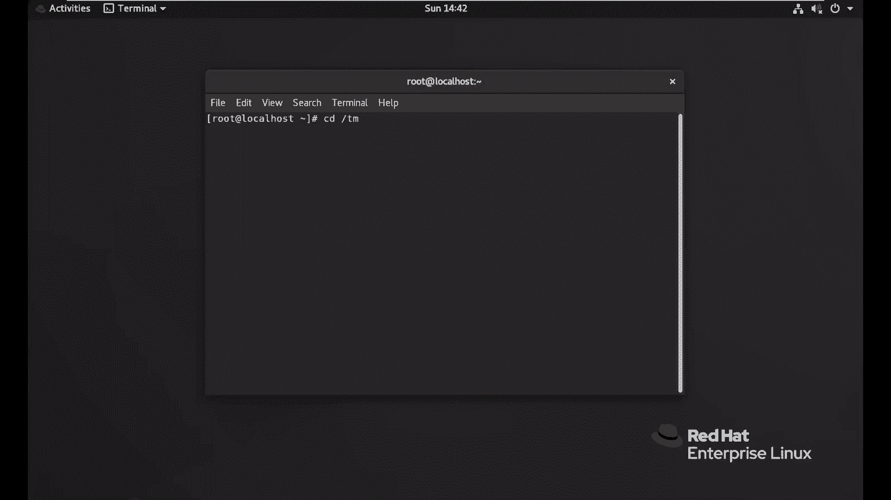

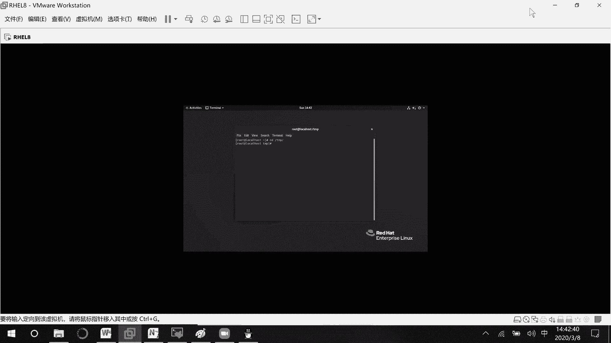

```
mkdir -p /tmp/a/b/c
```

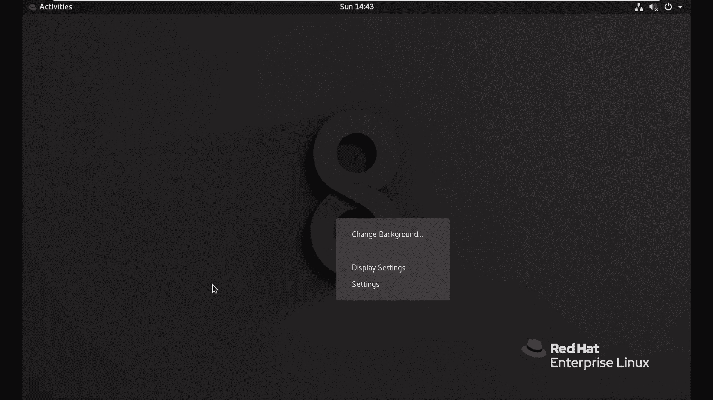

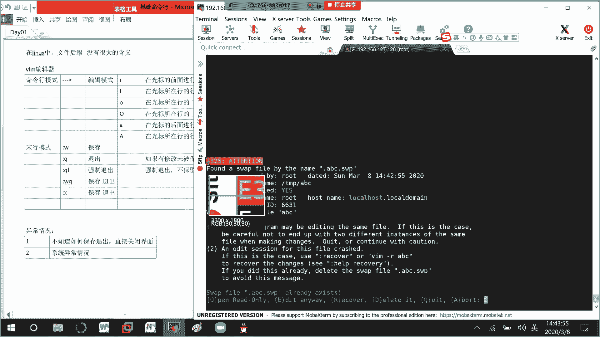

### 路径的概念

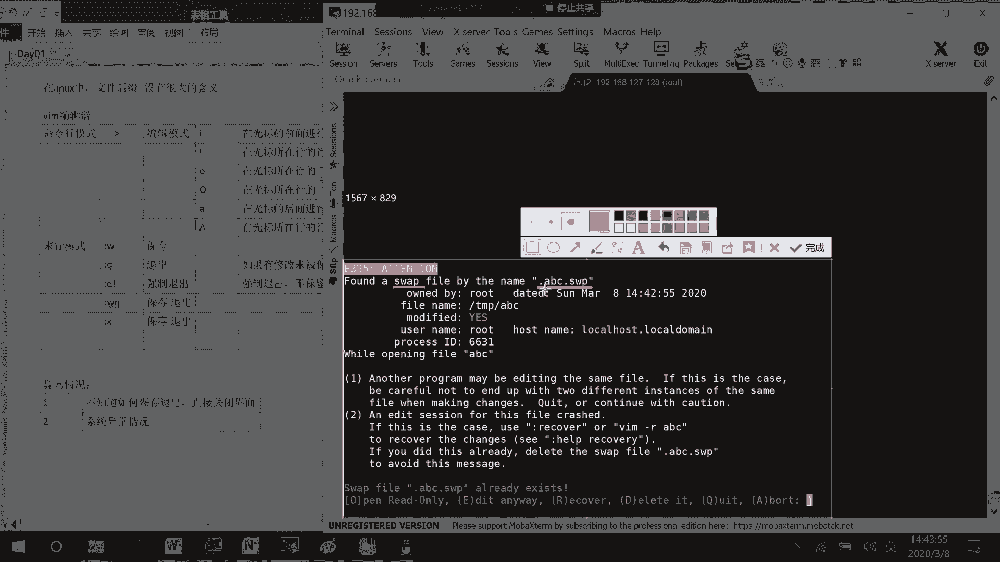

操作文件或目录时，需要指定其位置，有两种描述路径的方式：

1.  **绝对路径**：从根目录 `/` 开始，完整地描述文件或目录的位置。例如：`/tmp/ifconfig.log`
2.  **相对路径**：相对于当前所在目录来描述位置。例如，当前在 `/tmp` 目录下，直接使用 `ifconfig.log` 即可。

### 批量操作

*   **批量创建文件**：可以使用花括号 `{}` 展开。
    ```
    touch file{1..5}.txt  # 创建 file1.txt 到 file5.txt
    touch file{a..c}.txt  # 创建 filea.txt, fileb.txt, filec.txt
    ```
*   **批量删除文件**：使用通配符 `*`。
    ```
    rm -f *.txt  # 删除所有 .txt 文件
    ```

### 修改文件时间

`touch` 命令还可以用来修改文件的时间戳。

*   **更新为当前时间**：`touch *`
*   **指定创建时间**：`touch -t 202003070900 abc.txt` （将 `abc.txt` 时间设为 2020年3月7日 9:00）

---

## Vim 文本编辑器详解

Vim 是一个功能强大的文本编辑器，在命令行环境下广泛使用。它有三种主要模式：**命令模式**、**插入模式**和**末行模式**。

### 启动与模式切换

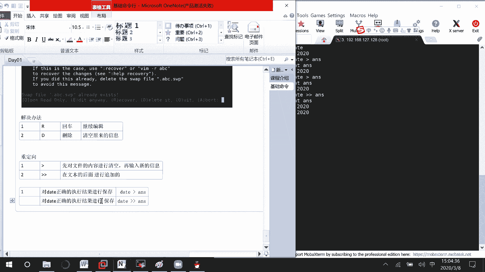

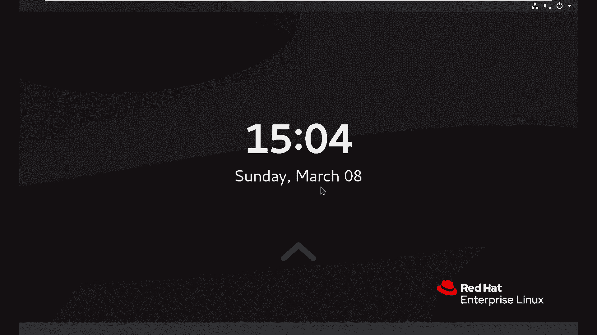

1.  **启动 Vim**：`vim 文件名`
2.  启动后默认进入**命令模式**。此模式下按键会被当作命令。
3.  按下 `i`, `a`, `o` 等键进入**插入模式**，此时可以正常输入文本。
4.  在插入模式下，按 `Esc` 键返回命令模式。
5.  在命令模式下，按 `:` 键进入**末行模式**，可以执行保存、退出等操作。

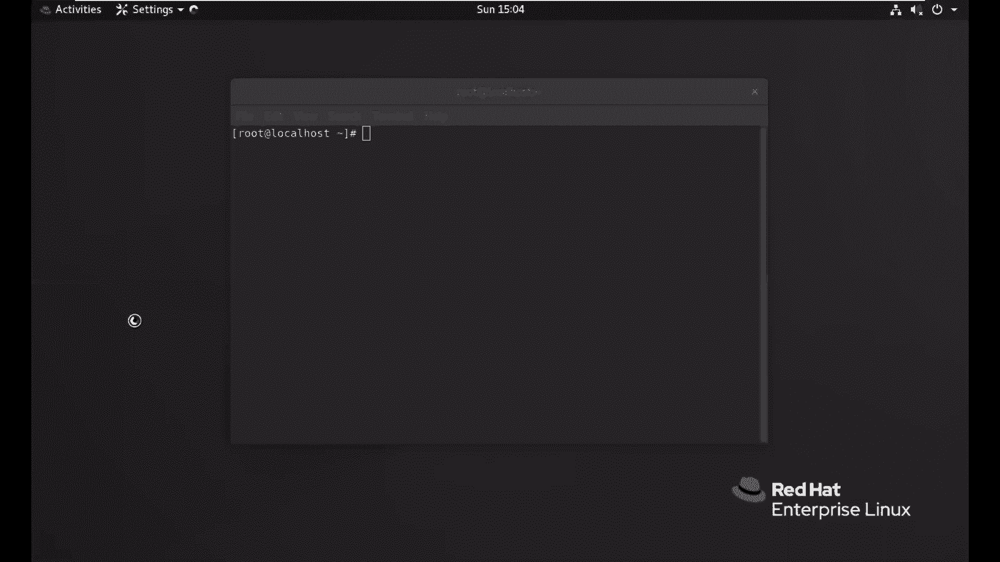

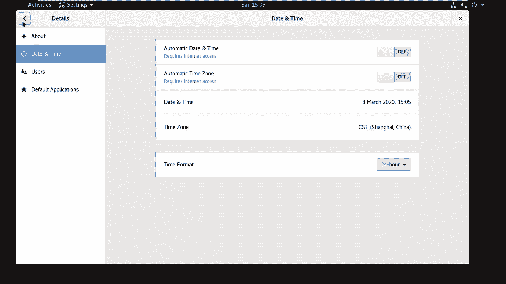

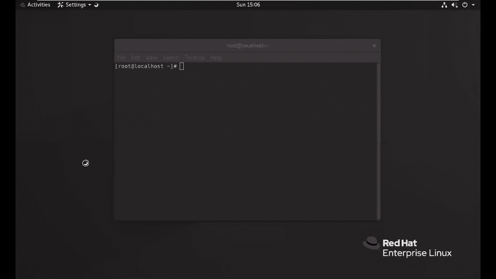

### 从命令模式进入插入模式

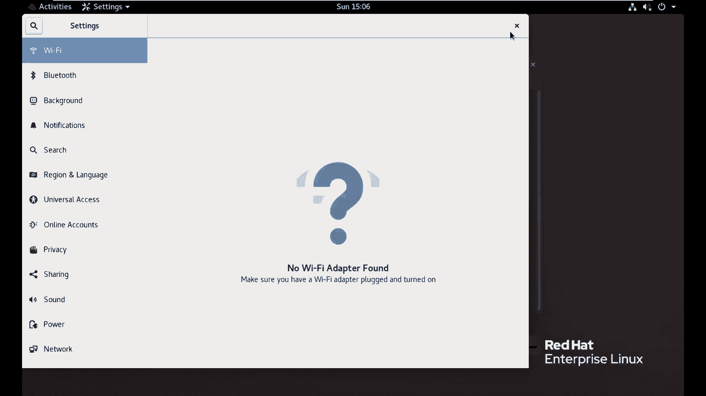

以下命令用于在命令模式下进入插入模式，但插入的起始位置不同：

*   **i**：在光标**前**插入
*   **I**：在光标所在行的**行首**插入
*   **a**：在光标**后**插入
*   **A**：在光标所在行的**行尾**插入
*   **o**：在光标所在行的**下一行**新建一行并插入
*   **O**：在光标所在行的**上一行**新建一行并插入

### 末行模式常用命令

在命令模式下按 `:` 进入末行模式。

*   **:w**：保存文件
*   **:q**：退出 Vim（如果文件有未保存的修改，会阻止退出）
*   **:q!**：强制退出，不保存任何修改
*   **:wq** 或 **:x**：保存并退出
*   **:set number**：显示行号
*   **:set nonumber**：取消显示行号

### 命令模式常用操作

*   **光标移动**：
    *   `gg`：跳到文件第一行
    *   `G`：跳到文件最后一行
    *   `20G` 或 `20gg`：跳到第20行
*   **查找**：
    *   `/关键字`：在文件中向下查找关键字，按 `n` 查找下一个，按 `N` 查找上一个。
    *   `/关键字\c`：查找时忽略大小写。
*   **替换**：
    *   `:s/旧文本/新文本`：替换光标所在行的**第一个**匹配项。
    *   `:s/旧文本/新文本/g`：替换光标所在行的**所有**匹配项。
    *   `:%s/旧文本/新文本/g`：替换全文中的**所有**匹配项。
*   **复制、剪切、粘贴**：
    *   `yy`：复制当前行
    * `5yy`：复制从当前行开始的5行
    *   `dd`：剪切（删除）当前行
    *   `p`：在光标**后**粘贴
    *   `P`：在光标**前**粘贴
*   **撤销**：`u` 撤销上一次操作。

### 处理 Vim 异常

如果 Vim 异常退出（如终端意外关闭），再次编辑同一文件时可能会出现交换文件警告。通常的解决方法是：
1.  按 `R` 恢复文件。
2.  或者按 `D` 删除交换文件并重新编辑（会丢失未保存的更改）。

---

## 输出重定向与管道

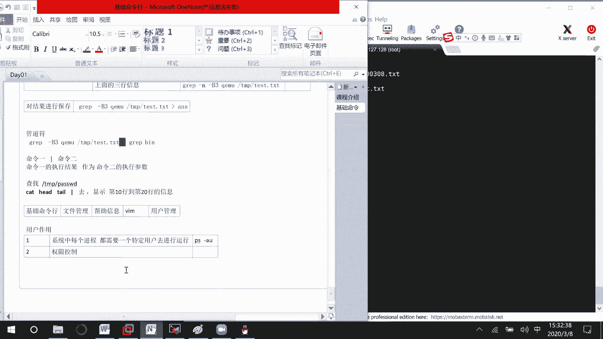

### 输出重定向

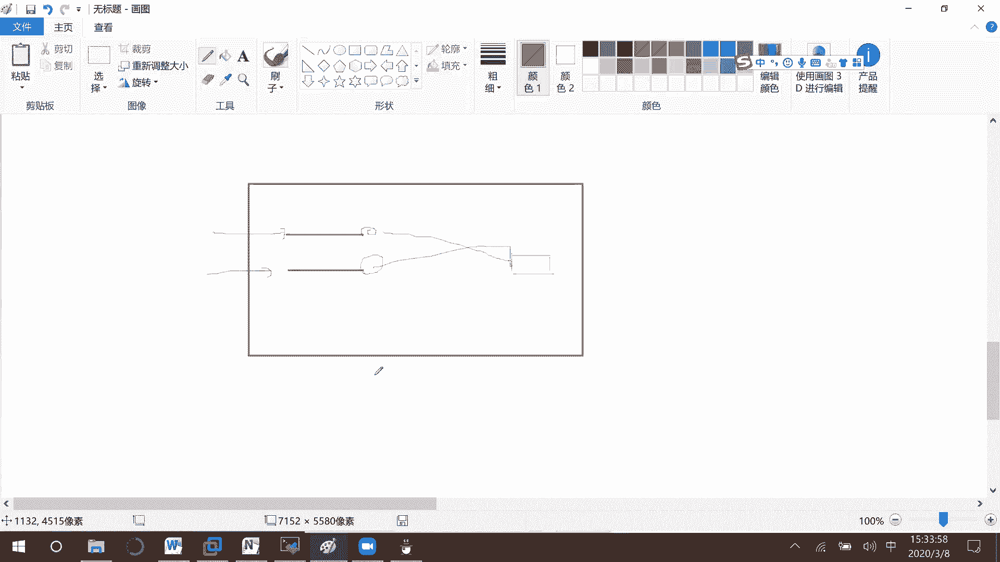

将命令的输出结果保存到文件，而不是显示在屏幕上。

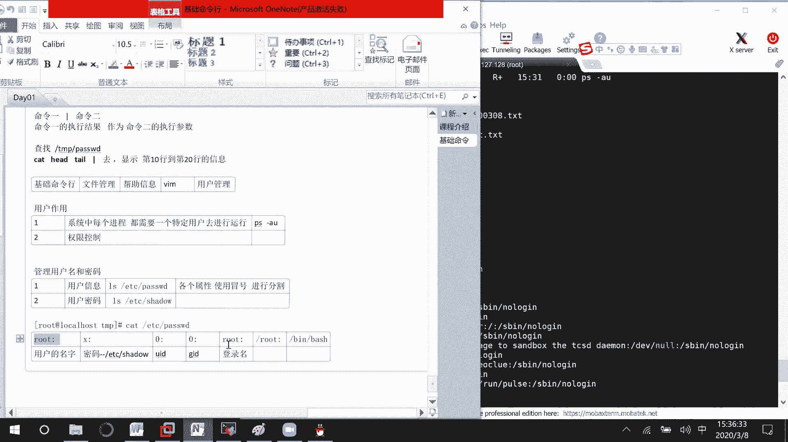

*   `命令 > 文件`：将**正确**输出结果覆盖写入文件（先清空文件）。
*   `命令 >> 文件`：将**正确**输出结果追加到文件末尾。
*   `命令 2> 文件`：将**错误**输出结果覆盖写入文件。
*   `命令 &> 文件`：将**正确和错误**输出结果都覆盖写入文件。

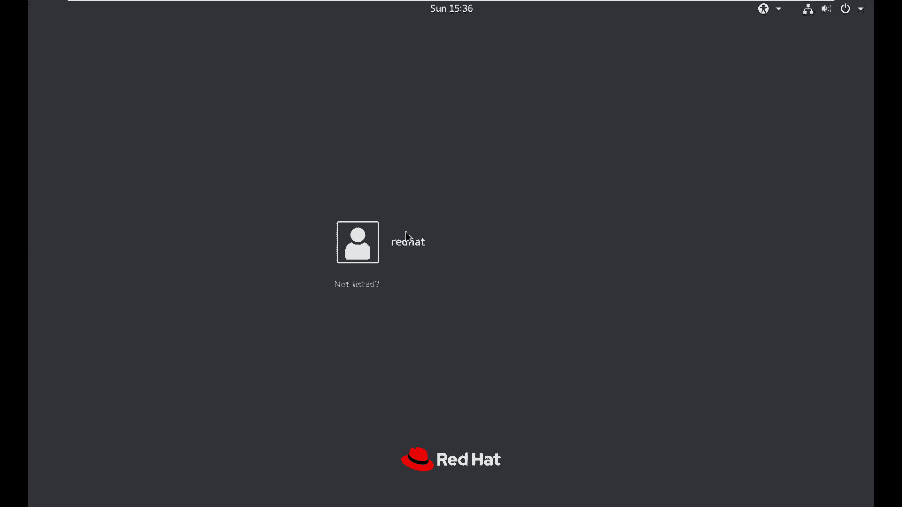

### 管道符 `|`

将一个命令的输出，作为另一个命令的输入。

```
命令1 | 命令2
```

例如，查找包含 “root” 的行，并统计行数：
```
grep root /etc/passwd | wc -l
```

### 文本搜索命令 `grep`

在文件中搜索包含指定字符串的行。

```
grep “关键字” 文件名
```

常用选项：
*   `-n`：显示匹配行的行号。
*   `-A 数字`：显示匹配行及其**后**的N行。
*   `-B 数字`：显示匹配行及其**前**的N行。
*   `-C 数字`：显示匹配行及其**前后**的N行。

---

## 用户管理基础

### 用户与组的作用

1.  **进程归属**：系统中每个运行中的进程都属于一个特定的用户。
2.  **文件权限**：通过用户和组来控制谁可以访问或修改文件。

### 用户信息存储

Linux 将用户信息和密码信息分开存储：
*   **用户信息文件**：`/etc/passwd`
*   **用户密码文件**：`/etc/shadow` （加密存储）

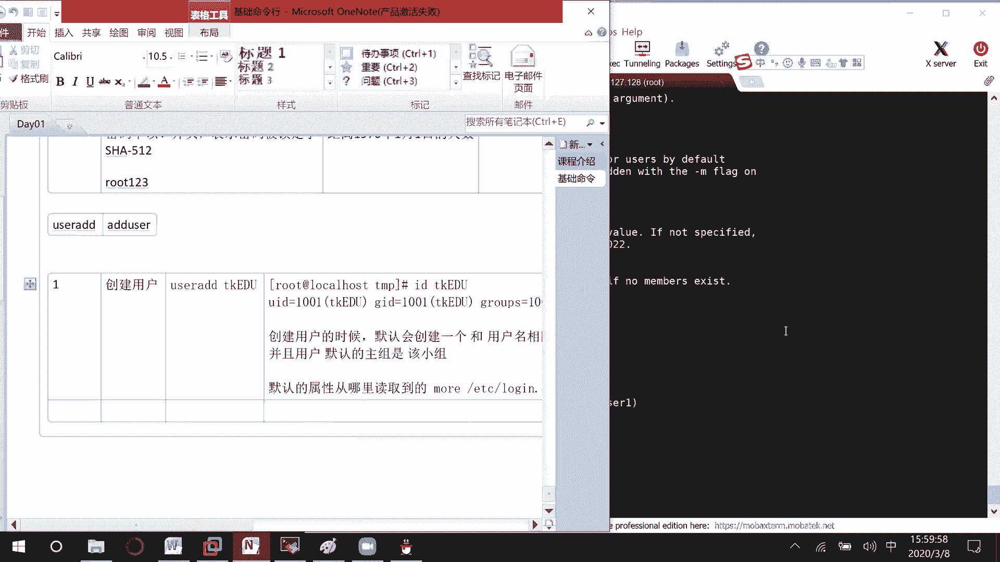

#### `/etc/passwd` 文件格式

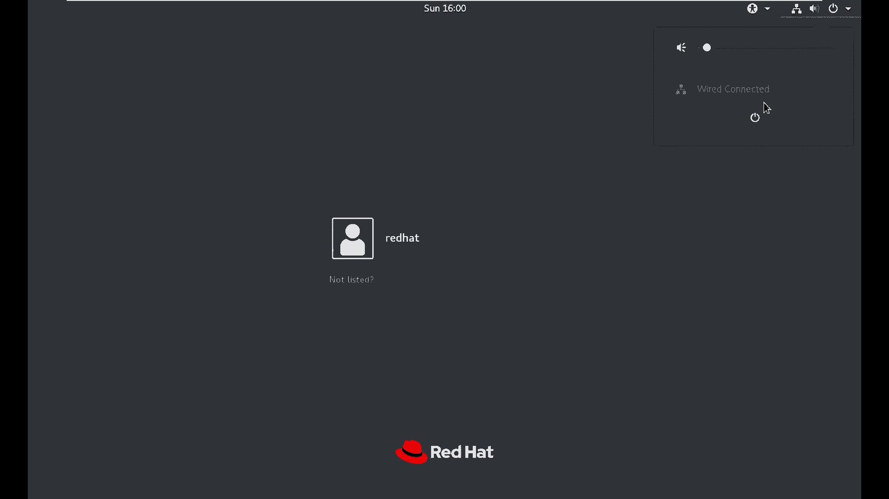

每一行代表一个用户，由冒号 `:` 分隔为7个字段：
`用户名:密码占位符(x):用户ID(UID):主组ID(GID):描述信息:家目录:登录Shell`

例如：`root:x:0:0:root:/root:/bin/bash`

**UID 范围**：
*   `0`：超级管理员 (root)
*   `1-999`：系统用户（供系统进程使用）
*   `1000+`：普通用户

#### `/etc/shadow` 文件格式

存储加密后的密码及相关策略，由冒号 `:` 分隔为9个字段：
`用户名:加密密码:最近修改密码天数:最小修改间隔:密码有效期:警告期:不活动期:失效日期:保留`

### 用户管理命令

*   **创建用户**：`useradd 用户名` 或 `adduser 用户名`
    *   默认会创建一个与用户名同名的组作为该用户的**主组**。
    *   默认属性从 `/etc/default/useradd` 文件读取。
*   **修改用户属性**：`usermod [选项] 用户名`
    *   `-c`：修改描述信息。
    *   `-d`：修改家目录路径。
    *   `-g`：修改主组。
    *   `-G`：添加附属组。
    *   `-s`：修改登录 Shell（如 `/sbin/nologin` 禁止登录）。
    *   `-md`：移动家目录内容到新路径（与 `-d` 连用）。
*   **删除用户**：
    *   `userdel 用户名`：仅删除用户，保留家目录等文件。
    *   `userdel -r 用户名`：删除用户及其家目录、邮件等所有相关文件。
*   **查看用户ID**：`id 用户名`

### 为用户创建家目录

如果用户的家目录丢失或被误删，可以手动重建：
1.  创建目录：`mkdir /home/用户名`
2.  复制骨架文件：`cp -r /etc/skel/. /home/用户名/`
3.  修改所有者：`chown -R 用户名:用户名 /home/用户名`

---

## 总结

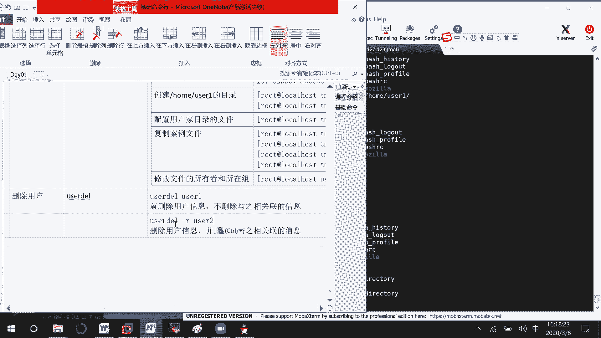

本节课我们一起学习了 Linux 的核心基础操作：
1.  **文件与目录管理**：包括创建 (`touch`, `mkdir`)、删除 (`rm`, `rmdir`)、路径概念以及批量操作。
2.  **Vim 编辑器**：理解了其三种模式（命令、插入、末行），并掌握了基本的文本编辑、查找替换、复制粘贴和保存退出操作。
3.  **输出重定向与管道**：学会了如何将命令输出保存到文件，以及如何连接多个命令。
4.  **用户管理基础**：了解了用户和组的概念、信息存储文件 (`/etc/passwd`, `/etc/shadow`)，以及使用 `useradd`, `usermod`, `userdel` 进行基本的用户管理。

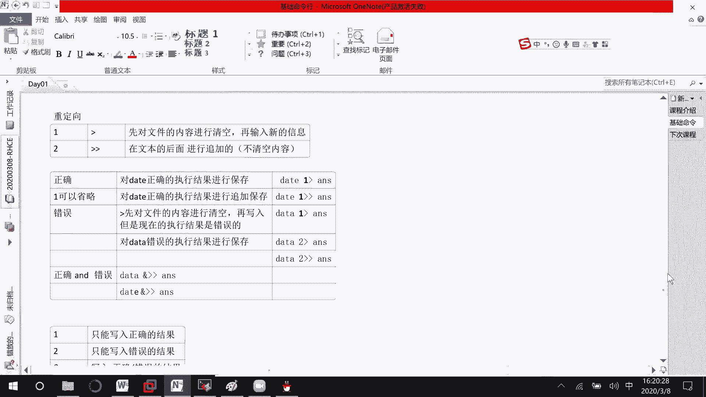

这些是构建更高级系统管理技能的基石，请务必熟练掌握。下节课我们将深入探讨组管理、文件权限控制以及服务管理等内容。