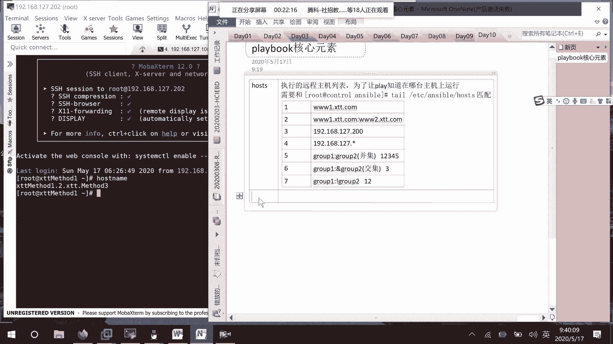

# 01 RHCE8.0视频教程【45课时】 - P40：20200517-RHCE-01_recv - 六竹书生6682 - BV1m84y1f7ss

好我们今天这边的话呢，还是要去学习那个enable哈，上一次课的话呢，我们学了一个叫做基础的，已经开始学到了一个叫做playbook嘛，就是说playbook的时候呢，我们就学了。

怎么样在远程的话呢去创建一个叫做剧本啊，就是说在本地创建一个剧本文件，然后的话呢让在远端的话呢可以去安装我们的，比如说叫做HTTP啊，这个服务对不对，我来看一下哦，还没有做到。

就说我们的话呢就去创建了一个剧本文件，是进行一个hello一个显示的，这边的话呢就告诉大家，怎么样去写一个剧本文件，对吧，才讲到这里过，那好啊，今天这边的话呢我们接下来继续去看，就说这个剧本文件。

我们具体的话呢要如何去进行一个编写，就相当于上面这些可能都已经固定了task，然后像这边command这块啊，他要怎么样去写嘛，好吧，那我就不用去复习了，这个playbook的一个核心元素。

它里面的话呢就是说playbook我们用ya去写的，这个大家应该是已经知道了对吧，然后里面的话呢它有哪些元素呢，我们对照着刚才这个来看。

刚才这个的话呢这个文件叫什么名字，Hello，Cut unstable，Hello，里面，这里的话呢是第一个有一个东西叫做host。

这个东西啊，所以的话呢我们在写playbook的时候，有一个很重要的元素，host是他这个就是说执行到远程主机列表，执行执行的一个远程主机列表嘛，像我们playbook当中的话呢。

就是说都要去指定一个host，就说让我们去知道在哪一个远程主机上面，去进行一个运行的嘛，诶我怎么感觉这个我之前是讲过了呢，那就当复习吧，我就感觉这话很熟悉，在你们班就是说host，就是说呃是为了让。

让一个动作知道。

哪台主机上进行一个运行，我讲过吗。

哦好吧，我以为说我讲过呢，就是说为了让play知道在哪台主机上运行，好吧，像这边的话呢我们再去写的时候，比如说写web server这边的话，或者什么web e r这个东西。

需要和我们的一个叫做主机清单的话呢，它是进行一个匹配的太etc unstable，它有一个叫做HOSTERS吗，就是说这个主名或者这个某台主机的一个名字，全都是可以的，全都可以的。

知道吧，这里需要和这个匹配，如果说在这个unstable host里面没有定义的话，那就说明这台主机也是不受我管理的嘛对吧，然后的话呢再进行这个HOSTERS里面，怎么样去进行一个编写的话呢。

大家自己应该还有。

就是说心里心里还是了解的吧，我这边的话呢再给大家来看一下。

首先第一个第一种形式，这边的话呢，是不是直接就写这种叫做主机名的形式啊，比如说3WXTT点com或者第二种，我们的话呢有两台设备，就3WXTD点com回车，然后这边的话呢就说稍等一下。

我这里给他去改一个，因为这边的话呢可能写了一台叫做啊3W。

三W1点XTT点com的一个主机，我们来看这里吧，对吧，就这个组单台的主机名，我的话呢可以在我的host当中去进行一个写。

直接就写这个主机名也是可以的，还有第二种形式呢，比如说3W1和3W2，那你这样子去写的话呢也是可以的，或者就是说你这边写了某个IP地址吗，那我这里就写192168，比如说127。200。

这样子也是可以的，还有一种形式，如果说我是希望这127，因为这里面的话呢有很多127的主机对吧，我希望127开头的所有主机。

那也是可以的，然后接下去第五个，你看这边不是有一个web server对吧，下面这边的话呢还也有一个也有一个web service，比如说这边dB service web service对吧。

这两个小组我的话呢可以怎么样呢，第一个比如说这个小组，Db service，去交就是说冒号我写另一种形式吧，要不然的话太多了哈，group1冒号group2，这个的话那就表示我是这两个小组的并集。

就是说group1当中有的group2当中有的，等一下我画图软件忘记打开了，这个的话呢就是说group1group2group一当中，比如说123，group2当中，比如说345。

那这个的话呢是不是就表示一二，345这几台设备啊，哦就表示这台三这台就表示三这台哈三这一台，因为这个的话呢是一个叫做定级，并集它表示的是12345。

然后接下去的话呢第六个叫做group1冒号group2，中间这边的话呢，就是说前面再加上一个余的符号，这个的话呢是干嘛呢，他是去取交集吗，就像刚才这个图12345相交的地方，是不是在这三嘛。

所以这边的话呢就是说一个第三台，然后接下去第七种情况的话呢，就group1冒号，感叹号，Group2，这边的话呢还是刚才那个图1235，就这样子打圈嘛，也就是说在group1小组当中存在。

但是在group2当中不存在，是不是只有一二这两台主机啊，在这里就是说只有一二这两台主机，所以呢表示的形式有很多种。

就说host后面这一块好吧，这里host后面这一块有很多表示方法。

就这样子，然后下面这边的话呢呃我们可以来再来试一下。

好吧，再来试一下，我这边的话呢有两台主机啊，这一台是不是一台主机，我看一下这台我看一下我们开机，这台是一个control，不要了。

202202是没有开机吗。

太多人请假了，那行，那现在这边的话呢就是说我们host是这样子的。

然后接下去的话呢，我们来看一下它的一个第二个元素。

就是我们的一个task嘛，这里remote的话呢，就是说以什么样的一个身份去进行一个执行，这里tasks tsks的话呢。

就是里面一个一个的任务，我们现在的话呢，是把嗯所有的东西都写在一起嘛，等到后面的话呢我们讲到剧本的时候，就相当于把一个任务，他的task到时候呢分散在不同的文件当中。

然后到时候再通过一个角色文件，把所有的task呢给整合起来嘛，好吧。

这个task这一块的话呢，就是去写我们的任务集合，这边的话呢我们就写了一个任务，我们等一下的话呢可以去写两个任务，三个任务，这样子好吧，所以这个playbook中的一个主体，就是我们的一个task。

他的话呢如果我们等一下再写的时候有横线，比如说task1横线，Task2，这里的话呢，它的一个任务就是从上往下，依次去进行一个执行的任务，从上往下依次执行好吧，然后的话呢我们在进行一个执行的时候。

下面这边我再来写一个task3，他是个三，你看task1运行正常，运行好了之后，我们会去运行task2，task2运行正常，然后再运行task3，就这样子，如果说我task1运行正常。

task2出现错误了，那么task2做的操作的话呢，就会被回滚，他是个二任务回滚，还有的话呢，task3不会被执行，就这样子从上往下不会被执行，然后的话呢你到时候把playbook跟叫做更正了。

之后的话呢，它会从上到下再进行一次执行的，能明白吧，他就这样子，这边的话呢我们来演示一个吧好吧，来演示一个，先给大家来演示一下这个task，就是说这边的话呢他不是不会执行吗。

我们等一下想办法能不能让他可以去执行呢。

知道吧，这边vim我看一下CD unstable，我这边比如说呃VIM嗯，test202005178点y ml，先写一个最简单的，比如说HOSTERS冒号里面的话呢。

是不是就要去写对哪些主机去进行一个操作啊，稍等一下。

我们现在的话呢要演示。

比如说写三个任务，Cat etc answerable hosters，比如说就是这里吧，我看一下这个，对就这个，我写一个简单一点的名字吧，这个名字可能太复杂了，VIM这台设备，然后在下面这边的话呢。

我去增加一个小组，叫做web2012这样子，然后的话呢192168127。201，192168127。202，就是叫做web server，Web2012，好吧主机。

然后到时候的话呢就说remote user，我这边就写一个root嘛，远程执行的，下面这边的话呢我们要做的一个事情，就是说去写task任务是怎么样子的，比如说我们这边的话呢去写几个任务。

第一个任务的话呢是什么呢，在远端去创建一个叫做文件。

这个我也讲过了对吧，我看一下先，因为我这边没有记录，如果讲过了，我这边就不讲了哈。

