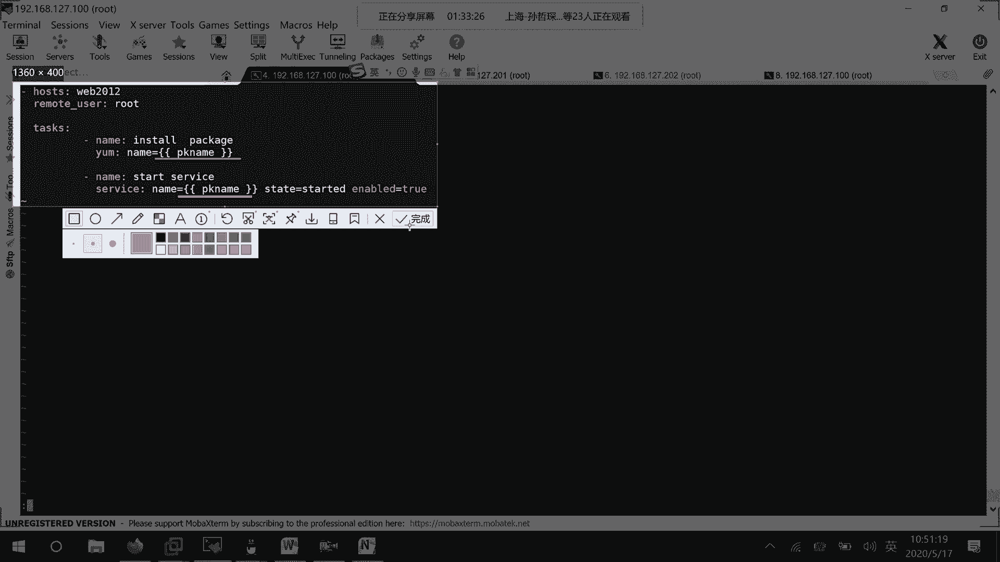
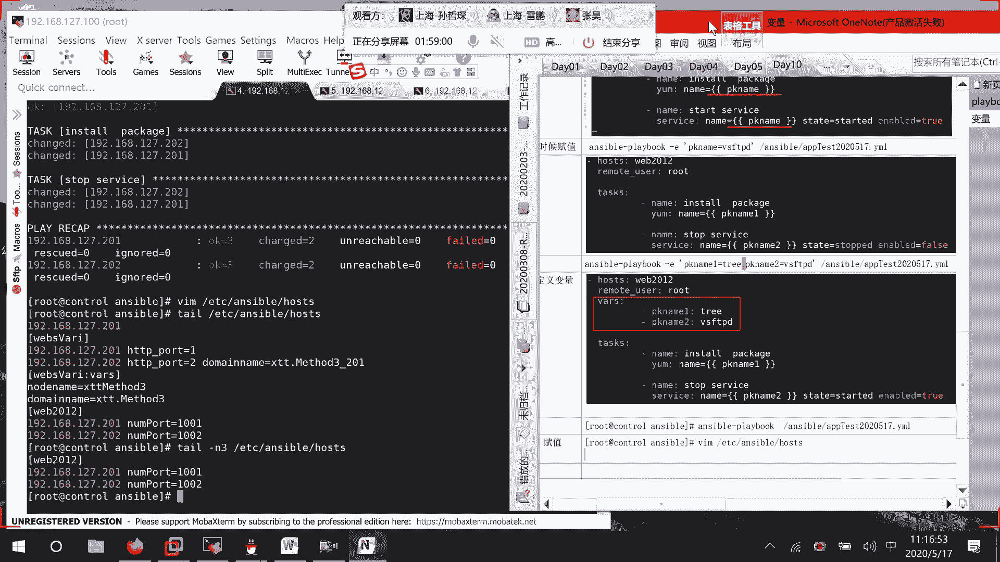
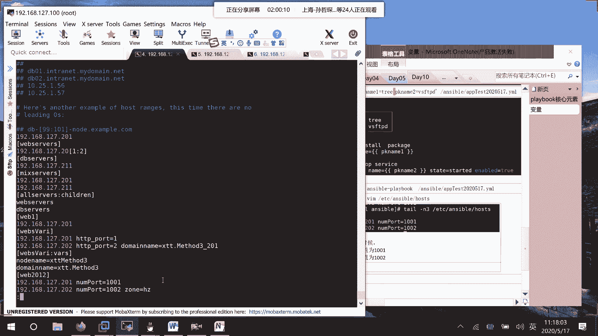
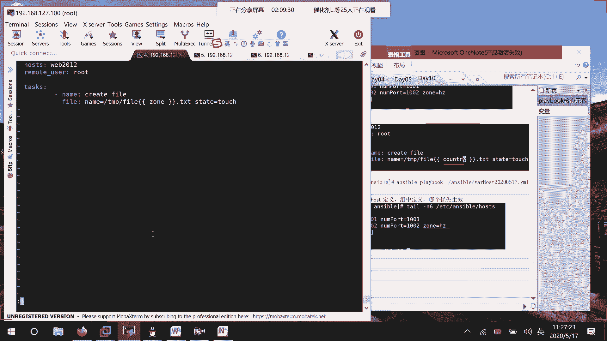
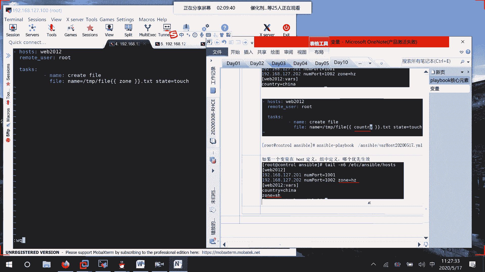

# 01 RHCE8.0视频教程【45课时】 - P42：20200517-RHCE-03_recv - 六竹书生6682 - BV1m84y1f7ss

那行，下面这边的话呢，我们来讲一个新的东西，叫做变量。

变量的话呢，之前我们在学那个叫做。需要脚本的时候呢，也跟也跟大家有说过嘛，它这个的话呢就可以比较灵活一点。我们之前在写这个叫做playbook的时候，你看这里写了web2012可以再变吗？就变不了了。

如果要变的话呢，再去编辑这个文件嘛，就比较麻烦。所以这个变量的话呢就是一个代号。后续的话呢，我根据自己的实际情况可以去进行一个设置嘛，对吧？然后那既然有变量的话呢，那变量是不是就要去进行一个命名啊？

就比如说我们这个课程叫HCE啊或者怎么样，对吧？然后这个它在进行一个命名的时候，有什么样的一个特点呢？它的一个组成。只能有数字，还有个字母，还有一个下划线组成。这三种。然后的话呢。

其中只能以我们的字母开头。其他开头全部都不可以。我这边来写一个最简单的那比如说。T等于什么样的一个value，怎么样的一个值嘛？就比如说我这边到时候的话呢，给HTTP去进行一个叫做呃启动它的一个端口。

或者给某一个主机去设置它的一个名字的时候，我是不是可以去定义变量，比如说port80啊。8080啊是不是可以这样子命前它的一个格式就这样子。格式。名字变量名字值变量名字值是怎么样子的，好吧。

然后下面这边的话呢，我们来说一下这个变量它进行定义的方式有几个。方式的话呢总共有5个，我们这边的话呢就是说会先去讲三个。因为还有一个的话呢和我们的剧本是相关的。第一个第一种形式，我们通过。哦，不对。

这边变量的话呢就是说给它赋值赋值有几种形式。好吧，第一种形式的话呢，就是说在playbook。就相当于在这里。我直接去写它的变量名字值，变量名字值是多少？知道吧？在。playbook中。直接定义变量。

和值。然后这边的话呢，定义好了之后，下面不是要去进行一个调用吗？它变量调用的方式是这样的，花括号两级花括号。然后中间这里的话呢去写上变量的名字。就可以了，就可以去进行一个使用。好吧。这是第一种方式。

第二种方式呢，比如说我在这个playbook当中去使用了某一个变量嘛。对吧他用这种方式的话呢，去使用了某一个变量。play book当中它的一个定义的话呢，格式就这样子。格式。

或者的话呢就是呃key冒号value是多少嘛？然后呢，要去使用的话呢，就是说比如说这个。HTTP我就不写了嘛，我就引号service name就可以了。然后复值的话呢，这是第一种方式复值。

第二种方式赋值的话呢，就是命令行单中去进行一个复值嘛，它怎么样去复值呢？就这样子。Answible。Playbook。然后接下去。是不是要针对某一个脚本啊，比如说test2017减E。简易。

然后接下来里面的话呢，你就去写这个。变量符号。等于。叫做值是多少？那他的话呢就可以去进行一个复值了。好吧。这是第二种格式，我怎么样去进行一个复值？然后接下去的话呢，我们来看一下第三种形式。

叫做专门的话呢去定义。文件。里面的话呢就去写某个变量。值是多少？其实这两种的话呢是差不多的，只是说一个是直接写在playbook当中。一个的话呢，我单独的去开一个变量文件去写我们的这些值嘛。

然后还有一种情况的话呢，就在这里去进行一个定义，叫做。Cat。ETC。Answourible。Pos。这里面可以去定义，你看就类似于这样子。好吧。等一下。在主机清单当中去进行一个定义。

主机清单里面的话呢，大家可以去看一下，去进行一个细分啊。我等一下呢会去进行一个演示。这里的话呢它有两种，第一种针对单台主机复制一个变量啊，复制两个变量啊，它都是可以的，好吧。针对。单台主机。这样子。

如果有多个变量呢，就打空格，再写上新的变量嘛。第二个，针对主机主。就比如说我这里不是有一个webs webbs的一个小组吗？你看。冒号VARS就表示我下面这里呢是要去设置变量，这边变量名字变量值。

变量名字变量值什么意思呢？我这两个变量可以针对webs是这个小组当中的所有用户去进行一个生效。好吧，我这边来说一下。上面。No。Name。和。Doment。name变量。针对。主机主。这个。

中中的所有主机。都生下。好吧，这是一种方式。然后还有一种方式的话呢，就是说我们在rs当中去进行一个定义。就角色当中它的话呢会有个目录。这个的话呢我们后面再去讲好吧，现在的话呢我们就主要来讲这四种方式。

然后大家来想一下这几种方式，1234这几种方式里面的话呢？哪一种方式是最优先的。最优先的。最优先的话呢是这种命令行的方式，为什么呢？我们所有操作在命令行当中操作，它的优先级是最高的。

这个的话呢你们可以去记住哈。他在命令航单中去进行一个复值的话呢，他的优先级是最高的。因为我们人为去进行了一个设置嘛。好吧。那行，这里的话呢是进行的一个就叫做变量，怎么复值。接下来的话呢我们来看一下。

在这里它有没有一些系统变量呢？就好像我们在进行系统操作的时候，是不是有一些什么环境变量这些东西啊？那我在进行answerable管理的时候，它有没有系统变量呢？他有。它这些变量的一个来源。

第一个就像上面这里我们自己去定义。第二个系统自己有变量。我们这边的话呢，就比如说想要去查看系统变量。怎么去查呢？有一个模块叫做st up的一个模块。但是的话呢，现在我等一下再迁移过来。现在的话呢。

你看这个guessing。fax这个其实就是在收集远程主机的一个变量。以前的话呢用的是一个sett up，但sett up的话呢，它比较灵活一点嘛。所以我先讲这个。

然后到时候再给你们来看一个这个事实的一个管理，好吧。那行，这边的话呢，那也就是说unsable。针对于哪些主机嘛，2012这个主机调用什么模块呢？set up模块。就可以了。稍等啊。这样子回车。稍等。

比较慢。它的话呢就可以把web2012这个小组包含的所有主机，它的上面的一些信息给你去进行一个收集。我们来看。稍等一下。信息太多了，看不过来。你看这里192168127。202信息收集成功。

在它上面的话呢，有一个叫什么？ansable allIPV4address202，你看。我这台202的设备。他的地址不就是202吗？😡，然后接下去IPV6的地址5E91。5E91。然后接下来我们来看。

它这边的话呢架购。然后呢，bus的一个时间，bis的版本是不全都有收集的？所以像这个的话呢，fax也好，set up也好。它的话呢主要获取管理节点。系统信息。好吧。

主要是去管理节获取我们管理节点的一个系统信息是怎么样子的。然后现在这边的话呢，比如说。呃，我来看一下啊。这边的话呢，它的一个信息太多了。如果说我现在想要去看一下它的主机名字呢。

如果说我想要去查看远端主机，它的主机名字有哪些？以我们目前所学的知识的话呢，首先第一个。用sha命令可不可以啊？😡，直接通过sll去发到远端当中去嘛，sll模块万能的一个模块。好吧，你来看就这样子。

Answourible。lab201RM shallA干嘛呢？host name。去获取一下这两台设备的一个主机名字嘛。你看第一台设备获取到的是web一，第二台设备获取到的是一个web2，这个没有问题。

如果说我们现在想要使用我们的一个叫做set up的一个模块呢。那刚才这里的话呢，这么多信息显示出来了，我去graap一下不就行了吗？是不是和那是相关的？稍等。比较多。你看这里。它这里的话呢。

这个肯定不是这个不是是不是这个哦answible horse name它就是一个缩写。这个的话呢是不是一个全称啊？我们是不是想要的就是这个东西啊，web2XTT点com嘛。所以后面的话呢。

如果说想要去进行一个更精确的过滤的话呢，那就这样子answable node name。你看是不是就把我们的一个主机名去显示出来了。所以这里的话呢就是第二种方式。等一下啊。这种然后还有一种方式是什么呢？

就是说比这个gra更好用的。它在自己的模块当中，因为像share的话呢，它是不是有自己的模块命令啊，那相同的我自己也有的。的话呢就是说FILTR过滤嘛，我想要去过滤什么东西呢？

我想要去知道它的一个主机名字是什么，就这样子放在这里。我的话呢也可以去进行一个获取的回车。等一下。好。你看这里的话呢，是不是就显示出来这个叫做node name是什么东西啊？其实我们这边的话呢。

这边fax。就是我们的一个叫做去获取我们系统的一些信息，去获取系统的一个信息。然后的话呢，这边刚才可以看到一个叫做。answible host name它显示的话呢是一个短主机名字。因为这里的话呢。

你们去了解几个系统变量。到时候的话呢，在我们的呃answer脚本当中的话，你可以直接去进行一个使用这些系统变量的。就比如说我到时候的话呢希望在。远端的主机。

比如说在tamp目录下面去创建一个以主机名开头的。比如说后面下划线，再是一个比如说XTT点com的一个文件。那首先是不是要先获取到主机的名字啊？这个answerable host name的话呢。

它就是一个短组机名。然后接下去的话呢，我们刚才看到是不是有一个叫做。Answable。n the name，他这个的话呢就常主居名。然后平时的话呢。我们可能用这个也很多FQDN。就是一个信。

就是一个完全限定的一个域名嘛。就是说其实和我们这个answable node name的话呢是差不多的。就是唉。FQDN。就整个整个的名字都是完整的去进行一个显示。我先来给你们匹配一下。

你看就这个unsible FQDN。这个的话呢就是说完全的限定域名。好，然后接下去的话呢，就比如说我现在的话呢可能要去管理网络了，那这个可能是和什么相关的呢？是interface啊。

我们来看一下它的一个全名叫什么。稍等。哎，INTERFACE。你看这里的话呢，是不是基本上全都是unswableinterface，前面加个unswable就行了嘛。我这边的话呢。

就是说有一个ENS160，对吧？一个一个接口。这个东西。他的话呢就表示我们所有的网络接口列表。好，然后接下去的话呢，就好像你要去看磁盘分区啊，那肯定是和partition相关的对吧？

如果说想要去看DNS服务器啊，是不是和什么n server相关的，或者DNS相关的，自己的话呢去进行一个查询就可以了。好吧。所以这边的话呢在进行匹配的时候，有这三种方式，我们先来试一下吧。

比如说现在的话呢，想要去。想要去做一个。呃，我想一下。我来看一下叫做。嗯。去这样子吧，我们现在的话呢，因为这个系统变量怎么样去进行一个获取的话呢，已经知道了嘛。现在的话呢就是说希望。

使用这个host name。变量。在我们的playbook中。进行使用。要做一个什么事情呢？非常的简单。比如说在远端主机的t目录中。创建。文件就好了。这个文件的话呢有什么特点呢？

携带post name的一个信息。好吧。那行呃，那这边的话呢，我先去把这台设备。t目录先把它所有东西给清空哈。RMRF。型号。没东西。然后这边的话呢，RMIFt星号。它这里面的话呢也没有东西。

接下去我们的话呢去写一个叫做剧本文件。这边的话呢，比如说ssBAR20200517。就是说和我们系统是相关的嘛。这里的话呢，我去给你们去记录一下。这里清空。node节点上的。ODE上。temp目录文件。

第二个编写剧本文件。剧本文件的话呢，我们来看里面第一个。就说host是吧。冒号web2012。然后接下去的话呢，要做的一个事情，是不是就可以去给这个任务的话呢？

remoote REMOTEuser冒号ROT。接下来的话呢，是不是就可以写task啊？然后呢，去给这个taskk起一个名字。比如说对这个系统变量的一个使用嘛。然后呢。

现在呢我们就很简单的想要去创建一个文件，file name等于就是说在远端哪里去创建文件。刚才是不是说了，在探讨目录下。然后呢，我想要去调用一个系统变量，这系统变量的一个名字的话呢。

是不是叫做ansable host name啊，就放在这里就好了。前面也不需要加什么do勒符号啊，或者去加引号，不需要。不需要。State。等于touch表示我想要去进行一个创建嘛，对不对？

就这样子就够了。好吧。然后这边的话呢，我们就保存退出。然后这里。Answible。Playbook。我们先来一次空运行。anserible，我写一个完整路径啊，回车。检检验一下嘛。你看这边的话呢。

可能全都是1个OK的，对不对？然，那好，那我现在的话呢就正式的来运行一下。运行完了之后呢，我们等一下来检验一下它是不是真的去创建起来了。我这边的话呢，为了快一点，直接就到远程主机下面去看。

你看是不是有web一。你看是不是有web2。是不是全都去进行一个执行了呀？而且的话呢调用的是不是叫做web1web2的这个信息啊？对吧。说明的话呢没有什么样的一个问题啊没有什么样的一个问题。

这是一个最简单的，就是说这边的话呢就是我们的一个系统变量，它是这样子的。然后这里呢用C up可以去查看。查看了之后呢，我们在playbook当中怎么样去进行一个使用，好吧。接下来我们要来讲第二个。

就说在我们的playbook中。我的话呢怎么样去定一个变量，定义完了之后呢，我们再去使用。比如说第一种方式。稍等啊。哎，我刚写的第一种方式。第二种方式呢就这里比如说使用命令行去复制啊，定文件去复制啊。

或者主机清单去复制啊，这怎么样去进行一个实现的，好吧。这边playbook。我们的话呢就是说随便的去定义一个。定义剧本。就说编写剧本。里面的话呢就是说包含变量嘛。变量包含了之后呢。

它的一个目的我们就是说要去测试。多种复值方式。等一下。我们现在的话呢就要去测试多种复值方式。因为。在我们的剧本当中怎么样去定义，怎么样去使用变量的话呢，我们也看过了嘛。刚材使用的变量的话呢。

就是说是系统的一些变量。如果现在这个的话呢，不是系统的变量的话呢，怎么就是说我怎么样去进行一个复值。

等一下。

测试多种变量赋值。好吧。那行，我这边的话呢先来编写一个文件啊，就VIM我们的ET啊，不对。还是在这个answer下面，比如说叫做APPtest20200517点YML的一个文件。这个文件的话呢。

我主要是干嘛呢？去对一些服务的话呢去进行安装啊，还有的话呢去进行一个启动操作，好吧。去进行安装。还有的话呢去进行一个启动操作。我们这边的话呢先来看一下。

既样要安装和启动。那就先把这两台设备上面它的一些服务的话呢，我先把它给卸载掉。我看一下ym listHTTPD。在不在？哦，已经安装了。Y mount。DV斯 roomSO。y listHTTPD。

我看一下先。这个都已经装了，而且这个HTTP的话呢，可能下载起来会慢一点，我换一个吧，换VSFTP。也安装了，我把这个给移除掉。ymremove VSFTPD。就是说我现在的话呢要去写个。

剧本它主要的话呢是对我们VSFTP去进行一个安装啊，去进行一个重启啊这些操作。好吧，这边实验准备。叫做卸载。node节点上。的VSFTPD服务。好吧。都忘记跟外了我。

好。然后接下去的话呢，那我们就来去编写我们的一个剧本文件嘛。这边。进来了之后也是一样的。第一个host冒号web2012。Remoote。Useザ。冒号ROT。Tsasks。比如说第一个任务的话呢。

是干嘛的呢？叫做insstore VSFTPD package。然后接下来。nameyむ冒号 name。如果说这边的话呢，我直接写VSFTP或者HTTP它可能就是说就直接针这个功能的话呢。

我在描述的时候是不是针对某一个服务啊？但现在的话呢，我希望去取变量。那也就是说我直接是去安装包嘛那。引号哦，不对，花括号画括号。设置一个。变量的名字就表示我等一下的话呢。

希望去获取到PK name这个变量的一个负值。然后好，这边的话呢，可能把这个软件装起来了，我们是不是基本上会去想着去启动我们的一个服务啊？对吧service。冒号name。

那你看啊上面这里去装的应用是什么？那我这边的话呢启动的是不是就什么？有时候的话呢，如果说服务名和软件名是相同的还是比较好的，如果不相同的呢，那好。

上面就package name一package name2嘛，对吧？名字不相同，那你就要去取两个变量嘛。Stte。启动一下。应的。等于two。对不对？就这样子啊。

写个剧本。然后现在这边的话呢，只有两个。一个的话呢呃只有一个变量PK name。

然后接下去我们要做的一个操作，就是说在执行的时候去进行一个赋值。

好吧，我们来看一下它的一个格式是怎么样子的。Answible。Playbook。E减E。我们变量的名字是PK name啊。VSFTPD。就这样子就行了。然后后面就跟上你要去运行的一个叫做。剧本文件是谁？

回车。这是第一种方式。我们的话呢就可以去查看一下，到时候这个包的话呢，它装了没有嘛？a valuable的话呢表示还没装到。insstore的话呢就表示安装到了嘛，现在的话呢才要开始去进行一个安装。

所以没那么快。你看。刚才这边的话呢是一个叫做available现的话呢，是不是就是一个install的一个状态。说明在我的201上面的话呢，这个包它确实已经装起来了。在这里。

你看它是不是也是insstore的。说明我这个的话呢，它确实也是已经安装起来了嘛。

好吧，那行。这个的话呢就是说我们的第一种方式去复值单个变量的时候呢，是这样子去做的。我现在在剧本文件当中，如果说去写两个变量呢。

比如说我这边的话呢，给他一个叫做PK1嘛。这边的话呢给他1个PK2，好吧。现在的话呢就不再去start我们的一个服务了。比如说去stop我们的一个服务，那这里就是STOPPED。然后呢。

enableable比如说我也把它改成关掉。

保存退出。我们来看一下这个的话呢，多个变量怎么样去进行一个赋值。

好，这边的话呢在运行的时候和前面是一样的。一。比如说这边。在两边去安装一个叫做tree。这里有我把它卸载掉。Yumre tree。这边也有，我把它给卸载掉yumremove tree。等一下。好吧。

两边上面的话呢，我都把它给卸载掉了。那这边的话，第一个去安装tre空格就可以了，不需要打逗号。PK2，我们希望对VSFTPD进行关闭服务，然后呢进行开机不自动启动嘛，就这样子直接去进行一个复制。

中间有空格就可以了。这里是空格哈。好。

你看是不是就变成一个inst的一个状态？然后呢。嗯，100，我把它往前挪。然后这边的话呢，我们顺便再来看一下system。

control is active VSFTTD是inactiveis enable。它这边的话呢，是不是也是一个disable的一个状态？对吧这个的话呢就是说我们怎么样去定一个变量。

然后的话呢怎么样去进行一个命令的赋值，给你们15分钟时间的话呢，自己去做一下，好吧。

去练一下，然后的话呢等一下等到11点10分的时候呢，我们去讲怎么样使用剧本文件去进行一个复制。然后的话呢怎么样去编写文件去进行一个复制，好吧。就去看一下。

然后想要上洗手间或者想要喝水。

呃，我们这边的话呢来看一下叫做接下去怎么样去在我们的play呃play book当中去进行一个变量定义嘛。这边的话呢我去提嘴哈，我们平时的话呢在写一个剧本文件的时候，是不是基本上是这样子的一个形式啊？

就fire name等于什么t等于什么东西嘛？另一种形式的话呢，我这边给你们去提一下，其实都是一样的cat。This。这个文件。就是说fire的话呢，它本身是name等于什么，对吧？

你可以这样子name冒好。😡，空格什么东西？st冒号空格什么东西，它的一个内容的话呢是完全等价的，好吧。

就是说你喜欢哪种格式的话呢，全都是可以的。二选一，我比较喜欢上面那种格式在写。因为下面这个格式的话呢，有时候缩进出现问题的话呢，就比较难处理了嘛。虽然第二种形式会好看一点，我觉得。那好。

下面这边的话呢就继续刚才的这里来讲哈，我们来看一下，刚才这边的话呢，就是说直接使用命令的时候呢去进行一个复值。接下来我们比如说想要使用剧本剧本去进行一个复值呢。APP。对吧。

然后在这边去进行剧本复制之前呢，我们先去把这个tree给删除掉。ymremove tree。等一下。减Y。Ym， remove。She。减Y。把这两边的 tree给移除掉。然后接下来的话呢。

你看啊在这里面怎么样去做。第一个。VRS表示我要去设置一些变量，对所有的任务都是生效的。变量几呢？变量一，我要给他一个名字。变量几呢？变量2，我要给他一个名字。现在的话呢就比如说让这个服务去启动一下嘛。

start。然后呢，让他去开机自动启动一下嘛，好吧，就这些东西。

我们的话呢大家来看一下啊。在。剧本当中命名就在这个模块当中去写一下就可以了。VRS冒号。横线变量的名字值变量的名字值就可以了。

表示这我这里定义的变量的话呢，对所有的任务全部都是生效的。在playbook中。定义变量。好吧。那现在这边的话呢，我们来测试一下，那这个在测试的执行的时候呢，就比较简单了。直接就这样子。

Answible。Playbook。然后呢，answerable下面的APP test2020。稍等一下，运行一下。然后等一下的话呢，我们来这边来检查一个就好了。

system is active VSFTPD嘛，刚才被我们给停止掉了，现在有没有启动呢？等等一下，没有那么快。现在还在安装包嘛。现应该就快了，但是还是得等一下，你看是不是就启动了。所以这是第二种形式。

怎么样在我们的剧本文件当中去复制。大家先了解一下，这里呢很多种情况，我们等一下呢要去讲哪种情况会更加优先嘛。然后好，接下来的话呢，大家来看一下啊，我们要来看第三种情况。在我们的hosts文件中。

去进行复值，好吧。那行。这边的话呢我们来看一下。呃，VIM。ETC。Answible。诶。哦，我我我主机弄错了。VIM ETC answerable hosts。我这边的话呢先去定义几个变量。

等一下的话呢去进行一个使用，好吧。里面这边的话呢，比如说因为我这个文件都是对2012这个组去操作的，我就在这里去进行一个命名嘛。哦就在这里的话呢去进行变量的一个定义嘛，可以吧？我这边随便来写。

比如说第一个写的是呃。Number。port随便去写一个变量，比如说它等于10。01吧，好吧，然后这里它的一个number。port等于1002，那也就是说就好像我等一下去创建一个文件啊。

或者去修改主机名的时候啊，如果调用了number port。对于2010来说，它的number port是多少？1001对于2202这台主机来说，它的number port应该是多少？是102。

这里的话呢也就是说针对不同的主机。这个还是蛮常用的，大家可以去注意一下。

这里这里什么意思呢？给大家去解释一下。

等一下。系。

单主机。这里的意思就是说后续再使用。Number。port的时候。针对。201主机。该值。喂，1001。针对202主机。该值为202这个值啊，不对。1002这个值能明白吗？

就是说同一个变量针对不同主机的话呢，我去付不同的值嘛。那现在有个问题就是说我能不能在这个127后面呢再去付一个变量呢？可以的。就是说在主机后面再进行变量赋值的时候呢，你不一定说只能去复制一个变量。😡。

我这边比如说叫做。随便写一个。呃中。比如说等于杭州嘛，上面这个room的话呢，你可以再写等于一个上海，但是我现在就不要了就不要了。

这边的话呢我们可以去设置读，就是说对多个变量去进行一个赋值。反正的话呢就这样子能用上的话呢，就用用不上的话呢，就算了嘛，好吧。

那好，下面这边的话呢，我们来看啊，我们去写一个剧本，去写一个剧本。VIMAPPtest比如说我还是用这个里面这些任务的话呢嗯它会浪费一点时间，我就。我不要这个吧。Copy。APP。

ansableAPP test叫做answable呃VAR。Post。点啊20200517点。YML好吧。我呢去编写一下这个剧本文件。回车，然后里面的话呢，这些变量我可以都不要了嘛。tsask的话呢。

我去改一下tsk好吧。这边。姐。Name。比如说我就去创建一个文件可以吗？或者去修改主机名可以吗？比如说我correct。fire，那这边的话呢，是不是应该跟上fi的一个模块啊？然后接下去。哎，等一下。

接下去创建的文件名字叫什么？我比如说还是在t目录下，只是说。前面这里的话呢，大家全都叫3W点。后面这里我要跟上number port。然后点test文件，好吧。state等于part去吗？

我们等一下的话呢去看一下201文件是不是真的叫做3W101。稍等啊，我这边就不要点了。这这边不要点。诶。我改一下名字啊，就叫做fi，什么1011001呀1002这样子的一个文件好了。

3W的话呢像一个主机名。

保存退出执行一下这个剧本文件。我们先来校验一下playbook减大C这个文件。空执行一遍嘛。等一下。可能没那么快。好。这边的话呢全都是OK。那好，那我们来执行，说明我们的命令没什么问题吗？

好了之后的话呢，我们来检查一下。检查的话呢，为了方便点，我们还是直接在这边LS一下，好吧，你看。因为这台设备的话呢，它是一个web一，是不是就多了一个文件叫做fi1001啊？这边的话呢LS。Paer。

它的话呢是不是叫做fi1002啊？也就是说我针对单台主某个变量，是针对单台主机的话呢，它有一个个性信息的话呢，大家就使用这种方式去进行一个命名。然后呢，还有就是说进行一个主的一个命名呢。我们来看一下。

这边还是VIMETCunsable host，它就这样子。小主，你把它给拿过来哎。拿过来，然后接下去冒号，因为我要去设置变量，所以呢后面写一个冒号Vs。然后这里你直接就去写。😡，它的一个变量的名字。

我随便这边的话呢去写一个叫做呃。city呃zoom区域已经有了呃，country吧。C。不要写 country税。随便写一个。叫做。总PRO吧省份。省份也不行。CON。You T。阿外。

比如说就CHINA吧，好吧，就这样子去写。我应该没拼错吧，我查一下先。Country。哦，没拼错，就写这个中国好了，好吧，然后现在这边的话呢，我把信息给你们去显示一下t。杠N5这个文件。诶。

不是这个文件。是。ETC。Ansourible。Pasters。

你看我去设置了这个变量，看一下是不是针对所有的都进行了一个生效。

主要是下面这一块。我呢VIM。Answorible。然后呢，变量，因为是针对hoss里面的嘛。然后我这边的话呢去改一下。就这里就不要写number port了嘛，就写countryCONCOUNTRY。

保存。退出。

忘记截图了哈。

然后好，下面这边的话呢，我就不进行一个空运行了，我直接去进行一个运行就好了。然后呢，我们再来检查一下结果是怎么样子的。等一下啊。你看。哎。没有。哦，有有有fire chinina是不是有了？

fire chin是不是有了？所以的话呢这边就说两个文件，就是说呃主的话呢，它这样子就生效了嘛。现在的话呢咱们来看一下，如果说一个变量。在我们的。post后面定义了。然后呢，又在我们的祖宗。定义了。

那这两个变量的话呢，哪个优先生效呢？你看啊就比如说我这边来编辑ETCunsable hosts。里面的话呢，这边不是写了一个zoom杭州嘛，如果说。像有一些没有写的话，我就默认是上海，好吧。这边的话呢。

我等一下去创建一个文件，调用这个zoom。看一下。这个202的话呢，它它到时候生成的一个文件是以杭州结尾的呢，还是以上海结尾的，好吧。这边的话呢，我把信息给你们去ca一下。cat杠N6哎。Tll。

就这里的信息，现在的话呢我们要来对比这个zoom和这个信息它们之间的一个区别。

还是去修改那个answable文件。Answible。VAR poster。里面的话呢写什么呢？现在这边就不要写counttrry了。写中写中。

我这边的话呢给你们来解释一下为什么要去写zoom。

诶。

然后这边的话呢，让他先去进行一个运行。你们来看哈。一个zoom它的话呢zo是主变量。正常情况。是不是那个叫做201会去生成一个叫做fire上海的一个文件。202也会去生成一个叫做fire上海的文件。

但是此时。我们可以看一下202的话呢，有对zoom负值等于杭州。我们的话呢想要去看一下。它这个202呢生成的文件是生成叫做fi上海呢，还是fi杭州？如果说。是f上海。说明什么呀？😡，主变量的优先级。

比我们单主机的优先级高吧。如果说。是fi杭州。说明什么呀？单主机的。比主变量的优先级高吧，就这两种嘛。如果是杭州，说明这个优先，如果上海说明这个优先嘛，我们来看一下。LSALS temp，你看。

第一台生成的是一个上海，毫无疑问，因为人家后面呢没有room这个变量。第二台呢。它生成的是不是一个叫做杭州啊？这个是不是就说明了？

我们单主机的变量比主的变量优先级更高。这里呢我们讲了第一个对比啊，单主机的变量比我们主变量的优先级的话呢会更高一点。会更高一点。好吧。那行，这里的话呢我们讲了第三种，就是说。呃。

这里的话呢是在playbook当中，这边的话呢是在host当中。第一个脚本，第二个playbook。第三个hos host呢讲了两种。接下去我们来讲专门的文件。存放变量，然后到时候的话呢去进行一个调用。

好吧。那好，这边的话呢，我们来去创建创建一个单独的一个文件先哈。就比如说在这边我们直接就是。CD。unserible里面。文件唉文件很多呢，我们不管它，我这边就VIM。Answible。

VRS比如说20200517这个文件。这个文件专门用来去存放我们变量的信息创建。变量文件。然后里面的话呢，我们就说怎么样去写呢？这个文件它的话呢专门是用来存放变量的。它就和前面的剧本文件是不一样的。

它对格式。没有严格要求。你就不需要写那么多东西，因为我只对变量去进行一个复值嘛，变量赋值的一个格式是怎么样呢？我这边来注释一下，就这样子。叫做VARS冒号。回车。这边你接下去的话呢，去写变量的名字。

比如说VRE第一个变量，它的值是多少呢？比如说我就写test一。横线VR2。冒号它的变量是什么呢？比如说就是t2，这样就定义好了。没有其他的东西。就这样子。然后接下去的话呢，你这个边量是定义好了。

我剧本文件当中的话呢，怎么样去对你去进行一个使用呢？比如说VIM。unsible叫做VRS。我想一下。呃。V IMunsable。就是这个吧VRpost4，我还是对这个文件去进行一个修改吧，好吧。

回车。这里面的话呢，首先你要去说一下我想要去包含一个。和变量相关的文件吗？这个文件在哪里呢？就横线。因为其实我我是不是我我这个变量文件的话呢，和这个剧本是不是在同级目录下。

其实你直接去写他的一个名字就行了。我这边的话呢，比如说去写它的一个完整路径LS answer，它有一个叫做vas20200517嘛，就这个文件。你看啊。那。嗯，等一下。那就在这边的话呢。

去写下去就行了吗？具体的一个文件。接下来的话呢，这边比如说要去调用，那好，我比如说就调用第一个变量，那是不是就到时候创建的文件就firetest一点text。我们来试唉，我给你们去截个图哈。

这边。

包含进来这边去使用我们变量的一个名字。

然后接下去。我们要做的事情就说来运行一下这个anserable嘛。哎，我看一下。Not for play。嗯，unswable worse wire。冒号哦哦哦，我知道了。

少了一个S，因为它可能会有多个变量的文件。我这边的话呢刚少了个S。

线应该就不会报错了。然后运行完毕了之后呢，我们去temp目录下看一下是不是真的把fire test一文件呢给创建起来了。如果说到时候呢换成那个叫做服务启动啊这些命令，大家一定要知道，唉，还是有问题。

我看一下。的哎，我的变量名字叫什么VARE呀，没错啊。VARE没错啊。YM L onable。我看一下name correct here。嗯。The task option with。Very。

is on defined哎，是我写错了吗？等一下啊。我来cat一下。叫做unsable，然后呢。叫做BAR。Hostel。这边的话呢叫做VARE没有问题啊。cat这个变量文件。word尔。

然后后面呢就是。VARE。VR2。把这给去了。把这给去了。我看一下先。玩死都不用。这个也不用。就这样子吧。这么简单。简单到不敢相信。好。就这个叫做定义变量的一个文件的话呢，去稍微修改一下就可以了。

然后这边保存退出，然后呢我们来运行一下嘛。

好，这边好了之后的话呢，你们来看一下LS。temp，你看是真的有一个文件叫做test一啊。这边第二台设备LS。

temp是有个文件叫做test一啊？这样子的话呢，那你看啊如果说我去定义了一个专门的呃变量文件，到时候的话呢，其他的剧本要使用，是不是都去这边调用就行了。如果要改的话呢，所有的变量统一去进行一个修改嘛。

如果是就是这样子。我们到时候呢专门的去定一个叫做文件去管理我们的变量，专门的去定义一些动作，直接去进行一个调用。

知道吧？那行，这边的话呢，它这里几种定义方式，大家先去自己去试一下，好不好？这里playbook当中定义你们刚才看过了，就是说单台主机当中去定义呢，自己去试一下。好吧，还有20分钟时间。

你们自己去试一下吧。

