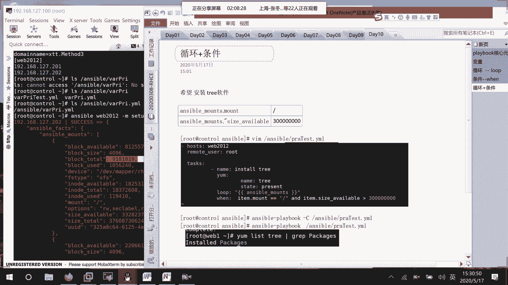
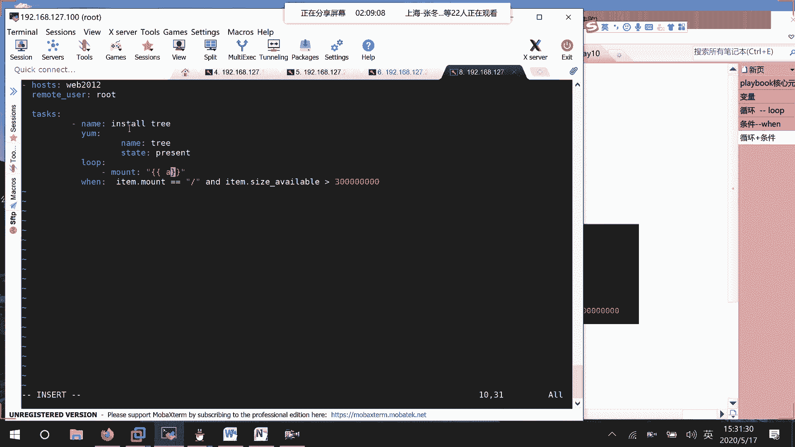
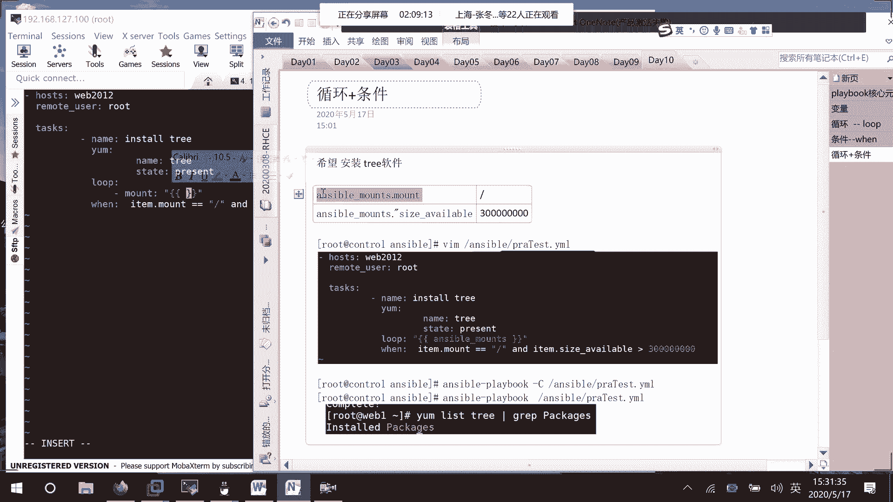
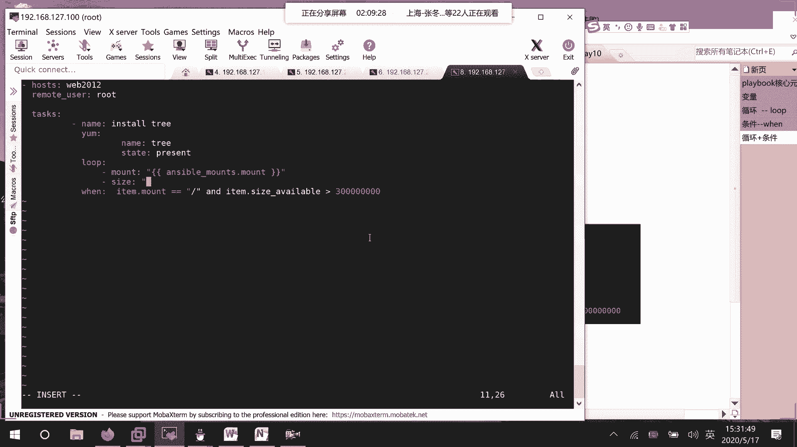
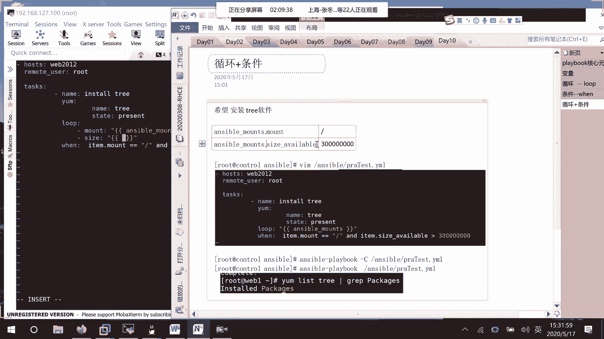
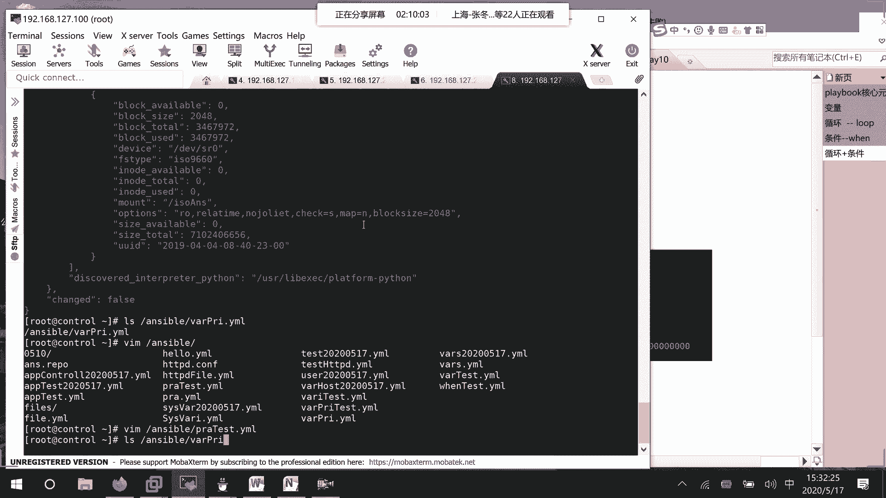
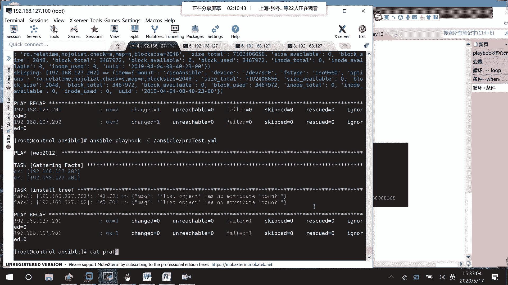
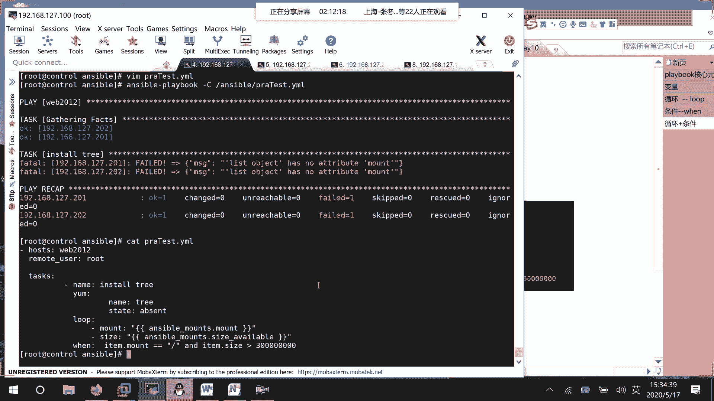
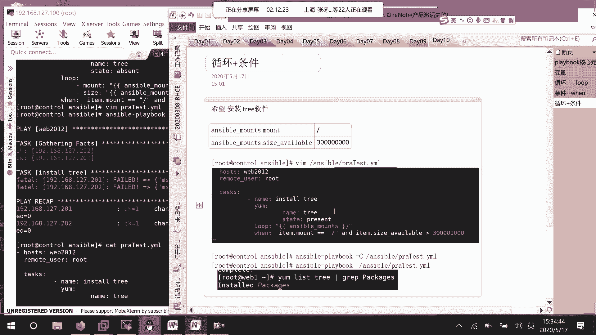
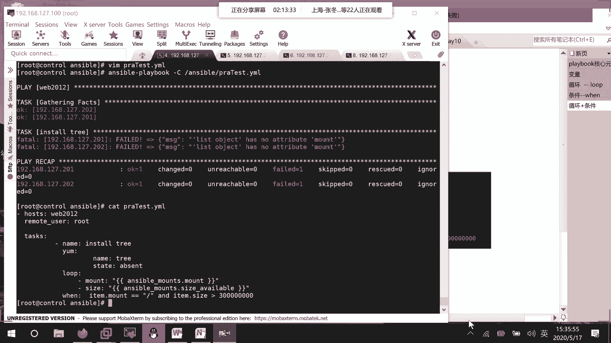

# RHCE8.0视频教程：P44：在Ansible Playbook中处理循环与变量

在本节课中，我们将学习如何在Ansible Playbook中有效地使用循环和变量。我们将通过一个具体的例子，探讨如何从列表中提取变量并进行条件判断，同时分析在编写过程中可能遇到的问题。

## 概述与问题引入



上一节我们介绍了Ansible变量的基本定义。本节中，我们来看看如何在循环结构中访问和使用这些变量。

在编写Playbook时，我们定义了一个名为 `playbook` 的变量，其中包含了多个子项。我们的目标是遍历这些子项，并根据其属性执行相应的操作。



## 变量定义与初步尝试



首先，我们定义了变量。变量 `playbook` 的结构包含了诸如 `item`、`remote_rt`、`mount`、`loop_mount` 等元素。



我们的初步思路是逐个定义变量并从中取值。以下是初始的Playbook结构示例：



```yaml
- name: Practice test
  debug:
    msg: "{{ item.mount }}"
  loop: "{{ playbook }}"
```

## 深入变量访问与条件判断



接着，我们尝试在任务中访问更具体的变量并进行条件判断。我们计划检查每个挂载点（`mount`）的可用空间（`size`）。

我们修改了Playbook，试图在消息中输出 `item.mount` 和 `item.available_size` 的值。修改后的部分代码如下：



```yaml
- name: Check mount points
  debug:
    msg: "Mount: {{ item.mount }}, Available Size: {{ item.available_size }}"
  loop: "{{ playbook }}"
```

然而，执行时遇到了错误。错误信息提示“NO attribute mount”或“list has no attribute”，这表明Ansible无法在当前的循环项中找到我们指定的属性。

## 问题分析与调试

我们开始分析问题所在。错误可能源于变量引用的方式或数据结构不匹配。

首先，我们检查了变量 `item.mount` 的引用方式，确认使用了正确的双花括号 `{{ }}` 语法。



接着，我们怀疑问题可能出在循环变量的作用域或数据结构上。我们考虑是否应该将 `mount` 等变量提取到循环外部定义，或者 `playbook` 变量的结构与我们的预期不符。



通过检查，我们意识到 `playbook` 变量可能是一个列表，而 `mount` 等属性需要从列表中的每个字典元素内获取。我们的循环设置 `loop: "{{ playbook }}"` 是正确的，但需要确保 `playbook` 列表中的每个元素都包含 `mount` 和 `available_size` 键。

## 尝试解决方案与总结

我们尝试调整了变量的访问路径，并重新检查了YAML语法格式。例如，确保缩进正确，并且 `available_size` 的键名与变量定义中的完全一致。

由于时间关系，我们决定将更深入的调试留到课后进行。这个例子清晰地展示了在Ansible中使用循环和变量时需要注意的几个关键点：

1.  **数据结构**：确保你完全了解所操作变量（如 `playbook`）的数据结构（是列表还是字典）。
2.  **属性访问**：在循环中使用 `item.KEY` 访问属性时，必须确保循环中的每个 `item` 都包含该 `KEY`。
3.  **语法格式**：YAML对缩进和格式非常敏感，细微的错误都可能导致任务失败。



本节课中我们一起学习了在Ansible Playbook中处理循环与变量的基本方法和常见问题。关键在于理解变量的数据结构并正确引用其中的属性。遇到错误时，应仔细检查数据结构匹配性和语法格式。