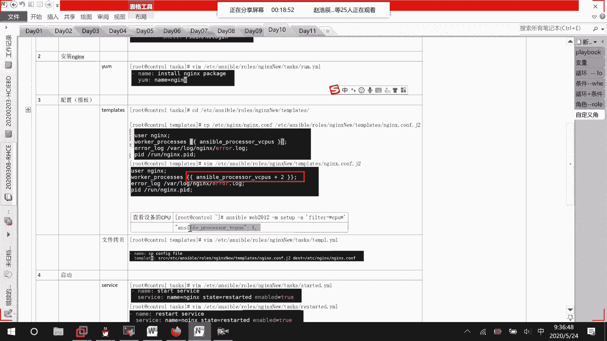
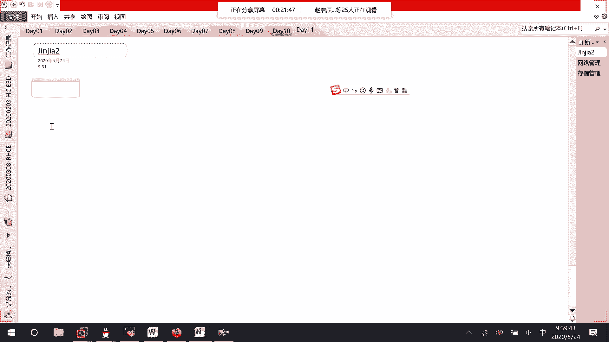
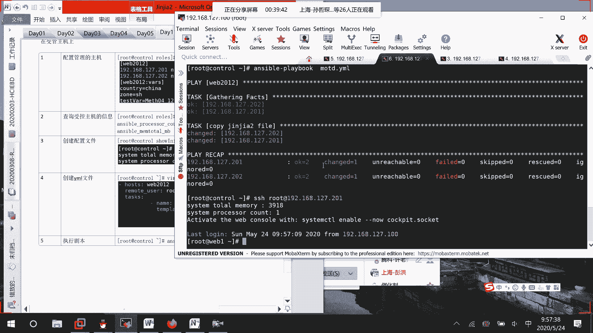
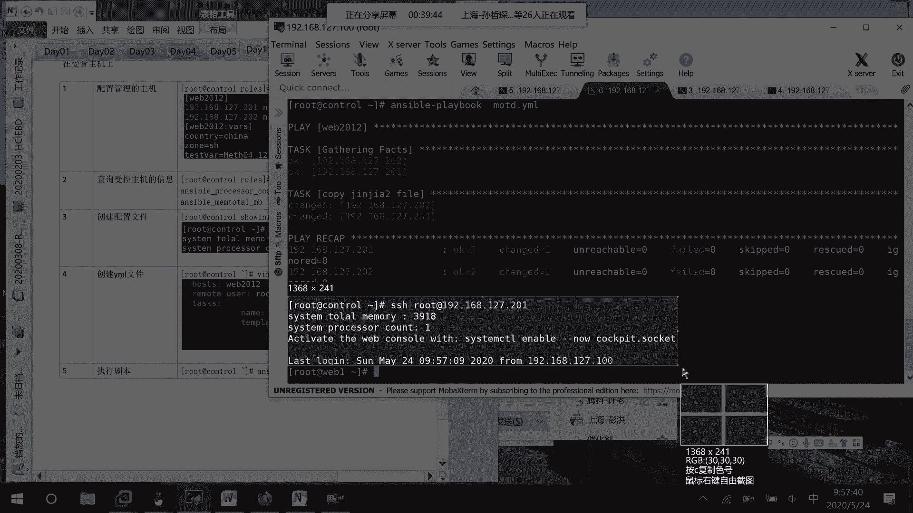

# 01 RHCE8.0视频教程【45课时】 - P46：20200524-RHCE-01_recv - 六竹书生6682 - BV1m84y1f7ss

嗯，好啦，今天这边的话呢我们来去讲讲的一个内容的话呢，就是。一个简单的金加二的一个。这。加2它这一个模板的话呢，我们就是说怎么样去进行一个写嘛。其实主要的话呢，也就是说在我们的配置文件当中怎么样去写。

呃，在我们的一个配置文件当中的话呢，怎么样去使用一个变量，对吧？上节课的话呢，我们也去写了一个，但是的话呢嗯就是位置有点不太对，导致的话呢出现了一个异常。今天的话呢。

我再去把那个变量那一块呢给大家再去讲一下，好吧，这边讲完了之后呢，后面这边。因为模板怎么样去写，然后的话呢它的一个角色的话呢，怎么样去进行一个配置。我们这边的话呢也用NG的话呢去讲过一次了，对吧？

然后下面这边的话呢，我们就是说去讲一下。如果我想要去对对端网络去进行管理的话，它的一个网络管理模块，我该怎么样去写。因为其实的话呢就是你们可以发现在我们的playbook当中。

其实就是这一个一个模块的话呢放在里面，对不对？所以我们前面的话呢讲了一些几个模块。接下去的话呢，今天这里把比如说网络管理模块啊、存储管理啊。就是说之前没有讲过的话呢，这边再来讲一下。

到时候的话呢方便大家在里面去进行一个调用，好吧。那好，我们来回顾一下上一节课的话呢。等一下哈。我们来回顾一下上一节课这里的话呢，其实我们去写了一个叫做NG的一个呃弱角色，对不对？这边的话呢创建用户啊。

安装NG啊，其实全都是没有问题的。主要是这里就是。我们再去定义配置它的一个模板文件的时候，我们想要里面去改一个参数嘛。这边的话呢怎么样改都出错。这里的话呢要稍微注意一下哈。

叫做这样子。Head。我们的呃ETC。Answible。里面的话呢有一个叫做。R。然后呢，template模板。若NGnew。模板模板里面的话呢，有一个叫做就这个。我后面跟了一个J2。

表示是一个金加二的一个文件嘛。其他的话呢不用去看，主要是这里我想要让它呃叫做选择我们执行器的一个个数嘛，对吧？这里的话呢就是说在查出来的执行器，它是一，也就是说CPU是一嘛。

虚拟的CPU我再去加上一个2。

那这样子的话呢，到时候在主机上面呢，它就会去启动几个任务呢？三个任务三个任务。因为这个查出来只有一个一嘛。

然后后面的话呢嗯我去把这上面的N的话呢，把它给移除掉，重新去执行了一个叫做这个playbook。在这边的话呢，我这边就可以看到。123就三个再进运行嘛。

然后呢，你们在做的时候呢，稍微注意一下哈。在这台主机上，N g的话呢，它使用的一个端口是多少？

呃，这边net。Stat NTULP。Grarap。它这边的话呢使用的是不是1个80端口啊？像我们的，我们之前在上课做练习的时候呢，经常会用到HTTP对吧？而且设置为开机自启动。HTTP的话呢。

它使用的也是80端口。所以大家的话呢在进行这个NG。配置的时候呢，把这个HTTP先给禁用掉，或者把HTTP的话呢给卸载掉，不要让他们去出现冲突。因为有一个有一个冲突的话呢是怎么样呢？就是说像我们。

这个端口已经在被使用了，这个端口已经在被使用了嘛，所以呢它也是开不起来的。

明白吧。好好，这个的话呢是上一次课，我们的话呢使用过这个金价二的一个模板。然后这里的话呢，今天我们继续来看一下金加二的一个模板哈。等一下。好，这边的话呢就是说我们学习完了之后呢，就是说像一些配置文件。

我们想要去根据主机上的一些信息的话呢，去进行一个设置。也就是说。我这边的话呢，一个模板文件上面这边的话呢，比如说我写一个三，那定死了所有的主机是不都会去是一个3。如果说我是取它的VCPU的一个数数据。

不同主机的话呢，可能不一样嘛？在这个基础上加上一个2，是不是就可以根据主机的情况去设置我们的一个信息啊。对吧这个的话呢就是在我们配置文件当中去使用一个变量。它的一个好处呢是在这里哈。

然后我们的话呢也用过了playbook啊，也用过了一个角色。其实他们的一个格式的话呢，我们就比较了解了。现在这边的话呢，我们就来学习一下怎么样去进行一个操作，怎么样去进行一个使用，好吧。

我们现在的话呢想要去做一个任务。

你们来看一下。我比如说平时去登录一台远程主机，这边的话呢，是不会去显示出一些信息啊？比如说你什么时候啊，从哪里啊，对我去进行一个登录的嘛。

对吧我现在的话呢，这边就希望这样子啊。在售管主机上。我的话呢想要去给他传文件，传哪两个文件呢？

一个文件是这个。哎，等一下。Cat。ETC。IS。这个文件这个文件的话呢就是普通的。进行一个登录显示的一些信息嘛。它这边的话呢还有一个叫做net文件。但现这两个文件的话呢，它显示的内容是一样的哈。

就是说一个是普通登录的一个信息，一个呢从网络去进行一个登录的一个信息，好吧。还有一个文件，cat ETC。MO。D。回车哎。哦，MOTD。这个里面的话呢，现在没有什么样的一个东西哈。

我们等一下的话呢就是说去进行一个设置，就它的一些欢迎语嘛。好吧，就是说到时候再登录进去的话呢，我们希望去显示出一个我们自己去设置的一个欢迎语语句是怎么样子的。

好。这边的话呢，首先第一步。我们的话呢就是说要去配置。管理的。主机嘛。

但这个管理的主机的话呢，我们一直都已经写好了cat ETC。onsome哎。哦，打出设备了哈。这里。Cat。太要吧。ETC。Unsible。Hos。就是说这边的话呢。

我们还是用这个web2012的这两台主机。稍等一下。

现在这边变量的话呢，咱们是先不用到的，但是呢我还是不去改了。然后接下去的话呢，第二个我们的话呢想要去设置，比如说到时候它在开机的时候呢，去显示我们的一个呃CPU的一个数据啊，还有内存的一些信息啊。

好不好？所以这边的话呢，就是说查询受控主机。的信息，因为就是说想要在上面去进行一个显示嘛。那这边的话呢，我们是不是还是使用之前说的那个setset up的一个模块去进行一个显示嘛，来看一下哈。

Answible。然后呢，这里对WEB2012，我的话呢减M去st up一下，去进行一个显示。其实我们不看到内容的话呢，也是没有问题的。这边去进行查询的话呢，主要就是说它的一个变量名字我们去获取一下嘛。

等一下。

感觉切来切去太麻烦了。呃，我这边的话呢往上拉一下，它这里的话呢显示的信息太多了，其实就上面这边。我这边的话呢，比如说想要去显示它的一个太多了，过滤一下吧。gra和CPU相关的。信息太多了。换。PRO。

CESS。Proces。处理器。😔，这个。ansible process它的一个count，我们等一下的话呢要去使用一下。然后呢，还有一个叫做内存这块，我再来去查一下哈。

MEMmemory肯定是和这个相关的。呃，就memory偷透吧。这个差不多4个G。两台设备这个的话呢是一些系统变量。两台设备上面的话呢肯定是有的，对不对？那行。接下来的话呢。

就是说我们想要让它到时候显示的信息是怎么样子的呢？我们在这里就去设置一个文件嘛。我到anerible里面来吧，然后这里的话呢，make DIR比如说叫做秀。information吧。

然后这里CD show information，这里面的话呢全都是空的，我来一下。VIM。MOTD点J2。就是到时候的话呢要去呃拷贝到远端的一个文件嘛。好吧。现在这里。第三步。设置配置文件。

有一些配置文件的话呢，它自身本身是存在的。但刚才的话呢，你们也看到这个配置文件的话呢，是不是空的呀，所以这里创建。配置文件。那好，里面的话呢，你去写什么东西呢？随便去写，比如说systemtotal。

呃，MEMORY。也就是说它的一个内存是多少呢？空格。它的话呢是不是这两个变量值啊？这两个变量值的话呢，怎么样去进行一个取值呢？稍等一下。我把这个信息放到一个临时文件当中去。等一下啊。

因为等一下每次要查看的时候，要去进行一个切换态，就是说去进行一个显示太麻烦了。你看这个的话呢，是不是它answable facts它里面的一个一个一个一个的信息啊。所以这边的话呢。

如果我们想要去进行一个引用的话呢，可以这样子。就是VIM。unsible，它的话呢ssure in four，然后呢。里面写什么东西呢？就这样子。等一下。矮。画括号画括号。画括画括号。

然后接下去他的话呢是我这个叫做unswable。

Answible。fax，因为它这个是一个jason的一个结构嘛。然后呢。它的方括号里面的话呢，哪一个变量嘛？第一个，比如说它的一个内存信息哎。内存，那我就这样子放在这里嘛。然后接下去的话呢。

如果说还有其他的信息，像我这边system PRRO。然后的话呢，CESSOR然后的话呢，count有几个，那也是一样的。划括号划括号划括号划括号，然后呢，这边它也是一个fax。接下来里面的话呢。

是不是它的一个叫做count的一个信息啊？然后这里引号。方括号就这样子嘛，两个变量，你把它给写上就可以了。这个的话呢就相当于我们刚才去之前写的那个eng的一个配置文件信息吧。它的话呢就这样子。

只是说我们这个配置文件的话呢，稍微小一点，里面的话呢没有哪些很重要的一个信息就进行一个显示。

那好，这个信息写完了之后的话呢，是不是肯定要在一个playbook当中去调用才可以啊？不然的话，我怎么样知道可以去进行一个下发呢，对吧？那好，我们这边的话呢来创建一个。

比如说就叫做MOTD它的一个亚麻文件。所以这里第四步。创建。亚麻文件。也就是说创建我们的一个playbook嘛。这边。回车里面的话呢，首先写什么东西呢？哎哎。里面这里哎。稍等一下。这输入法没切过来。

里面的话呢，哎上面这三个横线的话呢，之前说过你可以打，也可以不去打。然后接下来的话呢，这里面就是说你的一个主机谁去进行一个运行嘛，我们是不是WEB2012去进行一个运行啊？稍等一下。

他这边的话呢没有去进行一个空行。那好，没关系。然后接下去的话呢，我们就要去说一下谁去进行一个运行嘛，remote user。冒号。ROOT去进行一个运行。接下来的话呢，我们是不是就要去写任务了？

task。这边的话呢，比如说我们给他去设置一个名字。第一个任务ns他的话呢就是说是去。呃，copy。蒹葭2。fire就这样子。😡，然后呢，首先这个原文件在哪呢？是不是和我在相同的一个目录当中啊。

我就不用写太多了嘛，直接就写MOD点J2就可以了嘛。接下去我这个文件的话呢，想要去拷贝到目的地的哪个位置呢？你看是不是想要去拷贝到他们这里来LSETCMOD这这个位置来把它去进行一个替换嘛。

对吧所以这里的话呢在拷贝的时候，我们就这样写斜线ETC斜线MODT这样子就够了。然后的话呢，接下去。哎，我这边写哦任务没有去写啊，任务忘记去写了。这个是一个模板的一个拷贝。模块忘记去写了。

TEMPLATE。模块忘记去写了，这边缩进估计也得重新打一遍。我还是重新说进一下吧。好。就这两个。然后接下去的话呢，我们是不是就可以保存退出啦？然后到时候的话呢，我们再去执行一下这个文件就行了嘛。

其他的我们先不管，先来执行这个文件。我把这个文件给你们去哎。VIM。

把这个文件先给你们去拷贝一下哈。

等一下。算了，我写到下面去吧，上面的话呢我得重新去弄一下，这里answible playbook。我的话呢先来检查一下这个文件有没有问题。哦，ns那估计是里面哪里写的有问题了哈，多了一个S。

再来检查一下。那好，这边的话呢，好像说两个任务都是正常的。哦，我看一下啊。Could not access。那写一下全称吧。文件访问不到。这个文件的话呢，现在就在我的当前目录下。叫做PWD。嗯。

has no哎，我这不是复制粘贴过来的吗？等一下。VIMETC哦，不对。VIM answersable show。这个。我这个东西不要了。不要用这种字典顺序，我就直接写个简单的格式，看行不行啊。

Answable memory， total M B。没问题。好，这个时候没有问题啊，我刚才的话呢又去改了一个地方，我给大家去看一下先哈。它这边的话呢，字典顺序是不能这样子去写。

但是的话呢在我们的红帽的官方教材当中的话呢，它前面是加了一个字典的一个顺序。但这边的话呢就是说不能用字典顺序，直接就写它的一个变量的一个名字就可以了，好吧。那行，这个时候的话呢。

好歹这个脚本线能就是说这个play不可能去运行了。那好，现在呢我们来使用一下。等一下哈。这里。执行剧本。他这很快。就可以去进行一个显示的。现在的话呢我来去试一下，比如说SHH192168127。

201试一下。嗯，这边你看是不是就显示了这个信息啊，就是说你的一个总内存是怎么样的。还有的话呢，就是说。你这边的话呢，处理器的总个数是怎么样的，是不是就有去进行一个显示啊？

你们的话呢还想要去设置，就是这个文件可以去设置一下。像我刚才说的ISISSUE那个文件的话呢，自己也可以去调整一下里面内容去进行一些显示，好吧。

然后接下去第六步测试。这样子。这边的话因为今天内容的话呢比较不紧张，所以的话呢这里给大家去10分钟时间去把这个添加二的一个模板的话呢去试一下。好吧，它这个很简单。

就花括里面呢写上一些啊系统变量的一些值嘛，就可以了。看明白了吧。去做一下哈，我们等。

