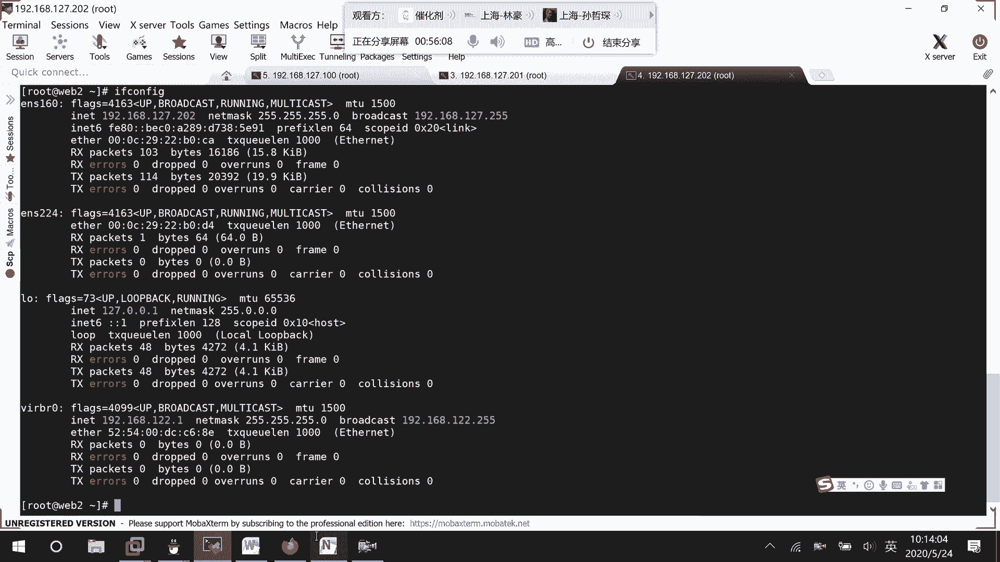

# 01 RHCE8.0视频教程【45课时】 - P47：20200524-RHCE-02_recv - 六竹书生6682 - BV1m84y1f7ss

嗯那好，那这边的话呢我们就我回过来继续去看，因为前面的话呢我们不是讲了几个模块信息吗，那几个模块信息的话呢，因为就是说比较好掌握，比较好使用，我们先去讲了，下面这边的话呢我们再去讲几个。

就是说工作当中比较常用的，以及我们考试当中呢会去用到的，第一个的话呢就是我们这个网络管理嘛，他这个的话呢就是我们可以去给受控的主机，因为就有些人觉得很奇怪，这主机都已经受控了。

为什么还可以去给它配置一些叫做IP地址，这些信息呢，那就比如说你万一还有其他的一些网卡，要去进行一个调整，它上线了，那你该怎么办，是不是可以去配置啊，这边的话呢在进行一个配置的时候呢。

我们使用的是一个叫做NMCLI的一个命令哈，然后或者的话呢你也可以就是说去使用，我们这边就之前在讲呃角色管理的时候，这里的话呢不是有很多个吗，其中这个叫做rose network的话呢。

就是和我们相关的，就是说和我们网络配置的话呢相关的一些信息，这边的话呢我们可以进来看一下哈。

可以进去看一下，应该还在的，我应该没有还原掉CD，user是，Unstable rose，这边的话呢，linux system若是net啊，有network CD。

linux rules network这相关的，然后这里面的话呢，它就有很多的一些配置信息嘛，就比如说这里啊它的一些诶好长啊，这里就说一些默认的一些信息，还有就是说一些模块的LS2的一个信息。

然后下面这边的话呢，还有就是说一些设备断言的一些信息嘛，还有呢去测试网络的一些情况嘛，对不对，全都在这里的话呢，有要进行一个提供哈，那行，那这边的话呢如果说我们自己要去进行一个。

就是说去创建一个简单的playbook就好了，因为他这里的话呢就是说特别大型，里面东西很多，那我们首先要了解一下，怎么样去使用我们network的一个模块啊，就是说网络配置的模块。

才可以来用它的一个rose嘛，我就不去整他这个复杂了哈，那这边的话呢比如说vim啊，network20200524点YML2里面的话呢。

它会有很多信息，就像之前的话呢配置其他的模块，它也是一样的，我这边给你们去列一下第一个names，我们平常的话呢在task当中去写一个，他的一个名字的话呢，它的一个name是就是一个标志的作用对吧。

但这边的话呢如果说我们再去配网络，连接它的一个压码文件里面的话呢，它有一个属性，就是一个name属性，这个属性的话，那就表示我们的连接名字。

因为我们平时的话呢是不是会这样子啊，这里的话呢是不是有个name啊。

所以的话呢在我们的配置文件啊，就是说playbook当中的话呢，有个name选项，写的就是我们连接的名字是什么，然后接下去state这个start的话呢就表示什么呢，我们连接的一个运行状态。

你的话呢是要给它启动起来呢，还是说要把它给关掉，有这两种，接下去的话呢还有一个PERSIST，E n t st，这个的话呢就是说要是不是要配置为持久连接，也就是说开机的话呢，要不要去进行一个自动启动嘛。

开机要不要进行自动启动，所以的话呢也叫做持久类型，他的话呢有两个PRESENT，这个的话呢就是说持久类型，开机自动启动，然后还有一个absent，这个呢就是说开机不自动启动。

还有接下去type就表示的话呢，我们连接的类型是什么，这里的话呢类型很多，我们比较常用的，我去给你们说几个，第一个is nee的话呢，没有大写，还有的话呢我们平时之前不是去做过teen嘛，对吧。

他这也有个T，然后的话呢像你们可能在工作当中的话呢，还有一个BB对吧，这几种模式你们知道一下就行了，然后这里的话呢还有一个auto connect，那这个的话那应该就是，是不是永久有效。

永久有效持久类型，这个的话呢是开机自启动啊，那这里的话那肯定就是说yes和NO这两个嘛，接下来的话呢就是说你去添加一个Mac地址，这个的话就是说嗯，给哪一台设备去进行一个使用吗。

就好像我这边的话呢，受控主机他不是有好几个网卡吗，我要给哪个网卡去进行使用的，是不是要标注一下这个的话呢。

是不是可以通过fact它变量去进行一个获取，对吧，这个一种就是说你去查看到了，把他给定死了，还有一种的话呢，我们之前是不是学过FACT，它里面有很多变量，你自己去提取相应的一个位置吗。

然后接下去的话呢叫做interface。

内或者的话呢就好像说我到了这台设备上面。

给哪一个网卡的名字去进行一个使用吗，因为标志的方式的话呢有有好多种呃，叫做使用的主机，它也是去标志啊，主机使用主机，这个叫做网卡，下面这边的话呢也是网卡，那好然后接下去的话呢。

就是说你还可以去定义它处于什么样的一个，防火墙的一个区域，因为你们来看一下。

像这里我换一台吧。

过，你们其实这个网卡属于叫做属于，哪个区域的话呢，一种方式就是说防火墙来的时候，你就说配置防火墙的时候去进行一个添加，还有一种方式网卡的时候呢，你就可以立刻去进行一个调整，嗯我找一下。

这里应该是有个zoom，这里好像，master这里没有去显示出来。

我们去看一下图形化界面吧，等一下，你看这个叫做不是这哦，这里就防火墙属于什么区域吗。

其实都是可以去配的好吧，如果说你现在的话，因为在工作当中的话呢，想要直接去进行设置，那就zoom后面的话呢，跟上你的防火墙的一个区域就行了，然后接下去的话呢一个比较重要的信息。

就是我们的一个IP地址信息吗，比如说它的一个地址，因为我们之前在配IP地址是IP address，然后接下去的话呢就比如说DNS的信息啊，都可以去进行一个配置吗。

那好这边的话呢我们要不简单的去写一个好吧，简单的去写一个哈，我来看一下。

就这样去写吧，在这里就是说首先这里第一个HOSTERS，你的话呢要给谁去使用，比如说我们还是给这个web2012，去进行一个使用，然后接下去远端的一个操作主机的话呢，是呃操作用户的话呢是谁。

比如说是我们的一个root用户，然后接下去的话呢，就是说我们要去写我们的task的一个信息嘛，那么好，然后这边的话呢要去写的一个信息，第一个使用的模块network connections。

那这边的话呢task可以先去起个名字哈，冒号里面的话呢就去写嗯，CONFIG呃，ENS224ip info它的一个信息，然后接下来第一个我们刚才说到的，他的一个叫做连接的名字嘛。

比如说我们叫做E224test，然后下面这边的话呢，它的一个连接类型是什么呢，因为ETHERN，ET叫做以太网的一个类型嘛，然后下面这边的话呢嗯像一些Mac地址的信息啊，我们这边的话呢先不去不去配置嗯。

去配置一下吧，去配置一下吧，au outer connect开机开机的话呢，我们就对它进行一个自动启动，然后这边的话呢Mac地址，他这边的话呢估计我们有两台设备嘛，我这边就不要这样子去写了。

比如说叫做inter face name，他们的话呢全都是叫做嗯，1224都对这个去进行一个配置好吧，然后接下去的话呢，我们要去写的叫做他的一些IP信息嘛，第一个他的地址信息是多少，这边地址信息的话呢。

嗯可以去写一个网段信息，写个网段信息吧，我这边估计得用循环，我这边去写某一台设备好了，就不写两台了哈，稍等一下，我就不写两台设备了，Vim etc enerable hosters，我看一下行。

我这里有没有写一个单台的设备诶，我这边有，我这边的话呢，就192168127。201吧，就不写这么多台了哈，得去写循环，192168127。201，就这台，然后这边的话呢比如说我现在要去写地址。

把它配置成192168127点嗯，多少呢，1018101线没有人哦，101线有人去用，或者叫做11吧，11现在的话呢没有人去用，他的野马的话呢是一个24位的，就这样子就可以了，然后下面这边的话呢。

或者你这样子去写空格横线，这样子嘛，因为就是说像有时候的话呢，一台主机它有多个IP地址对吧，那你就说这边写多个横线的话，那就表示配置多个IP地址，然后接下去比如说还有一个信息叫做DNS的，等一下哈。

我把它往上吧，8。8。8。8，就这样子，稍等一下，好声音没了，那就这样子的话呢，把它给配置好了嘛，然后像防火墙的车呀，你自己想要去添加的话呢，自己就去添加，自己不想添加的话呢，那就算了。

那现在这边我们来测试一下，这个能不能成功好吧，来试一下，叫做unable杠playbook，杠大C，Network connections，Netmt connections，A name in f。

等一下，network c o n n哦哦我少了东西了，C o n n e c t i o n，这个，Nice ipv4，Name，这个诶这个没有问题啊，type没有问题，Connection yes。

也没问题，IPINT啊，interface诶，这没有问题啊，我看一下先他报的是configure，Ipv4，他报的是这里，嗯task，Name，去取个名字，是我这个模块有问题吗，我看一下。

好像这个模块在进行一个连接的时候，我改一个模块，看改成那个NMCLI的一个模块，然后这边connection name，然后这里他的网卡的一个名字，If name，我改一个模块，那个模块我现在不行。

If name type isn't net，然后呢自动连接，然后这边的话呢我去换一个，这边比如说IPV41921619，2。168。127。十一二十四位的，然后这边的话呢叫做给他配个网关。

是192168，17。2给他去配个DNS，8。8。8。8，这几个应该是没有什么问题的呀，再给它去设置一个启动状态吗，PRESENT默认就是这个状态，我看一下，先稍等一下啊，201task name。

然后的话connection n这边前面就不要横线了，我看一下这个应该是没有问题的，我来试一下，这边有问题，等一下呃，201。

Unsupport for model ip vs sp otto connect connection name，诶，那我是哪个有问题，等一下我先检查一下cat network host。

Remote task，Connection name，没问题，T y p e，TIP应该也是没有问题的呀，a ut auto connect没有问题啊，if name就是我们网卡的一个名字。

衣服name嘛，然后接下去IPV4的一个信息吗，getaway的一个信息吗，DNS的一个信息吗，state的一个信息吗，等一下我来看一下，先是我哪里写错了，这边的话呢就是他没有一个V哈。

我刚才加了一个IPV4了，就IP4，因为是一个四版本的，而不是六版本的嘛，然后所以这边get v4，然后还有一个叫做DNS4，然后状态的话去改成present，然后这边我们来再来运行一下。

应该就没问题了吧，啊再来测试一下，检验一下，稍等一下诶。

