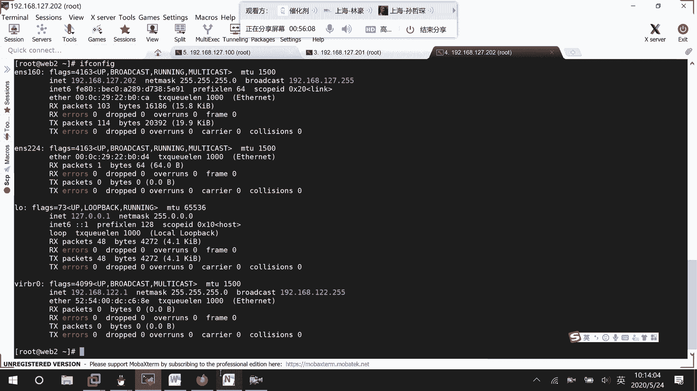
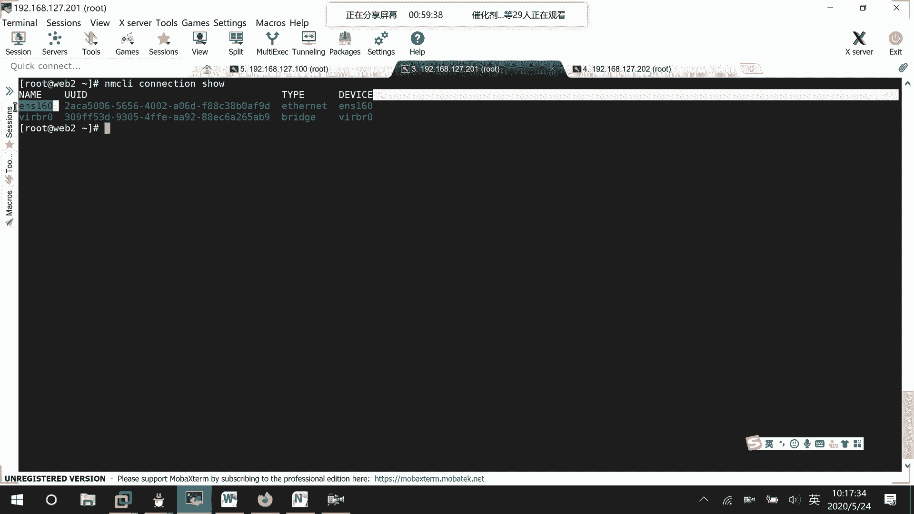
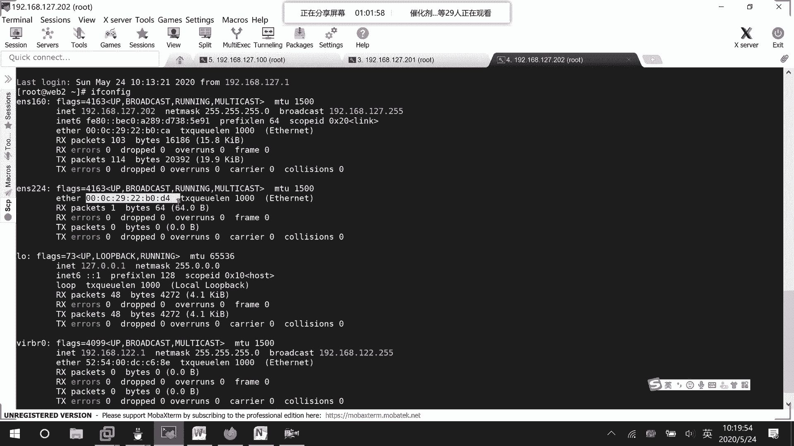
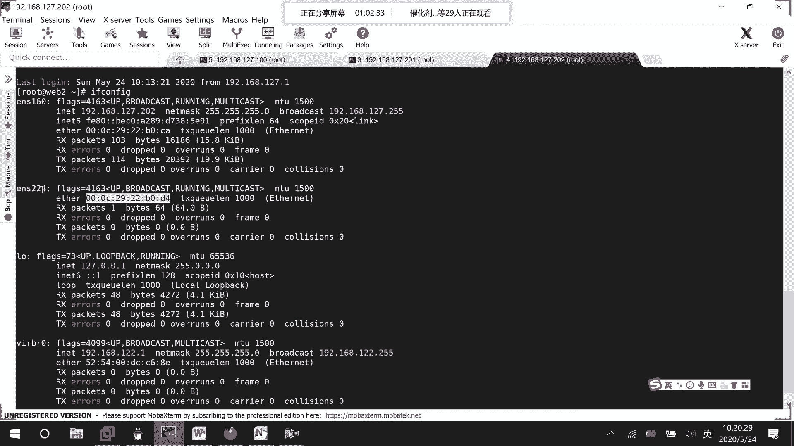
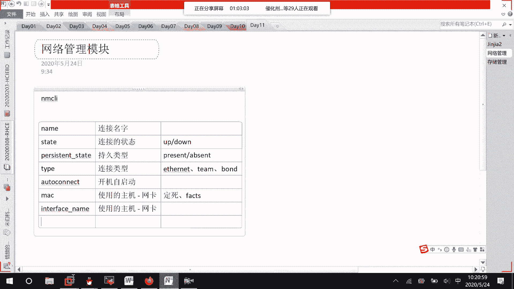
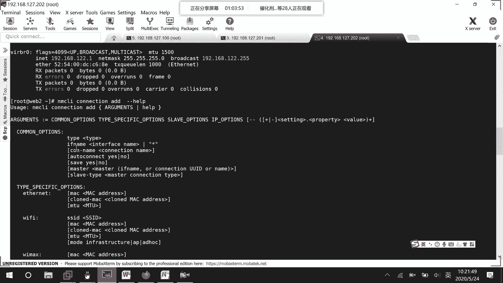
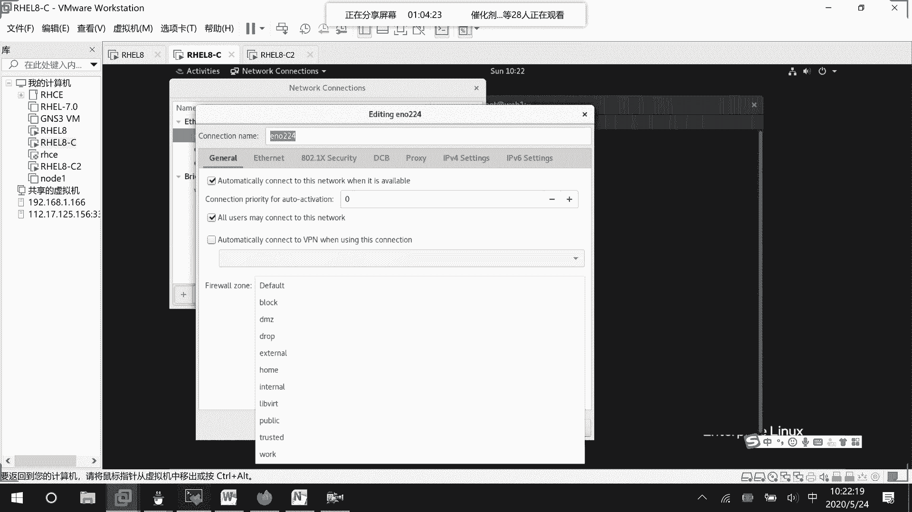
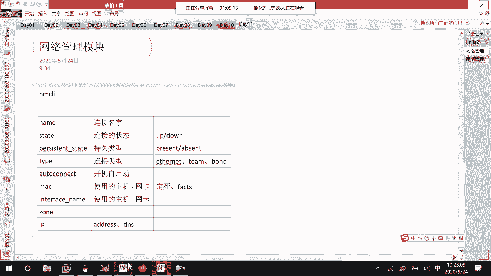
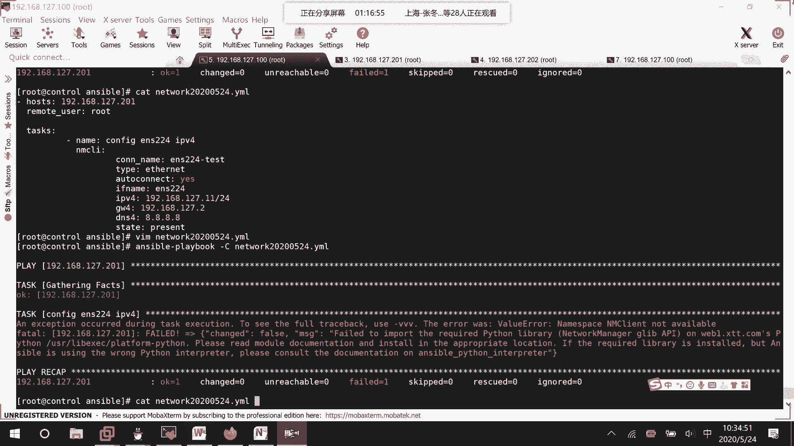

# Ansible网络管理：02：网络连接配置模块详解



在本节课中，我们将学习如何使用Ansible的`nmcli`模块和`network`角色来管理受控主机的网络连接。我们将重点介绍如何通过编写Playbook来配置网络接口的IP地址、DNS、网关等关键信息。


## 网络管理模块概述

上一节我们介绍了几个基础且常用的Ansible模块。本节中，我们来看看网络管理模块。网络管理模块允许我们远程配置已受控主机的网络参数，例如为新上线的网卡配置IP地址。这在实际运维和考试中都非常实用。


主要可以通过两种方式实现：
1.  使用`nmcli`命令对应的Ansible模块。
2.  使用Ansible角色管理中的`linux-system-roles.network`角色。




`linux-system-roles.network`角色功能非常全面，包含了默认配置、设备断言、网络测试等多种功能。为了便于理解，我们先从基础的`nmcli`模块入手，学习如何编写一个简单的网络配置Playbook。

## 网络连接模块核心参数

以下是`nmcli`模块中一些最常用和重要的参数及其含义：




*   **`name`**: 指定网络连接的名称。例如：`ens224-test`。
*   **`state`**: 定义连接的状态。可选值为`present`（启动/存在）或`absent`（关闭/删除）。
*   **`persistent`**: 定义是否为持久化连接（即开机是否自动启动）。可选值为`yes`或`no`。
*   **`type`**: 指定连接的类型。常见类型有：
    *   `ethernet`：以太网
    *   `team`：链路聚合组
    *   `bridge`：网桥
*   **`autoconnect`**: 定义是否自动连接。可选值为`yes`或`no`。
*   **`mac`**: 指定连接所使用的物理网卡的MAC地址。可以通过Ansible Facts变量动态获取。
*   **`ifname`**: 指定连接所绑定的网络接口名称（如`ens224`）。这是标识使用哪个网卡的另一种方式。
*   **`zone`**: 定义此网络连接所属的防火墙区域（如`public`、`internal`）。可以在配置网卡时直接指定。
*   **`ip4`**: 配置IPv4地址、子网掩码、网关等信息。格式为CIDR表示法，例如：`192.168.1.10/24`。
*   **`gw4`**: 配置IPv4默认网关。
*   **`dns4`**: 配置IPv4的DNS服务器地址。




## 编写网络配置Playbook




现在，我们尝试编写一个Playbook，为指定主机配置网络。假设我们只对主机`192.168.127.201`进行操作。





```yaml
---
- hosts: 192.168.127.201
  remote_user: root
  tasks:
    - name: Configure IP info for ens224
      nmcli:
        connection_name: ens224-test
        type: ethernet
        autoconnect: yes
        ifname: ens224
        ip4: 192.168.127.11/24
        gw4: 192.168.127.2
        dns4: 8.8.8.8
        state: present
```



**代码解释**：
*   `hosts`: 指定操作的目标主机。
*   `remote_user`: 指定远程执行任务的用户。
*   `tasks`: 定义任务列表。
*   `nmcli`: 声明使用`nmcli`模块。
*   模块内的参数对应上一节介绍的核心概念，为`ens224`接口创建了一个名为`ens224-test`的连接，并配置了IP、网关和DNS。

**注意**：如果需要为一个接口配置多个IP地址，可以使用YAML列表格式：
```yaml
ip4:
  - 192.168.1.10/24
  - 192.168.1.11/24
```

## 测试与验证

Playbook编写完成后，务必先使用`--check`模式进行语法和逻辑预演，确认无误后再执行。

```bash
ansible-playbook network_config.yml --check
```

如果预演通过，则可以正式运行Playbook：

```bash
ansible-playbook network_config.yml
```

执行后，可以登录到目标主机使用`nmcli connection show`或`ip addr show ens224`等命令验证配置是否生效。

## 课程总结



本节课中我们一起学习了Ansible网络管理的基础知识。我们了解了使用`nmcli`模块远程配置网络连接的核心方法，详细介绍了连接名称、状态、类型、IP地址等关键参数的含义和用法，并成功编写、测试了一个完整的网络配置Playbook。掌握这些内容，你已能够使用Ansible自动化完成基本的网络接口配置任务。