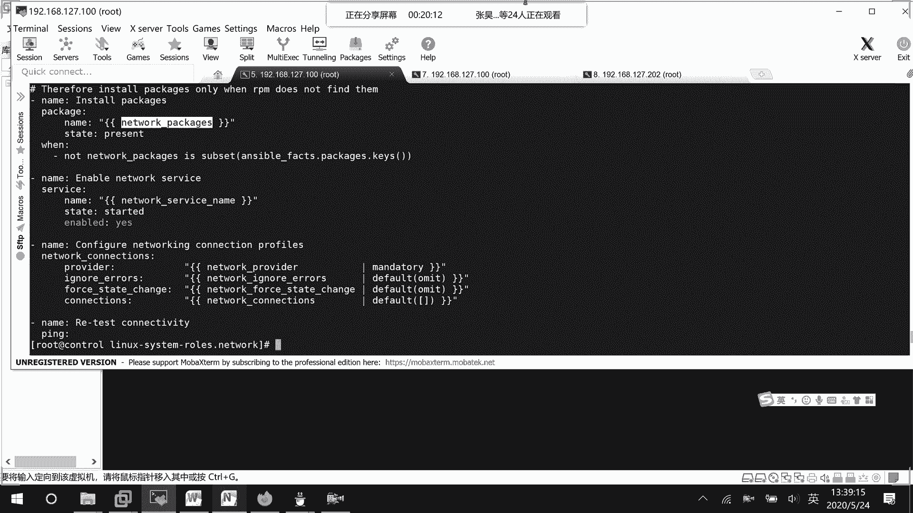
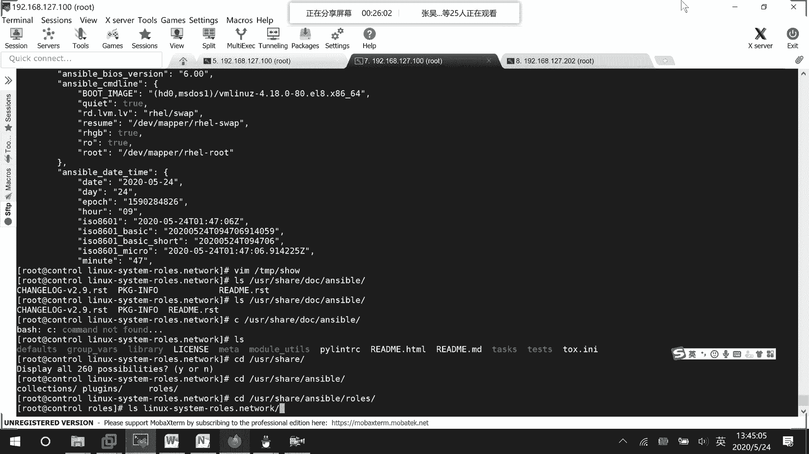
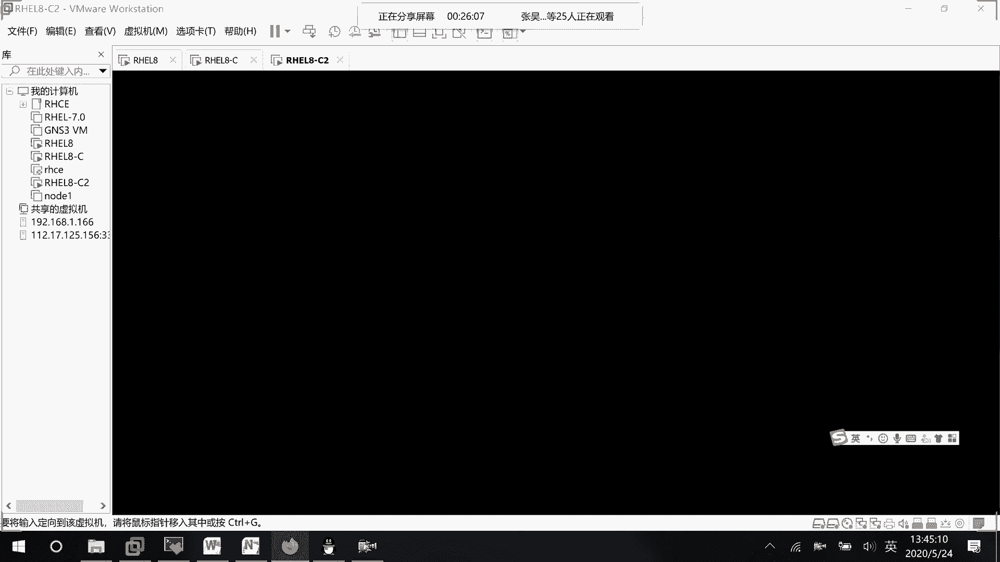

# 01 RHCE8.0视频教程【45课时】 - P49：20200524-RHCE-04_recv - 六竹书生6682 - BV1m84y1f7ss

好这边的话呢我们来看一下，刚才的话呢我单独去写一个playbook的话呢，它是不能去用的，在我们的实验手册当中的话呢，它是使用角色的方式去做的，我们之前的话呢去安装过角色对吧，share叫做，稍等啊。

叫做user shell，后面这边的话呢就是我们的doc，User shadoc，等一下我看一下哦，我走错设备了，我应该来这边，City user share，Unable。

然后这里面的话呢他有很多的一个角色，我们的话呢就进入到这个network的一个角色里面，在这里面的话呢，我们先来看一下这个叫做read me，他这里的话呢就说了，这个的话呢它是一个网络的一个角色。

他可以去配置的一些接口，有以太网口啊，WLAN口，对不对，然后这边的话呢它是一个简介，然后这边的话呢就说我们来看哈，变量这边的话呢你要去定义的变量，就是网络的一个提供者去进行一个配置的，你要配置谁嘛。

然后这里下面这边的话呢，比如说我们想要去配置一个网络的连接信息，是怎么样子的对吧，网络的一个，我们现在的话肯定是要去配置，网络的一个连接信息嘛，下面这边的话呢他就说设置变量的一些情况。

网络提供者就是NMCI嘛，然后这边它的一个网络连接信息，就是名字ETH这样子去设置，对不对，然后下面这里的话呢，就是稍等一下这个名字变量，它这个name的话呢它是必须要有的。

state它这里的话呢就是一些up down的一个情况嘛，开开启啊，关闭啊，对不对，然后这边的话呢，就是说相当于我们使用这个命令，nm CLI connection谁。

然后的话呢给他up起来或者down掉吗，这些的话呢其实看过去都没什么问题，持久的一个状态，然后这里类型的话呢是怎么样去写的，对不对，区域，然后呢，下面这边教我们怎么样去配，IPV4的一个信息嘛。

然后这边的话呢去创建一个网络的连接，你看压码文件，你可以这样子去写名字类型是否自动连接嗯，Mac地址就是说对哪台设备嘛，然后DHCP的一个形式就这样子去写啊，他是没有问题的，下面的话呢就是一些桥接啊。

win的一些形式，然后这边的话呢就它设置IP地址的一些形式吗，network eth h type IP地址，你看DNS啊，Get away，他这边又写了一个全称，但是我们那边显示出IP4GW4。

能用的话，那也是可以的，这就没什么问题吗，兼容性的兼容性的一些说明啊，就这样子就结束了呀对吧，我们现在的话呢来看一下它的一个主文件吧，More task man，这里面的话呢它很简单，第一个我要去检查。

第二个的话呢我要去对他进行一些包的安装嘛，第三个的话呢就是说打印出一些信息，然后第四个去安装那些包，安装安装那些叫做network packages。

就是说他需要的一些包嘛，然后下面这边的话呢，它这里就是说，当你的package是这里的一个子集的时候，不是子集的时候你才去做，是子集的时候就不去做嘛，我们来看一下哈，unstable哦。

这里边more temp show，我早上的话呢去进行一个显示，这边的话呢说去找什么变量呢，Package p a c k a g e s，Facts，Animal，Facts pk a g e。

没找到，哦我打错了哈，没有也是没有，这边的换了一些包的信息，没有哈，等一下再去看吧，然后这里的话呢就去启动一些服务嘛，然后下面这边的话呢我们就去配置连接，要去提供provider。

就说哪嗯哪一个网卡信息，然后呢设置为什么样的一个状态，连接信息是怎么样的，然后这里的话呢去进行一些测试嘛，这些其实全都是一些变量，对不对，我们来看一下它这边的一些变量信息的话，会放到哪里去。

这里的话呢就是一些变量信息嘛，你看这边service，稍等哈，上面信息太多了诶，Modef，他这边的话呢，就是哦第一个像这边Python的一些信息，对不对，然后呢他的一些信息network啊什么的。

REDHAT或者怎么的版本是多少，然后他要去装什么嘛，NM这边其实都已经有了呀对吧，他这边的话呢其实变量信息全都已经写全了，然后我在这边是干嘛呢，比如说我自己想去赋值嘛。

我去创建一个group values，所以这边group values，比如说我专门为这台主机创建web，零二去创建了一个network相关的变量，文件里面写什么呢。

我想要去对224这个网卡去进行一个设置，类型的话呢，设置成isn't ne IP地址，就配置一个127。177好了，野马是24位的，那好这个变量文件的话呢，如果你都已经写好了对吧，在这里面了吗。

然后接下去我们是不是就可以去写一个，unstable的文件来调用这个角色啊，比如说vim network rose，这边的话呢就说在哪一台主机上运行remote user，你去说一下。

比如说ROT现在这里的话呢，你不需要去执行任何任务，你只要说是在哪一台上面去进行一个叫做呃，就是说去执行哪个角色是不是就可以了，我们这个角色的一个名字呢，就ls is user shell。

Dooc aerable，弱，稍等一下，嗯我看一下CD，Cd，User shell，Unstable rose，他这边的话呢就是l s linux network这个嘛，这个角色对不对。

所以network角色的话写在这就行了，那这边的话呢我们去运行一下嘛，叫做unable playbook，然后呢network rose，他这边的话呢也是会报错，就说出了一个错误提醒，呃。

这边的话呢就是去检查服务有没有，然后这边的话呢去给一些包去进行一个安装，他这个方法很多种，使用这个NM模块吗，启动网络服务，然后这边的话呢就是说配置它的一个连接，这边的话呢是他自己写的东西。

他这边都报错了，你看啊，我在这边nm cl i connection show，我没有看到自己创建的那个信息，然后他的话呢也没有一个IP地址，流程的话是没有问题的，参数也没有问题。

