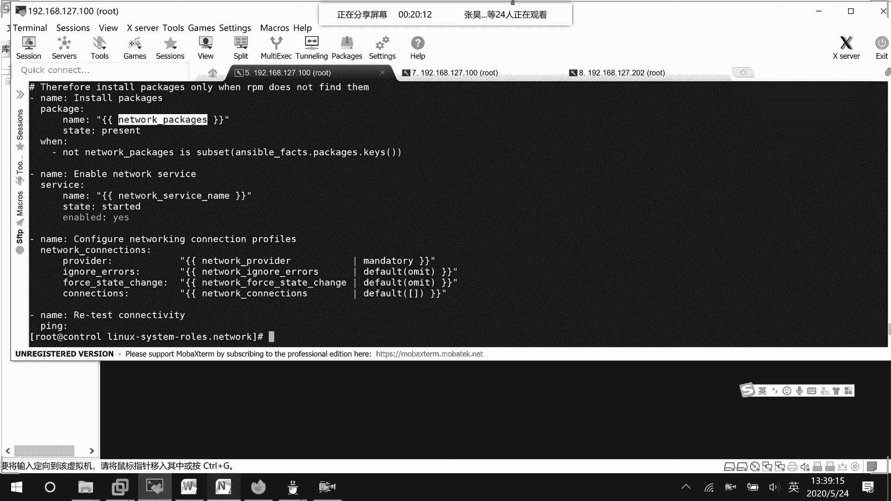
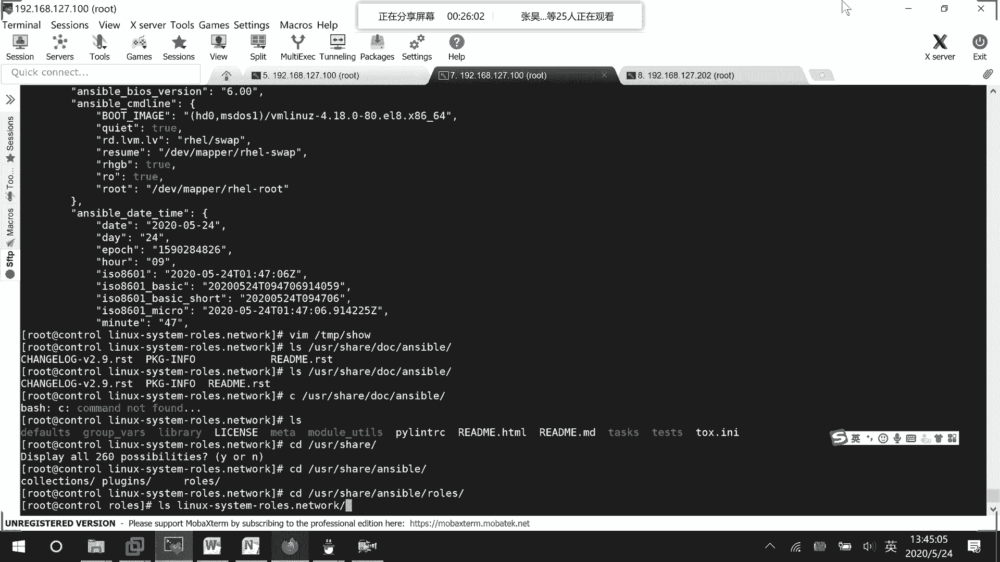

# Ansible角色实战：网络配置 🖧
## 课程01：章节04：使用Ansible Galaxy角色配置网络

在本节课中，我们将学习如何使用从Ansible Galaxy下载的预定义角色来配置网络。我们将分析一个网络角色的结构，并尝试通过编写变量文件和Playbook来调用它，完成网络接口的配置。

上一节我们介绍了如何手动编写Playbook，本节中我们来看看如何利用社区共享的角色来简化配置工作。

---

### 角色结构分析

我们之前从Ansible Galaxy安装了一个名为 `linux-system-roles.network` 的角色。这个角色专门用于配置网络接口，例如以太网口或WLAN口。

首先，我们查看角色的说明文档（README），了解其功能和用法。

以下是该角色支持的主要配置项：

*   **网络提供者**：默认为 **`NetworkManager`** (通过 `nmcli` 管理)。
*   **连接信息**：需要定义网络连接的名称（如 **`eth0`**）和状态。
*   **连接状态**：使用 **`state`** 变量控制，可选值为 **`up`** 或 **`down`**，对应启用或禁用连接。
*   **IP配置**：可以设置IPv4地址、子网掩码、网关和DNS。

例如，在变量文件中，一个基础的网络连接配置可以这样定义：

```yaml
network_connections:
  - name: eth0
    state: up
    type: ethernet
    ip:
      address:
        - 192.168.1.100/24
      gateway4: 192.168.1.1
      dns:
        - 8.8.8.8
```

---

### 角色任务解析

接下来，我们查看角色的主任务文件，了解其执行流程。

```bash
more tasks/main.yml
```

以下是任务文件中的关键步骤：



1.  **预检查**：验证系统环境。
2.  **安装软件包**：确保所需的网络管理包（如 `NetworkManager`）已安装。
3.  **启动服务**：启用并启动 `NetworkManager` 服务。
4.  **配置连接**：这是核心步骤，根据我们提供的变量（如 `network_connections`）来创建或修改网络连接。
5.  **测试验证**：进行一些基本的连接测试。

整个流程依赖于我们在Playbook或变量文件中定义的参数。

---

### 实践：调用角色配置网络

理解了角色的结构后，我们开始实践。目标是为一台主机配置一个静态IP地址。

首先，我们为特定主机组或主机创建变量文件，定义网络参数。

```yaml
# 文件：group_vars/web_servers/network.yml
network_connections:
  - name: eth0
    state: up
    type: ethernet
    ip:
      address:
        - 192.168.177.100/24
      gateway4: 192.168.177.1
```

然后，我们编写一个Playbook来调用这个网络角色。

```yaml
# 文件：network_role.yml
---
- name: 配置网络
  hosts: web_servers  # 指定目标主机
  remote_user: root
  roles:
    - role: linux-system-roles.network
```

最后，运行这个Playbook。

```bash
ansible-playbook network_role.yml
```

---

### 执行与排错

运行Playbook后，角色会按照任务顺序执行。如果一切顺利，目标主机的 `eth0` 接口将被配置为指定的静态IP。

如果执行报错，需要检查以下几个方面：

*   **变量定义是否正确**：确保 `network_connections` 下的参数名和结构符合角色要求。
*   **网络接口名称**：确认目标主机上是否存在 `eth0` 接口。
*   **权限问题**：确保Playbook以足够的权限（如root）运行。

可以通过 `nmcli connection show` 命令来验证配置是否成功应用。

---



### 总结


本节课中我们一起学习了如何使用Ansible Galaxy上的社区角色。我们分析了 `linux-system-roles.network` 角色的文档和任务结构，并通过定义变量文件和编写简单的Playbook成功调用了该角色，实现了网络接口的自动化配置。使用角色的好处在于可以复用经过验证的、功能完善的代码，极大提高了自动化效率和可靠性。