# Ansible教程：01：课程概述与核心概念回顾 🎯

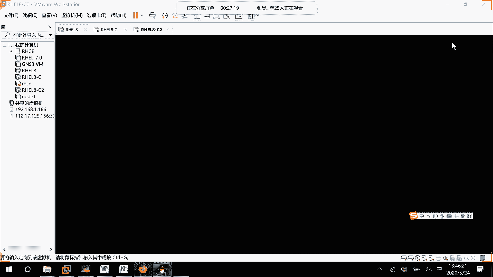

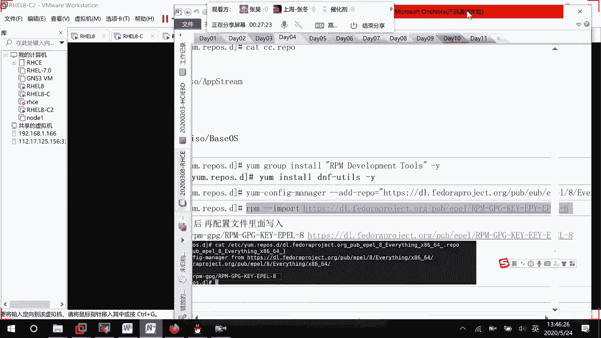

在本节课中，我们将对Ansible的基础知识进行系统性的回顾和梳理。课程将涵盖Ansible的核心概念、模块使用、变量管理、任务控制以及故障处理等关键内容，旨在帮助初学者构建清晰的知识框架。

---

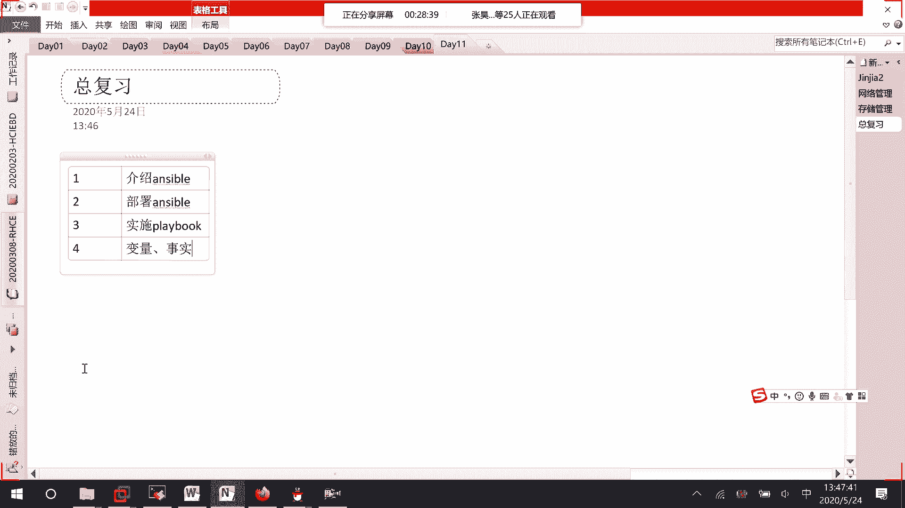

## 课程内容概览 📋

以下是本课程涵盖的主要章节内容：

1.  **Ansible简介**：介绍Ansible的基本概念和工作原理。
2.  **Ansible部署**：讲解如何部署Ansible并控制受管节点（主机）。
3.  **模块基础**：学习Ansible模块的基本用法，为编写Playbook打下基础。
4.  **变量使用**：学习如何使用自定义变量和系统事实（Facts）。
5.  **任务控制**：掌握循环、条件判断和错误处理等任务控制方法。
6.  **文件与目录管理**：学习使用`file`、`copy`等模块管理文件和目录。
7.  **主机管理**：学习使用通配符和模式管理主机清单。
8.  **角色管理**：学习Ansible Roles的创建和使用。
9.  **故障处理**：学习如何排查和解决Ansible执行过程中的常见错误。

---

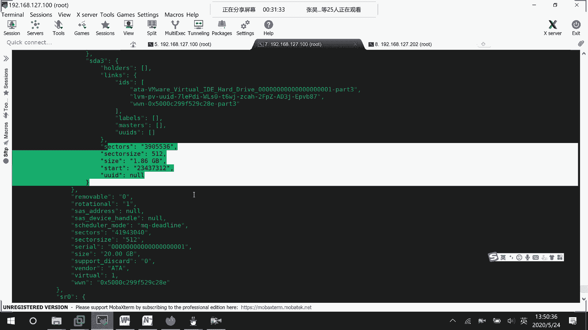

## 核心概念详解 🔍

上一节我们介绍了课程的整体框架，本节中我们来详细看看其中的核心概念。

### 1. 系统事实（Facts）

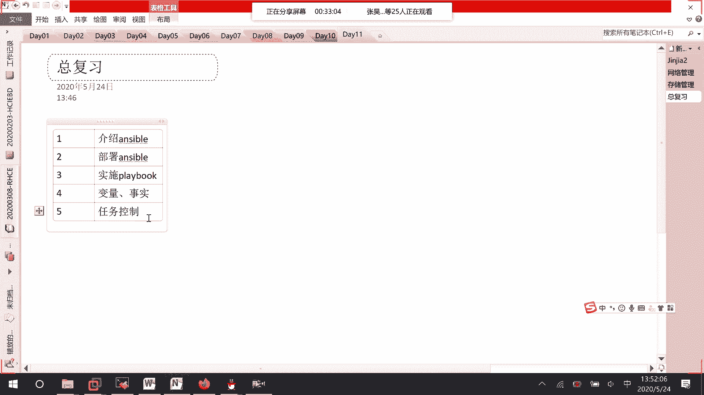

系统事实是Ansible从受管主机自动收集的系统信息，可以作为变量在Playbook中使用。例如，要查看所有事实，可以使用以下命令：

```bash
ansible -m setup all
```

该命令会返回一个包含大量信息的JSON结构，例如磁盘信息：

```json
"ansible_devices": {
    "sda": {
        "size": "20 GB"
    }
}
```

在Playbook中，你可以通过变量名（如 `{{ ansible_devices.sda.size }}`）来引用这些事实，用于条件判断或动态配置。

### 2. 错误处理：Block, Rescue, Always

在编写复杂任务时，错误处理至关重要。除了简单的`ignore_errors`，Ansible提供了更结构化的方式。

以下是错误处理的三种方式：

*   **Block**：定义一个任务子块。
*   **Rescue**：当`block`中的任务执行失败时，会执行`rescue`块中的任务。
*   **Always**：无论`block`执行成功还是失败，`always`块中的任务都会执行。

下面是一个示例Playbook，展示了如何使用这些结构：

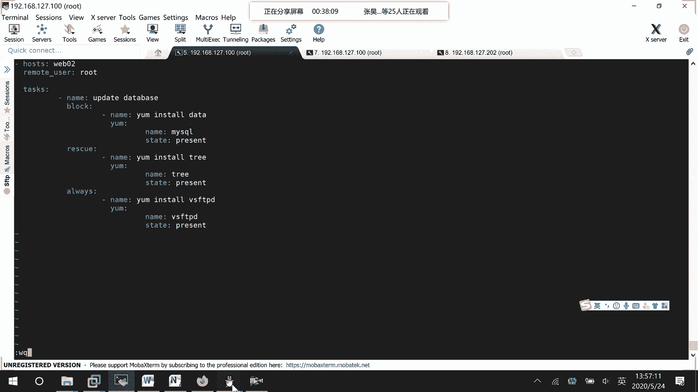

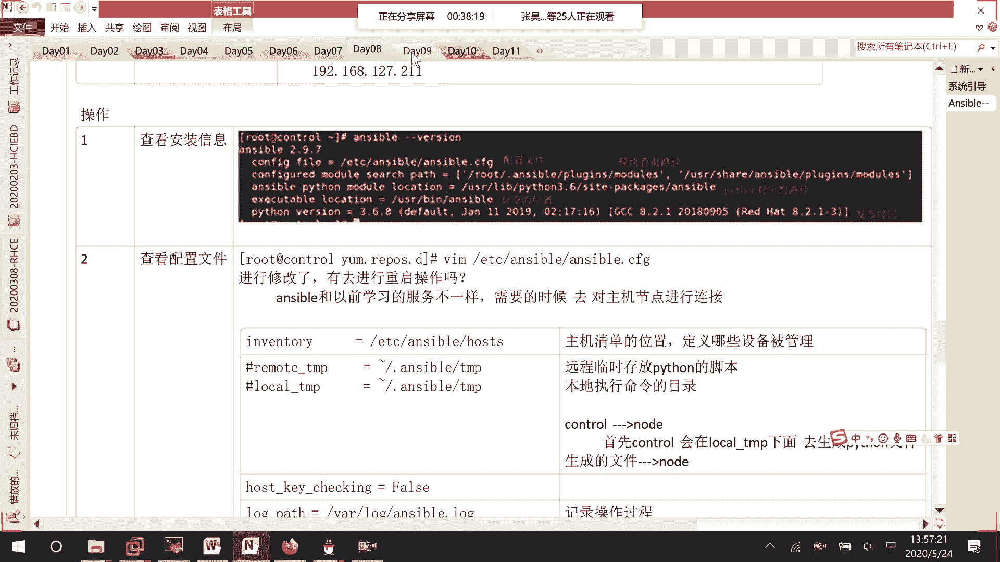

```yaml
- name: 处理可能失败的任务
  hosts: all
  tasks:
    - block:
        - name: 安装MySQL数据库
          yum:
            name: mysql
            state: present
      rescue:
        - name: 修复YUM源后重试
          yum:
            name: tree
            state: present
        # 此处可添加修复YUM源的命令，然后重新执行block
      always:
        - name: 总是安装vsftpd
          yum:
            name: vsftpd
            state: present
```

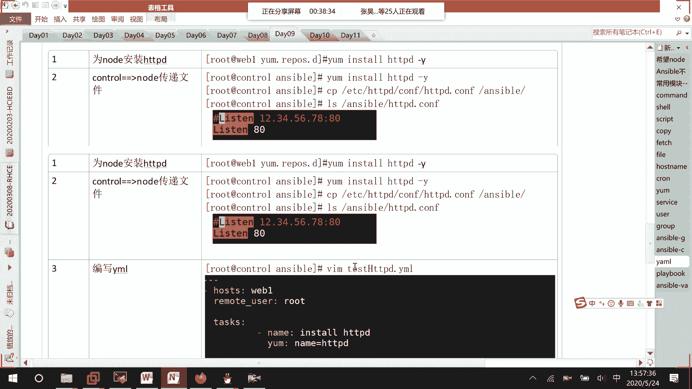

### 3. 语法检查与故障排查

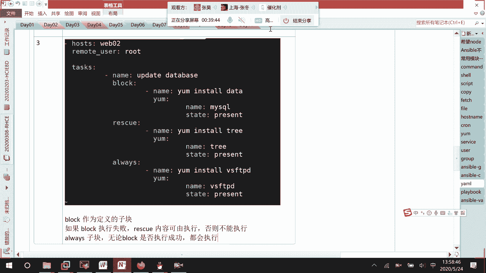

在运行Playbook之前，进行语法检查是一个好习惯。可以使用`--syntax-check`参数：

```bash
ansible-playbook --syntax-check your_playbook.yml
```

如果语法正确，命令会显示Playbook名称；如果存在错误，则会明确指出错误所在的行和列，方便快速定位问题。

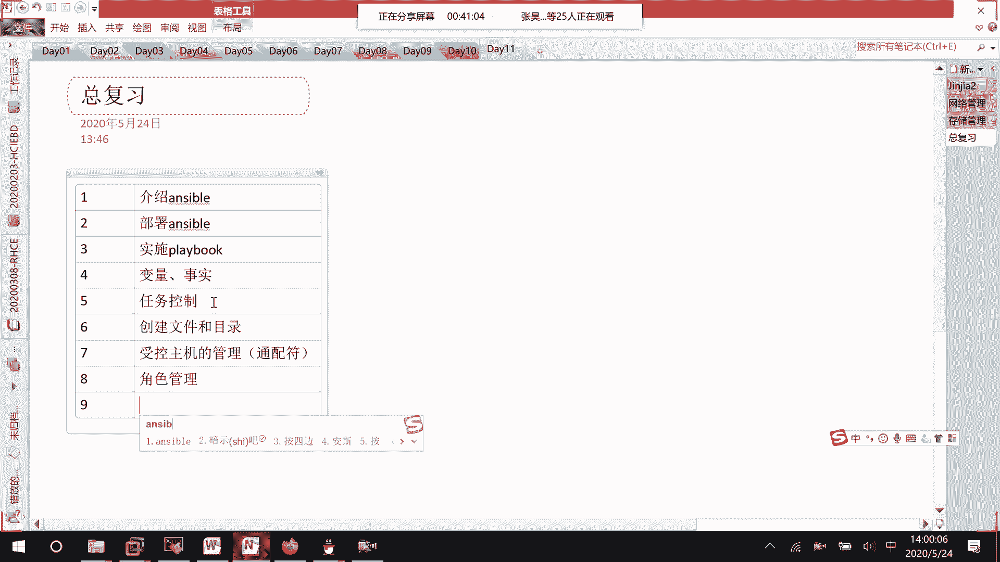

---

## 模块文档与学习资源 📚

Ansible拥有丰富的模块库。要了解某个模块的具体用法和参数，最好的方法是查阅官方文档。

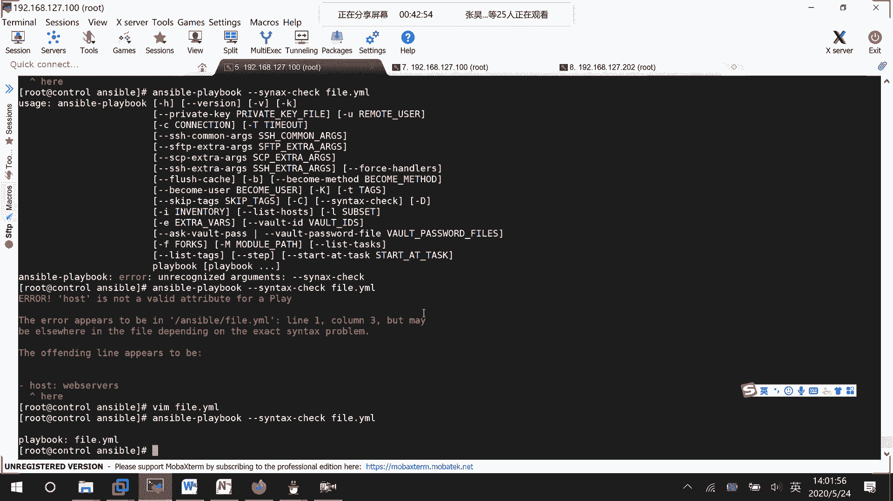

例如，要查找`yum`模块的文档，可以在官方模块索引中搜索。文档中会详细说明：
*   模块功能
*   所有可用参数
*   使用示例（如安装最新包、移除包、测试仓库等）

养成查阅官方文档的习惯，是掌握Ansible的关键。

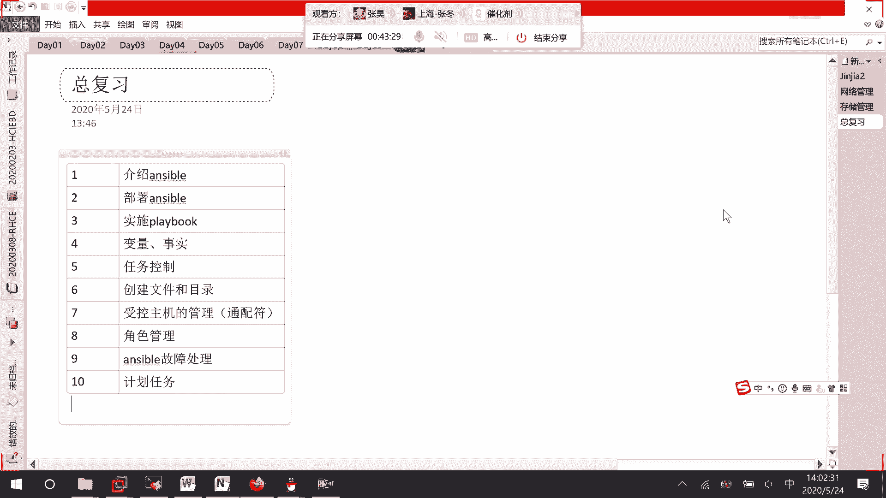

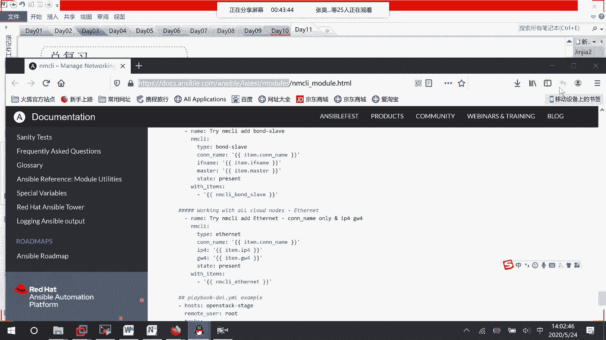

---

## 课程总结 ✨

本节课中我们一起学习了Ansible课程的总体脉络和核心知识点。我们回顾了从Ansible基础、模块使用、变量与事实、到任务控制、角色管理和故障排查的完整学习路径。重点掌握了：
1.  如何利用**系统事实**获取主机信息。
2.  如何使用 **`block`、`rescue`、`always`** 进行结构化错误处理。
3.  如何利用 **`--syntax-check`** 进行Playbook语法检查。
4.  养成查阅**官方模块文档**的习惯以深入学习。

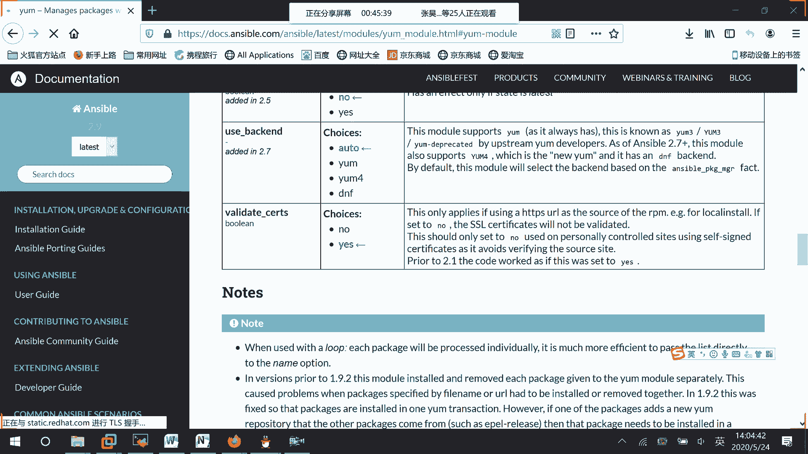

通过本课程的学习，你将能够编写基本的Playbook，使用常见模块，管理变量，并运用角色来组织代码，从而具备使用Ansible进行自动化配置管理的基础能力。