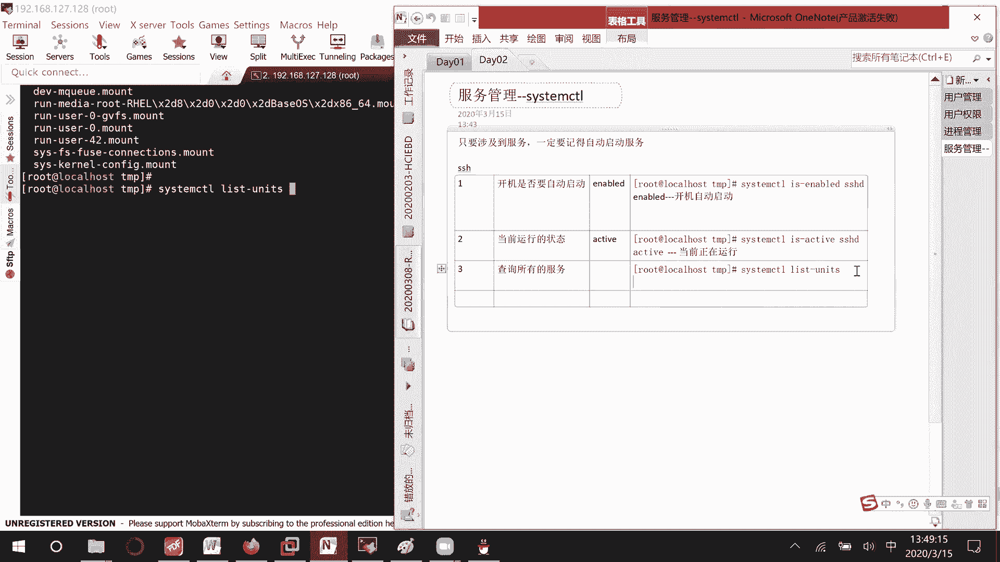

# 01 RHCE8.0视频教程【45课时】 - P5：20200315-RHCE-02 - 六竹书生6682 - BV1m84y1f7ss

嗯上午的话呢我们就说讲完了，那个系统进程怎么去查看的一个问题，然后下午这边的话呢我们开始来讲一下，像这个如果说系统比较忙的时候，我怎么样去保证一些哦重点的进程，比如说我觉得比较重要的进程。

让他的话呢能去进行一个优先的执行呢，在这里的话呢我们来看一下，这里就是说对系统有个优先级，它的话呢资源不够的时候去进行一个使用，优先级的话呢，它分成了两个部分，第一个部分优先系数，这个的话呢。

优先系数需要你去改内核的一个东西，你们的话呢基本上可能都是rh ca，在CA当中的话呢，有有一门课就是说嗯系统调优嘛，他会讲到这个东西，然后接下去的话呢，另一个部分组成就是一个nice值。

nice值是我们用命令去进行修改的，这个是内核修改，然后这个的话呢是在我们C当中会去学习，去进行一个修改的，他这个优先级的范围是多少呢，是-20~19，因为这个系统优先级咱们都不能改，就忽略它了。

主要就是说来对比最后一部分，nice这个部分-20到正19，他这个的话呢数值越大越不优先，也就是说这边的话呢-20最优，正19最不油，也就是说最差嘛越小越优先，这也要知道。

然后这边的话呢我们就比如说在呃图形化界面。

这里先给你们来看一下，稍等哈。

然后的话呢我把那个界面，那个界面好像被我关了哈。

稍等一下哦。

我好像没有打，好像有打开，但是不见了，然后你看这里，就比如说你你去选中某一个进程嘛，你看后面这个就是说优先级右击，这里的话呢劝句他的话呢有高非常高，低非常低，但这个的话呢是他自己去根据等级去设置的。

没有说具体数值，这边你可以自己去上三高高高，从八开始的话呢，是不是就非常高了呀，所以这里的话呢我们可以看看一下，它这里分成了几个等级，非常高的一个等级，然后呢高的一个等级，然后呢正常的一个水平。

然后呢低的一个水平，接下去非常低的一个水平，非常高的话呢是我们的-20，你看稍等这边-20，然后到八，等一下，八可能如果说我是七的话呢，他就是一个高了嘛，这就说是我们的-20~-8。

然后这里的话呢高就是七到我们那个挤压，七到我们的三嘛，然后呢正常的话呢就是二应该到正二吧，正二，然后呢第一的话呢就是我们的3~7，非常低的话呢，应该是8~19，应该是这样子。

诶他这里好像到五就已经是低了，然后呢5A5到19的话呢是一个叫做非常低，这个D的范围的话呢，六也是低，那这里我写错了，这应该是3~6是D的，然后呢6~19是非常低的，还有这样子的一个范围。

所以的话呢修改就在这边修改。

那如果说我的电脑它没有一个图形化界面，我用命令的话呢，怎么样去修改呢，首先这里啊，第一个我们先，因为他这个只有在资源抢抢占的时候的话呢，才会去就说优先级才会生效嘛，资源不够用的时候。

那我们现在呢第一个操作启动两个进程，对资源占用非常高的，他这边的话呢，我们可以怎么样去进行一个启用呢，比如说我这里打开三个界面哦，打开两个界面就够了，首先我们知道cat是不是读DV。

是设备这个zero的话呢，它它就是一个模拟测试，它其实是一个空的东西，我如果说不断的从dev zero当中取东西，不断的重定向到这个NO，NO就相当于一个垃圾桶里面吗，我这样子不断的去读写读写。

对我资源消耗是不是很多，回车7517哈，我这边的话呢打开一个叫做top，去看一下资源使用情况，你看7517，他是不是资源占用的话呢，91%好，我先把命令给你们复制下来哈，我电脑等一下可能会很卡。

然后第二步的话呢，就是说top去查看进程，这里我再来启动一下，刚才启动的时候呢，它是7517，再启动一下，是一个7573，你看启动两个之后，他们是不是因为大家优先级的话呢都是一样的。

所以因为优先级默认这里就是说全都是20嘛，20怎么回事哦，在这儿大家全都是零，我看错了，大家全都是零，所以的话呢我们内存的一些使用啊，CPU的使用啊，差不多是一个五五开的一个情况对吧。

现在我的话呢去把这个7517的优先级，调得非常高，调到比如说调到20，第三步调整，此时我先记录一下，叫做7517和7573的呃，资源使用率，五五开，那好现在的话呢我去调整。

把它7517的优先级呢调的非常高，那这里改的话呢就是RENICE减N，后面跟上你的优先级-20不是很高啊，7517对，7517回车，你看他的话呢老的是叫做零，因为默认大家启动全都是零。

现在的话呢是不是就切换到20这里来了，然后接下来哈我们来看一下这边7517，它的使用情况是不是达到了90%多，80多，但是另一个的话呢，是不是只占用了1%左右啊。

如果说你没有资源抢占资源本身很空闲的话呢，他们两个肯定就是说每个人都会使用到极限的，一个程度，知道吧，那这样子的话呢就是让我们去调整，刚才的话呢是使用命令的方式去调整，如果说在top界面上。

我我可不可以去调整呢，就是说在这个界面，因为我看到了一个比如说进程，我就想直接去调整吗，比如说这个7517，它的优先级是-20，我觉得太高了，把它改改的小一点，改到正18，首先这里呢我们点击一下啊。

你看这个符号的话呢，就去控制了，默认让我们去调整，这个7517的一个优先级嘛，比如说改成，如果说你要你想要去改其他的一个其他的进程，那你后面就输入其他进程的编号，我比如说就是改7517。

你不输也可以输一下，也可以再问你优先级改成是多少，比如说改成18，你看7517，它等一下的话呢就会降下来了对吧，这个7573是不是就算上去了，所以这里啊首先输入一个R表示的话呢，我要去调整优先级。

后面的话呢PID是多少，后面的话呢nice值是多少，就这样子就可以了，去进行一个调整，那好然后现在的话呢比如说我们要关闭进程，按照这里的话呢是不是要去关闭cat进程，哦不对。

关闭这个叫做7517和7573的一个进程，那我们这两个如果说想要一次性统一的，把所有的给关掉呢，这里tor你们应该有看到，关闭掉所有和什么命令相关的东西吗，杠九和cat相关的，你看这里再来看的时候。

和cat命令相关的，是不是就没有像刚才的话呢讲那个care的时候，我们就是一个一个的进行关闭，然后这里的话呢care all的话呢，就是一组和什么相关的信息的话呢，我统一去进行一个关闭，知道吧。

那好这也没问题，然后这个的话呢是我们可能程序在运行的时候，资源发生抢占的时候呢，去调整程序，启动运行的时候才去调整，这里比如说我系统本身就已经很卡了，但是现在这个县城这个进程的话呢非常重要。

我希望启动进程的时候又设置优先级，这该怎么办，这里的话呢，我们启动的命令是不是这个cat什么dev zero，这个后台启动吗，你在前面这里去设置nice减N，比如说搞成一个五好不好。

因为就是说运行起来了之后再改，就RENICE重写我的优先级嘛，但是在启动的时候呢，直接就是nice nice值就可以了，你看这边我们再来看一下叫做有个cat，它的优先级是不是直接就是5万。

像这条命令的话呢，比较适合什么时候呢，你的系统本身很卡，但是现在有一个进程又非常的重要，希望他能优先的获取到资源，你的话呢就以这种方式去启动，你的一个进程就可以了，诶等一下标错颜色。

以这种方式的话呢去启动进程，它的话呢，一开始就会给你设置一个比较好的优先级，好吧好。

到这里过的话呢，我们就说进程的查看啊，进程的关闭啊，进程的优先级调整啊，就讲到这里过了，然后接下去的话呢我们要开始一个新的章节。

就是我们服务的一个管理，服务管理，像之前就是说七版本之前的话呢，它的第二门考试主要就是说考一些服务，要记得去把它给启动，如果不启动的话呢，下一次开机可能就是说这个服务没有工作。

我就会认为你们这题没有做嘛，所以在七版本当中非常的重要，在我们现在这个版本的话呢，呃也会去考到，会考什么呢，因为在HCSA当中我们会去学习一些时间服务，网络服务啊，还有的话呢像一些叫做呃。

还有就是像NFS啊，还有一个叫做三把这些东西，像这个叫做NFS，还有三把的话呢，在我们这个阶段也会去学，但这些的话呢就相当于我们QQ这些功能一样的，如果说你开机没有自动启动，它就不能提供服务，对不对。

所以呢服务管理这一块非常的重要，只要涉及到服务，你们一定要记得启动服务，就是说自动启动服务，不然的话呢，因为我们在考试的时候，他会怎么样呢，等你所有的都做完了，会把你的设备给关机。

然后再开机去检查你所有的配置，如果说你没有把服务设置成自动启动，那下关机再开机之后，是不是所有的服务都没了，如果没了的话，那就相当于你没做吗，知道吧，那好这里的话呢，首先我们来看一下服务管理的话呢。

我们要管你什么东西，服务管理主要分成两个方面的一个管理，第一个方面开机是否要自动启动，第二个方面呢，也就是说比如说开机我自动启动了。

对不对，那我当前的一个运行是在运行呢，还是一个停止的状态。

如果说开机没有自动启动了，那我能不能手工把它给启动吗，所以第二个状态就是说当前运行的状态，当前它的一个运行状态是怎么样的，就比如说我现在的话呢，这个终端他是不是通过SSH，连接到我们的虚拟机里面去啊。

所以这里的话呢就有一个服务叫做SSH服务，那这里的话呢，比如说我们想要去看开机有没有自动启动服务，管理的话呢，它主要使用的一条命令是这个system control，有没有自动启动的话呢。

有个关键字叫做in apple，然后的话呢当前的工作状态有个关键字叫做active，我们先来看一下，我们想要去看SSH是不是开机自动启动，怎么办，System control is active。

Event is enable，后面这里的话呢你去诶，等一下后面这里的话呢，你去跟上你服务的名字就可以了，然后你看这里这边如果是enable的，就表示开机之后自动是启动的，到时候的话怎么啦。

嗯有什么问题吗，怎么啦，这个叫做magic，这是谁，啊有什么问题吗，哦哦哦好，然后这里的话就是说，如果你看到是一个叫做enable的状态，这个的话呢就表示开机自动启动的，就像我们的QQ。

你如果设置开机自动启动，等你设备开好了之后，在你的窗口这里就显示出来一个QQ的登录界面，对吧，然后这边的话呢我们先去查看，我等一下再跟你们说怎么样去呃，设置它开机自动启动和不设置开机自动启动。

那好当前的运行状态呢，System control is active s h，这个的话呢active表示现在的话呢是正在运行着的，好吧，然后这里的话呢，它我们一开始在学习的时候也不是很熟悉。

那么它里面总共有多少服务呢，这边查询所有的服务，可以先去查询出来，然后我们再用grab的话呢，是不是进行一个匹配，System control list，这里有一个叫做unit unit。

你看他这个信息的话呢，就显示出来非常非常的多了，因为loading就是说现在是active running的，然后这个服务有什么样的一个作用，在这里全都有，说好吧，然后还有一种的话呢。

因为在这里其实你可以去查查，比如说SSH，哦叫做这里不能去查找他，这也没得查找，这边的话呢刚才的一个命令叫做system unit fire，它可以列出所有的详细信息。

如果说你只想去看一些简单的信息呢。

unit fires它也可以列出所有的服务，只是说我呢不会去写那么详细的一个描述。

知道吧，那好然后接下去的话呢就讲到一个匹配。

就比如说我为什么就知道哦，SSH服务，它的名字是SSHD呢，就这条命令你后面可以grape一下吗，SSHD稍等哈，你看这是不是就查询出来了，他这个服务类型有很多，我们在C阶段的话呢。

管理的默认就是这个service这个服务，其他的一些服务的话呢，我们不管理像socket party，我们这个阶段是不管理的，我们管理的就是这个service的一个服务。

然后的话呢我们比如说像看这个解详细的信息，Graph s h d，你看这个s h d service，他呢现在是活跃的一个状态，正在运行它干嘛，open SSH server它的一个嗯运行案例吗。

给我们这个用的，然后就好像说那我们比较关心的一个网络network，你看这里的话呢，它有一个network online，network prayer network target嘛。

在我们的红帽期当中，有一个叫做network service，在我们的红帽八单中，他就没有network service了，就是说我这个呢就不能设置为，那个叫做开机自动启动。

就是说在配置里面去做就可以了，他这个是比较特殊的一个东西哈。

所以这里你们来看一下，比如说你想要去查找的话呢，就是所以这grape命令的话呢非常有用，就是说结合到结合这个管道符后面的话呢，跟上服务名字的关键字，好吧，他这个非常有用。

那这边的话呢我去找一个比较好控制的服务，看它有没有配置起来哈，没有嗯，我这边的话，因为我如果把这个S嗯，是你们拿了我的控制笔吗，稍等一下，我应该是权限没有设置掉，那没啥。

然后这里的话呢就是我现在先去安装一个服务，能让我们到时候，比如说去进行一些简单的管理好吧。

不然的话呢这这个实验就效果不太好，所以这里加一步安装软件，安装软件我们后面马上要说了。

欠先讲讲一个简单的，我们上一次课学了一个命令，是不是叫做DF减H啊，这个的话呢这边是不是有个光盘在这里，如果说你们有些没有光盘的话呢。

可以怎么样呢，右击设置，等一下哈，我这电脑这个步骤都会比较慢，弹出新界面的时候。

但这也太慢了吧，你看然后这里CDDVD把我给你们的光盘放在这，把这两个勾勾起来，确定一下，这两个勾一定要记得勾起来。

因为你这这个的话呢，其实主要是这个叫做已连接，如果不勾的话呢。

在那边看不到，我建议你们把这两个勾都勾起来，后面呢经常会用到。

好吧，然后如果你勾起来了之后呢，在这边DF干H，你就可以看到这个软件包的一个名字了，这个光盘里面的话呢，它有很多很多的东西，Cd run media root h e l，你按tab键就行了。

其中里面有个目录的话呢叫做，base诶，等一下base os package，你进来，我们的话呢去找一个vs FTP吧，看有没有哈，Cannot access vs，不是有很多东西吗。

LS信号FTP名字，男的哦，诶他这个FTP找不到，我能去找一下，是我找错了对吧，LSCD点点应该就是这个木马诶，为什么我刚才CD image，CD就应该就是在那个目录下，他其他的没有目录啦。

Cd a p p，诶等一下我点多了哦，在这里了对吧，所以的话呢这边就是说先CD到这个目录下面来，然后的话呢LSFTT，这里的话呢它有很多个啊，比如说我们安装这个软件，就是说找到了这个软件之后呢。

我们来装一下，这里你们先记住这个命令，rpm减IVH，反正I的话呢就是安装V的话显示过程好吧，去安装一下，稍等rpm减IVHVSFTP，稍等一下，拿好，这边把软件安装完了之后呢。

像我再去使用刚才的那个服务的一个查找，system这个叫做，因为我安装的软件名字，是包含了一个叫做FTP的嘛，稍等啊，System control list unit，Frap f t t。

好刚才的话呢他一直没有找到，但是现在的话好像找到了，线的话你找到了，估计刚才应该是还没有识别到吧，我感觉命令的话呢，Unit，诶这个里面就没有，这里面就没有，这里面估计没有识别到unit。

那你们后续的话呢要查看一些服务，如果全一点的话，就到这个叫做unit fire里面去查找，好我前面加了一个新号，好这边的话呢你们先去安装一个软件，安装完了之后的话呢，是不是就可以看到这个东西了。

看到这个服务，我们现在的话呢，就是说对vs这个叫做服务的话呢，去管理它的一个开机自启动，当前的一个运行状态，好，System control is active vs f t p d。

它默认管理的是这个service inactive，就表示当前没有在运行，然后呢is enable表示什么意思啊，Disable，它的话呢开机不会自动启动，这里当前没有运行，然后还有一个的话呢。

就是说呃开机没有自动启动，然后有些人的话呢想要去看更详细的，这个服务的一个信息嘛，system control嗯，stages后面的话呢去跟上这个服务的名字，Vs f t p service。

然后这里的话呢就说他的一个名字是怎么样的，他的话呢加载状态就是说是一个disabled的，然后当前的一个活动状态呢，inactive就是说没有运行这条命令的话呢，可以把两个状态全部给看到。

这个的话呢就看你们好吧，那好现在的话我希望设置开机自动启动服务，稍等一下诶，这里就是说开机的一些设置，System control，它是没有自动启动吗。

那就enable vs FTP d service，这个时候的话呢，你再来查看一下，它是不是就变成enable的一个状态了，这个开机自动启动，然后的话呢现在如果说你又想要开机，不要自动启动呢。

那也就是说是一个DF嘛，disable回车，这个时候你再看一下他的状态的话，就是一个disabled的一个状态，然后呢，接下来还有一个状态是什么呢，叫做禁用状态，稍等啊。

你看他这里的话呢就是一个mask，这边就是说嗯启动状态我们是好理解的，开机就自动启动嘛，那这样子的话呢像我们等一下active的话呢，看到的就是active的一个状态对吧。

就是说is active去看的话，然后如果说你设置的是一个叫做disable状态，开机不自动启动，像这个不自不自动启动，像这个is active的话呢，你到时候开机了之后。

看到的就是一个inactive的一个状态，但是如果说你需要服务去工作，可以手工的去使用active去启动服务，如果说你是一个叫做mask一个状态，他到时候启动的话呢，可能是inactive。

或者可能是一个叫做unknown的一个状态，你的话呢不能，让服务去active，也就是说不能让服务不能去启动服务，也就是说你没有命令，没有方法的话呢，去把我服务启动起来。

除非你去把禁用状态呢改成一个叫做enable，或者disable，如果希望服务能够启动，那么需要将mask状态改为你的一个叫做active，哦不对，改为你的一个叫做enable。

或者的话呢disable都是可以的，你的话呢就是停留在禁用状态的话呢，你是不能去active服务的，我们来试一下哈，这个就是呃定型状态，这里system control is active。

这里是不是INACCURA，然后刚才是一个叫做mask吗，我现在的话呢比如说想要去启动我们的服务，你看这个的话，System control，稍等啊，我想一下哦，start我写错了。

vs FTP这边的话，你看他这里就报错了，vs FTP的话，他当前是一个禁用的一个状态，所以你不能去进行一个启动，这条命令是一个叫做启动服务啊，像现在的话呢，比如说我把他的一个金融状态去改掉。

system control去给他enable一下，啊稍等，in apple不行，unmask先unmask一下，然后的话呢，我们再来看一下它目前的一个启动状态，Is enable，他的话呢就变到了。

就是说因为我们本来是从disable，到了一个叫做mask嘛，所以他的话呢就回到了一个叫做mask状态，这里的话呢，嗯这里就不是把它改成一个叫做enable，或者这个叫做disable了，它是怎么样呢。

就是说需要将mask的状态进行解禁，解禁用，好吧，需要进行解禁用，就是说你直接去切换的话，那是不可以的，需要去进行一个解禁用之后，你才可以，那下面这个的话呢就是解禁用的一个命令，你一定要解禁用了之后。

我的话呢才可以对你进行一个启动，你看现在的话呢，比如说is active，它是不是就是一个active的一个状态，然后的话呢，像我们对于这个服务运行的一个设置的话呢，它有哪些控制命令呢。

首先第一个这个就是说启动服务，如果说我想要去停止服务呢，System control stop，然后你再来看一下这个服务的状态，就是一个inactive的一个状态吗，稍等一下，这里停止服务啊。

还有呢因为就是说像我们LINUX当中，它的所有服务的配置，是不是都通过配置文件去设置的，像这里啊，比如说现在的文件fire的话呢，它是一个A的状态，我去启动了我的FTP服务，FTP服务的话呢一直在运行。

可能到了这个时间点，我去把这个fire的话呢改成一个叫做B的状态，那我问你FTP的话呢，现在是以A文件的配置为准，还是B文件的配置为准呢，它是以A的为准，因为我在启动的时候。

读取到了所有它的一个配置信息，但是我现在修改了，我怎么样去重新获取这个信息呢，那是不是就是说重新去启动你的一个服务啊，你可以先把服务给stop掉，再把服务的话给start一下吗，这是一种方法。

还有呢就是说重启服务，它有个命令叫做restart i e s t a RT，先把你的服务给停止了，然后的话呢再去进行一个启动，我们来看一下system control restart vs FTP。

对不对，这个的话呢服务的话会有一个中断，然后像有一些配置的话呢，因为我只是修改了配置文件，让他重新读取配置文件，是不是就可以了，我的服务也不用停止，只是说去更新一下，我的一些配置项的一些信息吗。

这里还有一个命令system control reload，然后的话呢，后面去跟上我们服务的一个名字嘛啊，Reload vs f t p，嗯看一下system control reload，这没有问题。

然后像这个的话呢，它这边就说feel的是不是就不能去启动了，因为有些服务的话呢，他用这个reload命令的话，那确实是不可以的，然后这边的话呢我发现他这里多了一个命令。

叫做reload or restart，减二剪RESTART，他这个就成功了，就是说如果你能去reload的话，我就给你去重新加载配置文件，如果你不能reload的话。

我就restart去给你加载配置文件，所以用这条命令的话呢会放心一点，因为如果说你reload不成功，你也只能去restart，对不对，但是如果你单独执行这条命令的话呢，可能失败了。

你再去restart会稍微麻烦一点，这诶好，然后这边的话呢，就是我们一些服务运行的一些设置，服务运行的一些设置，然后现在的话呢我们再来看一下system control。

Studies vs ftp d，可以发现运行了之后的话呢，它会有一些更详细的信息，啥时候运行的进程编号是多少，主进程编号，它下面的一些线程是怎么样子的，然后这边呢什么时候启动啊，什么时候结束。

你们的话呢有时候服务不是启动失败了嘛，对不对，你们要来看一下他的这个叫做状态信息，这边的话呢有时候会给你们一些提示的，比如说可能是哪个文件啊，哪个文件里面的哪行啊，出现问题。

因为你你如果说叫做这个放的很近来，它可能显示的信息就比较少，如果说你拉长一点，他可能就是说会显示出更多的信息吗，因为有时候就是说有些终端的话呢，它后面的信息啊，你这个界面放的很小，就会看不到掉。

你的话呢把它拉长出来的话呢，它可能才能显示出来嘛，你们就说要注意使用这个studies的一个命令，去查看详细信息，里面的话呢，如果服务启动错误了，在这里都会有，好吧，不，你们像这些服务的一些错误信息。

自己要学会去看，到时候在考试的时候呢，如果真的遇到了，自己还能去解决一下吗，好吧，这里的话呢没有什么样的一个问题啊，开机设置的三种状态，一个就是说是啊enable disable mask。

运行的状态基本上就是stop和一个叫做active，这两个状态，你们的话呢其实可以发现我们在做，比如说啊这里start也好，或者的话呢stop也好，他有没有事就说有没有start成功。

或者有没有stop成功，有没有给你显示出来，没有给你显示出来，所以就是说为了保险起见的话，我们设置完这个叫做这个叫做运行状态之后呢，去查询一下状态设置，你的话呢一定要记得去查询状态。

因为像我们这开机自启动也好，开机不自动启动也好，他这里的话呢是不是也是没有提示啊，只有第一次的时候。

因为你看啊，我这边在按的是呃，好像已经过了哈，稍等一下，应该是在下面这里哪里，你看第一次如果在设置的时候呢，他会去创建一些呃，呃在在这他会去创建一些连接的一个信息的，所以的话呢在这里第一次你能看到。

但是在后面你再去重新设置，比如说开机自启动，开机不自动启动，你是看不到的，你们一定也要记得去查询一下状态，这样就是说保险一点嘛，免得没有设置成功能，明白吧，那好这里的话呢就没有什么样的一个问题啊。

啊服务怎么样去查找的话呢，也跟你们去说过了对吧，这个服务管理这里有没有什么问题，没有什么问题的话呢，我们休息一下哈，休息个9分钟的时间，我等一下的话呢要去讲open SSH了，这里一点内容的话呢。

先让大家去看一下this，这里的话呢，我们这边不去学习这个target的一个管理，它的话呢也是服务的一种类型，我们这边不去学习这种这种服务的一个管理啊。

我们这里的话呢就学习一个叫做service的一个管理，好吧哦，这个正常的一个服务管理，下面这里的话呢我们就来讲一个叫做open SSH，就是远程控制，就是到时候的话呢考试的环境我再来强调一遍。

就是说这个是物理机的话呢，它是一个LINUX操作系统，然后这个是，比如说到时候你考试的第一台虚拟机，第二台虚拟机嘛，考试题目的话呢，在这里会有个网页，那你在想如果说我把这台虚拟机打开了。

就是说双击打开了之后呢，类似出现一个VMVM的一个界面，对吧，我的话呢想要把这外面的东西复制进来，有时候是复制不成功的，那这个就很麻烦，那如果说你想要复制的话呢，有没有什么快点的办法呢。

你在这台物理机上去打开一个终端，可不可以啊，然后远程登录到这台系统当中去，那我在这里做的所有操作，是不是就相当于在这里做的对吧，所以就是说像这个远程的概念，你们一定要有考试环境是怎么样的。

你们一定要非常的清晰，不要说我只会去敲命令，我在哪里去敲，一不一样呢，你也不知道，就说首先要有一个比较清晰的一个思路哈，那行这里就是说open SSH很简单，我们要学的是一个SSH。

像这边的话呢呃我们去进行，你们基本上在这里的应该都是工作了的，很多人的话呢哦没有没有，就是说很多人的话呢应该是有接触过服务器，或者看过服务器，他的话呢服务器基本上是没有想显示器的。

就相当于是一个电脑主机机箱一样的嘛，如果说你要去控制，要么就是说每一台服务器配个电脑，配个显示器，或者把显示器放在推车上面，哪里需要的话推哪里去嘛，那这稍微麻烦一点，有没有什么样一个快点的方式。

就是我们这里要说的远程管理，我怎么样远程的去控制其他的电脑，他这个的话协议有很多，像这里有一个叫做TNT，你们应该是了解过的，TNT的话呢，是不是就是一个明文的远程控制啊。

然后呢are log这个也是一个远程控制，像SSH它也是一个远程控制嘛，就各种方式都可以对我们进行远程控制，在这里的话呢我们学习SSH，因为前面这两个的话呢，它在传输过程当中全都是明文传输的。

然后像我们这个SSH的话，它是一个叫做密文传输的，它是一个安全的shell吗，也就是说在通信的过程当中，我发送的一些信息都是被加密过的，这样子即使被别人就是说抓包抓到的话呢，它也不能很容易地分析出来。

我里面有什么样的一些东西吗，对不对，那好首先我们来看一下。

因为我们刚才学过了哦，服务控制，那默认情况下我的SH它是开机自动启动的吗，是的，他这边的话呢当前是正在运行吗，它也是的，所以就是说我把里面的这台设备开机了之后，我就可以通过外界直接连接进去嘛，对吧。

是这样子的，然后的话呢如果说我现在这里是一台LINUX系统，我想要去登录到其他设备上去怎么办。

这里第一个第一种场景就是我们那个呃，叫这样子吧，就是LINUX登录到LINUX当中去，好吧，它的登录命令的话呢就是SSH后面的话呢，哪个用户，用户名，然后at那台主机的IP地址。

就比如说我现在呢这里是一台电脑，我想要去登录19216827。128上面，那就SSH，比如说它上面有个red hat吗，其实我现在是模拟自己去登录自己，at192168127。128回车。

这边的话呢它有一个指纹信息，他这个主要就是说对你去进行验证的，问你要不要去进行保存，你要选择yes，如果说你不选择yes的话呢，后面是没有办法去继续进行的，明白吗，这是yes。

然后现在的话呢要让你去输入，在192127。128上面的red hat密码，这里的话呢我要强调一个什么呢，比如说我这里有一个129，我的命，我我有个用户叫做red hat，诶。

我这边的话呢有一台主机是129，我的密码是123456，然后这里的话呢有一台设备是一个叫做128，我的密码是多少呢，234567，那我问你从129上想要去登录128上面的，Red hat。

用户要输入的密码是123456呢，还是234567啊，他要输入这个密码，因为我想要去登录它，所以的话呢我的用户名是不是发到这边来了，密码是不是发到这边来，在128上面的用户名和密码匹配上了。

你这样子才能登录到这里来吗，所以就好像说这个red hat，192168127。18，我们现在要输入的是这个密码，能明白吗，不要去输入本地的密码，是输入你要登录到的那台设备上面的一个密码，知道吧。

我密码的话呢好像是red hat，123，等一下如果没记错的话，那应该是ROT123好吧，你看这个的话呢，是不是就是去进行一个尝试登录，并且一次失败，然后的话呢最终是不是登上来了，登录到了远程的主机嘛。

所以像这种形式的话呢，我们就说携带了我们的一个叫做用户名，和我们的一个密码去进行的一个登录，有时候的话呢，其实我们可以发现有些人在登录的时候，就SH1921681270128，那这个是怎么样的。

你你当前登录的用户是什么，去登录到这台设备上面去，能明白吧，这种SSH这里主机名，然后呢哦不对，直接就主机的IP地址，你当前是什么用户在登录的，那我就以这个用户登录到这台主机上面去好吧。

然后下面的话呢这里还有一个场景啊，就比如说我这里有一台主机是129的，我上面的话呢有一个叫做杭州的用户，在128上面的话呢，没有杭州的用户，如果说我在119上SSH1，杭州艾特192168127。

128，能不能登上去呢，他不能登上去的，因为我把这个杭州的用户发到这边来的时候，他发现诶这个用户不存在吗，所以的话呢就不能登录，不能登录，你看我这边再试一下，SSH杭州艾特，192168127。

128回车，他没有报错，他就让你输密码，但是你要知道你密码的话呢，不管怎么输，你都不能都不会是正确的，为什么呀，它上面根本就没有这个用户，你不管输什么，人家都没有办法去验证吗。

所以呢这里要注意的一个问题是什么呢，该用户，就是说在进行远程登录的时候，用户需要事先在主机上存在，如果说不存在的话呢，它是没有办法去登录的，如果说像你们说的什么啊，服务器认证啊这一块我们不讨论。

我们主要要说的就是说你的一个用户，首先要存在，不存在的话，他不会给你报错，只是说你的密码的话呢，你看这边我刚才密码输错了，是不是permission deline，现在呢这个用户不存在。

我输随便输的密码，他也说是permission den，他的提示的话呢，你看不出来有什么样的一个问题，明白吗，那好这个没有问题啊，这个的话呢就是说怎么样去登录，然后像我们windows的话呢。

想要去登录到我们的LINUX上面去，那这边的话呢嗯之前讲过你的工具会有很多。

就比如说我们的MOBA，还有的话呢SH就是有一个share的一个套件，然后的话呢还有像PUTY，还有的话呢像那个叫做car t都可以去登录，自己去选择，然后呢。

这边你看SSH把该填的东西给填上去就可以了吗，连接上去了之后呢，就到了这么一个界面，好吧那行，然后接下去的话呢我们再来介绍一下，就说像这个远程登录服务，它有什么哪一些特性，我们刚才第一次在登录的时候。

他是不是让我去保存了，一个叫做指纹密钥信息啊，那这个信息的话呢是存储在哪里的呢，比如说我这个root是不是登到其他设备上，是保留在我当前，比如说root想要登录到red hat。

是保存在我root的加目录上，加目录下面有一个文件来存储指纹密钥信息，知道吧，CD先退到家目录LS减A这里文件有很多，我们不管，我们的话呢就管一个文件叫做点SSH，但是我现在找不到啊。

在这点SHCDSSH，你看这个NO host文件的话呢，就是来存储指纹密钥信息的，你看192168127，这台设备指纹密信息是多少呢，前面这里的话呢，是不是有什么三个A这个信息啊，他首先的话呢就是说哦。

我在登录的时候要先进行一个认证的，就如果说因为这边点yes或NO什么意思呢，你信不信任这台设备，如果信任的话，我就把信息给加进来了，那你看后续在登录的时候，为什么就不问了呢。

对方把自己的一些指纹信息发过来的时候，我去对比了一下，诶，发现是对比上了，那我就允许登录吗，如果对比不上呢，我们来试一下VIM，比如说NO host，他这个是基于主机认证的。

我把这个A改成一个B保存退出，然后我再来登录，你看他这边的话呢，是不是又因为就是说不存在呢，不存在嘛，对不对，所以的话呢是不是又让你去重新去保，保存了一遍，它的话呢每一台设备，它的一个指纹密信息的话呢。

对于你来说是一个固定的，如果改了的话，那就不存在，你需要重新去进行一个保存好吧，所以这里呢注意一下指纹信息逝去，主机的认证，我相不相信它，它的文件的话呢在哪里呢，因为现在的话呢。

就是说我哪个用户要对别人登录嘛，我想一下，这里的话怎么说呢，嗯原用户，啊加目录下面点S点SSH，目录下有一个叫做NO snk NO w，然后呢叫做posters的一个文件存在这里，如果说信息没了之后呢。

下一次再登录的时候，他就会去进行一个询问，好吧，那好这里的话呢没有什么样的一个问题啊，下面这里的话呢我们再来看一下嗯，这边的话呢，这边我们来看一下，我想一下我们在进行第一次登录的时候。

它这个windows它也是会保留指纹密码信息的，就好像我们啊登录成功了之后，他之前不是跳出了一个框嘛，那你去进行一个设置，就是说是和否吗，对不对，这里的话因为我已经登录过了，这边我就不再登录了哈。

然后现在我们来看一下，因为现在就比如说有一台A主机，我要对B主机，A主机上的一个叫做ROT，要登录到B主机上面的一个red hat去进行，登录的时候，A的话呢是不是把密码发给了一个B对吧。

这边我们来简单的画一个图哈，稍等一下，就比如说这里的话呢是一个叫做A主机，它比如说是ROT去进行登录的，这登录是谁没什么关系啊，然后这里的话呢就比如说是B主机，上面的话呢。

我想要对它的一个red hat去进行登录吗，他们在登录的时候呢，首先第一步是干嘛，是不是我这个主机A的话呢，主动的去进行一个发起，所以这里第一步主机A将啊red hat和密码。

这个密码的话呢是主机B上的，他的话干嘛发送给我的一个主机A，这里发送给主机哦，发送给主基地，然后呢接下去要做的一个事情，就是说主机B收到这个信息之后呢，和自己的比如说password文件啊。

刷的文件去进行一个核对，对不对，所以这里呢第二步，主GB对收到的用户名和密码进行核对，核对的话呢有两种结果，如果一致允许登录，如果不一致，那就出现我们刚才的一个情况，就是说权限被拒绝吗。

他的话呢就不允许登录，这种的话呢是我们用户名和密码的一个模式，就每次在登录的时候呢，你都要去输入用户名和密码，下面这里的话呢我们要来讲一个叫做其他模式，就是密钥的模式，我给你一把钥匙，你到时候的话呢。

如果你把钥匙发给我，如果说是对的的话，你就不需要再输用户名和密码了，如果不对的话呢，你去输入一下啊，就是说不对的话，那就拒绝你登录嘛，所以下面这里我们来讲一个另一种模式，叫做密钥。

这个的话就不需要密码了，就比如说我们A和B两个人在发信息的时候，他是加密的吗，A比如说是123，他进行一个加一操作，发出去是不是234啊，别人可能去拦截的时候看到的是234。

但是你知道A发过来的东西我都减一嘛，那去解密了之后呢，是不是就是一个叫做123的一个信息，可以看到的信息就是一个对的一个信息吗，这里的话呢我可能给他发送一些，比如说加密的信息去进行一个认证嘛。

首先的话呢，我们来看一下它这个流程是怎么样子的，我们刚才那个叫做指纹信息，是不是基于主机的一个认证认证，某一个主机他我信不信任他嘛，但像这个妙认证的，等一下会去产生文件，我如果去进行登录的时候。

是基于主机上的用户免密登录的，诶，等一下是这个线有点崩溃掉了，他这里他的话呢是基于一个叫做，主机上的用户免密登录的，而不是所有用户，就比如说啊主机地上有100个用户。

我如果说只针对red hat用户进行免密登录的话，那其他用户登录的话呢，你是需要密码的，知道吧，这个是基于主机上的用户，我们等一下去看一下就知道了，他这个流程的话呢稍微有点繁琐。

但是操作起来的话呢非常简单，你们流程的话呢，呃有兴趣的可以听一下，没有兴趣的话呢，自己休息一下，你看首先这里的话呢，就比如说有一台是A主机，A主机上面的话呢是什么用户都可以。

比如说这里有个叫做user1用户吧，然后呢这边有一台叫做B主机，诶等一下，然后B主机上面的话呢，比如说有一个user2用户，我现在希望user1哦，主机A上的user12，后续登录主机B的时候不用密码。

不用密码，那就是说基于密钥嘛，那它的一个操作流程，以及中间的认证原理是什么样子的呢，我这边来跟你们说一下，第一步，首先在主机A上，他的话呢使用我们的user1用户去生成密钥，对就说生成一对密钥。

它这个的话呢我们稍微来讲一下，加密原理的几个东西，你们应该是清楚的，首先第一种就是对称密钥，一生密钥什么意思呢，对这个信息进行加密和解密的是同一把钥匙，就比如说我们开门和关门是同一把钥匙吗。

然后接下去第二个非对称加密，他的话是怎么样呢，加密加解密不是同一把钥匙，比如说我使用A钥匙去锁门了，你只能使用B钥匙来开门，你不能再使用A钥匙来开门了，然后像我们这边的话呢。

它这个使用的就是一个叫做非对称加密，也就是说加密和解密的话呢，它不是同一把钥匙，那这样子他这里就生成了一个叫做密钥对吗，这里的话呢我们刚才说一把钥匙是加密，100钥匙是解密的，这里的话呢有两个名字。

一个叫做A的公钥，这叫A也好，B也好，没有关系啊，K公钥吧，然后呢K4要因为是怎么回事呢，我这个私钥的话呢只能是由我自己拥有的，因为就好像说这这篇文章去对它进行加密了，对不对。

其他人如果说想要去读取到我这个文章的话呢，用他的公钥来进行一个简历嘛，是不是就可以看到了，如果其他人想要给我发信息的话，他用公钥去加密，私钥的话，是不是只有我手上有啊，所以的话只有我能看到这个东西。

其他人不能看到吗，知道吧，这里就是说基本上公钥，基本上的话呢就是说就好像我们一个建行嘛，好吧，比如说银行不要给他打广告哈，这里的话呢银行他的话呢，其他我要发一个信息或者怎么样，是不是用户的话。

他以前手上是不是什么U盾啊，这些东西啊，他可以去进行解密，然后这些用户如果说他想要去发起操作的时候，里面是不会输入敏感的信息，叫做密码，他如果说密码加密了之后，是不是只能我银行这里面能看到。

其他人不能看到，因为他用公钥加密了，只有拥有私钥的人才能去进行解密，是不是只有我银行能去解密，这样子的话呢，相对来说是不是就安全了呀，好这边呢就稍微解释一下加密的这个东西啊，那好这里的话呢生成密钥。

对A的公钥和A的私钥，那你们来想一下，我现在接下来一步的话呢，我要把我的公钥发给对方呢，还是把我的私钥发给对方，肯定是公钥嘛，私钥的话呢我需要本地去保存，不能进行泄露的。

所以现在这里的话呢我们来看一下第二个步骤，第二个步骤，第二个步骤的话呢是怎么样呢，虚拟机哦，主机A他的话呢将，这个叫做K的公钥，发送给主机VAV上的user2用户，这样子去发过去。

然后的话呢因为这个是第一次发送，对不对，第一次发售，那也就是说呃如果说你你这样子文件发过来，别人的话呢，一开始你可能都不知道这台设备的密码是多少，如果你说你发过来，我接收了，或许直接就不需要密码的话呢。

这个是不符合逻辑啊，所以像第一次发送的时候呢，你要输入主机user2在主GB上的正确的密码，这样子后续才可以免密，这样就是说首先确保了，你一开始是知道我这个密码是多少的，你是一个合法登录吗。

所以这里要注意一下，这里的话呢，第一次这个就是说因为我们后续的话，等你这个密钥发过去之后，他就是一个免密登录嘛，所以这里第一次公钥，发送给主机V上的游者二用户的时候，需要输入密码的。

因为如果说你不输入密码的话，我就不知道你是不是真的有权利登录，我输入密码通过了之后，我才知道你是有权利通过啊，就说权利登录我的吗，那其实到这里过呢，我们工作就已经做好了，就是说密码登录的话呢。

其实就是说密码登录的啊，任务的话呢我们做好了，下面这里的话呢，我们要去分析一下，为什么我把公钥传给你了之后，我就可以进行一个免密登录了，下面哈解析为什么或许可以不需要输入密码，我们来看。

首先的话呢第一步，因为是主机A想要去登录主机B，所以这边的话呢，第一步还是我的主机A上的user用户，他的话呢使用什么命，使用一条命令叫做SH，叫做呃user2at这个叫做主机B的IP地址吗。

他在这里进行登录的时候呢，他还会去做什么样的一个动作呢，主机会将，自己之前生成的这个叫做K的公钥，发送给主机B，然后主机B的话呢收到了信息之后会怎么样，第二步，主机B收到信息之后。

他的话呢会去对比收到的K的公钥和，就是说这里新收到的，和原先存储的，K的公钥是否一致，如果说不一致呢，我就直接拒绝登录，结束操作了，这里如果一致呢，我这边直接让他去进行登录，你觉得合理吗。

这边如果直接让你去登录的话，是不合理的，所以的话会进行下一步操作，这边的话呢我来说一下为什么就不合理了哈，你看我这个A的话呢，把这个信息发给，因为他这个是公钥吗，我可以发给B是不是也有可能发给CC亚。

如果现在发起这个操作的是一个叫做C用户，我本身就攻击，那我到时候发送出去的公钥是不是可以是干柴，从这个叫做A这边收到的一个公钥信息，发给B啊对吧，那这样子我这里发出去，K的公钥本身就从A那边过来的。

是不是和这边发送出来的公钥是一致的，那这样子现在是C区登录，根本就不是我是不是我的A登录对吧，所以呢如果是一致的话，直接进直接去进行一个登录，它是不合理的，下面这里的话呢。

我们再来看一下他会去做什么样的一个操作，会做什么样的，就是说进入下一步操作，这边的话呢说一下为什么要进入下一步操作，为什么不能直接进登录，我们来看这里的话呢，是因为，公钥就是说它本身就不安全了。

很多用户可以获取到，如果说直接进行登录的话，那是不是就不可不可信啊，然后下面的话呢他如果说，如果一致的话呢，下面要进行的一个操作是什么样的一个操作呢，首先这里我们来看一下，要进行的操作。

他首先第一步主机B它的话呢随机，生成字符串，然后的话呢使用保存的公钥对字符串进行加密，然后接下去的话呢第二个步骤，如就说他这里就是说进加密，接下去啊，稍等一下，然后将一些加密的信息的话发送给主机A。

那好这里的话呢是不是主机就收到信息了，第二步，主机A使用自己的私钥对字符串进行解密，这里的话呢他如果说是解密成功了，就是说解密到的信息了之后的话呢，他是不是可以去发送给这个叫做主机B，那主GB的话呢。

如果发现这个字符和我原始的发送出去的，是一致的，那就说明这台的话呢，是我原来是原来给我发送公钥的设备，如果不一致呢，那是不是就说不是原来给我发送这个公钥的，一个设备就拒绝登录吗。

使用自己的一个私钥对字符串进行解密，然后呢将解密的信息进行返回，那好返回回来了之后的话呢，人家这边去进行一个判断吗，第三步，第三步什么呢，哦将收到的解密字符串，原先的进行对比，如果不一致，结束操作。

如果一致，他的话就没有下面的一个步骤了，就说允许登录就好了，知道吧，他这边的话呢就是说为什么它是可它可以，就是说解密成功了之后就能登录呢，如果因为这个私钥的话呢，是我们个人要去保护好的嘛。

如果没有拥有该私药，是无法进行解密的，V的话呢如果说你能解出来的话，就说明你拥有这个四要吗，能明白吧，这个的话呢就是我们SSH，它加密当中的一些原理性的东西，那现在的话呢就比如说我们来进行一下操作。

这边的话呢，就是说怎么样去生成我们的一个密钥嘛，我的话呢为了和这张图一样。

我在设备上创建两个两个用户，叫做user ADD user1，等一下a user2哦，早上好像创建过user1了，然后接下去的话呢我去设置一下密码，一扣取ROT123，给这个user1去设置一个哦。

少了一个减号，user1去设置一个，然后呢user2去设置一个好吧，然后我现在是想要user1免密登录到user2嘛，所以这里切换到先切换到user1，我的话呢，用户从A的私钥和公钥都替。

有没有可能从用户把A的私钥等一下，就算是中间人攻击的那种了，也就是说用户A再给你发信息的时候呢，C去把这个信息监听到了，发现是私钥的时候，把自己的私钥传给B对不对，你这算是中间人攻击他。

因为就是说这个设计出来的话，他肯定不会绝对没有漏洞的，肯定是有可能的，因为你这个算是攻击的一种中间人攻击吗，就这里A和B在通信的时候，我的话呢可能A解析B的IP地址，就是它的Mac地址的时候呢。

可能是到了C这边，对不对，那这样子的话呢，哦到时候C收到发现是一个叫做私钥，那我就把我的信息告诉了一个BB的话呢，那到时候他比如说想要登陆B的时候，是不是会经过这里，然后再下来，那这样子信息的话呢。

在中间这一区进行一个转换是有可能的，你这个我们下周一的话有一个安全的公开课，你可以去看一下哈，这个算是安全安全里面一个东西，会有这种可能，我把他问的问题发到群里面给你们看一下。

因为你们可能看不到我这界面，他说就是说有没有去替换是很有可能的，很有可能的好吧，那好这边的话呢，我们先来讲我们这里的一个模型哈，首先先去创建两个用户，然后的话呢我登录到user1这边的话呢，LS减A。

现在因为我没有去进行过任何的SSH登录，所以我上面的话呢，是没有任何关于SSH的一个目录啊，这些信息的能明白吗，只有你进行过登录了之后呢，你才会有SSH的那个目录。

好这里呢我们现在要做的事情是什么呢，主机A的user1用户去生成我的一个密钥对吗。

这里SSH减KEYGN，这就生成密钥，对我们的话就是说登录用户的时候。

他是不是可以加密啊，刚才你们考虑到一个问题，就是说有没有可能被中间人窃听了，对不对，我是不是还可以对我的公钥，或者需要再进行一层加密啊，就好像我们使用U盾的时候，是不是还要去输入。

比如说一个加密的一个信息啊，虽然是免密登录，但是我那个信息的话呢，是给你权限去看这个文件，用的是对密钥的一个加密，对不对，他是可以去设置了。

叫做这个teaching回车，这里的话呢就问你，你文件生成了之后要保存到哪里，我就保存到SHIDISA好吧，然后接下去你的话呢我把你创建起来了，对你的一个密钥进行保存的密密码是什么，你可以去设置一下。

那后续是怎么样呢，你主机A在对主机迷你进行登录的时候，他要让你去输入一个密码的，这个密码是去加解密密钥的一个信息，而不是主机A的一个信息的，明白吗，这个你们到时候去试一下。

我这边就不进行加密，直接回车就行了好吧，那这样子的话呢，他接下去就生成了LS减A，你看这是不是有个SSH cat，等一下CDSSH是不是有个叫做IDISA，I d pua，这个就是我们的公钥信息。

这就是我们功效信息是什么呢，user1生成的，user1生成的，知道吧，所以的话呢像这种SSH t g，你这里的话呢就是去生成密钥的一个信息。

你可以去对你的一个叫做密钥进行加密，还有一种形式，如果说你已经很明确自己不想要加密了，干大写的N双引号打起来就可以了，这就表示我不想去设置。

设置一个叫做加密信息吗，我这边再来给你们生成一遍，你去多生产几遍，没有关系的，回车回车，他这边说已经存在了，问你要不要去重写它吗，我就歪一下就好了，你看这里呢，这边就直接只让我去设置了一个目录。

没有再问我加密的密码了，知道吧，你看这里再cat一下，你看信息的话呢，刚才这边是一个叫做等一下我找一下，这里是不是一个叫做RZHQ5，因为现在的话呢重新去加密了它的一个密，密码信息的话呢，又不一样掉了。

知道吧，那好这个的话呢是我们去生成妙对。

妙对，生成完了是不是要把信息发给别人啊。

发送的方式的话呢是怎么样子的呢，因为啊你们就不要用什么远程拷贝，为什么呢，他这个呃等一下他这个文件的话呢，是有特定的一个权限的，有特定一个权限的，你不能直接用拷贝的一个方式。

我们要用这条命令SSH copy id，然后这里的话呢去说明一下，你想要去发送什么文件过去，我想要去发送pub文件吗，给谁呢，U2在192168127。128上面吗，你看这个是我们第一次登录。

问你要不要保存指纹密信息，Yes，然后呢，这里是不是问你user2的密码是什么，因为我们第一次发送信息，所以的话呢要输入正确的密码，稍等一下，我想一下我刚才设置的密码是啥，O r o t123。

你看这边的话呢它就是成功的添加进去了吗，我来这边给你们来看一下，等一下SU到user2，你看LSSH他的话呢被传输过来了之后，文件叫做authorized key，这个文件里面会去包含多台主机。

多个用户发送过来的一个公钥信息，不仅仅只有一个，如果说你多个用户发过来的话呢，我我在我在这个文章里面的话呢，会有很多条这样的一个记录的，能明白吗，所以我建议你们，其实这两个文件信息你们可以发现是一样的。

对不对，是一样的，但是的话呢因为它需要存储在特定的文件当中，并且这个文件的话呢有特定的一个权限，所以我建议你们用这个，用这条命令去进行一个拷贝就好了，就是说进行一个远程发送就好了。

就不要再去使用其他命令了。

很容易出错，知道吗，好然后这个的话呢你发送完了之后，在我们的一个叫做user2上面。

它就会存在这么一个文件，好吧。

它的话呢有特定的一个权限，并且的话呢稍等一下，并且的话呢文件的话呢，它有一个叫做特定的一个名字吗，我把这一行信息也给你们复制下来。

稍等好，这就这样子啊，上面这里就是说生成密钥，他这两个的话呢就是说二选一，你喜欢哪个就用哪个，但是如果要对密钥进行加密的话呢，你就选择这个，如果想对密钥加密的话，使用第一条，如果你不想加密的话呢。

你可以去使用第二条更加方便吗，然后下面这里的话呢，就是说怎么样去发送密钥信息，你的话呢可以发送完了之后，发送完毕了之后再去修改啊，文件的一个权限，你就说把这个文件创建起来，把信息复制粘贴进去也可以嘛。

但是我还是建议你们直接用这条命令多方便啊，也不会出错嘛，好吧，现在的话呢我们来测试一下。

也就是说user1去远程登录到我们的user2吗，S s h user2，艾特192168127。128回车，你看是不是就直接登录了，如果说你没有设置密钥登录的话呢，它是不能直接去进行登录的，明白吗。

这里的话呢嗯给你们几分钟时间，自己的话呢去把这个原理过一下，然后的话呢再去把这个密钥登录的话呢，去看一下好吧，然后接下去等一下的话呢，我再去讲一些和SSH配置相关的一个信息，因为我现在讲的那好。

接下去的话呢我们再来看一下，我们刚才的话呢就讲了，用户怎么样去进行一个啊免密登录的一个问题，这里的话呢我们来去讲一个，几个异常的一个情况，因为经常的话呢你们在项目当中可能会遇到的。

首先第一种情况是什么呢，我这边的话呢是不是收到了，比如说user1对user2进行登录，那它上面的话呢是不是有主GB的一个呃，指纹密信息，那后续的话呢我再进行登录的时候，再进行登录的时候。

其实它也会发送一串信息过来，我要计算一下，他就说B的一个指纹密信息，在我本地有没有存在，他的话呢进行计算的时候。

计算的文件在哪里呢，我们来看一下CDEDC，我这里先切换到root用户CD etc SSH这个目录下面，像这些文件的话呢，就是进行一些指纹信息计算相关的计算相关的，如果说我这边再去打开一个终端，稍等哈。

你看我这边的话呢，SU到user一上面，我这里s h user2at19216812，7。128，他现在是不是可以正常登录，如果说我把这些配置信息给删了。

RM rf s h host这几个文件相关的给删了，你看现在没有文件了，看一下还能不能登录，这边的话呢，有时候你们可能会出现的一个提示是什么呢，SH交换认证信息的时候，在读的时候连接被断开了。

如果说出现这种提示信息，你们要想到的一个问题，就是我SSH他在进行认证的时候的话呢，叫做认证，就是说加密的一些文件的话呢被删除掉了，配置文件信息就是说加解密诶，这里加解密，必要信息被删除了。

那像这种情况的话呢，我们该怎么样去做呢，也就是说把那些文件重新生成回来，是不是就可以了，在这里重启服务，可以重新生成文件，那好这边的话呢我们来重启一下服务。

在root上面，system control restart s h d回车，你看这里这几个文件是不是又生成回来了。

所以这里就有了哈，然后接下去的话呢我们再来进行一个测试登录。

看行不行，等一下哈，因为两个比较麻烦，这测试登录，回车这里的话呢我们在登录的时候就出现什么，Warning remote host has changed，对不对，因为为什么呢，我们其实刚才可以发现。

像公钥面对重新生成的话呢，里面的信息是不是已经发生改变，那我这里的话呢，像这些文件它其实也是一个公钥，私钥这些信息嘛，你这个信息重新生成了，那对于V发过来的信息，我在进行解密的时候。

是不是就和我host里面的文件的信息，是不是就不一样了，所以呢就弹出了这个信息吗，哦这边的话呢你看这个提示，这个提示你们经常会遇到，这两个的话呢，不一定同时出现，像出现这种原因的话，能有几个呢。

可能远端它的一个指纹信息修改了，或者的话呢第二个我本地公药药对重新生成了，然后的话呢如果远端的一个指纹信息修改了，那也就是说和我目前保留在SH，NO host里面的信息是不是就不一致了。

如果说我本地的庙对修改了，那也就是说解密出来的信息，是不是和我这里的信息不一致了，那我们这个做法是什么呢，很简单，要么比如说是127G只有12127。18，这台坏掉了的话。

我们进入NO host把这一行信息给删了，解决办法，如果是远端的话呢，因为就是说可能我一台设备，是不是会对很多主机的指纹密钥信息，去进行一个保留啊，所以这个解决办法呢建议在本地的NO host文件中。

删除那条消息，因为只有一台电掉了，所以你去删除一条消息，如果你删太多的话，后续再进行其他主机登录的时候呢，你都要再去保存一遍，如果说是我本地的密钥重新生成的呢，那也就是说我不管对于哪台设备。

到时候再进行登录的时候，是不是都会出现这个问题啊，所以这里建议将本地的NO host文件，清空你的话呢可以去进行一个叫做RM跟RF，或者的话，要说，NO k NO w n host是。

还有一种的话呢就是cat就说1coach，一过去就回血嘛，空的信息到我们这个家目录下的NO host里面去嘛，这两种方法都可以，然后呢，我现在这里呢使用第一种比较暴力的方法，SSH NO host文件。

这个时候的话呢你看我再进行登录，他是不是让我重新去保存一遍，然后这里呢是不是就登录成功了，在SH当中的话呢，这两个问题会比较常见，所以呢拎出来给你们讲一下，其他的话呢SH没什么问题。

接下来我们的话呢SSH它是一个配置文，它是一个服务，服务的话呢它肯定都有配置文件嘛，我们现在这是我们做的第一个服务，我们来看一下它的配置文件在哪，第一天课上过之后，还有印象的话呢。

你看是不是在这叫做CDEDC，因为这个服务是SSH，所以肯定是在SH目录下面吗，或者相关的目录只是说这个服务刚好在这，在这里，然后的话呢像这些像host文件的话呢，刚才说过加密啊，解密的一些文件对吧。

然后SSH configure是什么意思呢，SSH配置配置的一些信息嘛，然后这里SSH h configure，点D文件，在这里的话呢是不是有个05red hat configure。

它这个的话呢是一些默认的配置信息，我们这里的话就不去管它哈，然后的话呢这里有一个这个SH，然后下面这里的话呢，还有一个这个SSHD的一个配置文件，这个的话，你看我主机A去对主机B进行登录的话。

那这台算不算是一个服务器啊，我这台是不是就是一个客户端，如果说主GB对我A进行登录呢，我A是不是一个服务器，所以我一台设备的话呢，既有可能成为服务器，也有可能成为客户端嘛，所以这里呢有两个文件。

这个SSH文件的话呢是关注我单做客户端的时候，我自己的一个配置，这个呢作为服务器的时候，我自己的一个配置，我这边呢带你们去看几个服务器端的配置，V i m e t c s s h。

然后这里呢叫做SSH服务器端，它是多了一个D的，稍等一下，我们来看一下里面的一些选项有哪些，首先的话呢在我们LINUX当中，井号是表示注释的，所以像这些井号的信息我们不管它，然后有些井号的话呢。

它其实算是一个默认的信息，知道吧，就是说默认的配置信息，就好像我这个路径的话呢，这个命令在哪些路径下存在，然后下面这里呢port22号端口，也就是说，到时候如果你们公司当中有一台SSH。

有一台LINUX服务器，我如果说在外网，希望通过其他的主机进行访问的话，那中间如果有防火墙的话呢，要把22号端口，比如说呃不能不上啊，就是说如果这里是一台路由器的话，那我要访问到里面的22。

就是说这台设备进行SSH的话，你要对22号端口进行一个映射，能明白吗，或者你自己呢也可以修改成其他的一个端口号，其他端口号你只要的话呢稍微大一点就好了，知道吧，这里如果想要修改的话呢，就在这修改。

然后这里address family什么意思呢，我IPV4，IPV6我都允许你对我进行一个远程管理，这里listen address呢就表四个零，就表示任意的地址，任意的IPV4地址都能对我进行访问。

如果说你只希望比如说192168，127。1呢，在这里写一个固定的地址，如果说一个网段呢在这里写一个网段，知道吧，这个是一个IPV6的地址，我就不讲了，下面这里的话呢就是一些呃主机的一些key好吧。

然后好，这里因为选项太多了，我就不一一去讲了，然后这里的话呢我们来看一下permit，Fruit logging，这个东西用的还是蛮多的，特别是在我们做服务器这块，有时候的话呢。

你们可以发现我这边SSH r o t at，192168127。128，啊密码我输一下，等一下，不是这个密码，他的话是不是可以登录成功啊，但是root用户的权限太大了。

如果说我不希望ROT被远程登录怎么办，那我们这里要做的事情，就是说把这个从yes改成NO，然后去重新启动一下，我们来试一下哈，稍等一下。

然后接下去的话呢叫做system control reload or respect，这个SHD，现在的话呢你看啊，我再来进行一个远程登录REDHATE23，我这时密码输的是对的。

它这里的话呢就不允许你登录了，所以的话呢啊root用户不允许登录，有很多这种情况，第一种你密码输错了，有些人就经常会问我问题，就是说我真的没有输错，那你要去考虑一下是不是远端服务器。

它把root的一个远程登录给关闭掉了，像这种如果远程登录关闭掉了的话呢，你又需要超级管理员，你你可以怎么办呢，基本上会做的一个方法是什么呢，比如说我先SSH叫做user一上面去，啊。

然后接下去的话呢我再去切换到入场，就是说可能会这样子做，这样子的话呢就不让你直接去进行一个SSH，因为如果直接SSH的话，那就很容易被攻击掉了，那你这个的话呢进行了一个跳板的一个工作嘛。

所以在公司当中经常会有个跳板机啊，然后或者就是说一些跳板用户啊，对不对，用一些权限比较小的用户作为你登录的用户，到时候你再去切换嘛，要是我会好一点，所以的话呢这里就是说禁止我的不能被远程。

如果说后续如果后续需要ROT权限的话，怎么办，因为其实你们知道还有一个叫做s u do，对不对，这边呢我们不讲这个，那这个如果说不是使用su do的话，怎么办呢，先登录到普通用户权限很小的。

然后在SU到超管用户，知道吧，用这种方法去做，很多公司会这样子去做行，那这个没问题，这边的话呢我再来把它给修改回来哈，叫做改成yes，你这个配置改完了之后呢，一定要重启服务，它才能生效的。

如果你不重启是生效不了的，能明白吧，你看这个时候我再来SH，他这边就登录成功了吗，所以这个的话呢是控制我的root用户，能不能通过SSH的话来进行登录，然后接下去的话呢最多才是几个。

我SH的话呢一次性最大连，就是说能连几个进来十个，如果说超过十个就不行了，如果你想要加大呢，自己自己再去设置嘛，好吧，然后好，这里的话呢就是说我的一个认证信息在哪里，认证信息。

就是所有的用户默认的一个认证信息呢。

都保留在这个author rise的key下面去吗，如果说你的一个认证信息的话呢，去修改掉了，稍等一下，哦我看一下，如果说有时候的话呢。

你的一个认证信息去进行一个修改了，就是说位置不放在那里的话呢，你可能需要去指定一下，这边我看一下SH点点票吧，我看一下，对好像哦哦这个因为是在服务器端哈，服务器端，那你的话如果你的文件不放在这里的话。

自己在这边要去修改一下，知道吧，因为服务器端的话呢，你收到信息之后自己去哪里去找嘛，肯定是固定的好吧，然后接下去的话呢我们再来看一下下面这些，不看了哈，还有一个哦，这里稍等我找一个，就是我们这边的话呢。

password authentication表示什么意思呢，能不能进行一个密码登录，这里如果是yes的话呢，目前是怎么样的，你可以进行密码登录，也可以进行一个密钥登录，因为什么呢。

有些用户如果没有配置密钥登录的话，是不是还可以使用密码登录啊，但是我们可能为了安全起见的话呢，可能就是说如果说没有命，如果说没有密钥的话，你就不能登录，就说我我我想要去关闭掉密码登录密码登录。

那相同的道理，这边的话就是一个NO，后续的话，如果没有进行过上面这些操作的用户呢，就不能再登录了，此时只支持，你要登录密码登录，我是不支持的，这边你把它改成NO，它就不支持了好吧，然后下面的话呢。

这是CARRIBLE，我们不管它，稍等一下，然后的话呢他应该还有一个叫做什么ask的，我找一下吧，诶难道没有吗，嗯嗯他应该是有的，就叫做什么ask，稍等一下，我找一下password。

Authentication password，不是这个，我想一下先，他好像就是叫做什么ask的一个信息，那应该ask的话呢不在我们服务器这段，所以在这边服务器这一端的话呢，主要看这两个配置选项。

配置选项好吧，然后接下去的话呢我们去看一下服务器端，服务器端的话呢，就是这个SSH configure的一个信息了吗，在因为就是说像我这个客户端，去对服务器端进行登录的时候，如果第一次登录。

他是会问我要不要去保存，那个叫做指纹密钥的一个信息啊，每次的话是不是都要去进行一个询问，所以的话呢如果说你不希望去进行询问的话，可以把这个给改掉，改成一个叫做NO，那这样，而不是这个。

哦对就这个就这个你这里的话呢改成NO，那下次的话呢再进行登录的时候，它就不会再来问你了，我这边来改一下，你们来看一下，冒号WQ，然后的话像我这里user2，我先退出来哈，LSCD点SH。

我如果说把这个NO host给删了，正常情况在进行登录的时候呢，是不是要让我去保存一下指纹密钥性下，但现在他就没有让我去保存了，因为我把这边的话呢就是说设置成了一个NO，不需要去进行一个询问。

如果说你想要去进行询问的话呢，就是把它改成一个叫做yes，稍等哈，不需要，请问指纹密码信息，好，然后这里的话呢可能他还有就是说FORWORDX11，什么意思呢，我进行一个远程登录了之后。

我这个客户端能不能去打开图形化界面，就说一些图形化的一些工具可不可以，NO的话呢就表示不可以去进行一个打开，然后接下去的话呢，下面这里就是说一些认证文件的一个位置，在哪里吗，是不是这个SHID。

这些通过22号端口的话呢去进行连接，我们这里使用的是SSH2的一个信息，好吧，这里的话我们就不去看了哈，我把这个信息给补上，诶改成一个us，好所以呢改回来了之后，因为我们可以发现。

如果说你是一个客户端修改了的话，你是需要去重启配置重启服务的，我刚才哦服务器端去修改了之后呢，我需要去重启服务的，对不对，如果是客户端呢，我修改完了之后，我有没有去重启服务啊，没有重启它也能生效的。

所以客户端不需要重启服务，为什么呢，因为我服务器端的话呢，它是不是启动了之后，一直在那里等待别人来访问我客户端呢，我想要去访问别人的时候，我是不是才去启动，然后呢我才去读我的配置文件嘛。

这就是它们之间的一个区别行吗啊，到这里过的话呢，我们SSH的信息的话就讲完了，这里的话接下去我们就来看一个，再看一个简单的知识点，这个的话呢考试当中也是不会去考的，有一个东西叫做日志管理。

你们的话呢特别是做一些运维的话，很多人都会去看日志文件对吧，比如说哪里有问题了，我自己去进行一个分析嘛，在你们的工作场景当中的话呢，日志工具很齐全，然后的话呢在我们的LINUX当中。

它自带了也有一个叫做日志记录的一个功能，虽然比较没什么用处啊，也需要让你们去知道一下它的一个服务，名字叫什么呢，r s y s log这个服务他的话呢是专门，用于日志管理的。

所以就好像说你们那些一些集成工具，其实底层的话呢，全都是从这个服务当中去提取信息，把这里的信息给提取走了，知道吧，我们现在的话呢先来看一下它的一个状态，System configure，哦不对。

System control is active，I s y s log enabled，看一下它的一个active状态，他这边的话呢也是一个active，就好像有时候我们在登录的时候呢，能不能成功啊。

或者怎么样都是通过这个叫做SOS log，他都可以去进行一个收集用的好吧，我们知道日志服务的话呢，主要是去收集日志，那它的一些配置文件，我想要去看他的一个配置信息吗，在哪里呢。

它的配置信息的话呢也是在etc下面的CD etc，因为就说是日志服务嘛，I s y s log，对不对，我LS吧，Etc i s s log，你看configure这个就是我的一个配置文件了。

我的话呢就不是在i s y s log下面的一个文件，我直接就在etc下面，我们的话呢来看一下里面的一些信息哈，CT然后的话呢我vim吧，慢慢看这些，你井号开头的都是一些注释信息。

如果说你想要知道更多信息的话，你看user上面是不是就有一些帮助信息啊，或者你去看一下最新的他的一些站点，上面的信息好吧，然后接下去他这里的话呢分成了好几个部分，Models。

models下面的话呢去撇了我这里支持哪些模块，因为我们这个ISOS的话呢，它是一个很强大的日志管理系统，它可以支持很多功能，这个不同的功能的话呢，就由我们这个模块来进行支持什么。

就好像说我到时候的话呢，我自己这边的日志，我这台设备产生的日志不想要存储到本地，是不是可以发送到其他地方去，信息在发送的时候呢，比如说基于TCP啊，或者是不是基于UDP啊。

那好我这里是不是有TCP模块或者UDP模块，你把它打开来，那我这边就支持了吗，知道吧，这里的话呢就是一些模块，你们的话呢不需要纠结这个模块的话呢，就是说怎么去实现的，你的话呢能明白，像我刚才说的。

比如说要发送信息，需要TCP和UDP，那这里的话呢到时候把功能打开就可以了，好吧，那好接下去的话呢我们再来看一下，这里有个东西叫做global directive tives，这是什么意思呢。

这个东西的话呢就是一些全global就全局嘛，全局目录，也就是说全局配置一些全局配置的信息，在这里我看一下在这里的一些配置的话呢，会影响到整个rs s log的一个信息。

就比如说我这边工作的目目标是在哪呢，Vr lib i s s log，也就是说像有些文件如果他没有以嗯，不是以根目录开头的话呢，我就会认为是在VR leg下面的，然后这里的话呢就是说时间的一个模块。

因为我们在进行日志记录的话呢，是不是都前面都会跟一个时间啊，然后下面这里的话呢所有配置文件在哪里，我的所有配置文件。

我现在编辑的这个文件的话呢是一个主要文件，如果所有信息都在这里写的话，主要配置文件都在这里写的话，我的日志配置信息会非常的多，所以它还包含了一个目录，这个目录是谁呢，etc SOS log的点滴。

这个目录，这个目录下所有以configure cnf结尾的文件，也是我的配置文件，这边我们来看一下，很多服务都会使用这种叫做包含关系，C d e d c s y s log。

这下面所有以点CONF结尾的文件，都是我的配置文件，只是说现在没有任何文件而已，好吧，包含关系，那好，然后接下去的话呢，我们来看一下这个叫做第三个模块，第三个模块的话呢，就是我把这个给你们复制下来。

这个比较常用第三个模块什么的规则，规则就是告诉我们，我们如何去存储我的一个日志信息，首先这里的话呢记录所有的内核信息，到我的空调，就是我的一个主界面当中去吗，dv console就是所有的内核信息。

就这里的话呢也会记录到我们的screen，就是说我的目录当中去嘛，对不对，然后下面这里的话呢，我们来看一下记录，任何，就说记录所有的信息，到我的b a r log目录当中去。

但这有有没有一个叫做except ma1，除了mail之外的话，我都会去进行一个记录的，你看这边的话呢，我先来给你们去解释这第一条信息啊，稍等一下，这就是里面的一个规则了，叫做，等一下。

因为他们他们这个的话呢是一行信息，只是说那边的话呢比较长，没有办法放下去，首先前面这里的话呢，星号它它这边的话呢，分号就把多个事件它去进行一个分隔，然后每个部分的话呢，它由每一个地方它有两个部分组成。

对不对，一个前面这里就是说服务的名字，事件的级别，不点，然后的话呢，只有你产生的事件级别比这个级别大，于等于这个级别，你才能去进行记录，如果比这个级别小，你是不能记录的，我这边的话呢去说几个事件级别。

我这边的话呢就是说从低到高去说好吧，now none的话呢，就是说任email产生的任何级别的信息，我都不会记录到这边来认证，认证产生的任何信息我都不会记录到这边来，计划这个是一个计划任务。

计划任务产生的任何事件，我都不会记录到这边来，所以这个now所有的事件都不记录，其实的话呢它不算是我的事件级别里面，只是说它是一个比较特殊的，然后接下去最低的这里有个叫做debug调试信息。

然后呢比debug等级更高的，有什么呢，叫做inf，这里的话呢提提示信息嘛，然后接下去的话呢第三个，所以的话如果我这边这里不是有个这个规则吗，除了后面这三个是三个图案，他其他服务产生的。

如果是debug debug信息，我记不记录呢，我是不记录的，为什么呀，debug信息的等级是一，info等级是二，一的话呢，是不是比二小，所以是不能被记录的，所产生的新型for信息呢可以被记录了。

如果说它产生的是第三个级别的一个信息呢，叫做notice，这个的话呢，这个就是info可能只是一些提示信息对吧，notice的话呢需要调查的一些信息，可能就是说这个服务可能会有点小问题了。

你如果长期不处理的话呢，它可能会形成一个大问题吗，所以就是说只要比这个二编号更大的，所有东西大于等于二，我都会在这个var log message当中去进行一个记录，第四个级别的话呢就是warning。

Warning，这边的话呢就是告警信息了吗，报警信息的话呢，我的系统其实还没有故障的，只是说有风险了，然后接下去第五个就是说错误消息，错误消息，这个时候呢可能程序不能正常运行了，然后这里CRIP。

这个呢可能就是已经是临界状态了，就是说错误累积到一定程度，临界状态系统可能要崩溃了，然后第七个let系统可能已经崩溃了，这里的话呢就紧急状态，然后接下去第八个，这个的话呢就是一个呃翻译过来叫恐慌状态嘛。

这个什么意思呢，什么时候会用的比较多一点呢，就好像说我的设备可能晚上要升级了吗，但是就是说又有很多管理员，我的话呢可以去发一个消息给他们，就在这个界面上去消息，比如说晚上几点几点。

我计划去维护我的服务器，请做好备份工作吗，这个恐慌状态的话呢，你可以在终端上面的话呢进行一些输出，或者怎么样，或者的话呢，像他这个就是说嗯基本上系统要崩溃掉了，知道吧，那好这里的话呢就是服务名字。

服务名字，然后这里的话就是说你可以去定多个服务。

多个事件记录到哪里去嘛，我们这边的话呢来看一下它这个日志信息啊，V a r vlog message。

你看前面这里是不是时间哪台主机，哪个服务，然后呢它产生的一些信息是怎么样子的，对不对，这里呢有些可能还记录了一些事件级别吗，因为它有很多东西我就不一一去显示了，不一去显示，像你看我这边的话呢。

可能登录啊，开启某一个绘画或者关闭某一个绘画，在这里全都有，全都有好，然后下面的话呢嗯这边我来看一下，什么时候会记录，是这样的，事件级别，大于等于定义的级别的时候才会被记录，否则的话呢是无法被记录的。

那好我们接下去的话呢来看一下第二个规则，第二个规则的话呢就是说认证信息，认证服务产生的所有信息，我都会被记录记录到哪里去呢，vlog security里面去，We are log secure。

你看这里就是说所有的一些认证信息，什么时候连接，什么时候关闭啊，或者就是说密码输入的情况是怎么样子啊，是不是都有啊，所以这边的话呢我再去加一个级别哈，这里信号这就说诶这里呢所有的事件都记录。

一个是都不记录，一个是都记录，这里的话呢嗯没什么特别的，然后主要是看这里mail mail，这里的话呢，它其实和其他没有什么样的一个区别，只是说你看它中间，这这里是不是多了一个横线啊。

这个的话呢表示什么意思呢，表示就是说我这个服务产生的信息，是同步的写到我的文件当中去呢，还是异步的写到文件当中去，如果前面没有这个横线的话，表示同步，什么意思，就是说我这个服务产生了多少信息。

日志信息就立刻写入到文件中，然后的话呢如果说前面有一个横线性很呃，如果前面有这个横线呢，就表示异步，因为我们的话呢日志服务，它有时候发成功或者发布成功，它的文件是很大呀，它产生消息会很多。

我的话呢来不及，一次性的话呢写入到文件当中去，我的话呢先往内存当中写，写入数据，然后的话呢到后面的话呢，比如说等资源空闲了，或者怎么样在统一的写入磁盘，这样子的话呢就是说我们的效率会提高。

但是呢会消耗内存，因为如果说你你这个日志的话呢，本身就很大，我还要等你写完了之后才能进行下一步操作，是不是就很慢，所以有时候的话呢，一些日志信息可能比较大的时候，你就要去考虑异步写入，知道吧。

那好这里的话呢没什么问题，然后这个不是一个恐慌状态嘛，对不对，他这是什么意思呢，这里是不是就不再是定一个目录了，而是去定一个冒号o m u s e r message，这就表示在终端当中进行提示。

他这也就是说每个人获得这个啊，恐慌的一个消息嘛，这个的话呢，就不再是写入到我们的目录当中去了，他的话呢表示在所有终端中进行提示好吧，然后下面这里的话呢，就是说create级别的就到哪里去。

local7就到哪里去，然后下面这里的话呢，就是如果你有一些日志信息的话呢，我怎么样去排队啊，这些信息他在这里去写，还有的话呢就是说远程它的一个记录信息，他的话呢在这里去写好吧。

这里这个模块的话呢就是一些短发规则，然后下面这边的话呢，就比如说我们我们不用那个叫做系统的服务，比如说自己去模拟产生一些日志信息，一种方式就是说本地日志自己产生，就说自己产生，然后呢记录到本地。

然后接下去呢第二种方式，远端日志，他的话是什么意思呢，自己产生，记录到远端，这两种形式，我们先来看一下本地日志，那这里的话呢首先我们是不是要去啊，在这个日志里面的话呢去写一下规则啊。

这边的话呢它有很多local本地的一个信息，好像是到十还是到多少的，我给忘记了，我给忘记了，这边的话呢比如说我去写一个规则，叫做local5，他的一个叫做哦，我这里就写info信息吧，好吧。

这个信息的话呢记录到哪里去呢，我为了好看一点，就跟他平起好吧，VAR比如说也在log当中叫做杭州TKEDU，叫做点local5的一个信息，local5的一个日志信息，好吧，我这里配置这么一条规则。

我给你们截个图，好了之后的话呢，这边我们保存退出，然后因为它是一个服务，所以大家一定要想着去重启我们的，这里的话呢服务也重启好了，接下去是不是要等待这个叫做local5，去进行一个产生。

因为这个logo是我们自己定义的，那我们的话呢去模拟事件发生，等一下，然后下面第三步模拟事件发生，稍等这里的话呢事件怎么样去模拟呢，有一个命令叫做logo，然后呢，减P。

减P就表示你可以去指定它到底是什么样，一个级别的事情，Local5，因为这个刚才说了，这里定义的是info，对不对，我来产生一个debug信息，看一下能不能被记录下来，好吧。

比如说this is a debug message，然后呢因为刚才这边说了，是放在v a r log杭州TKEDU下面对吧，V a r vlog，杭州TKAEDU点local5，他说没有啊。

没有这个文件，我们的话呢在这里会有两种猜测，第一种猜测是什么呢，是不是，而第一种猜测就是说，是不是我需要先去建这个文件呢，对不对，你们的话呢就是说有一些故障的话呢，怎么样排除，自己要想一下发现的话呢。

这也就异常没有这个文件，你们这边的话呢会有什么样的一个思路呢，第一个第一种情况是否需要先创建文件，再产生事件，这种情况其实我们考虑的是什么呢，叫做哦文件不会自动产生对吧，然后第二种情况呢。

是不是因为我我产生的这个世界啊，没有达到记录的级别，所以的话呢因为没有达到记录的级别，那文件肯定就不会去产生嘛，事件没有达到记录的级别，不记录，所以的话呢就没有产生文件，我们先来排除一下第二种情况。

比如说去logo，比如说产生一个info，那肯定能被记录吧，这里的话呢再来看一下诶，现在确实是存在了，这个的话呢说明什么东西呢，我们日志文件会自动产生的，然后的话呢并且是怎么样呢。

只有大于等于本事件级别，就说定义的事件级别才会被记录，否则是不会被记录的，我这边的话呢，虽然说这里提示的是this is a debug，对不对，主要原因是这个提示信息呢随便去写的。

主要是看你前面的这个信息能明白吗，那好这里的话呢，比如说我在改，我比如说把这些前面的给去掉，比如说改成这个ERR，他能接受吗，你看现在是不是就有两条信息啊，你只要比我定的事件级别高的话。

那我就可以去进行记录了，而且你看这边什么时间哪台设备应该是本地嘛，哪个主机啊，不对，哪个用户他的哪一条就说哪个叫做，这边的话呢，这里应该是任务的一个id，在七版本之前的话呢。

它是没有任务id的呃就是说在八版本之前呢，它是没有任务id的，在这里他开始的任务id了，这是我们七的一个区别好吧，那好在这里的话呢都进行了一个记录，那然后的话呢我来看一下，我在这边不是记录了吗。

刚才的话我们在看日志，再看日志配置文件的时候，是不是信号，因F就表示这个文件当中是否会记录，任何服务产生的一个info信息，我们看刚才产生的ERO啊，这些信息在我这边有没有去记录吗。

Log message，你看ERO是不是记录了，this is debug是不是也被记录了，所以的话呢像这个文件，其实它的一个配置信息是，就是说日志信息的话呢是非常全的，非常全全的，然后下面这里的话呢。

这边不是有一个叫做local7点新号，就是说任何local7的local7的任何事件级别呢，诶不是这个哈，稍等一下，我找一下，先，等一下这里叫做啊紧急消息，就是说任何事件的紧急消息。

我都会在所有终端当中进行提示嘛，我们来试一下，去模拟一下这个事件发生好吧，logo减P，比如说local5点EMEEMEG好吧，这里的话呢接下去我写一个什么东西，就说啊。

10分钟后class over好吧，回车，你看我自己这里root用户，哪个进程号显示什么信息，这里呢是不是有提示啊，这里的话呢是不是有提示啊，所有人都会提示，这个的话呢就是一个广播信息。

什么时候发送过来的，是不是都有啊，稍等一下，我把这个呢给你们复制一个，那这个叫做所有终端去发送的呢，我这边就不去说了哈，你们自己的话呢可以按照它，也就是说后面你写成这样子的一个形式。

就在所有的终端当中的话呢去进行一个提示，自己课后的话呢可以去试一下，然后这个的话呢是一个本地日志信息，我接下去的话呢去讲一个远端日志信息，因为我现在这里呢只有一台设备，我就模拟自己的话呢发送给自己好吧。

模拟自己发送给自己哦，那这个自己发送给自己的话呢，可能不是特别的生动，我那我们今天上课先上到这里，过远端日志的话呢，我下节课讲好吧，下节课的话呢你们就说再去克隆一台虚拟机，两台虚拟机吧，两台虚拟机。

这样子的话呢，我们可以稍微去试一下嗯，我想一下有没有必要不不用了吧，我就这节课把它给讲完吧，就不用克隆了，你看一下这边的话呢，首先我比如说把这比成一个叫做A终端，讲讲完哈。

主机A然后这里的话呢就比如说叫做主机B，它其实是一台电脑，但我可以这样子去想吗，我这边叫做vim e t c i s y s log configure，我现在要做的事情是什么呢。

主机A上的日志想要去发送给我，主机B上进行存储，该怎么办，首先我们要在主机A上进行配置，它还是配置这个叫做日志文件，然后呢里面去写什么东西呢，我们来看一下回车里面在这里。

比如说他这边一个叫做local local6吧，local6的任何消息级别或者debug级别，或者E2级别都可以看你自己怎么去定义好吧，我任何级别我要记录到哪里去呢，他是不是要发送给主机比啊。

at主机比拟的IP地址，192168127。128，后面跟上主机比的一个IP地址，稍等哈，嗯等一下这里后面这里的话呢，就是说主机B的IP地址，那行这里的话呢你在想这样子，我是啊要发给我们的主GB了吗。

但是信息在传输的时候呢，是不是需要有TCP或UDP的一个支持，那我这边的话呢把这个TCP模块啊，还有一个叫做呃，一个叫做UDP的模块呢，咱们都把它给打开来吗，这两行信息打开一下。

TCPUDP全都给他去打开一下，我这里呢就不去复制粘贴了，直接给你们截图好吧，然后好了之后呢，我们这边就可以保存退出了，然后呢重启一下服务嘛，然后接下来因为信息要发送给主GB。

那我们要来主机B上面去配置啊，R s y s log config，对不对，接下去主机B上进行配置，主GB上要做什么事情呢，第一个要做的事情也是一样的，因为别人发给我。

那我是不是要在PCP或者UDP上进行接收啊，我也我也要把这两个模块的话呢，去进行一下打开，然后下面这里我要去定一个规则，定什么规则呢，对方是不是local6给我发过来的任何消息级别，我呢这边要去写一下。

因为其实不管是远端发过来还是也好，也还是自己产生也好，其实就是这么一个事件嘛，对不对，然后这边我再去写一下VR log，你不一定要存在log下面存在哪里都可以，比如说上海TKDU点local6。

就说存在哪个文件当中，你去说明一下就可以了，能明白吗，这个事件的话呢，你要是主机A那边收到的，因为主机A可能发过来的是所有事件，你其实在这里设置，比如说设置了一个info级别或者debug级别。

或者就是说EO级别，是不是就可以对日志信息进行过滤了，需要和主机A发过来的事件匹配，如果说不匹配的话，我是没有办法去进行记录的，然后后面的话呢，这里就写记录到本地的什么目录，什么文件中，知道吧。

那好这边的话呢我们保存，然后保存完了之后，因为我这里也是对进行了一个配置嘛，所以这也就是说reload或者restart，我的r s y s log service，然后这边的话呢我去配置一下。

叫做logo减p local log6local六比，比如说这里叫做local6点test好吧，我来看一下cat，we are log上海TKEDU是不是就进行一个记录。

因为这边的话呢可能就是说记录的信息太多了，我好像发送了好多遍吗，等一下，诶因为为什么呢，我为什么这里会出现这么多信息，你们知道吗，因为我这主机A和主机器是不是同一台啊，主机A把信息发给BV的话呢。

发现这个又要发给127，这台设备是不是在循环循环再发的呀，所以就会出现这个它一直在输出，一直在输出的一个问题，知道吗，只要这边能收到就行了。

能收到信息就可以了，这个就是我们远端日志，只是说某一台设备不想存在本地的话呢，后面写上其他设备的一个IP地址就可以了，我们今天的话呢就只能讲到日志服务这里，过这边的话呢来说一下下次课的一个内容。

下次课的话呢我们先去讲一下日志管理，怎么哦，不对不对，日志查看，因为它还有一个叫做j o u r n a l control，有时候的话呢我们服务启动失败了，也可以通过这个去看的，然后还有呢时间设置。

上次课有个同学问时间错了怎么办，对不对，然后在讲时间设置的时候呢，我们还会去讲一个叫做时间同步NTP，就好像公司当中有一台设备的话呢，作为服务器，其他设备我怎么样去和他进行同步。

然后下次课我们就可以讲到网络的配置了，然后的话呢还有就是说文件的归档，这个的话呢在考试当中之前是会有考的，叫做帕，还有的话呢和压缩，压缩的话呢，比如说像GZIP，Bzip，还有on zip这些东西。

然后，对是的，这个日志发送我刚才没看到啊，他的话呢是514端口，v i m e t c r s y s log config诶，对configure，你看他的TCP也好，UDV也好。

全都是一个叫做514端口，两次端口，因为就是呃漏的，哦那这边的话呢嗯客户端这边可以不去开启啊，就服务器端那边你去开启一下服务器端，服务器端对这个李楷说的对啊，就说这边可以不去开启你服务器端。

去开启就行了，服务器端去开启就可以了，客户端不需要去开启，就是说可能只开启一个的话呢，有些信息会发送不过去，因为它设置信息，前期的话呢可能先是TCP建立连接，后期的话呢用UDP去发送消息。

就它可能会进行一个转换，就好像就好像那个FTP一样吗，控制和连接这两种好吧，这个是吧，李楷说的对的哈，然后这里的话呢我们下节课还要讲文档的呃，归档和压缩，然后接下去的话呢。

我们下次课可以讲到一个叫做软件管理，软件管理这一块的话呢，我们就讲rpm和亚目这两种管理方式，然后如果时间有多的话呢，我们会去讲一个文件系统吧，就是说file system a file system。

我们也去讲过了，也去讲过，就挂载信息这些吗，基本上下次课安排这些东西，如果时间有多的话。

能让你们多去练习一下吧，好吧。