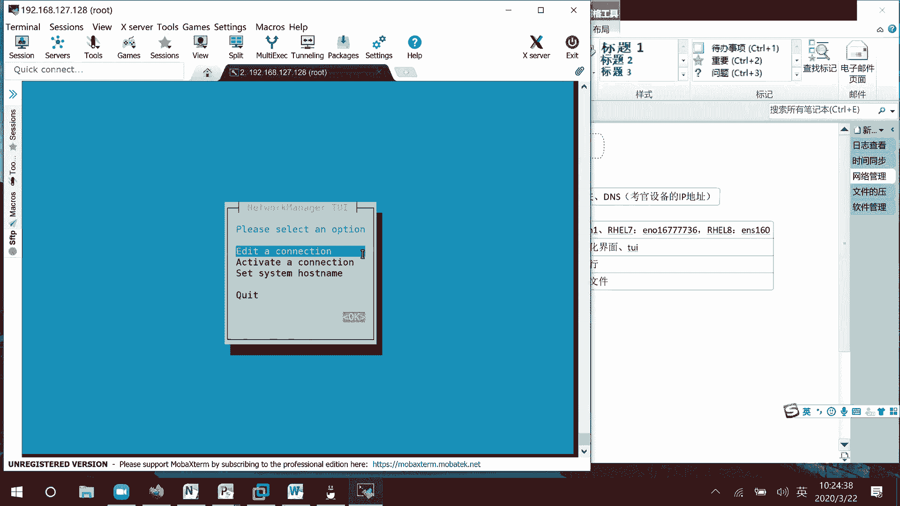
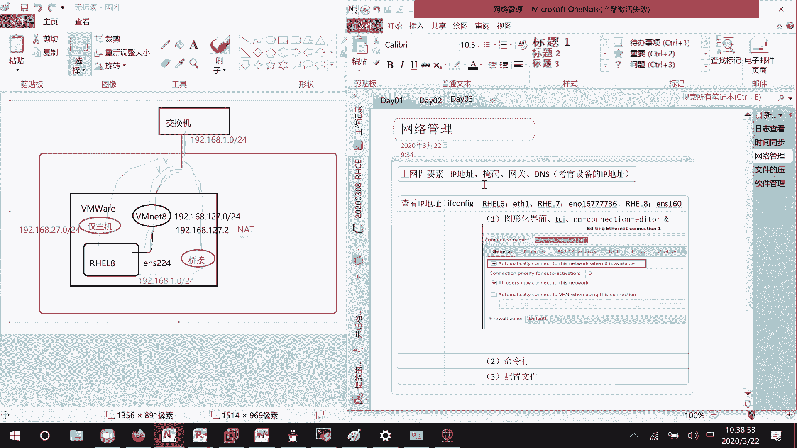
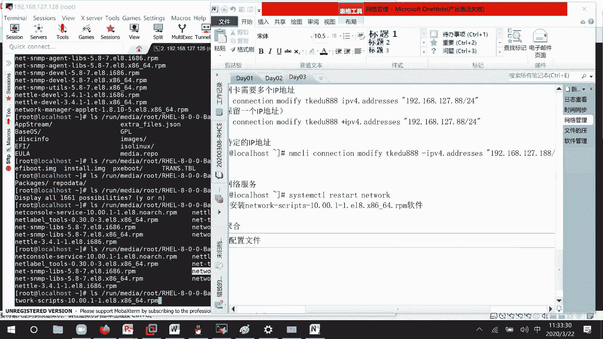

# 01 RHCE8.0视频教程【45课时】 - P6：20200322-RHCE-01_recv - 六竹书生6682 - BV1m84y1f7ss

然后今天的话呢，这里我们开始来上课哈，我看一下这个有。来上课。今天的话呢一些内容就是说呃日志的一个查看。还有的话呢时间同步。之前的话呢，这个时间同步在我们普通的环境上的话呢，它要等很久。

但是考试的时候呢，一下子就能成功。因为考试的时候呢，他把一些变量都已经设好了。然后接下去的话呢，还有一个叫做网络管理。这个网络管理这一块非常重要。因为我们在考试的时候呢。它里面是不是一台一台的虚拟机啊？

对不对？它的话呢会有一个叫做服务端和客户端的概念。首先这些设备它要能互相去连通嘛，所以你要学会去怎么去配IP地址啊。还有的话呢，怎么这样去修改IP地址，在7。0版本当中的话呢，它还去考。

如果我一台电脑有两个网卡的话呢，我怎么样把它给绑在一块嘛？7。0当中也考。然后这边的话呢，8。0我们也要去学哈。然后接下来我们来看一下下一个章节的话呢，就是文件的压缩和归档。

这文件压缩和归档的话呢是怎么样子呢？也就是说它在一些呃系统当中放了一些文件，让你把它给找到。找到了之后呢，对这些文件去把它归档好，归档好了之后呢，再进行一个压缩，就放在那里。

到时候的话呢会有机器自动去评分嘛。然后下面这里的话呢，我们再来看一下，接下去就是我们软件管理。我们上节课的话呢，就简单的学习了一个叫做服务的管理，服务管理可能就怎么启动。但是的话呢在做服务管理之前。

我是不是先去安装了一个软件啊？所以的话如果软件没装，那你这个根系统上面根本就不存在这个服务，不能提供这个功能。这样子的话呢，也不需要你去管理了嘛。所以这个的话呢是我们今天安排的几个内容。内容的话呢。

我就不安排太多了。因为咱们上课进度的话呢。呃，有有点快了哈。好。上节课的话呢，我们学完了日志管理之后，后面的话呢就是说没有让你们去怎么样去找日志嘛。好吧，这边的话呢查看日志，它的一些命令的话呢会比较多。

这个的话呢，在你们工作当中有些人会用到。首先第一个的话呢就是说。Tll。就是说查看违几行的信息嘛。不行。喂几行的信息。啊。但是这个的话呢，我们之前学过像这个te的话呢，后面是不是要跟上一个文件的名字啊？

这里我们来看一下。Pace。AI L。这里有个选项的话呢，叫做F。F它的话呢叫做follow name。describe我看一下这个我翻译的话呢哦翻译t减F。哎以。

它这个的话呢就是说去实时的去查看我们日志的一个信息。比如说呃。log message嘛，就是说它这边如果有增加的话呢，就会实时的去给你显示出来。所以的话呢，像之前他这个是不是静态的去进行一个查看。

这边的跟上一个减F，它的话呢就可以进行一个实时性的查看了，好吧。实时性的。查看为机航的信息，只是说我们现在的话呢，就是没没有做日没有做什么事情，它这边就没有日志产生嘛。contrl C的话呢结束查看。

然后还有一条命令的话呢，hotel。他的话呢就缩写，因为这条命令经常用到tllFA，他这边没有哈。他这边的话呢，没有这个命令。嗯，我看一下。这个的话呢，这个版本当中没有tellF的一个命令。

在七版本当中的话呢，它有一个叫做tell F的一个命令。在我们的八版本当中没有这个命令。然后接下去的话呢，还有什么命令可以去查看日志呢？这个叫做janner。Geneial control。

他这个的话呢，一回车的话，就是把所有的日志信息给你去显示出来。好吧。显示所有的资质信息。他这个的话日志信息就是说从最开始就是说这边的话呢，就什么时候开始嘛？

2020年3月22号几点到我们2020年3月22号几点？这边的话呢给我们去进行一一显示。好吧。他这边的话呢，因为我开机的时候之前没有产生什么事情嘛，后面的话呢才进行一个登录嘛。啊，这个特别多。那行。

然后接下去的话呢，还有一个什么呢？如果说你想去在这个日志，因为它这个是一个日志系统，它是所有的信息。刚才这个的话呢，是不是针对某一个文件啊？如果说你想要实时性的去查看所有信息的话呢，这个可以怎么办呢？

dnner control这里的话呢减F，它这边的话呢就会对所有的日志信息进行一个实时的一个显示，好吧。实时显示。所有的日职信息。那好，然后这里的话呢，像像有时候我们可能在进行诊断的时候。

可能系统报错了嘛，我们只关心什么级别的呢？不是infer级别的，我我可能只关心那个叫做。嗯，哎。我的话呢只关心就是错误等级的一些事件。这里的话呢它的选项有很多啊。

这个叫做P选项就priority你的一个优先级，也就是说事事件的一个等级是怎么样子的吗？然后下面这里的话呢，我们再来看一下减大S或者就是说减减sin，这表达什么意思呢？

你后面跟一个日期就表示哪一天发生的。或者的话呢就跟上什么yesterday昨天的一些信息嘛，都可以的。好吧，然后的话呢它这些选项是可以去组合在一起的，你再跟上一个U。

比如说查看昨天上午9点到昨天下午4点的一个信息，它这个都可以的。行，这里的话呢我们稍微来试一下。因为这个日志主要是查看，我就跟你们讲这几个。呃，gen control这边的话呢，比如说你要么写一个大S。

或者的话呢减减sin。回车后面什么都不跟，它是不可以的，你至少要跟一个日期。比如说今天的。或者的话呢。也就是说你去跟上一个具体的日期，今天就是说几月几号嘛，2020年3月22号，对吧？

它也是能显示出来的，像这就几种格式哈。然后还有的话呢，就像刚才说的事件等级减小写的P就行了。ERR级别的。这里的话呢就把一些错误的信息给我们显示出来，好吧。然后还有的话呢，就是说从什么时候开始。

比如说3月21号开始NT UNNTIL这里的话呢就是引号，比如说叫做2020年3。0322。这里的话因为就是说我昨天的话呢没有开机，所以它这个日志的话呢，就是什么东西都没有，什么东西都没有。

然后还有的话呢，就比如说几点几分嘛，比如说我这边的话呢，要去看早上9点30分。到现在9点40分。叫做40。它就是说产生的一些日志有哪些回车，它这个的话呢就可以显示出来，就是说30分的时候没有。

但是33分的时候呢开始有了嘛。会等一下。他这边的话呢只有9点39分53秒，就是说像56秒、57秒，它就没有产生信息了，明白吧？所以这里的话呢就是说有这些格式啊，我给你们来看复制一下哈。呃。

查看所有的日志信息，下面这里的话呢还有。叫做。查看今天的日期。哦，查看今天今天的日志。然后接下去的话呢，就是说查看具体从哪一天开始的日志。然后接下去的话呢，我们再来看一下这个就是根据事件级别。

去对日志的话呢去进行过滤嘛。根据事件级别对日子进行过滤。然后接下去的话呢，我们来看一下这个就是说到什么时候过，它的话呢，这个不一定就是要和sins去进行一个结合啊。你这边的话呢，就是他如果你不指定。

那就是从最开始去进行查看，直到这个时候去进行一个结束嘛。好吧，这个的话呢是日志查看里面几个简简单的命令。下面的话呢，我们来讲一下时间同步，就是说时间同步这块东西，像上次课的。

就是说第一次课有些人就是可能时间啊，或者就是他的一个时区没有设置，我之前跟他说的话呢，可以在图形化界面当中去设置，对吧？来看一下这个图形画的话呢，在哪里去设置。

呃，这里。然后这里的话呢，有个叫做啊，不是这里啊，右击stting。

稍等一下，然后这边的话呢，它这个比起之前就智能很多，可以搜索。打开这个time，然后这里的话呢要不要自动时间同步啊，当前时间是多少啊，你的时区是什么时候啊，都可以去设置的。好吧，如果说没有图形化界面呢。

我们该怎么办？

首先第一个的话，我们先来查看。时间当前的一个时间。命令的话呢就是DATE。这个的话呢就表示今天是星期日3月22号，然后9点46分，时区的话呢，CTS2020嘛。然后现在的话呢，我们想要去看一下。

他这个东西去管理时间的话呢，有一个专门的时间服务。时间服务时间服务的一个名字的话呢，叫什么呢？呃，叫做time control吧。System control。减简。等一下减减。

System control。List。Fire。list unit file这边的话呢，我们去查找一个。time嘛就是说可能我不知道它是什么，但是时间的话呢，要么和time有关，要么和d有关嘛。

我这边来查一下time time，你看这边的话呢可能就有一个叫做time，这个是一个同步，这是tage不管它。time date X service。这里有一个就是说对他去进行一个管理的嘛。

时间去进行一个管理的，好吧。然后接下去的话呢嗯。我们这个看到的是不是一个叫做比较简单的一个时间信息啊？稍等一下，我后面再加一遍。这里。看到的是比较简单的时间信息。如果说我想要看的详细一点呢。

因为有时候我可能嗯不知道这个到底代表什么意思嘛，到底代到底代表什么属性嘛。还有一个叫做time dead。Control。它就可以显示的非常的清晰。这个表什么意思呢？你本地的时区的时间是多少？然后呢。

临时区它的时间是多少？然后呢，这里的话就是说临时区的那个时间嘛，下面这里你所处的一个叫做时区在哪里？然后呢，你这边的区域是比起于临时区，是东边呢，还是什么什么什么区域，就是说比它快了8个小时嘛？

然后这里的话呢，当前你的一个时有没有开启你的时间同步？这里就是说no no就表示我的时间同步是没有启动的，知道吧？这里可以看到所有的信息。这里的话呢我就不进行注释了哈，因为已经给你们读过一遍了。

下面这里的话呢，我们继续来看。像这边的话呢，可能这里时区是一个亚洲上海，对不对？如果说我想要去改改时区，用命令怎么样去做。修改时区的话呢，它的命令就是这个time debt controll。

这边的话呢就有说help这里哈，首先这里有一个叫做set。不对？set time room后面的话呢，你去跟上时区就可以了。但是就说据我据我来说，我都不知道中国的话呢，它会以哪几个为时区嘛？

可能有亚洲、上海，可能有亚洲、重庆，可能有亚洲、北京。那有没有亚洲、杭州。这个我不知道。那这里的话呢可以使用这个叫做listtime room去看一下，它支持哪些时区，好吧，这里的话呢叫做。对的。

不对啊，他。Dead control list。叫做time柱这里。查看时区。这边的话呢会显示出来很多东西。比如说我们这边的话呢，只关心和亚洲开头的一些东西，那就grape一下嘛。

管道府gra一下是不是就可以了？所以的话呢一定要学会怎么样去进行一个过滤。然后这边的话呢，就比如说唉他这里的话，亚洲北京好像没有没有显示出来哈，没有显示出来。但是的话呢有一个叫做亚洲。重庆。

重庆好像也没有显示出来。是我看错了吗？就看到了一个亚洲上海。亚洲上海唉，重庆在这里怎么没找到呢？那这边的话就一个亚洲上海哈，我比较熟悉一点。或者的话呢，我这边比如说那我就随便选择一个吧，选择第一个吧。

好吧，把时区的话呢改成这个时候。改成这个时时区。那这边就是time dead controll set time zone。后面的话呢，你就把刚才复制粘贴的这个东西给放上去就可以了。好吧。

然后现在的话呢，我们再来去看一下嘛，你看这个时区的话呢，是不是就刚从刚才我们的东八变成现在的一个东三区啊。对不对？就修改它这个的话呢，不需要去启动服务，它直接自己能识别。我把它改回来。

改成一个叫做亚洲上海。好，这边就东八区。因为如果说我这边哈去改成北京。人家的话呢识别不到，所以就没有用了。你一定要去看一下那个系统当中支持的时区有哪些，知道吧？

这个不能就是说自己一股脑想要怎么设置就怎么设置。那行，这个现在这里没什么问题啊。下面这里的话呢，我们要来看一下那个叫做NTP服务NTP服务。这个的话呢就是时间同步。像现在的话呢。

很多很多平台它都会一个分布式部署。也就是说在一个集群当中，它有很多很多的设备嘛。像上一次课的话呢，我们解决了一个什么问题呢？多个集群当中要互相访问的话，那首先要不要互相信任？那也就是说互相之间的话呢。

进行SSH信任。但是像有些软件对于设备的时间的话呢，也是有要求的。那我怎么办呢？我的话呢，比如说手工给他设一个时间或者手工给他设一个时间。那有时候设置的时候呢，嗯设备离得比较远啊，或者要进行一些查找。

可能会时间差会比较多一点嘛。那现在的话呢能不能这样子呢？就好像第一第一台设备，它就相当于那个晚上7点。央视就是说电台里面的话呢，它是不是就有那个铃声起来，我的话呢就看一下手表，我的时间和这个7。

1不一样。不一样的话呢，我就对自己的时间去进行一些调整嘛。那所有人都和这台设备去进行时间调整的话，那是不是整个集程当中时间就会同步了呀？对吧它就这么一个概念。在这里的话呢。

这台设备是不是就是一个serv？他去提供一个时间。然后这些的话呢算是一个client，不断的去和我进行一个。时间的比对嘛，时间的比对。那好，这个的话呢叫做NTP服务。因为它是1个NTP服务。

那它的名字叫什么呢？我们首先来查一下。System control unitit late呃 unitit file。因为就是说这个是1个NTP，我们来查一下和NTP相关的一个都没有。

这个的话呢是为什么呢？😡，他的一个服务名字比较奇怪一点。它叫做这个。CHRONY它的话呢不叫做NTP。明白吗？查看服务名。等一下。因为就是说时间同步的话呢，它有很多方式去做。在我们这个叫做7。

0红帽考试当中的话呢，它是用这个时间同步服务，而不是用那个NTP服务。因为有些人的话呢是知道就是有一个专门的NTP服务，对吧？在这个考试当中，我们用他用的的话呢，就不是这个NTP服务，用的是这个服务。

用的是这个服务，好吧。就考试考试的一个环境的话呢，和我们平时用的一些软件可能稍微会有点那么不太一样哈。那好，这边的话呢服务是有了。这边我们看到这个是不是一个disable的一个状态。

我们先来看一下system control，看它一下开机的启动状态。disable看一下它当前的运行状态。inactive也就是说根本没有去工作，对吧？我们等一下的话呢，记得把他的服务的话呢给开起来。

现在的话呢可以不去开，因为等最后我们比如说配置文件修改完了之后呢，还是要去修，就是说去设置一下服务的，还不如等一下直接去设置嘛。这边的话呢我们来看一下，那现在的话呢我们要做的就是说去修改配置文件嘛。

那它的配置文件在哪里呢？CDETC因为说了这里的话呢会和他的服务基本上同名，对不对？但这里没有哈。你看LSETCCHRO唉，这里有CONF只是说它在这个ETC下面呢，不再是一个目录。

直接就是这个文件本身是我的一个配置文件。直接就在ETC下面，而不是说在ETC下面的某个目录里面了。就是说不是所有的服务都是在某它的一个配置文件都是在某个目录里面，有可能直接就是在ETC下面。ETC。

config文件。那好，那这边的话呢，我们这里就进来了，他这里的话呢什么意思呢？他这里就是说使用公用的服务器to。NTPOR级的一个项目。这里的话呢就是说提供了一个地址池嘛。

破2什么什么什么就是说开始加速，对不对？在这里的话呢，我们就去指定一下和谁进行加速。它这里的话呢，就这边的话它是包含了很多设备。比如说我现在的话呢，只和一台设备去进行加速的话。

等一下一台设备进行加速的话。怎么办？破的话呢，就是说这个是表示一群的机器嘛。这里如果说我们只想要和一台呢servver。后面的话呢去跟上内台设备的。比如说域名啊或者IP地址。

比如说我自己和自己进行同步可以吧？因为我就一台设备备嘛。这里的话呢，那你是不是可以写192168127。128或者127。0。0。1嘛？这个随便你啊，这边的话呢，就比如说我写这个。192168127。

128，这个i burst IBURST表什么意思呢？开启我们的同步加速。同步加速。好，这个好了之后的话呢，首先这是第一个稍等哈。就这样写。如果说那边的话呢是一个呃池字的模式的话呢。

那你就说用破就可以了。下面这个不用去管它，然后这里的话呢就是说开启它同步嘛，我们要看的是这里。Alove client access local network。也就是说允许谁来对我进行一个访问。

默认情况下的话呢，只允许本地，就说只允许自己去访问自己的。就比如说现在呢我希望192168127。0这个网段来访问我呢。love192168127。0。野满24位的。

如果说你希望19168这整个网段都能来访问我。那也就是说1921680。0就可以了嘛。我们这里的话呢，比如说更加明细一点是127来访问我。好吧。就是说允许呃设置。谁能够进行访问？就是说这个网段的设备。

然后下面这里的话呢，可能就是说要进行一些认证嘛，这里我们不看它哈。然后下面这里的话呢，就是说日志产生了之后记录到哪里去，好吧，我们就改这两行就够了。做好了之后呢，保存退出。保存退出完毕之后呢。

一定要记得重启服务。首先第一个把它给enable起来，下次开机的话呢，还可以去用嘛。System control， enable。然后还有一个的话呢叫做star。因为它本身一开始是关闭的。

现在的话呢是把它给start一遍就行了。如果你实在不放心的话呢，那就restar嘛。好吧。我们这里的话呢做完了之后可以发现它都没有提示，有没有成功，都是不知道的。那现在要做的事情的话呢。

就是说去检查一遍。像这个叫做椅子。is enable啊或者is active啊去检查一遍，知道吧？System control is active。active的。还有的话呢is enable。等一下。

它这边的话呢也是应F宝的。这东西就不用管它了，好吧。然后。然后这边的话呢就没有什么样的一个大问题了哈。😊，没有什么样的一个大问题。嗯。这里没什么大问题，因为就是说嗯。我们来看一下嗯，稍等一下。

这边有点小问题，我们来看一下这个它如果是一个叫做NTP服务器端。服务器端修改文件。它这边的话呢，因为就是说是自己和自己去进行同步的。所以就是说因为就是说作为这集群当中自己作为自己的服务器端。

那这个东西的话呢，服务器是不需要。对不对？因为服务器的话呢，你自己作为圆嘛。所以的话呢，那这几行信息是不是都可以去删掉了呀？对不对？😡，对吧。然后的话呢，如果说这边你是1个NTP客户端的话。

客户端如果你作为一个客户端，想要去和服务器端去进行同步的话，你要考虑的一个东西是什么？就说和哪台设备去同步嘛。这里客户端。就说因为我刚才的话呢一一起在配了哈NTP如果你是一个叫做服务器端的话。

你的话呢配这条就够了。如果你是一个客户端呢，你配这条就够了。表示我要和谁去进行一个同步嘛。对吧。因为就是说我们现在就是说两两台设备的话呢，是作为同一台设备，是作为同一台设备。作为同一台设备哈。

所以这里要稍微注意一下这个如果是NTB服务器端的话呢，你把上面的那些信息给删了就行了。它的话呢就是说自己和自己同步。然后客户端的话呢，去指定和哪一台设备去同步嘛。那好，这里做完了之后呢。

重启服务重启完了之后呢，我们来检查一下NTP服务是不是已经启动了。就这个time date control。这里的话呢是不是还是显示这个叫做no的一个状态。还是没有启动。那这边的话呢。

我们需要去进行一些设置哈。叫做。稍等一下。第一个。Time date control。这边的话呢叫做set。稍等，我看一下。Se。NTP。后面的话呢跟上t，把它给开启起来。

就是说我现在的话呢想要去使用我们的时间同步。稍等。这里的话呢就是active哦，这里是一个active啊，其实他现在的话呢是干嘛呢？现在就是说正在同步，只是说时间的话呢还没有同步完成。

刚才其实已经启动了，我刚才看错了哈。😊，然后这个的话呢，就是说服务已经启动了，然后他就是说在等待同步。虽然就是说是同一台设备，它也需要去等一定时间。等一定时间等时间，就是说嗯他们两个时间同步好了之后呢。

这边就可以变成一个yes了嘛。就可以变成一个yes了哈，稍等一下，它会比较慢一点，它会比较慢一点。你。B。嗯，我。Fure to question them。🎼稍等一下。28192168。

19216817。哎，这些都对的呀。我打一下看看。稍等一下。ORG。know the primary。Bye so5。他不在我这里面。🎼嗯，好的好。稍等一下。要装修。🎼どこの。

NTP他这个还没有同步成功。嗯。这个很慢哈。看一下。😔，那个。

那现在的话呢就是说还在那边等待同步，还没有那么快。但是流程的话呢就是这样子配下来。服务器端的话呢，主要就是说去设置一下谁能对我去进行一个访问。然后这边的话呢。

客户端主要就是说是去写我去和谁去进行一个同步嘛。我这边的话呢，防火墙。下午去克隆一台完全的这边的话呢，我不等了。就是说像你们刚才如果那个po它不注释掉。

他的意思就是说我现在是作为一台客户端去和其他设备去同步。我现在的话呢其实想做的事情是什么呢？自己和自己去进行一个同步。自己和自己进行同步。但是这边的话呢，这次又没有成功哈。😊，那这样子的话呢。

我下午去克隆一台了之后的话呢，再去做一下，好吧。好好，那这个的话呢就说时间同步的话呢，就先讲到这里吧。然后我下午的话呢，克隆两台了之后再跟你们来讲一下。

那好，下面这里的话呢，我们来看一下，接下去的话呢来简单的看一下这个叫做网络管理，好吧。首先这边的话呢，你们应该都已经有IP地址的一个基础了。像IP地址的话呢，它是32位的比特位。

然后0101它的网段有哪些，这个应该都知道的哈，我这就不讲了。然后的话呢，这边简简单的来提一下我们上网的四大要素嘛。首先第1个IP地址对吧？第二个的话呢，野马对吧？第三个的话呢，网关对吧？

第四个的话呢就是我们的DNSDNS地址，对吧？所以这几个信息的话呢，到时候可能考试的时候，它会让你们去配IP地址野马网关DNS的话呢，可能就是考官设备的IP地址。我们到时候在考试的时候呢。

它是一个局域网的一个环境。我们的话呢是不能上网的，不能上网。但是的话呢，网络形成起来之后的话呢，可以直接和考官的设备去进行一个互相联通的。那行，这边的话呢，接下去我们来看一下IP地址，查看IP地址。

就命令的话呢，它是一个if can big嘛。我们这边的话呢可以看到它这个名字的话呢，是不是ENS160这个是这个名字啊。它这个的话呢，像在我们红帽期之前，基本上命名的话呢。

是比如说ETHE啊或者ETH2这样子的一个名字。在红帽八之前，也就是说红帽七它的一个名字是什么呢？是1个ENO的一个形式。就是说RHEL6，它的话呢是ETH1或者ETH2那种形式。

HEL7它的一个名字的话呢，就ENO比如说1671736这样形式。然后的话呢像到现在我们的一个红猫8，它的话呢就是ENS160这样子的一个格式嘛。这个的话呢呃EN就是我们的一个以太网，没有什么问题。

然后这个O的话呢，之前是一个叫做onbo嘛。然后这个S的话呢，网卡它是一个模块插插槽，模块插槽。然后计算出来之后，后面这里的话呢，得到的一个结果是1个160。所以这个名字的话呢和之前是有些变化的。

然后我们去看IP地址的时候呢，这一块是我们的IP地址。然后这一块是我们的一个页码，这一块的话呢是我们的一个广播地址嘛，他自己会去计算出来，不需要我们去计算的。好吧。然后这个的话呢。

是他自己就是说呃形成的1个IPV6地址，我们现在还没有去进行一个配置。现在的话呢，这里我们比如说想要去对网卡进行配置的话呢，它有几种方式呢？第一种方式就是我们的图形化界面嘛。然后的话呢。

还有那个TUI界面。然后接下去的话呢。第二个叫做命令方式。然后接下去第三个的话呢，就是我们的配置文件的一个方式。

这边的话呢图形画界面我们简单来看一下。

也就是说这边。这里它有一个叫做setting。稍等一下。然后这里的话呢，你把它开启on，后面这里的话呢就可以进行一系列的配置嘛，这我不讲。

然后的话呢，还有图形画，就是说嗯字符的那种方式N。

NMTUI的一个方式。这个也可以去配的。考试的时候呢，这个界面是能打开的。

就说像这个界面。这个图形化界面可能就就是说对资源消耗比较多，有时候打开，但有时候能打开。但这个界面的话呢，基本上都能打开的。

好吧，所以这个界面的话呢，你们自己可以去研究一下。他的话呢就是说去编辑啊或者设置主机名啊，对吧？这编辑，比如说编辑这个网卡。然后下面这里的话呢，到底是自动啊还是手工啊，对不对？

它这边基本上用那个回车键啊，ESC键啊这些键去进行一些操作。稍等一下。诶。

然后除了这个界面之外的话呢，它还有一个图形化界面。这个界面的话呢呃是能用，但是相对来说的话呢，和这个图形化界面类似NM connectionnection editit。

就这个界面它也可以去编辑的。所以的话呢我们这边有三种方式可以去打开图形化界面。

图形化界面自己去练一下，我这边的话呢就不说了。呃，因为我这边的话呢就一个网卡，可能如果说对IP地址进行修改了之后，我的。

这个远程工具就不能连上去了嘛。我在这边的话呢，去给他再去新增加两个网卡。就是说这个设备的话呢，你去右击接下去添加。比如说我要添加网络适配器一个。再添加网络适配器2个。确定一下。

等一下。い。

然后现在的话呢，我们再来看一下我们的一个网卡，if confi这边的话呢，它就出来ENSR4ENS256这几个网卡吧。我这边的话呢嗯图形画界面的方式给你们去配一个吧，好吧。

好吧，图形化界面的方式给你们配一个。首先，NM connectionnection editit。然后呢，这里因为现的话呢，我我现在要对新的去进行一个配置嘛，所以这里点击添加。添加类型的话呢。

它有很多种。我现在的话呢是一个以太网。创建。接下去的话呢，它这边叫做通用这里啊，你们的话呢在考试的时候经常会忘记一个什么呢？所有的用户可以去进行一个连接，把它给勾上。把它给勾上这个。

然后还有上面这个叫做自动连接网络。

就是说当网络可用时自动连接嘛，就好像我们手机wifi的时候，呃，在配置的时候呢，它有个功能，就是说可用的时候自动切换到那个网络当中去嘛。

然后这里的话呢去取一个名字。这个的话呢什么意思呢？就好像说我现在这里的话呢，有个网卡，它叫做ENS224。就好像你这个的话呢，如果不插网线或者不连有线设备，它是不是就是一个物理设备啊？

就像我们的电话机一样嘛，不能打电话。那现在的话呢，我是不是拉一根线啊，比如说从电信啊或者联动联通拉一根线，这根线的话呢是不可以给它起一个名字啊，比如说一号线路，2号线路，3号线路嘛？对吧所以这个的话呢。

这个名字是我们这个连接的名字和这个网卡的名字是没有关系的，只是说给他的一些配置信息。这里的话呢，我比如说叫做ENS。叫做444吧，好吧，和他的名字224的话呢有点关系，但又有一点没有关系。

然后接下去的话呢，这就以太网。也就是说你给哪个设备去用呢？然后的话呢，接下去MTU这些的话呢，我们就不设置。好吧。然后接下去我们要配的就是IPV4的地址。这边的话呢，比如说手工配置添加一个地址。

我这个地址比如说192168127。130。也满24位网关的话呢，比如我看到是192168127。2嘛。这个地址的话呢怎么去看呢？啊，在讲这个的时候。我们先来看一下，我忘记那个网络环境跟你们讲过了没有？

稍等一下。就是说我首先为什么我这个设的是127，因为我刚才添加的两个网卡，是不是NAT模式啊？然后的话呢，我这边。编辑虚拟网络编辑器的时候。稍等一下。编辑虚拟网络编辑器的时候。

这个NAT是不是192168127啊？所以这两个的话呢应该在一个网段，为什么呢？这个的话呢。叫做。我这里。一个叫做VMware的一个软件。你的话其实可以直接把它想成一台设备。

它这个设备上面的话呢呃或者就是说把它想成一个环境。然后在这在这里的话呢，它有很多台交换机，你可以这样子去想。然后这里的话呢，其中有一台交换机，它叫做VNnet8。这个的话呢，它是一个叫做127。哦。

不对，192168127。0野满24位的一个网段。Yeah。然后的话呢，这个网段它的一个网关地址是多少呢？我们来看一下NAT设置，它的网关是不是127192168127。2啊，所以网关。

叫做192168127。2。那好。接下来的话呢，我不是在这个环境当中去有一台虚拟机嘛。

这台虚拟机的话呢，就是我这台设备叫做IHEL8。

其中我有一个网卡是。ENS。叫左多少呢？224对吧？我的一个模式是不是NAT模式啊，就相当于我这个网卡的话呢是连接到这边来了。就是说连接到这里叫做VNnet8这里来。那好，我既然连到这台交换机的话呢。

那我的网段是不应该和它是同一个网段。这个网段的网关的话呢是1个12192168127。2。所以我这台设备这个网卡的网关，是不是也应该是127。2啊？然后这里的话呢，你们稍微注意一下。

这个它不是1个NAT模式嘛，对不对？然后这个就是说嗯。它的话呢VNnet我们可以把它想成一个单独的环境。但是这个VNnet软件的话呢，最终是不是安装在我们windows主机上面啊？

我们把这个软件装起来了之后，就说有些人想要去正常通信的时候呢，我经常会让你们来看这个叫做网络适配器，对不对？因为其实这个网络适配器的话呢，就相当于是和我这个物理机去进行一个相连的相连的一个接口。

也就是说在我这个物理机上面的话呢。有一个叫做我画一下。哦，我有一个网卡。然后它这边的话呢，不是有网络适配器，叫做VMnetwork adapt变net8嘛，对不对？啊诶。叫做Vnet8嘛。

那这样子的话就相当于我这台设备的话呢，其实是也有和这个东西去进行一个相连的。近相连的。如果说你的一个模式是一个叫做NAT模式的话呢，会怎么样呢？我这边。发出了一个叫做1921681。

就是说127网段的数据嘛。是不是会这样子叫做一路过来？扒到了物理机网卡上面啊。我发现这个是1个NAT模式，表示他想要出外网的对吧？在我这个网卡的话呢，就会对你进行一个转换，转成我这个物理机所在的地址。

比如说我物理机是192。点168点1。0网段码。我的话呢就会把你转到这个网段的地址。然后和外界去通信。那到时候如果说外界有数据进来呢，发现是去给某个端口或者某个地址的数据。

那我这边是不会转换成原来相应的127的某个地址往里面去走啊？这个是我们的1个NAT模式，它是这样子的。然后的话呢，有时候你们还会遇到一个什么模式呢？叫做。稍等一下。等一下太慢了。然后有时候的话呢。

你们是不是会遇到一个叫做颈主机模式啊，它井主机模式的话呢是怎么样子的呢？也是一样的。在中间这里的话呢，可能有一个叫做。呃，虚拟网络适配器停主机模式。然后的话呢，像你这边有一个网卡。

它的话呢也接到这个叫做警主机模式的设备上面来。那好，那相同的像我这个网，就是说物理网卡的话呢，是不是也会接接到这里来？他这个警主机的话呢，它是不是其他网段，19216827网段。对吧。

就是说如果说这个VIHEL8，它发出的是19212719216827网段的数据，到了这个呃网络适配器之后，它发给了我的物理网卡，物理网卡发现是1个二期网段。我这个仅主机模式呢，只能在内部交互的。

它的话收到这个数据是不会再转换到外面去。但是如果说是内部的某一台主机要的话呢，我是可以去进行转发的。可以去转发的。所以像这个警主机模式的话呢，我们是不能上网。NAT模式的话呢，它可以上网。

原因是我可以帮你去转发出去吗？好吧，然后这是这种模式。然后我们这边的话呢，有时候还会看到桥接模式，有时候发现的话呢，这里网卡很多，那我这个桥接的话呢，怎么去桥嘛？如果说选择自动桥接的话呢。

可能还不能正正常进行上网。这边我们来看一下。比如说这边的话呢有一个网络适配器，就比如说我这边是1个VNnet0嘛，它的话呢是一个调接模式。调接的话呢相同的就比如说这边IHEL8有一台设备。

它不是连到这个调接模式的网络适配器上吗？然后我这里的话呢，物理级是不是也会去进行一个连接？它这个调接模式的话呢，这台设备其实你可以把它想成把这两根网就是说嗯。因为稍等一下。你们哎哦，对，你们来看一下。

就是说像这台设备，它在物理网络环境当中是不会连一台交换机啊？或者就是说其他设备反正就是说连接到物理网络当中去，对吧？如果说你是一个调接环境的话，我我这里一根线连到这个适配器，这里一根线是不是连过了。

其实就相当于这根线。直接就连到这台交换机上面了。那这样子的话呢，我这台设备会获取到的地址是不是就和这个网卡的地址是一样的？这个网卡地址，比如说是1921681网端的那我也是1921681网端的。

也是这样子的一个网段。所以的话呢你看如果说我这边是调到一个。呃，自动呢自动有时候就是说设备它可能没有那么智能，它选择不到。如果说选择这个叫做。戴尔无线的这个网卡呢，我们怎么去看呢？你看。

我这里有一个叫做戴尔无线1820，连接到了物理网络环境嘛，那就连到外界去了。然后我这里有个叫做vi virtual box的，这个是什么东西呢？是我内网当中。还有一个叫做虚拟化软件。

那如果说呃它连到了这台设备上去。那是不是就相当于我这个的话呢，和我主机内部的另一个软件去进行一个互相连接啊？所以这边的话在选桥接的时候呢，你们要稍微注意一下到底是连接到哪个网卡上面去。

这他这个你调调接到哪个网卡，这个网卡连在什么环境，就相当于你的话呢也直接的去连到这个环境当中去了。好吧，这里的话呢这三种方式考试的时候呢，不去考我们设备的一个连接方式。不会去考设备的连接方式。

这个应该没什么问题啊。你们我看你们班。还是很厉害的哈。😊，然后你看像这个叫做桥接模式的话呢，像这个NAT啊或者DHCP全灰的，它主要是看物理环境是怎么样的，我就是怎么样，好吧，然后像这个紧属机模式呢。

你看NAT模式是不灰的DHCP是开着的，表示从哪里到哪里嘛？它这个的话呢，因为只能在内部去进行一个通信。只能在内部进行通信。所以这里的话呢，你看连网关地址都看不到。Wong关。

其实网关地址是点2的一个地址，点二的地址。如果你想跨网段访问的话，然后像这个NAT，因为就是说要去到其他网段嘛，所以这里有个NAT设置，并且告诉你网关的地址是多少，好吧。那好，盖的话呢给你们打岔了一下。

现在的话呢我们继续来看一下这里。

叫做那那我这里的话呢配127应该能理解了，也满24位能理解网关121127。2能理解。然后这个DNS的话呢，DNS考试的时候会具体给你们，像我们在正常的，就是说现现在的一个网络环境当中。

你可以直接把DNS地址指成这个网关地址，让网关让你再去进行一个请求吗？或者的话呢直接去解8。8。8。8或者114。114。114啊，都是可以的。好吧，比如说我这里写8。8。8。8吧。

好了之后就sve一下。然后这个时候的话呢，咱们就配好了。

我们来看一下是不是真的生效了呢。你看这里的话呢，224它130是不是立刻就生效了？立刻生效，就是说我们连服务都不用充启。但是如果说你用图形画界面再去修改一下的话呢，可能要去重启一下服务，好吧。

这是图形画界面，然后这个命令行配置的话呢。就有些人知道叫做if confi也可以去配，对不对？但是我们这边的话呢用的是NMCLI的一个命令。这个命令的话呢，他可以就是说嗯下次开机的话呢。

它的一个配置信息还在吗？首先，NMCI connectionction show我们先来查看一下连接信息。也就是说，哪个网卡和哪个就就我们刚才说的这里有一个叫做24哎。这里的话呢是不是有个224的网卡？

这里是不是有个连接啊，也就是说哪个物理网卡和哪个逻辑连接是有相关联的，好吧。这里的话呢可以发现我NS160。有一个叫做这后面这里是设备，前面这里的话呢是一个叫做名字，就是说连接的名字。

然后这边后面这里的话呢是一个设备，这里的话呢是一个叫做连接的名字。我们刚才设置了4个。叫做3个4嘛，然后这个UID是什么东西呢？呃，在我们生活当中，是不是每个人有一个身份证去进行标识啊。

在计算机当中的话呢呃连接也好，网卡也好，还有一些文件也好，它都有一个自己的唯一标识符UUID来进行一个标识的。然后下面这个的话呢是设备自动生成的一个叫做桥接信息和外界可以去进行联系的，好吧。

那这没有问题，所以的话呢前面这是一个逻辑的名字，后面这里的话呢是一个设备物理的设备的名字。这个呢要稍微去注意一下哈。铂金名字，然后的话呢这个叫做物理名字。就说真实的网卡的名字叫什么？那好。

然后这里的话呢，我们只是看到一些简单的信息。如果说我现在想要去看一些详细的信息呢。可以这样子NMCIconnection show。后面的话呢，你再去跟上具体的连接名字。就比如说我去查看这个的详细信息。

稍等哈ENS。三个4。他这个可以去table的可以去table的。Yeah。叫做查看详细信息。哎，等一下。回车来看一下，它这里的话呢就把所有的信息给我们列出来了。

connection IDD啊UUID啊，还有呃网络的类型啊，然后接口的一个名字啊，是不是自动连接啊都有。那现在的话呢，就比如说我比较关心IPV4这部分的配置。是不是这里就有了？方式手工获取DNS8。

8。8。然后的话呢，这里就是自己的地址是多少。你看掩码，它直接就这样子跟在后面的斜线24。然后接下去这里的话呢，就是一个网关地址嘛，对吧？有时候的话呢，考试当中时间比较着急，你只关心IPV4。

你一定要记得使用过滤去做一下，好吧。然后接下去的话呢，我们来看一下。呃，NMCI connectionne show刚才的话呢就是说怎么查看是看到了。现在的话呢，就比如说我想要把它给。把这条把这条连接。

就是说把电话线给拔了，把网线给拔了，这该怎么办？就是说关闭断开链接。那这个的话呢，NMCI connectionnection，你看。ad添加delete editit是对连接编辑方面，对吧？

load是加载monit是监控。我们呢限速应该把它给当掉，d和up是一起的。也就是说down，然后的话呢，后面跟什么东西呢？可以发现这个是不是三个4，而不是24啊，后面跟的是连接的名字。回车。

你看现在这里的话呢，ENSJ deviceice这里是不是就两个横线啊？就表示目前它是断开连接的。也就是说我的话呢，配置文件是存在的，只是说没有和某个设备去进行一个关联。然后现在的话呢。

我们来看一下IP地址啊。他这个IP地址是不是就没了？因为我这个网卡和配置已经断开了呀。对吧现在的话呢，我们再把它给起来。😊，这个时候再来看一下。这地址是不是又回来了？

然后这边connection show是不是又有了？所以这里的话呢要注意怎么样去对我们的配置的话呢进行一下断开，进行一下连接。告说我。启动链接。这个的话呢是根据配置文件这一块，你们的话呢其实也可以发现。

有时候的话呢我能很快速的定位到我的设备。但是的话呢嗯配置文件的名字我不能很快速的去进行一个定位嘛。那现在的一个问题就是说怎么样通过这个是通过。啊，逻辑连接。去断开。我现在的话呢。

怎么样去通过物理设备去进行断开呢？那这边的话呢就不应该再写connection了，就应该写device嘛。device这边的话呢就是说disconect。然后的话呢，后面再跟上你设备的名字。

ENS224码。你看线的话呢又没有了。对吧。那行，所以这条命令的话呢，稍微去了解一下怎么样去断开链接。因为有时候在工作环境当中，你可能要去测试嘛。然后的话呢，disconect是断开。

connect connect的话呢就是说进行一个连接嘛。这里启动连接。那好。这里没什么问题。然后现在的话呢，就比如说我现在想要把这个东西去修改一下，该怎么办？修改我现在这个的话呢。

不是叫做NSENS3个4嘛，我觉得不太好听，我想要去叫3个6。这该怎么办？NMCIconnection showPNS3个4，对不对？我现在的话呢，其实就是这个connection IDD想要去改一下。

想去修改一下。他的命令基本上全都是一样的。你们来看一下。稍等。NM。C， I connection。后面的话呢修改的英文单词。Modify。modifymodify谁呢？😡。

首先我们是不是要写mody哪个属性啊？🎼稍等啊，我看一下modify它这里的话呢嗯NM。就是正常情况下，我们怎么样去写呢？叫做connection，叫做它的1个ID嘛。这里的话呢。就说由于像这些啊。😡。

它比较特殊一点。你后面的话呢，特别是改这个ID名字的时候，我本身的话呢是不是要通过名字去定位到某一个链接啊？现在的话呢，因为我们是去改某一个名字嘛，比较特殊，直接就去写这个IDID的名字本身叫什么呢？

ENS3个4。然后后面的话呢，新的呢connection IDD新的名字。ENS666。可以吧。NMCI connection就从刚才的一个叫做3个4变成现在的3个6嘛。这就修改。

所以的话呢这边格式稍微去看一下，叫做。前面这里我们全都是一样的。然后这个叫做ID是关唉。稍等一下，我这软件。崩溃了，这边我们来看一下。

它这个的话呢就是修改就是NMCI connection modify大家都是一样的嘛。只是说这里的话呢，IDID你去写一下。我因为我现在想要去修改某个设备呃，就是说某个连接的一个名字。

所以这里的话呢就跟一下ID。然后的话呢，原来你的一个名字叫什么？然后后面的话呢，修改的一个属性是哪个？后面的话呢再跟上新名字嘛。就是说属性前面这里的话呢，就是说连接的名字。然后这里的话呢。

就跟上你要修改的属性。然后后面的话呢，就是说新的值嘛。不一定是名字这个值好吧。那好。现这里的话呢，我们再来看一下有什么东西可以去改的哈。😊，比如说我们去改一下它这个吧，要不要自动去连接。

要不要自动去连接。根据上面这个命令的话呢，第一个是不是这个叫做NMCI。Connection。Modify。现在的话呢，是不是直接去跟这个名字就行了。ENS。666只是说好像比较奇怪，这边没有显示全。

对吧？然后我现在呢要修改的是connection点aler。Connectctor。它刚才的话呢是不是一个叫做自动启动的yes嘛，那它的一个反义词是不是就是no啊？回车。现在的话呢，你再去看一下。诶。

😊，然后这边的话呢，是不是就不会自动取暖？所以这里的话呢，它的一个格式基本上都是这样子。NM connectionction modify哪个属性改成什么样的一个性质，好吧。Yes。

然后如果说你想要去把它的设备改一下的话呢，也是可以的。就这个interface name，它这个不是给24去用吗？如果说你想要给那个叫做。呃。

256去用256去用NMCI connectionction。modify ENS3个6，然后呢。connectioninterface nameENS256。然后现在你再来看一下ifconfi。

稍等啊。ENS connection show。哎，他这边怎么还没有改过来？Reload。呃， restart叫做。他这边还没有改过来。喂，稍等。Ra。The I connection。嗯。嗯。哦。

他这个的话呢，现在估计不能直接去改。为什么呢？😡，嗯，这里啊。因为就是说这边的话呢，这个UID的话就是说不是他的，并且这个mark地址的话呢也不是他的。所以这样子直接去改的话呢，不太行哈，不太行。

我这个叫做224它的一个。呃，我这边的mark地址我看一下。这边没有显示出来。叫组稍等一下，我找一下。嗯，224他的话。第9E3，唉，这个不是改过来了吗？第九哦，对，D九的话，它还是原来的。

第九的话呢是上面这个的嘛，所以的话呢这不能这样子去改哈。我把他赶回来。叫做ENS224。这个时候再去up一下。应该就能up起来了。好吧，因为就是说在改的时候的话呢，他那个如果你真的要去改一个网卡。

你连它的1个UID啊，还有像它的一个叫做mark地址啊，这些信息都要去改。所以如果涉及到这个修改的话呢，建议你们先把原来的链接给删了，再去添加一个新的链接，好吧。

connection和device有啥关系？它的话它的话呢是这样子的啊，叫做。哦。这个device的话呢，它就是一个硬件的物理设备。我们的网卡是不是一个硬件的物理设备啊？

connection的话呢是一个逻辑的连接的配置文件。你可以这样子去想配置文件。我刚才那样子去改的话呢，为什么不行呢？配置文件里面它的mark地址是我的一个叫做。224这个网卡的，但是后面的话呢。

我是把网卡改成ENS256啊。所以的话呢我这个网卡的信息和配置文件的信息匹配不上。因为有个mark地址匹配不上嘛，所以它就不允许我去进行一个启动，这能明白吗？

device它是一个叫做物理上的设备connection的话呢，它算是配置文件配置文件，就是说逻辑上的一个表示？就是说我device和某一个connection进行联系，就相当于和某个配置文件去联系了。

这下播能明白吗？一个device要以配多个conect connectionnection。一个device它可以配置多个connection，但是同时的话呢只有一个connection是可以去用的。

一个device它可以配置多个connection，但是的话呢同时只有一个就是说只有一条连接式进行一个启动的。只有一条链接是启动的。好，然后这边的话呢，下面这里我们再来看一下，刚才的话呢就是说修改。

然后刚才修改的时候呢，这里发现它不成功，你们要知道它里面的话呢还有其他的一些影响因素嘛。那也就是说不能直接这样子。那我这边的话呢，就是说把链接给删除掉。那我重新去给256配一个嘛，可以吧？

NMCIconnectiondelete后面的话呢，你去跟上那个连接的名字嘛。这个时候三个六式就没了。好。然后接下去的话呢，我们就是说要重新去创建新的链接。我这边的话呢再讲一下，就给你们去练习了哈。

把这个链接怎么创建讲完就好了。NMCI connectionne这边就是ad。艾的话呢，后面跟什么呢？唉，等一下。ad的话呢，后面就跟上你这个连接的名字叫什么？刚才这个不是叫3个6吗？我现在叫3个8。

好吧，ENS3个8，其实你不叫3个8也可以，你叫TKEDU。三个8也是可以的。就说也不一定要以ENS开头。然后接下去的话呢，稍等ad connection connectionnection name。

Connection。ID吧。InS connection。好。这个就是说他这个名字的话呢，我们要用这个缩写先去加一下TK比如说EDU3个8，好吧。

connection name就就相当于这个ENS3个6。然后后面呢接下去我们在之前在配置的时候，是不是有去配它的网卡类型是什么？太胖嘛。😡，type或者你写connection type也可以。

就是说写这个详细的配置，你这边也可以去写缩写吧。好吧，我这边的话呢，type叫做eathernet以太网。然后接下去的话呢，比如说我希望它开机自动启动呢。

是不是connect connectionction auto connect。或者这边你在就是说你在刚开始初始化的时候，我们肯定可以对这个connection都去配嘛。所以这里的话呢。

你只打一个connection就可以了。打al connect就可以了。你也可以去打这个全称，知道吧？比如说我写yes。然后接下去的话呢。你可以去给这个设备直接去配1个IP地址。对不对？

手工的方式去配嘛，或者你这样子直接回车也可以，为什么呢？他默认的模式是1个DHCP的模式。会自动的去从我们的网络环境当中呢自动去获取IP地址。知道吧？像这样子创建这条连接的意义是什么呢？创建一个名字。

叫做创建一个connection。叫左ETKEDU3个8的连接。然后的话呢呃模式是以太网。然后接下去的话呢，开机自动启动，就是说网络可用时。自动启动。然后还少了一个什么。

是不是没有说和哪个设备去进行关联啊？所以这里的话呢叫做我们可以去说一下和谁去关联if name就是我们的device的一个名字，或者就是说interface name都可以。

我们这些if name和我们的ENS256去关联。好吧，后面这里再跟一个。If， name。ENS256这个设备就是说给ENS256网卡去使用。然后的话呢，其实到这里过，你可以回车了。

插线的话呢是不是就添加成功了？然后这边的话呢，我们来看一下这个叫做ENS256，有没有IP地址吗？你看他这里是不是就有IP地址，为啥呢？😡，这个就是说可以。自动的获取IP地址。

默认的话呢就是说获取IP地址的方式。是DHCP的。也就是说你环境当中有DHCP打开来的话，它就可以自动去获取。好吧，那好，现在的话呢，就比如说呃我不太喜欢它去自动获取。因为毕竟服务器嘛。

如果说我希望它进行一个手工获取呢。手动配置IP地址。首先这里的话呢。第一个NMCI connectionction，我要修改。修改哪个呢？是不是这个叫做ENS哦，不对，修改这个叫做TKEDU3个8。

然后接下去我要IPV4。他的一个地址是多少？比如说192168127。88。然后后面野码是不是24位啊，你就直接跟在这里，就斜线24就可以了。然后的话呢，是不是要给他去指定网关。

你可以192168127。2，就说这边一个空格，你直接打下去就可以了，知道吧？回车，但是你看这边的话呢。呃，他是不是有报错？他有报错，就是说。这边网关的话呢，它不可以直接跟在这边。

这一个提示就是说这个野码呢就24位，你不然的话，它会把后面所有的东西都识别成24位了。在我们的八之前，很多人的习惯都是这样子去打，但是从八开始，他不能这样子去打了。那边就是说配1个IP地址，配个掩码嘛。

对不对？配好了。然后接下去的话呢，现在因为刚才网关没有配上去嘛，IPV4点。点完了之后，你table多按几下，这边的话呢就有提示了。你这边的话呢就是说不需要一个一个去死记嘛。

你看这不就是get away了吗，对吧？然后呢，ges away的地址是多少呢？192168127。2嘛，对吧？然后还有一个最重要的。我。固定的IP地址给他配了，固定的一个叫做网关给他去配了。那么。

他的DS我也给他配一个。还有一个什么东西没配啊？是不是就是说获取方式我我也得去说一下，不然人家的获取方式一直是DHCP的一个模式，把它改成手工的方式。能明白吗？所以手动配置IP地址的话呢，这里有几部。

第一步，我们先去给它配置，比如说IP地址。然后接下去的话呢，我们再去给他配置。网关地址。然后下面的话呢，再去给他去配置DNS地址。重启会生效，因为这个是永久生效的，永久生效的。

和if confi配的是不一样的。if confi的话呢，它只是临时生效嘛，这个是永久生效的。你关机开机了之后，人家都在。好吧，你看所以的话呢，这边就是说先配置这些参数信息，再去修改你的一个mes的。

你们的话呢可以去试一下能不能先修改。menu模式。再配置。IP地址呢这个的话呢可能会报错。因为你你本身的话呢，现在就是说没有IP地址，你又设置成手工的，怎么可以呢？它这是不可以的，明白吧？好。

这里的话呢就这样子去修改，我们来看一下。If can be。256它这边的话呢还是这个我们来试稍等一下NM connectionnection。到音不对，叫做TKEDU3个8。再up一下。

再来看一下他这边的话呢，是不是就变88生效了。他这个就是说设备重启了之后呢，也能生效的，好吧。这里手工配置IP地址的话呢，你们顺序不要写错掉，先配IP地址。在呃修改模式。然后的话呢。

还有一点什么东西要注意的呢？像这些英文单词，你们可以不用去记，打了这个IPV4点什么东西的时候，按两下table键。他就可以把相应的信息给你去显示出来的。好吧，这也没什么问题。然后下面这里的话呢。

有时候在工作场合当中，我可能一个网卡需要多个IP地址嘛？那这个的话呢我怎么办呢？如果说我使用这种方式去修改。这种方式。他的话呢只就是说只保留1个IP地址了。就是说呃我这边的话呢。

IP地址呃怎么样去配置多个网关相同的，也是怎么样去配置DNS相同的，也是这样子去配置的。好吧，我们来看一下怎么去配呢。NMCI connectionnection还是modify。

比如说这个叫做TKEDU3个8。这里。😊，叫做IPV4。点address，你前面这里写一个加号。就表示我再加这一个属性机械，比如说给他192。168127。188也满24位的，好吧。

现在我们再来看一下NMconnection show。你看这里的话呢，是不是就有2个IP地址了？然后的话呢，比如说我们给它当一下，再给它up一下。叫做IP。ADD。哎，稍等啊。

这里的话你看这个256的话呢，是不是就有两个地址了？对不对？好。所以这里的话呢，在配置的时候，就是说你前面写一个加号就可以了。然后如果说你现在的话呢，可能有5个地址或者6个地址。

现在想要去去除某一个地址了。因为它这个地址很多，如果你直接都去除掉的话呢，都没有了嘛。如果去除的话，前面这里跟个减号就可以了。现在来看一下嗯。你看地址的话呢，是不是就一个。所以像这种的话。

一个网卡怎么去配置多个IP地址呢？是这样配的，怎么去去除多个IP地址呢？前面跟一个减号就行了，把特定的IP地址给删除掉。好吧。😊，然后像IP地址基础配置这一块的话呢，你们先去看一下，看完了之后的话呢。

我等一下跟你们去讲链路聚合。好吧。这里的话呢给你们20分钟时间去练习一下。因为早上的话快。然后这边的话呢，你们一定要知道，就是说呃首先要添加设备，就是说如果你没有这个网卡的话呢，那你去连接创建起来。

比如说。我现在只有1个160的网卡。你去创建了一个连接给256用，人家都不存在。那我设备怎么去用呢？是不是用不起来啊，所以一定要先把网卡添加进去。网卡有了之后，如果你不对它任何进行任何配置。

人家是不是空配的。所以我们像这些命令的话呢，就是说怎么样对这个物理网卡进行了一个配置，明白吧？这2块呢不要搞混掉。然后下面这里的话呢呃我们来看一下这个删除也讲了，现在的话呢。

稍等NMCI connection。然后的话呢嗯我们以前是不是经常会使用一个命令systemcontrol restartnet，对不对？它以前没有这么长的，就有一个network。这个命令的话呢。

它是干嘛的呢？他是不是去重启我们网络服务的？这个叫做重启网络服务哎。也就是说修改了配置之后，你去re start一下，或者reload一下这个网络服务重新读取。那么所有的连接它的配置信息都更新了。

现在的话呢，因为就是说红帽他说了，在下一个叫做RHEL的版本当中的话呢，就会把这个network全部给废除掉。就说不去用了不去用了。如果说你现在的话呢，还想要去用怎么办呢？你可以去安装一个服务哈。

这个下午的话呢可以去说一下，稍等一下。哦。Rme屌 rootot。HEL然后有一个叫做。I keep。有一个叫做。等一下。哎，这里你图我。反正没看到哈。在这里的话呢，没有看得到。它叫做network。

稍等一下，我找一下先嗯。这是应该没有找错。嗯，Fbo。然后的话呢就是。哦，如果说你想用的话呢，在这里叫做networkscript。这里就是说你把这个去安装一下的话呢，叫做安装这个软件。

你的话呢就又可以去使用这个network，就是说system control restart network的一个命令。只是说在下一个大版本当中的话呢，它可能就是说这个就会被废除掉了。

所以从这个七版本当中7就是说从这个八版本开始呢，大家就是说不要过分于过分依赖这个命令。那这个的话呢，它这个既然被去除掉了。我现在的话呢也让你们不要这么依赖于这条命令。那如果说。

对网络修改了，我要怎么样去重新启动我们的一些服务呢？刚才的话呢，不知道你们有没有看到我是不是经常做的一个事情，NMCI connection down。比如说in不要这个哈叫做TK888，对不对？

然后呢再进行一个up，对不对？的话呢其实就是说把这个链接给关闭了，对吧？然后呢，up呢。up的话是不是就把这个链接要启动啊？其实这个就相当于是我们restar的一个过程。

把某一个连接它的配置的话呢重新去读取一遍。如果说。这边的话呢你有很多信息要进行重启，就是说很因为工作当中的话呢，可能就是说有很多网卡也要进行重启嘛，一条一条去搞的话呢也不现实。

NMCLI connectionction这里的话呢有一个叫做reload重新加载。他这里就是说对所有的东西去进行一个reload。这条命令的话呢是一个tt服务。

和我们这边service的话呢是没有什么关系的。它也是网络在线的一些东西。呃，我们这个NMCI的话呢，就是nettwork manager里面的一个命令呀，对不对？NMCI connectionne。

然后这边的话呢。嗯，好吧，这个reload的话呢，就是说是对所有的去进行一次重启。

这个就是说去加载所有的连接。这个重启的话可以吗？这个重启是可以的，它还它没有废弃掉。你可以试一下，就之前的话呢，应该你们也了解过。

像这个network manager和那个network是不是有时候会进行一个互相排斥啊？对吧现在这个的话呢你去重启一下，它也是可以识别的。这里没什么问题啊，主要就是说嗯重启就是说怎么样去启动这块呢。

跟你们去讲一下。然后下面这里的话呢，我们来做一下叫做链路聚合。链路聚合。链路聚合的话呢是什么意思呢？就好像说我这台linux设备，我是不是有三个网卡，一个网卡的话呢。

可能就是说我的一个物理机要进行一个访问嘛。然后这边比如说有两个网卡，它的话呢，每一个网卡是一个叫做百兆的，好吧。这样子的话呢，一次性一个接就是说和某一台设备进行连接的话。

是不是一只能100兆100兆的发。另一个接口的话呢，它是不能起来去工作的。因为就是说我们知道通信当中有个原木，它是一条连接，一条通道的意思嘛。那这样子这边只能空闲在这边。

那有没有办法把这两条都利用起来呢？那就是说把这两条去捆绑起来嘛？一起去做同一件事情。就说我们可以把两个网卡或者多个网卡的话呢，去进行一个捆绑。它本来流出去的是100兆，就是说按照我们最理想的情况。

捆绑起来之后，一次性可以流出200兆回来200兆，流出去200兆，回来200兆，能明白吗？这就是说我们要做的链路捆绑。这个的话呢叫做TEAMT。首先我们去准备两张网卡，我这边比如说呃。ENS。

22224，还有ENS256，好吧。现在要做的事情呢。😡，为了让我们的配置能更成功，大家把这个叫做和224或者256相关的所有配置给清空掉。我这里把步骤写的详细一点哈。😊，第一步准备。两张网卡。

然后接下去。第二步。删除所有配置信息。不然的话呢，就是说不管考试也好，什么时候也好，会有影响的，能明白吗？NMCI connection deleteelete，因为我这边的话呢，或者我不知道。

那就是devicedelete也可以ENS256。还有一个的话呢。嗯。这个delete不了哈，那就NM connectionnection deleteelete吧。😊，TK3个8嘛。

这可以delete。好吧。把和这个叫做224，或者就是说呃256相关的都给删除掉。24网卡。和256网卡。相关的配置都删除。然后接下去的话呢。我们他的一个配置步骤是怎么样子的呢？因为他们两个的话呢。

是不是要组成一个小组啊？就是说这里一个网卡这里一个网卡，他们想要组成小组。那首先第一步的话呢，我们是不是先把这个叫做小组给创建出来？然后对小组进行一些简单的配置。配置完了之后呢。

第二步是不是把这些这两个网卡给添加进去啊？所以这里啊你看啊我们我们刚才说的那个步骤，我再来强调一遍。第一步准备网卡。不要忘了。然后接下去我们第二步。创建小组。然后接下去第三步。叫做将。哦，网卡。

加入小组组成一个小组嘛。他这个加入进去之后的话呢，有什么样的一个特征呢？我刚才不是说了一个例子嘛？我这里如果是一台linux虚拟机和这边如果说要进行通信的话，正常情况下原。就是说标志一个通信的话呢。

是不是有那个5元组的信息啊？原IP地址。目标IP地址。原mark地址目标mark地址对不对？还有一个协议嘛，我就不写了呃写一下吧。😡，然后你看和目的哪里通信的话呢。

这个目标IP目标m是不是固定的协议的话呢，是不是也固定的？也就是说，现在从两个变成一个的话，如果说这边是2个IP地址，是不是就两个通信，那这个是不合理的。不合理的。他们如果说加入到这个小组之后呢。

这两个网卡共用1个IP地址。然后并且这两个网卡共用一个mark地址，能明白吗？它加入小组的意义就是说在我们的逻辑上把这两个网卡它去使用同1个IP地址，使用同1个mark地址。

那这样子呢把两个两个接口当做一个接口去进行一个使用嘛？这样子的话呢，我们就可以就是说一台设备，它通过多个网卡和外界去进行交流。好吧，这个的话呢算是路由交换里面东西，我简单跟你们提一下。

有兴趣的话呢可以自己再去查一下哈。

那好，现在这里的话呢，我们继续来配置哈，按照这个过程。😊。

稍等一下哈。我看一下好，这也没问题。然后接下去的话呢，我们就说做第三个创建小组这个操作。

好，创建小组的话呢，我们怎么样去创建呢？NM connectionnection，我要去ad。爱的什么东西呢？现在就应该是。就就说呃connection。对不对？你小组也应该拥有一个名字吧，随便你写。

比如说我叫做听0，可不可以可以吗？if name呢0，因为我这个小组是不是没有对某个物理的IP就是说网卡是逻辑上的。所以这个名字本身就随便取的。但是这个呢网卡你就是说它到时候逻辑上会虚拟出。

就是说对外界的时候。用这个叫做逻辑上的听0去进行通信。好吧。然后接下去的话呢。之前在创建的时候，是不是ea thenet，我现在是不是小组，是不是应该就是pay。然后接下去我要说的什么东西呢？呃。

在进行开机的时候，就是说网络可用的时候要不要进行自动连接，你可配可不配。但后面有个最重要的。叫做config。Configure。也就是说我怎么样去和外界通信，我这里毕竟有，比如说两个网卡嘛。

我是两个同时去和外面工作呢，还是说正常情况下一条去工作，等我这一条出现故障了之后，这条再起来。知道吧？它这里的话呢，我们涉及到工作模式。创一小组的时候呢，涉及到工作模式。工作模式的话呢主要有三种模式。

第一种模式的话呢叫做active。这个叫做高可用，它的话呢是怎么样呢？正常情况。一条呃就是说一个网卡工作。另一个网卡是不工作的，等到就是说本身工作那个网卡出现故障了之后呢。

另一个起来接替他去进行一个工作。虽然这个的话呢没有我刚才那个效果什么，就是说达到200兆嘛，但它这个也是我们链路聚合的一个作用。然后第二个模式的话呢，是怎么样呢？叫做。ron呃 run。wo病吧。

这个的话呢是干嘛的呢？这个也就是说呃随机的。也就是说我网卡收到一个信息的话呢，随机的发送给某一个网卡，这个是进行一个随机发送。他的话呢就是说没没有说固定的去发送给某一个网卡。能明白吧？然后的话呢。

还有一种模式，我想一下叫做load balance。再少了一个。还有一个叫做漏。Bancecer。load balance的话呢是怎么样呢？一个就是说。来了一个数据之后。我可能第一个包给第一个网卡。

第二个包给第二个网卡，第三个包给第一个第四个包给第二个嘛。也就是说来了之后，我是均匀分配的。这个round bin呢可能我的话呢通过去算法，比如说哈希算法去计算出来这个某一个数据包的类型呢。

经常是一号网卡来处理嘛，那就一直发给一号。如果说像有时候算出来的一些哈希值，就是说这种类型是2号网卡来处理了那我就会发给二号网卡嘛。这个就是说是比较round的，就它这个有进行一个计算。

但这个road balance的话呢，就是说左一个右一个左一个右一个这样子就只是进行一个均匀分配，好吧。在以这里的话呢呃有这几种模式，主要是在我们这个config里面要去配置。这里面的话呢。

你们来看一下它这个配置命令是一个。jason的一个格式。JSON如果有些人就是说搞过开发或者者嗯了解过这种非结构化数据的话呢，应该知道外面我们这打引号应该能理解吧，它是一个字不串，好吧。

它这种格式的话呢就画括。首先我要去设置它的运行模式，运行模式是什么呢？后面是不是要写它的属性啊？然后这里因为运行模式的话呢，它有很多参数。其中有一个参数是写它运行模式的名字。Active。

Make up。我们这里比如说就写高可用嘛，你看它这个配置什么意思呢？我这个te有一个runner运行模式，这个大属性运行模式大属性里面的话呢有个name属性，这个name的名字叫什么呢？

act backup up。知道吗？如果说他还有其他属性的话呢，其实就是说在这里。去打个逗号，然后呢，再比如说叫做呃其他的一些属性嘛，冒号怎么样的。所以你们这个一定要注意一下。

前面这里第一个花括号是runner的这一组，然后接下去runner有什么属性呢？有name属性，name属性的取值是什么呢？是active backup。好吧，这东西不要写错调哈，比较长比较长。😊，好。

我这个前面这也就不复制了哈。😊，稍等我一下。好。然后下面这里的话呢，回车它是不是就添加成功了？有时候的话呢就是说这个太难记了，它的话呢有案例文件NMCI example这个 main文件的话呢。

就查看班助嘛，你们可以去看一下到底有哪些帮助帮助。因为我平时不太看这些帮助文件啊。呃，我回车了之后，你看。稍等，不瑞这里。我的话呢，因为它这个就和我们VIM编辑器的话呢是差不多的。你可以去查找的。

比如说斜线TEAM嘛，你看这里的话呢，是不是就可以去找到了？这里的话呢config就是一个叫做dressson格式的一个config，它直接就这样写了。我看一下下面这里还有没有哈。😊，稍等一下，我。

稍等哈。稍等，我先退出去。嗯，不是这个。这里它有一个叫做fronting一的一个fire，稍等我看一下。master听一。他这里好像没有写具体的一个叫做runner。up to而不是这里。🎼嗯ん。

他这好像没有去写了。哦，这里有这里有，你看它这边的话呢。这个就是说在。的模式下，它是可以这样子去写的，好像没有去写哈没有去写。那这边你们自己去记一下吧。在之前版本当中的话呢。

它config后面是具体的一个配置信息的。在这里的话呢，它就没有具体配置信息了，比较不好。😊，所以这边的话呢，你们自己来记记忆一下哈，记忆一下。但是这个NMexamp的话呢。

也是可以去帮助大家稍微去看一下的，好吧。那行，这里的话呢。创建小组这个步骤我们算是做好了。现在的话呢我们要做的事情是不是可以对小组进行一些配置啊？

对吧NM connectionnection show这里是不是就有个t啊？然后呢，就比如说IPAADDR。稍等一下。你看这里的话呢，是不是就添加了一个T啊？

他的一个mark地址是不是一个叫做20FD呀？对不对？这添加进来了，就是说创建了一个T这个物理的设备，呃，就是说逻辑上的一个物理设备。好吧，现在的话呢，因为它没有任何配置信息。

我们可以先对它进行一些配置。比如说给他一些IP地址啊，给他掩码，给他网关，可不可以，好吧。它接下来的修改的话呢，和物理网卡都是一样的NM connection modify听0IPV4。

address192168，比如说127。111吧。IPP4。Get away。192。168127。2。IPV4。DNS。192168，比如说114吧，114。114。114。114。然后呢。

IPV4点med，比如说手工方式去获取嘛。它这个的话呢，你可以一步到位的方式去进行设置的。好吧。😊，那好，这的话呢我们对T进行了一些配置。那接下来的话呢，我们配置完了，是不是要执行下一步了？第四步。

就是说把我们的网卡加入到小组当中去，将物理网卡。加入小组宗。在加入之前的话呢，我把这个信息给你们贴一下哈。😊，也就是说把第5块和第6块网卡给加进来嘛。那行，你看怎么去加怎么去加。NM。

Connection。添加。这里的话呢。添加类型是什么呢？你这这些属性前后顺序其实关系不是很大，只是说有个别的话呢，他要求有前后顺序。NM connectionnection add，我来看一下啊。

connection name。比如说叫做te0，它的第一个port好吧，接下去的话呢type。type的话呢有哪几种呢？呃，t的话我们好像用过了哈，它的话呢这里有个叫做slaver，唉。

怎么没看到了呀？😊，稍等一下。M NM C I example。哎，这里不是。哦，它这里直接就是in thenet type就可以了，直接就这种类型。

NMCI connection add typeeanet，然后呢叫做connection name，比如说叫做team0点port一好吧。然后的话呢，它真实的接口是谁呢？ENS224码。

然后我要去说一下我的老大是谁，就是说我属于哪个小组嘛？我是不是属于听零这个小组啊？回车。然后接下去的话呢，是不是还有一个叫做256啊？Pote2。然后就这样子。

NM connection add type。它的话呢是属于哪一个小组当中？这个的话呢就是。这个物理网卡它的逻辑连接名对应的是哪个物理网卡属于哪个小组当中去嘛？回车。那好，就是说通过这两条命令的话呢。

把设备加加入进去。现在的话呢我们来检查一下。你看这里的话是不是启动了两个啊？然后接下去IPAADDR呢。这个叫做第五个网卡。然后呢，这个的话呢叫做第六个网卡。这里的话呢是不是第八个网卡？

我们这边的话呢看不到它任何的关系，只是说这个是不是一个down的一个状态。down的状态，我们现在的话呢可以去启动一下服务。好吧，启动一下服务。NMCI connection up team0。

一不confi，我看一下现在有没有。你看现这里的话呢，是不是就有一个听您的地址了？这里聘您的地址是不是有了？我这边的一个mark地址，刚才看到是不是1个D9。我一更新之后。224，它的mac地址是多少。

是不是也是D9？256它的mac地址是多少，是不是也是D9啊？😡，现在的话也就是说我只要开启了这个T。他们加入到我这个小组当中来的话呢，mark地址其实都会变成我这个小组的mark地址。ID地址的话呢。

大家共用这个IP地址。这个能明白吗？虽然说在第五个网卡和第六个网卡那块的话呢，没有去显示IP地址，它这个本身就不显示的，他们的话呢是共用这个IP地址的。

因为你看最主要的我想让你们看的是它的mark地址都是一样的。它的mark地址都是一样的，就是说大家的话呢全都共用这个mark地址。然后IP地址的话呢，大家全都共用下面这里上面那边的话呢。

它没有进行一个显示。这个能明白吗？那现在的话呢，我们可以自己试试一下去拼嘛。

叫做pin。192168127。111。他这边是不是一直在聘啊？

然后的话呢，就比如说呃因为可能这个模拟器的话呢，它稍微有点问题哈。我们现来看一下正常工作的设备的话呢，它是哪个。好吧。Ting。Control。然后这边的话呢。Stats。稍等啊，叫做state。诶。

😊，Tin control。稍等听0。that你看现运行的是不是一个叫做active backup up的一个模式啊，然后的话呢里面有24的网卡，256的网卡。现在的话呢，谁在正常工作的？

224正常工作的。那也就是说我现在224把它给断掉了之后，那256是不是应该能起来接替去工作啊？对不对？😡，稍等，我先把这条命令给你们记录一下。很快就好了，稍微拖一下下就好了，稍等哈。首先这边的话呢。

我们就说查看状态。发现它是一个叫做224在工作的那我们现在把24给当了NMconnection downENS。呃，这个T0杠port124，好像是po一，对吧？

稍等一下，你看。他是port一，我把他给当了。然后的话呢，因为这是一个模拟器，它可能就是说要比较久的时间或者重新去拼的话呢，它才能去进行一个恢复。哎，这次很快哈，这次很快。你看这边的话呢。

256是不是就立刻来去，就是说去接替工作了。

这就是active的一个模式。如果说像那个round bin啊或者其他模式的话呢，可能会同因为同时都在收发嘛，可能会更加快点。

好吧。这个有没有什么样的一个问题？上午的话呢就讲到这里过。哦，就是说断开。ENS224的连接。然后的话呢，发现。很快就恢复了。所以像你们有时候在业务当中，如果有条件的话呢。

可以这样子就是说进行一个储备嘛，免得一个接口坏了之后，整个就不能去工作了。好吧。这个叫做把 team的话呢，我就讲到这里过。下午的话呢我再去讲怎么样去删除，怎么样去查看咱们的配置文件，好吧。

下午因为还是一点半上课，你们的话呢就。