# RHCE8.0 课程：01：网络配置与软件包管理


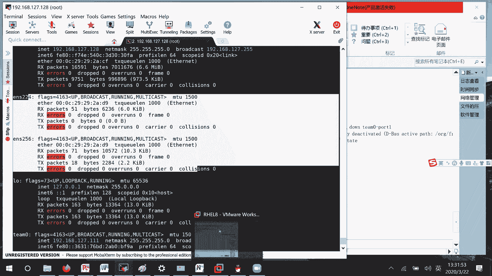

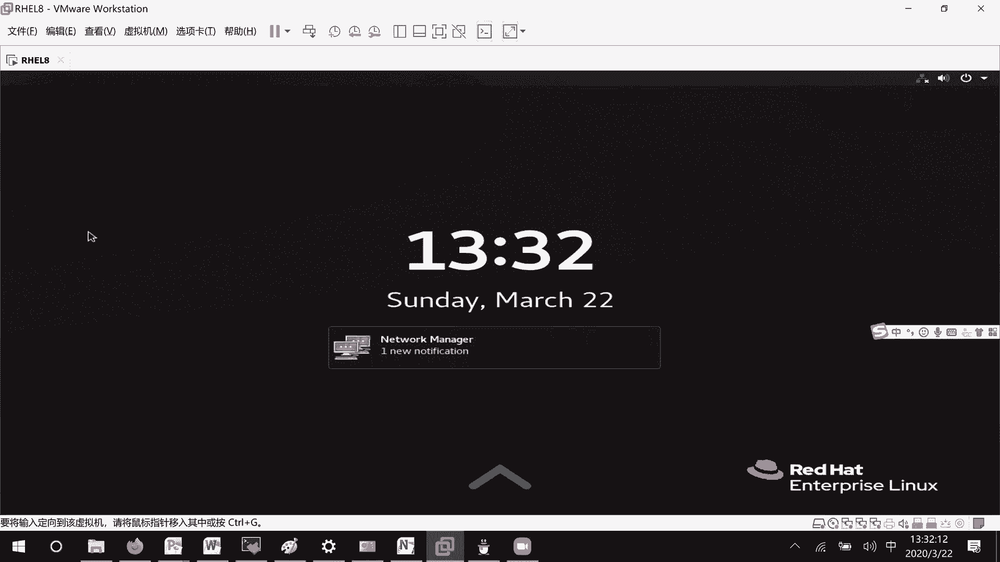

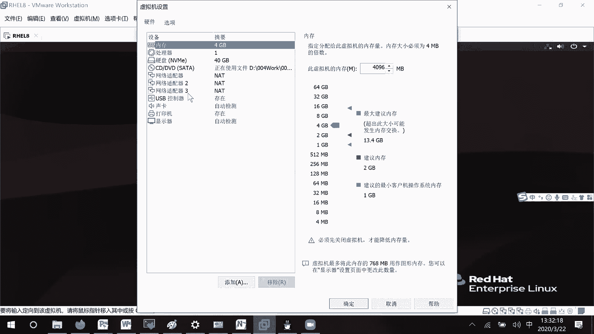

在本节课中，我们将要学习如何通过命令行和配置文件管理网络连接，以及如何使用RPM和YUM进行软件包管理。课程内容分为网络配置和软件包管理两大核心部分。

## 网络配置管理

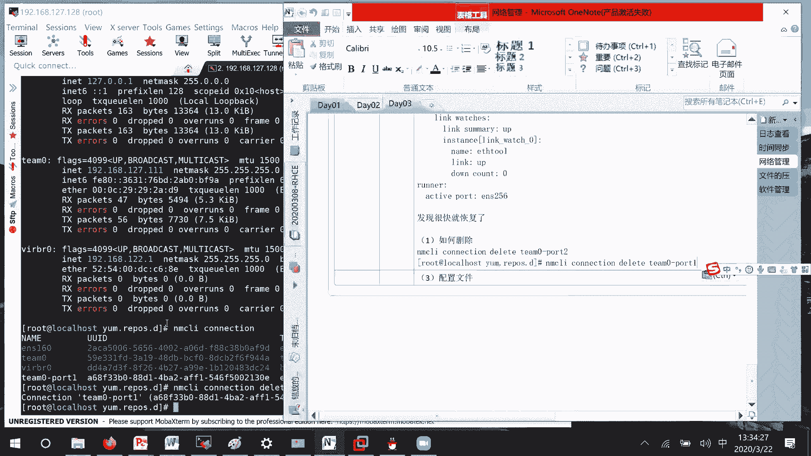

上一节我们介绍了网络连接的基本概念，本节中我们来看看如何通过命令行和配置文件进行具体的网络操作。

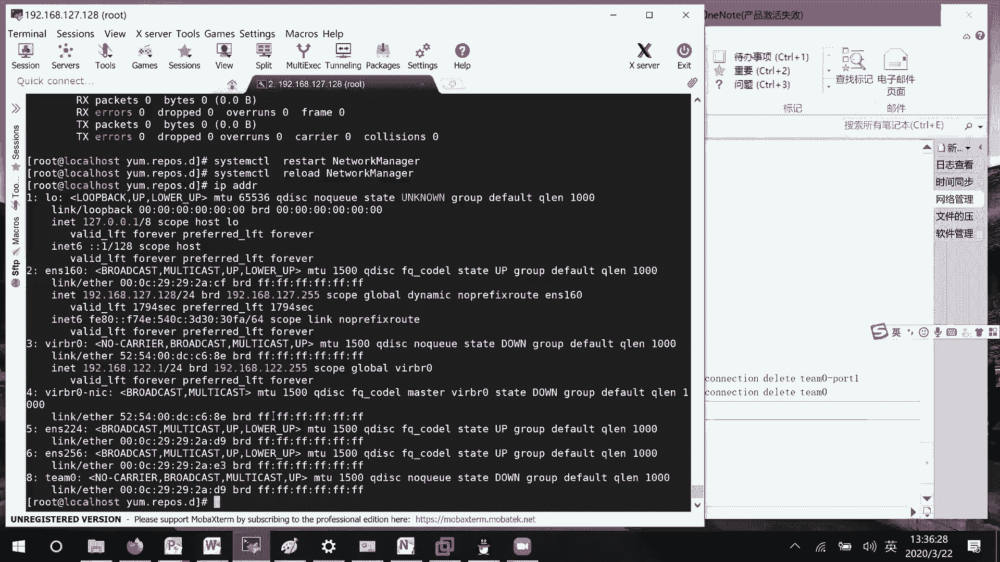

### 删除网络连接

如果需要将网卡从聚合组中移除或删除配置，可以使用 `nmcli connection delete` 命令。例如，删除名为 `team0-part2` 的连接：
```bash
nmcli connection delete team0-part2
```
删除后，可能需要重启网络服务或刷新配置才能使更改完全生效。有时需要按特定顺序操作：先移除组成员，再删除聚合组本身。

### 网络配置文件

在RHEL 8系统中，网络配置文件位于 `/etc/sysconfig/network-scripts/` 目录下。与RHEL 7相比，这里的文件更加简洁，只包含实际已配置的连接信息。

以下是编辑配置文件的基本步骤：
1.  进入配置目录：`cd /etc/sysconfig/network-scripts/`
2.  为特定网卡创建或编辑配置文件，例如 `ifcfg-ens224`。
3.  在配置文件中定义连接属性。

一个典型的配置文件内容如下：
```bash
TYPE=Ethernet
BOOTPROTO=none
NAME=tkEdu
DEVICE=ens224
ONBOOT=yes
IPADDR=192.168.127.77
PREFIX=24
GATEWAY=192.168.127.2
DNS1=192.168.127.2
```
**核心参数说明**：
*   `TYPE`：网络类型，如以太网 (Ethernet)。
*   `BOOTPROTO`：IP获取方式，`none` 或 `static` 表示手动，`dhcp` 表示自动。
*   `NAME`：连接名称。
*   `DEVICE`：关联的物理设备名。
*   `ONBOOT`：是否开机自启。
*   `IPADDR`：IP地址。
*   `PREFIX`：子网掩码前缀长度。
*   `GATEWAY`：默认网关。
*   `DNS1`：DNS服务器地址。

### 应用与刷新配置

修改配置文件后，需要重新加载配置使其生效。以下是标准操作流程：

1.  **重新加载所有配置文件**：
    ```bash
    nmcli connection reload
    ```
    此命令会读取 `/etc/sysconfig/network-scripts/` 目录下的所有新配置。

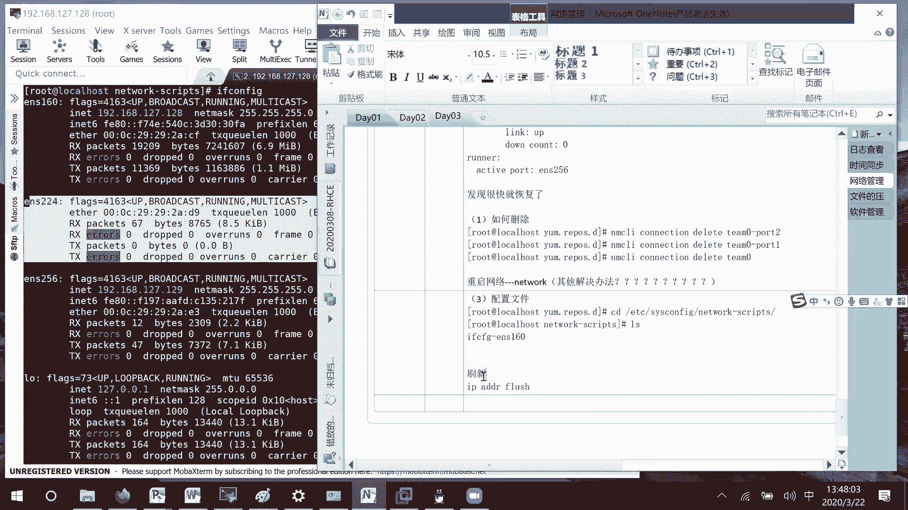

2.  **激活连接**：
    首先停止连接，然后重新启动。
    ```bash
    nmcli connection down tkEdu
    nmcli connection up tkEdu
    ```

3.  **刷新IP地址**（可选）：
    可以使用 `ip addr flush` 命令来清除并刷新某个设备的IP地址配置。
    ```bash
    ip addr flush dev ens224
    ```

**注意**：在某些情况下，直接使用 `reload` 可能不会立即更新已修改连接的配置，需要配合 `down` 和 `up` 操作。

### 修改网卡名称

如果需要修改网络接口的名称，主要有两种方式：

1.  **通过编辑GRUB配置文件**：修改 `/etc/default/grub` 文件中的内核参数，然后重新生成GRUB配置并重启。这通常在系统初始化时生效。
2.  **通过udev规则**：编辑 `/etc/udev/rules.d/` 目录下的规则文件（如 `70-persistent-net.rules`），根据MAC地址指定新的设备名。格式示例如下：
    ```bash
    SUBSYSTEM=="net", ACTION=="add", ATTR{address}=="00:0c:29:xx:xx:xx", NAME="newname"
    ```

**重要提示**：在修改关键系统配置（如网卡名、内核参数）前，强烈建议为虚拟机创建快照，以便在出错时快速恢复。

## 软件包管理

网络配置完成后，我们来看看系统软件的管理。红帽系统主要使用RPM和YUM两种工具进行软件包管理。

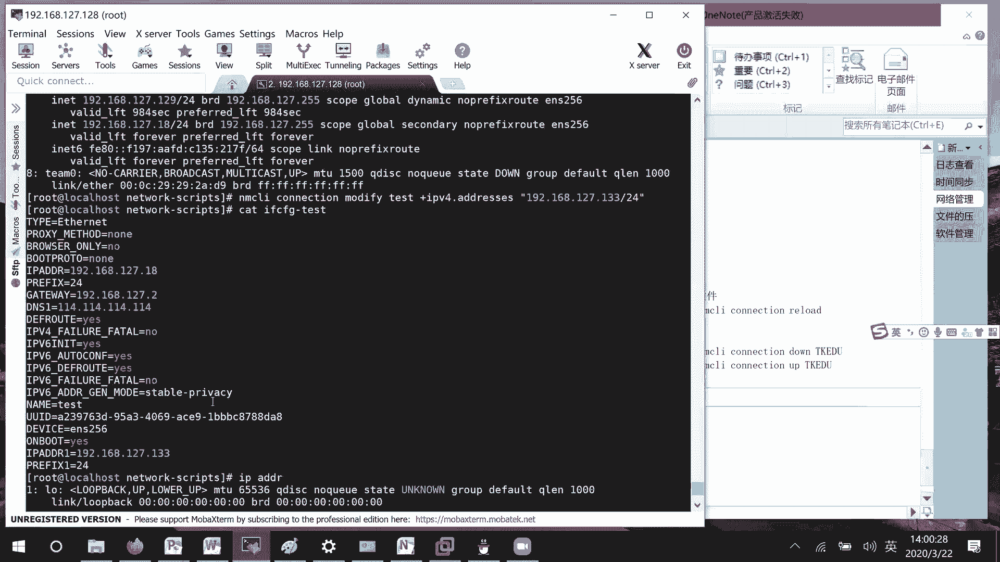

### RPM包管理

RPM（Red Hat Package Manager）是红帽开发的软件包管理器。它类似于直接下载 `.exe` 文件进行安装，需要用户手动处理依赖关系。

**软件包命名格式**：
一个典型的RPM包名如 `vsftpd-3.3.2-2.el8.x86_64.rpm`，其含义如下：
*   `vsftpd`：软件包名称。
*   `3.3.2`：软件版本号。
*   `2`：发布版本号。
*   `el8`：适用于RHEL 8系统。
*   `x86_64`：硬件平台架构。
*   `.rpm`：文件扩展名。

**常用RPM命令**：

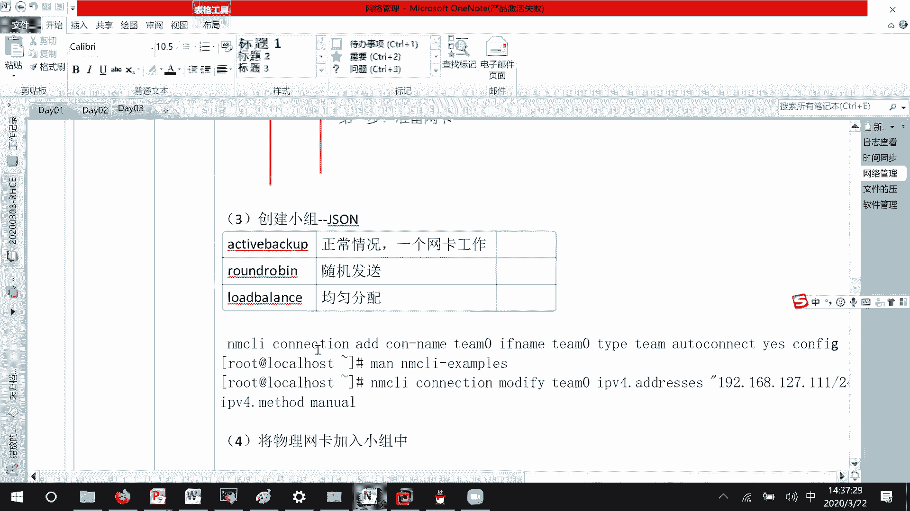

以下是RPM管理软件包的基本操作：

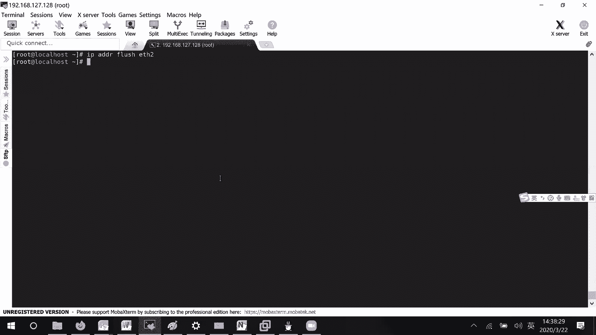

*   **查询已安装的软件包**：
    ```bash
    rpm -qa | grep vsftpd
    ```
    此命令列出所有已安装的包，并通过管道过滤出包含“vsftpd”的包。

*   **精确查询特定软件包**：
    ```bash
    rpm -q vsftpd
    ```
    此命令需要提供精确的软件包名称。

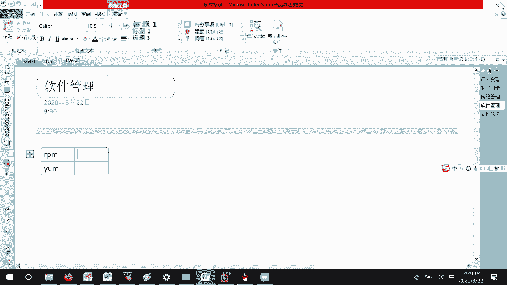

*   **安装软件包**：
    ```bash
    rpm -ivh package_name.rpm
    ```
    参数说明：`-i` 安装，`-v` 显示详细信息，`-h` 显示安装进度。

*   **升级软件包**：
    ```bash
    rpm -Uvh package_name.rpm
    ```

*   **卸载软件包**：
    ```bash
    rpm -e package_name
    ```

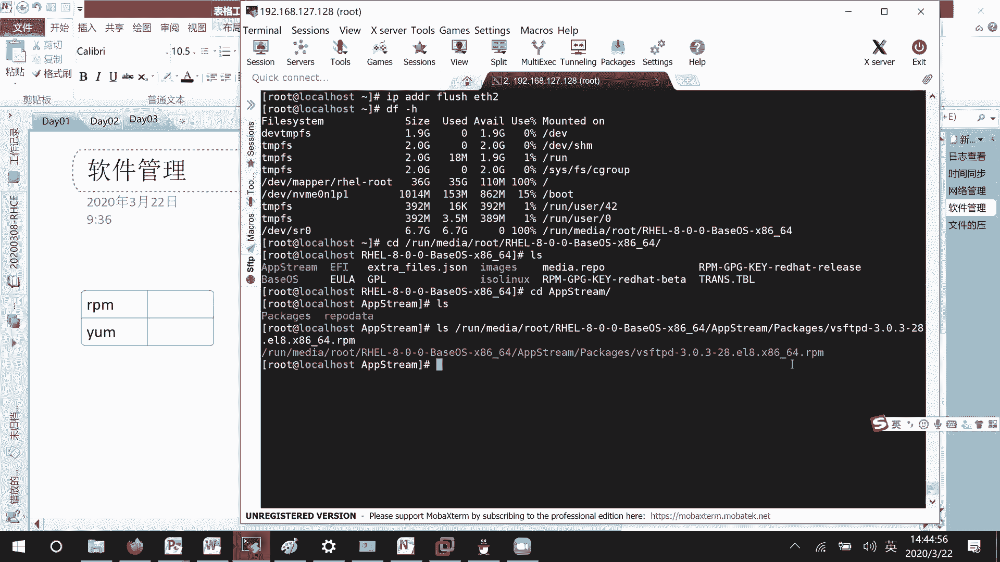

### YUM仓库管理

YUM（Yellowdog Updater, Modified）是一个基于RPM的Shell前端软件包管理器。它能够从指定的服务器（仓库）自动下载RPM包并安装，自动处理依赖关系。这类似于手机上的“应用商店”。

在RHEL 8中，安装介质（如光盘）通常包含两个主要的软件仓库：
*   **BaseOS**：包含与操作系统底层功能相关的基础软件包。
*   **AppStream**：包含应用程序、运行时语言、数据库等高级软件。

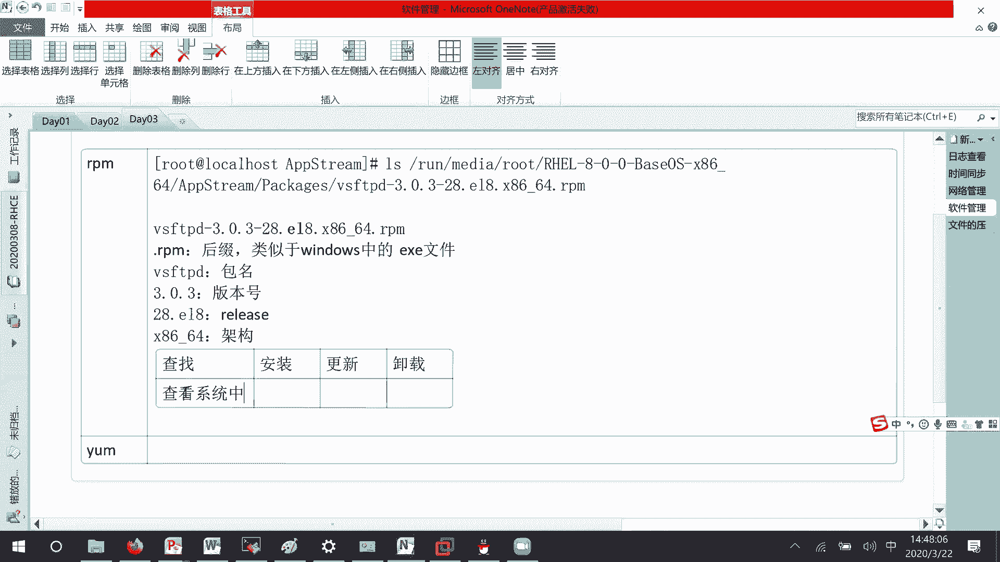

仓库的元数据（如软件包列表、依赖信息）存放在 `repodata` 目录中，YUM通过读取这些数据来管理软件。

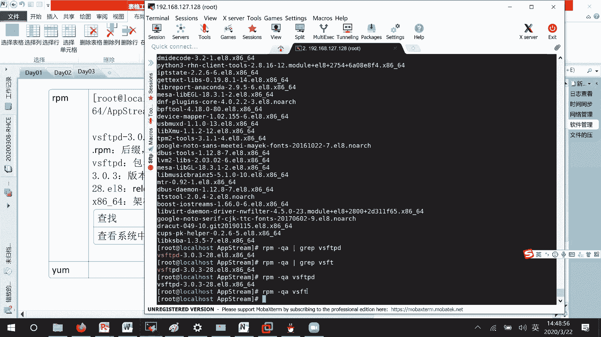

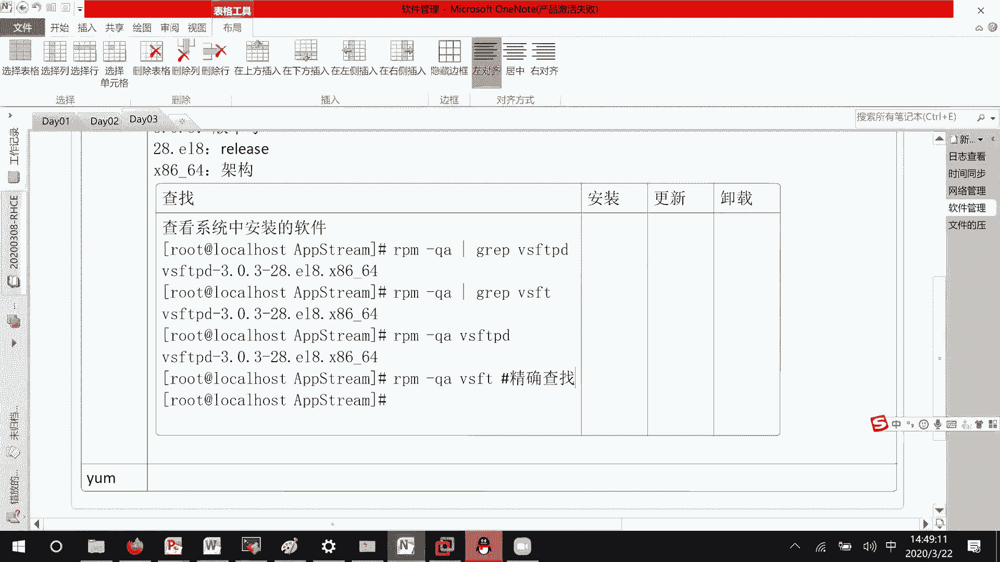

本节课中我们一起学习了网络连接的配置、管理与故障排除方法，包括使用 `nmcli` 命令和编辑配置文件。同时也介绍了Linux系统中软件包管理的基础知识，重点讲解了RPM工具的基本用法和软件包的结构。理解这些内容是进行系统管理和服务部署的重要基础。