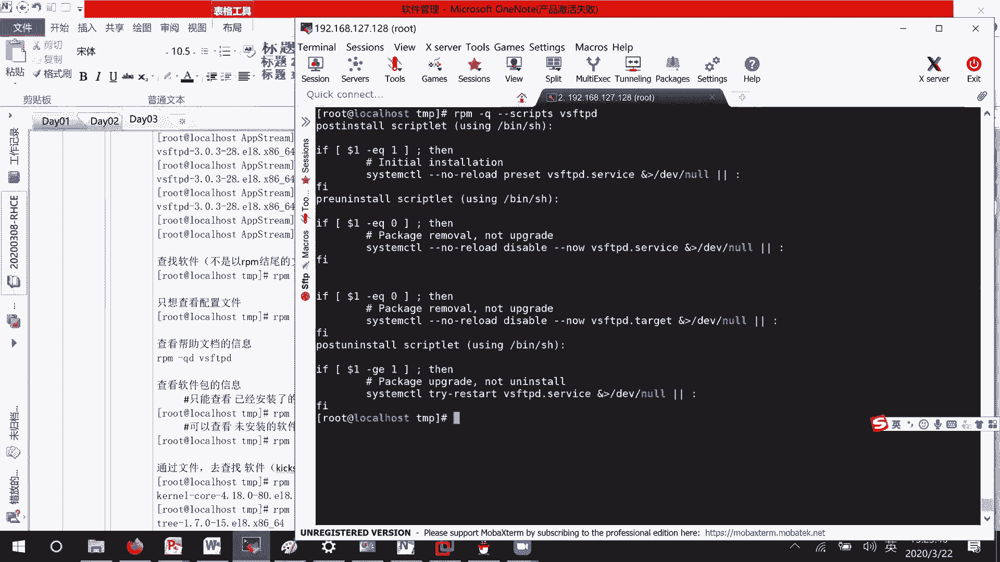
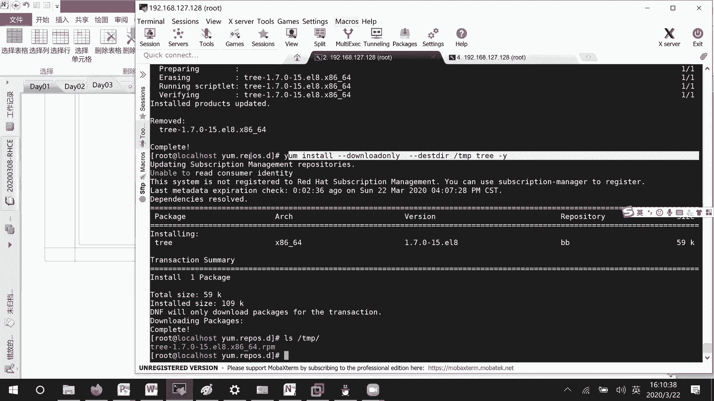
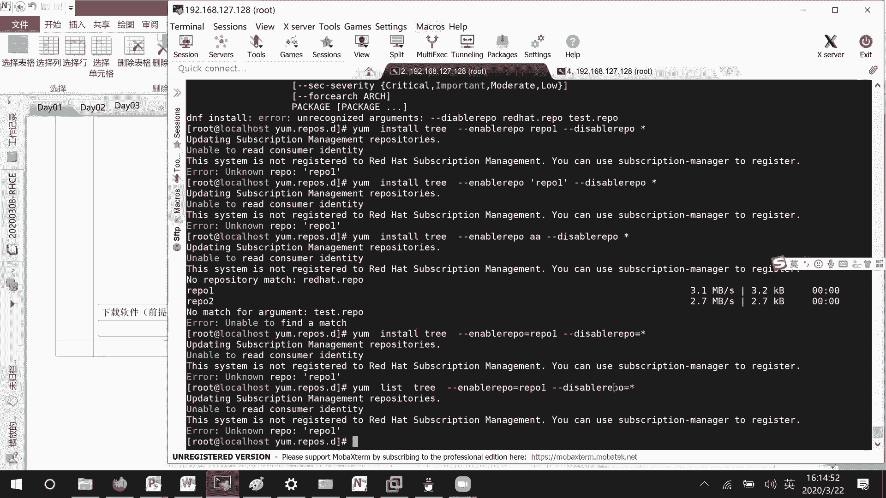

# 01 RHCE8.0视频教程【45课时】 - P8：20200322-RHCE-03_recv - 六竹书生6682 - BV1m84y1f7ss

就去上课哈，嗯刚才的话呢我们讲到了一个就是呃，查找这一块，有些人的话呢说自己可能查找查找不到，为什么这个的话呢不是你那边的一个原因啊，是因为是因为我上一次课，在跟你们去讲的时候呢。

事先是不是去安装了一个叫做vs FTP啊，主要的话呢跟你们说，怎么样去进行一个重启服务啊，或者停止服务啊，这些东西对不对，所以你看你你你这边的话呢就查不到那行。

然后这里的话呢下面我们这边来看一下，如果说我如果说我们我想要去安装，想去安装，我先先把它给卸载掉。

这里吧，我我先卸载。

你们到时候再去卸载好吧，卸载命令的话呢，就是rpm减一简易就卸载，卸载什么软件呢，我们平时在说卸载的时候是不是卸载QQ啊，而不会说QQ2点几点几或者什么windows点ex e吧，我也这样说。

我只会说卸载哪个软件后面呢，这里你跟上这个包的名字就可以了，不需要去跟上，这个就是说很长的一个文件的名字，这个一定要注意一下，知道吧，而且你在进行卸载的时候呢，你看有些人说在卸载的时候。

和目录有没有关系呢，我在根目录下有没有vs FTP d，这个文件或者什么东西啊，是不是没有，我们来看一下我能不能卸载成功啊，rpm减e vs FTP d，稍等一下，他的话呢没有任何回馈。

我这边的话呢再来查一下好吧，线束就没了，这个的话呢就表示我们卸载成功了好吧。

你们一定要注意，这里跟的是我们包的名字报名，而不是整个软件的名字，那行现在的话呢我们来进行一个诶，等一下，我放错地方，然后接下去的话呢，我们要讲的就是说如何去安装它。

这个安装的话呢比较简单，也就是说，首先你要去找到你的一个安装包的一个位置，在哪里，root h e l这个这里面，然后在CD a p p string里面的话呢，是不是有一个叫做package。

然后呢我们因为首先就是说要定位到这个包，你不进入目录也可以，我这边进入目录的话呢，主要就是说为了方便我们去得到那个软件吗，抗癌VSFTPD，然后接下去回车就可以了，他这边的话呢就对我们进行安装。

我这里没有去看一些过程，没有去看，然后我们来查询一下现在这款软件存不存在，它是存在着的对吧。

这里的话呢就有一个疑问，我们windows的话呢在安装的时候，比如说安装QQ，或者安装一些其他的小软件的时候，是不会让你去指定安装在哪里啊，他这边的话呢有让有问你安装在哪里吗，到底是安装在根目录啊。

还是安装在根目录下面的加目录里面啊，全都没说，因为像这个rpm包的话呢，是已经编译好的，它的一些呃文件存放到哪里呢，其实都已经内置好了，就是说软件安装，其实这个软件安装的话。

基本上就是涉及到就是说一些配置文件啊，或者什么文件的一个复制，对不对，然后像这种rpm包的话呢，路径已经内置好了，我们现在如果说想要去看一下它的路径的话呢，到底内置成怎么样子的，这个怎么样去看呢。

首先比如说我们还是来看这个，看另一个软件吗，好吧，看另一个软件，我这边CD到temp下面，我先把temp目录给清空掉，然后接下去的话呢copy mile root h e l8。

我从这个base os里面去考一个P的软件过来，这个G的话呢是干嘛呢，到时候一个目录下的文件啊，以这种叫做树形的一个结构，给我们去进行一个显示好吧，拷贝到当前位置。

你看这里的话呢是不是就有这么一款软件了，接下来，因为我们想要知道它内置到哪里去的话呢。

需要把这个rpm包把它给解压出来吧，稍等一下诶，这边的话呢，所以接下去要做的事情就是说解压这个rpm包。

我们这个rpm包的话呢和其他的一些软件包，它在解压的时候命令稍微有点不太一样，不太一样，解解压的命令叫什么呢，R p m 2c p i o，后面的话呢跟上你软件包的名字，然后竖线就是说管道符CPO。

你这个的话呢就跟上就好了，回车好吧。

这个的话呢是一个解压。

然后的话呢，我们来看一下它解压出来是什么东西呢，一个user目录，然后user目录的话呢，我们再来看一下l s temp，下面user这个解压出来肯定是脆的吧，它里面是不是有一个叫做bin啊。

sleep share这些东西啊。

这三个的话呢表示什么样的一个意思呢，我这里给你们来解释一下，我们在执行rpm命令的时候，他的话会怎么样呢，将rpm包当中这个叫做，澳洲，User un，他的话呢拷贝到哪里去呢。

拷贝到系统中user bin目录下，然后的话呢包单中user呃，LLB拷贝到我们根目录user l id下面，然后呢user叫做share，拷贝到我们的一个叫做user啊。

SHARE下面就是说这样子去拷贝那行，那既然我们都已经知道它的一个拷贝规则，是怎么样的吗，我们直接去拷贝一下看行不行好吧，叫做稍等一下。

这里我可不可以这样子啊，cocky user下面的所有文件把它放到哪里去，放到这个叫做根目录下面去，可以吗，就表示把这个user目录放到根目录下面去嘛，LS斜线user是不是这个目录本身就存在了。

如果说我把这我使用这个命令呢，copy减2F忘记跟拉二的话呢，就是哦目录以及目录下面东西F的话呢，强制拷贝吗，然后呢，这个叫做我想一下，user是不是拷贝到根目录下面去，他这个的意思的话呢。

是不是我把这个user下面的bean，bean里面的东西放到这个bean里面去啊，lib lib下面的东西放到这个lib下面去啊，如果存在的话，那就算了，不存在的话呢，去进行一个叫做替换吗，对不对。

这样子就是说其实现如果你先不拷贝的话，你看我给你先运行一下我们的一个脚本的，就是说嗯脚本是不是在这里哦，哦哦哦哦稍等哈，user叫做CD in，是不是就是这个脚本文件点，是不是也可以去进行一个显示。

比如说tree home下面的信息是不是也能显示，但是如果说我这样子叫做，我退到其他目录下，诶，这边是哦，我刚才没有拷贝吧，估计他把这个所有的目录都已经编译过去了，稍等哈，Tree home cd。

这款软件是已经装起来了吗，这个好像是已经装了，好像是已经装了，所以的话呢我们的效果达不到，我这边先把它给卸载掉好吧，rpm减一，你看啊，我现在的话呢就是说本身是不存啊，没有存在这个去软件嘛。

我比如说在根目录下去tree是不存在，如果说我CD到temp user bean下面，我这样子再去吃呢，是不是又可以了，因为的话呢像我们执行这个train命令的话，是不是就是去相应的环境变量下面去找啊。

你现在都已经明确的告诉他了，你的一个脚本在这里，他是不是也可以去运行对吧，所以这边的话呢。

这种方式其实你解压开来之后，直接就可以去用的，知道吧，然后还有一种方式，如果说但是这样子去使用的话呢，它很有局限性，你每一次在使用的时候呢，都需要去跟上，跟上完整的路径，那这个解决办法是什么呢。

也就是说你在环境变量中加上这个tree，它文件所在的目录，这不是一种方式，但是如果你解压在很多地方加很多个的话，那就比较麻烦一点，然后还有第二种方式呢，我能不能将这个文就说这些安装信息的话呢。

拷贝到原有的一些路径当中去，第二个将解压的信息好背的叫做系统，原先有的目录中，那这个拷贝的话呢我们来看一下。

就是copy减2F，我的话呢就把temp下面的user目录，拷贝到根目录下面去好吧，这个时候你再来看tree是不是就有了，它的话呢，就会把USB下面的东西放到user下面。

user lib下面的东西放到user lib上面，看到了吧，这样子去拷贝就可以了，把整个目录给移过去。

或者的话呢，你把里面的文件一个一个去移动也是可以的。

这个的话呢嗯不好的一个地方是什么呢，我们在查询的时候，他是查不到这个软件已经被安装，因为rpm当中就是说啊，不是通过rpm管理器来进行安装的吗，对不对，这就是它不好的地方，那好我这边的话呢，rpm杠。

she稍等一下，tap tap下面，因为我是移移动过来了嘛，我安装一下，你看现在又有了，就是说rpm的话呢，如果说你想让它识别到，你，再用这条命令去注册一下就可以了。

这个没有什么问题哈，好啊，我这边的话呢就是说它的一个安装原理，因为它的安装原理是这样子，你们后续的话呢，如果说有一些源码的包把它编译起来了之后呢，再进行打包，就知道为什么这样子就说为什么打包完了之后。

到时候就能用好吧，下面这里的话呢我们再来看一下，可能我们这个tree呀，或者就是vs FTP啊，是不是都安装完了，这边的话呢，我们可以看到它是不是有些bean文件，是不是有一些lib文件。

像我们的vs FTP在安装的时候，是不是会有一些配置文件，配置文件或者的话，那这个包本身是存储在哪里的呢，我想去查一下，好吧，现在继续回来讲查找，就是说查找软件包的位置，怎么去查。

他的查询命令的话呢也是一样的，杠q harry l l的话呢，就是说显示出某个那个叫做软件，它的一个安装路径，哦不对，这个rpm rpm减QL，这里的话比如说我以temp目录下的一个train哈。

ql tap目录下的，稍等一下，A b n p r p m q l l，然后这边不是这个she，诶啊诶我看一下哦，有就是说因为我这款税软件的话呢，它是不是本身已经安装起来了，你看在这里的话呢。

就会去说我这些软件的话呢，它安装在了哪里，然后像这个vs FTP，这里的话呢就是说它的所有文件存在哪里，都可以看到，好吧，这个，后面的话呢一定要知道真的是我们软件的名字，而不是软件包的一个名字。

就跟的是包名，真的是报名，就是说不是以rpm结尾的文件，他就是说跟一个苞米就可以了，那行这个的话呢是把他的所有信息，就是说所有位置都显示出来，如果说只想查看配置文件呢。

这个该怎么做呢，这个的话就rpm减QQ肯定是一样的，C就configuration吗，比如说G摄影没有配置文件，vs FTP它有配置文件在哪里呢，可能和加密相关的，或者的话呢FTP用户配置相关的。

这个就是用户列表，还有vs FTP的一些配置吗，所以用这个QC，可以去查看配置文件的一个位置。

然后还有的话呢，有时候我可能刚刚使用这款软件，不知道该怎么用，就是说像一些配置文件不知道该怎么用吗，如果说想要去查看一下它的一个，配置文档的一个位置呢，QD这里面的话呢。

就是它的一些配置文档相关的一个信息，看到了吧，这根据自己的需求。

比如说嗯vs FTP configure怎么样去配的好吧。

查看帮助文档的信息，然后接下去的话呢我们来看一下，比如说我想要去看一下包的一个信息。

因为我可能现在就说安装起来了，但是这个包的话呢，它的版本是怎么样子，我可能有点忘记掉了嘛，q i information吗，比如说vs f t t d，你看这版本release是什么架构。

我什么时候去安装的，他这里都写的很明白。

都写得很明白，看软件包的信息。

所以这里的话呢你们都可以去看一下，就说我没有把选项给完全都讲掉了，就减help，然后上面这里的话呢嗯稍等一下，不是这个这个是install upgrade，它这里的一个使用。

你看Q和Q结合的有哪些configure，还有一些document的一些文件，还有一些证书相关的一些信息，还有的话呢列出所有的包吗，对不对，都可以去看哈，那好有时候的话呢还有一个什么呢。

叫做，我可能因为就是说在进行一些系统恢复的时候。

LS叫做，我们知道这个不成目录是不是非常的关键，那有时候一不小心手的话呢，抖了一下，把这个叫做VMLINUX这个文件给删了，那怎么办，那怎么样去生成，生成也不会生成，对不对，所以的话呢。

我们可以去旁边找一台好一点的机器吗。

通过文件去查找，叫做软件。

通过某一个文件去查找有哪个软件来产生的，那这个就rpm减QF，后面的话呢就跟上，比如说路程目录下面的VMLINUX，4。1。18，谁装起来的呢，你看这就出来了，是这个文件，或者的话呢我们去查一下。

叫做根目录下user slip，C这个文件哎，等一下BTT这个文件它是由谁安装起来的，它是由tree安装起来的吗，所以这个的话呢。

可以去根据文件去进行一个查找，这个的话呢什么时候用的蛮多的呢，你们那个quick start有没有做过，take a start的话呢，可能有时候需要一些引导文件或者怎么样，我是不是可以通过这种方式。

比如说我需要什么文件去查找一下，是用哪个软件产生的，或者的话呢就是说系统恢复的时候，像我bot下面的一些文件被删了，或者的话呢，就是说什么其他的一些重要的软件被删了，我的话呢。

需要知道这些文件是用哪些软件产生的，我把他的信息给拷贝过来，或者重新去装一下嘛，对吧，这没问题，然后接下去的话呢，如果说我想要知道通过你去查找软件了，去查找软件，那这个查找方式的话呢。

是不是其实主要就是说用witch后面跟上命令，是不是就知道这个命令的路径在哪里，然后的话呢再去rpm q f一下是不是就可以了。

但是这个的话呢就分两步做，看过去不太高端，你看QFESC下面的话呢有个波浪线对吧，你什么东西都不按，就按一下它，比如说我这边which sheep，再按一下它回车，他就可以，这什么意思呢。

这个就是说先执行这一块的东西，执行结果的话呢，我再来执行这整条命令嘛，这个叫做反引号吧，我们可以这样叫我叫做反引号好吧。

这个的话呢不是我们普通的引号，就是ESC下面的键，这个的话呢没什么样的一个问题。

我看一下这条命令，再给你看一下，QIT叫做tab下面的注释，就比如说像有时候，如果说你软件还没有安装的时候，你想要去看一些信息该怎么办呢，可以用这个QIPQIP，我看一下啊，QIQI的话呢是。

诶我刚才查找信哦，QI这里QIQI的话呢。

我们跟上的是一个叫做软件包的一个名字吗，如果说等一下，然后我先把它给卸载掉一个，如果说你看这边我这样子，他的话呢是不是就是说看不到哦，这里看得到，对不对，看得到，然后现在的话呢如果说我这个P不要。

屁股要，那也就是说只能这样子叫做temp，下面一个tree，对不对，是在开门下面哦，没事哈，这里我主要想说什么呢，如果说像这个QI这个命令呢，我们只能去查看已经安装的一些软件，如果说有一个软软件包。

它还没有安装，还没有产生软件，如果我想要去看一些详细信息呢，你可以跟跟一个P他的话呢。

会自动的去把这个软件包里面的信息的话，给你们去提取出来，去进行一个显示，好吧，这个的话呢，就是说可以查看未安装的软件包的信息，上面，这里的话呢就是说只能查看，已经安装了的软件信息，知道吧。

这就是之间的一个区别。

然后的话呢，如果说像你想要去看一些他的一个脚本文件嘛，因为我们群里面人好像都太厉害了，Come to scrap，后面的话呢你去跟上，想要去看哪个软件的脚本文件，这里他的一些信息哈。

启动的一些程序等一下哈。

诶为什么我看不到那个聊天界面了呢，稍等一下哦，看到了还没有安装的rpm包怎么去改，这个的话呢，你就把它解压出来，然后还没有安装的安装默认路径怎么改，那你把它解压出来之后，自己再去打包一遍也可以呀。

还有一种情况的话，你直接就是自己去复制拷贝不就也可以吗，对不对，自己直接去复制拷贝吗，分钟我这边就休息一下哈，刚才就讲了查找安装，然后的话呢卸载我也稍微讲了一下，卸载没有什么很重要的信息。

可以讲就是一个E嘛，去把它给移除掉移除掉，然后接下去的话呢我们来看一下哈，就说怎么样去更新，等一下的话呢。

我们再去讲一些就是说验证方面的东西，它的一个更新的话，就比如说我现在有一个嗯，需要升到一个比较高的一个版本吗，那就是YM哦，不是INB，不是YM，就是说这个rpm减大U。

后面的话呢你再跟上这个软件的名字，如果说你版本没有发生变化的话呢，人家就不会给你装，如果说有发生变化的话，他就会给你去装。

明白吗，好这里的话呢我们来看一下，就更新更新的话，它会针对于两种不同的，就是说不同类型的软件，它会有不一样的一个做法，如果说你这个软件是一些内核软件的话，或者如果说你这个软件是一个，普通服务软件的话。

他们更新会怎么样呢，普通服务软件是怎么样的，先卸载新版本，再安装老版本，他的话呢就是说两个版本不能共存，就是说正常的一个情况下，然后像这个内核软件呢，就是说它是先安装老版本。

等你系统正常启动了之后的话呢，他会把一些就是嗯老版本的信息的话，它其实也是会放在那里的，然后除非你自己把它移除掉，就是说不要掉吗，好吧，他这个的话哦不对，先安装新版本，就是说新老版本的话呢。

可以去共存的，为什么会这样子呢，因为就是说如果你是一个叫做普通的服务软件，真不行，崩溃了之后的话，你再装嘛，如果内核软件你崩溃了呢，整个系统是不是就不能用啊，是不是就不能用好哈。

那这个的话呢就是更新方面是这样子的，更新方面是这样子的，我们这边休息一下吧，休息10分钟，然后接下去继续讲好吧，接下去的话呢等一下啊，我们来看一下，刚才的话呢我们都是一些正常的去进行安装吗。

然后的话呢在安装的时候，有一个什么样的一个问题呢，哦有些同学可能注意到了，这边就warning什么什么什么啊，header啊，签名KD的话呢是这个没有key吗，他这个的话呢在软件发布的时候。

他都会对软件进行一个数字签名的这个签名嘛，对不对，这个签名的话呢什么意思呢，就表示这个东西是由我这家公司来进行呃，生成发布的，如果说这个就相当于我们上次讲的SSH，我把它的一个里面的摘要信息的话呢。

我会去提取出来，然后呢我使用我的一个签名，其实也就是一个密钥对它进行一个加密嘛，然后呢，接下去其他人如果说想要把这个软件下载下来，就是说怕被别人改过了，或者怎么样可以用，他就说官方携带的那个叫做公钥嘛。

对这个进行验证，看一下能不能解开，如果说能解开的话，那我就认为这个软件是官方发布的吗，如果不能解开的话呢，就认为不是官方发布的吗，因为很多人会去把一些代码给改掉，里面比如说注入一些非法的信息啊。

那在企业当中安装是不是蛮恐怖的对吧，这边的话呢我们先来检查一下刚才那个加密。

应该有听到吧，加密，啊这里的话呢就是说数数字签名，那首先的话呢我们要先来看一下，我们这里它的一个公钥的话呢。

有没有存在叫做rpm减QA查询嘛，GRAP什么东西呢，pub key有没有，然后这边的话呢发现没有什么意思呢，也就是说我这东西还没有导入诶，这个东西的话呢不是去安装的，就是说去进行一个导入就可以了。

知道吧，然后的话呢怎么样去导入呢，R p m import，在我们e p c pk i下面，Rpm g p g g pg，有个叫做rpm red hat release的一个文件，这就是公钥。

这个的话你们可以去记一下这个路径在哪里，因为就是说之前在红帽期考试当中的话呢，他给了你们一个叫做亚美元，你直接来安装就可以了，但是他没有去指定它的一个公钥的一个位置。

然后呢会导致我们软件一直安装不成功嘛，那你这边的话呢，要知道怎么样去导入咱们的一个公钥信息，知道吗，就就在考试我再说一遍啊。

不知道这个新版本会不会有，但是老版本呢我知道的信息先跟你们说一下，说一下嘛，就之前的话呢他给你们直接提供了一个亚目源。

你们的话呢就是说添加亚美元，就是说啊YM稍等啊，要么呃我找一下，诶我怎么现在找不到了，呃我想一下那条命令我给忘了，应该不是disable，不是，嗯怎么不是，这不是，I know this for。

这个的话呢，我给忘了，在一个秘密，好像是呜呼，别忘了，那到时候再跟你们说吧，他反正就是说给了你一个地址，你的话呢去进行一个添加就可以了，不行，我得找一下，我这个给忘了，稍等一下，很快，嗯嗯猫咪猫咪。

啊这个项目，诶这里的话估计得去安装一下，它没有安装起来，所以就是说找不到有一个叫做亚目configure manager，到时候的话呢，就是说直接把他的一个地址跟在后面，我们就可以安装起来的。

然后这个样员的话呢他需要进行一个认证，但是的话呢公钥信息没有导进去，所以导致之前在考试的时候，很多人就说不知道有这个特性嘛，软件一直安装不起来，就使用那个什么下载到本地啊，再进行安装就比较慢。

所以你们到时候的话呢。

样源发现都已经加载成功了，就是不能安装的话，一定要考虑认证公钥这一块的一个信息，知道吧，那好现在这里的话呢，咱们已经导入进去了吗，现在比如说我们来看一下。

先去验证一下这个软件包好，就是说有没有被修改过吗，rpm杠QA，我看一下刚才那个tree我删了没有，she还没还没卸载，进来了，其实卸不卸载呢关系不大的，关系不大的，我这边的话呢来验证一下。

因为刚才已经有功丹材功效已经导进来了吗，减大写的K，然后这里的话呢我们再去跟一下叫做run middle，Root h e l p p package，叫做哦不对，Base os package。

他的话呢叫做treat回车，然后这里的话呢是不是显示一个OK啊，如果说这个文件是真的被人篡改过的，那它就不再是OK了，知道吧，那现在的话呢我我们来安装一下YMJI，叫做这个软件回车，还有没有和刚才一样。

提示什么签名的一些问题啊，他就没有了吗，知道吧，所以这边的话呢你可以先这样子，就是说呃先使用K去验证一下。

然后再进行安装。

这样子的话就不会有问题了，好吧，有些人的话呢如果说想要去看一下详细的过程，那你这里就说IV吗，它就可以显示进度，就是说到了哪一个步骤，可能就是说先检验再准备，然后再进行一个安装对吧。

然后还有一个的话呢叫做HH的话呢，信息就是说进度条给你也给显示出来，看到了吧，所以这个就是我们的一个IZH经常会用到的，但是有时候的话呢你是直接使用一个I的也有，但是就是说过程看不到吗，好吧。

这个是我们2pm当中所有的一个信息，所有的信息。

然后现在的话呢我们来看一下这个叫做亚姆园，怎么样去进行一个安装，像我们说的亚目源的话呢，它是不是有一个叫做客户端和服务器的，一个概念，我现在今天的话呢我就讲一个本地样子，原先下节课的话呢再去跟你们讲啊。

客户端和服务器的一个亚目园，这啊，这样子的话呢，就是说下节课还可以起来复习一下嘛，好吧，本地亚目原是什么意思呢，也就是说在我这台电脑上，我把某个目录共享出来，比如说里面存放了很多软件。

然后我本地的话呢再写一个配置文件，去了解一下到底是在本地的哪个目录上面呢，比如说在这个A目录上面嘛，那到时候的话呢我就都从这边去进行一个下载，可以吧，所以你看一下像这种模型的话呢。

我们要做的事情有哪几个，第一个是不是把目录共享出来，第二个是不是要写一个配置文件，告诉自己去哪个目录下面去进行一个下载，对不对，所以这两个步骤哈，第一个的话呢就是说创建目录零。

然后的话呢但是这个目录创建出来是不是空了，我们的话呢想办法让目录里面有文件，然后接下去第三个，我这边的话呢告诉自己去哪个，就说去自己本地的哪个目录中下载软件好吧。

下面这里的话呢就是安装软件怎么去安装好吧。

这边就比如说我这边创建一个目录，在根目录下吧，叫做TKEDU好吧，你们随便创建什么都可以，但是现在我们来看一下CDTKEDU里面。

东西的话呢，就是说是不是没有任何东西啊，上节课的话呢，我们就说第一节课的时候，应该有提到那个叫做挂载的概念，挂载的话什么意思啊，是不是就是说呃像我里面的光盘，能不能逻辑的映射到我这个TKEDU。

也就是说来访问这个TKEDU的时候呢，就相当于访问那个光盘吗，这个东西的话呢称之为挂载，后面会去讲具体怎么样去进行挂载，什么永久挂载，临时挂载，我们现在的话呢就讲一个临时挂载，也就是说你关机了之后。

下次开机就没了，如果想这个目录下面还有东西呢，你这一步再去执行一下，能明白吗，所以下节课不要再问我为什么我里面东西没了，因为就是说他这个关机之后就没了。

除非你重新去挂载一遍好吧，这个怎么去挂载呢，mount首先要有这个条目，你的话呢可以去写缩写，比如说d vs20，写前面这个也可以吗，挂载到哪里去呢，我比如说挂载到TKEDU嘛，你看，稍等一下。

他这个的话呢就是说你要退出来，再进入一下才能去看到，就这个不仅仅是八版本会这样子，其他版本也会是这样子好吧。

这里的一个主要命令的话，我删掉一些东西，因为这些东西没用，这里的话呢主要的一个命令就是mt，然后的话呢验证情况就是CD进去之后。

或者直接LSTKEDU的话呢，有信息，还有一种呢，DF杠H，可以发现刚才的条目，变成我现在的一个条目信息吗，好吧那好现在的话呢我们做好了。

接下去的话呢要去做第三步，告诉自己给自己写配置文件去哪里去下载呢。

你看啊它在特定的目录下面etc ym点reporters，点D目录下面，我这个AA是我自己创建的，我先删除掉，你们进去的话呢，应该都有一个叫做read heat的一个文件。

对不对，他这个的话呢。

和之前的版本是有比较大的差别的，之前的版本的话呢。

它有一个配置文件里面的话呢就写了。

可能去红帽的官网去进行一个下载，但是现在这个配置文件呢它比较低调了哈，都是一些注释信息告诉你，这个文这个信息的话呢，你可以怎么样去进行一个写操作吗，就说怎么样去查询，怎样去刷新你这边新添加的东西。

我们这边不改他的，比如说我现在重新来创建一个VM啊，这里比如说叫做test点IPO好吧，这边的话呢有一个要求。

前面的文件你叫什么名字没有任何关系，但是后面一定要以点REPU结尾，虽然说呃在红帽单中的话呢，它的后缀名没有任何含义吗，但是在这里的话呢，服务去识别的时候，它是需要有一个标志性的信息。

就是我们的RIPO，你不能写错的，一定要写IP，然后接下来的话呢。

我们来看一下里面要写什么东西，里面的内容顺序你可以去调换，但是的话呢有一些基础的信息千万不能漏掉，首先第一个他的一个比如说市场是什么东西，大标题嘛，然后接下去name这个rpm的话呢。

呃它的一个名字叫什么rpm，它的一个名字叫什么啊，比如说我这个名字的话呢叫做，IPO1吧好吧，最好这边的话呢不要去使用空格，空格的话呢打一个引号下划线也是可以的哈。

然后接下去我就要告诉自己去哪里查找文件base，Url，base ui等于什么。

我刚才的话呢，是不是在本地目录的一个叫做TKEDU下面。

它这个大小写是敏感的，而且就是说第一次下课之后呢，有有人问我这个copy，因为我一直在说copy嘛，他说为什么这条命令不行，他这个命令是非常严格的，就是说这个命令的话呢是不存在的，它只存在CP这条命令。

所以他对命令的要求比较高，然后你看这个TKEDU的话呢，是不是我本地的一个目录啊，那我本地区进行一个访问的时候，比如说我去访问互联网，是不是HTTP冒号斜线斜线，那本地去访问的时候呢。

他其实也有个协议叫做fire协议，知道吧，冒号斜线斜线，所以我们在前面的话呢，把fire冒号斜线斜线给加上去，所以你们看到这边是不是就有三个斜线啊，其中前面两个斜线是和fire去组成协议的。

后面这个斜线呢是和TKEDU，组成一个目录的，知道吧，但是的话呢现在直接这样子，它是不能成功的，以前我们写到这里过就行了，但是现在不能成功，为什么呢，因为在这里面的话呢。

它有一个叫做a p p string和这个叫做base os，有这两个文件，主要的话呢，它是要去识别这个叫做ipo data的一个文件，这个文件的话呢里面记录了什么东西呢。

我们刚才如果说在本地下载了一个A软件，A在安装的时候安装到一半停止了，他说需要B软件，你你怎么做，你的话呢是不是上网把B软件下载下来，安装完了之后再去安装A，这个是我们RPM的方式，就是说需要什么。

等安装的时候呢，它报错了，我们再去下载，这样呢我在请求A软件的时候，他会来查看这个文件，他的话呢这个文件其实是做了一个解析关系，他的话看到就是说A软件的话呢，需要B软件的一个支持，那怎么样呢。

我这个YM直接就会把B软件下载下来，帮你去安装起来，然后再去安装A软件，这个前提是什么呢，B软件在我这个package里面存在，如果不存在的话，这个直接也是不能，就是说也是不能直接去实现的，明白吗。

这能明白吗，所以这里的话呢要注意一下，比如说我这边要安装的是一个叫做a p p string，下面的东西，那这边还要去跟上这一层级目录，因为在这一层级目录下面，还有一个叫做IPODATA的一个信息吗。

然后现在比如说我们先把一个叫做，他这里和rpm一样，都需要去校验的，比如说我这边把校验的信息给关了好吧，jpg check它等于零，也就是说我不叫验不叫验，这个能看明白吗。

就这四行信息。

然后这里的话呢你看保存退出手工的，去检查一下ym reporter list，稍等一下，你看这里的话呢，是不是就有一个id是AA的，名字叫做IPO1的，下面有四千六百三七十二个软件。

pk e d u叫做app string，稍等一下，等一下IOS的，放TTKEDUPP，String package，这边怎么没有显示出来呢，你看这下面的话呢，它差不多有4900多个包。

但有些包的话呢可能就是说不是拿来安装的，这也是正常吧，就这里有4760多个，如果说我这边去改一下，改成一个贝斯，你看像这里的话呢，它是不是里面还有1000多个包，它没有导进来。

因为我这个AA的话呢只管理了一个叫做app string，它下面的书包没有去管理这个贝斯OS下面的包，能明白吗，所以这也要稍微注意一下，这个叫做ym reporter list的话。

我们可以去检查，亚木园是否安装成功，然后现在的话呢因为这个只管理的一个目录嘛，如果我这个叫做贝斯OS的话呢，他也想去添加进去，该怎么办，也想去添加进去。

下面的话呢是不是再去跟上那个信息就可以了，你看vim test ipo下面这边的话呢，我们再去跟马，下面这里的话呢啊比如说再写一个名字叫做BB，然后呢name比如说叫做IPO2base url。

就等于fire冒号斜线斜线TKEDU，冒号BSEOS哎，等一下OS，然后这里j p g check，他的话呢就等于零嘛，冒号WQ，这个时候的话呢我们再来ym reporter list一下。

是不是就存在两个IPO了，其实这两个文件的话呢你可以分开去写，也就是说这个test ipo这块呢，这里你可以单独再去编辑一个，比如说AA点IPO或者TK点IPO都可以的，你的话呢也可以写在一个文件当中。

然后的话呢叫不同名字去进行标识嘛，你看这样子，现在的话呢上面这个其实是管理我们的APP，下面这个的话呢是去管理我们的base os，这个软件包，这个能理解吗，然后的话呢他查找软件。

它的一个顺序是怎么样子的呢，首先他会去我们的第一个IPO里面去查找，如果说查找不到了，那好再来第二个软件包里面去查找，查找到了就安装，查找不到的话，那我就不安装了，知道吧，你看ym in store。

比如说she回车，他这里的话就显示我这个东西已经安装了吗。

所以他就不让我去安装了，这边的话呢我们来看一下如何去安装哈，ym in store后面跟上软件的名字就可以了，你都不需要再去找目录了，但是的话呢这里软件这么多，我也不可能把所有的软件都给记住吧。

这边的话呢我们来看一下查找软件，怎么样去进行一个查找好吧。

YM有一个命令叫做list，我可能很多信息都不记得了，但是只记得中间可能有个叫做FTP回车，你看这边的话呢就给我们去搜索出来了，上面这部分install表示我已经安装起来了的。

下面这里的话呢就是说一些可用的一些包嘛，有些是从AA里面来的，因为这个tf TP boot的话呢，就是启动的时候一些引导文件看到了吧，所以这个list的话呢就是模糊查找。

然后有些人的话呢应该还知道另一种查找方式，是不是有个叫做sir去吧。

这个install package表示这下面这些软件都已经装了，AVALUABLE表示下面这数学软件都还没有去安装，明白吗，好ym search，比如说叫做FTP，他这里也可以去查找到。

他这里的话呢就是说不仅仅从上面，这也就是说从名字方面去进行的一个匹配，下面这里的话呢还有从他的一些简介里面，他也有去匹配啊，下面这里呢就匹配一下名字的有哪些，然后这里呢就是说一些简介。

就是说上面这里的话呢是一个概要信息，所有的都列出来，下面这里的话呢分段从名字当中匹配的，然后的话呢还有就是说从简介里面去匹配的吗，看到了吧，就这样子好吧，然后其实你们可以看到这，这个的话能像什么T啊。

FTP啊，在这边的话呢也有查询出来，在这儿对吧好吧，所以就是说像search也好，list也好，都可以去用，我比较常用的话呢是一个叫做list的一个命令。

因为search查询出来的东西太多了，然后这边的话呢我先把它给卸载掉好吧。

YM这里的话呢remove也是可以的，eraser擦除也是可以的，比如说tree，我想要把它给删除掉，直接跟一个tree就可以了，然后的话呢你看我在进移稍等，我在进移除的时候。

他这边会去解析一下依赖关系，然后如果说有些软件只只依赖于他的那呢，就是说也会随之去卸载掉，如果说不仅仅依赖于他的话，他不会去卸载掉吧，下面我问你要不要卸载，Why，我确定要卸载，好。

这个时候呢你看我在ym list是不是就没有了呃，变成一个AVALUABLE的一个状态吗，知道吧，然后接下去的话呢，我们再来安装一下ym in store tree，他在安装的过程当中的话呢。

首先会去解析依赖关系，也就是说这款软件和谁有关系，然后接下去的话呢啊再进行一个分析，下面这里的话呢就问你装不装，你输入Y的话呢就装，输入N的话就不安装，每一次因为一条命令。

我可能到时候会去安装这多条来都多个命令吗，每次带都来问我的话呢，是不是特别的麻烦，我后面的话呢可以去跟上一个选项，叫什么选项呢，叫做减Y的一个选项，表示我确定要进行安装，那好这样子的话。

你看他解析完依赖关系之后怎么办呢，直接就帮我们准备的去安装了吗，就是不需要去问你，那相同的，如果说我这款软件不想要了，想要去卸载呢，刚才是不是也问我要不要去卸载减Y，我表示我确定要卸载。

他是不是就没有问我了，所以这两条命令一条的话呢。

呃ree install减Y。

还有一种的话呢，就是啊eraser擦除或者remove的话都可以。

如果说后面的话呢。

你有一些软件需要更新的，那也就是说ym update嘛，然后后面呢比如说跟上去，但是你要注意点啊，像这个tree的话，它本身就不存在的话。

你是不能去update的，除非说你已经存在了，我才能去更新吗，对不对，减Y的话呢，表示我强制的确认要进行一个更新哦，进行一个更新，他这个叫做亚木这一块的话，安装啊，卸载我就不讲那么详细了，就这样子去讲。

然后接下去的话呢，就比如说我现在可能想要去进行验证怎么办。

对不对，像刚才这一块的话呢，它没有进行校验，主要是我这个文件当中哈，VIM叫做test IP o，这个不是写了一吗，写了零吗，比如说我把它改成一好吧，保存退出一下，这个讲完就好了哈。

这里啊啊就是说验验证。

把它改成一，我们来看一下线，还是不是这么方便的去装软件呢，我按了一下tab键，它自动补全，诶我看一下他这边是不是还没有反应哦，我知道了，我刚才的话呢，因为直接把那个叫做he的话呢。

直接去进行一个导入了对吧，所以他这边的话呢就直接可以了。

因为我前面这里的话呢，已经做了一个叫做2pm import的这个操作，所以的话呢嗯他这边就可以直接去进行验证了，因为我这个系统当中本身就已经有这个了嘛，除非的话呢你们到时候可以去试一下。

把它给卸载掉好吧，然后的话呢还有一种方法是怎么样呢。

如果说你这边的话呢没有去导入的话，那就这里vim test在下面，这里的话呢需要补一个命令叫做JPG啊，Gp 78key，稍等一下，Jpg ke，然后的话呢这边就是说等于本地的文件协议，下面的哪里呢。

他这个的话呢是不是就在我们的etc pk i，稍等一下，P k i，然后r p m g p g release，就是说这个文件吗，你的话呢，就是说直接把这个文件写在后面就可以了。

如果说刚才没有去导入的话，那么你在这边的话呢加一行这个信息，如果已经导入的话呢，那这行信息就不用去加了，明白吗，验证验证，好吧。

验证的话呢两种方式，这边方式一两边都加入这一行信息，但是如果有多个项目源的话呢，你要去加入多次方式二，怎么样去做呢，就是和刚才这个是一模一样的，你的话呢去把那个文件进行一个import。

import到系统当中去就可以了，这样子的话呢，就是说对所有的样源我们都能生效，都能生效好吧，这个没什么问题啊，然后下面这里的话呢我们来看一下YM减减help。

它有很多选项，我们做了这么久，就好像安装了，就是说从互联网上去安装了FTP啊，或者去安装了一个叫做，tree呀，软件包有没有下载到本地当中来啊，他的话呢没有下载到本地当中来，他就下到缓存当中去。

安装完了之后，或者缓存满了之后呢，就会把这个软件给删了，知道吧，所以这边有时候的话，你发现一直就说使用YM一直报错的时候，你可以怎么样呢，ym clean on清一下缓存。

然后在ym make catch加载一下，重新加载一下，这个好吧，就是说可以先把它clean all一下，缓存删清除一下，然后这里的话呢再去make一下嘛，make一个空间吗行吧。

下面这里的话呢咱们再来看一个东西啊，那如果说我现在希望它能下载到本地，这该怎么办呢，就是说在之前版本当中好像是已经没有了，这边我们来看一下现版本哈，ym in store它也是一样的。

只是说我跟上这个选项叫做download only，然后后面的话呢再去写上，下载到哪个目录当中去，比如说我下载到这个temp目录下面去好吧，安装一个软件，比如说什么软件呢，HTTP软件太大了，稍等一下。

啊我把这个tab目录先清空，没东西，我的话呢这边比如说去安装一个tree好吧，杠Y嗯，他这边的话呢就是说呃已经安装了，我看它有没有下载下来哈，他这边的话呢没有下载成功，像之前的版本的话呢，它可以下载。

好像之前我们在查的时候，好像说这个功能慢慢的它也不支持了，也直接就不支持了，就是说不能让你去加载到本地，不能让你去加载到本地，就是说如果有兴趣的同学可以去试一下，这个的话呢可以怎么样去加载到本地好吧。

我再来试一个看哈，Download only，稍等一下，ym download a现在为什么看不到了，要么要么download only dest dr，这个没有问题啊，这个的话呢。

和我们这个软件本身已经存在的话呢，是没什么关系了，我先卸载掉再来试一下，这个版本他那个叫做六版本的时候，好像七版本的时候，我之前测试了很多次，他都不能成功，然后像现在的话呢。

就是我们的一个就是这个叫做八版本当中，它支持了，但是有个前提是什么呢，可能你这个软件要事先没有事，就说事先没有安装，然后的话呢它才可以去进行一个下载哈。

这里下载一，前提的话呢就是软件未安装好吧，那这样子的话呢指定一个目录就可以了。

然后接下去我再讲最后一条命令，真的最后一条命令，你看我们这个ym reporter list，他的话呢是不是有两个亚目源啊，有时候的话呢，我可能会从多个站点上面去添加亚目原，那有没有办法。

就是说只让一个亚目员生效，其他亚目源泉，就是说现在先不复工作呢，不工作呢，要么比如说我这边要install she好吧，等一下哈睡，然后这边的话呢我比如说嗯减减，我不认识到list也可以啊，引到吧。

这里的话呢就点点disable IP o，把哪个呢，把所有的都禁用掉，减减enable e n a b lee ipo谁呢，我就把IP1给起来，只是说像我们这边的话呢。

in apple r e p o等于REPO1，我看一下，To unknown i p1，诶我没写错呀，稍等一下，这个应该是没有写错哦，哦诶这里啊，enable e n a b l e没写错吗。

YM减减哦不对，减减就不要了，这个比如说叫做IPO1，然后呢减减disable ipo信号，然后in store，比如说T，我往前面放，往前面放，呃argument di哦，等一下少了个S。

它这个好像在识别的时候怎么有问题呢，ENABLEIPO没有问题啊，A a，我这明明写的没有问题，为什么他一直报错呢，其实这边的话呢我去用等号，它是没有问题的，Ip1，使用某个亚目源，然后下面这里的话呢。

就是说禁止所有的样本源嘛，他这边一直报错哈，太神奇了，他这边一直就是这个IPO是报错的，就说使用这条命令的话是没有问题的，这条命令什么意思呢，把所有的样本园都关闭了，我的话呢就让一个亚目员起来去工作。

或者的话呢，你也可以，就是说把把某个特定的样本源给禁用掉，为什么会有这种场景呢，可能就是说多个站点，因为我有时候为了工作方面加载了很多站点嘛，但是有一个站点的话呢，它其他软件虽然挺好的。

但某个软件版本太低了，我怕他有影响吗，我这样子的话呢，就是说去把某一个站点给关了，或者就是说把所有的站点关了，就用某目前我觉得比较合适的一个，亚美园的一个站点吗，好吧这个你们可以到时候再去试一下。

我看一下是怎么回事儿，叫做呃关闭和禁用和启用亚目源，可以用类似的mini，但是的话呢像这个我们是不是只能临时性的。

就是说一次性的去生效吗，可能在工作当中的话呢，我发现有一个样园真的很不好，最近最近很不好，我的话呢怎么办呢，我可以全局把它一直给关闭掉，等于零，等他好了之后，我再给他一嘛，那你看一下。

为什么我之前没有写什么enable的时候，它也可以，因为系统默认情况下就是一个一零的话呢，就禁用，你看要么reporter list，现在查的时候是不是就没有零这个设备啊。

就没有那个叫做IPO2这个设备，而这个样源只剩下IPO1吗，好吧，这个就是说永久的把它给禁用掉，像刚才那个的话呢。

只是说临时的，然后的话呢这里要注意一下，默认，不写的话叫做是启动的好吧，这里没什么问题啊，然后下次课的话呢，我们会去介绍，比如说两台设备它怎么样去进行一个亚美园，还有的话呢。

可能在互联网上去找几个亚目园的地址过来，让你们去安装一下嘛，好吧，今天内容的话呢主要是这些，我到时候的话呢单引号可以吗。

其实之前的话连引号都没有都没关系的，它也是有问题，对吧，这个到时候再看吧。

