# Linux运维全套培训课程：P100：Docker-5.docker容器数据卷 📦


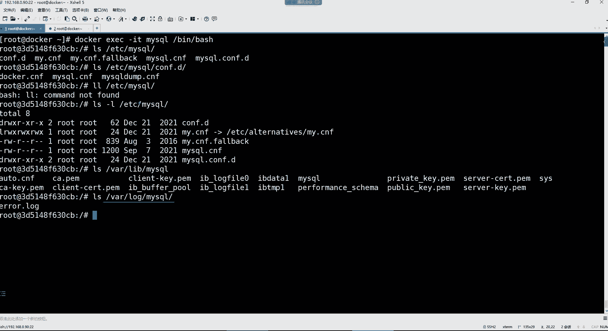

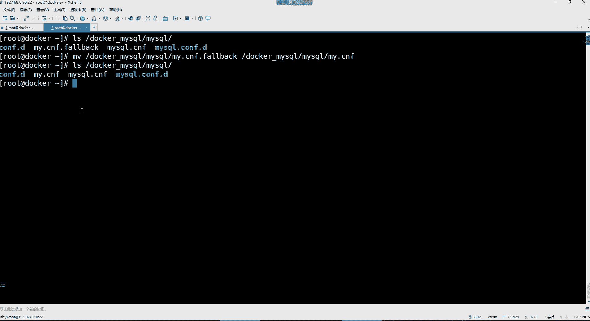

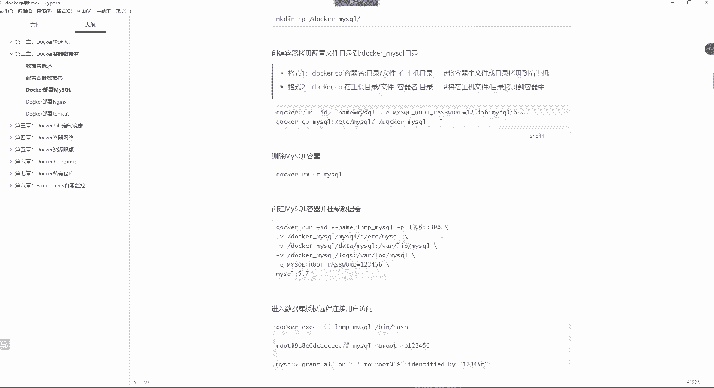

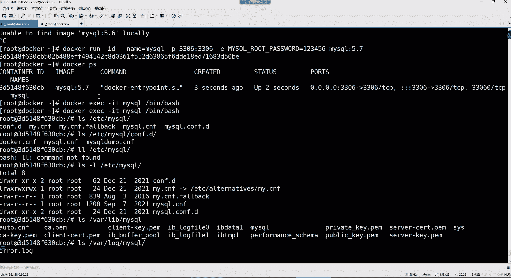


在本节课中，我们将学习Docker容器数据卷的核心概念与实践。数据卷是Docker用于实现容器数据持久化和共享的关键技术。我们将通过部署MySQL、Nginx和Tomcat三个常见服务，来掌握如何利用数据卷管理配置文件、日志和应用程序数据，确保容器数据不丢失且易于管理。

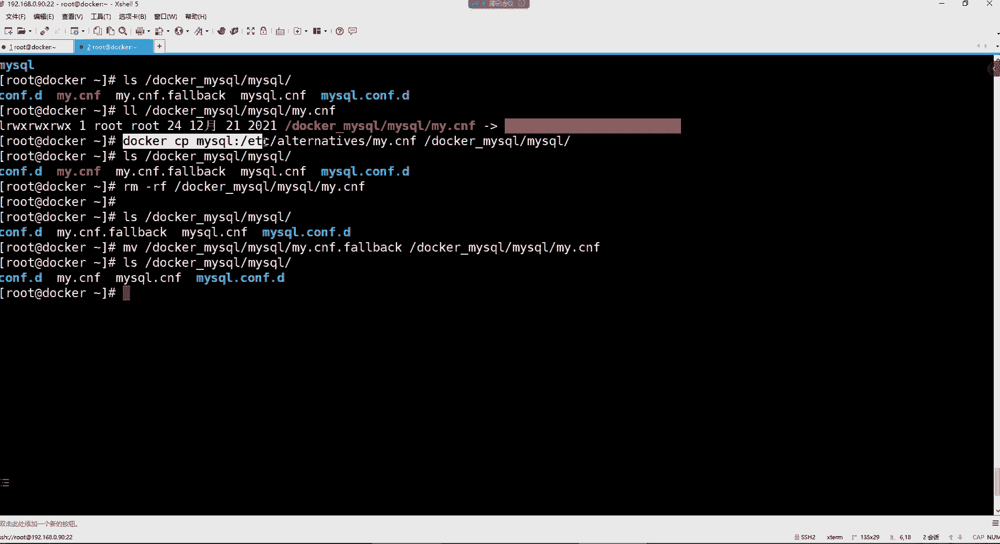


## 数据卷核心概念与挂载原理 🔧


上一节我们介绍了Docker的基本操作，本节中我们来看看如何让容器内的数据持久化保存。

Docker容器默认情况下，其内部产生的数据（如配置文件、数据库文件、日志）会随着容器的删除而丢失。为了解决这个问题，Docker提供了**数据卷（Volume）**功能。数据卷可以将宿主机上的一个目录或文件，与容器内的目录或文件进行**挂载（Mount）**，从而实现数据的双向同步和持久化。

其核心原理是：当创建容器时，通过 `-v` 参数指定宿主机路径和容器内路径的映射关系。此后，在容器内对该路径的任何操作，都会实时同步到宿主机的对应目录中，反之亦然。

**核心命令格式：**
```bash
docker run -v /宿主机/路径:/容器内/路径 ...
```

## 实战部署：MySQL容器与数据卷 🗄️

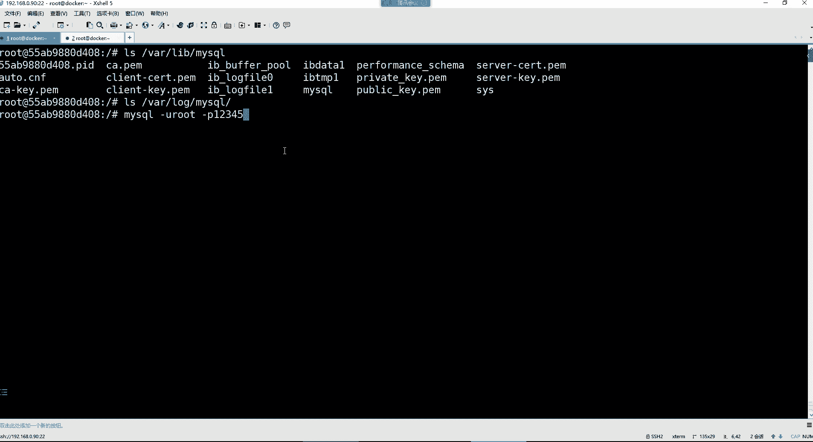


接下来，我们通过部署一个MySQL容器来实践数据卷的使用。关键在于处理MySQL的配置文件，避免挂载时被空目录覆盖。


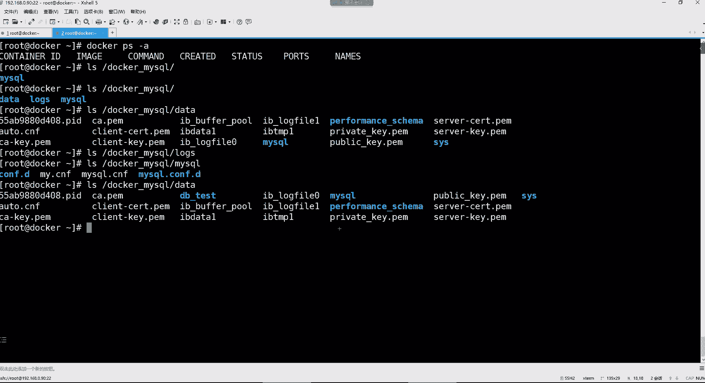

### 准备工作：提取容器配置文件

在挂载数据卷之前，我们需要先将运行中的MySQL容器内的配置文件拷贝到宿主机。这是因为如果直接将一个空的宿主机目录挂载到容器的配置目录（如 `/etc/mysql`），会导致容器内原有的配置文件被“覆盖”（实际上是隐藏），从而使服务无法启动。

以下是操作步骤：

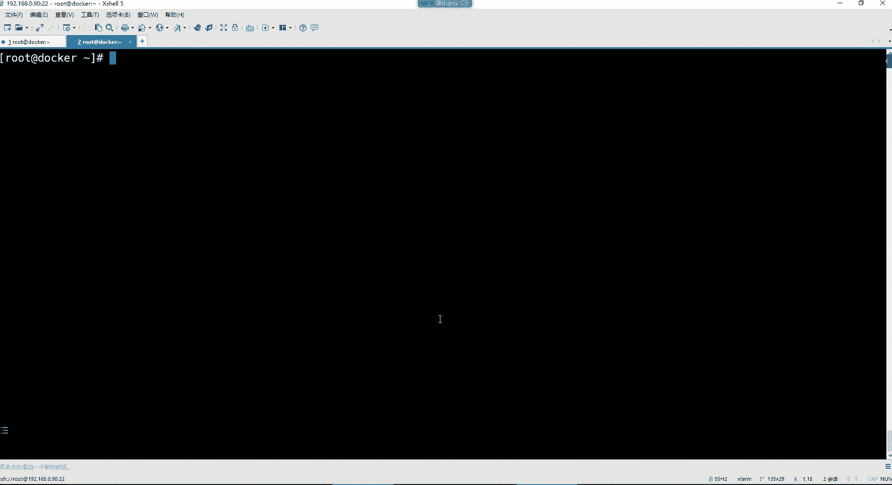

1.  **运行一个临时MySQL容器**：
    ```bash
    docker run -d --name=mysql_temp mysql:5.7
    ```

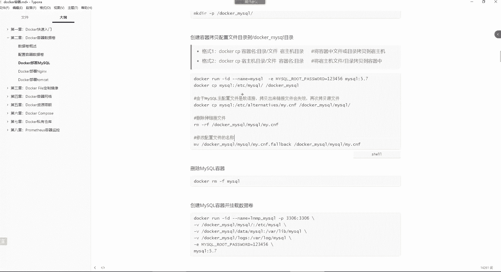

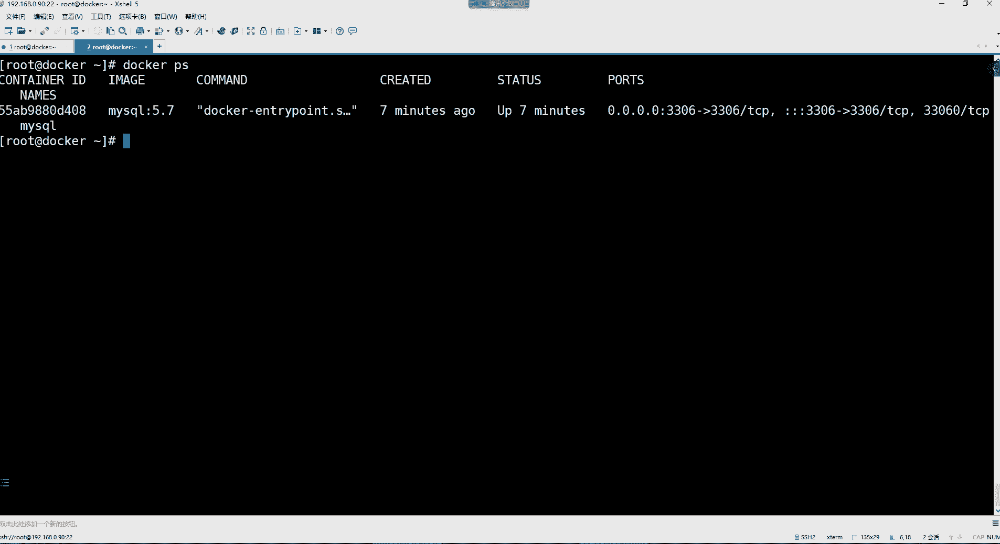

2.  **创建宿主机存储目录**：
    ```bash
    mkdir -p /docker/mysql
    ```

3.  **拷贝容器配置文件到宿主机**：
    ```bash
    docker cp mysql_temp:/etc/mysql /docker/mysql/conf
    ```
    *注意：MySQL的主配置文件 `my.cnf` 可能是一个软链接。直接拷贝软链接会失效，需要找到其源文件并处理。通常需要进入容器查看并拷贝实际文件。*


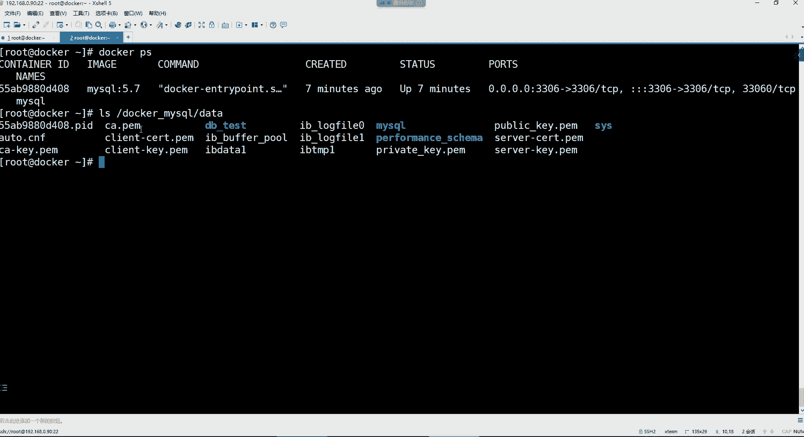

4.  **删除临时容器**：
    ```bash
    docker rm -f mysql_temp
    ```

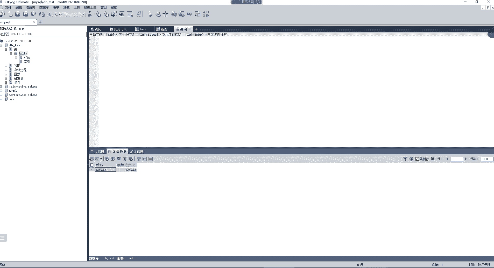

### 创建正式容器并挂载数据卷

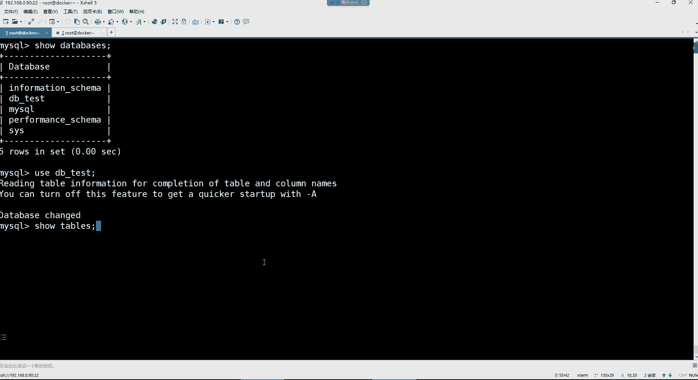

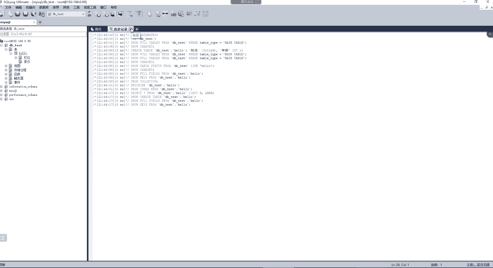


配置文件准备就绪后，我们就可以创建正式的、带有数据卷挂载的MySQL容器了。

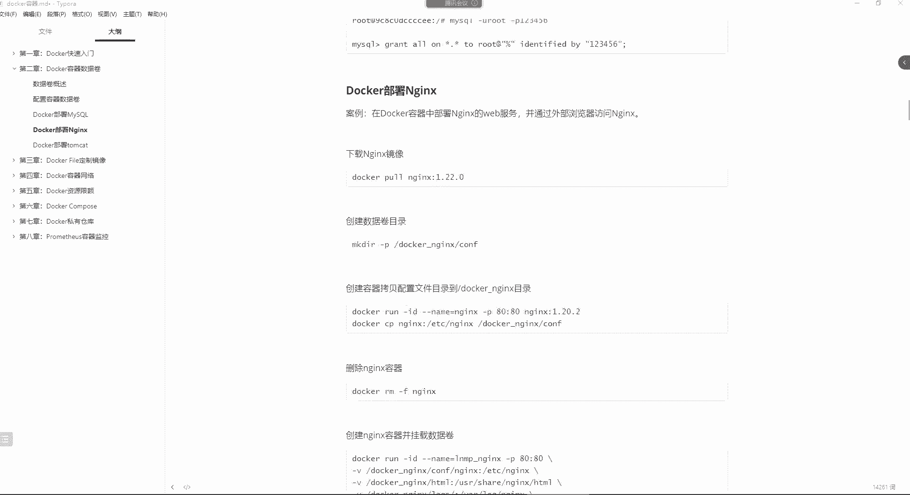


创建容器的命令如下，我们通过多个 `-v` 参数分别挂载配置、数据和日志目录：

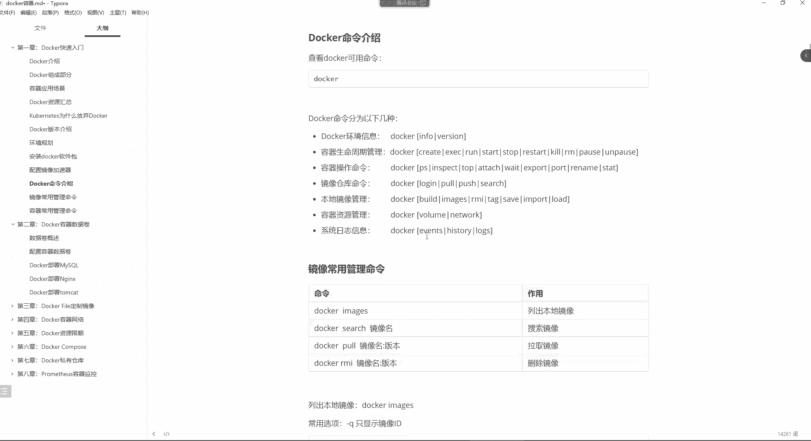

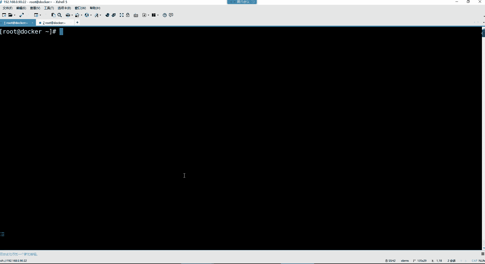


```bash
docker run -d \
  --name=mysql \
  -p 3306:3306 \
  -v /docker/mysql/conf:/etc/mysql \
  -v /docker/mysql/data:/var/lib/mysql \
  -v /docker/mysql/logs:/var/log/mysql \
  -e MYSQL_ROOT_PASSWORD=123456 \
  mysql:5.7
```

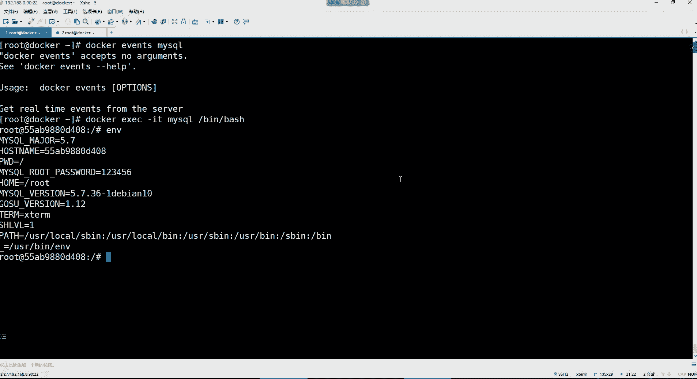

**命令参数解析：**
*   `-v /docker/mysql/conf:/etc/mysql`：将宿主机配置目录挂载到容器MySQL配置目录。
*   `-v /docker/mysql/data:/var/lib/mysql`：将宿主机数据目录挂载到容器数据库文件目录，实现数据持久化。
*   `-v /docker/mysql/logs:/var/log/mysql`：将宿主机日志目录挂载到容器日志目录。
*   `-e MYSQL_ROOT_PASSWORD=123456`：设置MySQL root用户的密码环境变量。

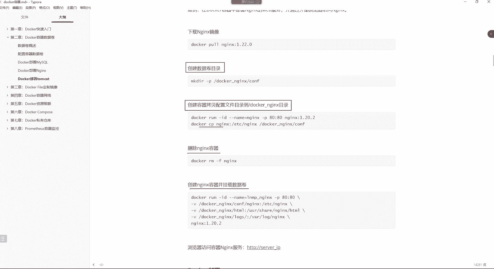

容器启动后，在 `/docker/mysql/data` 目录下即可看到数据库文件。使用数据库客户端（如MySQL Workbench, Navicat）连接宿主机的3306端口，即可管理这个容器中的数据库，所有数据变更都会保存在宿主机上。

## 实战部署：Nginx容器与数据卷 🌐

部署Nginx的思路与MySQL类似，重点是配置文件和网站根目录的挂载。

### 提取Nginx配置文件

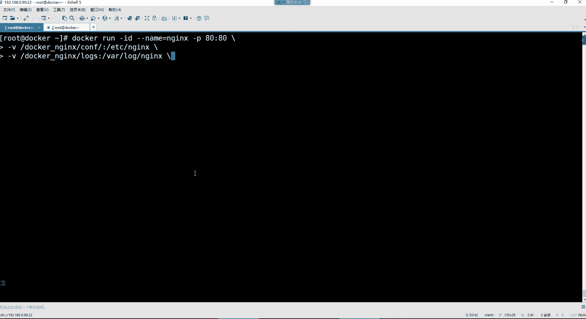

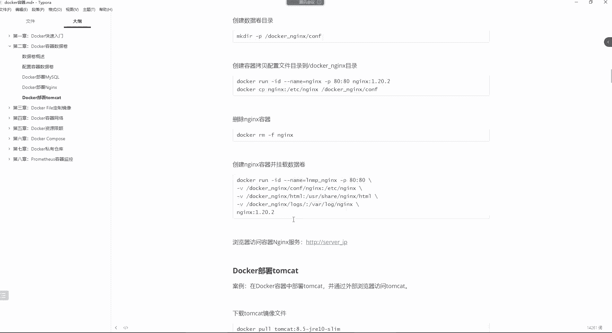

1.  **运行临时Nginx容器并拷贝配置**：
    ```bash
    docker run -d --name=nginx_temp nginx:1.22
    mkdir -p /docker/nginx
    docker cp nginx_temp:/etc/nginx /docker/nginx/conf
    docker rm -f nginx_temp
    ```
    同样，如果 `conf.d` 或 `modules` 是软链接，需要进入容器处理源文件。

### 创建正式Nginx容器

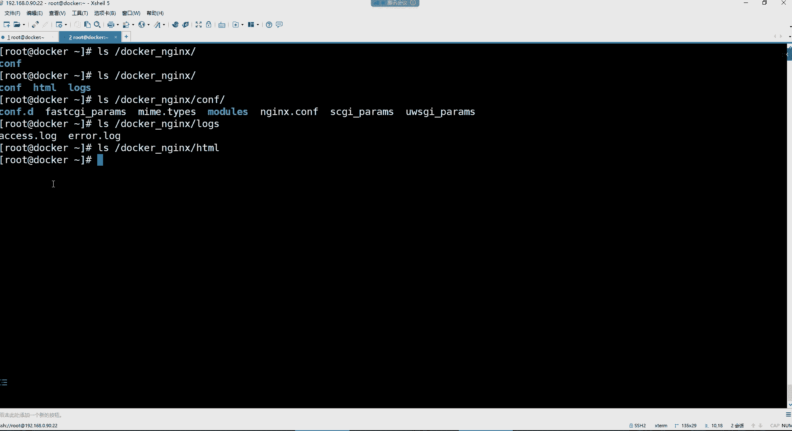


2.  **创建并挂载数据卷的Nginx容器**：
    ```bash
    docker run -d \
      --name=nginx \
      -p 80:80 \
      -v /docker/nginx/conf:/etc/nginx \
      -v /docker/nginx/logs:/var/log/nginx \
      -v /docker/nginx/html:/usr/share/nginx/html \
      nginx:1.22
    ```
    **命令参数解析：**
    *   `-v /docker/nginx/conf:/etc/nginx`：挂载配置文件。
    *   `-v /docker/nginx/logs:/var/log/nginx`：挂载日志文件。
    *   `-v /docker/nginx/html:/usr/share/nginx/html`：挂载网站根目录。

3.  **验证与管理**：
    *   将网页文件（如 `index.html`）放入 `/docker/nginx/html`，即可通过浏览器访问。
    *   修改 `/docker/nginx/conf/nginx.conf` 中的配置（如 `worker_connections`），重启容器后生效。
    *   访问日志可以在 `/docker/nginx/logs/access.log` 中查看。

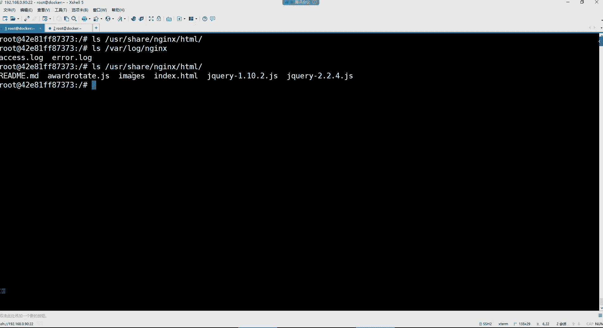


## 实战部署：Tomcat容器与数据卷 🚀

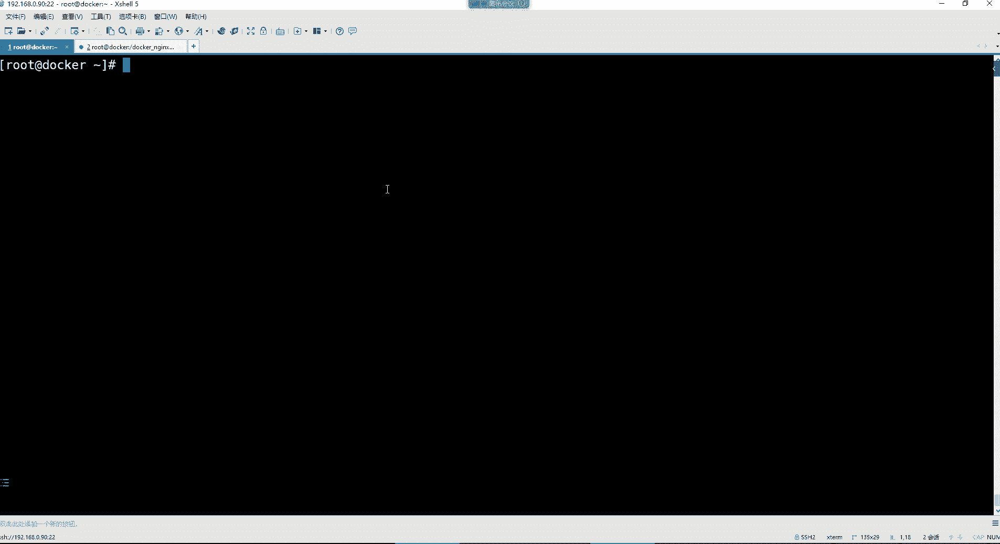


Tomcat的部署更为简单，因为其所有相关文件通常集中在一个目录下。

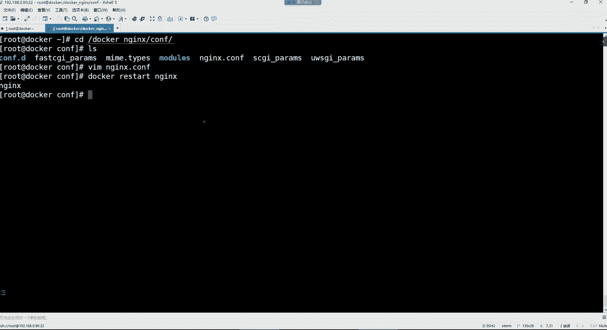


1.  **运行临时容器并拷贝全部数据**：
    ```bash
    docker run -d --name=tomcat_temp tomcat
    mkdir -p /docker/tomcat
    docker cp tomcat_temp:/usr/local/tomcat /docker/tomcat/
    docker rm -f tomcat_temp
    ```

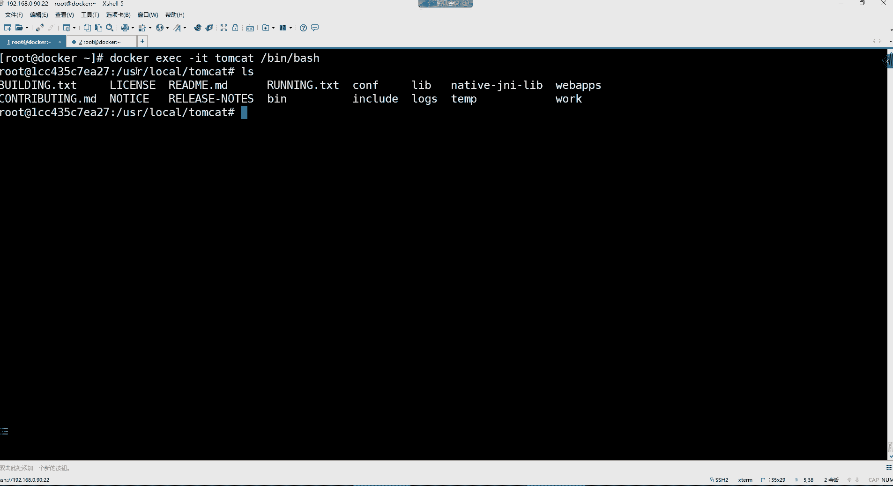

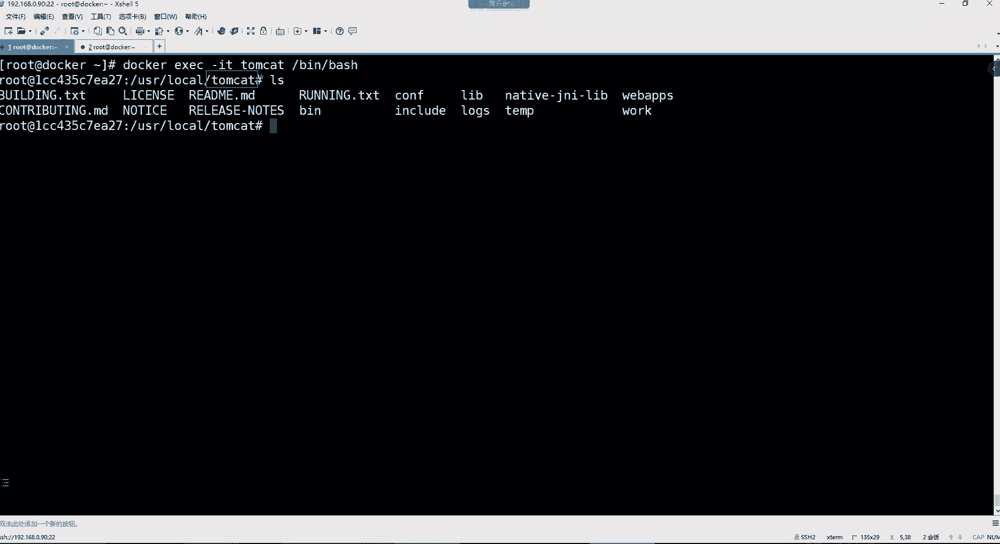

2.  **创建正式Tomcat容器**：
    ```bash
    docker run -d \
      --name=tomcat \
      -p 8080:8080 \
      -v /docker/tomcat/tomcat:/usr/local/tomcat \
      tomcat
    ```
    **命令参数解析：**
    *   `-v /docker/tomcat/tomcat:/usr/local/tomcat`：将整个Tomcat工作目录挂载出来，包含 `webapps`（应用目录）、`logs`（日志）、`conf`（配置）等子目录。


3.  **验证与管理**：
    *   访问 `http://宿主机IP:8080` 即可看到Tomcat默认页。
    *   将 `WAR` 包放入 `/docker/tomcat/tomcat/webapps/` 即可部署应用。
    *   日志文件位于 `/docker/tomcat/tomcat/logs/`。

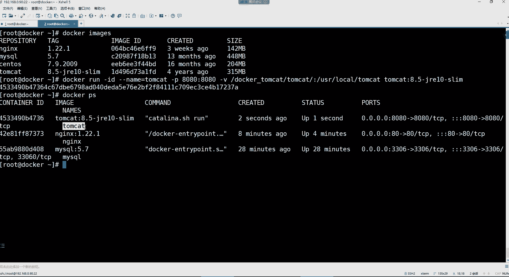

## 课程总结 📝


本节课中我们一起学习了Docker容器数据卷的全面应用。

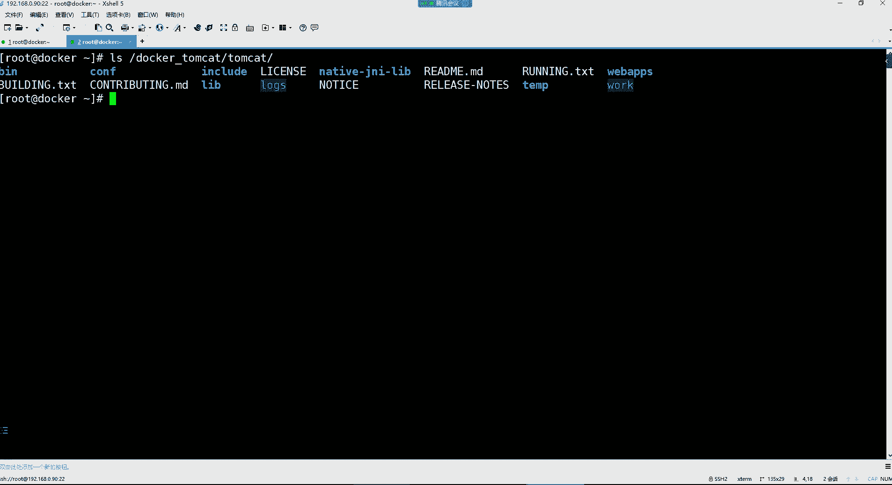

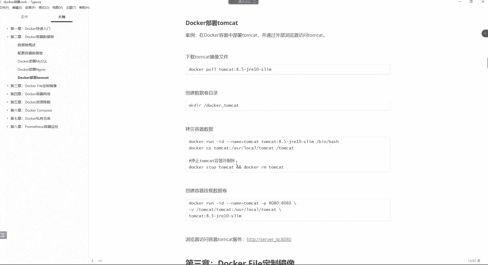


我们首先理解了数据卷的核心作用：**实现容器数据的持久化、便于宿主机管理、以及容器间的数据共享**。随后，我们通过三个经典案例——MySQL、Nginx和Tomcat的容器化部署，实战演练了数据卷的使用流程。

关键操作步骤可以总结为：
1.  **准备阶段**：运行临时容器，将重要的配置文件或数据目录拷贝到宿主机。
2.  **挂载阶段**：使用 `docker run -v` 命令，创建新容器并建立宿主机与容器之间的目录映射。
3.  **验证阶段**：通过宿主机目录管理配置、查看日志、放置应用文件，验证数据同步是否生效。


掌握数据卷后，容器的数据管理变得清晰而强大。我们不再需要频繁进入容器内部操作，所有数据都在宿主机上可见、可管理、可备份，真正实现了应用状态与运行环境的分离。这是将Docker用于生产环境不可或缺的技能。