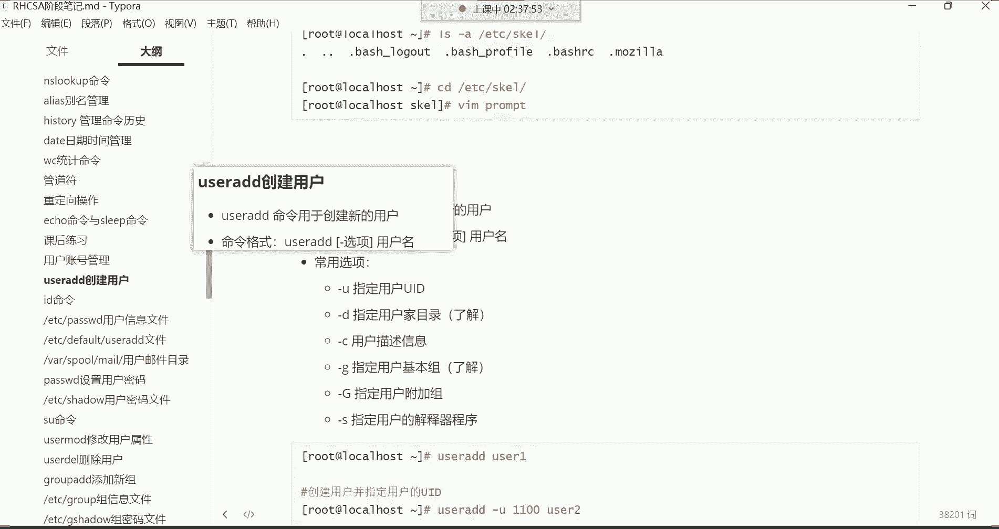
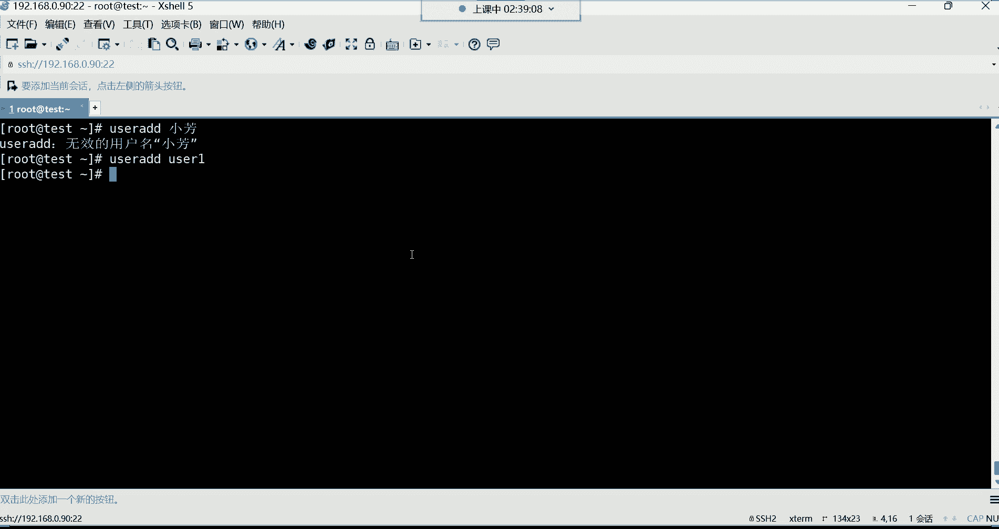
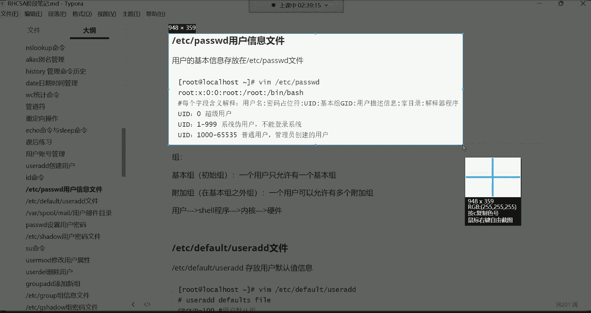
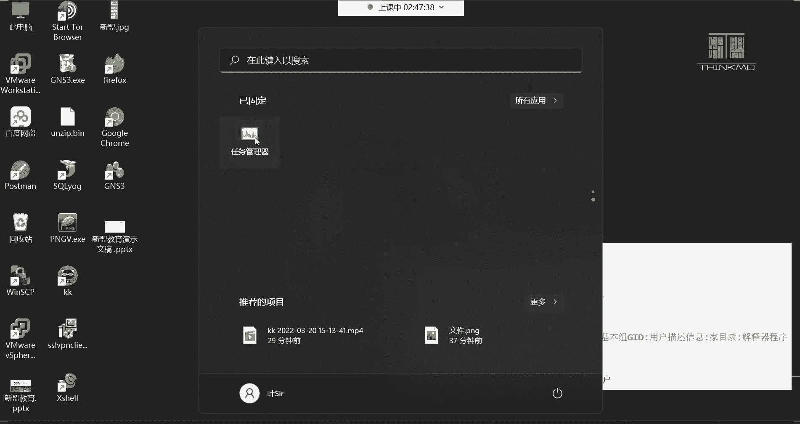
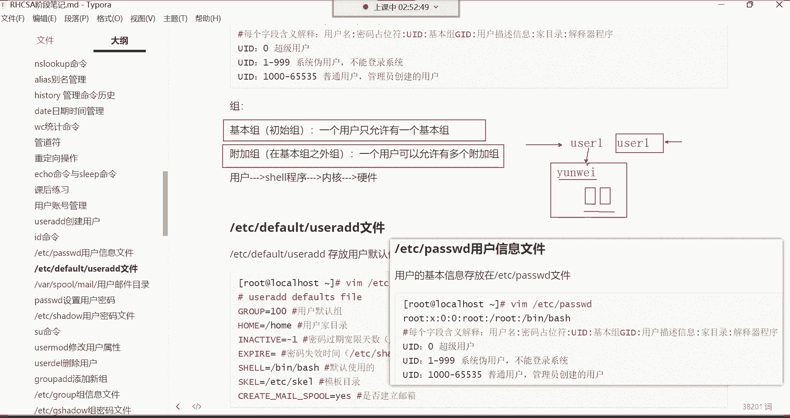
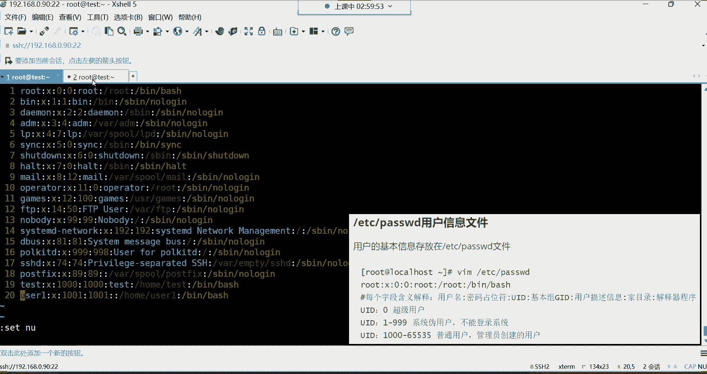
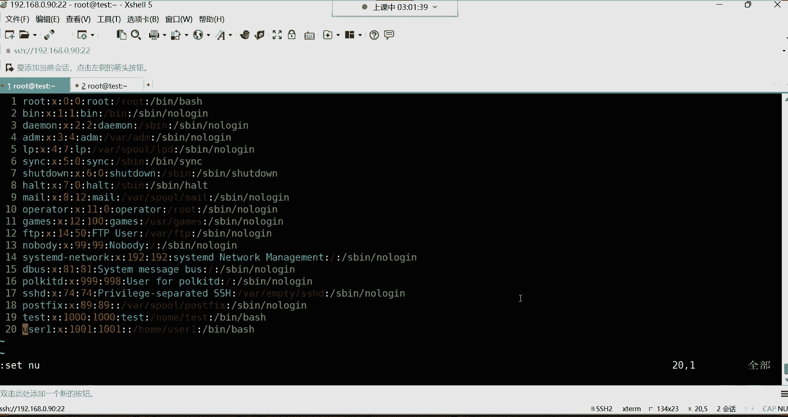
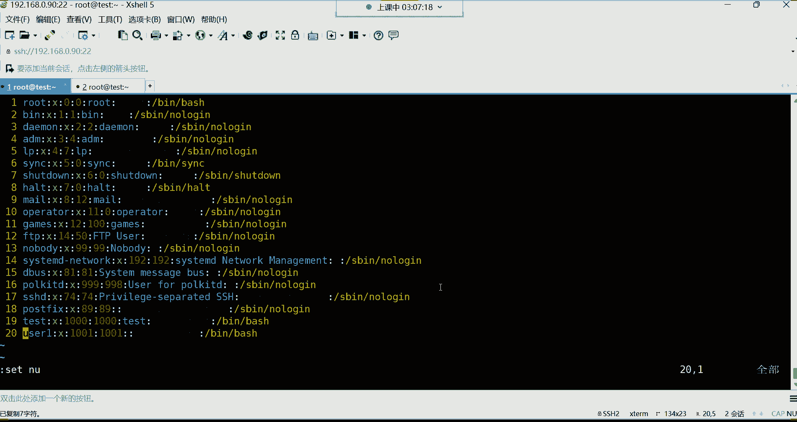
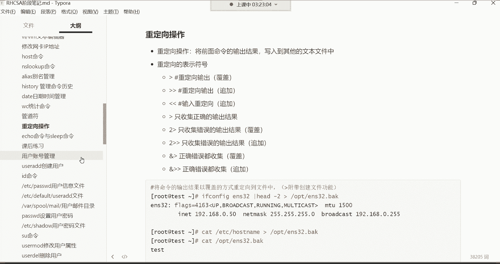
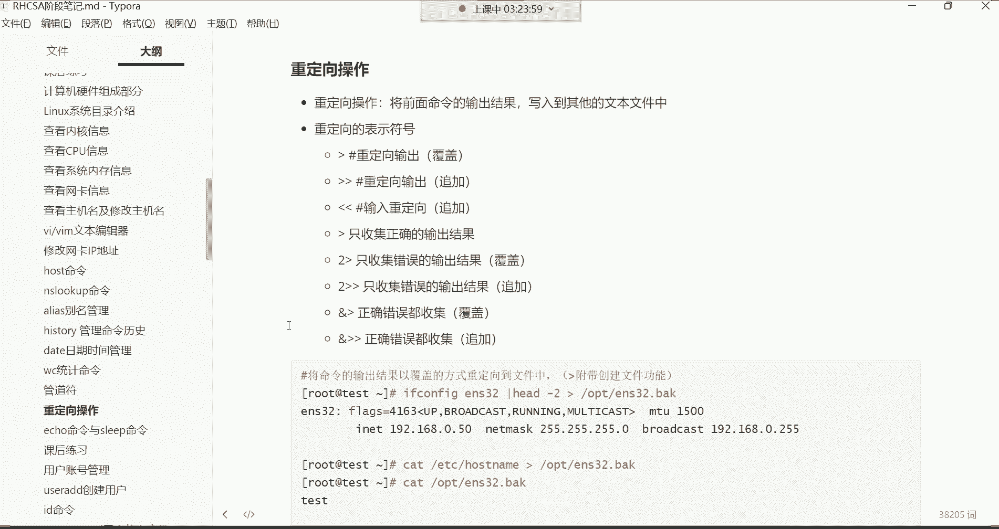

# Linux运维全套培训课程：P15：用户管理、用户信息文件详解 👨‍💻


在本节课中，我们将要学习Linux系统中的用户管理，包括用户账号的作用、分类，以及如何创建和管理用户。我们还将深入解析存储用户核心信息的 `/etc/passwd` 文件，理解其中每一列的含义。




## 用户账号概述






用户账号是登录系统所必需的凭证。在Linux系统中，用户主要分为两类：**超级管理员（root）** 和 **普通用户**。

*   **超级管理员（root）**：拥有系统的最高权限，可以执行任何操作，包括删除整个系统。由于其权限过大，在企业中通常只有核心运维人员或部门领导才拥有root权限。
*   **普通用户**：由管理员创建，权限受到限制，主要用于日常操作，以避免对系统造成意外损害。

## 用户模板目录

在深入了解用户创建之前，我们先简单了解一个概念：用户模板目录 `/etc/skel/`。




这个目录下的隐藏文件（如 `.bashrc`, `.bash_profile`）会在创建新用户时，被自动复制到该用户的家目录中。这些文件为用户提供了初始的Shell环境配置，例如命令别名、历史记录存储等。了解此目录的存在即可，无需深入探究。


## 创建用户：`useradd` 命令



创建用户的命令是 `useradd`，此命令**只有root用户有权执行**。

命令格式非常简单：`useradd [选项] 用户名`。例如，创建一个名为 `user1` 的用户：
```bash
useradd user1
```
用户名应使用英文，不支持中文。

创建用户后，需要为其设置密码才能登录系统。在设置密码前，我们先来查看用户的信息存储在哪里。

## 用户信息文件：`/etc/passwd` 详解




用户的基本信息存储在 `/etc/passwd` 文件中。这个文件至关重要，如果被删除，所有用户（包括root）都将无法登录。



使用 `cat /etc/passwd` 命令查看文件内容。文件中的每一行代表一个用户，每行内容以英文冒号 `:` 分隔，共分为7个字段（列）。

以下是每个字段的具体含义：



1.  **用户名**：用户登录时使用的名称。
2.  **密码占位符**：历史上用于存放加密密码，现在密码已移至 `/etc/shadow` 文件。此处固定为 `x`，仅作为一个标识。
3.  **用户ID (UID)**：用户的唯一数字标识，相当于身份证号。
    *   **UID = 0**：超级管理员（root）。
    *   **UID = 1~999**：系统伪用户，通常用于运行系统服务进程，**不能登录系统**。
    *   **UID = 1000~65535**：普通用户，由管理员创建。
    *   **重要**：系统判断用户是否为超级管理员的依据是UID是否为0，而不是用户名是否为root。
4.  **基本组ID (GID)**：用户所属的**初始组（基本组）**的ID号。每个用户创建时，系统会自动创建一个与其同名的组作为其基本组。用户对属于自己基本组的文件拥有该组的权限。
5.  **描述信息**：用户的备注信息，如部门、联系电话等，可以为空。
6.  **家目录**：用户登录后所在的初始工作目录。root用户的家目录是 `/root`，普通用户的家目录通常位于 `/home/用户名`。
7.  **登录Shell（解释器）**：用户登录后使用的命令解释器程序路径。
    *   默认为 `/bin/bash`，这是一个功能丰富的标准Shell。
    *   如果设置为 `/sbin/nologin`，则该用户**禁止登录系统**（常用于系统伪用户）。
    *   Shell负责将用户输入的命令“翻译”成系统内核能理解的指令。


## `useradd` 命令常用选项


`useradd` 命令支持许多选项，用于在创建用户时指定其属性。以下是一些常用选项：

*   **`-u UID`**：指定用户的UID。
    ```bash
    useradd -u 6666 user2
    ```
*   **`-d 目录路径`**：指定用户的家目录。
    ```bash
    useradd -d /opt/user3 user3
    ```
*   **`-c “描述信息”`**：添加用户的描述/备注。
    ```bash
    useradd -c “运维部，电话xxx” user4
    ```
*   **`-G 组名1,组名2,...`**：指定用户的**附加组**。用户可以被加入多个附加组，从而继承这些组对文件的权限。
    ```bash
    useradd -G dev,test user5 # 将user5加入dev组和test组
    ```
*   **`-s Shell路径`**：指定用户的登录Shell。
    ```bash
    useradd -s /sbin/nologin user6 # 创建不能登录系统的用户
    ```
*   **`-g 组名`**：指定用户的**基本组**（不常用）。

这些选项可以组合使用，例如：
```bash
useradd -u 2000 -c “开发工程师” -G dev,ops -s /bin/bash user7
```

## 查看用户和组信息：`id` 命令

创建或修改用户后，可以使用 `id` 命令查看用户的UID、GID以及所属的所有组。
```bash
id username
```
例如，`id user5` 会显示user5的UID、基本组GID以及它所属的所有组（基本组+附加组）。


---






本节课中我们一起学习了Linux用户管理的基础知识。我们了解了用户账号的分类和作用，掌握了使用 `useradd` 命令创建用户及其常用选项。更重要的是，我们深入解析了核心配置文件 `/etc/passwd` 的结构和每一列的含义，这是理解Linux用户体系的关键。最后，我们学习了使用 `id` 命令查看用户信息。理解这些概念是后续学习用户权限、文件归属等高级主题的基础。