# Linux运维入门：P18：权限管理

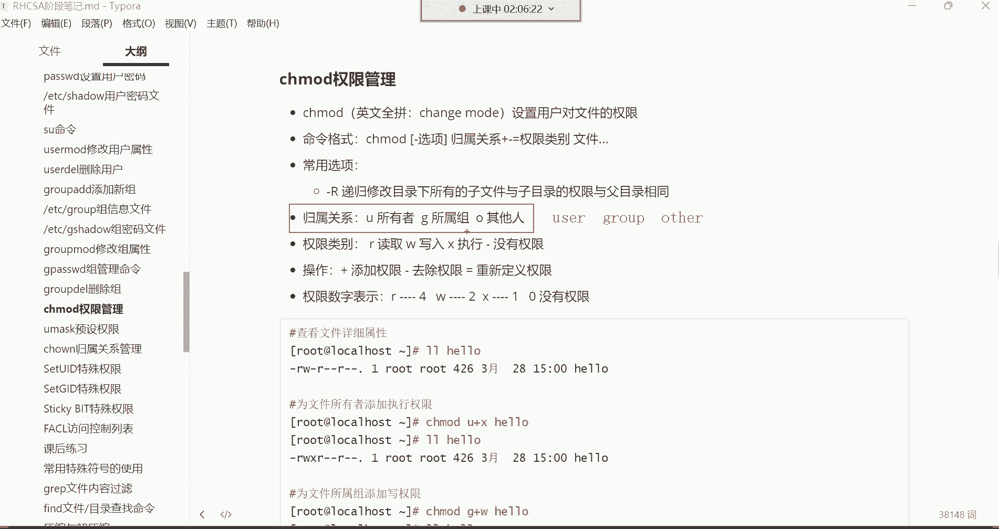


## 概述
在本节课中，我们将学习Linux系统中至关重要的权限管理。权限是控制用户对文件或目录能执行哪些操作（如读、写、执行）的机制。理解权限是理解Linux系统安全和管理用户访问的基础。我们将从基本概念讲起，逐步深入到权限的设置、验证和实际应用场景。

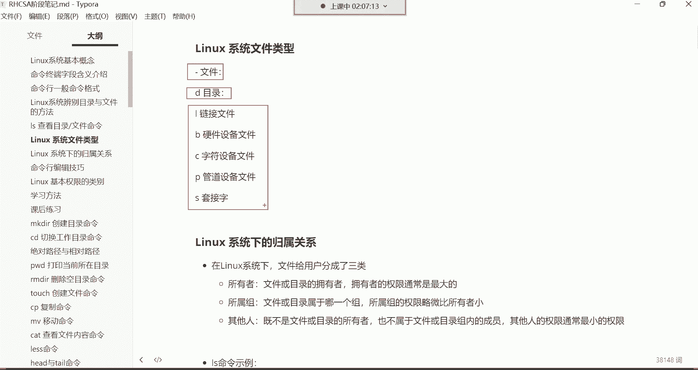

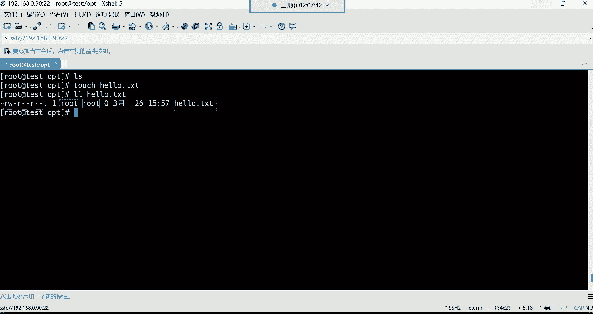

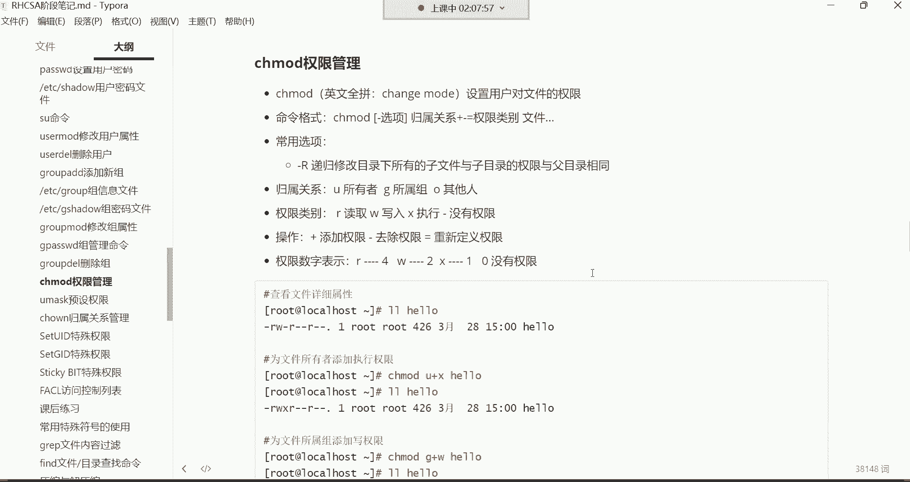

## 归属关系
上一节我们介绍了用户和组的管理，本节中我们来看看权限如何与它们结合。首先，我们需要理解文件的归属关系。每个文件或目录都有三类归属关系：所有者、所属组和其他人。

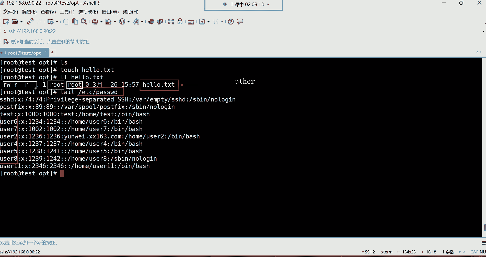

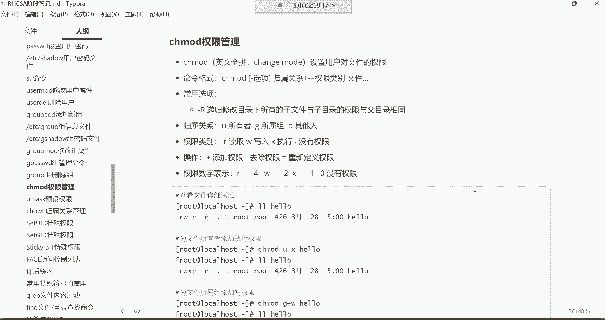

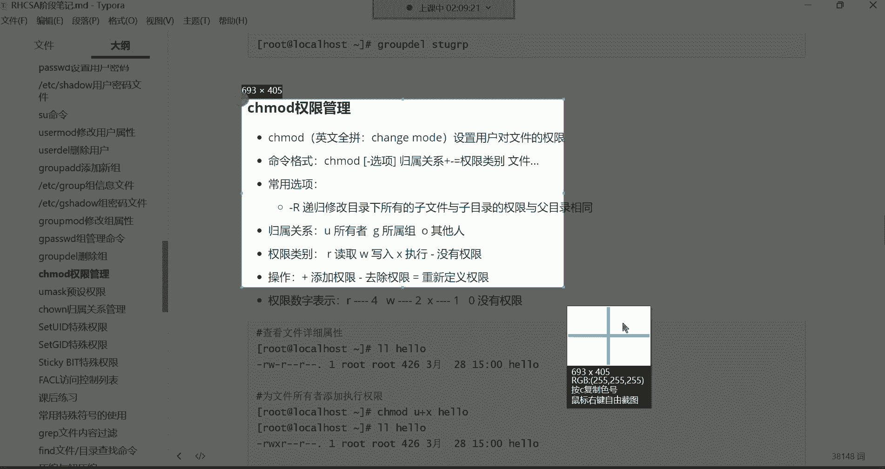

*   **所有者**：文件的创建者，通常拥有对该文件的最高控制权。
*   **所属组**：文件所属的用户组，组内的成员可以继承该组对文件的权限。
*   **其他人**：既不是文件所有者，也不在文件所属组内的所有其他系统用户。

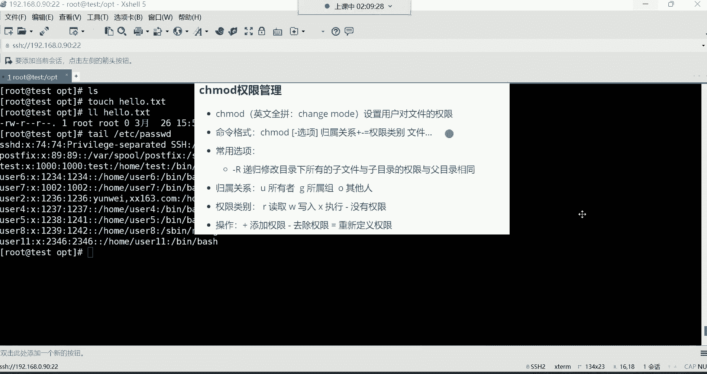

这三类关系分别用 `U`、`G`、`O` 表示：
*   `U`：User，代表所有者。
*   `G`：Group，代表所属组。
*   `O`：Other，代表其他人。

例如，使用 `root` 用户在 `/opt` 目录下创建一个文件：
```bash
cd /opt
touch hello.txt
ls -l hello.txt
```
输出可能类似于：
```
-rw-r--r--. 1 root root 0 Apr 10 10:00 hello.txt
```
在这个例子中：
*   `-` 表示这是一个普通文件。
*   `rw-` 是所有者 `root` 的权限。
*   `r--` 是所属组 `root` 的权限。
*   `r--` 是其他人的权限。
*   第一个 `root` 是所有者。
*   第二个 `root` 是所属组。

## 基本权限类别
理解了归属关系后，我们来看看具体的权限类别。基本权限分为三种：读、写、执行。

*   **读**：用 `r` 表示。对于文件，意味着可以查看文件内容。对于目录，意味着可以列出目录内的文件列表。
*   **写**：用 `w` 表示。对于文件，意味着可以修改文件内容（增、删、改）。对于目录，意味着可以在目录内创建、删除、重命名文件或子目录。
*   **执行**：用 `x` 表示。对于文件，意味着可以运行该文件（如脚本或程序）。对于目录，意味着可以进入该目录。

权限位总共有9个字符，分为三组，每组三个字符，顺序固定为 `rwx`。如果某个权限被禁用，则用 `-` 表示。

以下是权限位的解读方式：
```
-rw-r--r--
^ ^  ^  ^
| |  |  |
| |  |  +--- 其他人权限 (r--)
| |  +------ 所属组权限 (r--)
| +--------- 所有者权限 (rw-)
+----------- 文件类型 (- 表示普通文件)
```
*   所有者 `root` 有 `rw-`，即可以读、写，但不能执行。
*   所属组 `root` 有 `r--`，即只能读。
*   其他人有 `r--`，即只能读。

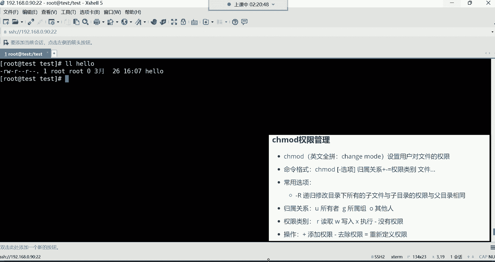

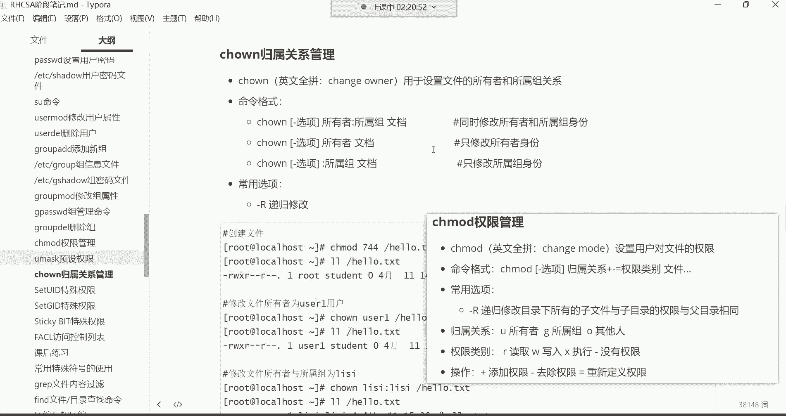

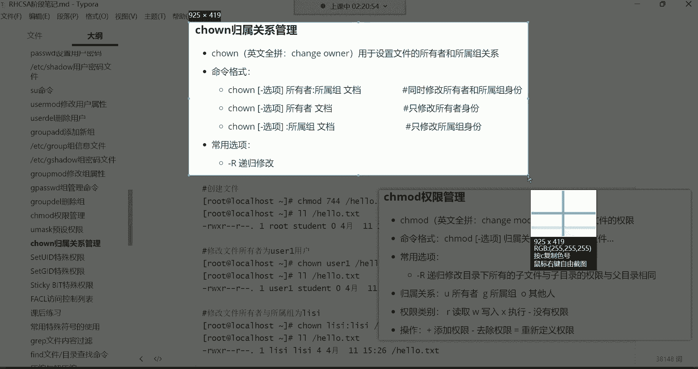

## 修改文件归属关系
在设置权限前，有时需要先修改文件的归属关系。`chown` 命令用于更改文件的所有者和所属组。

以下是 `chown` 命令的三种常用格式：

1.  **同时修改所有者和所属组**：
    ```bash
    chown 所有者:所属组 文件名
    ```
    例如，将 `hello.txt` 的所有者改为 `tom`，所属组也改为 `tom`：
    ```bash
    chown tom:tom hello.txt
    ```

2.  **只修改所有者**：
    ```bash
    chown 所有者 文件名
    ```
    例如，只将 `hello.txt` 的所有者改回 `root`：
    ```bash
    chown root hello.txt
    ```

3.  **只修改所属组**：
    ```bash
    chown :所属组 文件名
    ```
    例如，只将 `hello.txt` 的所属组改为 `dev` 组：
    ```bash
    chown :dev hello.txt
    ```

**选项**：
*   `-R`：递归处理，将指定目录下的所有文件及子目录一并处理。

## 修改文件权限
`chmod` 命令用于修改文件或目录的权限。其核心是指定 **为谁改**、**如何改** 和 **改什么**。

**基本语法**：
```bash
chmod [ugoa][+-=][rwx] 文件名
```
*   `[ugoa]`：指定权限作用对象。
    *   `u`：所有者。
    *   `g`：所属组。
    *   `o`：其他人。
    *   `a`：所有人（相当于 `ugo`）。
*   `[+-=]`：指定操作类型。
    *   `+`：添加权限。
    *   `-`：移除权限。
    *   `=`：直接设定权限（覆盖原有权限）。
*   `[rwx]`：指定权限内容。

### 权限操作示例
假设我们有一个文件 `testfile`，当前权限为 `-rw-r--r--`。

1.  **为所有者添加执行权限**：
    ```bash
    chmod u+x testfile
    ```
    执行后权限变为 `-rwxr--r--`。

2.  **为所属组移除写权限**：
    ```bash
    chmod g-w testfile
    ```
    执行后权限变为 `-rw-r--r--`（所属组原本就没有写权限，所以无变化）。

3.  **为其他人设置读写权限（覆盖原有权限）**：
    ```bash
    chmod o=rw testfile
    ```
    执行后权限变为 `-rw-r--rw-`。

4.  **同时为不同对象设置权限**：
    ```bash
    chmod u=rwx,g=rx,o=r testfile
    ```
    执行后权限变为 `-rwxr-xr--`。

### 权限的数字表示法
除了字母，权限也可以用数字表示，这种方法更为简洁。每个权限对应一个数字：
*   `r` (读) = 4
*   `w` (写) = 2
*   `x` (执行) = 1
*   `-` (无权限) = 0

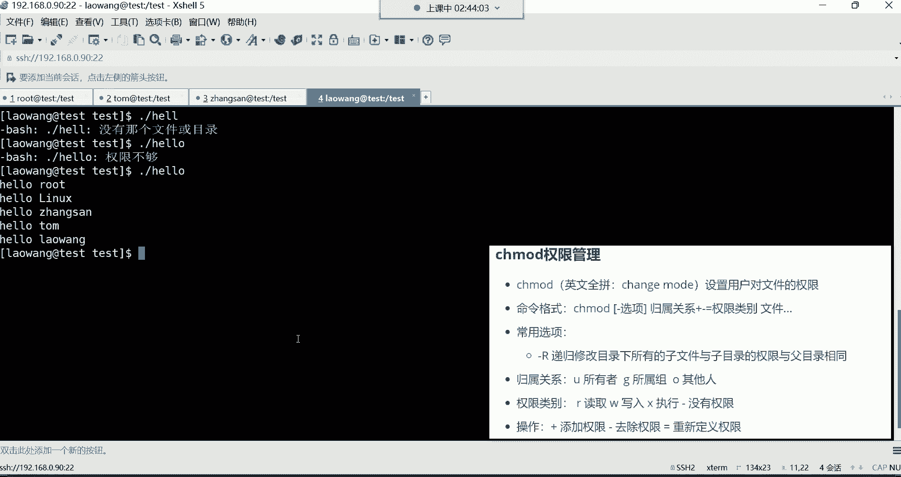

权限数字是三类用户权限数字的和：
*   所有者权限数字 = (r?4:0) + (w?2:0) + (x?1:0)
*   所属组权限数字 = (r?4:0) + (w?2:0) + (x?1:0)
*   其他人权限数字 = (r?4:0) + (w?2:0) + (x?1:0)

最终权限用三个数字连写表示：`所有者权限数字所属组权限数字其他人权限数字`。

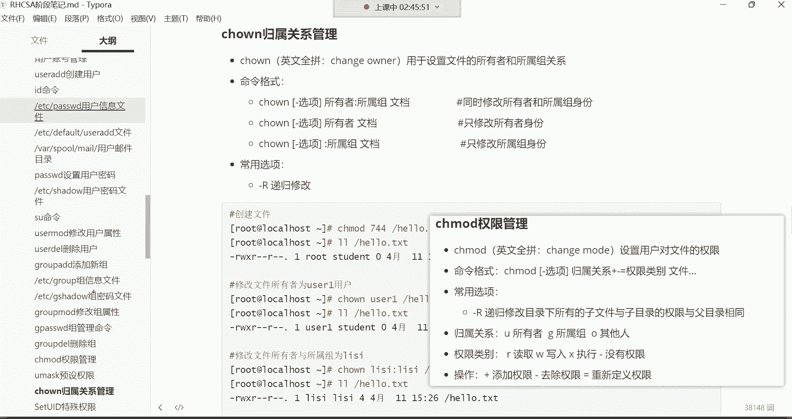

**常见权限数字**：
*   `755`： `rwxr-xr-x` （所有者全权，组和其他人可读可执行）
*   `644`： `rw-r--r--` （所有者可读写，组和其他人只读）
*   `777`： `rwxrwxrwx` （所有人拥有全部权限，慎用）

**使用数字设置权限**：
```bash
chmod 755 testfile
```
这条命令直接将 `testfile` 的权限设置为 `rwxr-xr-x`。

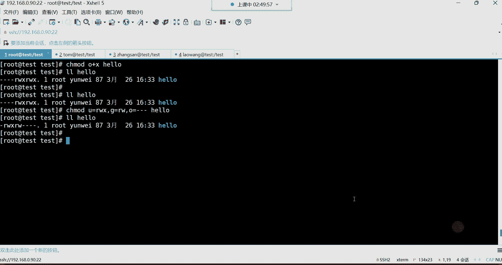

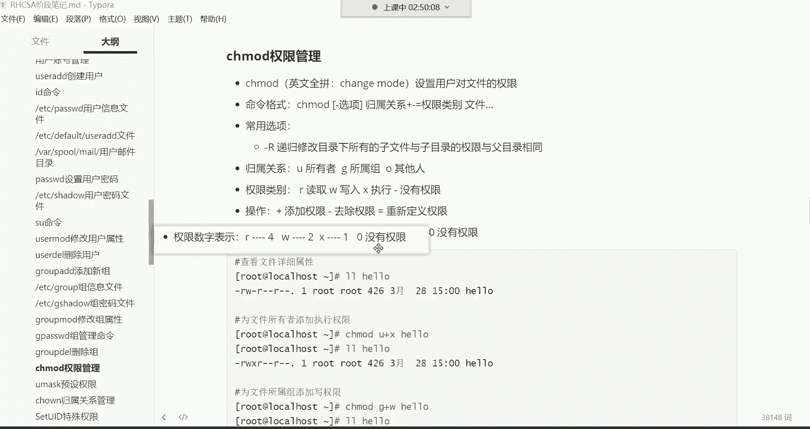

**注意**：使用数字法时，必须提供完整的三个数字。例如，只想修改其他人的权限为只读(`4`)，也必须写成 `chmod 664 testfile`（假设原所有者权限是6，所属组权限是6），否则缺失的数字会被当作 `0` 处理。

## 权限验证与实践
理论需要实践来验证。让我们通过创建用户和组，来模拟一个真实的权限管理场景。

1.  **创建组和用户**：
    ```bash
    groupadd ops # 创建运维组
    useradd tom # 创建用户tom
    passwd tom # 为tom设置密码
    gpasswd -a tom ops # 将用户tom加入到ops组
    ```

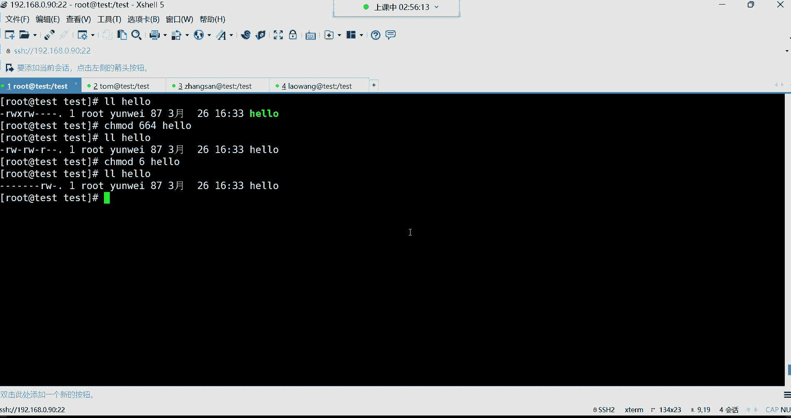

2.  **创建测试环境**：
    ```bash
    mkdir /test
    cd /test
    touch project.txt
    chown root:ops project.txt # 将文件所属组改为ops组
    ls -l project.txt
    ```
    此时，`tom` 作为 `ops` 组的成员，对 `project.txt` 的权限取决于所属组(`ops`)的权限。

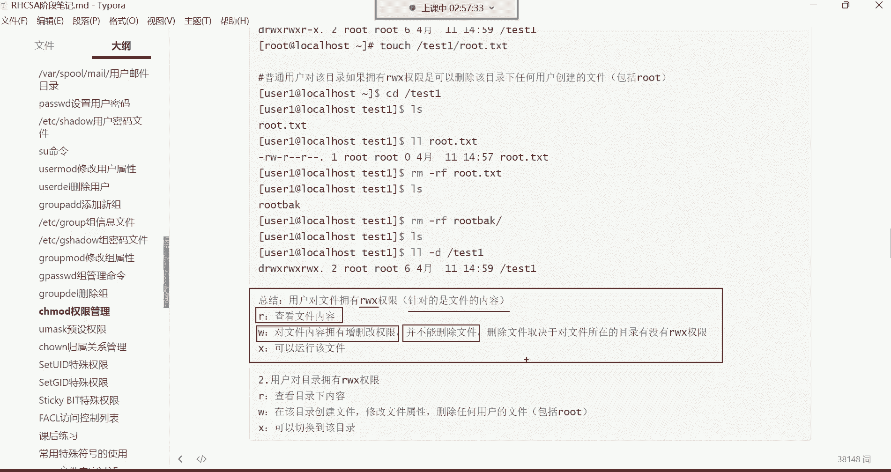

3.  **测试权限效果**：
    *   初始权限若为 `-rw-r--r--`，则 `tom` 只能读。
    *   切换到 `tom` 用户 (`su - tom`)，尝试写入文件会失败。
    *   在root用户下，为所属组添加写权限：`chmod g+w project.txt`。
    *   再次切换到 `tom` 用户，就可以成功写入文件了。
    *   创建一个新用户 `zhangsan`（不属于 `ops` 组），他将被归类为“其他人”，其权限受 `project.txt` 的其他人权限位控制。

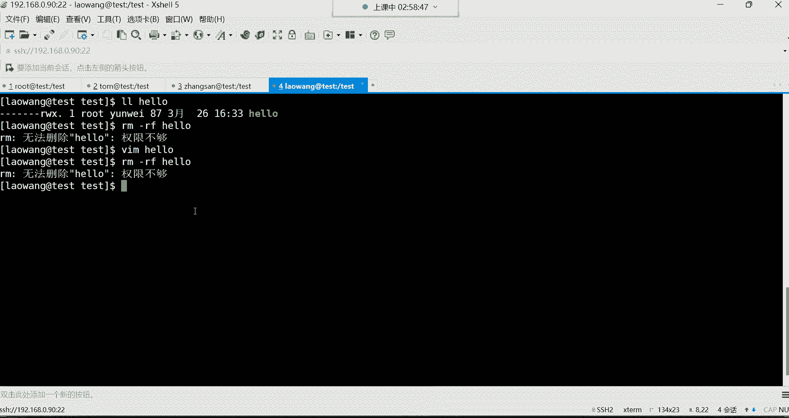

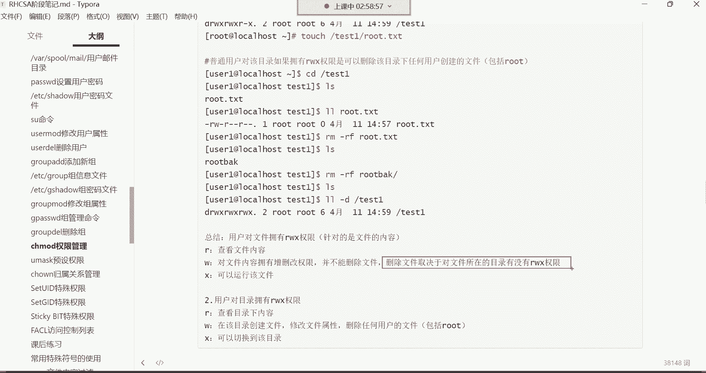

这个例子展示了如何通过 **组** 来批量管理同一部门（如运维部）员工对共享文件的访问权限，这是Linux系统管理中非常常见的实践。

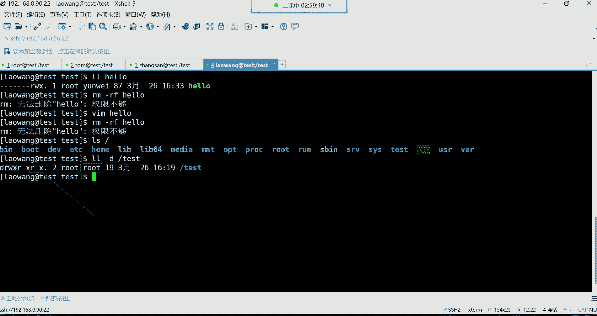

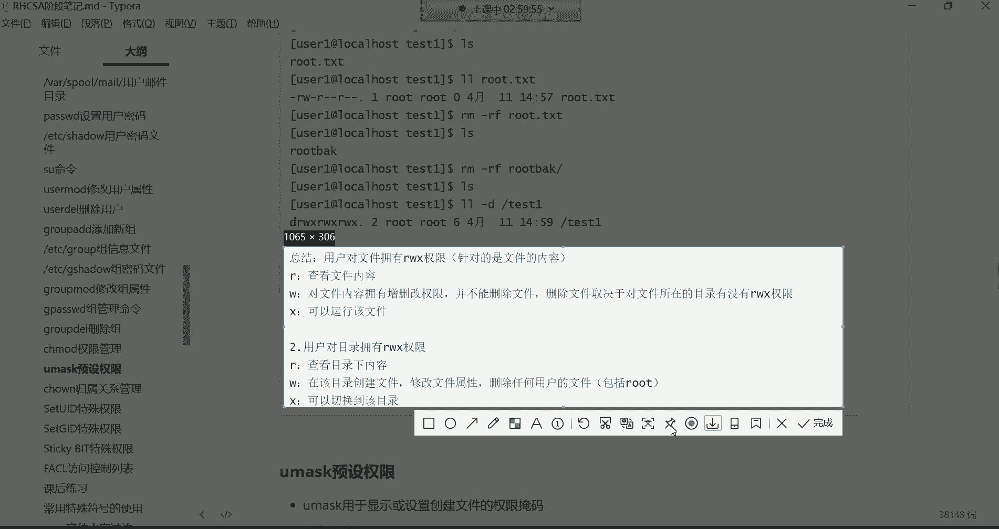

## 文件与目录权限的区别
至关重要的一点是，`r`、`w`、`x` 权限对文件和目录的含义有根本区别。

以下是文件与目录权限的对比总结：

| 权限 | 对文件的影响 | 对目录的影响 |
| :--- | :--- | :--- |
| **读** | 可以**查看文件内容**。 | 可以**列出目录内容**（如使用 `ls` 命令）。 |
| **写** | 可以**修改文件内容**（增、删、改文本）。**不能删除文件本身**。 | 可以在目录内**创建、删除、重命名**文件和子目录。 |
| **执行** | 可以**运行该文件**（如果是程序或脚本）。 | 可以**进入该目录**（如使用 `cd` 命令）。 |

**关键点**：
*   删除一个文件，需要的不是对该文件的 `w` 权限，而是对文件**所在目录**的 `w` 权限。
*   要能打开并读取一个目录下的文件，需要同时具备对该目录的 `r` 和 `x` 权限（`r` 用于列出文件名，`x` 用于访问文件元数据）。
*   系统根目录 `/` 下的多数子目录（如 `/etc`， `/home`）对其他人的权限通常是 `r-x`（可读可进入，不可写），这保证了普通用户不能随意在这些系统目录中增删文件。

## 默认权限与umask
当我们创建新文件或目录时，系统会赋予一个默认权限。这个默认权限由 `umask`（权限掩码）控制。

*   `umask` 值表示要从默认权限中**去除**的权限。
*   查看当前 `umask`：
    ```bash
    umask # 数字形式，如0022
    umask -S # 符号形式，如 u=rwx,g=rx,o=rx
    ```
*   目录的默认最大权限是 `777` (`rwxrwxrwx`)。
*   文件的默认最大权限是 `666` (`rw-rw-rw-`)（文件默认没有执行权限，出于安全考虑）。
*   实际创建权限 = 默认最大权限 - `umask` 值（这里是减法，但实际是权限位的逻辑与操作）。

例如，`umask` 为 `022`：
*   创建目录：`777 - 022 = 755` -> `rwxr-xr-x`
*   创建文件：`666 - 022 = 644` -> `rw-r--r--`

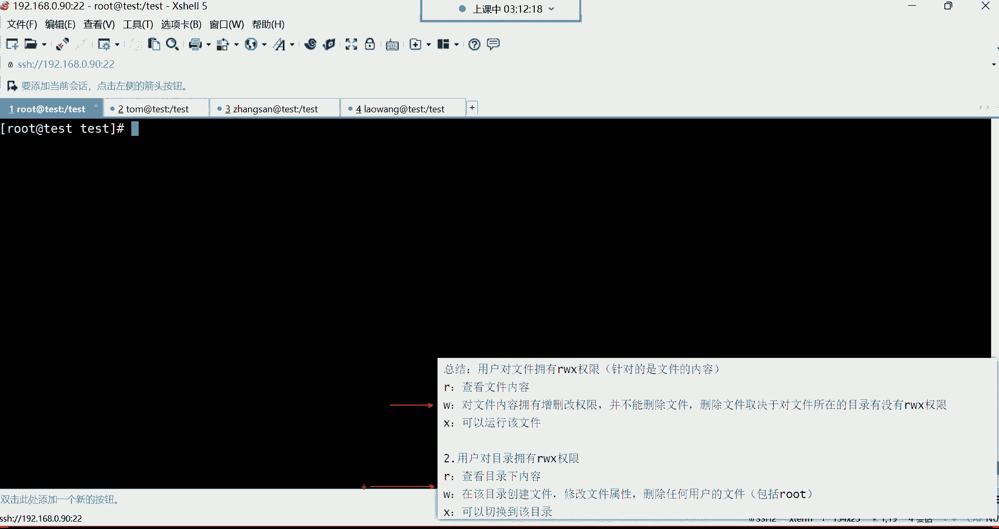

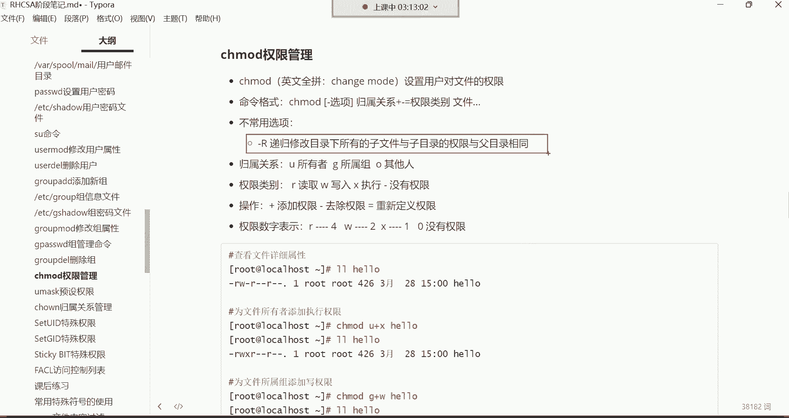

**修改 `umask`**（通常只在当前Shell会话中临时生效）：
```bash
umask 002 # 设置umask值为002，使所属组有写权限
```
一般情况下，无需修改系统默认的 `umask` 值。

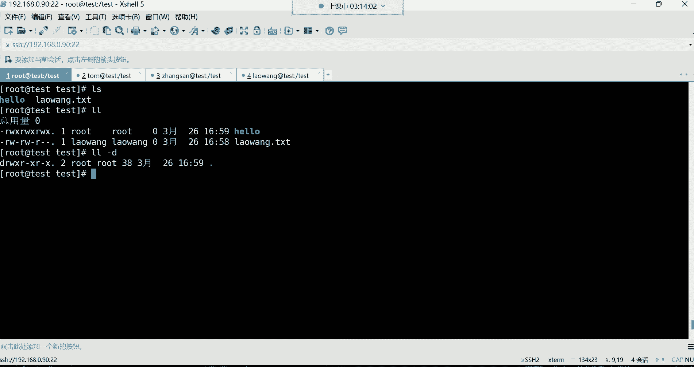

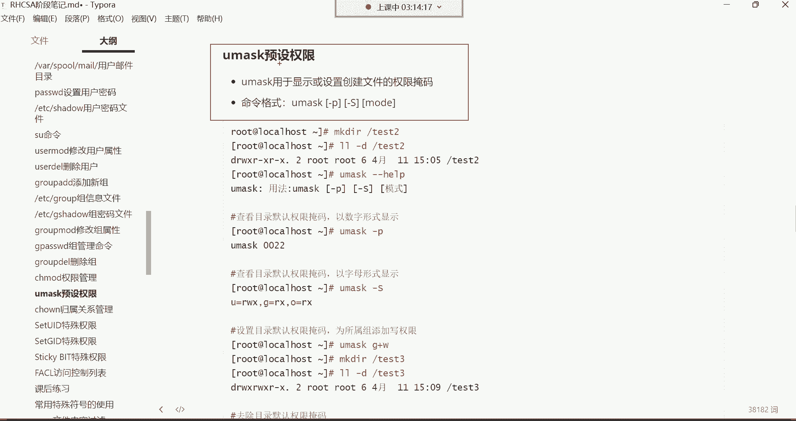

## 总结
本节课我们一起深入学习了Linux的权限管理核心知识。

我们首先明确了文件的三种**归属关系**：所有者、所属组和其他人。然后学习了三种基本**权限类别**：读、写、执行，并掌握了如何查看权限位。

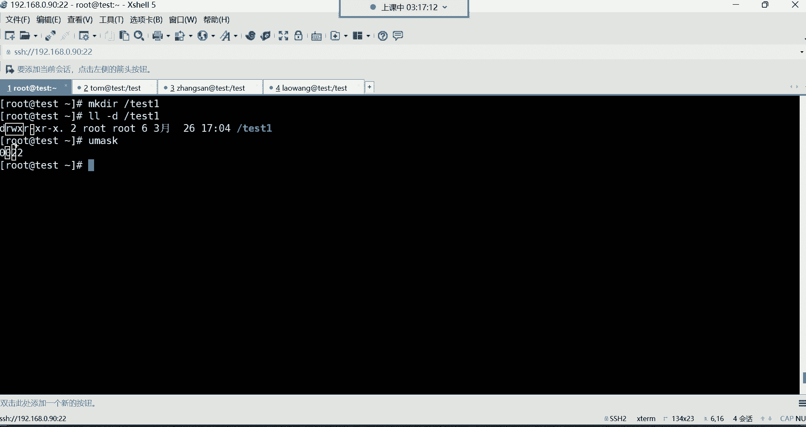

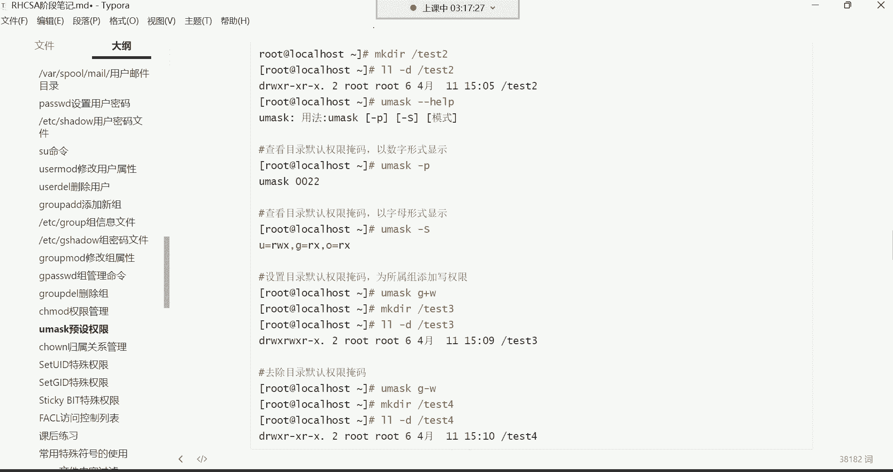

接着，我们掌握了两个关键命令：`chown` 用于修改文件的**归属关系**，`chmod` 用于修改文件的**访问权限**。`chmod` 既可以使用直观的字母操作符（`u+g-w`），也可以使用简洁的数字表示法（`755`）。

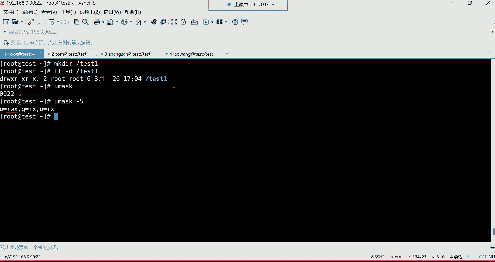

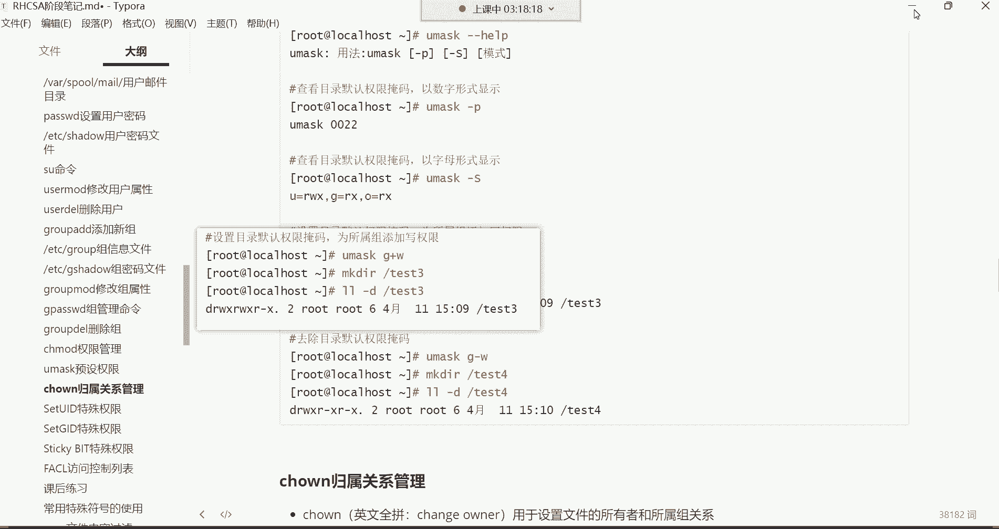

通过实践，我们理解了权限如何与用户、组协同工作，来实现对系统资源的精细访问控制。最后，我们辨析了**文件权限**和**目录权限**的重大区别，并了解了 `umask` 如何影响新建文件的默认权限。

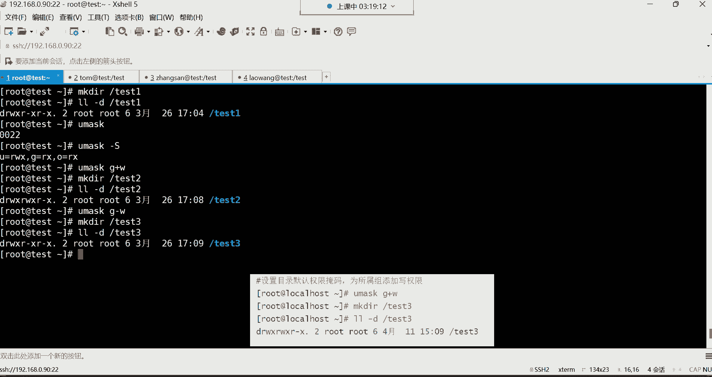

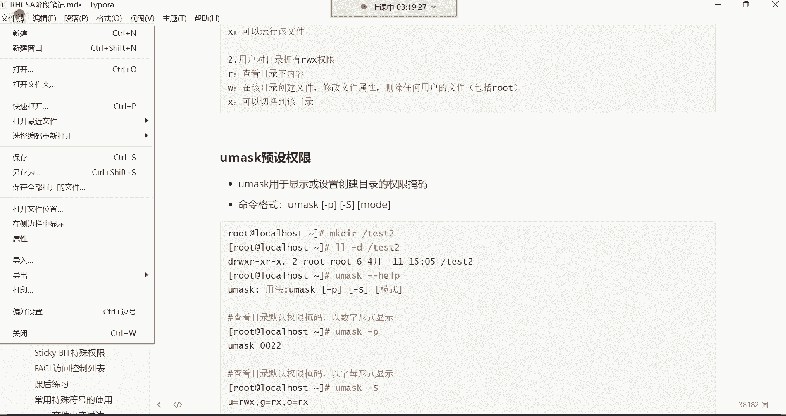

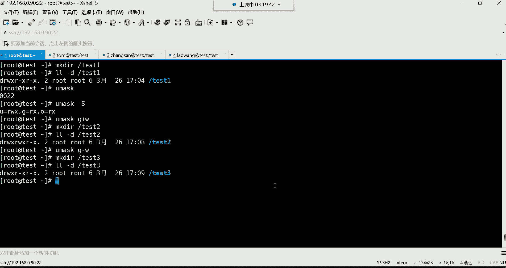

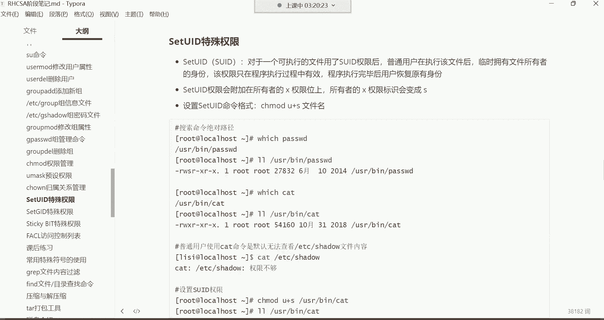

权限管理是Linux系统安全的基石，熟练掌握本章内容，是成为一名合格系统管理员的重要一步。