# Linux运维入门：第1章：云计算与Linux系统介绍 🚀

在本节课中，我们将要学习云计算的基本概念、Linux系统的本质以及它们之间的关系。我们将从行业背景入手，逐步解析核心概念，为后续的Linux运维学习打下坚实基础。

## 什么是云计算 ☁️

上一节我们介绍了课程的整体安排，本节中我们来看看什么是云计算。

云计算在20年前是一个虚无缥缈的词汇。如今，它已成为互联网基础设施的核心。简单来说，**云计算的本质是网络资源的出租**。

为了更好地理解，我们可以做一个类比：
*   **租用云主机** 就像 **租房子**。你无需自己买地、建房、装修，只需支付租金即可获得一个“拎包入住”的环境来运行你的业务（如网站）。
*   **传统自建服务器** 就像 **自己建房**。你需要购买土地、建材，并负责所有建设和维护工作，成本高昂。

云计算的优势在于，用户无需关心数据中心的地皮、电力、网络、空调等复杂基础设施，这些都由云厂商（如阿里云、AWS）负责。用户只需按需租用计算资源（如云主机），并按使用量（开机时长）或包年包月的方式付费。

## 云计算的三种服务模式 🏗️

了解了云计算的基本概念后，我们进一步看看它提供的三种不同层次的服务模式。

以下是云计算提供的三种主要服务模式：

1.  **IaaS（基础设施即服务）**
    *   **核心公式**：`IaaS = 基础硬件资源（CPU、内存、磁盘、网络）`
    *   云厂商提供最基础的计算资源。用户获得一台“空白”的虚拟服务器（云主机），需要自己安装操作系统、部署应用环境。这类似于买了一台只有硬件的电脑。

2.  **PaaS（平台即服务）**
    *   **核心公式**：`PaaS = IaaS + 现成的平台环境（如运行框架、中间件）`
    *   在IaaS的基础上，云厂商还提供了一个预配置好的软件平台环境。用户可以直接在此平台上部署自己的应用，而无需关心底层系统和中间件的搭建。这类似于买了一台预装好操作系统的电脑。

3.  **SaaS（软件即服务）**
    *   **核心公式**：`SaaS = PaaS + 完整的软件应用 + 全程维护`
    *   这是最“省事”的模式。云厂商提供完整的、可直接使用的软件服务（如企业邮箱、在线办公套件），并负责软件所有的前期部署和后期维护升级工作。用户就像入住五星级酒店，只需“拎包入住”并使用服务即可。

## 什么是Linux 🐧

在理解了云计算如何提供服务之后，我们需要认识承载这些服务的底层系统之一——Linux。

Linux是一个**类Unix的操作系统内核**。内核是计算机系统的核心，类似于人的大脑，负责管理计算机的所有硬件资源（如CPU、内存、磁盘）和软件协调工作。

关于Linux的读音（Linux或Linux）没有绝对标准，技术领域更关注其功能而非发音。

Linux内核由林纳斯·托瓦兹开发，其关键特性是**开源免费**。它采用了企鹅作为吉祥物，象征着其像南极一样不属于任何单一商业实体，是全球开发者共同维护的自由软件。

一个完整的“Linux操作系统”通常指“GNU/Linux”，即Linux内核加上GNU项目提供的丰富软件工具（我们日常使用的大部分命令都来自GNU）。

## 基于Linux的常见发行版系统 📀

Linux只是一个内核，基于此内核，不同的组织和社区打包了不同的软件，形成了各种各样的“发行版”操作系统。

以下是基于Linux内核的一些常见发行版系统：

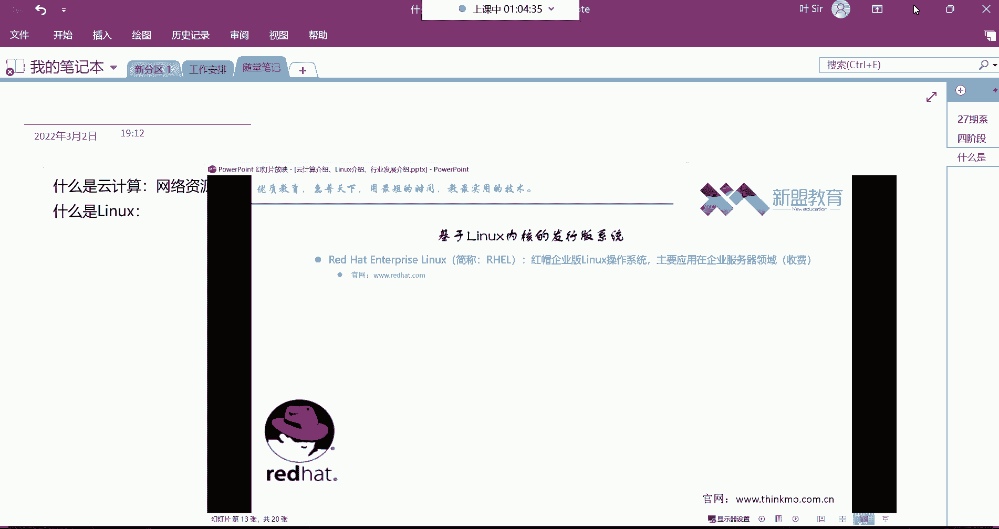

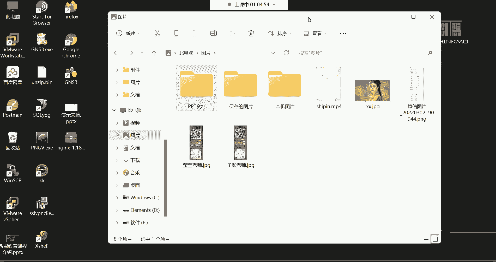

*   **Red Hat Enterprise Linux (RHEL)**
    *   **特点**：红帽公司推出的企业级收费发行版。用户支付的主要是**服务费**，可获得包括安全补丁、技术支持、定期巡检等专业服务。
    *   **应用领域**：企业服务器市场的主流选择，追求高稳定性和商业支持。

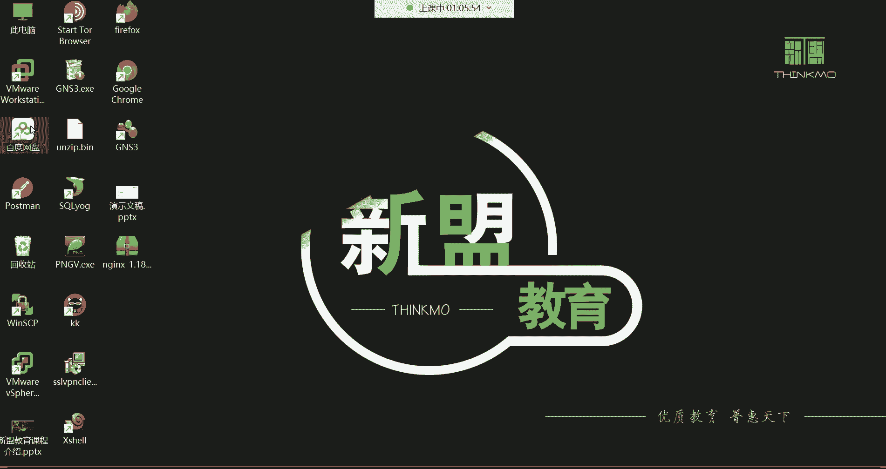

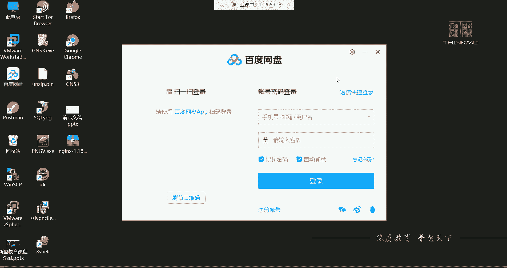

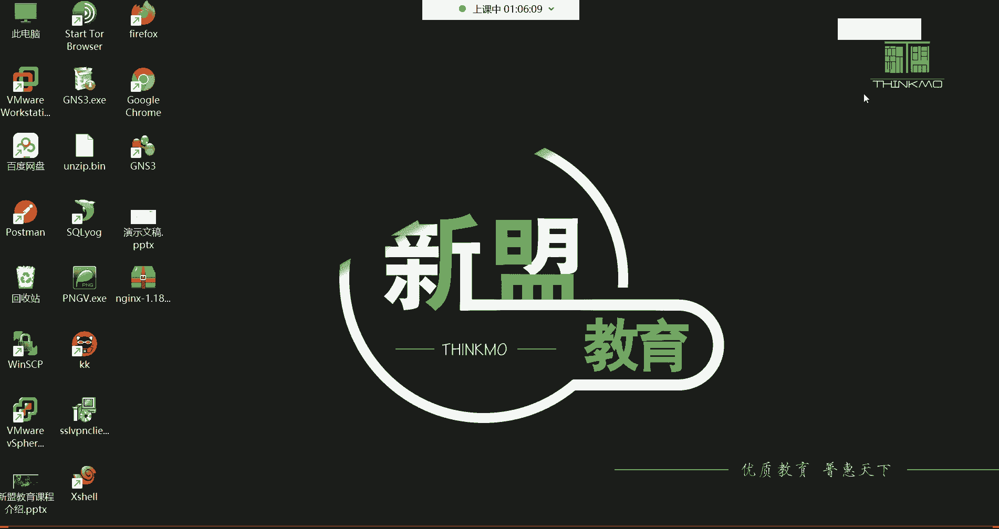

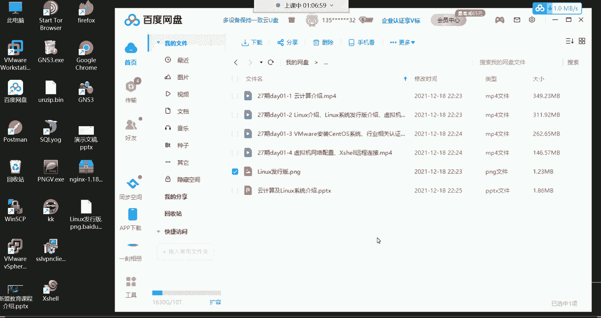

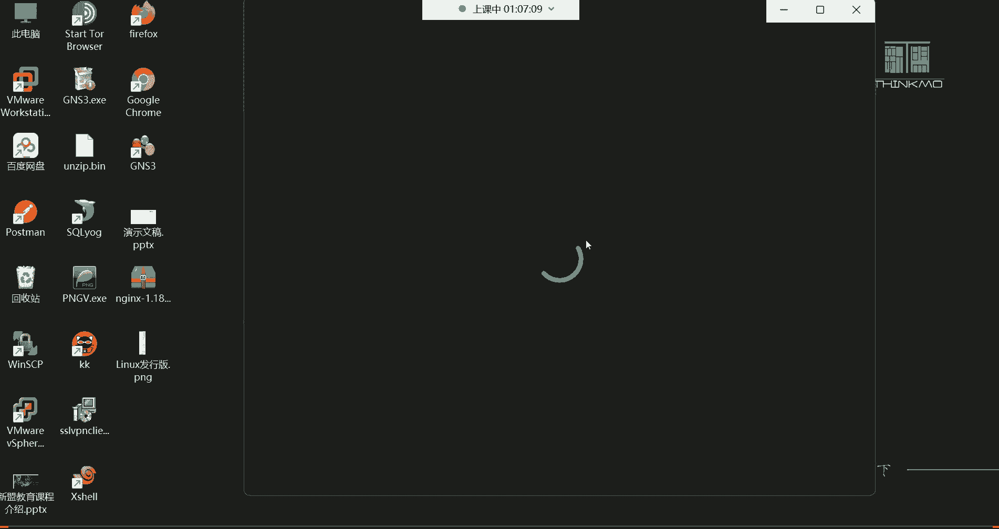

*   **CentOS**
    *   **特点**：RHEL的**社区免费克隆版**。它剔除RHEL的商标和商业软件，但保持与RHEL高度的二进制兼容性。
    *   **应用领域**：免费且稳定，是学习、测试和许多企业服务器环境的理想选择，但无官方商业支持。

*   **Fedora**
    *   **特点**：红帽赞助的社区发行版，以**技术前沿**著称。新特性会先在Fedora中测试，稳定后再引入RHEL。
    *   **应用领域**：适合开发者和技术爱好者体验最新技术。

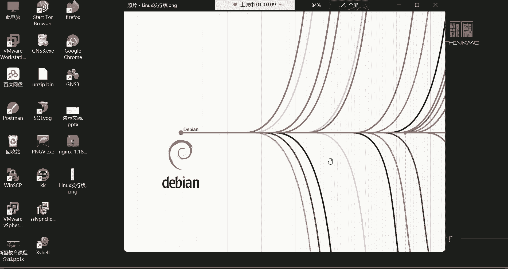

*   **Ubuntu**
    *   **特点**：基于Debian，以**用户友好**的桌面体验闻名。拥有庞大的社区和丰富的软件库。
    *   **应用领域**：个人桌面、开发环境及云计算平台（如Ubuntu Server版）均有广泛应用。

*   **Debian**
    *   **特点**：以**稳定性**和纯粹的自由软件理念著称。更新周期较长，但非常稳定可靠。
    *   **应用领域**：是许多其他发行版（包括Ubuntu）的基础，常用于服务器和桌面。

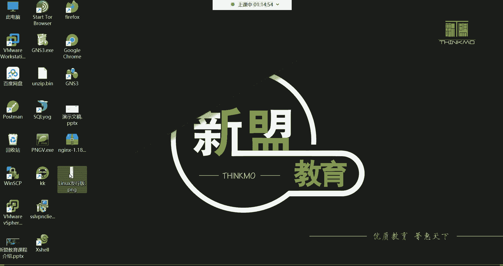

**重要提示**：在服务器领域，为了追求**高性能、高稳定性和低资源消耗**，通常会选择**最小化安装**，即不安装图形化桌面环境，完全通过命令行进行管理。因此，我们的学习将重点放在命令行操作上。

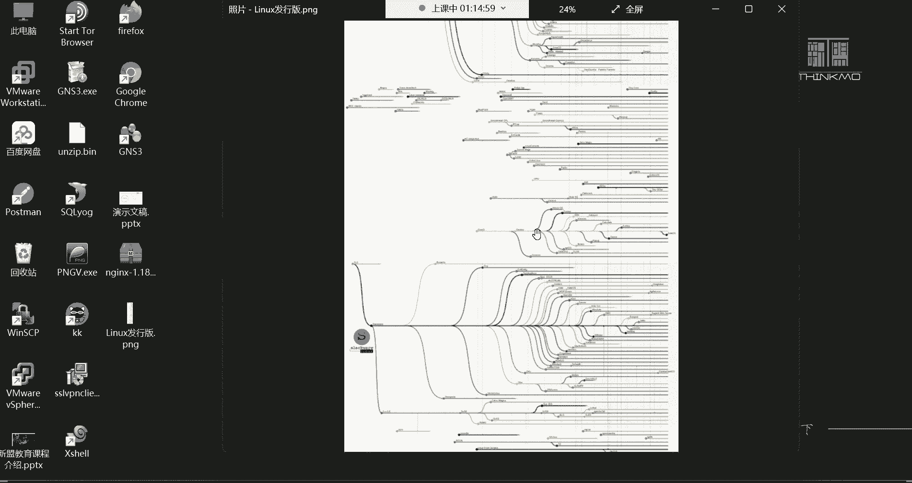

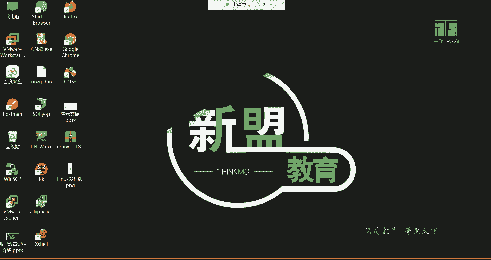

## 总结 📚

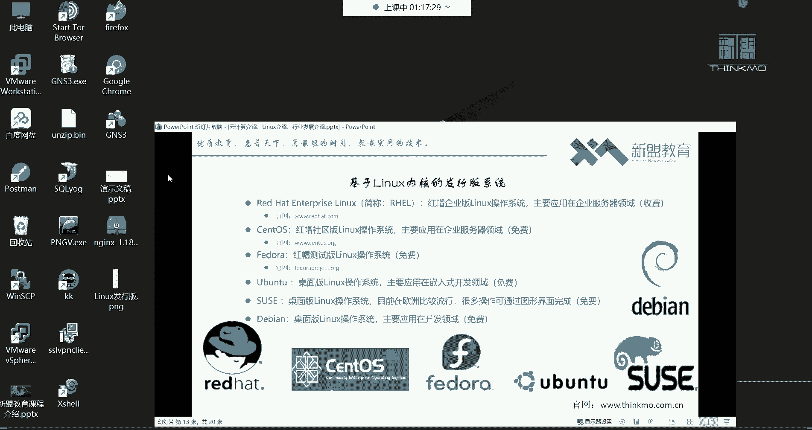

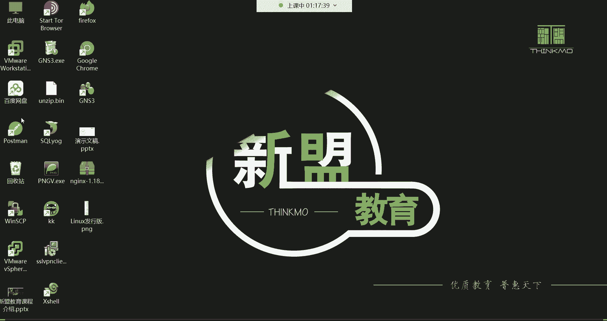

本节课中我们一起学习了：
1.  **云计算**的本质是**网络资源出租**，它提供了IaaS、PaaS、SaaS三种服务模式，极大地降低了企业和个人使用IT资源的门槛和成本。
2.  **Linux**是一个开源免费的操作系统**内核**，是众多服务器操作系统的核心。
3.  基于Linux内核，存在**RHEL、CentOS、Ubuntu**等多种发行版，它们在服务器和桌面领域各有侧重。对于运维人员，掌握以CentOS/RHEL为代表的、通过命令行管理的服务器系统是核心技能。

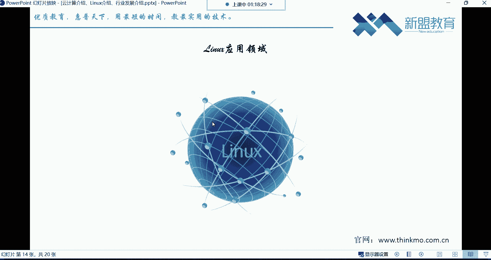

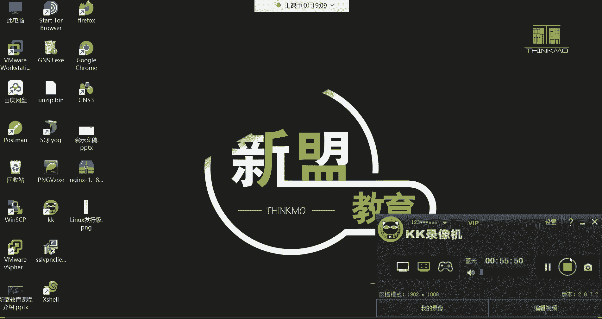

接下来，我们将动手安装一个Linux系统（CentOS），开始我们的实战之旅。