# Linux运维基础：P20：常用特殊符号与grep文件内容过滤 📚

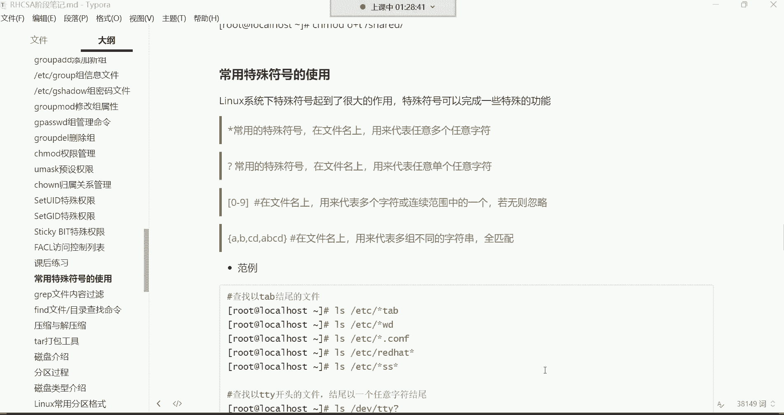

在本节课中，我们将要学习Linux系统中几个常用的特殊符号（通配符）以及`grep`命令。特殊符号能帮助我们高效地匹配文件名，而`grep`命令则用于在文件内容中快速查找特定字符串。掌握它们是提升Linux操作效率的关键。

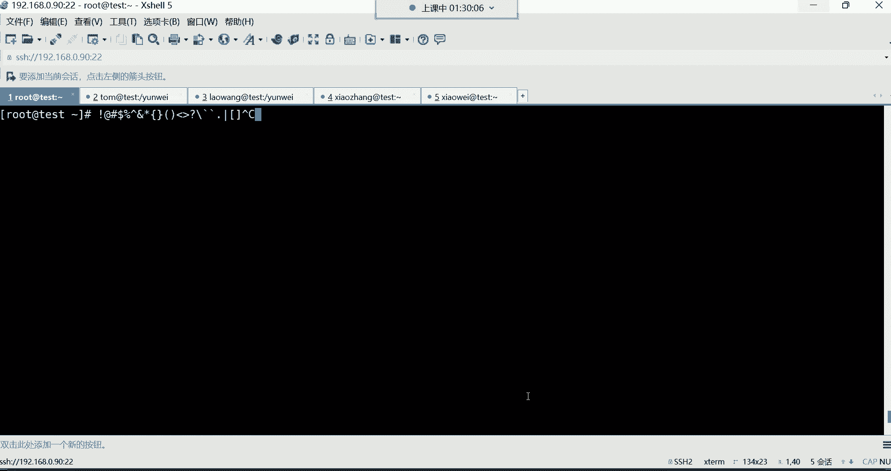

## 特殊符号概述 🔤

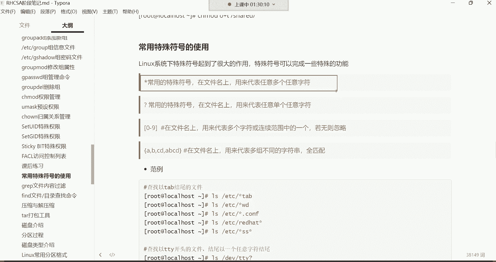

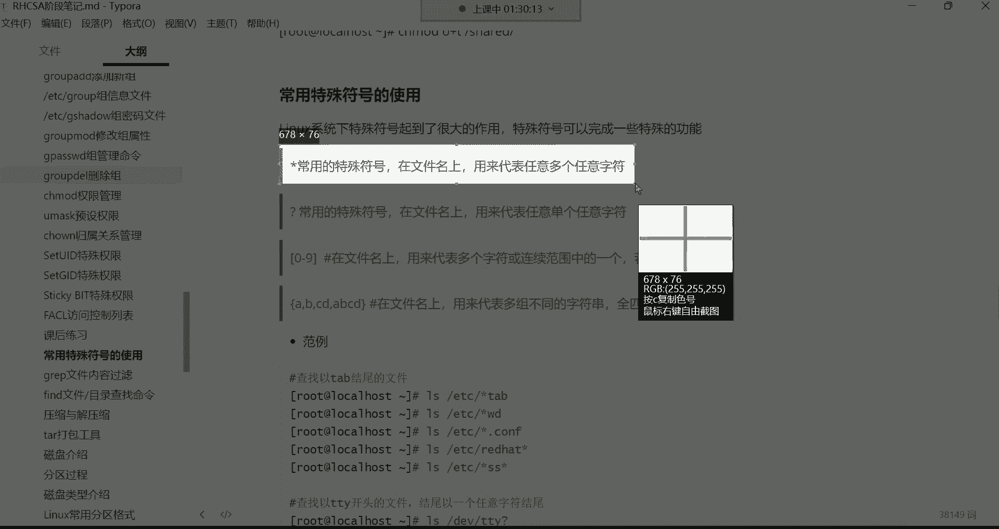

在Linux系统下，键盘上的许多符号，如 `!`、`@`、`#`、`$`、`%`、`^`、`&`、`*`、`()`、`{}`、`<>`、`?`、`/`、`\`、`` ` ``、`.` 以及管道符 `|` 等，都属于特殊符号。每种符号在系统中都有特定的含义和功能。

在初级阶段，我们主要学习其中四个：`*`（星号）、`{}`（大括号）、`?`（问号）和 `[]`（中括号）。其中，`*` 和 `{}` 最为常用，是必须掌握的核心符号。

## 星号 `*`：匹配任意多个字符 ✨

星号 `*` 是一个通配符，主要用于文件名匹配。它的功能是代表**任意多个任意字符**。


这意味着：
*   **任意字符**：可以是数字、字母（大小写）或其他符号。
*   **任意多个**：不限制字符的长度。


**公式/代码示例：**
*   `ls /etc/pass*`：列出 `/etc` 目录下所有以 `pass` 开头的文件。
*   `cp /var/log/*.log /opt/`：将 `/var/log` 目录下所有以 `.log` 结尾的文件复制到 `/opt` 目录。
*   `rm -rf /*`：**危险命令！** 删除根目录下的所有文件。`*` 在这里代表所有文件。

`*` 非常灵活，可以放在文件名开头、结尾或中间进行模糊匹配，常用于文件搜索和批量操作。

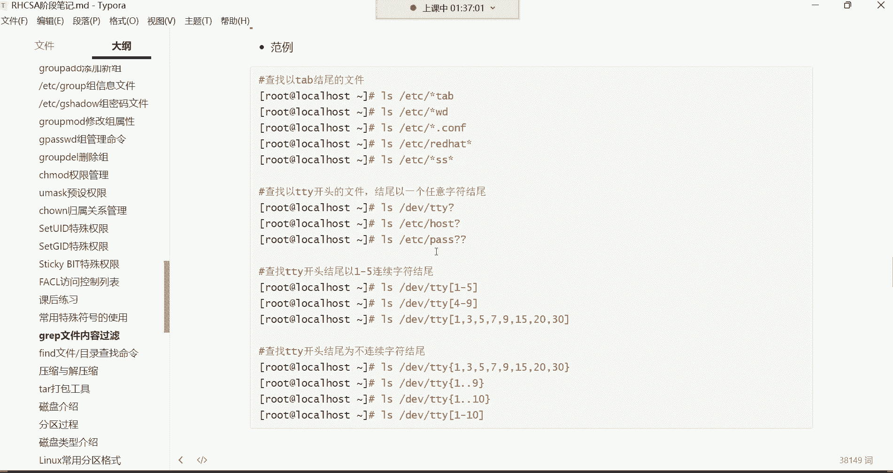


## 问号 `?`：匹配单个任意字符 ❓

问号 `?` 同样用于文件名匹配，但它代表**任意单个字符**。


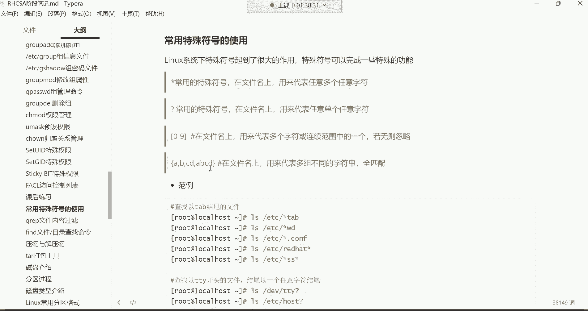

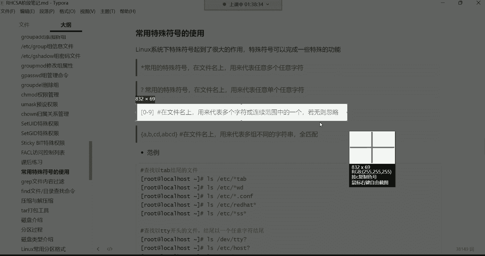

**公式/代码示例：**
*   `ls /dev/tty?`：列出 `/dev` 目录下以 `tty` 开头且后面紧跟**恰好一个字符**的文件（如 `tty0`, `tty1`, `ttya`）。
*   `ls /dev/tty??`：列出以 `tty` 开头且后面紧跟**恰好两个字符**的文件。

`?` 对匹配的字符数量有精确要求，一个 `?` 对应一个字符。它在日常中使用频率相对较低。

## 中括号 `[]`：匹配指定范围内的一个字符 📦

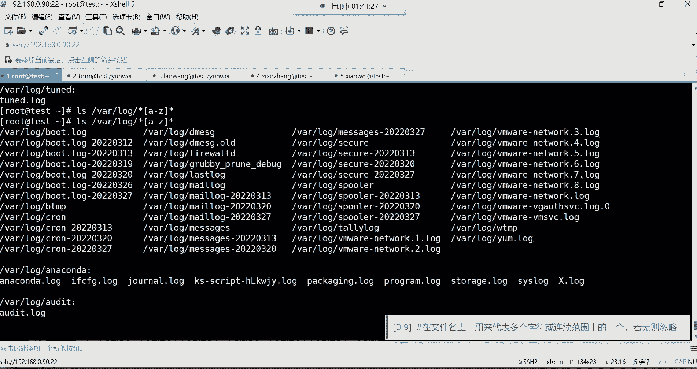


中括号 `[]` 用于匹配文件名中**位于指定字符集或连续范围内的一个字符**。

**公式/代码示例：**
*   `ls /var/log/*[0-9]*`：列出 `/var/log` 目录下文件名中包含任意数字（0到9）的文件。
*   `ls /dev/tty[0-9]`：列出 `/dev` 目录下以 `tty` 开头，且最后一个字符是0到9之间任意一个数字的文件。

`[]` 主要用于匹配数字或字母的连续范围（如 `[a-z]`, `[A-Z]`, `[0-9]`）。但它在匹配非连续或不规则字符集时功能有限。

## 大括号 `{}`：生成序列或匹配多组字符 🧱

大括号 `{}` 功能强大，常用于**生成一个序列**或**匹配多组不同的字符串**，尤其在处理数字序列时非常高效。


**公式/代码示例：**
*   `touch test{1..100}.txt`：快速创建100个文件，名为 `test1.txt`, `test2.txt`, ..., `test100.txt`。
*   `rm -rf test{1..50}.txt`：删除前50个 `test` 文件。
*   `ls /etc/*.{conf,cfg}`：列出 `/etc` 目录下以 `.conf` 或 `.cfg` 结尾的文件。

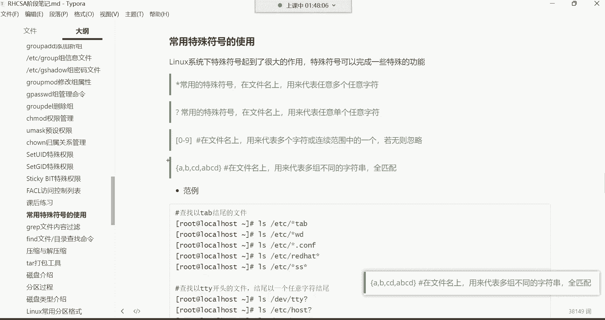

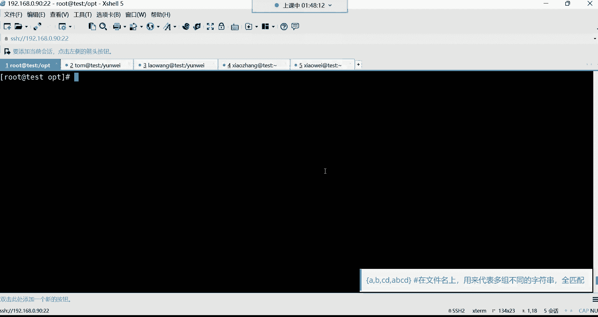

`{}` 在批量创建、删除文件或脚本编写中极为常用。它内部使用 `..` 表示连续范围，使用 `,` 分隔不连续的项。


上一节我们介绍了用于文件名匹配的特殊符号，本节中我们来看看如何深入文件内部查找内容。


## `grep` 命令：过滤文件内容 🔍


`grep` 命令用于在文件中搜索并显示包含指定字符串的行。当文件内容很多时，使用 `grep` 可以快速定位信息，而无需人工逐行查看。

其基本语法为：
```bash
grep [选项] “搜索字符串” 文件名
```

### 常用选项介绍

以下是 `grep` 命令的几个常用选项：

*   **`-n`**：显示匹配行所在的行号。
    ```bash
    grep -n “root” /etc/passwd
    ```

*   **`-i`**：忽略搜索字符串的大小写。
    ```bash
    grep -i “user” /etc/passwd
    ```

*   **`-v`**：反向选择，即显示**不包含**搜索字符串的所有行。
    ```bash
    grep -v “^#” /etc/default/grub # 排除所有以#开头的注释行
    ```

### 结合正则表达式增强搜索

`grep` 可以结合简单的正则表达式符号进行更精确的搜索：

*   **`^`**：匹配以指定字符串开头的行。
    ```bash
    grep “^root” /etc/passwd # 只显示以”root”开头的行
    ```

*   **`$`**：匹配以指定字符串结尾的行。
    ```bash
    grep “/bin/bash$” /etc/passwd # 显示使用bash shell的用户
    ```

*   **`^$`**：匹配空行。
    ```bash
    grep “^$” /etc/login.defs | wc -l # 统计文件中的空行数
    ```

### 灵活运用：组合命令与管道

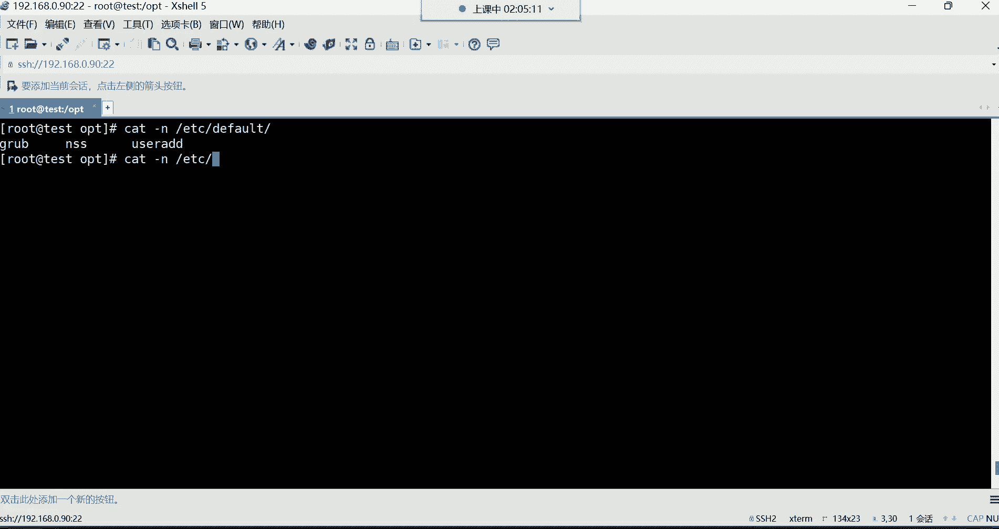


`grep` 的强大之处在于它能与其他命令通过管道 `|` 结合使用。

**公式/代码示例：**
*   从命令输出中过滤信息：
    ```bash
    free -h | grep “Mem” # 仅显示内存使用情况的行
    ifconfig | grep “inet” # 仅显示IP地址信息
    ```
*   组合使用进行复杂过滤（例如，查看有效配置行）：
    ```bash
    grep -v “^#” /etc/login.defs | grep -v “^$” | head -20
    # 第一步：排除所有注释行（以#开头）
    # 第二步：排除所有空行
    # 第三步：显示前20行结果
    ```

## 总结 📝


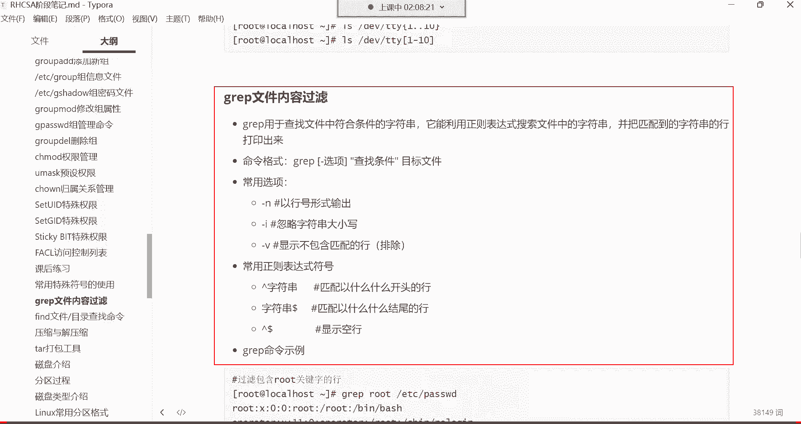

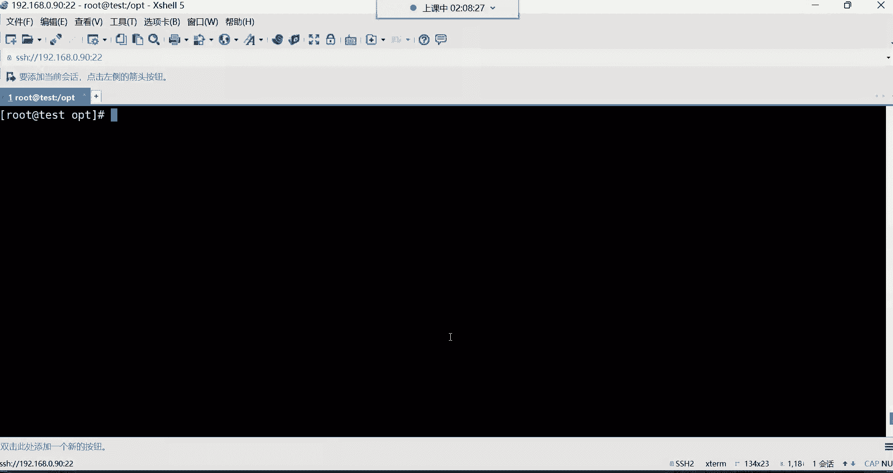

本节课中我们一起学习了Linux运维中两个非常实用的知识点：

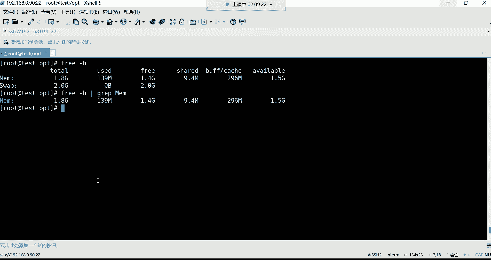

1.  **常用特殊符号（通配符）**：我们掌握了 `*`（匹配任意多个字符）、`?`（匹配单个字符）、`[]`（匹配指定范围字符）和 `{}`（生成序列）的基本用法。其中 `*` 和 `{}` 是必须熟练掌握的核心符号。


2.  **`grep` 文件内容过滤命令**：我们学习了如何使用 `grep` 在文件内快速查找字符串，了解了 `-n`、`-i`、`-v` 等常用选项，以及如何结合 `^`、`$` 进行行首行尾匹配。更重要的是，我们掌握了将 `grep` 通过管道 `|` 与其他命令组合使用的技巧，这能极大地提升命令行工作效率。

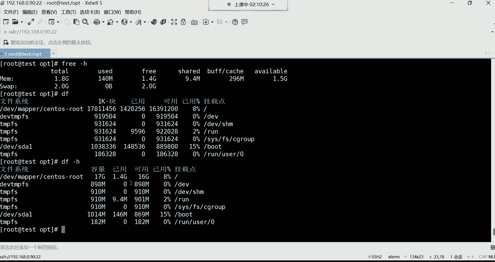

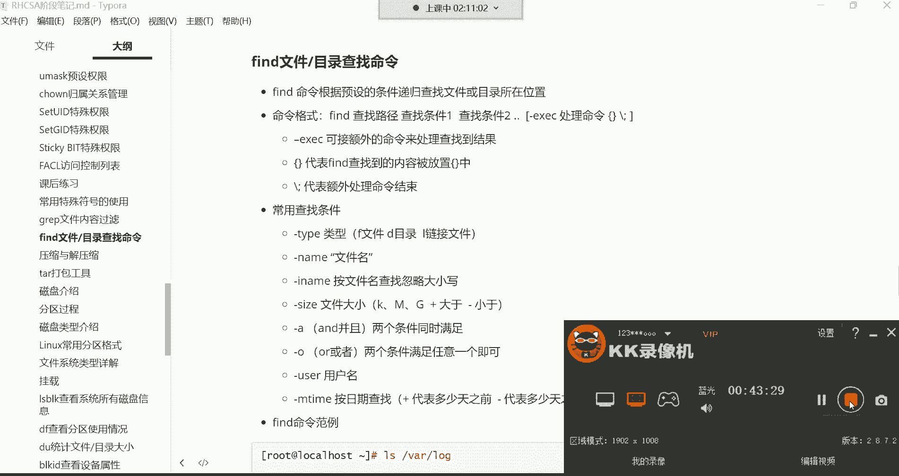

熟练掌握通配符和 `grep`，将使你在文件管理和日志分析等日常运维工作中更加得心应手。