# Linux运维基础：P21：find文件查找命令详解 🔍

在本节课中，我们将要学习Linux系统中一个非常强大的文件查找命令——`find`。我们将从基本格式开始，逐步学习如何根据不同类型、名称、大小、用户和时间等条件来精确查找文件，并了解如何对查找结果进行进一步处理。掌握`find`命令是高效进行系统管理和文件操作的关键技能。

## 命令格式与基本查找

`find`命令的基本格式是：`find [查找路径] [查找条件]`。你需要先告诉它从哪里开始找，然后指定查找的条件。

以下是几种最常用的查找条件：

### 按类型查找 (`-type`)

`-type`选项用于指定查找目标的类型。常见的类型有：
*   `f`： 代表普通文件。
*   `d`： 代表目录。
*   `l`： 代表符号链接文件。

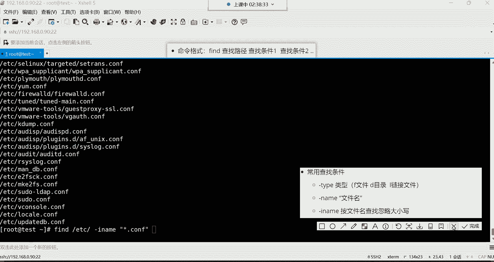


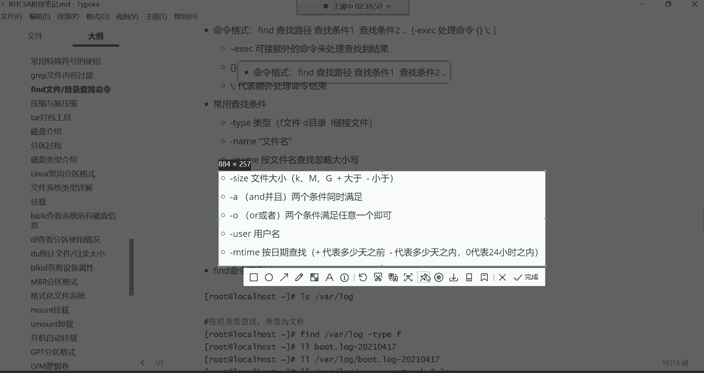

例如，要在`/var/log`目录下查找所有普通文件，命令是：
```bash
find /var/log -type f
```
`find`命令会进行**递归查找**，这意味着它不仅会搜索你指定的目录，还会深入该目录下的所有子目录进行查找。

### 按名称查找 (`-name`)

`-name`选项允许你根据文件名进行查找。你可以使用通配符`*`进行模糊匹配，但通常需要用引号将模式括起来。

例如，查找`/var/log`目录下所有以`.log`结尾的文件：
```bash
find /var/log -name “*.log”
```
这与`ls /var/log/*.log`的区别在于，`ls`只列出当前目录下的匹配项，而`find`会递归查找所有子目录。

### 忽略大小写按名称查找 (`-iname`)


如果你不确定文件名的大小写，可以使用`-iname`选项，它会忽略大小写进行匹配。
```bash
find /path -iname “filename”
```

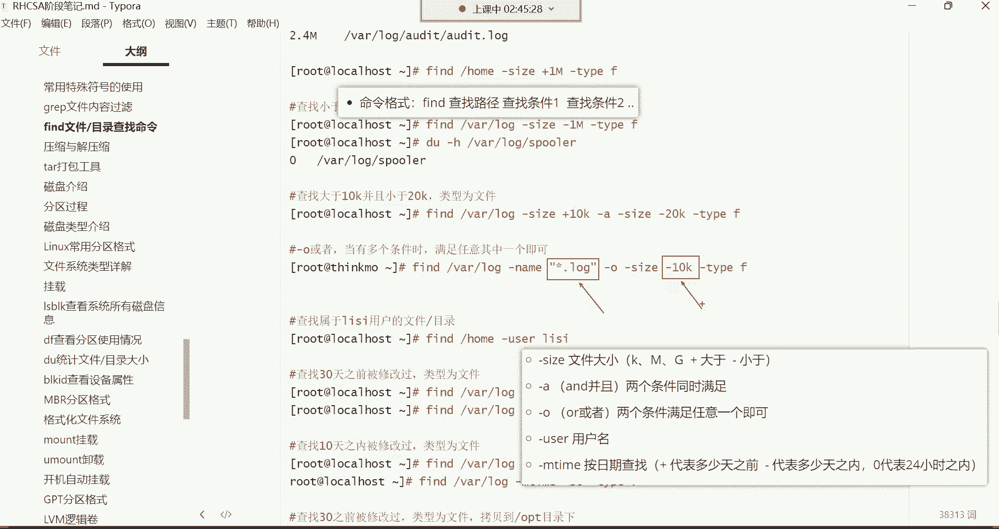

## 进阶查找条件

上一节我们介绍了按类型和名称查找，本节中我们来看看如何根据文件大小、用户和时间等更具体的属性进行查找。

### 按文件大小查找 (`-size`)

`-size`选项用于根据文件大小查找。单位可以是`k`（千字节）、`M`（兆字节）、`G`（吉字节）。`+`号表示“大于”，`-`号表示“小于”。

例如，查找`/var/log`目录下大于10KB的普通文件：
```bash
find /var/log -size +10k -type f
```
查找小于10KB的文件：
```bash
find /var/log -size -10k
```

### 按用户查找 (`-user`)

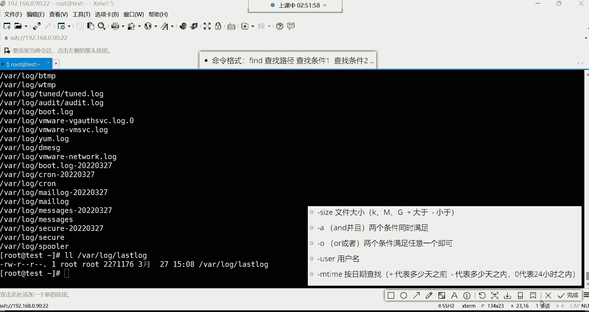

`-user`选项可以查找属于特定用户的文件。


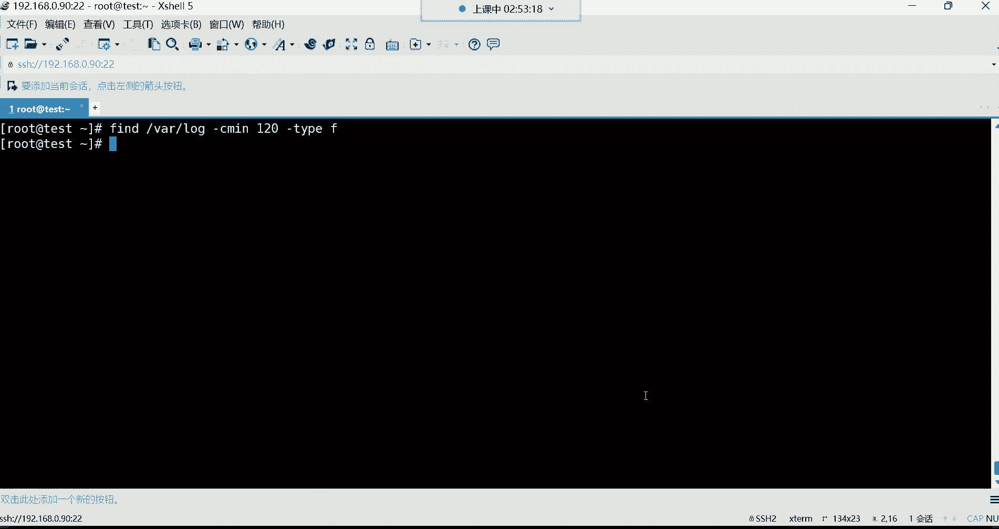

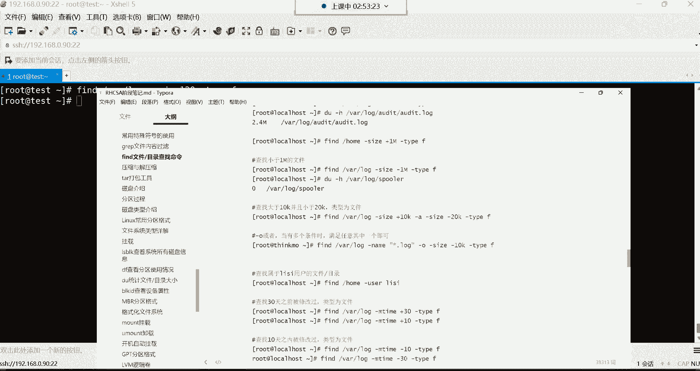


例如，查找系统中所有属于用户`tom`的文件：
```bash
find / -user tom
```


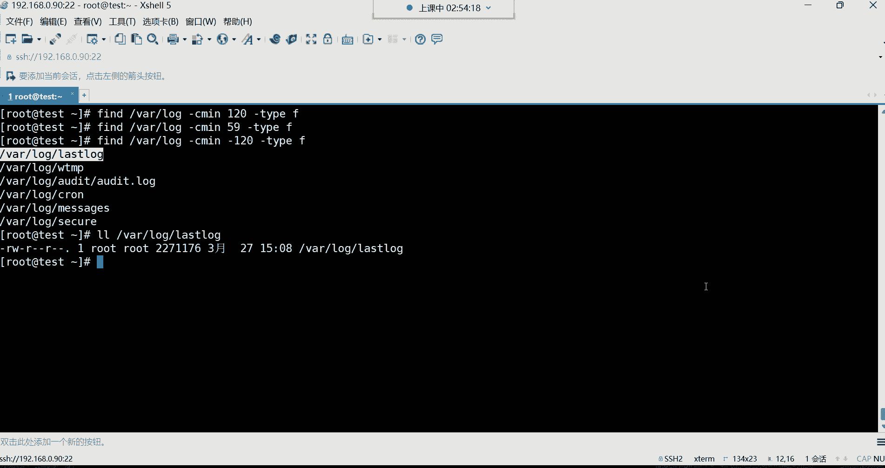

### 按修改时间查找 (`-mtime`)


`-mtime`选项用于根据文件的最后修改时间查找。`+n`表示`n`天之前，`-n`表示`n`天之内。

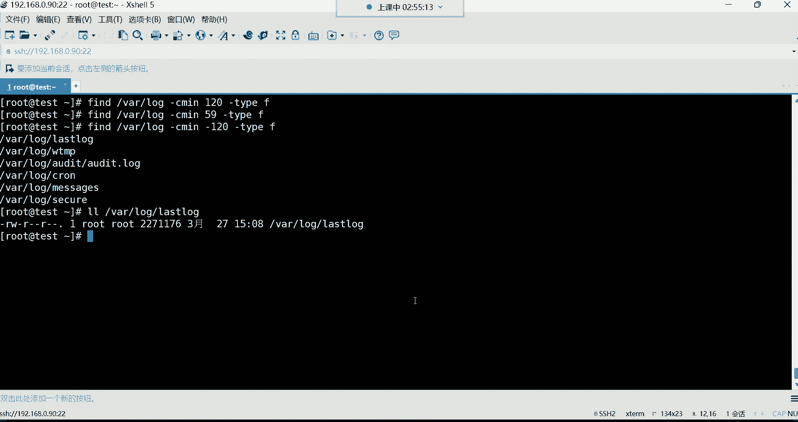

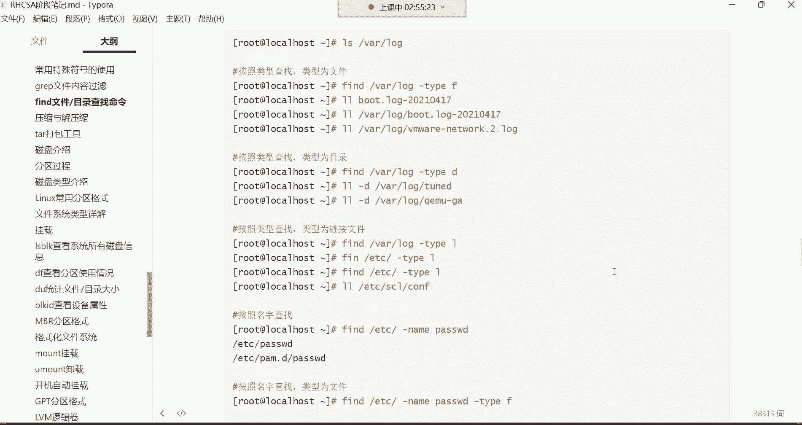


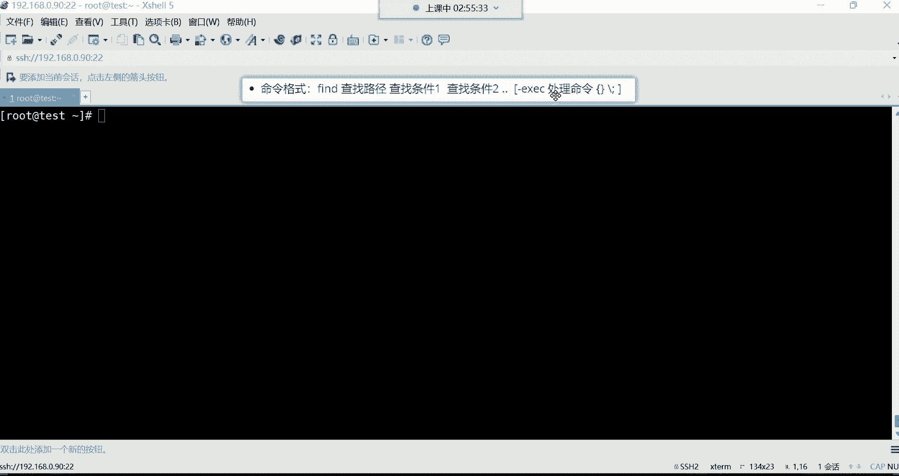

例如，查找`/var/log`目录下10天之前被修改过的文件：
```bash
find /var/log -mtime +10 -type f
```
查找24小时（1天）之内被修改过的文件：
```bash
find /var/log -mtime -1
```
对于更精确的时间（如分钟级），可以使用`-cmin`选项（按状态改变时间）或`-mmin`选项（按修改时间）。例如，查找120分钟之内被修改过的文件：
```bash
find /var/log -mmin -120
```


### 组合条件查找 (`-a`, `-o`)

你可以使用`-a`（and，与）和`-o`（or，或）来组合多个查找条件。

*   `-a`： 两个条件必须同时满足。
*   `-o`： 满足任意一个条件即可。

例如，查找大小在10KB到20KB之间的文件：
```bash
find /var/log -size +10k -a -size -20k -type f
```
查找文件名以`.log`结尾**或**大小小于10KB的文件：
```bash
find /var/log -name “*.log” -o -size -10k -type f
```


## 对查找结果进行操作

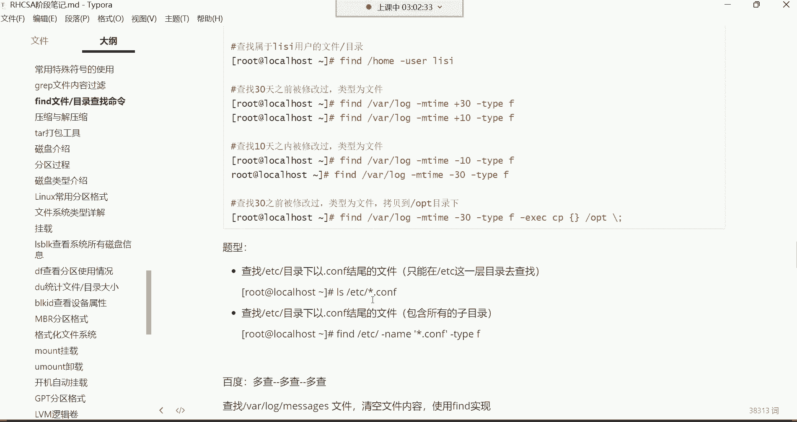

`find`命令查找到文件后，我们经常需要对它们进行一些操作，比如复制、移动或删除。由于`find`命令对管道符`|`的支持不友好，它提供了`-exec`选项来直接处理查找结果。

`-exec`的完整语法是：`find ... -exec 命令 {} \;`。其中，`{}`代表`find`找到的每一个文件，`\;`表示命令结束。

以下是几个常见操作：

*   **复制文件**： 将查找到的文件备份到`/opt`目录。
    ```bash
    find /var/log -name “*.log” -exec cp {} /opt \;
    ```
*   **移动文件**： 将查找到的文件移动到`/opt`目录。
    ```bash
    find /var/log -name “*.log” -exec mv {} /opt \;
    ```
*   **删除文件**： **请谨慎操作！** 删除查找到的文件。
    ```bash
    find /tmp -name “*.tmp” -exec rm {} \;
    ```
*   **清空文件内容**： 这是一个实用技巧。利用Linux的“黑洞”设备`/dev/null`（任何写入它的数据都会消失），可以清空文件内容。
    ```bash
    find /var/log -size +10k -type f -exec cp /dev/null {} \;
    ```
    这条命令用空设备`/dev/null`的内容覆盖目标文件，从而达到清空的效果。

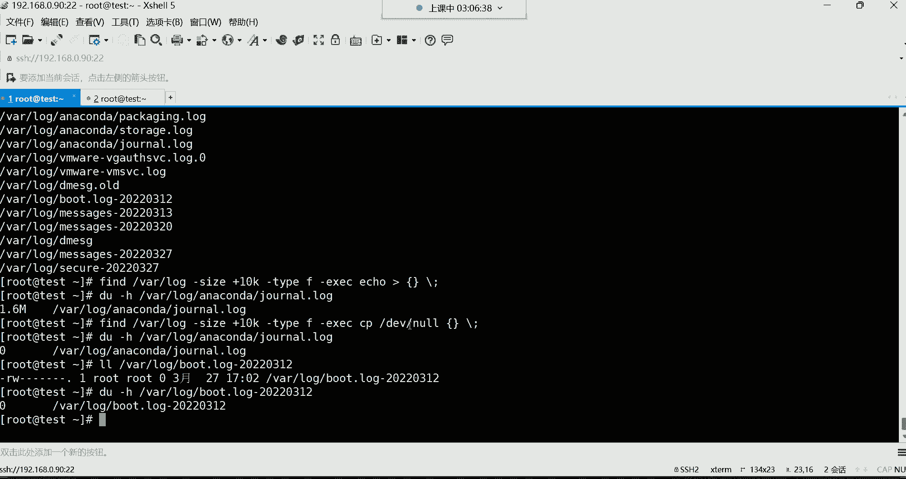

## 总结

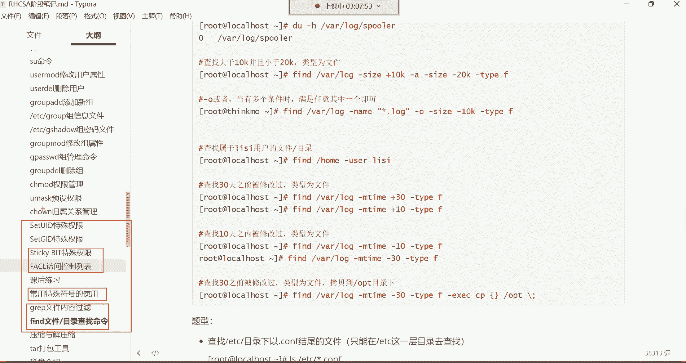

本节课中我们一起学习了Linux中功能强大的`find`文件查找命令。我们从其基本命令格式入手，逐步掌握了如何根据文件类型(`-type`)、名称(`-name`, `-iname`)、大小(`-size`)、所属用户(`-user`)以及修改时间(`-mtime`, `-mmin`)等多种条件来定位文件。我们还学习了如何使用`-a`和`-o`组合复杂条件，以及最重要的，如何使用`-exec`选项对查找结果执行复制、移动、删除或清空等操作。

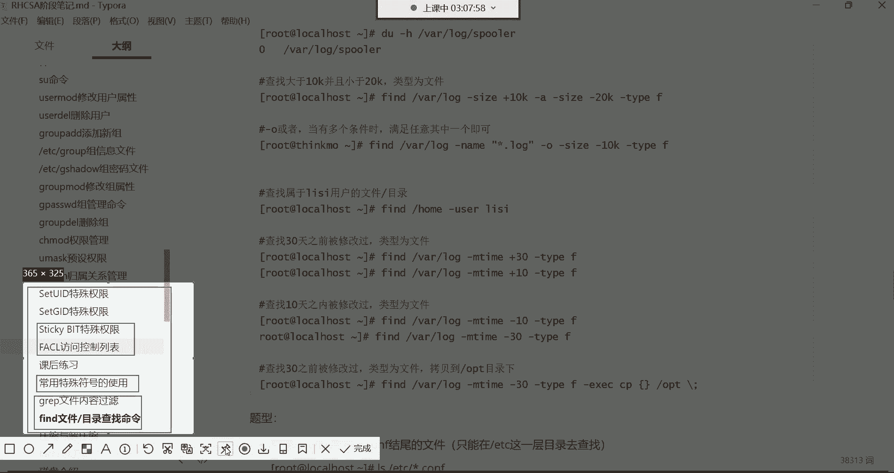

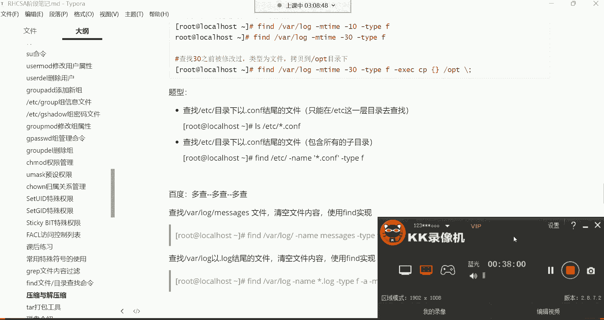

`find`命令参数较多，初学可能感到复杂，但通过反复练习，它将成为你管理系统文件的得力工具。请务必多加练习，特别是`-exec`和组合条件的使用，以加深理解和记忆。