# Linux运维入门：P26：开机自动挂载、GPT分区、LVM逻辑卷 📚

在本节课中，我们将要学习Linux系统中关于存储管理的三个核心概念：开机自动挂载、GPT分区以及LVM逻辑卷。我们将从逻辑卷的原理讲起，并通过实际操作演示如何创建和使用逻辑卷，以实现存储空间的灵活扩展。

---

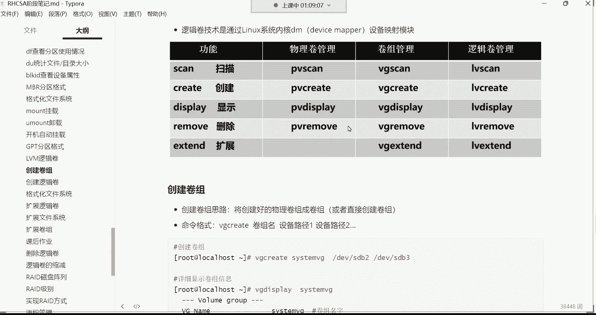

## 逻辑卷（LVM）的核心概念 💡

上一节我们介绍了分区的基本管理，本节中我们来看看更高级的存储管理技术——逻辑卷管理器（LVM）。LVM的核心优势在于能够动态调整存储空间大小，而无需重新格式化或移动数据。

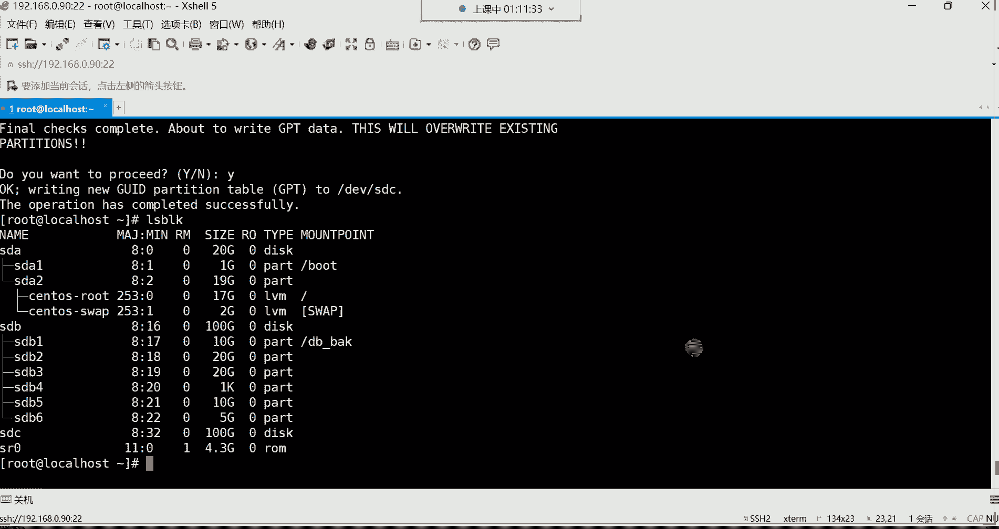

逻辑卷是一种虚拟化技术，它将底层物理硬盘（或分区）的空间聚合起来，形成一个统一的、可灵活分配的“存储池”。最终的数据存储仍需底层物理硬盘支撑，但通过LVM，我们可以轻松地对这个虚拟出来的空间进行扩容。

**核心公式/概念：**
*   **物理卷（PV）**：`/dev/sdb1`, `/dev/sdb2` (被LVM管理的物理分区或磁盘)
*   **卷组（VG）**：`system_vg` (由多个PV组成的存储池)
*   **逻辑卷（LV）**：`my_lv` (从VG中划分出来的、可供挂载使用的逻辑分区)

其工作流程可以概括为：**物理分区 -> 加入卷组（存储池） -> 从卷组中划分逻辑卷 -> 格式化并挂载使用**。

如果逻辑卷空间不足，我们可以从卷组中为其分配更多空间。如果卷组空间也不足了，我们还可以向卷组中添加新的物理硬盘或分区，从而间接为逻辑卷扩容。整个过程**不需要格式化**已有的数据分区，只有在创建逻辑卷时才需要为其赋予文件系统。

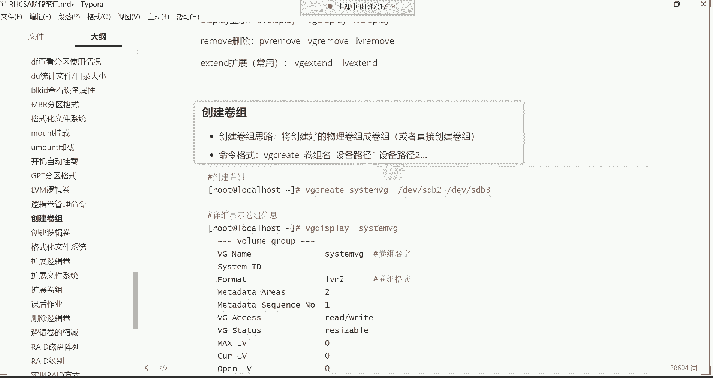

---

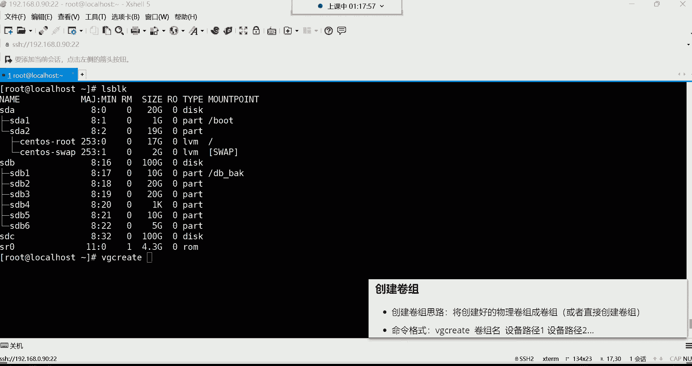

## 逻辑卷管理命令 📝

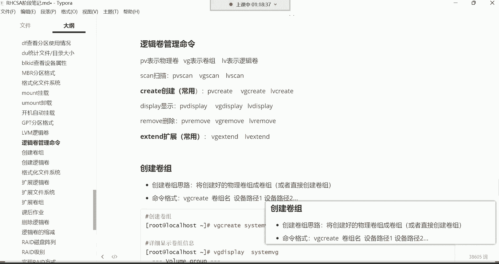

理解了原理后，我们来看看操作逻辑卷所需的命令。LVM的命令非常有规律，易于记忆。

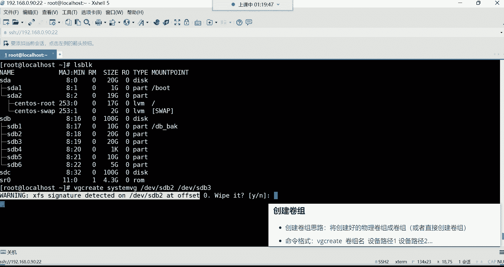

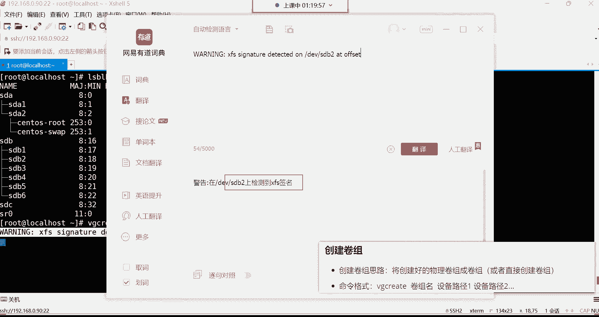

以下是LVM的常用命令分类，主要围绕创建、显示和扩展操作：

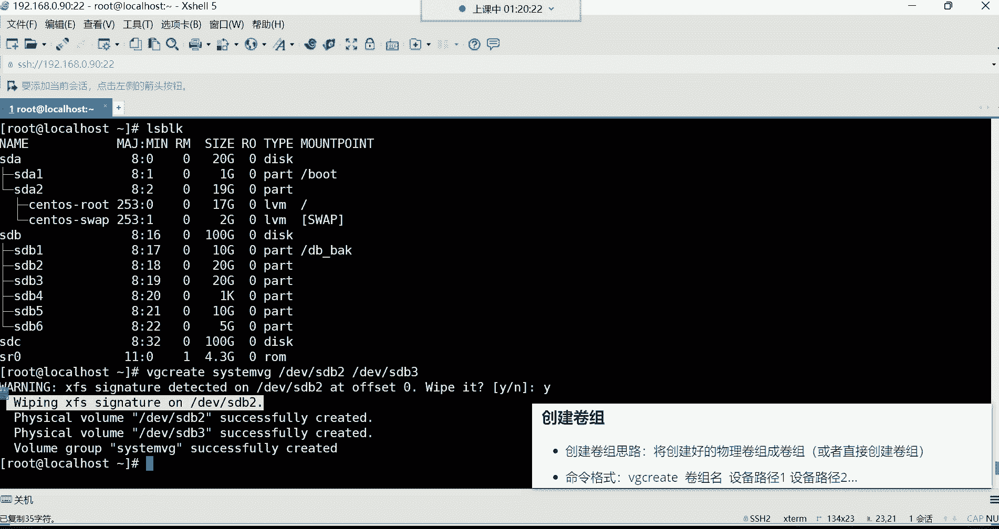

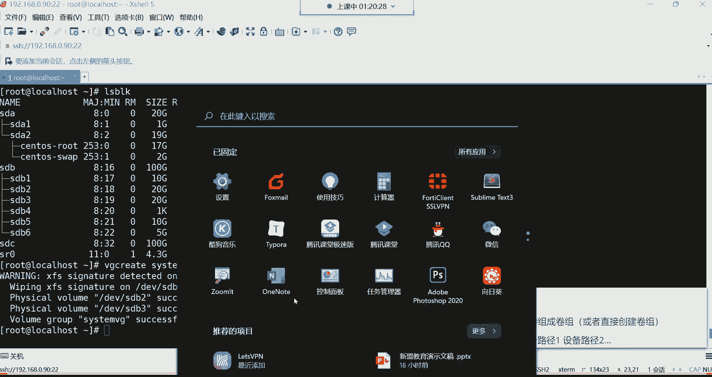

*   **创建命令**：
    *   `vg create` - 创建卷组
    *   `lv create` - 创建逻辑卷
    *   （注：在RHEL/CentOS 7及以上版本中，创建物理卷`pv create`通常由系统自动完成，无需手动执行）

*   **显示命令**：
    *   `vgs` / `vgdisplay` - 简要/详细显示卷组信息
    *   `lvs` / `lvdisplay` - 简要/详细显示逻辑卷信息

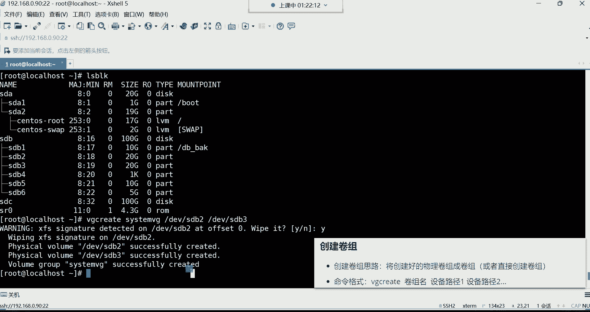

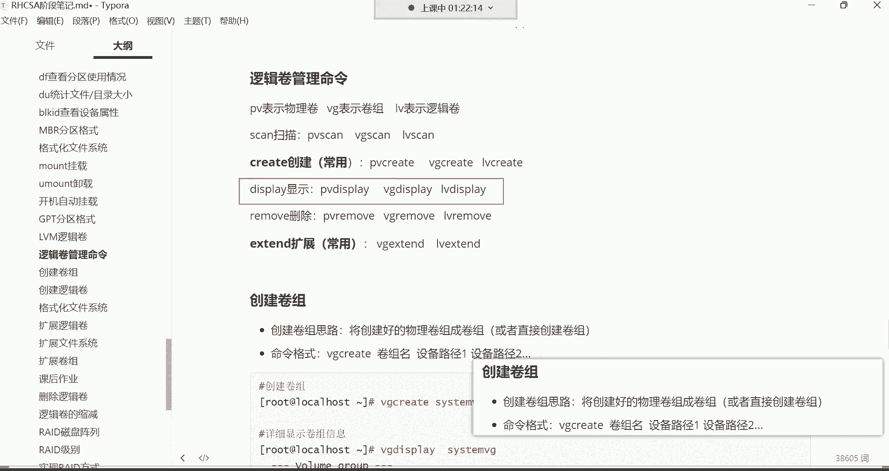

*   **扩展命令**：
    *   `lvextend` - 扩展逻辑卷空间

命令规律：以`vg`开头的管理卷组，以`lv`开头的管理逻辑卷，后面跟上操作动作（如`create`, `display`）。

---

## 实战：创建与使用逻辑卷 🛠️

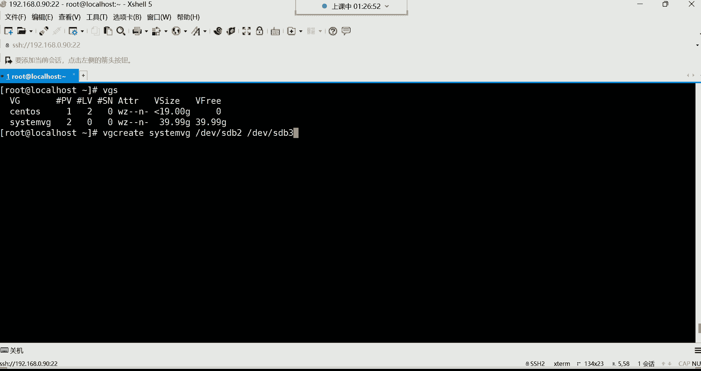

接下来，我们通过一个完整的例子来演示如何创建和使用逻辑卷。假设我们有两块20GB的分区`/dev/sdb2`和`/dev/sdb3`，我们将它们组成一个卷组，并从中创建一个20GB的逻辑卷。

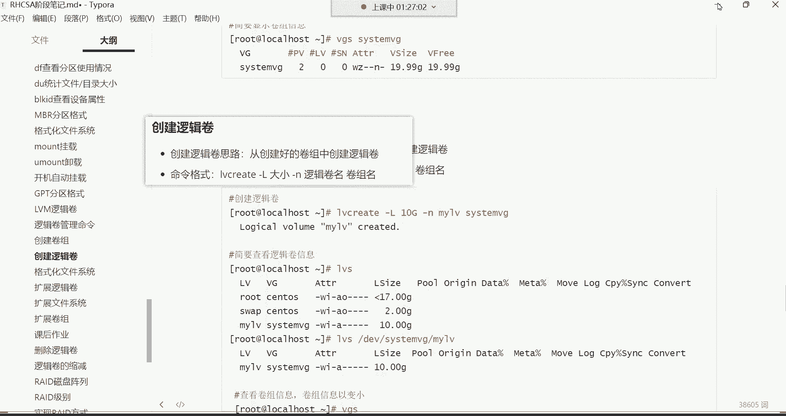

**第一步：准备环境**
首先，请确保用于创建逻辑卷的分区没有重要数据（因为过程会清除数据），并且没有被挂载。我们可以使用`fdisk`或`gdisk`删除旧分区并创建新分区，这里假设我们已经有了`sdb2`和`sdb3`两个空闲分区。

**第二步：创建卷组（VG）**
使用`vg create`命令创建卷组，将其命名为`system_vg`，并指定由`sdb2`和`sdb3`组成。
```bash
vg create system_vg /dev/sdb2 /dev/sdb3
```
系统可能会提示检测到原有文件系统签名，输入`y`确认擦除即可。命令执行成功后，会显示卷组创建成功的信息。

使用`vgs`命令可以简要查看卷组信息，确认其总空间约为40GB。

**第三步：创建逻辑卷（LV）**
在卷组`system_vg`中创建一个名为`my_lv`、大小为20GB的逻辑卷。
```bash
lv create -L 20G -n my_lv system_vg
```
*   `-L 20G`：指定逻辑卷大小为20GB。
*   `-n my_lv`：指定逻辑卷名称为`my_lv`。

使用`lvs`命令可以查看创建的逻辑卷。

**第四步：格式化并挂载逻辑卷**
逻辑卷创建后，就像一个普通分区一样，需要格式化和挂载才能使用。

1.  **格式化**：将逻辑卷格式化为XFS文件系统。
    ```bash
    mkfs.xfs /dev/system_vg/my_lv
    ```
    > **注意**：逻辑卷的设备路径位于`/dev/卷组名/逻辑卷名`。

2.  **创建挂载点并挂载**：
    ```bash
    mkdir -p /web_backup # 如果目录不存在则创建
    mount /dev/system_vg/my_lv /web_backup
    ```
    使用`df -h`命令检查挂载是否成功。

**第五步：配置开机自动挂载**
为了让逻辑卷在系统重启后自动挂载，需要编辑`/etc/fstab`文件。
```bash
vim /etc/fstab
```
在文件末尾添加如下一行：
```
/dev/system_vg/my_lv /web_backup xfs defaults 0 0
```
保存退出后，执行`mount -a`测试配置是否正确（无报错即表示正确）。

---

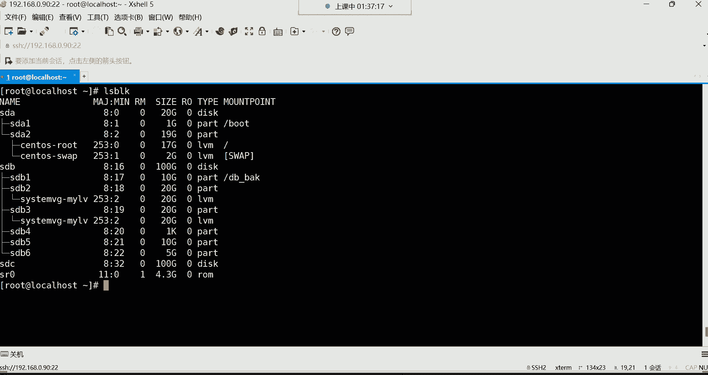


## 总结 🎯

本节课中我们一起学习了Linux存储管理中的三个重要部分：

1.  **逻辑卷（LVM）原理**：理解了PV（物理卷）、VG（卷组）、LV（逻辑卷）三层抽象模型，掌握了LVM可实现动态扩容的核心优势。
2.  **逻辑卷管理命令**：学习了`vg create`、`lv create`、`vgs`、`lvs`等有规律的常用命令。
3.  **逻辑卷实战操作**：完成了从创建卷组、创建逻辑卷、格式化文件系统到挂载及配置开机自动挂载的完整流程。

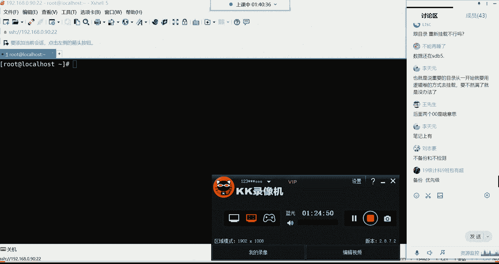

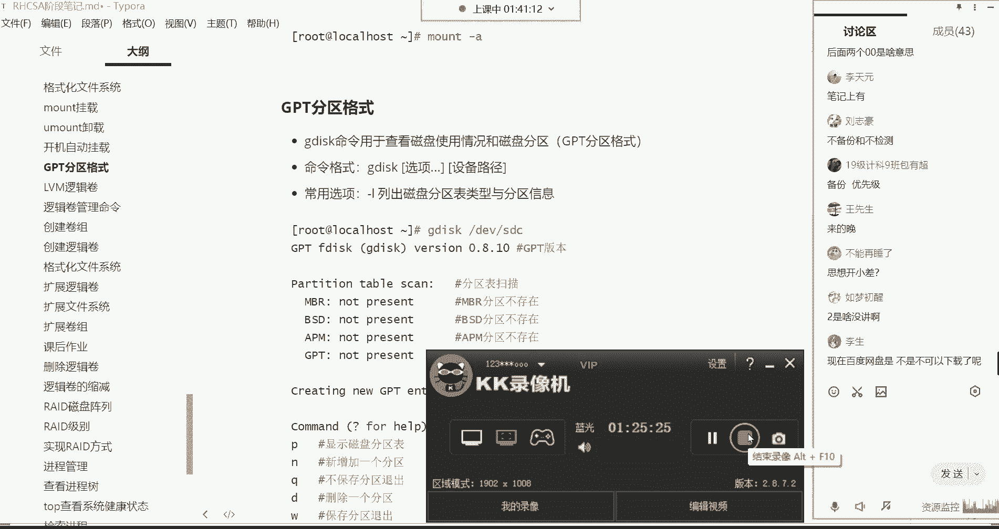

逻辑卷是企业级Linux运维中管理存储的必备技能，特别适用于需要灵活调整空间的重要目录（如`/`根目录）。请务必通过实践来巩固这些命令和概念。