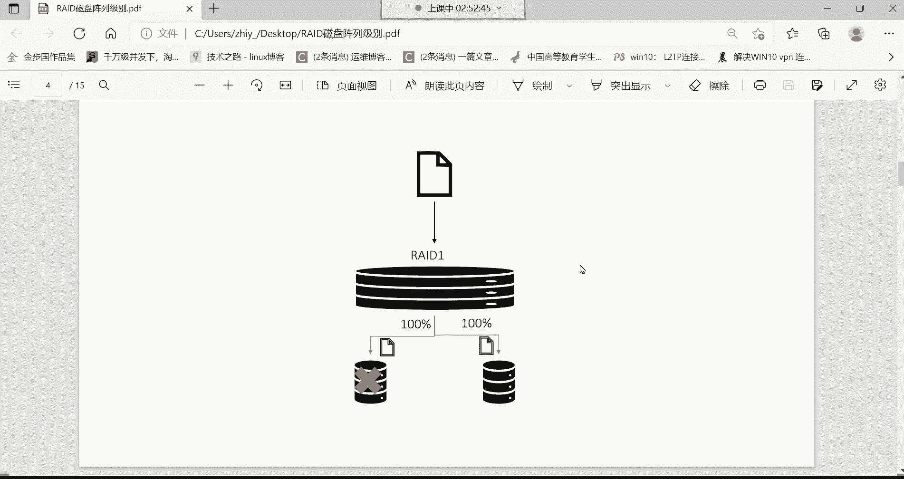
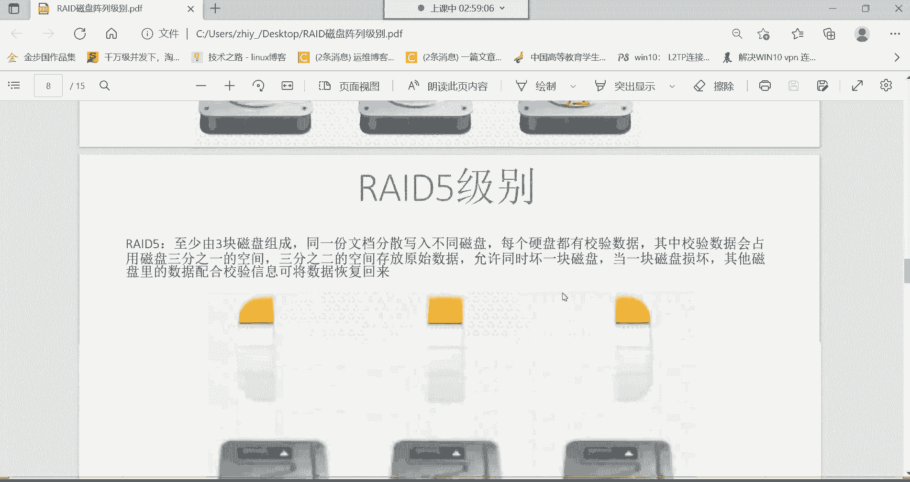
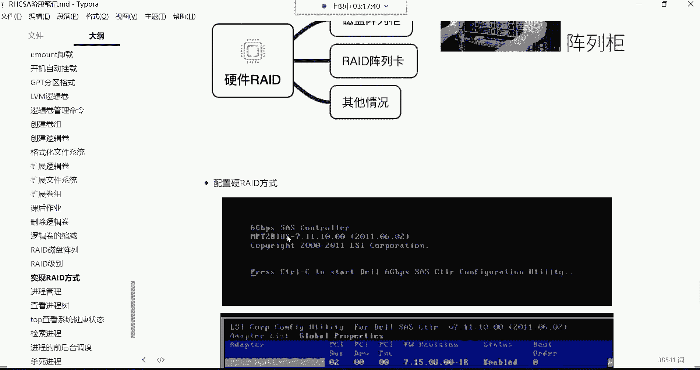
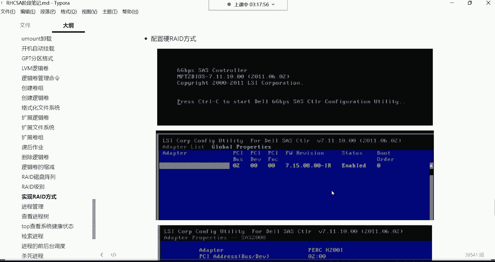
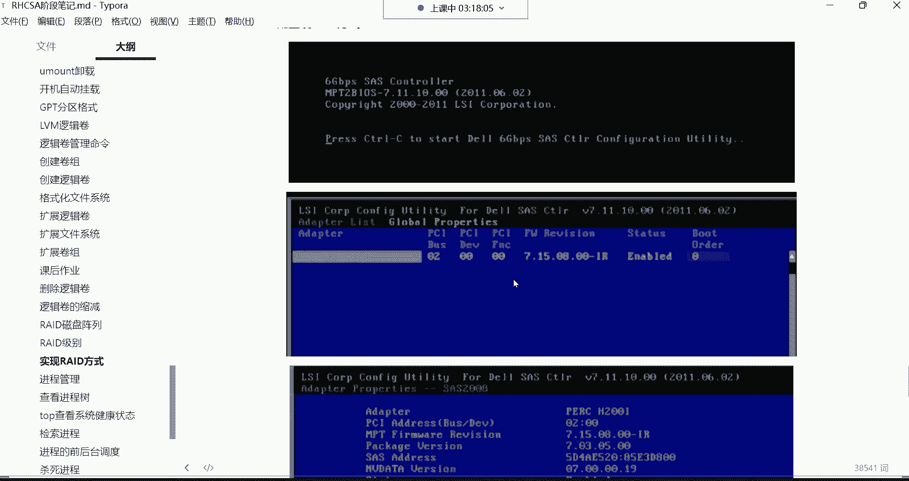
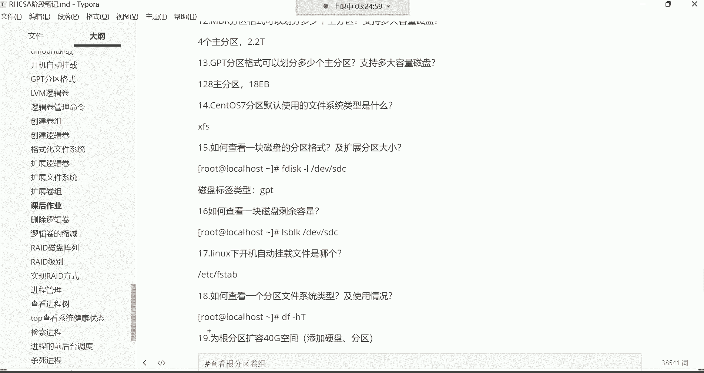

# Linux运维全套培训课程：P28：逻辑卷扩容、RAID磁盘阵列 📚

在本节课中，我们将要学习RAID磁盘阵列的核心概念、不同级别的特性以及实现方式。RAID技术是服务器存储管理中的重要组成部分，理解它对于保障数据安全和提升存储性能至关重要。

## RAID 0：条带化阵列 🚀

上一节我们介绍了逻辑卷的扩容操作，本节中我们来看看如何通过RAID技术来提升磁盘的性能和可靠性。首先，我们来了解RAID 0。

RAID 0至少需要两块磁盘组成一个阵列。数据存储时，一份文件会被等量拆分，并行写入到不同的磁盘中。这个过程称为“并行写入”。

以下是RAID 0的核心特点：
*   **并行写入**：同一份文档被等量存放在不同的磁盘。
*   **提升速度**：通过并行写入来提高数据的读写速度。例如，一个10GB的文件，如果存入单盘需要4分钟，那么在RAID 0中，文件被拆分为两份（各5GB）同时写入两块磁盘，理论上只需2分钟即可完成，速度翻倍。
*   **无冗余功能**：RAID 0仅提高了读写速度，但没有数据备份（冗余）功能。如果其中一块磁盘故障，数据将部分丢失，导致整个文件不可用。因此，RAID 0**不适合存储重要数据**。

## RAID 1：镜像阵列 🔒

了解了追求速度但缺乏安全的RAID 0后，我们再来看看追求极致安全的RAID 1。

RAID 1也至少需要两块磁盘。它的核心机制是“完全备份”。

以下是RAID 1的核心特点：
*   **完全备份**：同一份文档会被完整地复制成多份，存储在所有成员磁盘中。
*   **高可靠性**：提供了完全的数据冗余功能。任何一块磁盘损坏，数据都不会丢失，因为其他磁盘上有完整的副本。它**非常适合存储重要数据**。
*   **速度无提升**：由于需要将完整数据写入所有磁盘，写入速度没有提升，反而可能下降，并且总可用容量仅为所有磁盘总容量的一半（另一半用于存储备份）。

## RAID 5：均衡之选 ⚖️

RAID 0速度快但不安全，RAID 1安全但速度慢且容量利用率低。那么，有没有一种方案能兼顾两者呢？这就是RAID 5。

RAID 5至少需要三块磁盘组成。它结合了条带化和奇偶校验两种技术。

以下是RAID 5的核心特点：
*   **条带化与校验**：数据会被条带化（拆分）存储到多块磁盘，同时会生成并分布存储奇偶校验信息。
*   **性能与冗余兼顾**：
    *   **提升速度**：数据并行写入多块磁盘，提升了读写速度。
    *   **提供冗余**：通过奇偶校验信息，允许阵列中的**一块磁盘损坏**而数据不丢失。损坏磁盘的数据可以通过其他磁盘上的数据和校验信息计算恢复。
*   **容量利用率**：总可用容量为 `(N-1) * 单盘容量`（N为磁盘总数），即损失一块盘的容量用于存储校验信息。
*   **热备盘**：在企业环境中，常为RAID 5配置一块热备盘。当某块成员盘故障时，阵列会自动将故障盘踢出，并立即启用热备盘重建数据，保证阵列的完整性。

由于其良好的性能、可靠性和较高的磁盘利用率，**RAID 5是企业中最常用的RAID级别之一**。

## 其他RAID级别概览

除了上述级别，还有一些其他RAID级别作为了解。

*   **RAID 2/3/4**：这些级别采用复杂的校验算法，导致硬件开销大、性能不佳，在实际生产中已很少使用。
*   **RAID 6**：类似于RAID 5，但采用双重校验，至少需要四块磁盘。它允许同时损坏**两块磁盘**而数据不丢失，但校验信息占用更多空间（损失两块盘容量），性能通常低于RAID 5。
*   **RAID 10 (RAID 1+0)**：先做镜像（RAID 1），再做条带（RAID 0）。至少需要四块磁盘。它兼具RAID 1的高安全性和RAID 0的高性能，允许每个镜像对中坏掉一块盘（但不能是同一侧的两块盘）。缺点是成本高，可用容量仅为总容量的一半。

## RAID的实现方式 🛠️

了解了各级别的特性，我们来看看如何实现RAID。

实现RAID主要有三种方式：
1.  **软RAID**：通过操作系统层面的软件实现。优点是成本低，但性能较差，稳定性依赖于主机系统，主机宕机则RAID功能失效。
2.  **硬RAID（阵列卡）**：通过专用的RAID控制卡实现。这是最主流和稳定的方式。阵列卡自带处理器和缓存，不占用主机资源，性能好，功能强（如缓存加速、电池保护，在意外断电时可将缓存数据写入磁盘）。
3.  **外置磁盘阵列柜**：大型存储设备，用于高端或超大规模场景，价格昂贵。

对于一般企业服务器，**购买并安装独立的RAID卡**是性价比较高的选择。配置RAID通常在服务器启动时，根据阵列卡提示（如按 `Ctrl+R`）进入管理界面进行操作，界面通常为图形化或菜单式，可参照阵列卡说明书进行配置。

## 课程总结与作业 📝

本节课中我们一起学习了RAID磁盘阵列技术。我们探讨了从追求速度的RAID 0，到追求安全的RAID 1，再到均衡实用的RAID 5等各级别的原理与特点。我们还了解了通过软件、硬件阵列卡等方式实现RAID。

**课后作业**：请回顾之前所学的逻辑卷管理（LVM）知识，思考并尝试在实验环境中，如果根分区（假设是一个逻辑卷）空间不足，如何为其扩容40GB的空间？这需要综合运用创建物理卷、扩展卷组、扩展逻辑卷及文件系统等一系列操作。

---

**附：核心概念公式/代码摘要**
*   **RAID 0**：速度提升，无冗余。`可用容量 = N * 单盘容量`。
*   **RAID 1**：完全镜像，高安全。`可用容量 = 单盘容量`（总容量的一半）。
*   **RAID 5**：条带化+分布式校验。`可用容量 = (N - 1) * 单盘容量`，允许坏1块盘。
*   **RAID 10**：镜像+条带。`可用容量 = (N / 2) * 单盘容量`，允许特定情况坏多块盘。