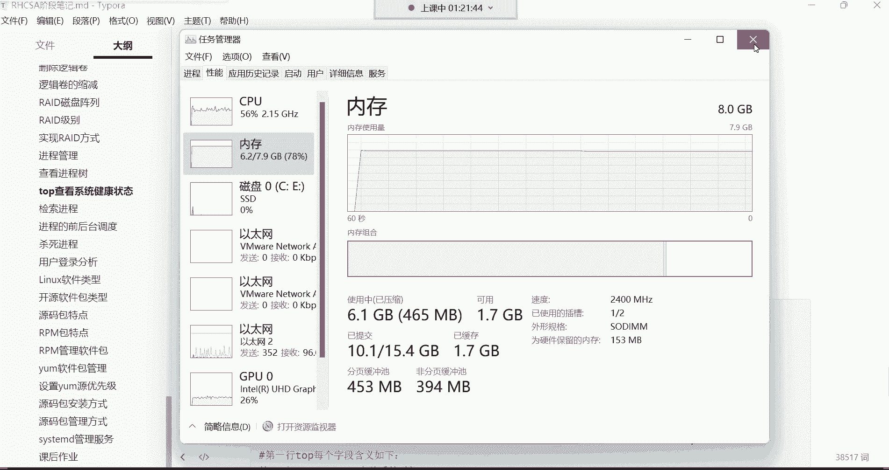
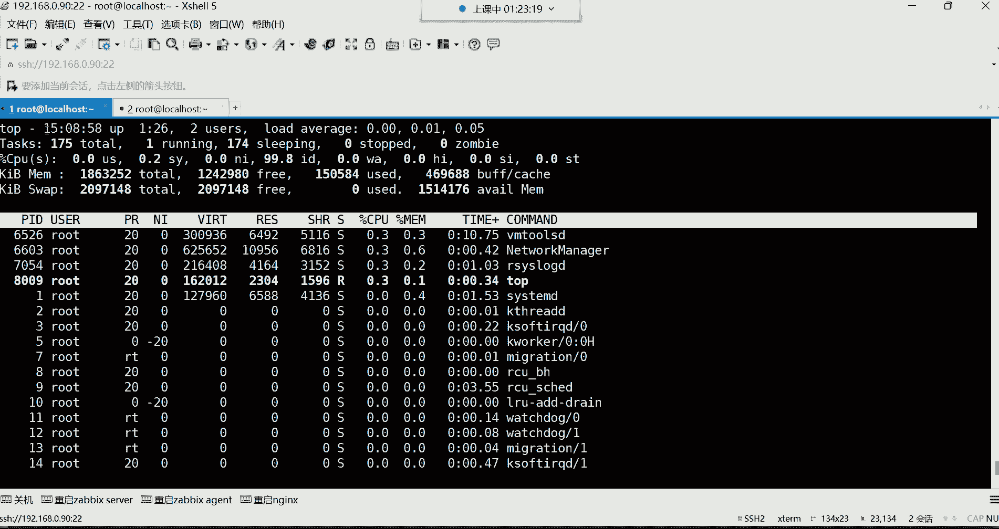
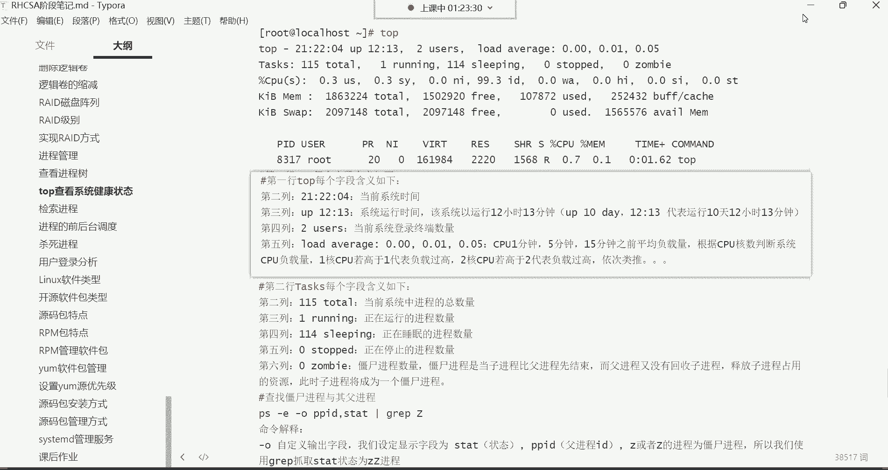
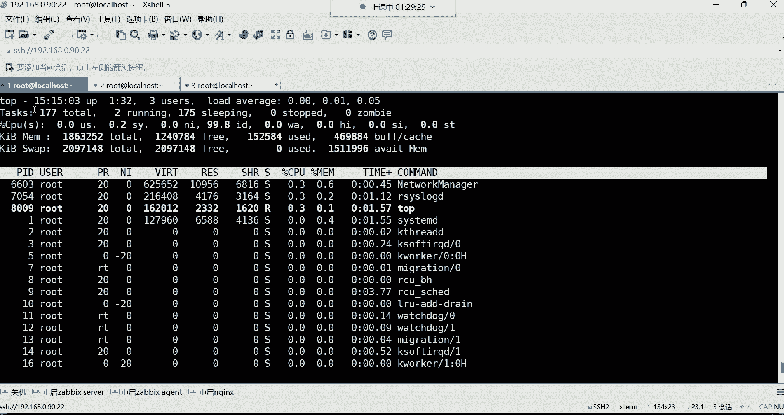
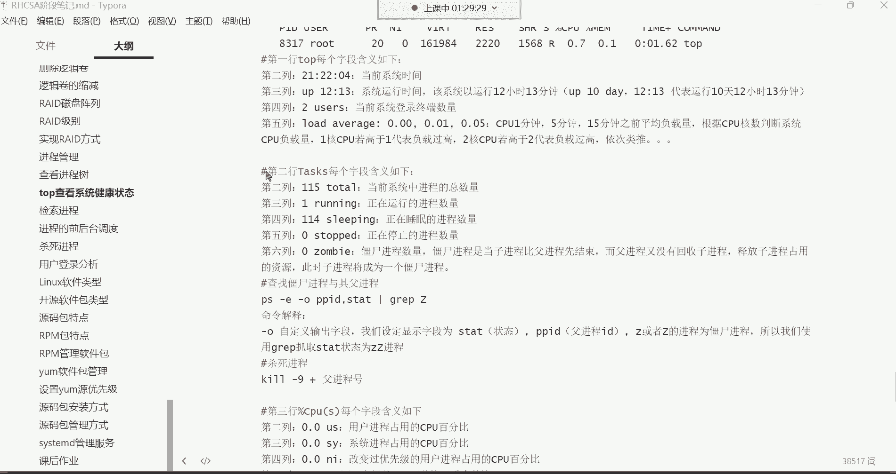
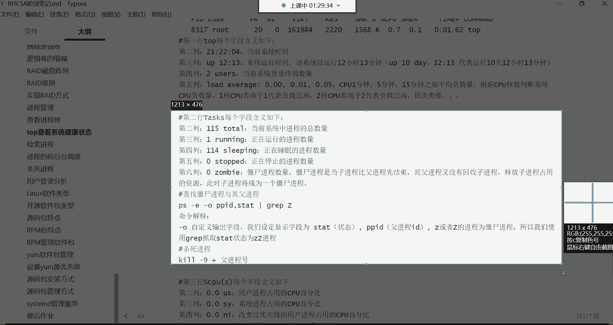
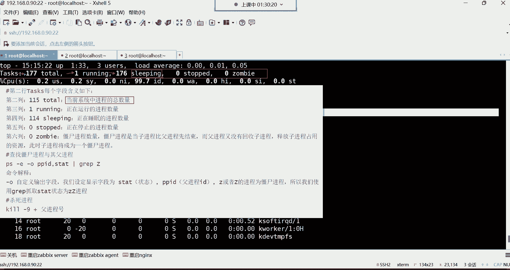
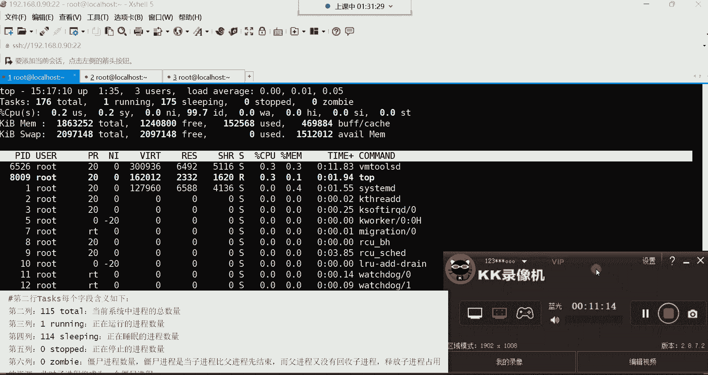

# Linux运维入门：P29：top系统健康检查 🔍

在本节课中，我们将学习如何使用 `top` 命令来动态监控系统的性能和运行状态。`top` 命令类似于 Windows 系统中的任务管理器，能够实时显示 CPU、内存、进程等关键信息，是系统运维中不可或缺的工具。

---

## 第一行：系统概览信息

上一节我们介绍了 `top` 命令的基本作用，本节中我们来看看其输出界面的具体含义。首先，我们从第一行开始解读。

第一行显示了系统的整体概览信息，具体包含以下内容：

*   **当前系统时间**：例如 `15:04`，表示当前时间是下午3点04分。
*   **系统运行时间**：`up` 后面的时间表示系统自启动后已经运行了多久。例如 `up 1:27` 表示运行了1小时27分钟。在生产环境中，常用天数表示，如 `365 days, 4:20`。
*   **登录终端数**：`2 users` 表示当前有2个终端登录到系统。注意，这是终端数量，不是用户数量。
*   **系统平均负载**：`load average` 后的三个数字分别表示系统在最近1分钟、5分钟和15分钟内的平均负载。这个数值需要结合 CPU 核心数来解读。例如，对于一个4核CPU：
    *   负载为 `1.0` 表示有1个核心的负载达到100%。
    *   负载为 `4.0` 表示所有4个核心的负载都达到100%，系统可能已超负荷。

---

## 第二行：进程摘要信息

了解了系统整体状态后，我们接着看第二行，它提供了关于进程的摘要信息。

第二行 `Tasks` 显示了系统中进程的总体情况，具体包含以下内容：

*   **进程总数**：`177 total` 表示当前系统中一共有177个进程。
*   **运行中进程数**：`1 running` 表示有1个进程正在运行。
*   **休眠进程数**：`176 sleeping` 表示有176个进程处于休眠（等待）状态。
*   **停止的进程数**：`0 stopped` 表示没有进程被停止。
*   **僵尸进程数**：`0 zombie` 表示没有僵尸进程。僵尸进程是指已经终止但其父进程尚未对其进行善后处理的进程。

---

## 第三行：CPU 状态信息

看完了进程的总体情况，接下来我们关注系统的核心——CPU 的使用状态。

第三行 `%Cpu(s)` 详细展示了 CPU 时间的分配情况，具体包含以下内容：

*   **用户空间占用**：`us` 表示 CPU 执行用户进程（非内核进程）所花费的时间百分比。
*   **系统空间占用**：`sy` 表示 CPU 执行内核系统进程所花费的时间百分比。
*   **优先级调整占用**：`ni` 表示 CPU 在执行被调整过优先级的用户进程上所花费的时间百分比。
*   **空闲时间**：`id` 表示 CPU 处于空闲状态的时间百分比。这个值越高，通常说明系统负载越轻。
*   **等待I/O时间**：`wa` 表示 CPU 等待输入/输出操作完成所花费的时间百分比。如果这个值持续很高，可能意味着磁盘或网络 I/O 存在瓶颈。
*   **硬件中断处理**：`hi` 表示 CPU 处理硬件中断所花费的时间。
*   **软件中断处理**：`si` 表示 CPU 处理软件中断所花费的时间。
*   **虚拟化占用**：`st` 在虚拟化环境中，表示被虚拟化管理程序（如 VMware、KVM）偷去的时间百分比。

---

## 第四、五行：内存与交换空间信息

分析完 CPU，我们还需要关注系统的内存使用情况，这对判断系统性能同样至关重要。

第四行和第五行分别显示了物理内存和交换空间的使用情况。

*   **物理内存**：
    *   `KiB Mem` 表示物理内存。
    *   `total` 是内存总量。
    *   `free` 是完全空闲的内存。
    *   `used` 是已使用的内存。
    *   `buff/cache` 是被内核缓冲区（buffer）和页面缓存（cache）占用的内存。这部分内存在应用程序需要时可以被快速释放，因此通常被视为“可用”资源。

*   **交换空间**：
    *   `KiB Swap` 表示交换分区（虚拟内存）。
    *   `total` 是交换分区总量。
    *   `free` 是空闲的交换空间。
    *   `used` 是已使用的交换空间。
    *   `avail Mem` 是一个估算值，表示在不进行交换的情况下，可供启动新应用程序使用的内存量。

---

## 进程列表区域

掌握了系统的资源概况后，最后我们来看最核心的部分——动态刷新的进程列表，它详细展示了每个进程的资源占用情况。

以下是进程列表各列的含义：

*   **PID**：进程的唯一标识符。
*   **USER**：进程所有者的用户名。
*   **PR**：进程的优先级。
*   **NI**：进程的优先级修正值（Nice值）。数值越小，优先级越高。
*   **VIRT**：进程使用的虚拟内存总量。
*   **RES**：进程使用的、未被换出的物理内存大小。
*   **SHR**：进程使用的共享内存大小。
*   **S**：进程状态。常见状态有：
    *   `R` = 运行中
    *   `S` = 休眠中
    *   `D` = 不可中断的休眠（通常与I/O相关）
    *   `Z` = 僵尸进程
    *   `T` = 被跟踪或已停止
*   **%CPU**：进程占用 CPU 的百分比。
*   **%MEM**：进程占用物理内存的百分比。
*   **TIME+**：进程自启动后总计使用的 CPU 时间。
*   **COMMAND**：启动该进程的命令行名称。

---

## 常用交互指令

在 `top` 命令的实时界面中，可以按下特定键来执行操作或改变显示方式。

以下是几个常用的交互指令：

*   **按 `P`**：根据 CPU 使用率对进程列表进行排序。
*   **按 `M`**：根据内存使用率对进程列表进行排序。
*   **按 `N`**：根据 PID（进程ID）进行排序。
*   **按 `k`**：终止一个进程。输入后需要指定要终止的进程 PID。
*   **按 `q`**：退出 `top` 命令。

---

## 总结

本节课中我们一起学习了 `top` 命令的详细用法。`top` 是一个强大的实时系统监控工具，其输出界面从上至下依次展示了系统时间与负载、进程摘要、CPU使用详情、内存与交换空间信息，以及详细的进程列表。通过理解每一行、每一列的含义，并配合交互式快捷键，你可以有效地监控系统健康状态、定位资源消耗过高的进程，是 Linux 系统运维中必须掌握的核心技能。