# Linux运维全套培训课程：P2：VMware安装CentOS系统 🖥️

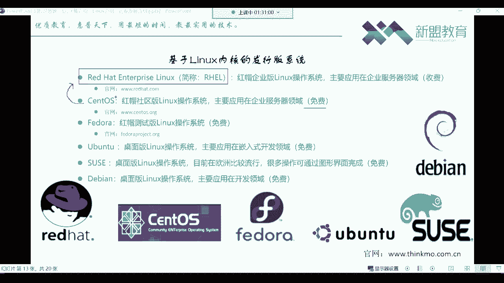

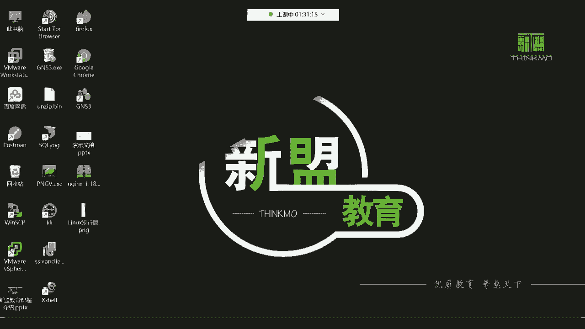

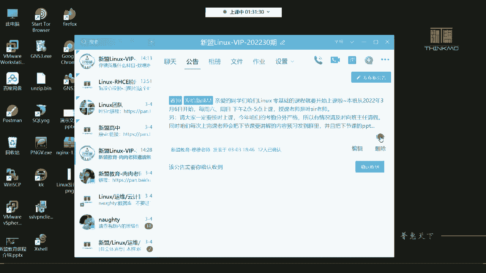

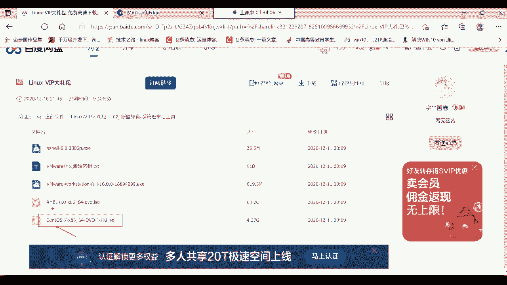

在本节课中，我们将学习如何使用VMware虚拟机软件安装CentOS操作系统。这是学习Linux运维的第一步，我们将从下载必要的软件和镜像开始，一步步完成虚拟机的创建和系统的安装。

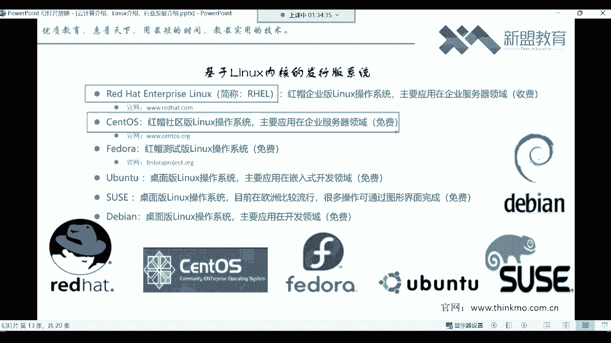

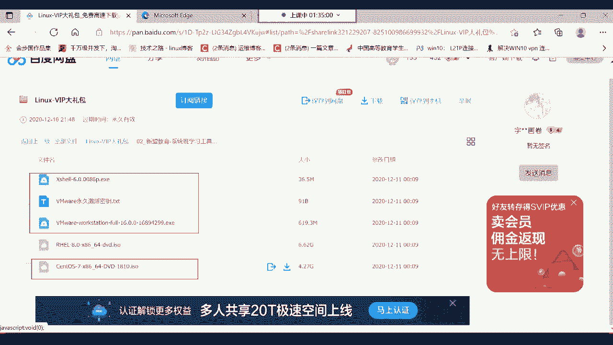

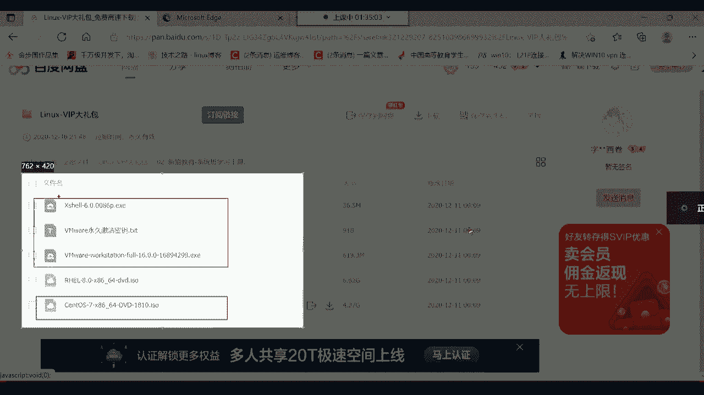

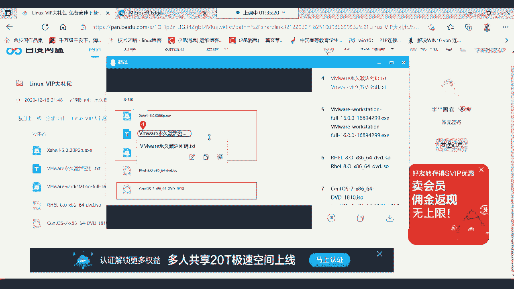

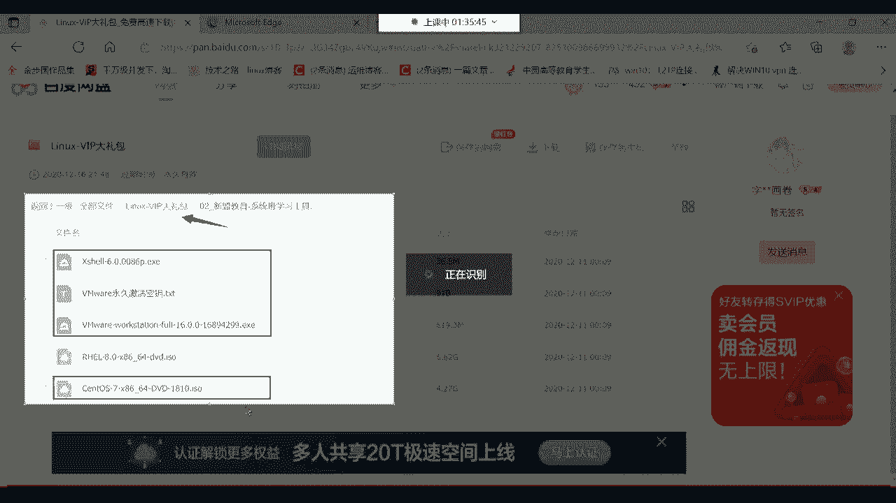

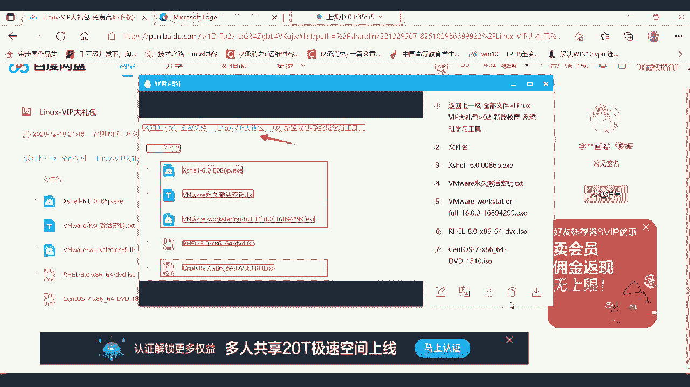

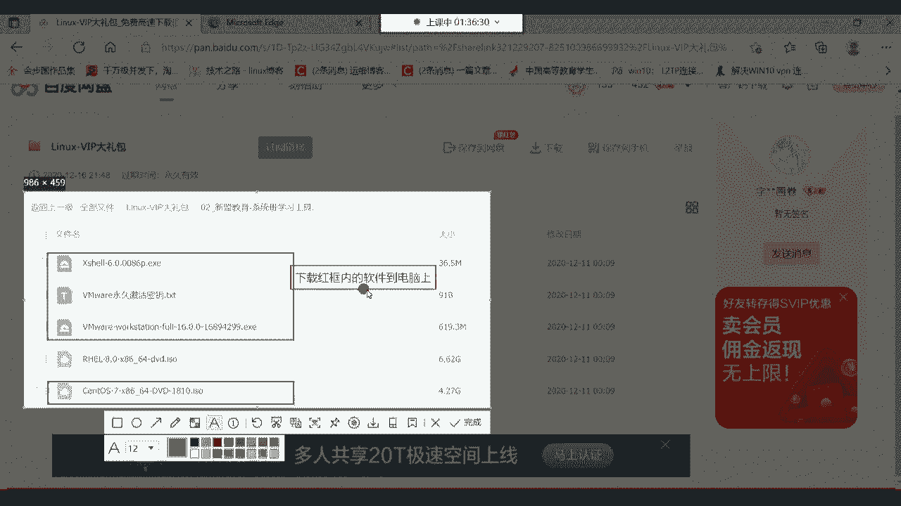

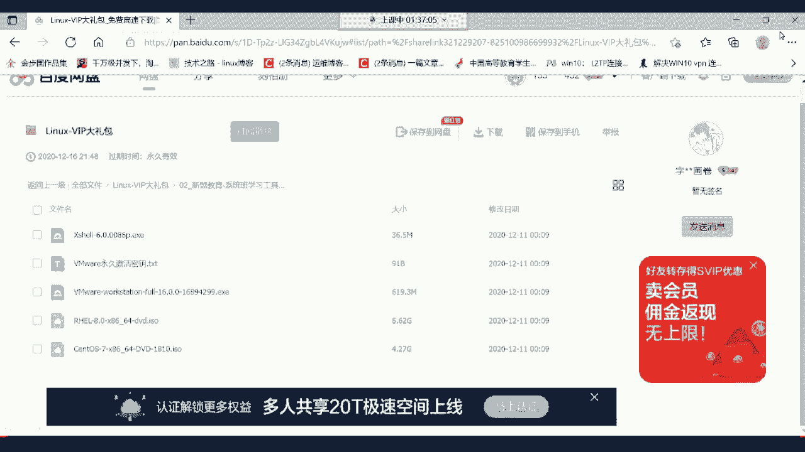

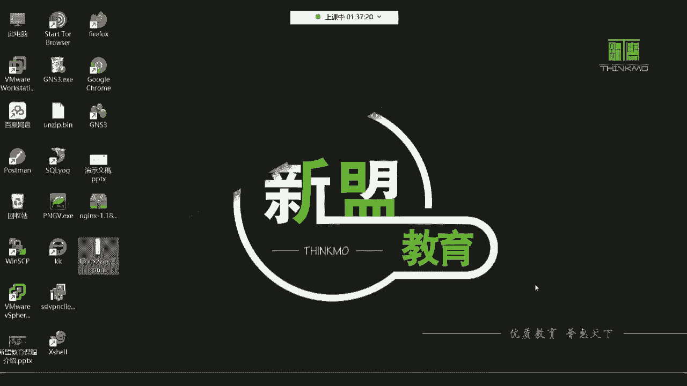

## 系统选择与准备

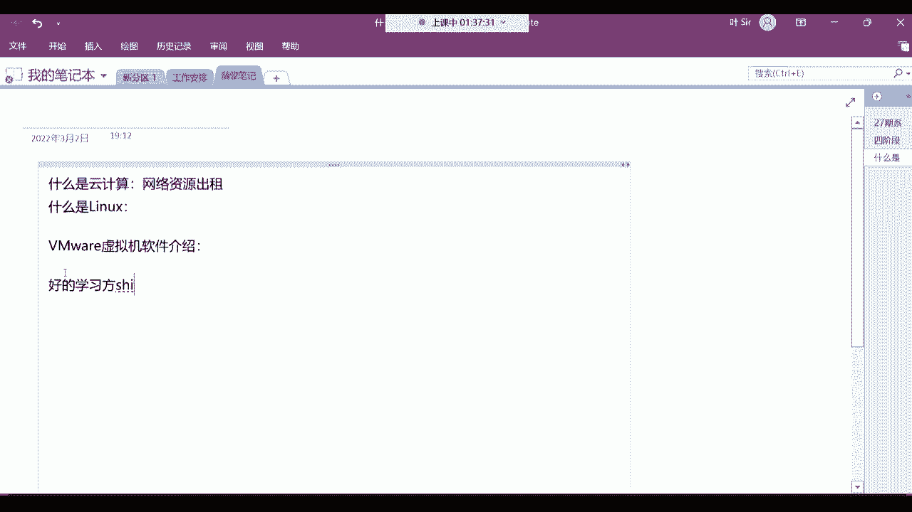

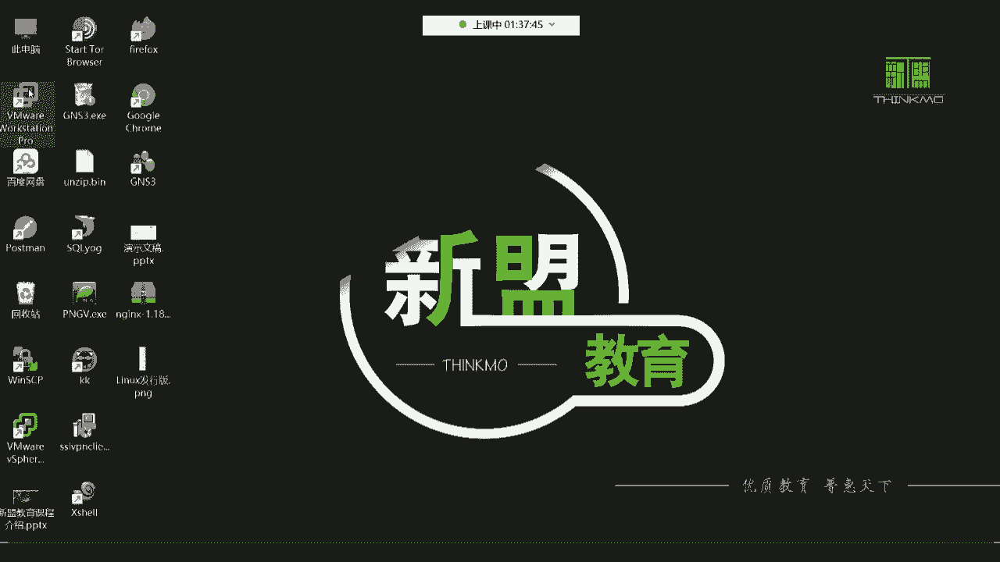

上一节我们介绍了课程的整体安排，本节中我们来看看如何准备安装环境。我们将安装CentOS系统。在学习阶段，我们以CentOS为主。

CentOS和Red Hat系统之间的关系是，CentOS是从Red Hat克隆过来的。克隆意味着它们使用相同的模板。这两个系统在命令和操作使用方面完全一样。我们选择CentOS是因为它是免费的，并且广泛应用于企业服务器领域。大部分企业倾向于使用免费的系统，因此我们以CentOS为主进行学习。

以下是需要下载的软件和镜像列表：
*   **VMware Workstation**：这是一个虚拟机软件。
*   **系统镜像**：CentOS 7版本的ISO镜像文件。版本只要是7以上（如7.6或7.9）均可。
*   **Xshell**：这是一个远程连接工具。如果你已有其他连接工具，可以使用自己的。
*   **激活密钥**：用于激活VMware软件。

这些资源均可在提供的“VIP大礼包”中找到。请将这些文件下载到你的电脑上。

## 创建新虚拟机

准备好所需文件后，我们开始创建虚拟机。虚拟机软件的作用是为我们虚拟出一套完整的硬件平台（如CPU、内存、硬盘），以便在其上安装操作系统。

1.  打开VMware Workstation软件。
2.  点击“创建新的虚拟机”。
3.  在配置类型中，选择“典型”配置，然后点击“下一步”。
4.  在安装客户机操作系统时，选择“稍后安装操作系统”，然后点击“下一步”。
5.  选择客户机操作系统为“Linux”，版本选择“CentOS 7”，然后点击“下一步”。
6.  为虚拟机命名（例如：`CentOS7-学习机`），并选择安装位置（建议放在空间充足的磁盘，如固态硬盘），然后点击“下一步”。
7.  指定磁盘容量，默认20GB即可。此空间会随着虚拟机的使用而动态分配，并非一次性占用。选择“将虚拟磁盘存储为单个文件”，然后点击“下一步”。
8.  在最后一步，点击“自定义硬件”进行详细设置。

## 自定义虚拟机硬件

在自定义硬件界面，我们可以调整虚拟机的资源分配。

*   **内存**：建议分配2048 MB（即2GB）。这能保证系统安装和运行的流畅性。请注意，虚拟机只有在开机时才会占用真机的内存。
*   **处理器**：根据你真机的CPU核心数，为虚拟机分配适当的处理器数量。例如，分配1个处理器，2个核心。
*   **新CD/DVD**：在此处选择“使用ISO映像文件”，并浏览指向你下载的CentOS 7镜像文件。这是系统安装的来源。
*   **网络适配器**：选择网络连接模式。这里有三种模式：
    *   **桥接模式**：虚拟机与真机处于同一网络段，可以直接通信并访问外网。适合网络环境固定的台式机。
    *   **NAT模式**：虚拟机通过真机的IP地址共享上网。虚拟机与真机的IP可以不在同一网段，通过虚拟网卡（如VMnet8）通信。适合需要频繁更换网络环境的笔记本。
    *   **仅主机模式**：虚拟机仅能与真机通信，无法访问外网。
    我们通常选择 **NAT模式**。
*   **其他设备**：如USB控制器、声卡、打印机等，若无需使用，可以选中后点击“移除”以节省资源。

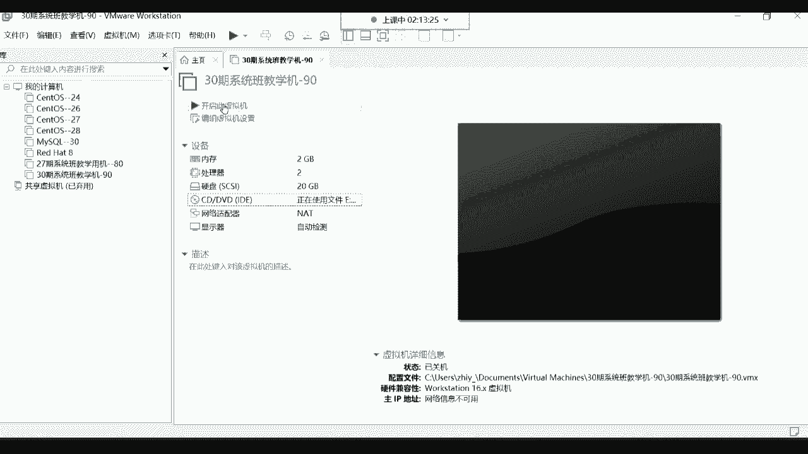

设置完成后，点击“关闭”，然后点击“完成”。至此，一台空白虚拟机就创建好了。

## 安装CentOS系统

虚拟机创建完毕后，我们开始安装操作系统。

1.  点击“开启此虚拟机”。
2.  启动后，使用键盘上下键选择“Install CentOS 7”，然后按回车键开始安装。
    > **提示**：鼠标点击虚拟机界面后会被捕获，按 `Ctrl + Alt` 组合键可以将鼠标释放回真机。
3.  在安装界面，选择语言为“中文-简体中文”，然后点击“继续”。
4.  进入安装信息摘要界面，需要进行以下配置：
    *   **软件选择**：点击进入。对于服务器和学习环境，建议选择“最小安装”。企业服务器通常也采用最小化安装以节省资源和提高安全性。我们后期可以根据需要手动安装其他软件。
    *   **安装位置**：点击进入。选择我们为虚拟机创建的20GB硬盘，并点击完成。分区方案暂时选择自动配置。
    *   **网络和主机名**：点击进入。
        *   可以在此修改主机名，暂时保持默认即可。
        *   点击“配置”来设置网络。在“IPv4设置”中，将方法改为“手动”。
        *   点击“添加”按钮，输入IP地址（例如：`192.168.0.90`）、子网掩码（`255.255.255.0` 或 `24`）、网关（例如：`192.168.0.254`）和DNS服务器（例如：`223.5.5.5`）。
        *   配置完成后，将右上角的网络开关打开。
    *   **ROOT密码**：点击进入。为系统的超级管理员root账户设置一个密码。
    *   **创建用户**：可以点击进入创建一个普通用户（例如：`test`）并设置密码。
5.  所有配置完成后，点击右下角的“开始安装”。系统将开始安装过程，请耐心等待。
6.  安装完成后，点击“重启”即可进入新安装的CentOS系统。

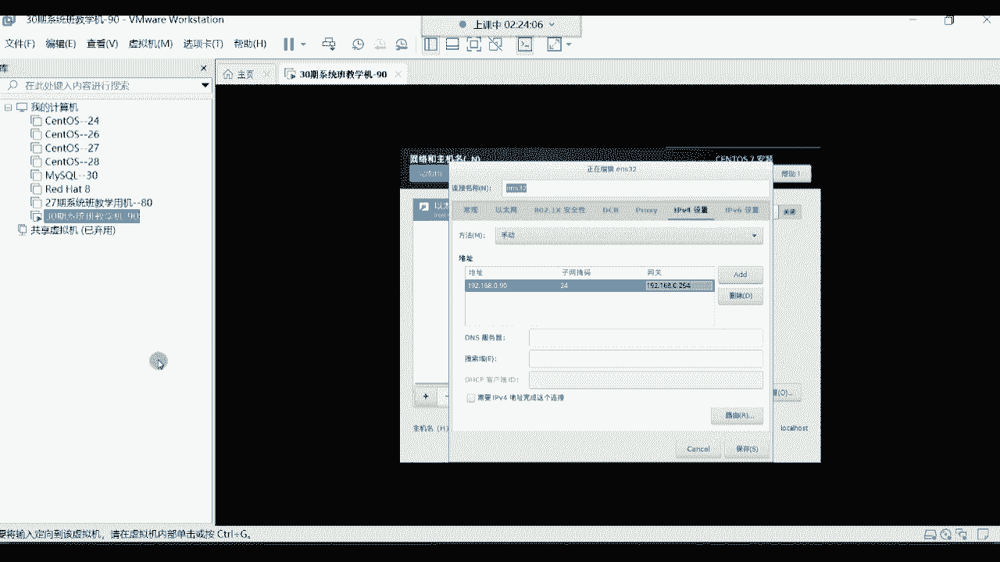

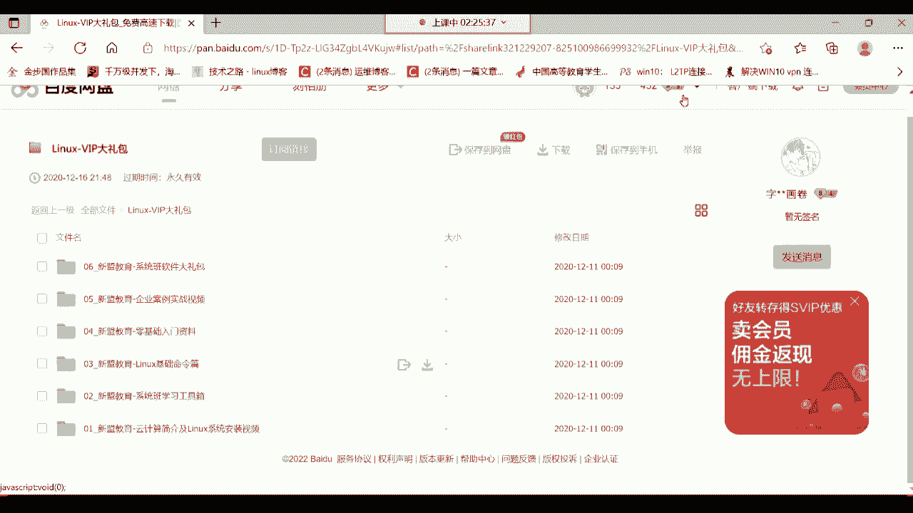

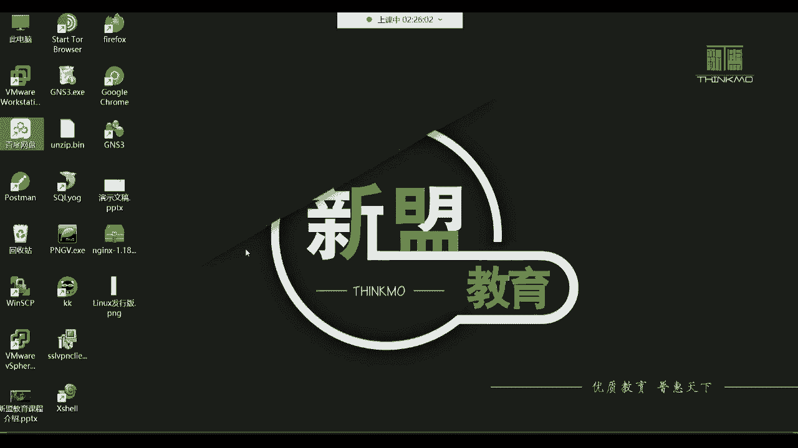

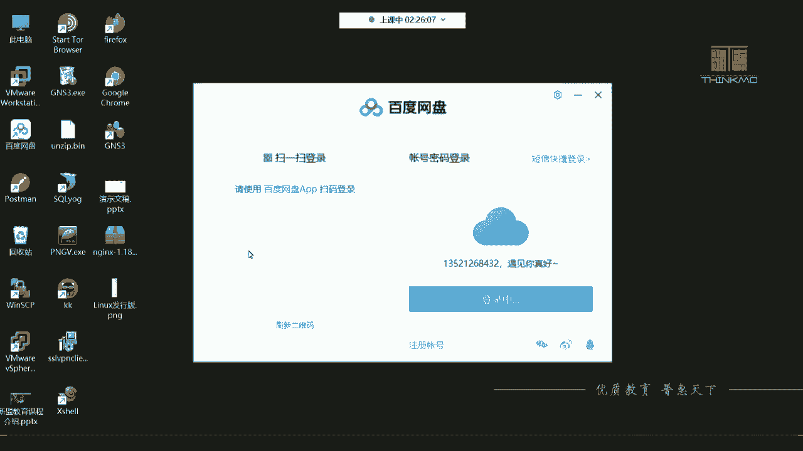

## 网络基础补充

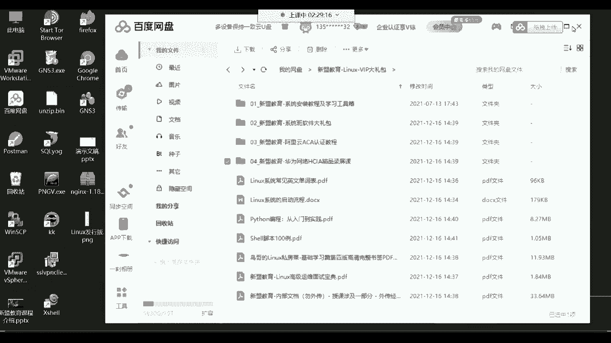

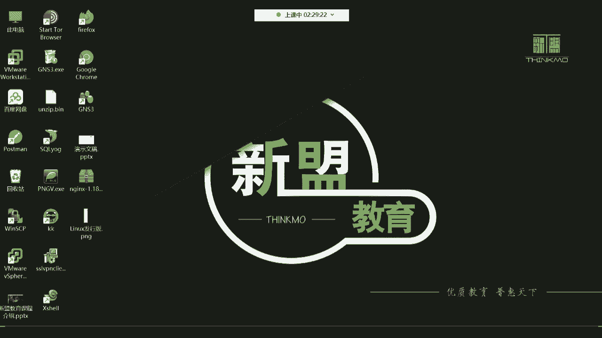

在配置网络时，如果你对IP地址、子网掩码、网关等概念不熟悉，可以学习提供的网络基础课程（如华为HCIA网络课程的前10节），了解OSI模型、TCP/IP协议和IP地址规划等基础知识，这对于后续的运维学习非常重要。

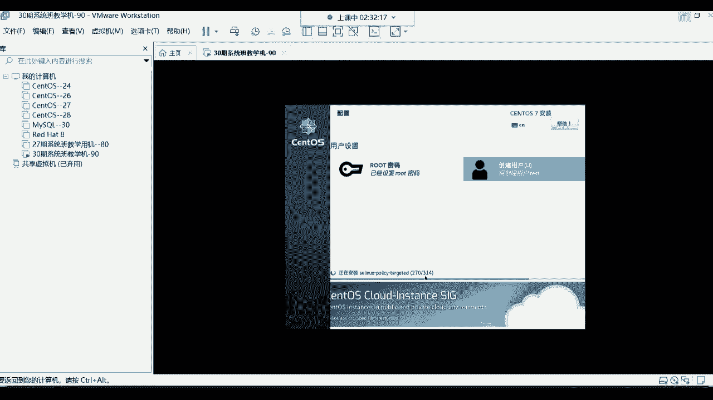

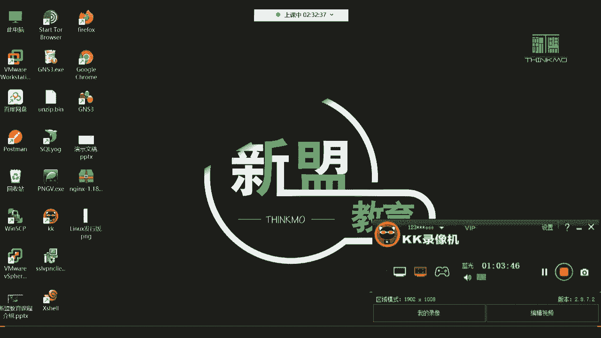

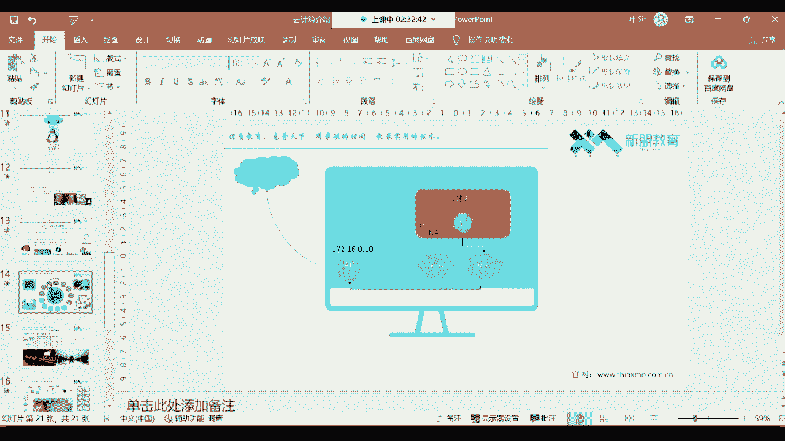

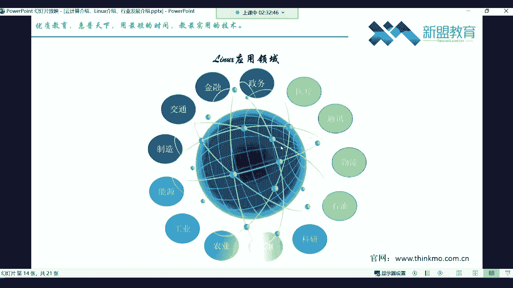

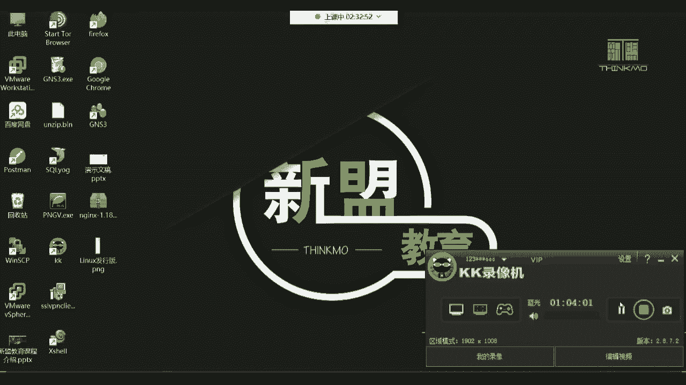

本节课中我们一起学习了如何使用VMware创建虚拟机并安装CentOS 7操作系统。我们了解了CentOS与Red Hat的关系，准备了安装所需的镜像和软件，逐步配置了虚拟机的硬件资源（如内存、CPU和网络），并完成了CentOS系统的最小化安装和基础网络配置。这是构建Linux学习环境的关键一步，请务必动手实践。