# Linux运维全套培训课程：P32：红帽RHCSA-31.Linux系统软件包类型介绍、源码包与RPM包特点、RPM命令管理软件包 📦


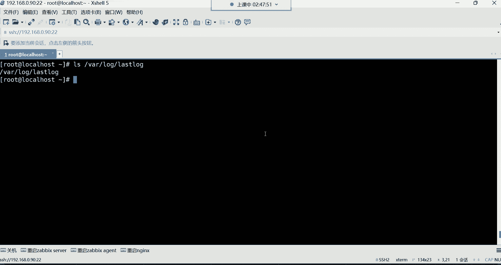


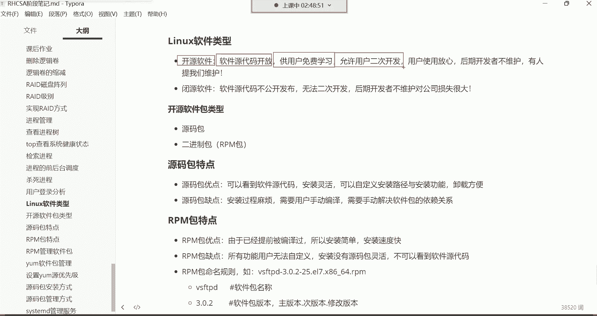

在本节课中，我们将要学习Linux系统中软件包管理的基础知识。软件包管理是运维工作的核心技能之一，它关系到如何在服务器上安装、配置和维护各种应用程序，如网站、数据库等。我们将重点介绍两种主要的软件包类型：源码包和RPM包，并详细讲解如何使用RPM命令来管理软件包。


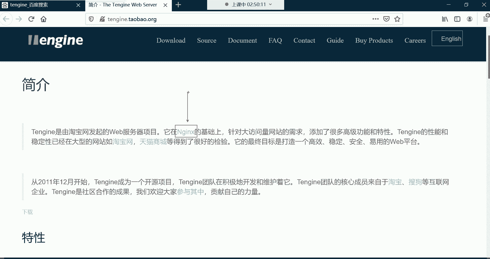

## 软件包类型介绍


上一节我们介绍了软件包管理的重要性，本节中我们来看看Linux系统中软件包的主要类型。


在Linux系统中，软件包主要分为两大类：**源码包**和**二进制包**（通常指RPM包）。理解它们的区别是进行有效软件管理的第一步。

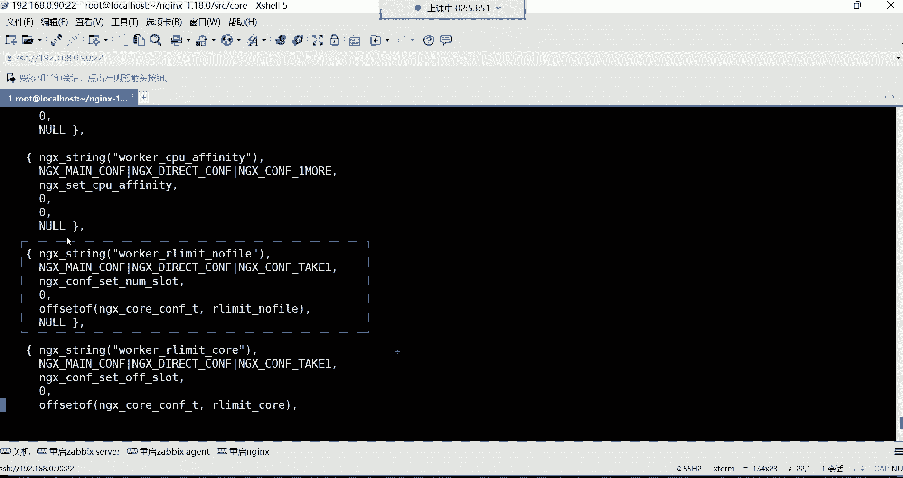

### 开源与闭源软件


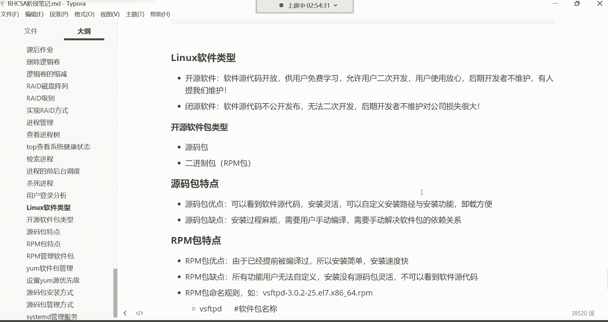

在深入讲解软件包类型之前，需要先理解开源与闭源的概念，因为这直接决定了软件包的形态。


*   **开源软件**：软件的源代码公开发布，用户可以获得并允许进行二次开发。例如，淘宝基于Nginx二次开发了Tengine服务器。开源软件的优势在于代码透明、使用放心（避免恶意代码），并且即使原开发者停止维护，社区也可能继续维护。
*   **闭源软件**：软件的源代码不公开，用户无法查看和修改。例如，Windows操作系统。闭源软件的缺点是用户无法进行二次开发，且一旦开发者停止维护（如Windows 7），用户将难以自行修复问题。

开源软件不一定免费，它可能对高级功能或技术支持收费。

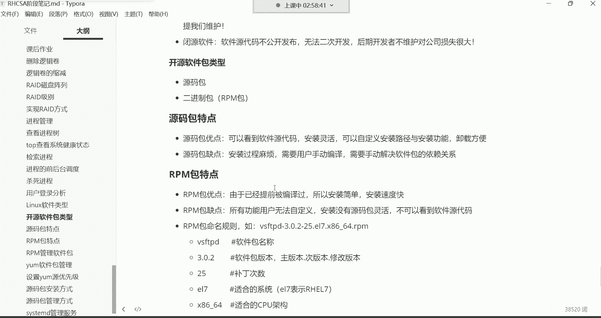

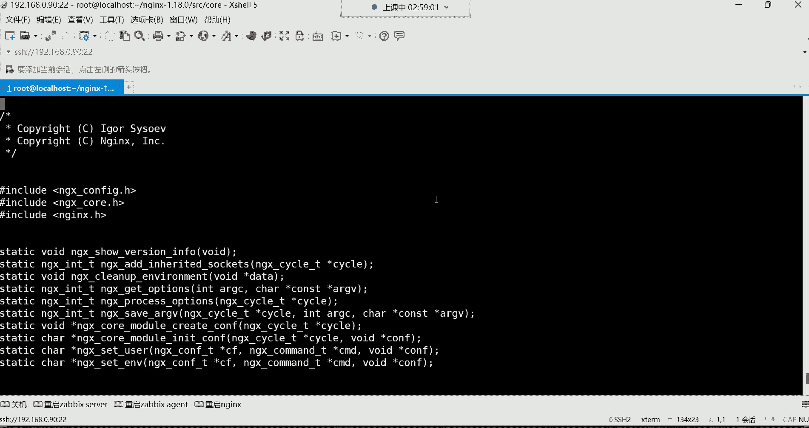

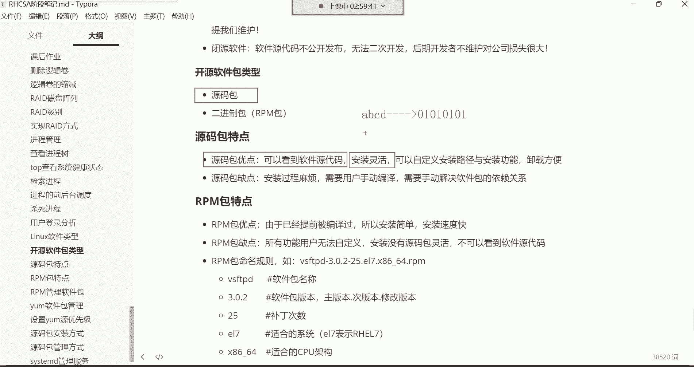

### 源码包的特点


源码包是包含软件原始代码的压缩包，例如从Nginx官网下载的 `nginx-1.18.0.tar.gz`。解压后，你可以在 `src` 目录下看到用C语言（或其他语言）编写的源代码文件（如 `.c` 文件）。


以下是源码包的主要特点：


*   **优点**：
    1.  **开放源代码**：可以查看和修改代码，支持二次开发。
    2.  **安装灵活**：在**编译**（将源代码转换为计算机可执行的二进制文件的过程）时，可以**自定义安装路径**和**选择需要的功能模块**。这有助于节约服务器资源。
    3.  **卸载方便**：直接删除自定义的安装目录即可彻底卸载，无残留文件。
*   **缺点**：
    1.  **安装过程复杂**：需要用户手动执行配置、编译、安装等步骤。
    2.  **需解决依赖关系**：安装前需要手动安装该软件所依赖的其他库或软件。


**核心概念公式**：
`源代码 (如 .c 文件) --[编译]--> 二进制可执行文件`


### RPM包（二进制包）的特点

RPM包是已经由官方编译好的二进制包，文件后缀名为 `.rpm`。我们之前使用 `yum -y install` 命令安装的软件（如 `lrzsz`）都属于RPM包。

以下是RPM包的主要特点：

*   **优点**：
    1.  **安装简单快捷**：因为已经提前编译，所以安装速度快，一条命令即可完成。
    2.  **功能全面**：官方编译的包通常包含了该软件的大部分功能。
*   **缺点**：
    1.  **无法自定义**：不能选择安装路径，也无法按需选择功能模块。
    2.  **看不到源代码**：因为是二进制格式，用户无法查看和修改源代码。
    3.  **依赖关系复杂**：安装时可能需要处理环环相扣的依赖问题。

**RPM包命名规则示例**：
`vsftpd-3.0.2-25.el7.x86_64.rpm`
*   `vsftpd`: 软件包名称。
*   `3.0.2`: 软件版本号（主版本.次版本.修正版本）。
*   `25`: 发布版本号（打过补丁的次数）。
*   `el7`: 适用的操作系统（Red Hat Enterprise Linux 7 / CentOS 7）。
*   `x86_64`: 适用的CPU架构（64位）。
*   `.rpm`: 扩展名，表明这是RPM包。

**如何选择？**
*   企业要求严格（如银行系统），需要定制化安装路径和功能时，选择**源码包**。
*   追求安装效率和简便性，且对定制化要求不高时，选择**RPM包**。

## RPM命令管理软件包


上一节我们了解了两种软件包的特点，本节中我们来看看如何使用RPM命令来管理已经编译好的RPM软件包。首先需要知道软件包从哪里来。

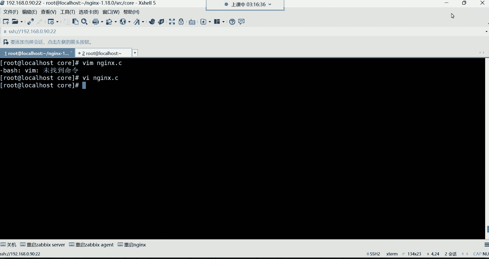


### 软件包来源：系统镜像

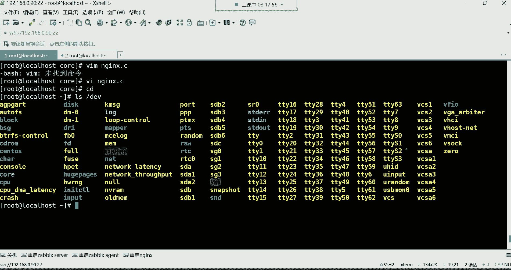

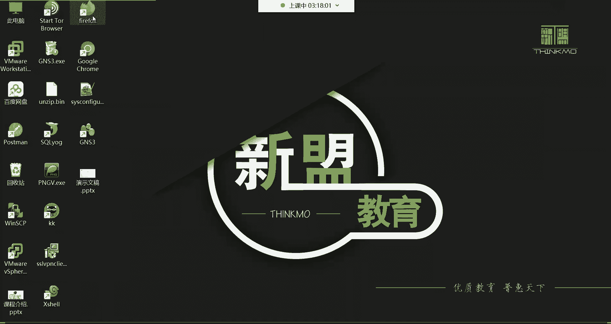


Linux系统的安装镜像文件（如CentOS 7的ISO文件）中包含了大量的RPM软件包（约4000多个）。我们可以挂载光驱设备来访问这些包。

**操作步骤如下**：


1.  在 `/mnt` 目录下创建一个挂载点（如 `centos`）。
    ```bash
    mkdir /mnt/centos
    ```
2.  将光驱设备（`/dev/cdrom`，它是一个指向 `/dev/sr0` 的链接）挂载到该目录。
    ```bash
    mount /dev/cdrom /mnt/centos
    ```
3.  进入软件包目录。
    ```bash
    cd /mnt/centos/Packages/
    ```
4.  现在，你可以看到当前目录下所有的 `.rpm` 软件包文件。


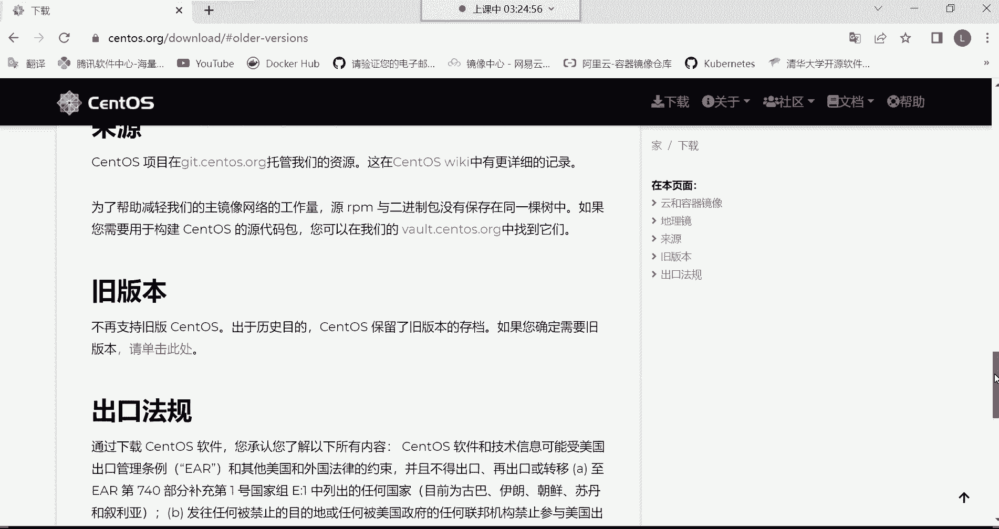


### RPM命令基本使用

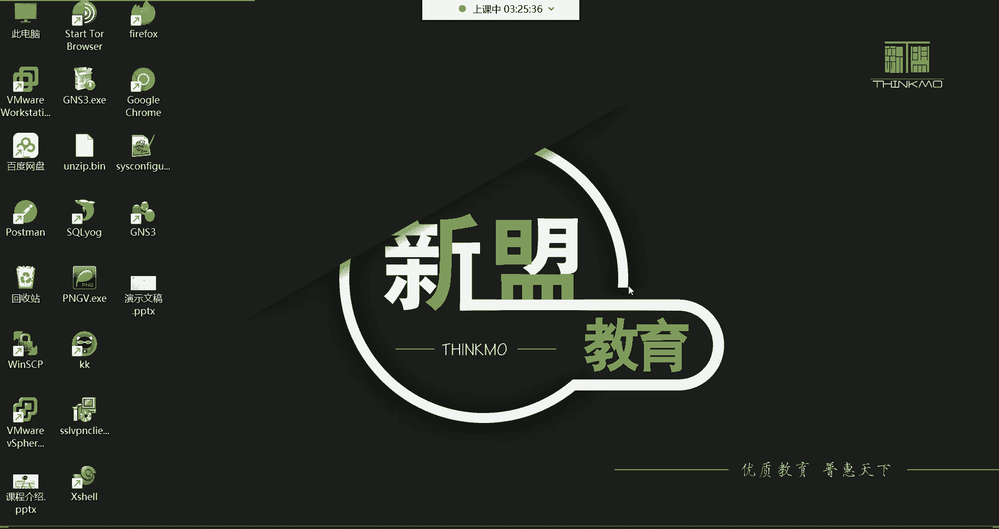


`rpm` 命令选项繁多，但对于初学者，掌握以下常用选项即可应对大部分情况。请注意，使用 `rpm` 命令安装软件时需要**手动解决依赖关系**。


#### 安装软件包


使用 `-ivh` 组合选项进行安装，这是安装时的“黄金组合”。
*   `-i`: install，安装。
*   `-v`: verbose，显示详细信息。
*   `-h`: hash，显示安装进度条。

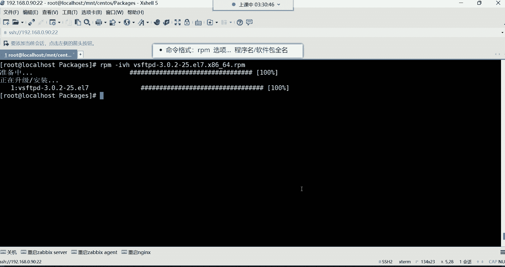


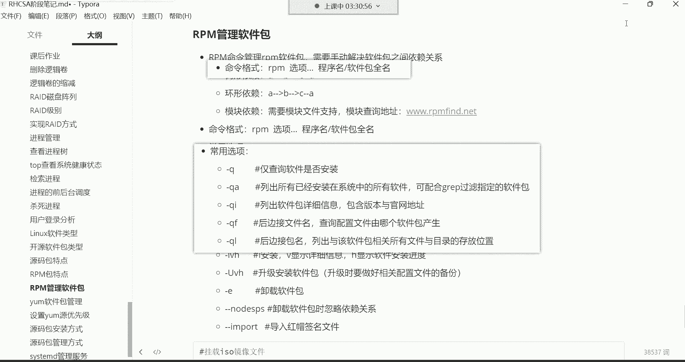

**命令格式**：
```bash
rpm -ivh 软件包全名
```
**注意**：安装时必须指定软件包的**完整名称**（可以使用 `Tab` 键自动补全）。

**示例**：安装 `vsftpd` 软件包。
```bash
rpm -ivh vsftpd-3.0.2-25.el7.x86_64.rpm
```

#### 查询软件包

查询功能是 `rpm` 命令中最常用和强大的部分。

以下是常用的查询选项：

*   **`-q`**：查询指定软件包是否安装。
    ```bash
    rpm -q vsftpd  # 查询vsftpd是否安装
    ```
*   **`-qa`**：查询系统中所有已安装的RPM包。常与 `grep` 命令结合进行过滤。
    ```bash
    rpm -qa | grep vsft  # 过滤出包含‘vsft’的已安装包
    ```
*   **`-qi`**：查询已安装软件包的详细信息（如版本、描述、安装时间等）。
    ```bash
    rpm -qi vsftpd
    ```
*   **`-ql`**：列出某个软件包安装的所有文件及其位置。
    ```bash
    rpm -ql coreutils  # 查看coreutils包安装的文件，里面包含很多基础命令
    ```
*   **`-qf`**：查询某个文件是由哪个软件包安装的。
    ```bash
    rpm -qf /etc/passwd  # 查询/etc/passwd文件来自哪个包
    which cat            # 先找到cat命令的路径
    rpm -qf /usr/bin/cat # 再查询cat命令来自哪个包
    ```

**重要提示**：
安装后，管理软件（查询、卸载等）使用的是**程序名**（通常与包名相同，如 `vsftpd`），而不是安装时的完整包名。如果不确定程序名，可以使用 `rpm -qa | grep 关键字` 来查找。

---

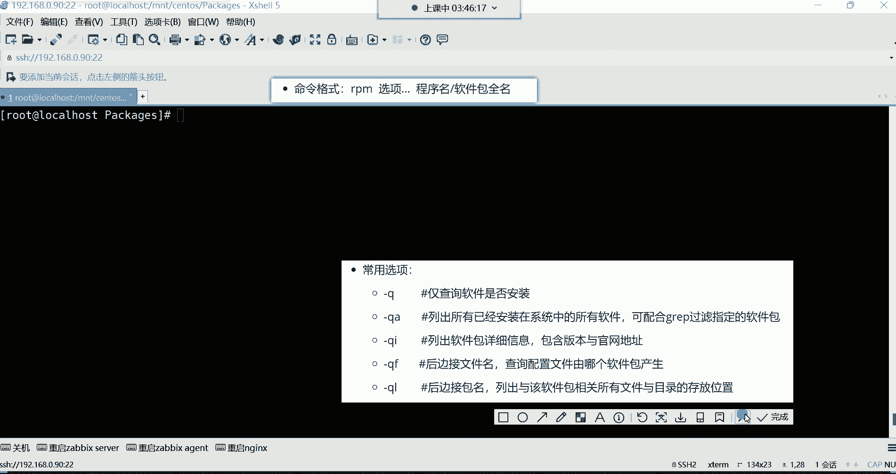

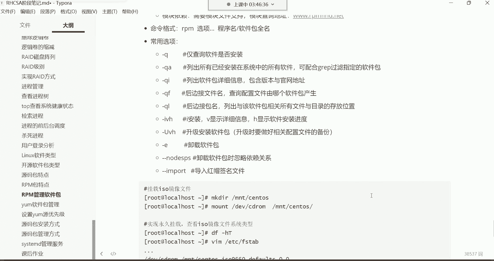

本节课中我们一起学习了Linux软件包的基础知识。我们区分了源码包和RPM二进制包的特点与适用场景，并重点演练了使用 `rpm` 命令进行软件包安装和查询的详细步骤。记住，`rpm` 的查询功能（`-q`, `-qa`, `-qi`, `-ql`, `-qf`）在实际运维工作中极为实用。下节课我们将继续学习 `rpm` 命令的升级、卸载和校验等功能。