# Linux运维基础：P34：RPM软件包管理、YUM本地软件仓库搭建、YUM常用命令学习 📦

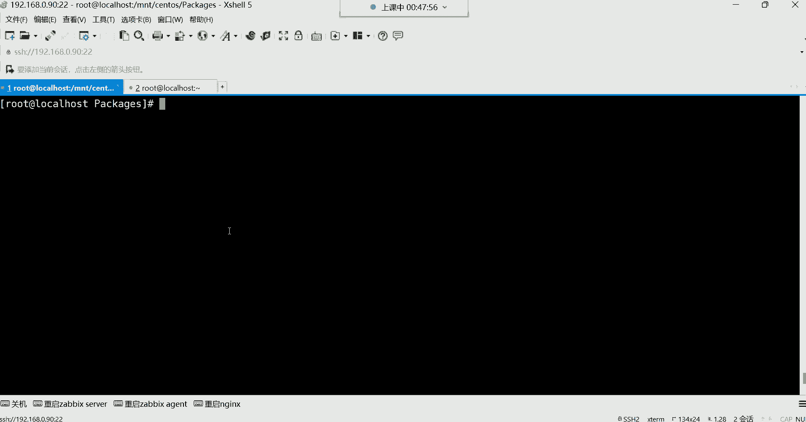


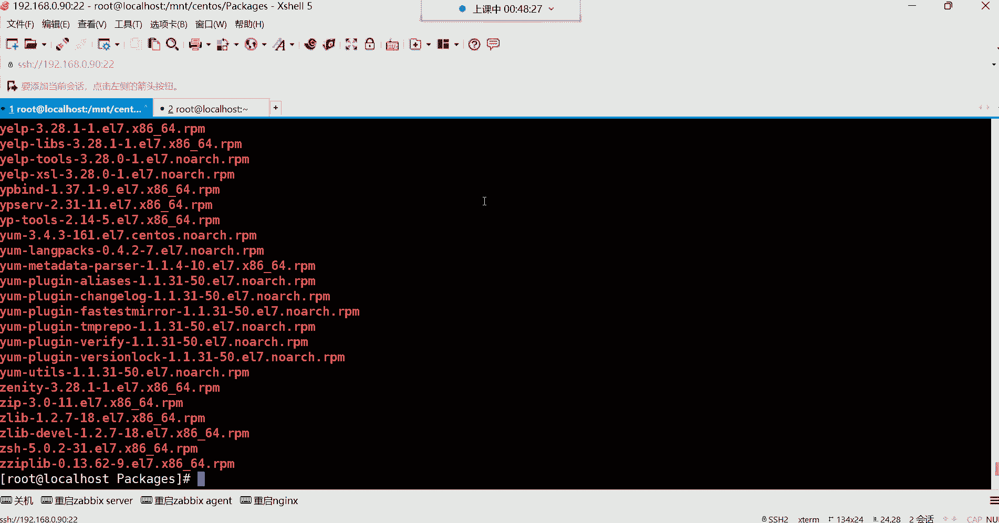

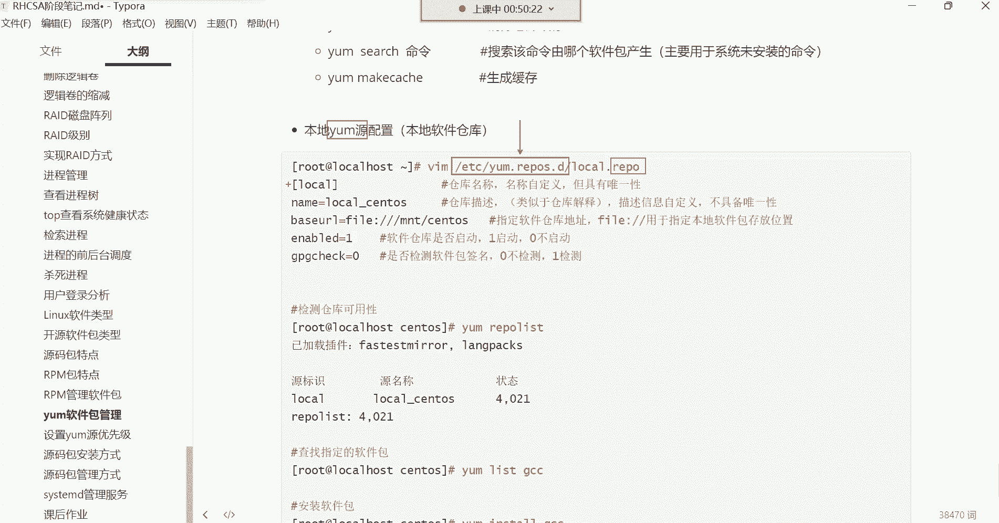

在本节课中，我们将学习如何在Linux系统中管理软件包。我们将重点介绍RPM软件包管理工具，并详细讲解如何搭建一个本地的YUM软件仓库。通过搭建本地仓库，我们可以更方便地安装、更新和管理软件，而无需依赖网络。此外，我们还将学习YUM工具的一系列常用命令，帮助你高效地进行软件包管理。


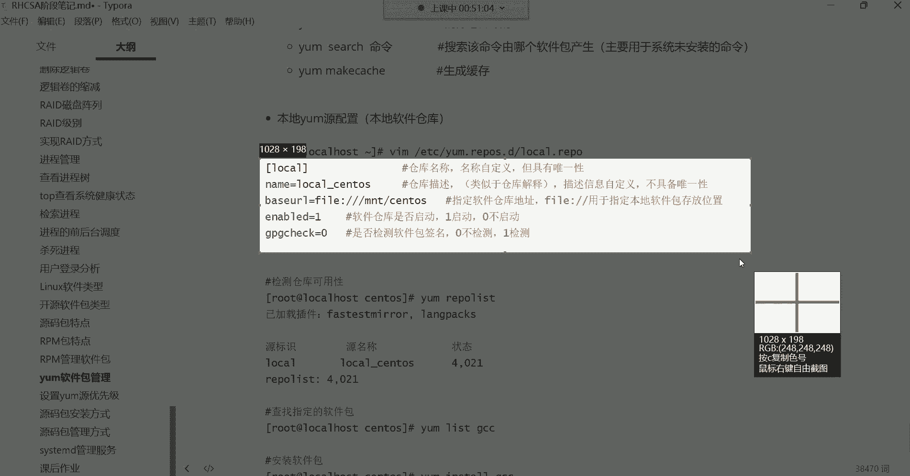

## 本地YUM仓库的搭建 🏗️

上一节我们介绍了RPM软件包的基本概念。本节中我们来看看如何搭建一个本地的YUM软件仓库，以便于后续的软件安装。

我们之前挂载的系统镜像文件中包含了4000多个软件包。这些软件包都可以被我们使用。现在软件包已经准备就绪，接下来我们需要学习如何搭建本地仓库。

本地软件仓库也称为本地YUM源。这里的“源”指的是软件包的来源。本地YUM源意味着软件包的来源位于本机，即软件包存放在本地的仓库中。

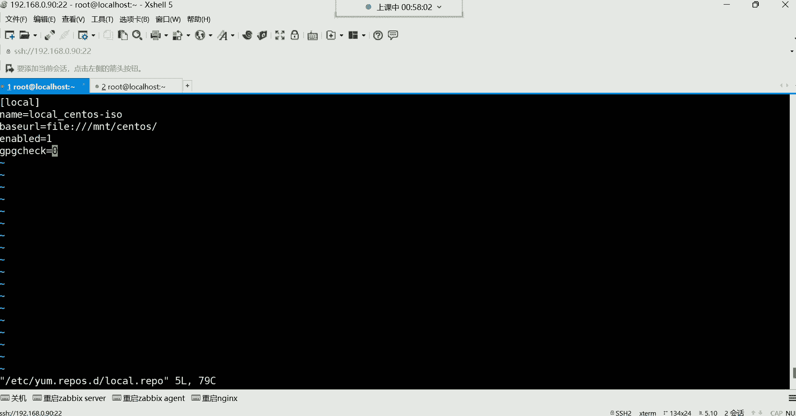

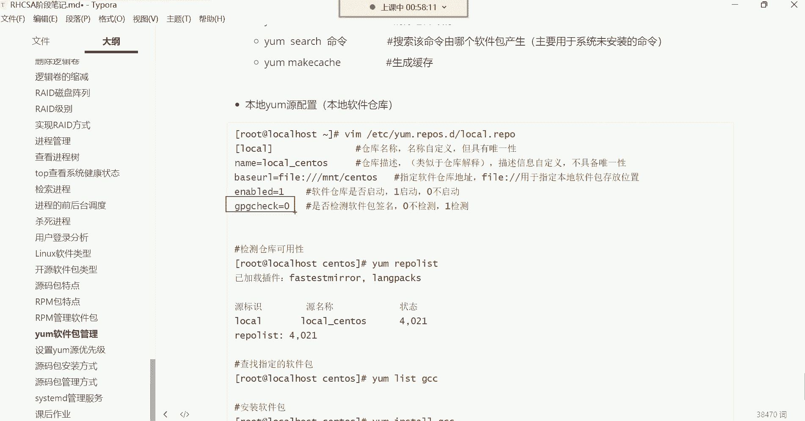

以下是搭建本地YUM仓库的步骤：

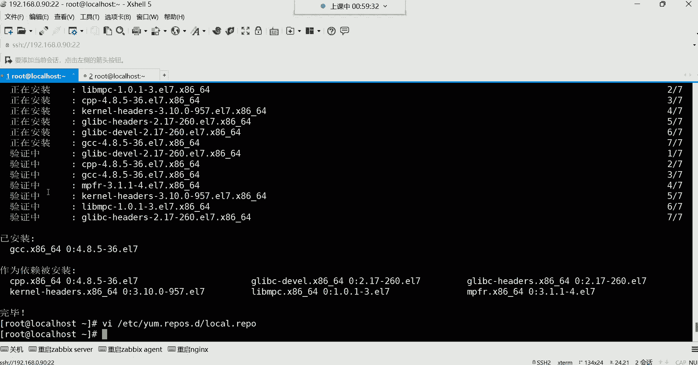


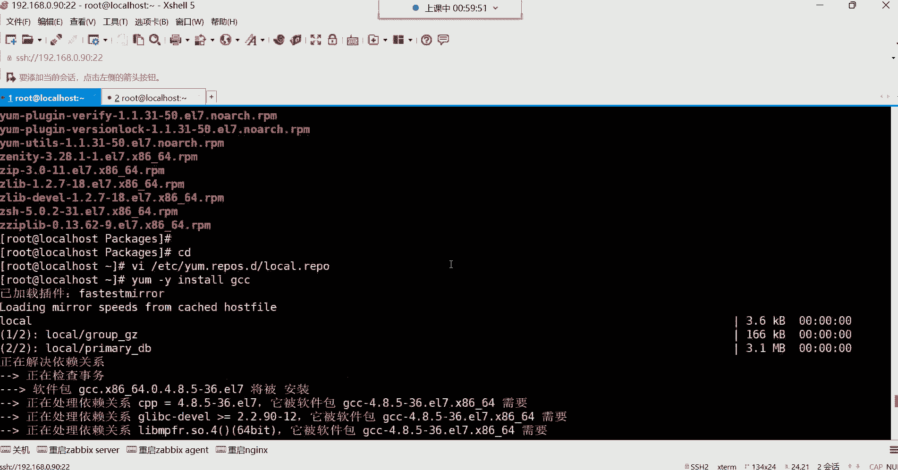

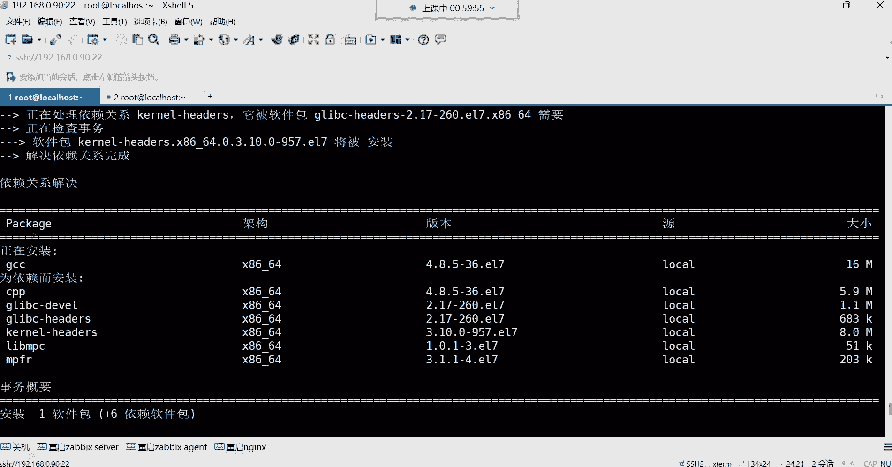

1.  **创建仓库配置文件**：YUM命令在安装软件时会自动到系统的特定路径下寻找仓库配置文件。这个路径是 `/etc/yum.repos.d/`。在此路径下创建的文件必须以 `.repo` 作为扩展名，YUM才会识别并读取其中的配置。如果文件扩展名不是 `.repo`，YUM将忽略该文件。因此，我们需要在该路径下创建一个以 `.repo` 结尾的文件，例如 `local.repo`。


2.  **编辑配置文件内容**：使用文本编辑器（如Vim）打开或创建 `/etc/yum.repos.d/local.repo` 文件，并写入以下配置：

    ```ini
    [local]
    name=local centos-iso
    baseurl=file:///mnt/centos
    enabled=1
    gpgcheck=0
    ```

    我们来逐一解释这些配置项的含义：
    *   `[local]`：这是仓库的名称，定义在中括号内，可以自定义，但建议不要使用中文。
    *   `name=local centos-iso`：这是仓库的描述信息，用 `name` 关键字指定，是对仓库的简要说明。
    *   `baseurl=file:///mnt/centos`：这是**最重要**的一行，它定义了软件包的具体存放路径。`file://` 是固定格式，用于指定本地路径。这里的 `/mnt/centos` 是我们之前挂载镜像文件的位置，其下的 `Packages` 目录存放了所有RPM包。YUM会自动在该路径下寻找 `Packages` 目录并下载软件。
    *   `enabled=1`：此选项表示启用这个仓库。`1` 为启用，`0` 为禁用。如果不写此行，默认也是启用状态。
    *   `gpgcheck=0`：此选项表示是否检查软件包的GPG签名。`0` 表示不检查。对于自己搭建的本地仓库，通常设置为 `0` 以避免签名验证失败导致安装失败。如果是配置网络仓库（如官方源），则通常需要设置为 `1` 并进行相应的密钥配置。

配置完成后，保存并退出文件。这样，一个本地YUM仓库就搭建好了。

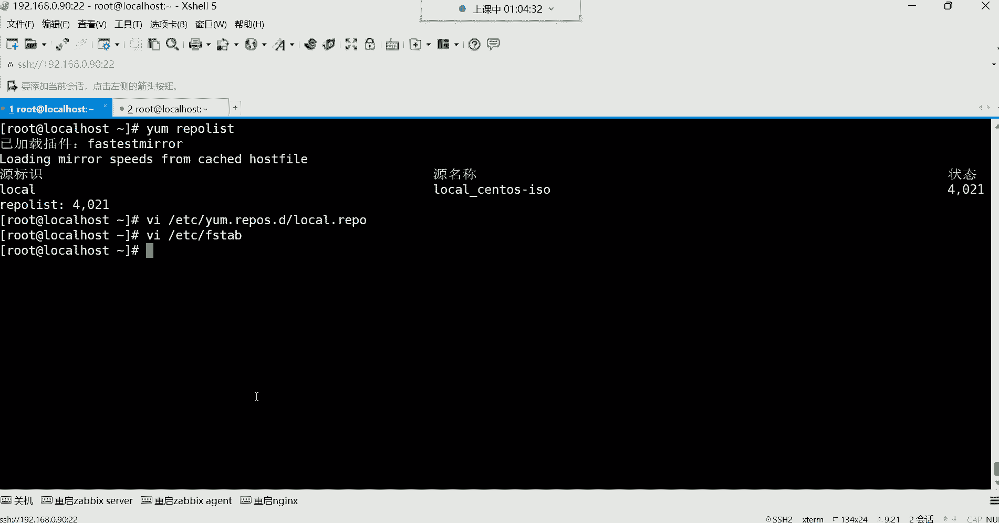


## YUM的常用命令 ⚙️

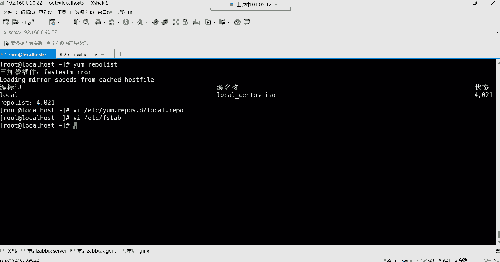

仓库搭建完成后，我们就可以使用YUM命令来管理软件了。YUM最大的优势在于能自动解决软件依赖关系。

以下是YUM的一些常用命令：

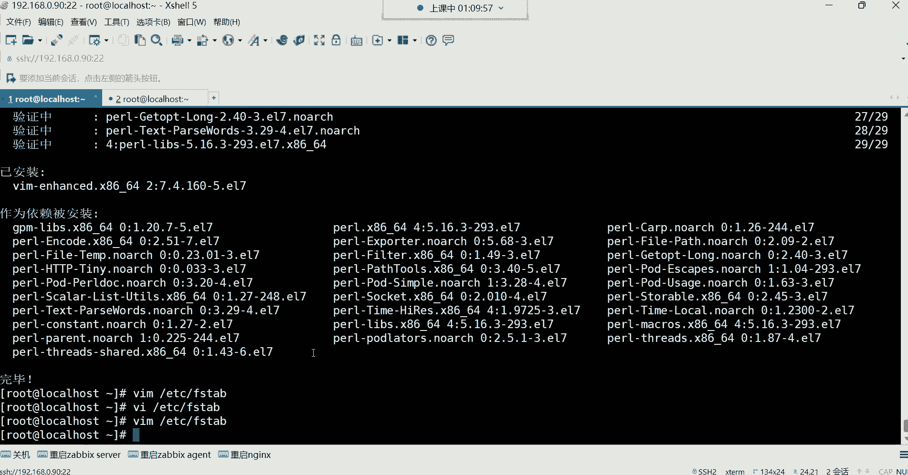

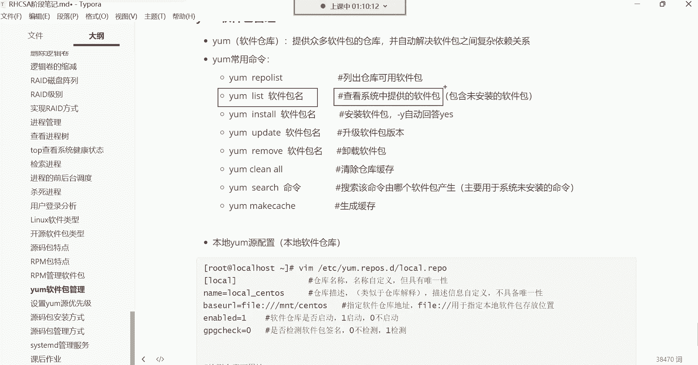

*   **`yum repolist`**：此命令用于列出所有已配置并启用的仓库信息。执行后，你可以看到仓库名称（如 `local`）、描述、状态以及仓库中包含的软件包数量。

*   **`yum install`**：此命令用于安装软件包。其基本语法是 `yum install 软件包名`。在安装过程中，YUM会列出需要安装的主包及其所有依赖包，并请求确认。为了省去手动确认的步骤，我们通常加上 `-y` 选项来自动回答“yes”。例如，安装VIM编辑器：`yum -y install vim`。YUM会自动从配置的仓库路径中查找 `vim` 包及其所有依赖（可能多达数十个）并一并安装。

*   **`yum list`**：此命令用于列出仓库中所有可用的软件包（包括已安装和未安装的）。如果直接执行 `yum list`，会输出所有包，信息很多。我们通常结合管道符 `|` 和 `grep` 命令来搜索特定的包。例如，想查找名称中包含“java”的包：`yum list | grep java`。如果结果太多，可以进一步过滤，例如再查找包含“jdk”的包：`yum list | grep java | grep jdk`。这种方法在记不清完整包名时非常实用。


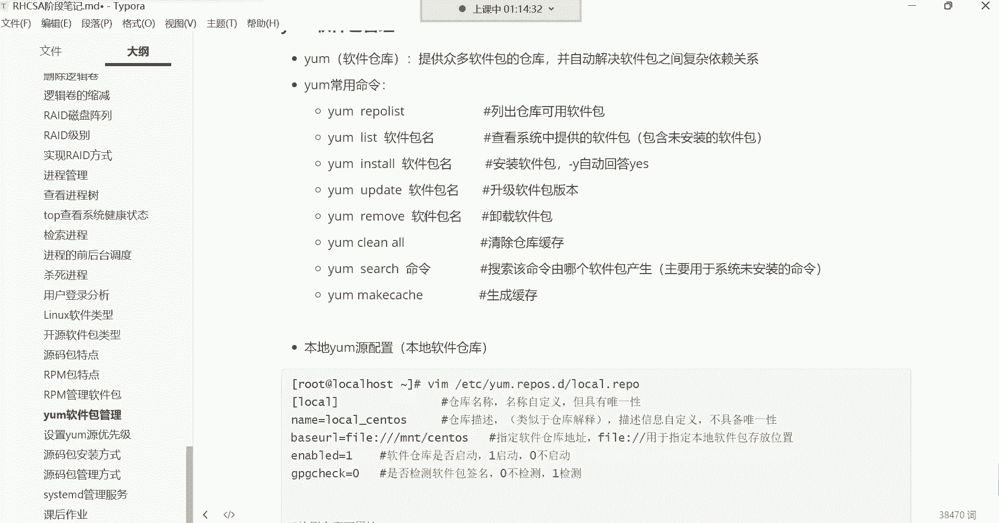

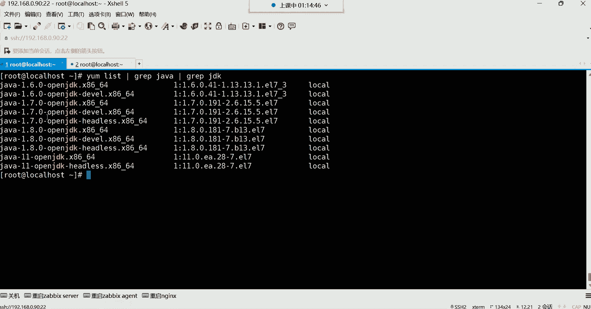

*   **`yum update`**：此命令用于更新软件包到最新版本。使用 `yum update 软件包名` 可以更新指定软件包。**注意**：在生产环境中升级软件前，务必做好数据和配置的备份。

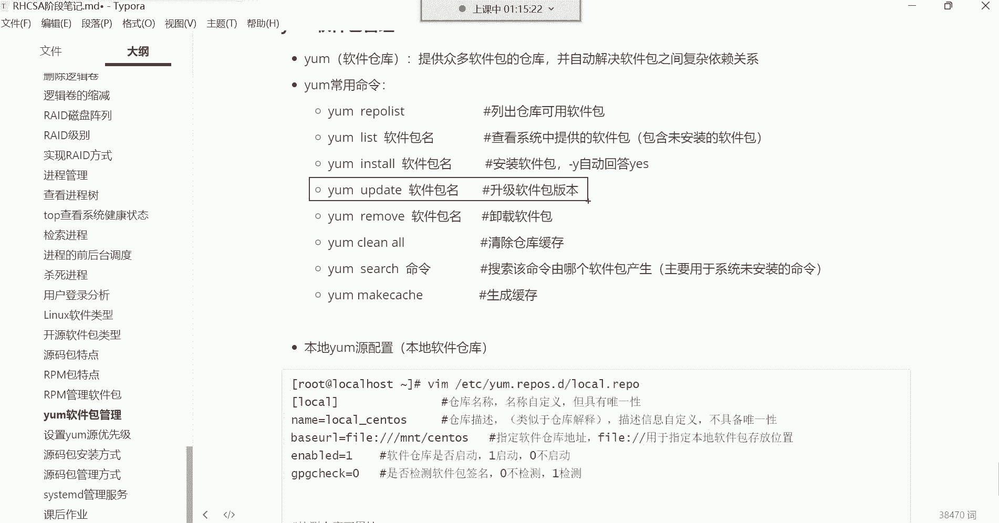


*   **`yum remove`**：此命令用于卸载软件包。语法为 `yum remove 软件包名`。需要注意的是，使用YUM卸载时，默认**不会**删除该软件包的依赖包。


## 配置网络YUM仓库示例 🌐

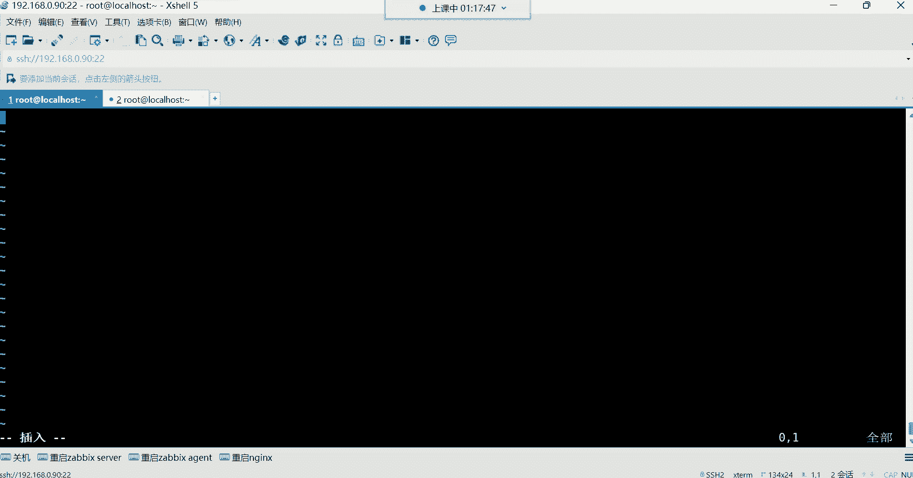

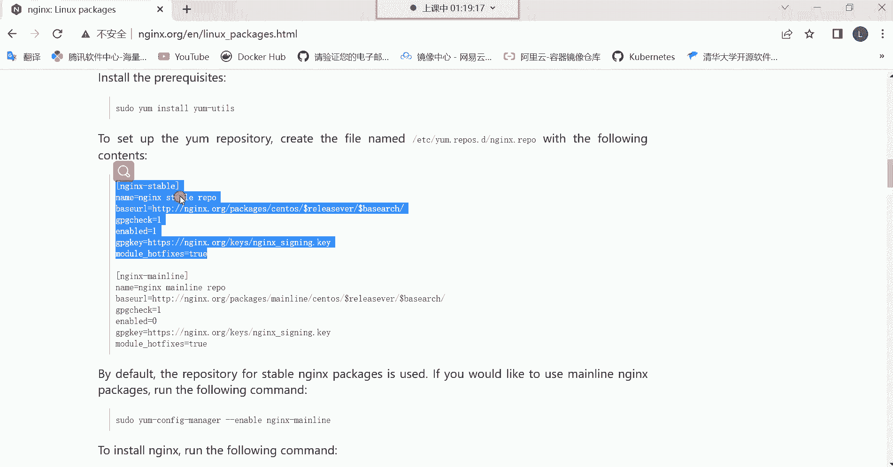

除了本地仓库，我们经常需要配置网络仓库来获取更多或更新的软件。以添加Nginx官方YUM源为例：

1.  在 `/etc/yum.repos.d/` 目录下创建一个新的仓库文件，例如 `nginx.repo`。
2.  将官方提供的仓库配置内容粘贴进去。网络仓库的 `baseurl` 通常是 `http://` 或 `https://` 开头的URL地址。例如：
    ```ini
    [nginx-stable]
    name=nginx stable repo
    baseurl=http://nginx.org/packages/centos/$releasever/$basearch/
    gpgcheck=1
    enabled=1
    gpgkey=https://nginx.org/keys/nginx_signing.key
    ```
    注意，网络仓库通常需要启用GPG检查（`gpgcheck=1`），并指定对应的GPG密钥地址（`gpgkey`）。
3.  保存文件后，就可以使用 `yum install nginx` 来安装Nginx了。


**提示**：当系统同时配置了多个仓库时，YUM默认会优先从网络仓库获取软件。

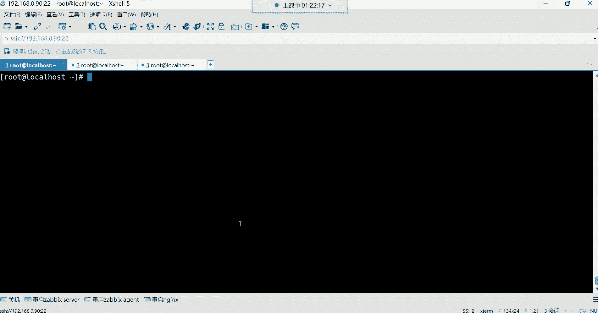


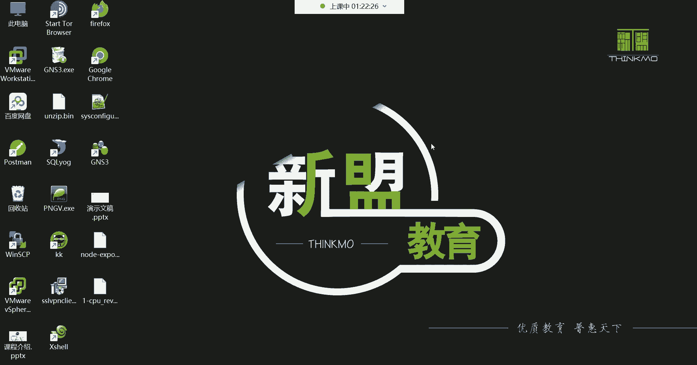


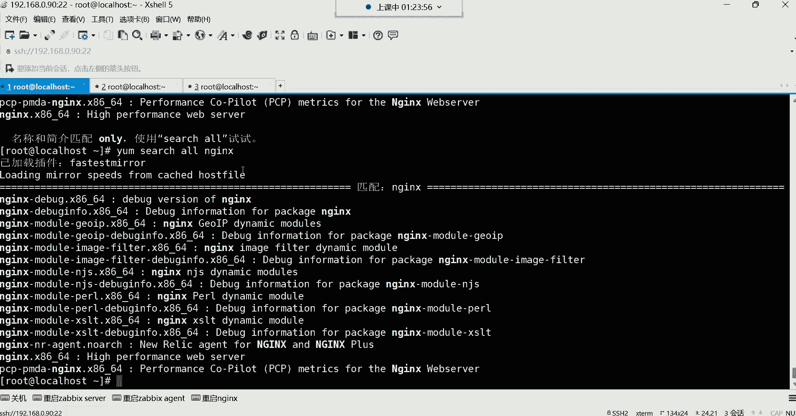


## 总结 📝

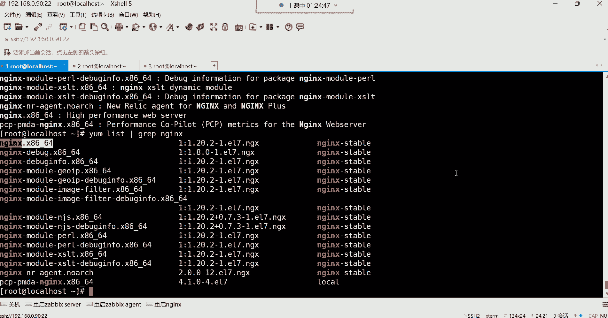


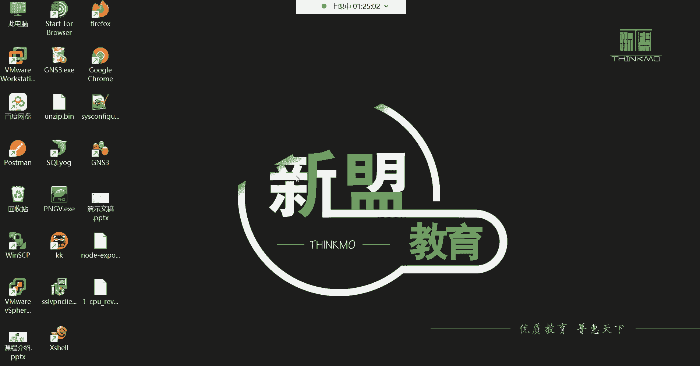

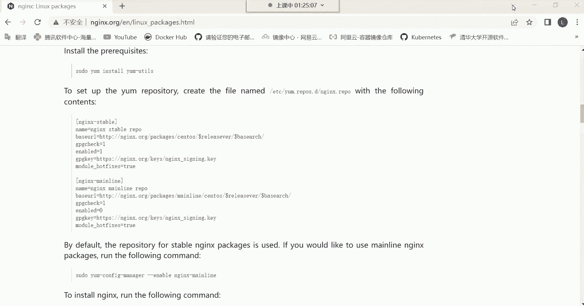

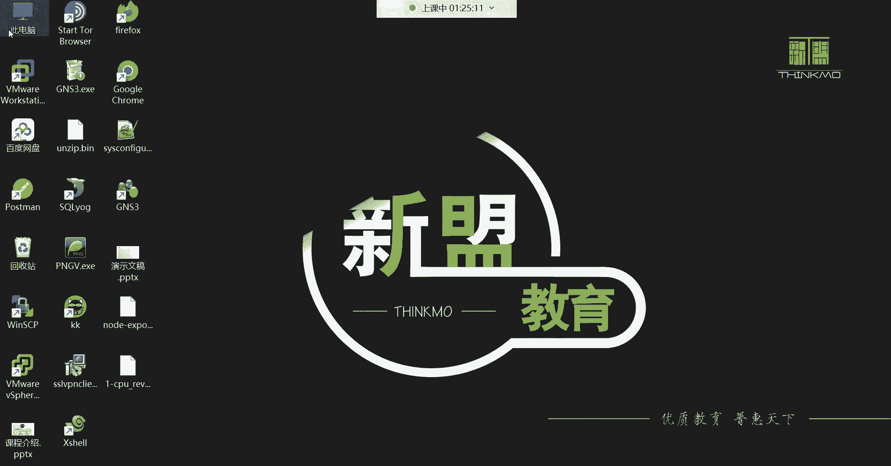


本节课中我们一起学习了Linux下软件包管理的核心知识。我们首先了解了RPM包管理工具的基础。接着，重点讲解了如何搭建一个本地的YUM软件仓库，包括配置文件的路径、命名规则以及各项关键配置的含义。然后，我们学习了YUM的一系列常用命令，如 `repolist` 查看仓库、`install` 安装软件、`list` 搜索软件以及 `update` 更新软件。最后，我们还简要演示了如何配置一个网络YUM源。掌握这些内容，你将能够更加自如地在Linux系统中安装和管理所需软件。