# Linux运维全套培训课程：P38：编写脚本、脚本执行方式 🖥️


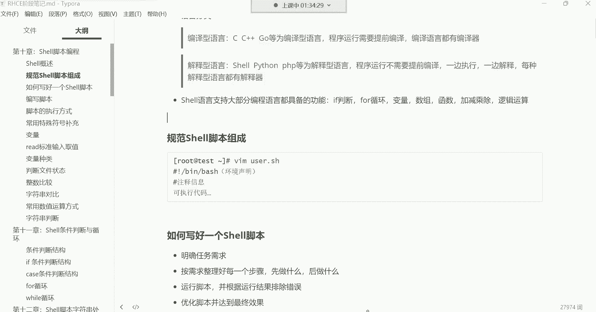

在本节课中，我们将学习如何编写和执行Shell脚本。我们将从一个简单的“Hello World”脚本开始，逐步探讨编写脚本的核心思想、注意事项以及如何避免常见问题，例如交互式命令在脚本中的处理。

---

## 编程始于“Hello World” 👋

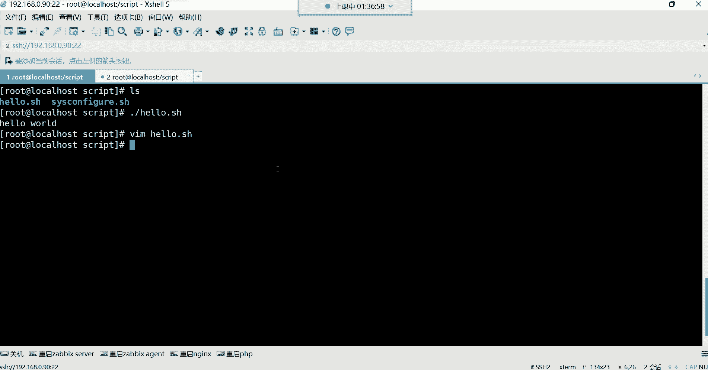

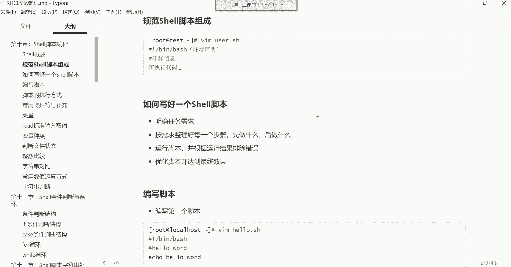

上一节我们介绍了脚本的基本概念。本节中，我们来看看如何编写第一个脚本。在编程领域，无论学习哪种语言，第一个程序通常是输出“Hello World”。这是一种传统，源自C语言的创始人丹尼斯·里奇。对于Shell脚本，我们也遵循这个传统。

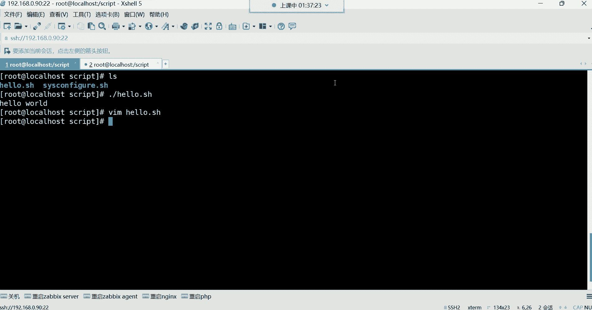


编写一个输出“Hello World”的脚本非常简单，其本质是将命令行中执行的命令写入一个文件。

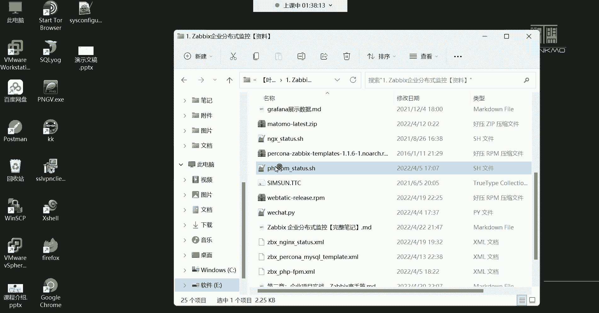

以下是实现步骤：
1.  创建一个脚本文件，例如 `hello.sh`。
2.  在文件第一行声明脚本的解释器环境：`#!/bin/bash`。
3.  使用 `echo` 命令输出文本。
4.  给脚本文件添加执行权限。
5.  执行脚本。

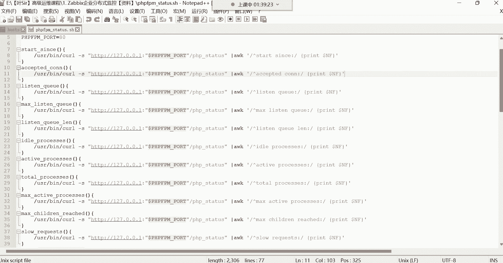

**代码示例：**
```bash
#!/bin/bash
echo "Hello World"
```

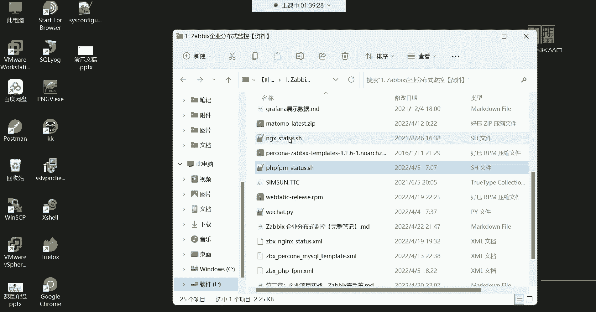

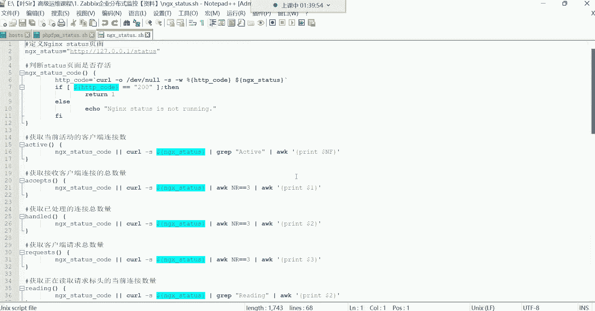

执行脚本：
```bash
chmod +x hello.sh
./hello.sh
```

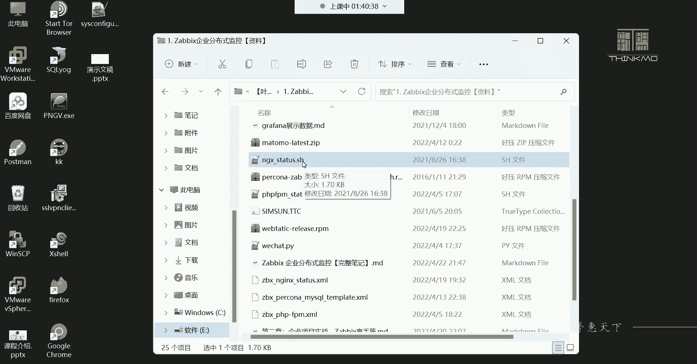

这个脚本没有任何逻辑难度，目的是让大家熟悉脚本编写的基本流程：**将顺序执行的命令放入一个文件，然后赋予执行权限并运行**。

---

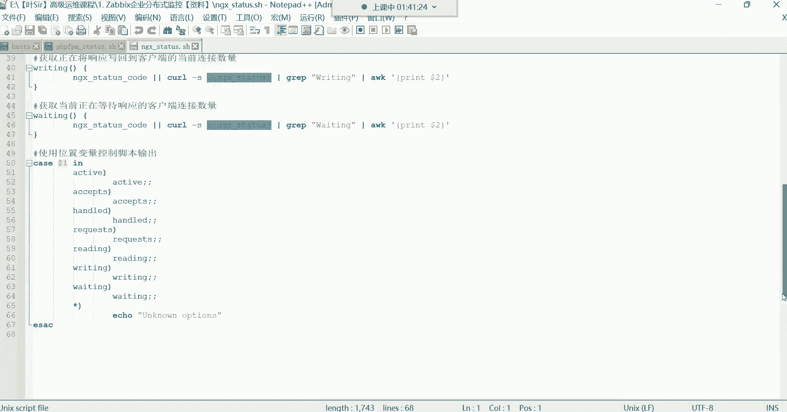

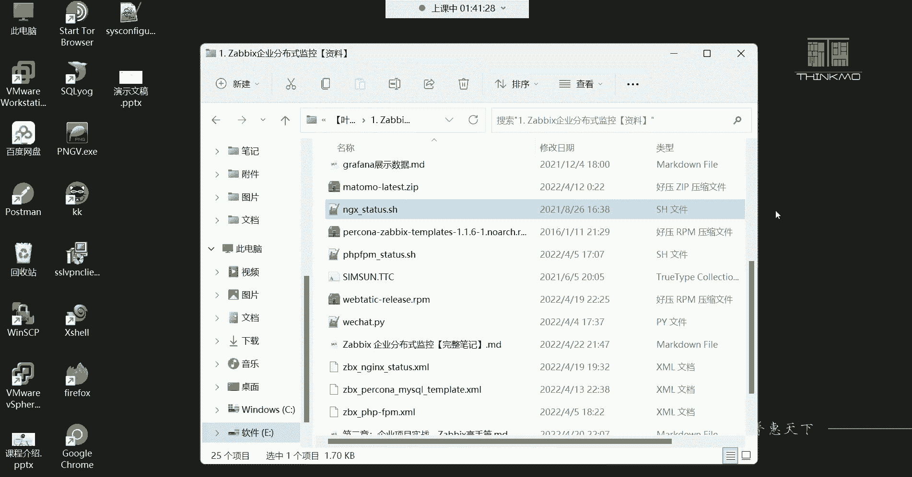

## 编写复杂脚本的思维逻辑 🧠

虽然第一个脚本很简单，但实际运维中可能需要编写数十行甚至上百行的复杂脚本。要写好这类脚本，清晰的思维逻辑至关重要。

编写脚本的通用思维流程可以归纳为以下几步：
1.  **明确需求**：确定脚本最终要完成什么任务（例如，搭建一个LAMP网站平台）。
2.  **分解步骤**：将大任务拆解为具体、可顺序执行的小步骤（第一步做什么，第二步做什么……）。
3.  **编写与测试**：将步骤对应的命令写入脚本，并运行测试。
4.  **调试与优化**：根据测试中的报错或不符合预期的结果进行修改和优化，直到脚本能稳定、正确地运行。

这个逻辑与完成任何项目或目标的思考过程是相似的。核心在于**先规划再行动**，确保每一步都清晰无误，避免逻辑混乱导致脚本失败。

---

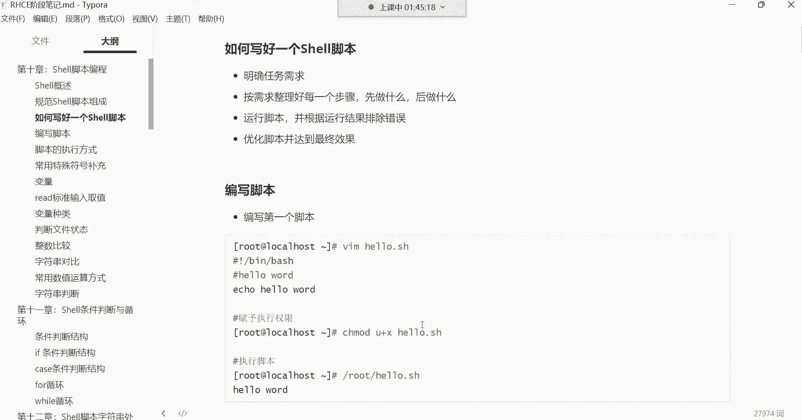

## 脚本编写的核心注意事项 ⚠️

在将命令行操作转化为脚本时，有一个至关重要的原则：**脚本中应避免使用交互式命令**。

什么是交互式命令？即在执行过程中需要用户手动输入参数或进行确认的命令。例如：
*   `passwd <用户名>`：需要手动输入密码。
*   `vim <文件名>`：会进入编辑器界面，需要手动操作。

如果这类命令出现在脚本中，脚本执行到此处就会“卡住”，等待用户输入，从而导致自动化流程中断。这显然不符合脚本“自动运行”的初衷。

**那么，如何解决呢？**
答案是使用**非交互式**的方法来达成相同目的。例如，为用户设置密码，可以使用管道传递密码，从而避免交互。

**代码示例（非交互式创建用户并设置密码）：**
```bash
#!/bin/bash
# 创建用户
useradd usr2
# 非交互式设置密码
echo "123456" | passwd --stdin usr2
```

以下是其他一些适合与不适合写入脚本的命令对比：

| 适合写入脚本的命令 (非交互式) | 不适合写入脚本的命令 (交互式) |
| :--- | :--- |
| `useradd` (创建用户) | `passwd` (设置密码，需交互) |
| `echo` (输出信息) | `vim` / `vi` (编辑文件) |
| `yum install -y` (自动确认安装) | 不加 `-y` 选项的 `yum install` |

**核心思想**：脚本应能独立运行，无需人工干预。对于必须的“交互”操作，应寻找其非交互的替代方案。

---

## 实践：编写一个系统信息查看脚本 🔍

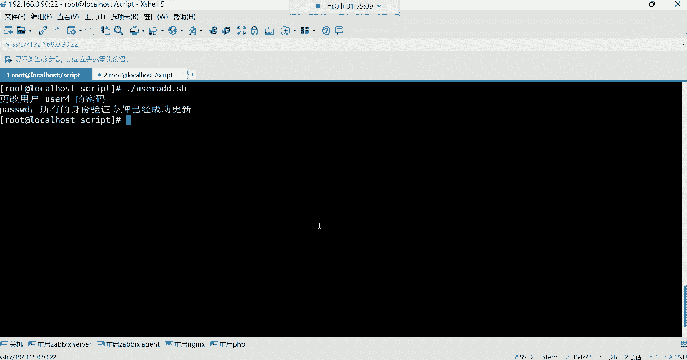

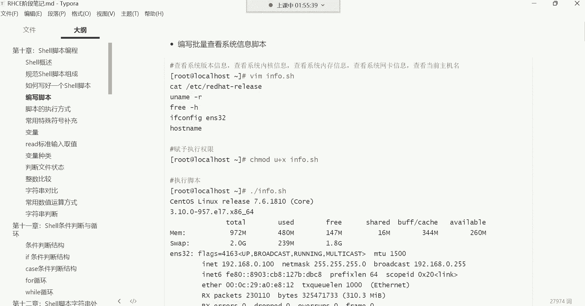

接下来，我们实践编写一个稍复杂的脚本。该脚本的功能是收集并显示主要的系统信息，如系统版本、内核、磁盘使用情况等。

这个脚本仍然是命令的集合，但通过添加一些 `echo` 提示信息和 `sleep` 暂停命令，可以提升脚本的执行体验，使其输出更清晰、更有节奏感。

**代码示例：**
```bash
#!/bin/bash
# 系统信息查看脚本

echo "========== 第一步：查看系统版本 =========="
cat /etc/centos-release
sleep 2  # 暂停2秒

echo -e "\n========== 第二步：查看内核版本 =========="
uname -rs
sleep 2

echo -e "\n========== 第三步：查看根分区磁盘使用 =========="
df -h /
sleep 2

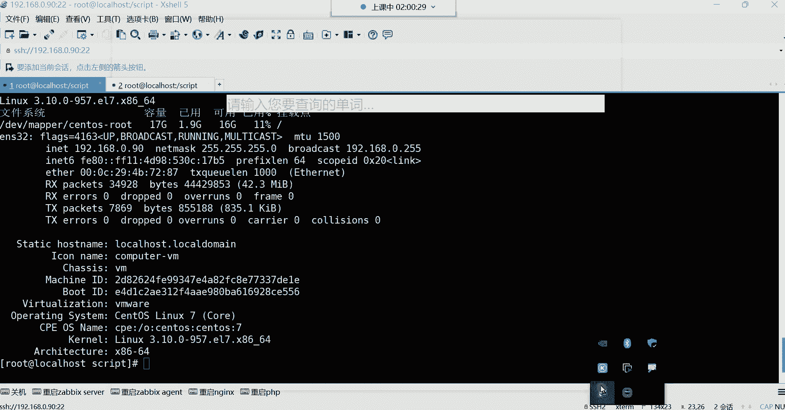

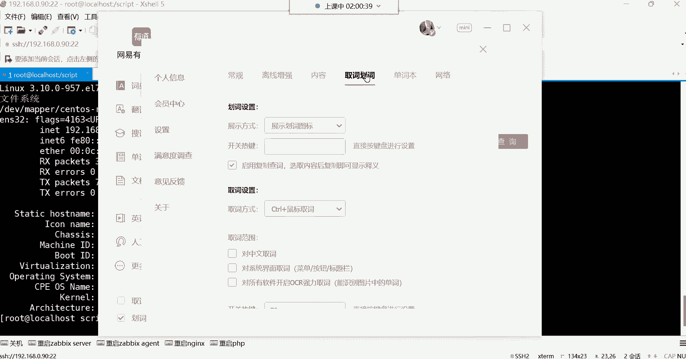

echo -e "\n========== 第四步：查看网卡信息 =========="
ifconfig ens33
sleep 2

echo -e "\n========== 第五步：查看主机名详情 =========="
hostnamectl
```

**脚本说明**：
*   `echo` 用于输出步骤提示，使结果更易读。
*   `sleep N` 让脚本在执行每条命令后暂停N秒，避免信息瞬间刷屏。
*   命令本身都是常见的系统查看命令。

保存为 `sys_info.sh`，赋予执行权限后运行，你将看到一个分步骤显示的系统信息报告。

---

## 脚本的存放与共享 📂

关于脚本文件存放在哪里，有一个实用的考虑：
*   **个人使用**：可以放在任何你有权限的目录，例如家目录下的某个文件夹。
*   **与他人共享**：如果你写的脚本需要给服务器上的其他用户使用，就不能放在 `root` 的家目录下（其他用户通常无权访问）。更好的做法是创建一个公共目录（例如 `/scripts`），设置合适的权限，将共享脚本放在那里。

**代码示例：**
```bash
# 创建共享脚本目录
mkdir /scripts
# 将脚本移动到该目录
mv sys_info.sh /scripts/
# 修改权限，让其他用户可读可执行（根据实际情况调整）
chmod 755 /scripts/sys_info.sh
```

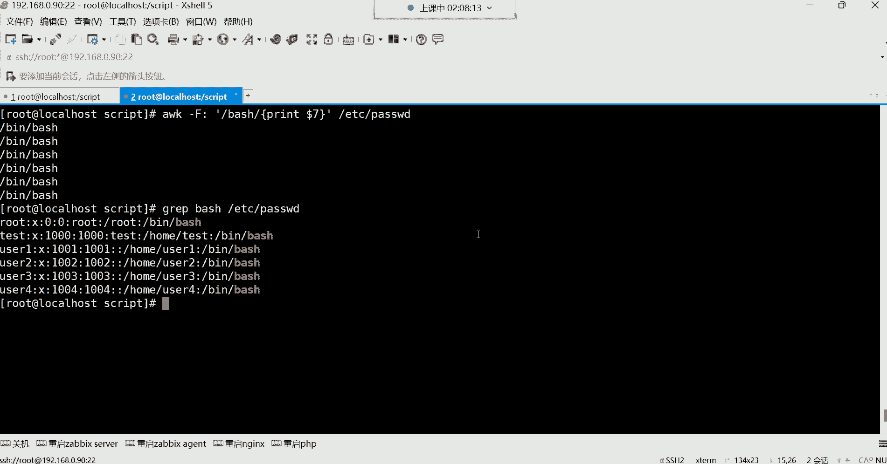

这样，其他用户就可以通过 `/scripts/sys_info.sh` 来使用这个脚本了。

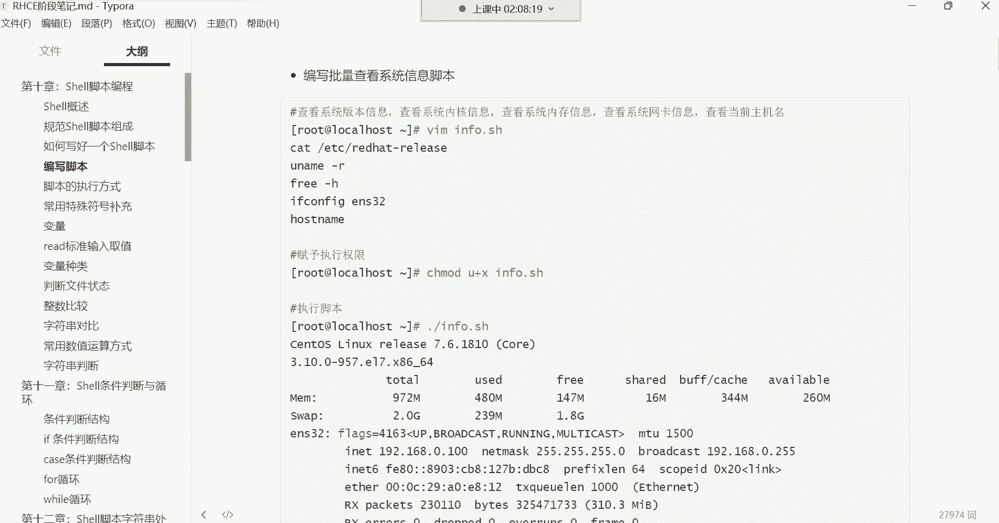

---

## 总结 📝

本节课中我们一起学习了Shell脚本编写与执行的核心知识：
1.  **脚本本质**：是将一系列命令行指令按顺序保存在文件中并自动执行。
2.  **编写流程**：遵循“明确需求 -> 分解步骤 -> 编写测试 -> 调试优化”的逻辑。
3.  **关键原则**：**避免在脚本中使用交互式命令**，确保脚本能够全自动运行。对于必须的交互操作，需使用非交互式替代方法（如 `echo “密码” | passwd –stdin 用户`）。
4.  **脚本体验**：可以通过 `echo` 添加提示和 `sleep` 添加暂停来改善脚本的输出效果。
5.  **脚本存放**：私人脚本可随意存放，共享脚本应置于其他用户有权限访问的公共目录。

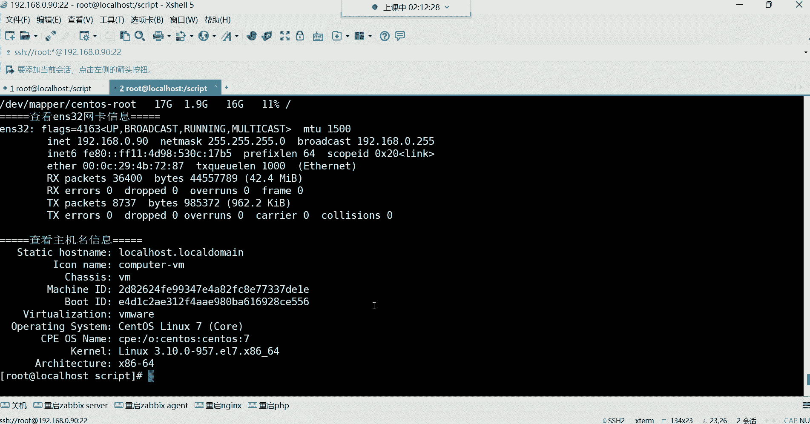

记住，学习脚本的初期目标是能够读懂和修改现有脚本，以满足自己的需求。随着学习的深入，你将能够写出更复杂、更强大的自动化脚本。