# Linux运维全套培训课程：P39：红帽RHCE-3.编写脚本、脚本执行方式 🐧

在本节课中，我们将学习如何编写一个实用的Shell脚本，并探索如何优化脚本，使其执行过程更清晰、输出更友好。我们将通过一个搭建本地YUM仓库的实例，来掌握脚本编写的基本流程和常用技巧。

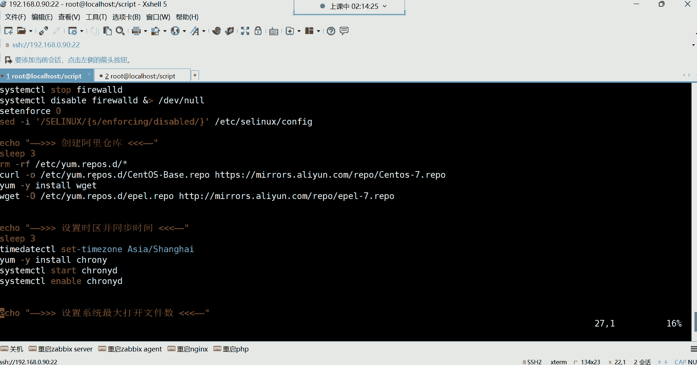


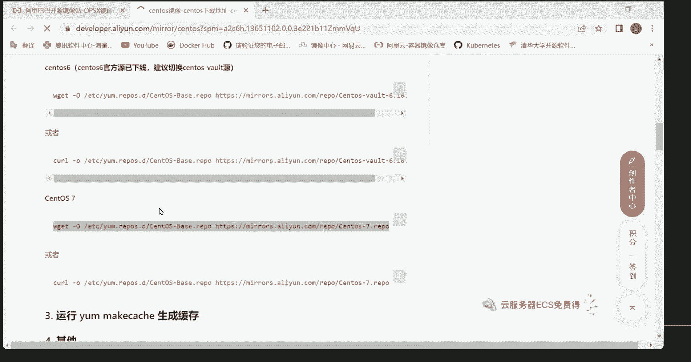

---

## 脚本执行速度控制

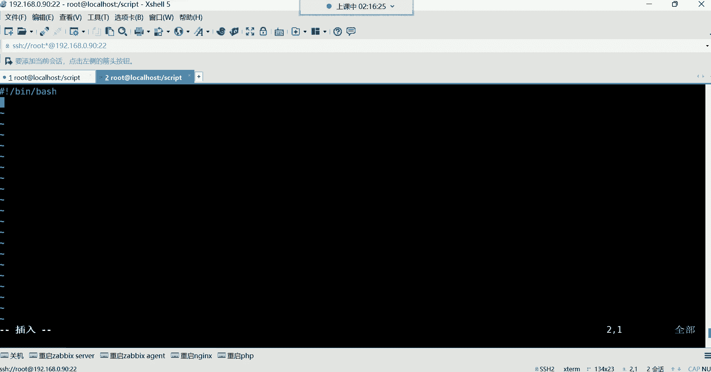

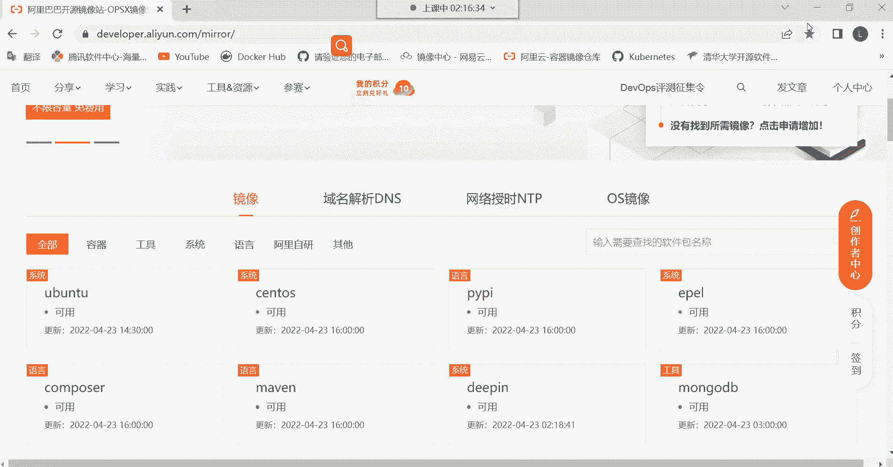

上一节我们介绍了脚本的基本结构，本节中我们来看看如何控制脚本的执行节奏。如果脚本中的命令执行过快，输出信息会瞬间刷屏，导致用户难以看清每一步的执行结果。

为了让执行过程更清晰，我们可以使用 `sleep` 命令。`sleep` 命令的作用是让脚本“休眠”指定的秒数，然后再执行后续语句。这不是让命令执行变慢，而是在命令执行后等待一段时间，从而在输出中产生停顿感，让用户能看清每一步在做什么。

**核心命令：**
```bash
sleep 3  # 脚本休眠3秒
```

---

## 分析现有脚本

以下是分析一个现有脚本的思路，即使其中包含尚未学习的命令（如防火墙配置），我们也可以先理解其整体结构。

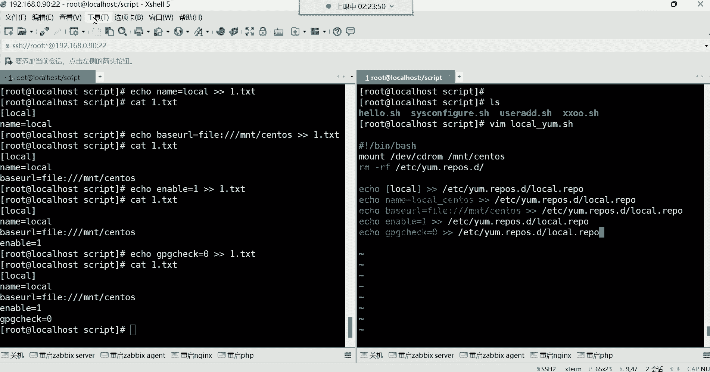

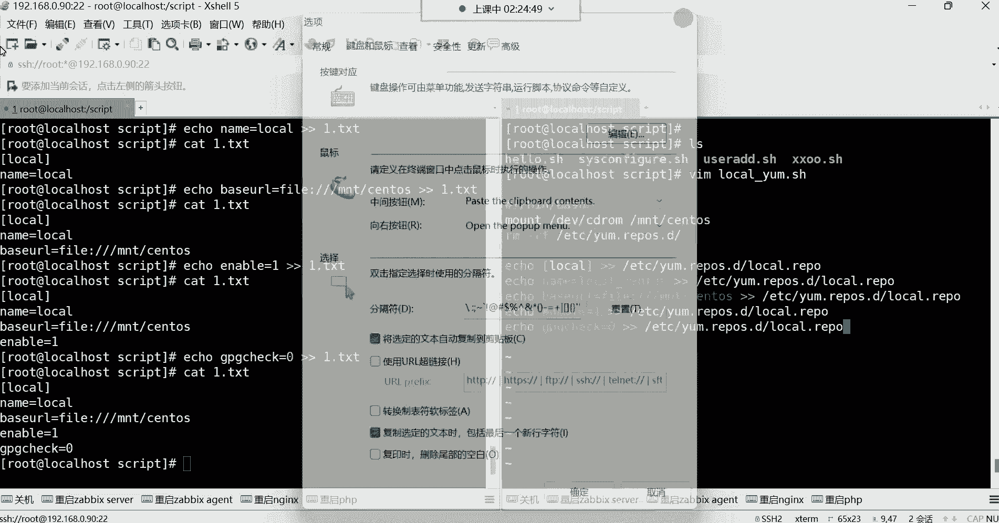

该脚本主要完成了以下任务：
1.  清空YUM仓库配置文件路径。
2.  创建阿里云YUM仓库配置文件。
3.  安装 `wget` 工具。
4.  设置系统时区和进行内核优化等。

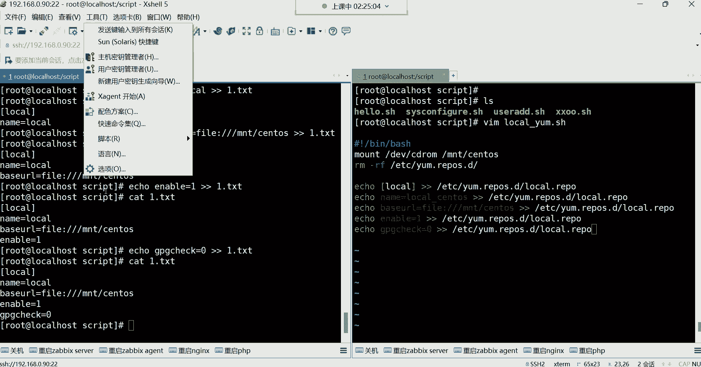

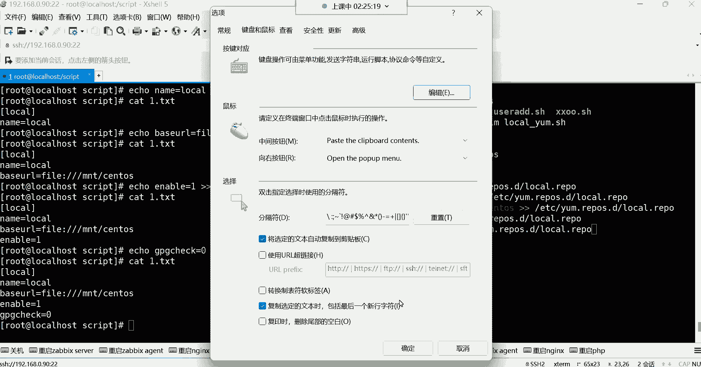

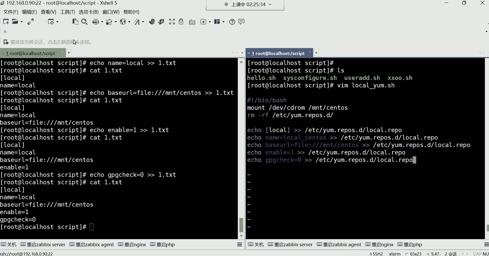


对于看不懂的命令，可以暂时跳过，重点关注能理解的部分。例如，创建阿里云仓库的本质，就是将指定的仓库配置文件下载或复制到特定目录。

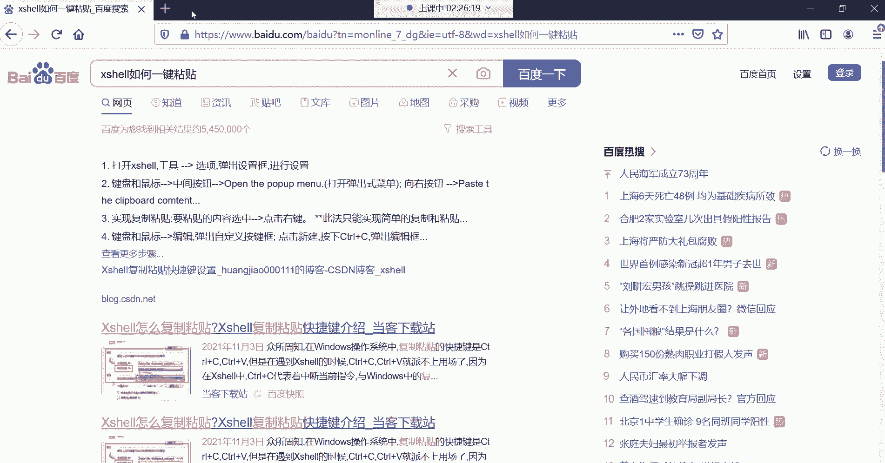


---

## 动手编写脚本：搭建本地YUM仓库

现在，让我们自己动手编写一个搭建本地YUM仓库的脚本。

**脚本目标：** 自动挂载系统镜像，并以此为基础创建本地软件仓库。

**脚本名称：** 可以自由定义，例如 `local_yum.sh`。

### 步骤分解与实现

1.  **挂载系统镜像**
    首先检查并挂载光盘镜像到 `/mnt/centos` 目录。
    ```bash
    mount /dev/cdrom /mnt/centos
    ```

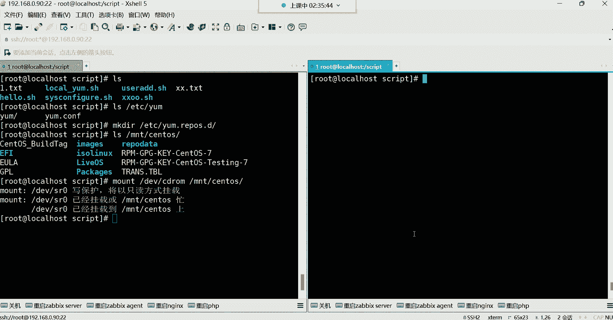

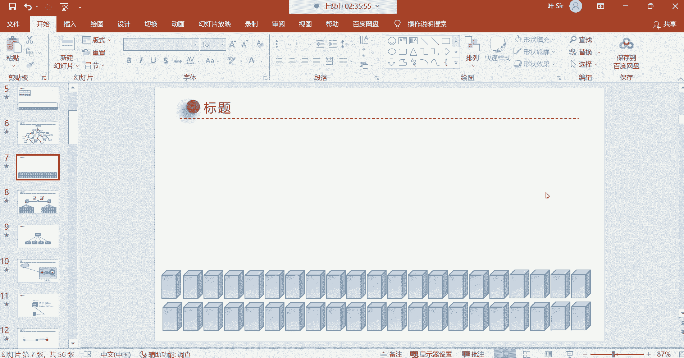

2.  **清理原有仓库配置**
    为防止干扰，清空YUM仓库配置目录下的所有文件。
    ```bash
    rm -rf /etc/yum.repos.d/*
    ```

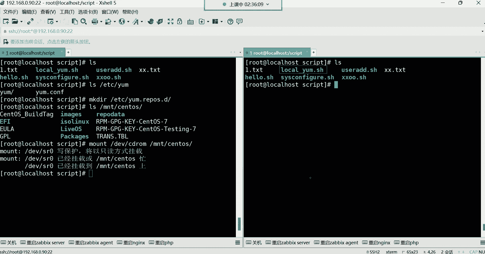

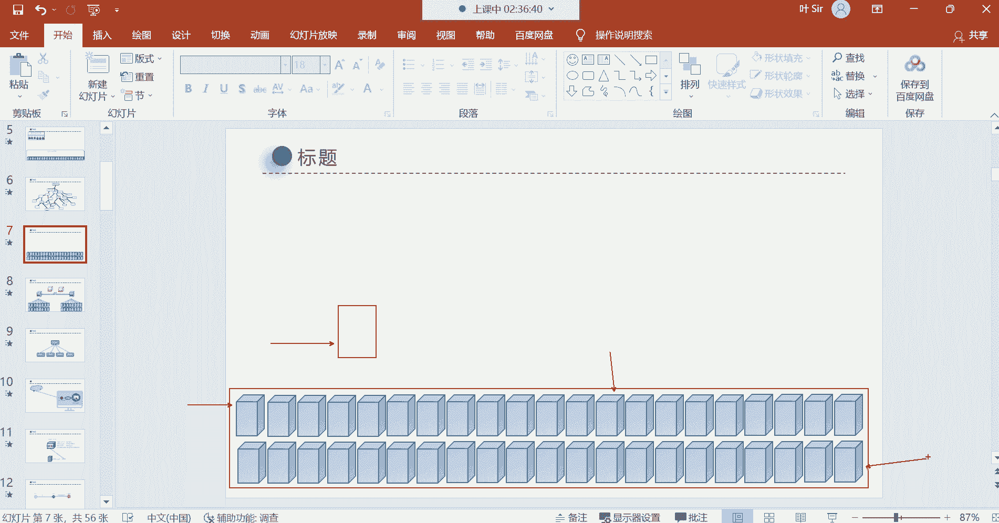

3.  **创建本地仓库配置文件**
    这是脚本的核心。我们需要在 `/etc/yum.repos.d/` 目录下创建文件（如 `local.repo`），并写入正确的仓库配置内容。
    在交互式环境中，我们可以用 `vim` 编辑。但在脚本中，我们需要非交互式的方法。以下是两种方法：

    **方法一：使用 `echo` 命令追加（不推荐，繁琐）**
    通过多次 `echo` 和 `>>`（追加）将内容写入文件。这种方法代码冗长，缺乏效率。
    ```bash
    echo “[local]” > /etc/yum.repos.d/local.repo
    echo “name=Local Repository” >> /etc/yum.repos.d/local.repo
    echo “baseurl=file:///mnt/centos” >> /etc/yum.repos.d/local.repo
    echo “enabled=1” >> /etc/yum.repos.d/local.repo
    echo “gpgcheck=0” >> /etc/yum.repos.d/local.repo
    ```

    **方法二：使用 `cat` 命令配合重定向输入（推荐）**
    使用 `cat << EOF` 结构可以优雅地将多行内容写入文件。`EOF` 是约定的结束标记符号。
    ```bash
    cat > /etc/yum.repos.d/local.repo << EOF
    [local]
    name=Local Repository
    baseurl=file:///mnt/centos
    enabled=1
    gpgcheck=0
    EOF
    ```

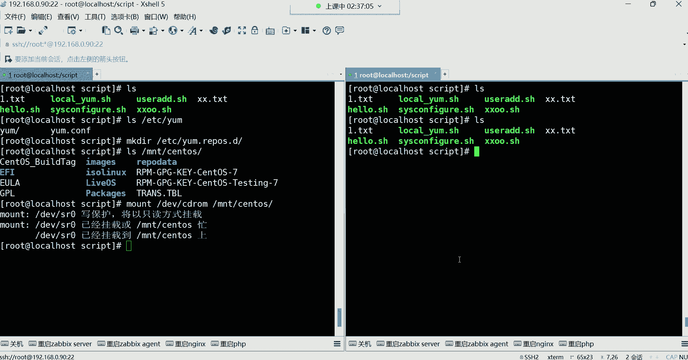

4.  **验证仓库**
    最后，使用 `yum repolist` 命令验证仓库是否创建成功，并列出可用的软件包数量。


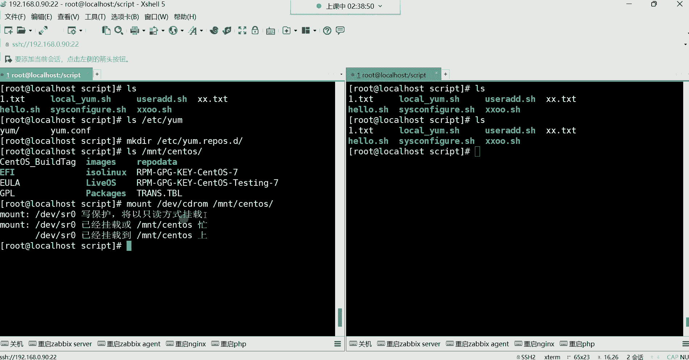


---


## 脚本优化与增强

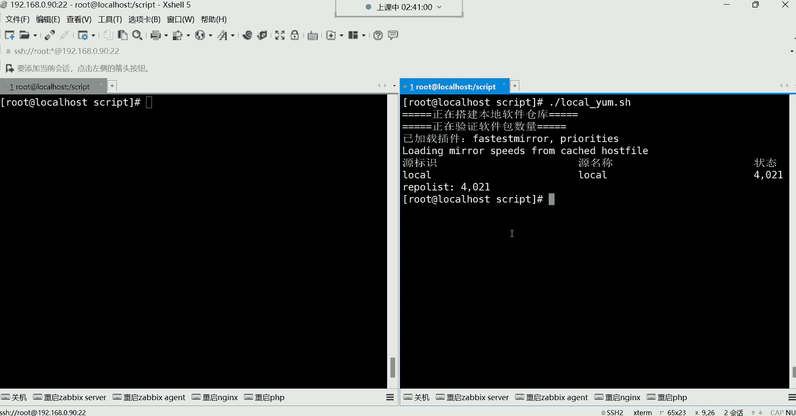

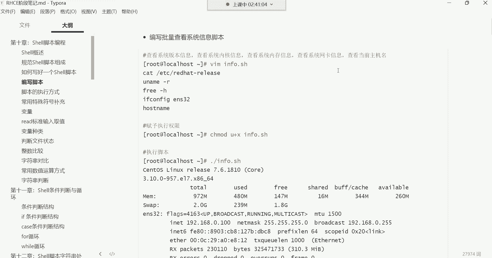

一个基础的脚本完成后，我们可以从可读性和用户体验方面对其进行优化。

### 1. 增加提示信息
在关键步骤前后使用 `echo` 输出提示信息，并用 `sleep` 暂停，让用户明确知道脚本正在进行什么操作。
```bash
echo “正在搭建本地软件仓库...”
sleep 2
# ...执行实际命令
echo “正在验证软件包数量...”
sleep 1
yum repolist
```

### 2. 简化输出信息
`yum repolist` 的默认输出包含插件信息等，我们可能只关心仓库列表。可以使用 `grep` 过滤出关键行。
```bash
yum repolist | grep repolist
```
或者，为了只提取软件包数量（这需要后续学习的 `awk` 命令）：
```bash
yum repolist | awk ‘/repolist/{print $2}’
```

### 3. 使用变量增强可读性（进阶）
将命令结果存入变量，然后输出更友好的信息。
```bash
package_count=$(yum repolist | awk ‘/repolist/{print $2}’)
echo “本地仓库可用软件包总数量为：$package_count 个”
```

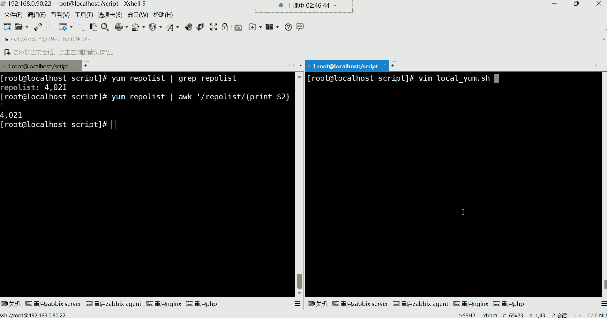

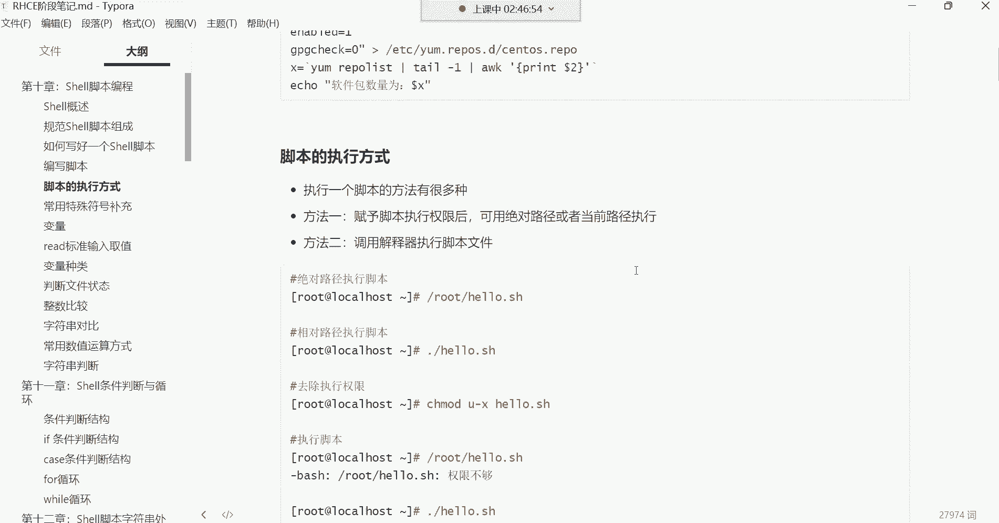

### 4. 添加“进度条”增强体验（进阶）
可以添加一段循环代码，模拟一个进度条，使脚本看起来更专业。这是一个格式固定的代码块，可以直接借鉴使用，用于提升视觉效果。
```bash
echo -n “正在配置仓库 [”
for i in {1..20}; do
    echo -n “#”
    sleep 0.1
done
echo “] 完成！”
```
**注意：** 此进度条是模拟的，并非真实反映命令执行进度，主要用于提升用户体验。

---

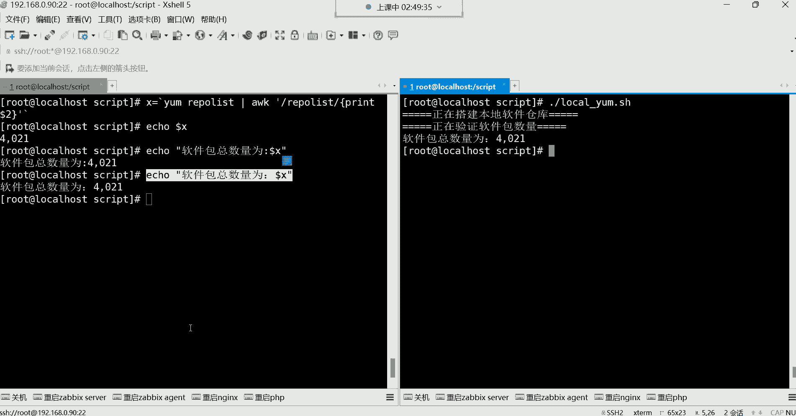

## 脚本的实用价值

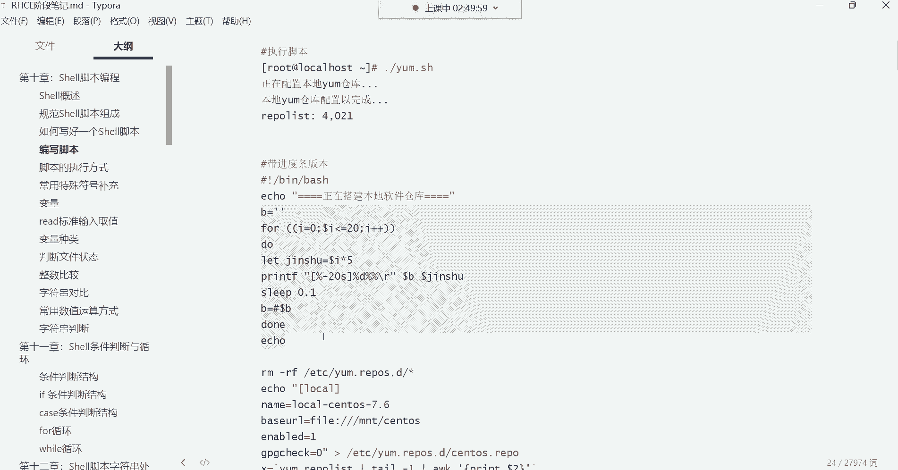

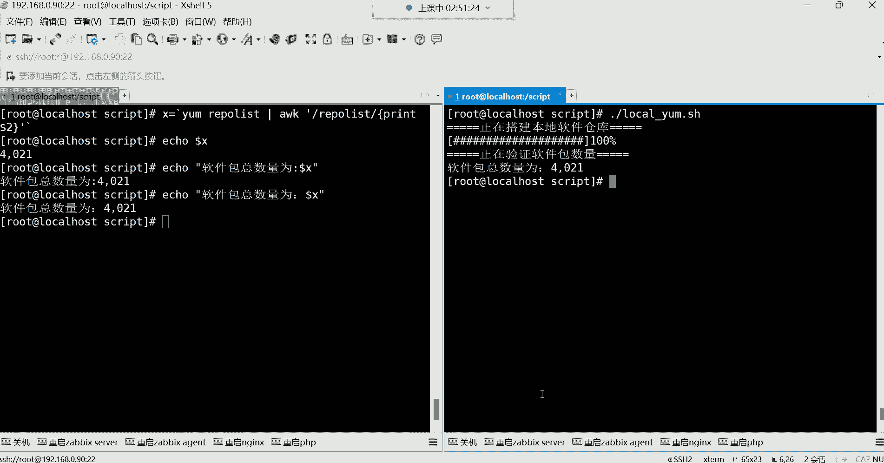

编写脚本的核心目的是**自动化重复性工作**。一旦脚本编写完成并测试通过，就可以保存下来。未来需要在任何服务器上执行相同操作时，只需运行该脚本即可，无需再手动输入一系列命令。这极大地提升了运维效率，尤其是在管理成百上千台服务器时。

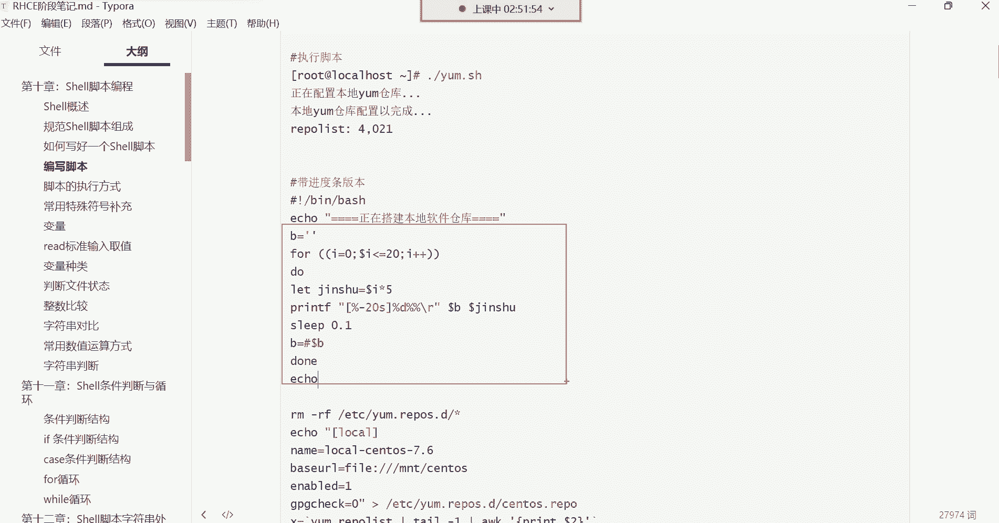

后期学习自动化工具（如Ansible）后，甚至可以做到在中心节点运行一个脚本，就能批量管理所有服务器。

---

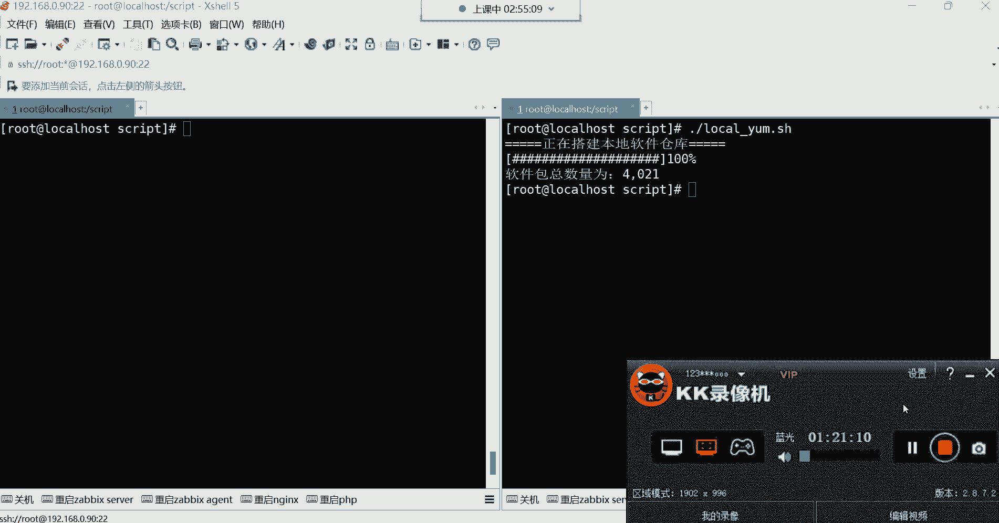

本节课中我们一起学习了如何编写一个完整的Shell脚本，从控制执行节奏、分析脚本结构，到亲手实现一个搭建本地YUM仓库的实用脚本。我们还探讨了如何通过添加提示、简化输出、使用变量和模拟进度条来优化脚本，使其更友好、更专业。记住，脚本是运维工程师自动化和简化工作的利器，不断练习和优化脚本编写能力至关重要。